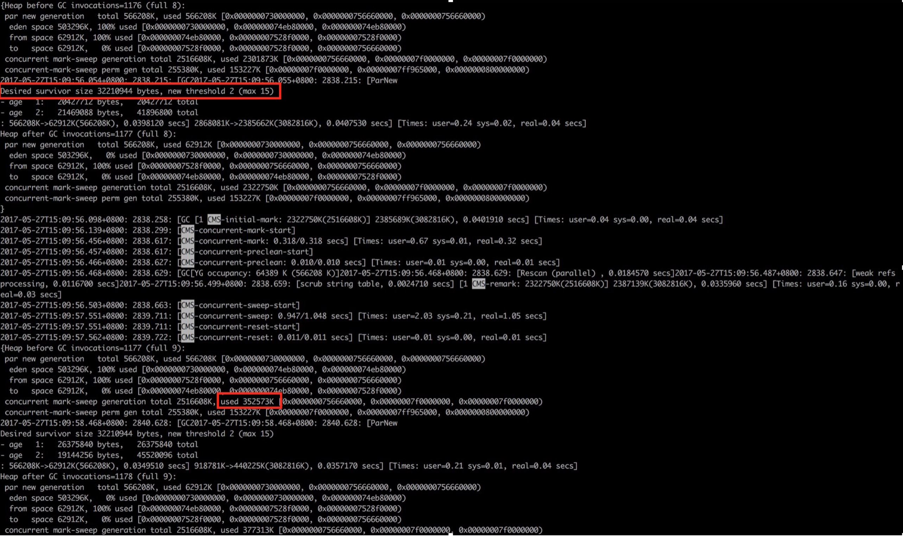

### GC参数调优的方法论

调优的目标是什么？不发生full GC还是少发生fullGC? 亦或者是GC的停顿时间要在50ms内。

> G1 由于是大内存的应用，所以目标是不发生full GC
>
> CMS是少发生Full GC，

### 1基本策略

各分区的大小对GC的性能影响很大。如何将各分区调整到合适的大小，分析活跃数据的大小是很好的切入点。

>  活跃数据的大小：**Full GC**后堆中老年代占用空间的大小。可以通过GC日志中Full GC之后老年代数据大小得出，比较准确的方法是在程序稳定后，多次获取GC数据，通过取平均值的方式计算活跃数据的大小。活跃数据和各分区之间的比例关系如下（见参考文献1 Java Performance: The definitive Guilde, Scott O）：

| 空间   | 与活跃数据大小的倍数 |
| ------ | -------------------- |
| 总大小 | 3-4倍                |
| 新生代 | 1-1.5                |
| 老年代 | 2-3                  |
| 永久代 | 1.2-1.5              |

举例：从日志知道FullGC后，总共的活跃数据大小是300M。

- xmx最大堆 = 300MB * 4 = 1200M
- xmn新生代 = 300MB*1.5 = 450M
- 老年代 = 1200M - 450M = 750M

对于Kafka而言，设置的是1.5-2倍。所以说这都是基本规则。

> 这部分设置仅仅是堆大小的初始值，后面的优化中，可能会调整这些值，具体情况取决于应用程序的特性和需求。对于Kafka而言，设置的是1.5-2 倍。

### 2 优化步骤

GC优化一般步骤可以概括为：确定目标、优化参数、验收结果。

#### 2.1 确定目标

明确应用程序的系统需求是性能优化的基础，系统的需求是指应用程序运行时某方面的要求，譬如：

- 高可用，可用性达到几个9。 
- 低延迟，请求必须多少毫秒内完成响应。 
- 高吞吐，每秒完成多少次事务。

> 以主要关注高可用和低延迟两项指标为例子。

举例：假设单位时间T内发生一次持续25ms的GC，接口平均响应时间为50ms，且请求均匀到达，根据下图所示：

> 如何计算受GC影响请求占比 = （接口响应时间+GC时间) * N / T

> - N 是单位T时间内，发生的GC次数。

#### 2.2 优化参数

通过收集GC信息，确定选择合适的GC收集器，调整内存比例，和JVM参数等。

#### 2.3 如何验收结果

有方案后，把不同的方案应用到不同的机器上，观察GC性能差异，做出最优选择。

### 3 结合优化步骤，来进行CMS案例分析

> 将所有遇到的性能问题都在这里进行案例补充。
>
> - 第一个案例：垃圾收集器选择是ParNew + CMS。

#### 3.1 Major GC 和 Minor GC 频繁

特点：Minor GC 100次每分钟，一次40ms，Major GC 每小时14次，耗时2000ms(这个地方，需要把CMS的几个阶段real time全部加起来)。 接口响应时间50ms。新生代短对象存活时间750ms，MinorGC 500ms触发一次。

- 解决方法，直接扩容新生代2倍，MinorGC 则变成1000ms触发一次。这样做可以减少对象的copy。（问:扩容Eden区虽然可以减少Minor GC的次数，但会增加单次Minor GC时间么？实际测试中，扩容了3倍，效果好)
- 效果：Minor GC 频率大约在以前的1\3，时间是5ms；Full GC 降到每小时6次，

- 经验： 如何选择各分区大小应该依赖应用程序中**对象生命周期的分布情况：如果应用存在大量的短期对象，应该选择较大的年轻代；如果存在相对较多的持久对象，老年代应该适当增大。**

> 关于上文中提到晋升年龄阈值为2，很多同学有疑问，为什么设置了MaxTenuringThreshold=15，对象仍然仅经历2次Minor GC，就晋升到老年代？这里涉及到“动态年龄计算”的概念。
>
> 动态年龄计算：Hotspot遍历所有对象时，按照年龄从小到大对其所占用的大小进行累积，当累积的某个年龄大小超过了survivor区的一半时，取这个年龄和MaxTenuringThreshold中更小的一个值，作为新的晋升年龄阈值。在本案例中，调优前：Survivor区 = 64M，desired survivor = 32M，此时Survivor区中age<=2的对象累计大小为41M，41M大于32M，所以晋升年龄阈值被设置为2，下次Minor GC时将年龄超过2的对象被晋升到老年代。

#### 3.2 请求高峰期发生GC，导致服务可用性下降

确定目标：GC日志显示，高峰期CMS在重标记（Remark）阶段耗时1.39s。Remark阶段是Stop-The-World（以下简称为STW）的，即在执行垃圾回收时，Java应用程序中除了垃圾回收器线程之外其他所有线程都被挂起，意味着在此期间，用户正常工作的线程全部被暂停下来，这是低延时服务不能接受的。本次优化目标是降低Remark时间。

- 原因：Remark阶段需要扫描整个堆，如果新生代对象比较多的话，会加大remark的时间。分析GC日志可以得出同样的规律，Remark耗时>500ms时，新生代使用率都在75%以上。这样降低Remark阶段耗时问题转换成如何减少新生代对象数量。
- 解决办法：Remark之前，触发一次MinorGC。在Remark前增加了一个可中断的并发预清理（CMS-concurrent-abortable-preclean），用来保证Remark前强制进行一次Minor GC。
- 效果：经过增加CMSScavengeBeforeRemark参数，单次执行时间>200ms的GC停顿消失，从监控上观察，GCtime和业务波动保持一致，不再有明显的毛刺。

Refer:[CMS调优](https://tech.meituan.com/2017/12/29/jvm-optimize.html)

