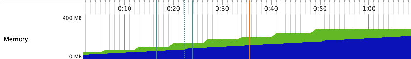
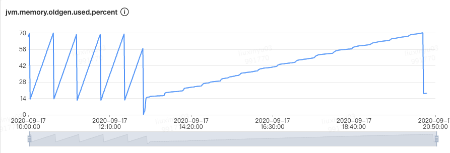
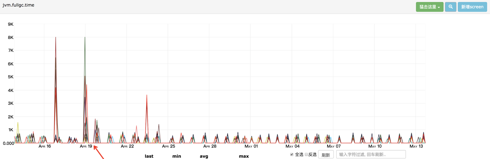
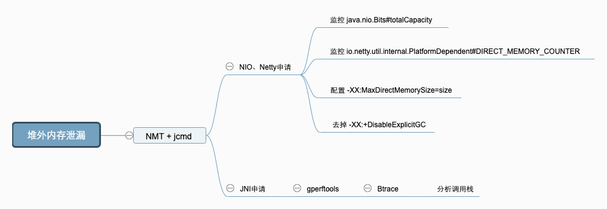

### 2.6 常用工具

工欲善其事，必先利其器，此处列出一些笔者常用的工具，具体情况大家可以自由选择，本文的问题都是使用这些工具来定位和分析的。

#### 2.6.1 命令行终端

- 标准终端类：jps、jinfo、jstat、jstack、jmap
- 功能整合类：jcmd、vjtools、arthas、greys

#### 2.6.2 可视化界面

- 简易：JConsole、JVisualvm、HA、GCHisto、GCViewer
- 进阶：MAT、JProfiler

命令行推荐 arthas ，可视化界面推荐 JProfiler，此外还有一些在线的平台 [gceasy](https://gceasy.io/)、[heaphero](https://heaphero.io/)、[fastthread](https://fastthread.io/) 

## GC 问题判断

在做 GC 问题排查和优化之前，我们需要先来明确下到底是不是 GC 直接导致的问题，或者应用代码导致的 GC 异常，最终出现问题。

### 3.1 判断 GC 有没有问题？

#### 3.1.1 设定评价标准

评判 GC 的两个核心指标：

- **延迟（Latency）：** 也可以理解为最大停顿时间，即垃圾收集过程中一次 STW 的最长时间，越短越好，一定程度上可以接受频次的增大，GC 技术的主要发展方向。
- **吞吐量（Throughput）：** 应用系统的生命周期内，由于 GC 线程会占用 Mutator 当前可用的 CPU 时钟周期，吞吐量即为 Mutator 有效花费的时间占系统总运行时间的百分比，例如系统运行了 100 min，GC 耗时 1 min，则系统吞吐量为 99%，吞吐量优先的收集器可以接受较长的停顿。

目前各大互联网公司的系统基本都更追求低延时，避免一次 GC 停顿的时间过长对用户体验造成损失，衡量指标需要结合一下应用服务的 SLA，主要如下两点来判断：


简而言之，即为**一次停顿的时间不超过应用服务的 TP9999，GC 的吞吐量不小于 99.99%**。举个例子，假设某个服务 A 的 TP9999 为 80 ms，平均 GC 停顿为 30 ms，那么该服务的最大停顿时间最好不要超过 80 ms，GC 频次控制在 5 min 以上一次。如果满足不了，那就需要调优或者通过更多资源来进行并联冗余。（大家可以先停下来，看看监控平台上面的 gc.meantime 分钟级别指标，如果超过了 6 ms 那单机 GC 吞吐量就达不到 4 个 9 了。）

备注：除了这两个指标之外还有 Footprint（资源量大小测量）、反应速度等指标，互联网这种实时系统追求低延迟，而很多嵌入式系统则追求 Footprint。

#### 3.1.2 读懂 GC Cause

拿到 GC 日志，我们就可以简单分析 GC 情况了，通过一些工具，我们可以比较直观地看到 Cause 的分布情况，如下图就是使用 gceasy 绘制的图表：


重点需要关注的几个GC Cause：

- **System.gc()：** 手动触发GC操作。
- **CMS：** CMS GC 在执行过程中的一些动作，重点关注 CMS Initial Mark 和 CMS Final Remark 两个 STW 阶段。
- **Promotion Failure：** Old 区没有足够的空间分配给 Young 区晋升的对象（即使总可用内存足够大）。
- **Concurrent Mode Failure：** CMS GC 运行期间，Old 区预留的空间不足以分配给新的对象，此时收集器会发生退化，严重影响 GC 性能，下面的一个案例即为这种场景。
- **GCLocker Initiated GC：** 如果线程执行在 JNI 临界区时，刚好需要进行 GC，此时 GC Locker 将会阻止 GC 的发生，同时阻止其他线程进入 JNI 临界区，直到最后一个线程退出临界区时触发一次 GC。

### 3.2 判断是不是 GC 引发的问题？

到底是结果（现象）还是原因，在一次 GC 问题处理的过程中，如何判断是 GC 导致的故障，还是系统本身引发 GC 问题。这里继续拿在本文开头提到的一个 Case：“GC 耗时增大、线程 Block 增多、慢查询增多、CPU 负载高等四个表象，如何判断哪个是根因？”，笔者这里根据自己的经验大致整理了四种判断方法供参考：

- **时序分析：** 先发生的事件是根因的概率更大，通过监控手段分析各个指标的异常时间点，还原事件时间线，如先观察到 CPU 负载高（要有足够的时间 Gap），那么整个问题影响链就可能是：CPU 负载高 -> 慢查询增多 -> GC 耗时增大 -> 线程Block增多 -> RT 上涨。
- **概率分析：** 使用统计概率学，结合历史问题的经验进行推断，由近到远按类型分析，如过往慢查的问题比较多，那么整个问题影响链就可能是：慢查询增多 -> GC 耗时增大 -> CPU 负载高 -> 线程 Block 增多 -> RT上涨。
- **实验分析：** 通过故障演练等方式对问题现场进行模拟，触发其中部分条件（一个或多个），观察是否会发生问题，如只触发线程 Block 就会发生问题，那么整个问题影响链就可能是：线程Block增多 -> CPU 负载高 -> 慢查询增多 -> GC 耗时增大 -> RT 上涨。
- **反证分析：** 对其中某一表象进行反证分析，即判断表象的发不发生跟结果是否有相关性，例如我们从整个集群的角度观察到某些节点慢查和 CPU 都正常，但也出了问题，那么整个问题影响链就可能是：GC 耗时增大 -> 线程 Block 增多 -> RT 上涨。

不同的根因，后续的分析方法是完全不同的。如果是 CPU 负载高那可能需要用火焰图看下热点、如果是慢查询增多那可能需要看下 DB 情况、如果是线程 Block 引起那可能需要看下锁竞争的情况，最后如果各个表象证明都没有问题，那可能 GC 确实存在问题，可以继续分析 GC 问题了。

### 3.3 问题分类导读

#### 3.3.1 Mutator 类型

Mutator 的类型根据对象存活时间比例图来看主要分为两种，在弱分代假说中也提到类似的说法，如下图所示 “Survival Time” 表示对象存活时间，“Rate” 表示对象分配比例：

- **IO 交互型：** 互联网上目前大部分的服务都属于该类型，例如**分布式 RPC**、MQ、HTTP 网关服务等，对内存要求并不大，大部分对象在 TP9999 的时间内都会死亡， Young 区越大越好。
- **MEM 计算型：** 主要是**分布式数据计算 Hadoop**，分布式存储 HBase、Cassandra，自建的分布式缓存等，对内存要求高，对象存活时间长，Old 区越大越好。

当然，除了二者之外还有介于两者之间的场景，本篇文章主要讨论第一种情况。对象 Survival Time 分布图，对我们设置 GC 参数有着非常重要的指导意义，如下图就可以简单推算分代的边界。

#### 3.3.2 GC 问题分类

笔者选取了九种不同类型的 GC 问题，覆盖了大部分场景，如果有更好的场景，欢迎在评论区给出。

- **Unexpected GC：** 意外发生的 GC，实际上不需要发生，我们可以通过一些手段去避免。
  - **Space Shock：** 空间震荡问题，参见“场景一：动态扩容引起的空间震荡”。
  - **Explicit GC：** 显示执行 GC 问题，参见“场景二：显式 GC 的去与留”。
- **Partial GC：** 部分收集操作的 GC，只对某些分代/分区进行回收。
  - **Young GC：** 分代收集里面的 Young 区收集动作，也可以叫做 Minor GC。
    - **ParNew：** Young GC 频繁，参见“场景四：过早晋升”。
  - **Old GC：** 分代收集里面的 Old 区收集动作，也可以叫做 Major GC，有些也会叫做 Full GC，但其实这种叫法是不规范的，在 CMS 发生 Foreground GC 时才是 Full GC，CMSScavengeBeforeRemark 参数也只是在 Remark 前触发一次Young GC。
    - **CMS：** Old GC 频繁，参见“场景五：CMS Old GC 频繁”。
    - **CMS：** Old GC 不频繁但单次耗时大，参见“场景六：单次 CMS Old GC 耗时长”。
- **Full GC：** 全量收集的 GC，对整个堆进行回收，STW 时间会比较长，一旦发生，影响较大，也可以叫做 Major GC，参见“场景七：内存碎片&收集器退化”。
- **MetaSpace：** 元空间回收引发问题，参见“场景三：MetaSpace 区 OOM”。
- **Direct Memory：** 直接内存（也可以称作为堆外内存）回收引发问题，参见“场景八：堆外内存 OOM”。
- **JNI：** 本地 Native 方法引发问题，参见“场景九：JNI 引发的 GC 问题”。

#### 3.3.3 排查难度

一个问题的**解决难度跟它的常见程度成反比**，大部分我们都可以通过各种搜索引擎找到类似的问题，然后用同样的手段尝试去解决。当一个问题在各种网站上都找不到相似的问题时，那么可能会有两种情况，一种这不是一个问题，另一种就是遇到一个隐藏比较深的问题，遇到这种问题可能就要深入到源码级别去调试了。以下 GC 问题场景，排查难度从上到下依次递增。

## 4. 常见场景分析与解决

### 4.1 场景一：动态扩容引起的空间震荡

#### 4.1.1 现象

服务**刚刚启动时 GC 次数较多**，最大空间剩余很多但是依然发生 GC，这种情况我们可以通过观察 GC 日志或者通过监控工具来观察堆的空间变化情况即可。GC Cause 一般为 Allocation Failure，且在 GC 日志中会观察到经历一次 GC ，堆内各个空间的大小会被调整，如下图所示：



#### 4.1.2 原因

在 JVM 的参数中 `-Xms` 和 `-Xmx` 设置的不一致，在初始化时只会初始 `-Xms` 大小的空间存储信息，每当空间不够用时再向操作系统申请，这样的话必然要进行一次 GC。具体是通过 `ConcurrentMarkSweepGeneration::compute_new_size()` 方法计算新的空间大小：

另外，如果空间剩余很多时也会进行缩容操作，JVM 通过 `-XX:MinHeapFreeRatio` 和 `-XX:MaxHeapFreeRatio` 来控制扩容和缩容的比例，调节这两个值也可以控制伸缩的时机，例如扩容便是使用 `GenCollectedHeap::expand_heap_and_allocate()` 来完成的

#### 4.1.3 策略

**定位**：观察 CMS GC 触发时间点 Old/MetaSpace 区的 committed 占比是不是一个固定的值，或者像上文提到的观察总的内存使用率也可以。

**解决**：尽量**将成对出现的空间大小配置参数设置成固定的**，如 `-Xms` 和 `-Xmx`，`-XX:MaxNewSize` 和 `-XX:NewSize`，`-XX:MetaSpaceSize` 和 `-XX:MaxMetaSpaceSize` 等。

#### 4.1.4 小结

一般来说，我们需要保证 Java 虚拟机的堆是稳定的，确保 `-Xms` 和 `-Xmx` 设置的是一个值（即初始值和最大值一致），获得一个稳定的堆，同理在 MetaSpace 区也有类似的问题。不过在不追求停顿时间的情况下震荡的空间也是有利的，可以动态地伸缩以节省空间，例如作为富客户端的 Java 应用。

这个问题虽然初级，但是发生的概率还真不小，尤其是在一些规范不太健全的情况下。

### 4.2 场景二：手动调用了 System.gc 方法

#### 4.2.1 现象

除了扩容缩容会触发 CMS GC 之外，还有 Old 区达到回收阈值、MetaSpace 空间不足、Young 区晋升失败、大对象担保失败等几种触发条件，如果这些情况都没有发生却触发了 GC ？这种情况有可能是代码中手动调用了 System.gc 方法，此时可以找到 GC 日志中的 GC Cause 确认下。那么这种 GC 到底有没有问题，翻看网上的一些资料，有人说可以添加 `-XX:+DisableExplicitGC` 参数来避免这种 GC，也有人说不能加这个参数，加了就会影响 Native Memory 的回收。先说结论，笔者这里建议保留 System.gc，那为什么要保留？我们一起来分析下。

#### 4.2.2 原因

找到 System.gc 在 Hotspot 中的源码，可以发现增加 `-XX:+DisableExplicitGC` 参数后，这个方法变成了一个空方法，如果没有加的话便会调用 `Universe::heap()::collect` 方法，继续跟进到这个方法中，发现 System.gc 会引发一次 STW 的 Full GC，对整个堆做收集。

**保留 System.gc**

此处补充一个知识点，**CMS GC 共分为 Background 和 Foreground 两种模式**，前者就是我们常规理解中的并发收集，可以不影响正常的业务线程运行，但 Foreground Collector 却有很大的差异，他会进行一次压缩式 GC。此压缩式 GC 使用的是跟 Serial Old GC 一样的 Lisp2 算法，其使用 Mark-Compact 来做 Full GC，一般称之为 MSC（Mark-Sweep-Compact），它收集的范围是 Java 堆的 Young 区和 Old 区以及 MetaSpace。由上面的算法章节中我们知道 compact 的代价是巨大的，那么使用 Foreground Collector 时将会带来非常长的 STW。如果在应用程序中 System.gc 被频繁调用，那就非常危险了。

**去掉 System.gc**

如果禁用掉的话就会带来另外一个内存泄漏问题，此时就需要说一下 DirectByteBuffer，它有着零拷贝等特点，被 Netty 等各种 NIO 框架使用，会使用到堆外内存。堆内存由 JVM 自己管理，堆外内存必须要手动释放，DirectByteBuffer 没有 Finalizer，它的 Native Memory 的清理工作是通过 `sun.misc.Cleaner` 自动完成的，是一种基于 PhantomReference 的清理工具，比普通的 Finalizer 轻量些。

为 DirectByteBuffer 分配空间过程中会显式调用 System.gc ，希望通过 Full GC 来强迫已经无用的 DirectByteBuffer 对象释放掉它们关联的 Native Memory，下面为代码实现：

HotSpot VM 只会在 Old GC 的时候才会对 Old 中的对象做 Reference Processing，而在 Young GC 时只会对 Young 里的对象做 Reference Processing。Young 中的 DirectByteBuffer 对象会在 Young GC 时被处理，也就是说，做 CMS GC 的话会对 Old 做 Reference Processing，进而能触发 Cleaner 对已死的 DirectByteBuffer 对象做清理工作。但如果很长一段时间里没做过 GC 或者只做了 Young GC 的话则不会在 Old 触发 Cleaner 的工作，那么就可能让本来已经死亡，但已经晋升到 Old 的 DirectByteBuffer 关联的 Native Memory 得不到及时释放。这几个实现特征使得依赖于 System.gc 触发 GC 来保证 DirectByteMemory 的清理工作能及时完成。如果打开了 `-XX:+DisableExplicitGC`，清理工作就可能得不到及时完成，于是就有发生 Direct Memory 的 OOM。

#### 4.2.3 策略

通过上面的分析看到，无论是保留还是去掉都会有一定的风险点，不过目前互联网中的 **RPC 通信会大量使用 NIO**，所以笔者在这里建议保留。此外 JVM 还提供了 `-XX:+ExplicitGCInvokesConcurrent` 和 `-XX:+ExplicitGCInvokesConcurrentAndUnloadsClasses` 参数来将 System.gc 的触发类型从 Foreground 改为 Background，同时 Background 也会做 Reference Processing，这样的话就能大幅降低了 STW 开销，同时也不会发生 NIO Direct Memory OOM。

#### 4.2.4 小结

不止 CMS，在 G1 或 ZGC中开启 `ExplicitGCInvokesConcurrent` 模式，都会采用高性能的并发收集方式进行收集，不过还是建议在代码规范方面也要做好约束，规范好 System.gc 的使用。

P.S. HotSpot 对 System.gc 有特别处理，最主要的地方体现在一次 System.gc 是否与普通 GC 一样会触发 GC 的统计/阈值数据的更新，HotSpot 里的许多 GC 算法都带有自适应的功能，会根据先前收集的效率来决定接下来的 GC 中使用的参数，但 System.gc 默认不更新这些统计数据，避免用户强行 GC 对这些自适应功能的干扰（可以参考 -XX:+UseAdaptiveSizePolicyWithSystemGC 参数，默认是 false）。

### 4.3 场景三：MetaSpace 区 OOM

#### 4.3.1 现象

JVM 在启动后或者某个时间点开始，**MetaSpace 的已使用大小在持续增长，同时每次 GC 也无法释放，调大 MetaSpace 空间也无法彻底解决**。

#### 4.3.2 原因

在讨论为什么会 OOM 之前，我们先来看一下这个区里面会存什么数据，Java7 之前字符串常量池被放到了 Perm 区，所有被 intern 的 String 都会被存在这里，由于 String.intern 是不受控的，所以 `-XX:MaxPermSize` 的值也不太好设置，经常会出现 `java.lang.OutOfMemoryError: PermGen space` 异常，所以在 Java7 之后常量池等字面量（Literal）、类静态变量（Class Static）、符号引用（Symbols Reference）等几项被移到 Heap 中。而 Java8 之后 PermGen 也被移除，取而代之的是 MetaSpace。

在最底层，JVM 通过 mmap 接口向操作系统申请内存映射，每次申请 2MB 空间，这里是虚拟内存映射，不是真的就消耗了主存的 2MB，只有之后在使用的时候才会真的消耗内存。申请的这些内存放到一个链表中 VirtualSpaceList，作为其中的一个 Node。

在上层，MetaSpace 主要由 Klass Metaspace 和 NoKlass Metaspace 两大部分组成。

- **Klass MetaSpace：** 就是用来存 Klass 的，就是 Class 文件在 JVM 里的运行时数据结构，这部分默认放在 Compressed Class Pointer Space 中，是一块连续的内存区域，紧接着 Heap。Compressed Class Pointer Space 不是必须有的，如果设置了 `-XX:-UseCompressedClassPointers`，或者 `-Xmx` 设置大于 32 G，就不会有这块内存，这种情况下 Klass 都会存在 NoKlass Metaspace 里。
- **NoKlass MetaSpace：** 专门来存 Klass 相关的其他的内容，比如 Method，ConstantPool 等，可以由多块不连续的内存组成。虽然叫做 NoKlass Metaspace，但是也其实可以存 Klass 的内容，上面已经提到了对应场景。

MetaSpace 的对象为什么无法释放，我们看下面两点：

- **MetaSpace 内存管理：** 类和其元数据的生命周期与其对应的类加载器相同，只要类的类加载器是存活的，在 Metaspace 中的类元数据也是存活的，不能被回收。每个加载器有单独的存储空间，通过 ClassLoaderMetaspace 来进行管理 SpaceManager* 的指针，相互隔离的。
- **MetaSpace 弹性伸缩：** 由于 MetaSpace 空间和 Heap 并不在一起，所以这块的空间可以不用设置或者单独设置，一般情况下避免 MetaSpace 耗尽 VM 内存都会设置一个 MaxMetaSpaceSize，在运行过程中，如果实际大小小于这个值，JVM 就会通过 `-XX:MinMetaspaceFreeRatio` 和 `-XX:MaxMetaspaceFreeRatio` 两个参数动态控制整个 MetaSpace 的大小，具体使用可以看 `MetaSpaceGC::compute_new_size()` 方法（下方代码），这个方法会在 CMSCollector 和 G1CollectorHeap 等几个收集器执行 GC 时调用。这个里面会根据 `used_after_gc`，`MinMetaspaceFreeRatio` 和 `MaxMetaspaceFreeRatio` 这三个值计算出来一个新的 `_capacity_until_GC` 值（水位线）。然后根据实际的 `_capacity_until_GC` 值使用 `MetaspaceGC::inc_capacity_until_GC()` 和 `MetaspaceGC::dec_capacity_until_GC()` 进行 expand 或 shrink，这个过程也可以参照场景一中的伸缩模型进行理解。

由场景一可知，为了避免弹性伸缩带来的额外 GC 消耗，我们会将 `-XX:MetaSpaceSize` 和 `-XX:MaxMetaSpaceSize` 两个值设置为固定的，但是这样也会导致在空间不够的时候无法扩容，然后频繁地触发 GC，最终 OOM。所以关键原因就是 ClassLoader 不停地在内存中 load 了新的 Class ，一般这种问题都发生在动态类加载等情况上。

#### 4.3.3 策略

了解大概什么原因后，如何定位和解决就很简单了，可以 dump 快照之后通过 JProfiler 或 MAT 观察 Classes 的 Histogram（直方图） 即可，或者直接通过命令即可定位， jcmd 打几次 Histogram 的图，看一下具体是哪个包下的 Class 增加较多就可以定位了。不过有时候也要结合InstBytes、KlassBytes、Bytecodes、MethodAll 等几项指标综合来看下。如下图便是笔者使用 jcmd 排查到一个 Orika 的问题。

```shell
jcmd <PID> GC.class_stats|awk '{print$13}'|sed  's/\(.*\)\.\(.*\)/\1/g'|sort |uniq -c|sort -nrk1
```

如果无法从整体的角度定位，可以添加 `-XX:+TraceClassLoading` 和 `-XX:+TraceClassUnLoading` 参数观察详细的类加载和卸载信息。

#### 4.3.4 小结

原理理解比较复杂，但定位和解决问题会比较简单，经常会出问题的几个点有 Orika 的 classMap、JSON 的 ASMSerializer、Groovy 动态加载类等，基本都集中在反射、Javasisit 字节码增强、CGLIB 动态代理、OSGi 自定义类加载器等的技术点上。另外就是及时给 MetaSpace 区的使用率加一个监控，如果指标有波动提前发现并解决问题。

### 4.4 场景四：过早晋升 （要掌握）*

#### 4.4.1 现象

这种场景主要发生在分代的收集器上面，专业的术语称为“Premature Promotion”。90% 的对象朝生夕死，只有在 Young 区经历过几次 GC 的洗礼后才会晋升到 Old 区，每经历一次 GC 对象的 GC Age 就会增长 1，最大通过 `-XX:MaxTenuringThreshold` 来控制。

过早晋升一般不会直接影响 GC，总会伴随着浮动垃圾、大对象担保失败等问题，但这些问题不是立刻发生的，我们可以观察以下几种现象来判断是否发生了过早晋升。

**分配速率接近于晋升速率**，对象晋升年龄较小。

GC 日志中出现“Desired survivor size 107347968 bytes, **new threshold 1(max 6)**”等信息，说明此时经历过一次 GC 就会放到 Old 区。

**Full GC 比较频繁**，且经历过一次 GC 之后 Old 区的**变化比例非常大**。

比如说 Old 区触发的回收阈值是 80%，经历过一次 GC 之后下降到了 10%，这就说明 Old 区的 70% 的对象存活时间其实很短，如下图所示，Old 区大小每次 GC 后从 2.1G 回收到 300M，也就是说回收掉了 1.8G 的垃圾，只有 **300M 的活跃对象**。整个 Heap 目前是 4G，活跃对象只占了不到十分之一。


过早晋升的危害：

- Young GC 频繁，总的吞吐量下降。
- Full GC 频繁，可能会有较大停顿。

#### 4.4.2 原因

主要的原因有以下两点：

- **Young/Eden 区过小：** 过小的直接后果就是 Eden 被装满的时间变短，本应该回收的对象参与了 GC 并晋升，Young GC 采用的是复制算法，由基础篇我们知道 copying 耗时远大于 mark，也就是 Young GC 耗时本质上就是 copy 的时间（CMS 扫描 Card Table 或 G1 扫描 Remember Set 出问题的情况另说），没来及回收的对象增大了回收的代价，所以 Young GC 时间增加，同时又无法快速释放空间，Young GC 次数也跟着增加。
- **分配速率过大：** 可以观察出问题前后 Mutator 的分配速率，如果有明显波动可以尝试观察网卡流量、存储类中间件慢查询日志等信息，看是否有大量数据被加载到内存中。

同时无法 GC 掉对象还会带来另外一个问题，引发动态年龄计算：JVM 通过 `-XX:MaxTenuringThreshold` 参数来控制晋升年龄，每经过一次 GC，年龄就会加一，达到最大年龄就可以进入 Old 区，最大值为 15（因为 JVM 中使用 4 个比特来表示对象的年龄）。设定固定的 MaxTenuringThreshold 值作为晋升条件：

- MaxTenuringThreshold 如果设置得过大，原本应该晋升的对象一直停留在 Survivor 区，直到 Survivor 区溢出，一旦溢出发生，Eden + Survivor 中对象将不再依据年龄全部提升到 Old 区，这样对象老化的机制就失效了。
- MaxTenuringThreshold 如果设置得过小，过早晋升即对象不能在 Young 区充分被回收，大量短期对象被晋升到 Old 区，Old 区空间迅速增长，引起频繁的 Major GC，分代回收失去了意义，严重影响 GC 性能。

相同应用在不同时间的表现不同，特殊任务的执行或者流量成分的变化，都会导致对象的生命周期分布发生波动，那么固定的阈值设定，因为无法动态适应变化，会造成和上面问题，所以 Hotspot 会使用动态计算的方式来调整晋升的阈值。

#### 4.4.3 策略

知道问题原因后我们就有解决的方向，如果是 **Young/Eden 区过小**，我们可以在总的 Heap 内存不变的情况下适当增大 Young 区，具体怎么增加？**一般情况下 Old 的大小应当为活跃对象的 2~3 倍左右，考虑到浮动垃圾问题最好在 3 倍左右，剩下的都可以分给 Young 区。**

拿笔者的一次典型过早晋升优化来看，原配置为 Young 1.2G + Old 2.8G，通过观察 CMS GC 的情况找到存活对象大概为 300~400M，于是调整 Old 1.5G 左右，剩下 2.5G 分给 Young 区。仅仅调了一个 Young 区大小参数（`-Xmn`），整个 JVM 一分钟 Young GC 从 26 次降低到了 11 次，单次时间也没有增加，总的 GC 时间从 1100ms 降低到了 500ms，CMS GC 次数也从 40 分钟左右一次降低到了 7 小时 30 分钟一次。



如果是分配速率过大：

- **偶发较大**：通过内存分析工具找到问题代码，从业务逻辑上做一些优化。
- **一直较大**：当前的 Collector 已经不满足 Mutator 的期望了，这种情况要么扩容 Mutator 的 VM，要么调整 GC 收集器类型或加大空间。

#### 4.4.4 小结

过早晋升问题一般不会特别明显，但日积月累之后可能会爆发一波收集器退化之类的问题，所以我们还是要提前避免掉的，可以看看自己系统里面是否有这些现象，如果比较匹配的话，可以尝试优化一下。一行代码优化的 ROI 还是很高的。

如果在观察 Old 区前后比例变化的过程中，发现可以回收的比例非常小，如从 80% 只回收到了 60%，说明我们大部分对象都是存活的，Old 区的空间可以适当调大些。

> 关于在调整 Young 与 Old 的比例时，如何选取具体的 NewRatio 值，这里将问题抽象成为一个蓄水池模型，找到以下关键衡量指标，大家可以根据自己场景进行推算。

### 4.5 场景五：CMS Old GC 频繁*

#### 4.5.1 现象

Old 区频繁的做 CMS GC，但是每次耗时不是特别长，整体最大 STW 也在可接受范围内，但由于 GC 太频繁导致吞吐下降比较多。

#### 4.5.2 原因

这种情况比较常见，基本都是一次 Young GC 完成后，负责处理 CMS GC 的一个后台线程 concurrentMarkSweepThread 会不断地轮询，使用 `shouldConcurrentCollect()` 方法做一次检测，判断是否达到了回收条件。如果达到条件，使用 `collect_in_background()` 启动一次 Background 模式 GC。轮询的判断是使用 `sleepBeforeNextCycle()` 方法，间隔周期为 `-XX:CMSWaitDuration` 决定，默认为2s。

分析其中逻辑判断是否触发 GC，分为以下几种情况：

- **触发 CMS GC：** 通过调用 `_collector->collect_in_background()` 进行触发 Background GC 。
  - CMS 默认采用 JVM 运行时的统计数据判断是否需要触发 CMS GC，如果需要根据 `-XX:CMSInitiatingOccupancyFraction` 的值进行判断，需要设置参数 `-XX:+UseCMSInitiatingOccupancyOnly`。
  - 如果开启了 `-XX:UseCMSInitiatingOccupancyOnly` 参数，判断当前 Old 区使用率是否大于阈值，则触发 CMS GC，该阈值可以通过参数 `-XX:CMSInitiatingOccupancyFraction` 进行设置，如果没有设置，默认为 92%。
  - 如果之前的 Young GC 失败过，或者下次 Young 区执行 Young GC 可能失败，这两种情况下都需要触发 CMS GC。
  - CMS 默认不会对 MetaSpace 或 Perm 进行垃圾收集，如果希望对这些区域进行垃圾收集，需要设置参数 `-XX:+CMSClassUnloadingEnabled`。
- **触发 Full GC：** 直接进行 Full GC，这种情况到场景七中展开说明。
  - 如果 `_full_gc_requested` 为真，说明有明确的需求要进行 GC，比如调用 System.gc。
  - 在 Eden 区为对象或 TLAB 分配内存失败，导致一次 Young GC，在 `GenCollectorPolicy` 类的 `satisfy_failed_allocation()` 方法中进行判断。

大家可以看一下源码中的日志打印，通过日志我们就可以比较清楚地知道具体的原因，然后就可以着手分析了。

#### 4.5.3 策略

我们这里还是拿最常见的达到回收比例这个场景来说，与过早晋升不同的是这些对象确实存活了一段时间，Survival Time 超过了 TP9999 时间，但是又达不到长期存活，如各种数据库、网络链接，带有失效时间的缓存等。

处理这种常规内存泄漏问题基本是一个思路，主要步骤如下：


Dump Diff 和 Leak Suspects 比较直观就不介绍了，这里说下其它几个关键点：

- **内存 Dump：** 使用 jmap、arthas 等 dump 堆进行快照时记得摘掉流量，同时**分别在 CMS GC 的发生前后分别 dump 一次**。
- **分析 Top Component：** 要记得按照对象、类、类加载器、包等多个维度观察 Histogram，同时使用 outgoing 和 incoming 分析关联的对象，另外就是 Soft Reference 和 Weak Reference、Finalizer 等也要看一下。
- **分析 Unreachable：** 重点看一下这个，关注下 Shallow 和 Retained 的大小。如下图所示，笔者之前一次 GC 优化，就根据 Unreachable Objects 发现了 Hystrix 的滑动窗口问题。


#### 4.5.4 小结

经过整个流程下来基本就能定位问题了，不过在优化的过程中记得使用**控制变量**的方法来优化，防止一些会加剧问题的改动被掩盖。

### 4.6 场景六：单次 CMS Old GC 耗时长*

#### 4.6.1 现象

CMS GC 单次 STW 最大超过 1000ms，不会频繁发生，如下图所示最长达到了 8000ms。某些场景下会引起“雪崩效应”，这种场景非常危险，我们应该尽量避免出现。



#### 4.6.2 原因

CMS 在回收的过程中，STW 的阶段主要是 Init Mark 和 Final Remark 这两个阶段，也是导致 CMS Old GC 最多的原因，另外有些情况就是在 STW 前等待 Mutator 的线程到达 SafePoint 也会导致时间过长，但这种情况较少，我们在此处主要讨论前者。发生收集器退化或者碎片压缩的场景请看场景七。

想要知道这两个阶段为什么会耗时，我们需要先看一下这两个阶段都会干什么。

#### 4.6.3 策略

知道了两个 STW 过程执行流程，我们分析解决就比较简单了，由于大部分问题都出在 Final Remark 过程，这里我们也拿这个场景来举例，主要步骤：

- **【方向】** 观察详细 GC 日志，找到出问题时 Final Remark 日志，分析下 Reference 处理和元数据处理 real 耗时是否正常，详细信息需要通过 `-XX:+PrintReferenceGC` 参数开启。**基本在日志里面就能定位到大概是哪个方向出了问题，耗时超过 10% 的就需要关注**。

- **【根因】** 有了具体的方向我们就可以进行深入的分析，一般来说最容易出问题的地方就是 Reference 中的 FinalReference 和元数据信息处理中的 scrub symbol table 两个阶段，想要找到具体问题代码就需要内存分析工具 MAT 或 JProfiler 了，注意要 dump 即将开始 CMS GC 的堆。在用 MAT 等工具前也可以先用命令行看下对象 Histogram，有可能直接就能定位问题。
  - 对 FinalReference 的分析主要观察 `java.lang.ref.Finalizer` 对象的 dominator tree，找到泄漏的来源。经常会出现问题的几个点有 Socket 的 `SocksSocketImpl` 、Jersey 的 `ClientRuntime`、MySQL 的 `ConnectionImpl` 等等。
  - scrub symbol table 表示清理元数据符号引用耗时，符号引用是 Java 代码被编译成字节码时，方法在 JVM 中的表现形式，生命周期一般与 Class 一致，当 `_should_unload_classes` 被设置为 true 时在 `CMSCollector::refProcessingWork()` 中与 Class Unload、String Table 一起被处理。

- **【策略】** 知道 GC 耗时的根因就比较好处理了，这种问题不会大面积同时爆发，不过有很多时候单台 STW 的时间会比较长，如果业务影响比较大，及时摘掉流量，具体后续优化策略如下：
  - FinalReference：找到内存来源后通过优化代码的方式来解决，如果短时间无法定位可以增加 `-XX:+ParallelRefProcEnabled` 对 Reference 进行并行处理。
  - symbol table：观察 MetaSpace 区的历史使用峰值，以及每次 GC 前后的回收情况，一般没有使用动态类加载或者 DSL 处理等，MetaSpace 的使用率上不会有什么变化，这种情况可以通过 `-XX:-CMSClassUnloadingEnabled` 来避免 MetaSpace 的处理，JDK8 会默认开启 CMSClassUnloadingEnabled，这会使得 CMS 在 CMS-Remark 阶段尝试进行类的卸载。

#### 4.6.4 小结

正常情况进行的 Background CMS GC，出现问题基本都集中在 Reference 和 Class 等元数据处理上，在 Reference 类的问题处理方面，不管是 FinalReference，还是 SoftReference、WeakReference 核心的手段就是找准时机 dump 快照，然后用内存分析工具来分析。Class 处理方面目前除了关闭类卸载开关，没有太好的方法。

在 G1 中同样有 Reference 的问题，可以观察日志中的 Ref Proc，处理方法与 CMS 类似。

### 4.7 场景七：内存碎片&收集器退化

#### 4.7.1 现象

并发的 CMS GC 算法，退化为 Foreground 单线程串行 GC 模式，STW 时间超长，有时会长达十几秒。其中 CMS 收集器退化后单线程串行 GC 算法有两种：

- 带压缩动作的算法，称为 MSC，上面我们介绍过，使用标记-清理-压缩，单线程全暂停的方式，对整个堆进行垃圾收集，也就是真正意义上的 Full GC，暂停时间要长于普通 CMS。
- 不带压缩动作的算法，收集 Old 区，和普通的 CMS 算法比较相似，暂停时间相对 MSC 算法短一些。

#### 4.7.2 原因

CMS 发生收集器退化主要有以下几种情况：

**晋升失败（Promotion Failed）**

顾名思义，晋升失败就是指在进行 Young GC 时，Survivor 放不下，对象只能放入 Old，但此时 Old 也放不下。直觉上乍一看这种情况可能会经常发生，但其实因为有 concurrentMarkSweepThread 和担保机制的存在，发生的条件是很苛刻的，除非是短时间将 Old 区的剩余空间迅速填满，例如上文中说的动态年龄判断导致的过早晋升（见下文的增量收集担保失败）。另外还有一种情况就是内存碎片导致的 Promotion Failed，Young GC 以为 Old 有足够的空间，结果到分配时，晋级的大对象找不到连续的空间存放。

使用 CMS 作为 GC 收集器时，运行过一段时间的 Old 区如下图所示，清除算法导致内存出现多段的不连续，出现大量的内存碎片。


碎片带来了两个问题：

- **空间分配效率较低**：上文已经提到过，如果是连续的空间 JVM 可以通过使用 pointer bumping 的方式来分配，而对于这种有大量碎片的空闲链表则需要逐个访问 freelist 中的项来访问，查找可以存放新建对象的地址。
- **空间利用效率变低**：Young 区晋升的对象大小大于了连续空间的大小，那么将会触发 Promotion Failed ，即使整个 Old 区的容量是足够的，但由于其不连续，也无法存放新对象，也就是本文所说的问题。

**增量收集担保失败**

分配内存失败后，会判断统计得到的 Young GC 晋升到 Old 的平均大小，以及当前 Young 区已使用的大小也就是最大可能晋升的对象大小，是否大于 Old 区的剩余空间。只要 CMS 的剩余空间比前两者的任意一者大，CMS 就认为晋升还是安全的，反之，则代表不安全，不进行Young GC，直接触发Full GC。

**显式 GC**

这种情况参见场景二。

**并发模式失败（Concurrent Mode Failure）**

最后一种情况，也是发生概率较高的一种，在 GC 日志中经常能看到 Concurrent Mode Failure 关键字。这种是由于并发 Background CMS GC 正在执行，同时又有 Young GC 晋升的对象要放入到了 Old 区中，而此时 Old 区空间不足造成的。

为什么 CMS GC 正在执行还会导致收集器退化呢？主要是由于 CMS 无法处理浮动垃圾（Floating Garbage）引起的。CMS 的并发清理阶段，Mutator 还在运行，因此不断有新的垃圾产生，而这些垃圾不在这次清理标记的范畴里，无法在本次 GC 被清除掉，这些就是浮动垃圾，除此之外在 Remark 之前那些断开引用脱离了读写屏障控制的对象也算浮动垃圾。所以 Old 区回收的阈值不能太高，否则预留的内存空间很可能不够，从而导致 Concurrent Mode Failure 发生。

#### 4.7.3 策略

分析到具体原因后，我们就可以针对性解决了，具体思路还是从根因出发，具体解决策略：

- **内存碎片：** 通过配置 `-XX:UseCMSCompactAtFullCollection=true` 来控制 Full GC的过程中是否进行空间的整理（默认开启，注意是Full GC，不是普通CMS GC），以及 `-XX: CMSFullGCsBeforeCompaction=n` 来控制多少次 Full GC 后进行一次压缩。
- **增量收集：** 降低触发 CMS GC 的阈值，即参数 `-XX:CMSInitiatingOccupancyFraction` 的值，让 CMS GC 尽早执行，以保证有足够的连续空间，也减少 Old 区空间的使用大小，另外需要使用 `-XX:+UseCMSInitiatingOccupancyOnly` 来配合使用，不然 JVM 仅在第一次使用设定值，后续则自动调整。
- **浮动垃圾：** 视情况控制每次晋升对象的大小，或者缩短每次 CMS GC 的时间，必要时可调节 NewRatio 的值。另外就是使用 `-XX:+CMSScavengeBeforeRemark` 在过程中提前触发一次 Young GC，防止后续晋升过多对象。

#### 4.7.4 小结

正常情况下触发并发模式的 CMS GC，停顿非常短，对业务影响很小，但 CMS GC 退化后，影响会非常大，建议发现一次后就彻底根治。只要能定位到内存碎片、浮动垃圾、增量收集相关等具体产生原因，还是比较好解决的，关于内存碎片这块，如果 `-XX:CMSFullGCsBeforeCompaction` 的值不好选取的话，可以使用 `-XX:PrintFLSStatistics` 来观察内存碎片率情况，然后再设置具体的值。

最后就是在编码的时候也要避免需要连续地址空间的大对象的产生，如过长的字符串，用于存放附件、序列化或反序列化的 byte 数组等，还有就是过早晋升问题尽量在爆发问题前就避免掉。

### 4.8 场景八：堆外内存 OOM

#### 4.8.1 现象

内存使用率不断上升，甚至开始使用 SWAP 内存，同时可能出现 GC 时间飙升，线程被 Block 等现象，**通过 top 命令发现 Java 进程的 RES 甚至超过了 `-Xmx` 的大小**。出现这些现象时，基本可以确定是出现了堆外内存泄漏。

#### 4.8.2 原因

JVM 的堆外内存泄漏，主要有两种的原因：

- 通过 `UnSafe#allocateMemory`，`ByteBuffer#allocateDirect` 主动申请了堆外内存而没有释放，常见于 NIO、Netty 等相关组件。
- 代码中有通过 JNI 调用 Native Code 申请的内存没有释放。

#### 4.8.3 策略

哪种原因造成的堆外内存泄漏？

首先，我们需要确定是哪种原因导致的堆外内存泄漏。这里可以使用 NMT（[NativeMemoryTracking](https://docs.oracle.com/javase/8/docs/technotes/guides/troubleshoot/tooldescr007.html)） 进行分析。在项目中添加 `-XX:NativeMemoryTracking=detail` JVM参数后重启项目（需要注意的是，打开 NMT 会带来 5%~10% 的性能损耗）。使用命令 `jcmd pid VM.native_memory detail` 查看内存分布。重点观察 total 中的 committed，因为 jcmd 命令显示的内存包含堆内内存、Code 区域、通过 `Unsafe.allocateMemory` 和 `DirectByteBuffer` 申请的内存，但是不包含其他 Native Code（C 代码）申请的堆外内存。

如果 total 中的 committed 和 top 中的 RES 相差不大，则应为主动申请的堆外内存未释放造成的，如果相差较大，则基本可以确定是 JNI 调用造成的。

**原因一：主动申请未释放**

JVM 使用 `-XX:MaxDirectMemorySize=size` 参数来控制可申请的堆外内存的最大值。在 Java8 中，如果未配置该参数，默认和 `-Xmx` 相等。

NIO 和 Netty 都会取 `-XX:MaxDirectMemorySize` 配置的值，来限制申请的堆外内存的大小。NIO 和 Netty 中还有一个计数器字段，用来计算当前已申请的堆外内存大小，NIO 中是 `java.nio.Bits#totalCapacity`、Netty 中 `io.netty.util.internal.PlatformDependent#DIRECT_MEMORY_COUNTER`。

当申请堆外内存时，NIO 和 Netty 会比较计数器字段和最大值的大小，如果计数器的值超过了最大值的限制，会抛出 OOM 的异常。

NIO 中是：`OutOfMemoryError: Direct buffer memory`。

Netty 中是：`OutOfDirectMemoryError: failed to allocate capacity byte(s) of direct memory (used: usedMemory , max: DIRECT_MEMORY_LIMIT )`。

我们可以检查代码中是如何使用堆外内存的，NIO 或者是 Netty，通过反射，获取到对应组件中的计数器字段，并在项目中对该字段的数值进行打点，即可准确地监控到这部分堆外内存的使用情况。

此时，可以通过 Debug 的方式确定使用堆外内存的地方是否正确执行了释放内存的代码。另外，需要检查 JVM 的参数是否有 `-XX:+DisableExplicitGC` 选项，如果有就去掉，因为该参数会使 System.gc 失效。（场景二：显式 GC 的去与留）

**原因二：通过 JNI 调用的 Native Code 申请的内存未释放**

这种情况排查起来比较困难，我们可以通过 Google perftools + Btrace 等工具，帮助我们分析出问题的代码在哪里。

gperftools 是 Google 开发的一款非常实用的工具集，它的原理是在 Java 应用程序运行时，当调用 malloc 时换用它的 libtcmalloc.so，这样就能对内存分配情况做一些统计。我们使用 gperftools 来追踪分配内存的命令。如下图所示，通过 gperftools 发现 `Java_java_util_zip_Inflater_init` 比较可疑。


接下来可以使用 Btrace，尝试定位具体的调用栈。Btrace 是 Sun 推出的一款 Java 追踪、监控工具，可以在不停机的情况下对线上的 Java 程序进行监控。如下图所示，通过 Btrace 定位出项目中的 `ZipHelper` 在频繁调用 `GZIPInputStream` ，在堆外内存分配对象。


最终定位到是，项目中对 `GIPInputStream` 的使用错误，没有正确的 close()。


除了项目本身的原因，还可能有外部依赖导致的泄漏，如 Netty 和 Spring Boot，详细情况可以学习下这两篇文章，[Spring Boot引起的“堆外内存泄漏”排查及经验总结](https://tech.meituan.com/2019/01/03/spring-boot-native-memory-leak.html)、[Netty堆外内存泄露排查盛宴](https://tech.meituan.com/2018/10/18/netty-direct-memory-screening.html)。

#### 4.8.4 小结

首先可以使用 NMT + jcmd 分析泄漏的堆外内存是哪里申请，确定原因后，使用不同的手段，进行原因定位。



### 4.9 场景九：JNI 引发的 GC 问题

#### 4.9.1 现象

在 GC 日志中，出现 GC Cause 为 GCLocker Initiated GC。

```
2020-09-23T16:49:09.727+0800: 504426.742: [GC (GCLocker Initiated GC) 504426.742: [ParNew (promotion failed): 209716K->6042K(1887488K), 0.0843330 secs] 1449487K->1347626K(3984640K), 0.0848963 secs] [Times: user=0.19 sys=0.00, real=0.09 secs]
2020-09-23T16:49:09.812+0800: 504426.827: [Full GC (GCLocker Initiated GC) 504426.827: [CMS: 1341583K->419699K(2097152K), 1.8482275 secs] 1347626K->419699K(3984640K), [Metaspace: 297780K->297780K(1329152K)], 1.8490564 secs] [Times: user=1.62 sys=0.20, real=1.85 secs]
```

#### 4.9.2 原因

JNI（Java Native Interface）意为 Java 本地调用，它允许 Java 代码和其他语言写的 Native 代码进行交互。

JNI 如果需要获取 JVM 中的 String 或者数组，有两种方式：

- 拷贝传递。
- 共享引用（指针），性能更高。

由于 Native 代码直接使用了 JVM 堆区的指针，如果这时发生 GC，就会导致数据错误。因此，在发生此类 JNI 调用时，禁止 GC 的发生，同时阻止其他线程进入 JNI 临界区，直到最后一个线程退出临界区时触发一次 GC。

GC Locker 实验：

```java
public class GCLockerTest {

  static final int ITERS = 100;
  static final int ARR_SIZE =  10000;
  static final int WINDOW = 10000000;

  static native void acquire(int[] arr);
  static native void release(int[] arr);

  static final Object[] window = new Object[WINDOW];

  public static void main(String... args) throws Throwable {
    System.loadLibrary("GCLockerTest");
    int[] arr = new int[ARR_SIZE];

    for (int i = 0; i < ITERS; i++) {
      acquire(arr);
      System.out.println("Acquired");
      try {
        for (int c = 0; c < WINDOW; c++) {
          window[c] = new Object();
        }
      } catch (Throwable t) {
        // omit
      } finally {
        System.out.println("Releasing");
        release(arr);
      }
    }
  }
}
```

------

```c++
#include <jni.h>
#include "GCLockerTest.h"

static jbyte* sink;

JNIEXPORT void JNICALL Java_GCLockerTest_acquire(JNIEnv* env, jclass klass, jintArray arr) {
sink = (*env)->GetPrimitiveArrayCritical(env, arr, 0);
}

JNIEXPORT void JNICALL Java_GCLockerTest_release(JNIEnv* env, jclass klass, jintArray arr) {
(*env)->ReleasePrimitiveArrayCritical(env, arr, sink, 0);
}
```

运行该 JNI 程序，可以看到发生的 GC 都是 GCLocker Initiated GC，并且注意在 “Acquired” 和 “Released” 时不可能发生 GC。


GC Locker 可能导致的不良后果有：

- 如果此时是 Young 区不够 Allocation Failure 导致的 GC，由于无法进行 Young GC，会将对象直接分配至 Old 区。
- 如果 Old 区也没有空间了，则会等待锁释放，导致线程阻塞。
- 可能触发额外不必要的 Young GC，JDK 有一个 Bug，有一定的几率，本来只该触发一次 GCLocker Initiated GC 的 Young GC，实际发生了一次 Allocation Failure GC 又紧接着一次 GCLocker Initiated GC。是因为 GCLocker Initiated GC 的属性被设为 full，导致两次 GC 不能收敛。

#### 4.9.3 策略

- 添加 `-XX+PrintJNIGCStalls` 参数，可以打印出发生 JNI 调用时的线程，进一步分析，找到引发问题的 JNI 调用。
- JNI 调用需要谨慎，不一定可以提升性能，反而可能造成 GC 问题。
- 升级 JDK 版本到 14，避免 [JDK-8048556](https://bugs.openjdk.java.net/browse/JDK-8048556) 导致的重复 GC。


#### 4.9.4 小结

JNI 产生的 GC 问题较难排查，需要谨慎使用。

## 5. 总结

在这里，我们把整个文章内容总结一下，方便大家整体地理解回顾。

### 5.1 处理流程（SOP）

下图为整体 GC 问题普适的处理流程，重点的地方下面会单独标注，其他的基本都是标准处理流程，此处不再赘述，最后在整个问题都处理完之后有条件的话建议做一下复盘。


- **制定标准：** 这块内容其实非常重要，但大部分系统都是缺失的，笔者过往面试的同学中只有不到一成的同学能给出自己的系统 GC 标准到底什么样，其他的都是用的统一指标模板，缺少预见性，具体指标制定可以参考 3.1 中的内容，需要结合应用系统的 TP9999 时间和延迟、吞吐量等设定具体的指标，而不是被问题驱动。
- **保留现场：** 目前线上服务基本都是分布式服务，某个节点发生问题后，如果条件允许一定不要直接操作重启、回滚等动作恢复，优先通过摘掉流量的方式来恢复，这样我们可以将堆、栈、GC 日志等关键信息保留下来，不然错过了定位根因的时机，后续解决难度将大大增加。当然除了这些，应用日志、中间件日志、内核日志、各种 Metrics 指标等对问题分析也有很大帮助。
- **因果分析：** 判断 GC 异常与其他系统指标异常的因果关系，可以参考笔者在 3.2 中介绍的时序分析、概率分析、实验分析、反证分析等 4 种因果分析法，避免在排查过程中走入误区。
- **根因分析：** 确实是 GC 的问题后，可以借助上文提到的工具并通过 5 why 根因分析法以及跟第三节中的九种常见的场景进行逐一匹配，或者直接参考下文的根因鱼骨图，找出问题发生根因，最后再选择优化手段。

### 5.2 根因鱼骨图

送上一张问题根因鱼骨图，一般情况下我们在处理一个 GC 问题时，只要能定位到问题的“病灶”，有的放矢，其实就相当于解决了 80%，如果在某些场景下不太好定位，大家可以借助这种根因分析图通过**排除法**去定位。


### 5.3 调优建议

- **Trade Off：** 与 CAP 注定要缺一角一样，GC 优化要在延迟（Latency）、吞吐量（Throughput）、容量（Capacity）三者之间进行权衡。
- **最终手段：** GC 发生问题不是一定要对 JVM 的 GC 参数进行调优，大部分情况下是通过 GC 的情况找出一些业务问题，切记上来就对 GC 参数进行调整，当然有明确配置错误的场景除外。
- **控制变量：** 控制变量法是在蒙特卡洛（Monte Carlo）方法中用于减少方差的一种技术方法，我们调优的时候尽量也要使用，每次调优过程尽可能只调整一个变量。
- **善用搜索：** 理论上 99.99% 的 GC 问题基本都被遇到了，我们要学会使用搜索引擎的高级技巧，重点关注 StackOverFlow、Github 上的 Issue、以及各种论坛博客，先看看其他人是怎么解决的，会让解决问题事半功倍。能看到这篇文章，你的搜索能力基本过关了~
- **调优重点：** 总体上来讲，我们开发的过程中遇到的问题类型也基本都符合正态分布，太简单或太复杂的基本遇到的概率很低，笔者这里将中间最重要的三个场景添加了“*”标识，希望阅读完本文之后可以观察下自己负责的系统，是否存在上述问题。
- **GC 参数：** 如果堆、栈确实无法第一时间保留，一定要保留 GC 日志，这样我们最起码可以看到 GC Cause，有一个大概的排查方向。关于 GC 日志相关参数，最基本的 `-XX:+HeapDumpOnOutOfMemoryError` 等一些参数就不再提了，笔者建议添加以下参数，可以提高我们分析问题的效率。


- **其他建议：** 上文场景中没有提到，但是对 GC 性能也有提升的一些建议。
  - **主动式 GC：** 也有另开生面的做法，通过监控手段监控观测 Old 区的使用情况，即将到达阈值时将应用服务摘掉流量，手动触发一次 Major GC，减少 CMS GC 带来的停顿，但随之系统的健壮性也会减少，如非必要不建议引入。
  - **禁用偏向锁：** 偏向锁在只有一个线程使用到该锁的时候效率很高，但是在竞争激烈情况会升级成轻量级锁，此时就需要先**消除偏向锁，这个过程是 STW** 的。如果每个同步资源都走这个升级过程，开销会非常大，所以在已知并发激烈的前提下，一般会禁用偏向锁 `-XX:-UseBiasedLocking` 来提高性能。
  - **虚拟内存：** 启动初期有些操作系统（例如 Linux）并没有真正分配物理内存给 JVM ，而是在虚拟内存中分配，使用的时候才会在物理内存中分配内存页，这样也会导致 GC 时间较长。这种情况可以添加 `-XX:+AlwaysPreTouch` 参数，让 VM 在 commit 内存时跑个循环来强制保证申请的内存真的 commit，避免运行时触发缺页异常。在一些大内存的场景下，有时候能将前几次的 GC 时间降一个数量级，但是添加这个参数后，启动的过程可能会变慢。

## 6. 写在最后

最后，再说笔者个人的一些小建议，遇到一些 GC 问题，如果有精力，一定要探本穷源，找出最深层次的原因。另外，在这个信息泛滥的时代，有一些被“奉为圭臬”的经验可能都是错误的，尽量养成看源码的习惯，有一句话说到“源码面前，了无秘密”，也就意味着遇到搞不懂的问题，我们可以从源码中一窥究竟，某些场景下确有奇效。但也不是只靠读源码来学习，如果硬啃源码但不理会其背后可能蕴含的理论基础，那很容易“捡芝麻丢西瓜”，“只见树木，不见森林”，让“了无秘密”变成了一句空话，我们还是要结合一些实际的业务场景去针对性地学习。

**你的时间在哪里，你的成就就会在哪里**。笔者也是在前两年才开始逐步地在 GC 方向上不断深入，查问题、看源码、做总结，每个 Case 形成一个小的闭环，目前初步摸到了 GC 问题处理的一些门道，同时将经验总结应用于生产环境实践，慢慢地形成一个良性循环。

本篇文章主要是介绍了 CMS GC 的一些常见场景分析，另外一些，如 CodeCache 问题导致 JIT 失效、SafePoint 就绪时间长、Card Table 扫描耗时等问题不太常见就没有花太多篇幅去讲解。Java GC 是在“分代”的思想下内卷了很多年才突破到了“分区”，目前在美团也已经开始使用 G1 来替换使用了多年的 CMS，虽然在小的堆方面 G1 还略逊色于 CMS，但这是一个趋势，短时间无法升级到 ZGC，所以未来遇到的 G1 的问题可能会逐渐增多。目前已经收集到 Remember Set 粗化、Humongous 分配、Ergonomics 异常、Mixed GC 中 Evacuation Failure 等问题，除此之外也会给出 CMS 升级到 G1 的一些建议，接下来笔者将继续完成这部分文章整理，敬请期待。

“防火”永远要胜于“救火”，**不放过任何一个异常的小指标**（一般来说，任何**不平滑的曲线**都是值得怀疑的） ，就有可能避免一次故障的发生。作为 Java 程序员基本都会遇到一些 GC 的问题，独立解决 GC 问题是我们必须迈过的一道坎。开篇中也提到过 GC 作为经典的技术，非常值得我们学习，一些 GC 的学习材料，如《The Garbage Collection Handbook》《深入理解Java虚拟机》等也是常读常新，赶紧动起来，苦练 GC 基本功吧。

最后的最后，再多啰嗦一句，目前所有 GC 调优相关的文章，第一句讲的就是“不要过早优化”，使得很多同学对 GC 优化望而却步。在这里笔者提出不一样的观点，熵增定律（在一个孤立系统里，如果没有外力做功，其总混乱度（即熵）会不断增大）在计算机系统同样适用，**如果不主动做功使熵减，系统终究会脱离你的掌控**，在我们对业务系统和 GC 原理掌握得足够深的时候，可以放心大胆地做优化，因为我们基本可以预测到每一个操作的结果，放手一搏吧，少年！

## 7. 参考资料

[java 9 cms gc](https://tech.meituan.com/2020/11/12/java-9-cms-gc.html)