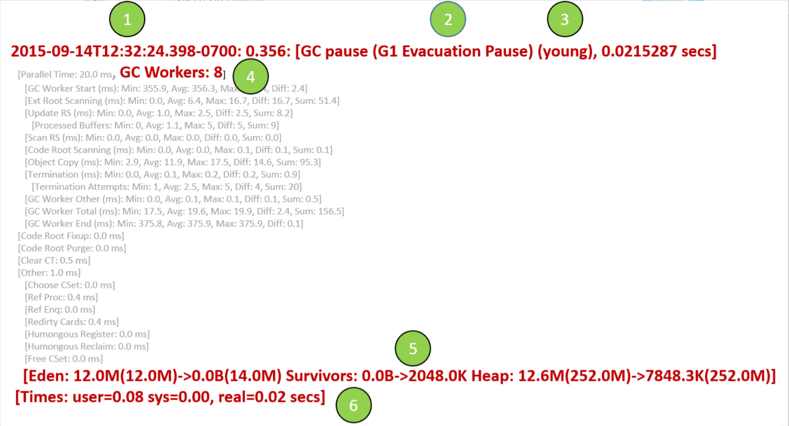

JVM 参数，目的是读懂GC的配置。**基于 OpenJDK1.8 和 HotSpot 虚拟机**

### 1 打印GC日志相关，以OpenJDK 1.8为例

```
-verbose:gc # 控制台打印 gc 日志
-XX:+PrintGCDetails # 打印 gc 过程的细节
-XX:+PrintGCDateStamps # 打印 gc 的发生的时间戳
-Xloggc:gc.log # 将 gc 日志保存成文件，默认在项目的根目录，可以根据项目的情况进行调整

```

#### 2 辅助类信息

```
-XX:+PrintGCApplicationStoppedTime # 打印 stop world 的时间
-XX:+PrintGCApplicationConcurrentTime # 打印程序未中断运行的时间
-XX:+PrintHeapAtGC # 打印 GC 前后的堆栈信息
-XX:+PrintTenuringDistribution # 打印每次 minor GC 后新的存活周期的阈值
```

### 3 认识GC日志

##### 没有发生GC

```python
Heap # 没有发生GC的日志
 def new generation   total 2432K, used 1545K [0x05600000, 0x058a0000, 0x058a0000) # 新生代, 共2432K,已经用了1545K
  eden space 2176K,  71% used [0x05600000, 0x057825b0, 0x05820000)
  from space 256K,   0% used [0x05820000, 0x05820000, 0x05860000)
  to   space 256K,   0% used [0x05860000, 0x05860000, 0x058a0000)
 tenured generation   total 5504K, used 0K [0x058a0000, 0x05e00000, 0x05e00000) # 老年共有5504K, 基本上和新生代是2:1,没有使用
   the space 5504K,   0% used [0x058a0000, 0x058a0000, 0x058a0200, 0x05e00000)
 Metaspace       used 2092K, capacity 2280K, committed 2368K, reserved 4480K # 元数据区是堆外内存，容量是2280K，用了2092K.
2021-05-27T15:14:54.581+0800: Application time: 0.0048129 seconds
```

##### 发生了PS YoungGC

```python
{Heap before GC invocations=1 (full 0):
 PSYoungGen      total 2048K, used 1513K [0x00000000ffd80000, 0x0000000100000000, 0x0000000100000000)
  eden space 1536K, 98% used [0x00000000ffd80000,0x00000000ffefa5a0,0x00000000fff00000) # Eden区满了
  from space 512K, 0% used [0x00000000fff80000,0x00000000fff80000,0x0000000100000000)
  to   space 512K, 0% used [0x00000000fff00000,0x00000000fff00000,0x00000000fff80000)
 ParOldGen       total 5632K, used 5120K [0x00000000ff800000, 0x00000000ffd80000, 0x00000000ffd80000)
  object space 5632K, 90% used [0x00000000ff800000,0x00000000ffd00050,0x00000000ffd80000)
 Metaspace       used 2582K, capacity 4486K, committed 4864K, reserved 1056768K
  class space    used 289K, capacity 386K, committed 512K, reserved 1048576K
2021-05-27T15:42:12.731+0800: [GC (Allocation Failure) # 因为Eden区域不够了，分配失败，这个是导致GC的原因。
Desired survivor size 524288 bytes, new threshold 7 (max 15) # -XX:+PrintTenuringDistribution 这个参数，它会打印出新生代对象的年龄，以及对象进入老年代的年龄阈值，这个时刻新生代的年龄是7，最大阈值是 15 ，可以通过参数进行调整。
[PSYoungGen: 1513K->464K(2048K)] 6633K->5592K(7680K), 0.0043066 secs] [Times: user=0.00 sys=0.02, real=0.00 secs] # 具体的回收信息，PSYoungGen 表示这是发生在新生代的回收
# [PSYoungGen: 1513K->464K(2048K)] 回收前该区域已使用的空间→回收后该区域使用的空间(该区域总空间)，这里是指新生代区域
# 6633K->5592K(7680K) 回收前堆中已使用的空间→回收后堆中已使用的空间(堆的总空间)
# 0.0043066 secs 表示 GC 进行的时间，单位为秒
# [Times: user=0.00 sys=0.02, real=0.00 secs]： 这部分也是对 GC 时间进行统计，但是是从操作系统的角度来统计，分被表示用户态时间，内核态时间和时钟时间
Heap after GC invocations=1 (full 0):
 PSYoungGen      total 2048K, used 464K [0x00000000ffd80000, 0x0000000100000000, 0x0000000100000000)
  eden space 1536K, 0% used [0x00000000ffd80000,0x00000000ffd80000,0x00000000fff00000)
  from space 512K, 90% used [0x00000000fff00000,0x00000000fff74010,0x00000000fff80000)
  to   space 512K, 0% used [0x00000000fff80000,0x00000000fff80000,0x0000000100000000)
 ParOldGen       total 5632K, used 5128K [0x00000000ff800000, 0x00000000ffd80000, 0x00000000ffd80000)
  object space 5632K, 91% used [0x00000000ff800000,0x00000000ffd02050,0x00000000ffd80000)
 Metaspace       used 2582K, capacity 4486K, committed 4864K, reserved 1056768K
  class space    used 289K, capacity 386K, committed 512K, reserved 1048576K
}
2021-05-27T15:42:12.745+0800: Total time for which application threads were stopped: 0.0241850 seconds, Stopping threads took: 0.0000319 seconds # 因为 GC 而产生的停顿时间0.024s
2021-05-27T15:42:13.746+0800: Application time: 1.0011009 seconds  # 程序在这次GC期间，运行的时间 1s
```

#### 发生了FullGC(PSYoungGen + ParOldGen)

fullGC是不会打印出新生代的年龄情况的。

```python
{Heap before GC invocations=9 (full 2): # 这是第9次GC,full GC发生了2次。这里无法判断此次是什么GC，需要看下面具体的。
 PSYoungGen      total 2048K, used 1024K [0x00000000ffd80000, 0x0000000100000000, 0x0000000100000000)
  eden space 1536K, 66% used [0x00000000ffd80000,0x00000000ffe80010,0x00000000fff00000) # 新生代Eden区有66%占用
  from space 512K, 0% used [0x00000000fff00000,0x00000000fff00000,0x00000000fff80000)
  to   space 512K, 0% used [0x00000000fff80000,0x00000000fff80000,0x0000000100000000)
 ParOldGen       total 5632K, used 5407K [0x00000000ff800000, 0x00000000ffd80000, 0x00000000ffd80000) # 老年代占用有5407K
  object space 5632K, 96% used [0x00000000ff800000,0x00000000ffd47c18,0x00000000ffd80000) # 老年代堆中：对象空间占有98%
 Metaspace       used 2583K, capacity 4486K, committed 4864K, reserved 1056768K
  class space    used 289K, capacity 386K, committed 512K, reserved 1048576K
# 下面是GC发生的原因， Full GC表示是FullGC, Ergonomics表示原因是老年代满了，发生了并发清除的新生代GC,发生了并发清除的老年GC，Metaspace没有回收成功，一共花费了0.005s，花费了时钟时间0.01s。
2021-05-27T15:42:24.875+0800: [Full GC (Ergonomics) [PSYoungGen: 1024K->0K(2048K)] [ParOldGen: 5407K->286K(5632K)] 6431K->286K(7680K), [Metaspace: 2583K->2583K(1056768K)], 0.0057060 secs] [Times: user=0.00 sys=0.00, real=0.01 secs]
Heap after GC invocations=9 (full 2): # 这次full GC后，堆内的情况。
 PSYoungGen      total 2048K, used 0K [0x00000000ffd80000, 0x0000000100000000, 0x0000000100000000)
  eden space 1536K, 0% used [0x00000000ffd80000,0x00000000ffd80000,0x00000000fff00000)
  from space 512K, 0% used [0x00000000fff00000,0x00000000fff00000,0x00000000fff80000)
  to   space 512K, 0% used [0x00000000fff80000,0x00000000fff80000,0x0000000100000000)
 ParOldGen       total 5632K, used 286K [0x00000000ff800000, 0x00000000ffd80000, 0x00000000ffd80000)
  object space 5632K, 5% used [0x00000000ff800000,0x00000000ff847bc8,0x00000000ffd80000)
 Metaspace       used 2583K, capacity 4486K, committed 4864K, reserved 1056768K
  class space    used 289K, capacity 386K, committed 512K, reserved 1048576K
}
2021-05-27T15:42:24.887+0800: Total time for which application threads were stopped: 0.0177008 seconds, Stopping threads took: 0.0000174 seconds # 此次GC的停顿时间是0.017s，对比上一页信息，这个时间没有young gc长。有点奇怪。这说明full gc的停顿时间不一定比 young gc 多。这次的eden区的空间全部被标识为垃圾，所以节省了复制的时间。
2021-05-27T15:42:30.891+0800: Application time: 6.0040985 seconds 
```

#### 开启UseConcMarkSweepGC的日志

```python
{Heap before GC invocations=39 (full 0):
 par new generation   total 2432K, used 2090K [0x00000000ff800000, 0x00000000ffaa0000, 0x00000000ffaa0000) # 新生代共2.4M，用了2.09M
  eden space 2176K,  96% used [0x00000000ff800000, 0x00000000ffa0aaa0, 0x00000000ffa20000)
  from space 256K,   0% used [0x00000000ffa60000, 0x00000000ffa60000, 0x00000000ffaa0000)
  to   space 256K,   0% used [0x00000000ffa20000, 0x00000000ffa20000, 0x00000000ffa60000)
 concurrent mark-sweep generation total 5504K, used 322K [0x00000000ffaa0000, 0x0000000100000000, 0x0000000100000000) # 老年代大小是5.5M, 用了322K。
 Metaspace       used 2582K, capacity 4486K, committed 4864K, reserved 1056768K
  class space    used 289K, capacity 386K, committed 512K, reserved 1048576K
2021-05-27T22:20:01.343+0800: [GC (Allocation Failure) 2021-05-27T22:20:01.343+0800: [ParNew
Desired survivor size 131072 bytes, new threshold 6 (max 6) # 这是一次新生代GC，新生代全部回收，最后堆内剩下322K的占用。对象的晋升年龄阈值是6.
: 2090K->0K(2432K), 0.0060795 secs] 2412K->322K(7936K), 0.0073735 secs] [Times: user=0.00 sys=0.00, real=0.01 secs]
Heap after GC invocations=40 (full 0):
 par new generation   total 2432K, used 0K [0x00000000ff800000, 0x00000000ffaa0000, 0x00000000ffaa0000)
  eden space 2176K,   0% used [0x00000000ff800000, 0x00000000ff800000, 0x00000000ffa20000)
  from space 256K,   0% used [0x00000000ffa20000, 0x00000000ffa20000, 0x00000000ffa60000)
  to   space 256K,   0% used [0x00000000ffa60000, 0x00000000ffa60000, 0x00000000ffaa0000)
 concurrent mark-sweep generation total 5504K, used 322K [0x00000000ffaa0000, 0x0000000100000000, 0x0000000100000000)
 Metaspace       used 2582K, capacity 4486K, committed 4864K, reserved 1056768K
  class space    used 289K, capacity 386K, committed 512K, reserved 1048576K
}
2021-05-27T22:20:01.359+0800: Total time for which application threads were stopped: 0.0241820 seconds, Stopping threads took: 0.0000376 seconds
2021-05-27T22:20:03.363+0800: Application time: 2.0027318 seconds

```


Full GC的日志

```python
{Heap before GC invocations=26 (full 32):
 par new generation   total 2432K, used 2431K [0x00000000ff800000, 0x00000000ffaa0000, 0x00000000ffaa0000)
  eden space 2176K,  99% used [0x00000000ff800000, 0x00000000ffa1fff8, 0x00000000ffa20000)
  from space 256K,  99% used [0x00000000ffa60000, 0x00000000ffa9ffd8, 0x00000000ffaa0000)
  to   space 256K,   0% used [0x00000000ffa20000, 0x00000000ffa20000, 0x00000000ffa60000)
 concurrent mark-sweep generation total 5504K, used 5503K [0x00000000ffaa0000, 0x0000000100000000, 0x0000000100000000)
 Metaspace       used 2587K, capacity 4486K, committed 4864K, reserved 1056768K
  class space    used 289K, capacity 386K, committed 512K, reserved 1048576K
2021-05-27T22:25:15.880+0800: [Full GC (Allocation Failure) 2021-05-27T22:25:15.881+0800: [CMS: 5503K->5503K(5504K), 0.0304587 secs] 7935K->7935K(7936K), [Metaspace: 2587K->2587K(1056768K)], 0.0326386 secs] [Times: user=0.03 sys=0.00, real=0.03 secs]
# Full GC的原因是因为新对象内存分配不够，CMS回收前和回收后，没有变化，花费了0.03s。注意：这个地方，没有触发新生代GC。
Heap after GC invocations=27 (full 33): 
 par new generation   total 2432K, used 2431K [0x00000000ff800000, 0x00000000ffaa0000, 0x00000000ffaa0000)
  eden space 2176K,  99% used [0x00000000ff800000, 0x00000000ffa1fff8, 0x00000000ffa20000)
  from space 256K,  99% used [0x00000000ffa60000, 0x00000000ffa9ffd8, 0x00000000ffaa0000)
  to   space 256K,   0% used [0x00000000ffa20000, 0x00000000ffa20000, 0x00000000ffa60000)
 concurrent mark-sweep generation total 5504K, used 5503K [0x00000000ffaa0000, 0x0000000100000000, 0x0000000100000000)
 Metaspace       used 2587K, capacity 4486K, committed 4864K, reserved 1056768K
  class space    used 289K, capacity 386K, committed 512K, reserved 1048576K
}
2021-05-27T22:25:15.927+0800: Total time for which application threads were stopped: 0.1309972 seconds, Stopping threads took: 0.0000997 seconds # 停顿时间很长：0.13s,应用程序的时间只有0.0011046s，显然GC占用的时间太多了。吞吐量太低。
2021-05-27T22:25:15.929+0800: Application time: 0.0011046 seconds
```


#### 开启G1的日志 -XX:+UseG1GC  

```python
{Heap before GC invocations=20 (full 0): # GC发生前，堆的情况，总共8M,用了3.5M。
 garbage-first heap   total 8192K, used 3492K [0x00000000ff800000, 0x00000000ff900040, 0x0000000100000000)
  region size 1024K, 1 young (1024K), 1 survivors (1024K)
 Metaspace       used 2583K, capacity 4486K, committed 4864K, reserved 1056768K
  class space    used 289K, capacity 386K, committed 512K, reserved 1048576K
2021-05-27T22:32:06.478+0800: [GC pause (G1 Humongous Allocation) (young) # 分配大对象导致的young GC
Desired survivor size 524288 bytes, new threshold 15 (max 15)
- age  13:     298824 bytes,     298824 total
, 0.0035538 secs]
   [Parallel Time: 0.4 ms, GC Workers: 8]
      [GC Worker Start (ms): Min: 36411.1, Avg: 36411.2, Max: 36411.3, Diff: 0.2]
      [Ext Root Scanning (ms): Min: 0.0, Avg: 0.1, Max: 0.2, Diff: 0.2, Sum: 0.9]
      [Update RS (ms): Min: 0.0, Avg: 0.0, Max: 0.0, Diff: 0.0, Sum: 0.0]
         [Processed Buffers: Min: 0, Avg: 0.0, Max: 0, Diff: 0, Sum: 0]
      [Scan RS (ms): Min: 0.0, Avg: 0.0, Max: 0.0, Diff: 0.0, Sum: 0.0]
      [Code Root Scanning (ms): Min: 0.0, Avg: 0.0, Max: 0.0, Diff: 0.0, Sum: 0.0]
      [Object Copy (ms): Min: 0.1, Avg: 0.2, Max: 0.2, Diff: 0.0, Sum: 1.3]
      [Termination (ms): Min: 0.0, Avg: 0.0, Max: 0.0, Diff: 0.0, Sum: 0.2]
         [Termination Attempts: Min: 1, Avg: 4.5, Max: 7, Diff: 6, Sum: 36]
      [GC Worker Other (ms): Min: 0.0, Avg: 0.0, Max: 0.0, Diff: 0.0, Sum: 0.0]
      [GC Worker Total (ms): Min: 0.2, Avg: 0.3, Max: 0.4, Diff: 0.2, Sum: 2.5]
      [GC Worker End (ms): Min: 36411.5, Avg: 36411.5, Max: 36411.5, Diff: 0.0]
   [Code Root Fixup: 0.0 ms]
   [Code Root Purge: 0.0 ms]
   [Clear CT: 0.3 ms]
   [Other: 2.9 ms]
      [Choose CSet: 0.0 ms]
      [Ref Proc: 0.1 ms]
      [Ref Enq: 0.0 ms]
      [Redirty Cards: 0.2 ms]
      [Humongous Register: 0.0 ms]
      [Humongous Reclaim: 0.0 ms]
      [Free CSet: 0.0 ms]
   [Eden: 0.0B(3072.0K)->0.0B(3072.0K) Survivors: 1024.0K->1024.0K Heap: 3492.8K(8192.0K)->411.6K(8192.0K)] # Eden区占用0B,survivors 
Heap after GC invocations=21 (full 0):
 garbage-first heap   total 8192K, used 411K [0x00000000ff800000, 0x00000000ff900040, 0x0000000100000000)
  region size 1024K, 1 young (1024K), 1 survivors (1024K)
 Metaspace       used 2583K, capacity 4486K, committed 4864K, reserved 1056768K
  class space    used 289K, capacity 386K, committed 512K, reserved 1048576K
}
 [Times: user=0.00 sys=0.00, real=0.02 secs]
2021-05-27T22:32:06.495+0800: Total time for which application threads were stopped: 0.0202727 seconds, Stopping threads took: 0.0000320 seconds
2021-05-27T22:32:08.496+0800: Application time: 2.0014346 seconds
```




**1.2015-09-14T12:32:24.398-0700: 0.356**：这个是GC事件发生的时间，0.356是JVM进程启动之后经历的时间。

**2.GC pause (G1 Evacuation Pause)** ：这个是收集器把存活对象从一个区域拷贝到另一个区域的阶段。

**3.(Young)**：说明这是个YoungGC。

**4.GC Workers：8**：说明有8个GC线程

**5.[Eden: 12.0M(12.0M)->0.0B(14.0M) Survivors: 0.0B->2048.0K Heap: 12.6M(252.0M)->7848.3K(252.0M)]** ：这一行说的是堆的大小变化。

**Eden: 12.0M(12.0M)->0.0B(14.0M)** ：回收前，Eden区总共12M并且全部占满，回收以后，Eden区的12M全部被回收，同时Eden区扩容到14M。

**Survivors: 0.0B->2048.0K** ：回收前，Survivor区是0，回收以后变成2048M，说明Eden区有2M没有被回收的，放到了Survivor。

**Heap: 12.6M(252.0M)->7848.3K(252.0M)** ：整个堆回收前占用了12.6M，总大小是252M，回收以后，堆占用7848K，整个堆还是252M，其中回收了5M。(ps：经过GC，Young区从12+0变成0+2，Young区减少10M，整个堆从12.6变成7.8减少5M，说明有10-5=5M晋升到了old区)

**6.Times: user=0.08, sys=0.00, real=0.02 secs**：注意下real时间，说明本次GC收集器花了0.02秒。

**FullGC事件**

当发生FullGC的时候，日志格式如下：


**1.2015-09-14T12:35:27.263-0700: 183.216**：这个是GC事件发生的时间，183.216是JVM进程启动以后的时间。

**2.Full GC (Allocation Failure)**：说你这是一个由于内存分配失败导致的FullGC。当堆中存在大量碎片的时候，由于Old区没有足够的连续空闲内存空间，在Old区的内存分配就会失败，这就引起Allocation Failure。

**3.[Eden: 3072.0K(194.0M)->0.0B(201.0M) Survivors: 0.0B->0.0B Heap: 3727.1M(4022.0M)->3612.0M(4022.0M)], [Metaspace: 2776K->2776K(1056768K)]**：这一行说的是堆内存大小的变化。

**Eden: 3072.0K(194.0M)->0.0B(201.0M)**：回收前Eden区是3M，回收后变为0，Eden区从194M扩大到201M。

**Survivors: 0.0B->0.0B** ：Survivors区没有变化。

**Heap: 3727.1M(4022.0M)->3612.0M(4022.0M)**：整个堆从3727M变成3612M，减少115M，堆的容量保持4022M不变。（ps：整个堆减少115M，Young区减少3M，说明Old区减少了112M）。

**Metaspace: 2776K->2776K(1056768K)** ：Metaspace区保持2776K没有变化。

**4.Times: user=19.08, sys=0.01, real=9.74 secs**：real时间说明GC事件花费9.74秒，这个停顿时间就非常长了。


这是一个典型的 *疏散暂停* (G1收集)日志，活跃对象从一个区域集(年轻代或年轻代+年老代)被复制到另一个区域集。它是一个stop-the-world活动，所以有应用线程在这个时间内、在安全点上都会被停止。

- line 1: 一个从进程启动后0.522秒开始的一个疏散暂停，在这时年轻代所有的区域被疏散，如Eden和Survivor。这次收集用了0.15877971秒完成的。
- line2: 并行时间是所有并行GC工作线程所花费的总时间。在这个案例里是157.1ms。
- line3: 每一个工作者线程的以毫秒为单位的启动时间。这些启动时间遵守以工作线程的id为顺序的排序规则 - thread 0 启动于522.1ms、thread 1 启动于522.2ms、从进程启动开始算起。
- line4: 告诉我们所有工作线程的平均、最小、最大和差异时间。
- line5:每一个扫描根(全局、寄存器、线程栈、虚拟机数据结构)的工作线程花费的时间。这里，thread 0 用了1.6ms执行根扫描任务，thread 1 用了1.5ms。
- line6: 清晰的给出了所有工作线程的平均、最小、最大和差异时间。
- line7&8:每一个线程处理的Update Buffers(上面提到的)的数量。
- line9 & 10：每一个工作线程扫描Remembered Sets花费的时间。一个区域的Remembered Sets包含指向这个区域的引用的相符合的卡表。这个阶段扫描这些卡表寻找指向所有这些区域的Collection Set的引用。
- line11 & 12:每一个工作线程把Collection Sets的区域里的活跃对象复制到另一个区域里花费时间。
- line13& 14: 中断时间是 每一个工作线程提供中断花费的时间。但是在中断之前，它检查其它线程的工作队列，如果在其它工作队列中仍然有引用，它会尝试固定对象引用，如果它成功的固定了一个引用，它会处理并再次提供中断。
- line 15&16: 这个给出了每一个线程提供中断的次数。
- line17 & 18 : 每一个工作线程的以毫秒为单位的停止时间。
- line19&20 这些是每一个工作线程的总生存时间。
- line21&22: 每一个工作线程执行其它上面我们没有在总并行时间里统计的任务花费的时间。
- line23:清理卡片表花费的时间。此任务以**串行**的方式执行
- line24:花费在下面列出的其它任务的时间。下面的子任务(也有个别可能是并行的)被串行执行。
- line25:为Collection Set选择区域所花费的时间。
- 花费在处理引用对象上的时间。
- 引用入队到ReferenceQueues花费的时间。
- 释放Collection Set数据结构花费的时间。
- 最后2行，告诉我们疏散暂停时堆空间的大小变化的详细信息。这显示了Eden占用了12M，在收集前它的容量也是12M。收集之后，它的容量降到了0，自所有对象从Eden区疏散/晋升后。它的目标大小增长到了13M。

Refer: [详细日志分析](https://blog.csdn.net/zhanggang807/article/details/46011341) [来自《深入理解JVM虚拟机》JVM高级特性与最佳实现](https://juejin.cn/post/6844903935749128199) 