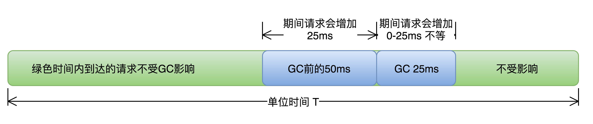

### GC参数调优的方法论

调优的目标是什么？不发生full GC还是少发生fullGC? 亦或者是GC的停顿时间要在50ms内。

### 1基本策略

各分区的大小对GC的性能影响很大。如何将各分区调整到合适的大小，分析活跃数据的大小是很好的切入点。

>  活跃数据的大小：**Full GC**后堆中老年代占用空间的大小。可以通过GC日志中Full GC之后老年代数据大小得出，比较准确的方法是在程序稳定后，多次获取GC数据，通过取平均值的方式计算活跃数据的大小。活跃数据和各分区之间的比例关系如下（见参考文献1 Java Performance: The definitive Guilde, Scott O）：

| 空间   | 与活跃数据大小的倍数 |
| ------ | -------------------- |
| 总大小 | 3-4倍                |
| 新生代 | 1-1.5                |
| 老年代 | 2-3                  |
| 永久代 | 1.2-1.5              |

举例：从日志知道FullGC后，总共的活跃数据大小是300M。

- xmx最大堆 = 300MB * 4 = 1200M
- xmn新生代 = 300MB*1.5 = 450M
- 老年代 = 1200M - 450M = 750M

对于Kafka而言，设置的是1.5-2倍。所以说这都是基本规则。

> 这部分设置仅仅是堆大小的初始值，后面的优化中，可能会调整这些值，具体情况取决于应用程序的特性和需求。对于Kafka而言，设置的是1.5-2 倍。

### 2 优化步骤

GC优化一般步骤可以概括为：确定目标、优化参数、验收结果。

#### 2.1 确定目标

明确应用程序的系统需求是性能优化的基础，系统的需求是指应用程序运行时某方面的要求，譬如：

- 高可用，可用性达到几个9。 
- 低延迟，请求必须多少毫秒内完成响应。 
- 高吞吐，每秒完成多少次事务。

> 以主要关注高可用和低延迟两项指标为例子。

举例：假设单位时间T内发生一次持续25ms的GC，接口平均响应时间为50ms，且请求均匀到达，根据下图所示：

> 如何计算受GC影响请求占比 = （接口响应时间+GC时间) * N / T

> - N 是单位T时间内，发生的GC次数。

#### 2.2 优化参数

通过收集GC信息，确定选择合适的GC收集器，调整内存比例，和JVM参数等。

#### 2.3 如何验收结果

有方案后，把不同的方案应用到不同的机器上，观察GC性能差异，做出最优选择。

#### 3 结合优化步骤，来进行案例分析

> 将所有遇到的性能问题都在这里进行案例补充。
>
> - 第一个案例：垃圾收集器选择是ParNew + CMS。

#### 3.1 Major GC 和 Minor GC 频繁

