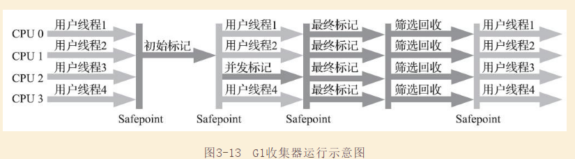
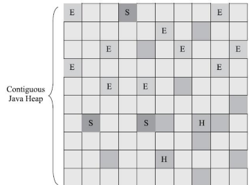
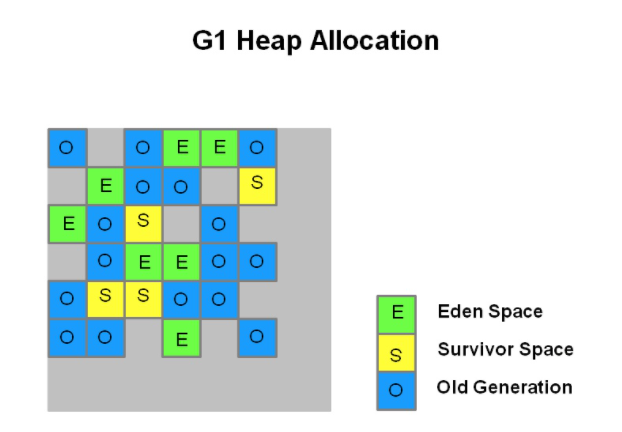
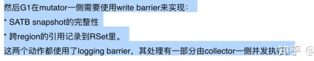

# HotSpot垃圾收集器

HotSpot 虚拟机提供了多种垃圾收集器，每种收集器都有各自的特点，虽然我们要对各个收集器进行比较，但并非为了挑选出一个最好的收集器。我们选择的只是对具体应用最合适的收集器。

- CMS和G1回收的过程，从响应和吞吐量来看，G1有什么优势？
- G1解决了什么问题？说一说详细的内部过程？

## 1新生代垃圾收集器

### 1.1Serial 垃圾收集器（单线程）

只开启**一条** GC 线程进行垃圾回收，并且在垃圾收集过程中停止一切用户线程\(Stop The World\)。

一般客户端应用所需内存较小，不会创建太多对象，而且堆内存不大，因此垃圾收集器回收时间短，即使在这段时间停止一切用户线程，也不会感觉明显卡顿。因此 Serial 垃圾收集器**适合客户端**使用。

由于 Serial 收集器只使用一条 GC 线程，避免了线程切换的开销，从而简单高效。 


### 1.2ParNew 垃圾收集器（多线程）


ParNew 是 Serial 的多线程版本。由多条 GC 线程并行地进行垃圾清理。但清理过程依然需要 Stop The World。

ParNew 追求“**低停顿时间**”,与 Serial 唯一区别就是使用了多线程进行垃圾收集，在多 CPU 环境下性能比 Serial 会有一定程度的提升；但**线程切换需要额外的开销**，因此在单 CPU 环境中表现不如 Serial。


### 1.3Parallel Scavenge 垃圾收集器（多线程）

Parallel Scavenge 和 ParNew 一样，都是多线程、新生代垃圾收集器。但是两者有巨大的不同点：

* Parallel Scavenge：追求 CPU 吞吐量，能够在较短时间内完成指定任务，因此适合没有交互的后台计算。
* ParNew：追求降低用户停顿时间，适合交互式应用。

吞吐量 = 运行用户代码时间 / \(运行用户代码时间 + 垃圾收集时间\)

追求高吞吐量，可以通过减少 GC 执行实际工作的时间，然而，仅仅偶尔运行 GC 意味着每当 GC 运行时将有许多工作要做，因为在此期间积累在堆中的对象数量很高。单个 GC 需要花更多的时间来完成，从而导致更高的暂停时间。而考虑到低暂停时间，最好频繁运行 GC 以便更快速完成，反过来又导致吞吐量下降。

* 通过参数 -XX:GCTimeRadio 设置垃圾回收时间占总 CPU 时间的百分比。
* 通过参数 -XX:MaxGCPauseMillis 设置垃圾处理过程最久停顿时间。
* 通过命令 -XX:+UseAdaptiveSizePolicy 开启自适应策略。我们只要设置好堆的大小和 MaxGCPauseMillis 或 GCTimeRadio，收集器会自动调整新生代的大小、Eden 和 Survivor 的比例、对象进入老年代的年龄，以最大程度上接近我们设置的 MaxGCPauseMillis 或 GCTimeRadio。

## 2老年代垃圾收集器

### 2.1Serial Old 垃圾收集器（单线程）

Serial Old 收集器是 Serial 的老年代版本，都是单线程收集器，只启用一条 GC 线程，都适合客户端应用。它们唯一的区别就是：Serial Old 工作在老年代，使用“标记-整理”算法；Serial 工作在新生代，使用“复制”算法。

### 2.2Parallel Old 垃圾收集器（多线程）

Parallel Old 收集器是 Parallel Scavenge 的老年代版本，追求 CPU 吞吐量。

### 2.3CMS 垃圾收集器

CMS\(Concurrent Mark Sweep，并发标记清除\)收集器是以获取最短回收停顿时间为目标的收集器（追求低停顿），它在垃圾收集时使得用户线程和 GC 线程并发执行，因此在垃圾收集过程中用户也不会感到明显的卡顿。

* 初始标记：Stop The World，仅使用一条初始标记线程对所有与 GC Roots 直接关联的对象进行标记。
* 并发标记：使用**多条**标记线程，与用户线程并发执行。此过程进行可达性分析，标记出所有废弃对象。速度很慢。
* 重新标记：Stop The World，使用多条标记线程并发执行，将刚才并发标记过程中新出现的废弃对象标记出来。
* 并发清除：只使用一条 GC 线程，与用户线程并发执行，清除刚才标记的对象。这个过程非常耗时。

并发标记与并发清除过程耗时最长，且可以与用户线程一起工作，因此，**总体上说**，CMS 收集器的内存回收过程是与用户线程**一起并发执行**的。


CMS 的缺点：

* 吞吐量低
* 无法处理浮动垃圾，导致频繁 Full GC
* 使用“标记-清除”算法产生碎片空间

对于产生碎片空间的问题，可以通过开启 -XX:+UseCMSCompactAtFullCollection，在每次 Full GC 完成后都会进行一次内存压缩整理，将零散在各处的对象整理到一块。设置参数 -XX:CMSFullGCsBeforeCompaction告诉 CMS，经过了 N 次 Full GC 之后再进行一次内存整理。

### 2.4 G1 通用垃圾收集器

G1 是一款面向服务端应用的垃圾收集器，它没有新生代和老年代的概念，而是将堆划分为一块块独立的 Region。当要进行垃圾收集时，首先估计每个 Region 中垃圾的数量，每次都从垃圾回收价值最大的 Region 开始回收，因此可以获得最大的回收效率。

从整体上看， G1 是基于“标记-整理”算法实现的收集器，从局部（两个 Region 之间）上看是基于“复制”算法实现的，这意味着运行期间不会产生内存空间碎片。

这里抛个问题👇

> 一个对象和它内部所引用的对象可能不在同一个 Region 中，那么当垃圾回收时，是否需要扫描整个堆内存才能完整地进行一次可达性分析？

并不！每个 Region 都有一个 Remembered Set，用于记录本区域中所有对象引用的对象所在的区域，进行可达性分析时，只要在 GC Roots 中再加上 Remembered Set 即可防止对整个堆内存进行遍历。（Remembered Set解决了我指向谁，谁指向我的问题。）

如果不计算维护 Remembered Set 的操作，G1 收集器的工作过程分为以下几个步骤：

* 初始标记（Initial Marking)：Stop The World，仅使用一条初始标记线程对所有与 GC Roots 直接关联的对象进行标记。

* 并发标记(Concurrent Marking)：使用**一条**标记线程与用户线程并发执行。此过程进行可达性分析，速度很慢。此外，当 对象 图 扫描 完成 以后， 还要 重新 处理 SATB 记 录下 的 在 并发 时有 引用 变动 的 对象。

* 最终标记（Final Marking）：Stop The World，对用户线程做另外一个短暂的暂停，来处理并发标记阶段结束后，人人遗留下来的最后的少量的SATB记录。

* 筛选回收（Live Data Counting and Evacuation）：统计Region数据，对它们的回收价值和成本排序，根据 用户 所 期望 的 停顿 时间 来 制定 回收 计划， 可以 自由选择 任意 多个 Region 构成 回收 集（Collection Set， 一般 简称 CSet）， 然后 把 决定 回收 的 那一 部分 Region 的 存活 对象 复制 到 空的 Region 中， 再 清理 掉 整 个旧 Region 的 全部 空间。 这里 的 操作 涉及 存活 对象 的 移动， 是 必须 暂停 用户 线程， 由 多条 收集 器 线程 并行 完成 的。。




它可 以 面向 堆 内存 任何 部分 来 组成 回收 集（ Collection Set， 一般 简称 CSet） 进行 回收， 衡量 标准 不再 是它 属于 哪个 分 代， 而是 哪 块 内存 中 存放 的 垃圾 数量 最多， 回收 收益 最大， 这就 是 G1 收集 器 的 Mixed GC 模式。

差异： G1 不再 坚持 固定 大小 以及 固定 数量 的 分 代 区域 划分， 而是 把 连续 的 Java 堆 划分 为多 个大 小 相等 的 独立 区域（ Region）， 每一个 Region 都可以 根据 需要， 扮演 新生代 的 Eden 空间、 Survivor 空间， 或者 老年 代 空间。

Region 中 还有 一类 特殊 的 Humongous 区域， 专门 用来 存储 大 对象。 G1 认为 只要 大小 超过 了 一个 Region 容量 一半 的。 每个Region 的 大小 可以 通过 参数- XX： G1HeapRegionSize 设定， 取值 范围 为 1MB ～ 32MB，



使用 参数- XX： MaxGCPauseMillis 指定， 默认值 是 200 毫秒），一般来说， 回收 阶段 占到 几十 到 一百 甚至 接 近两 百 毫秒 都很 正常，实际中，设置100-300ms比较正常。


常见问题：

1. 将 Java 堆 分成 多个 独立 Region 后， Region 里面 存 在的 跨 Region 引用 对象 如何 解决？Remember Set（“ 卡 表”（ Card Table） 的 方式 去 实现 记忆 集)

2. 在 并发 标记 阶段 如何 保证 收集 线程 与 用户 线程 互不 干扰 地 运行？节）： CMS 收集 器 采用 增量 更新 算法 实现， 而 G1 收集 器 则是 通过 原始 快照）**Snapshot-At-The-Beginning(SATB)**算法 来 实现 的。

3. 怎样 建立 起 可靠 的 停顿 预测 模型？ 用户 通过- XX： MaxGCPauseMillis 参数 指定 的 停顿 时间 只 意味着 垃圾 收集 发生 之前 的 期望 值， 但 G1 收集 器 要 怎么 做 才能 满足 用户 的 期望 呢？ G1 收集 器 的 停顿 预测 模型 是以 衰减 均值（Decaying Average）为理论基础。

4. 如果G1设置的停顿时间过短，比如20ms，会发生什么？ G1每次回收的时候，会在筛选回收阶段，选择那些内存小的回收集合来进行回收，这样的问题就是刚开始还能够保证停顿时间，一旦对象分配的速度大于了垃圾回收的速度，就会导致垃圾堆积，最后导致堆被暂满，引起Full GC，反而降低了性能。

   

##### 1 G1 详细的配置



G1把Java堆内存拆分为多个大小相等的Region

**每个region的大小**等于（**堆内存大小/2048**）。比如说堆大小是4G，那么就是4096MB，此时除以2048个Region，每个Region的大小就是2MB。大概就是这样子来决定Region的数 量和大小的

**新生代初始大小**：刚开始的时候，默认新生代对堆内存的占比是**5%**，也就是占据200MB左右的内存，对应大概是100个Region，这个是可以通过“- XX:G1NewSizePercent”来设置新生代初始占比的

**新生代最大值**：在系统运行中，JVM其实会不停的给新生代增加更多的Region，但是最多新生代的占比不会超过**60%**，可以通过“- XX:G1MaxNewSizePercent”

一旦Region进行了垃圾回收，此时新生代的Region数量还会减少，这些其实都是动态的

**eden和survivor**：参数和比例与之前保持不变。“-XX:SurvivorRatio=8”，这里还是可以区分出来属于新生代的Region里哪些属 于Eden，哪些属于Survivor。比如新生代之前说刚开始初始的时候，有100个Region，那么可能80个Region就是Eden，两个Survivor各自占10个Region。随着对象不停的在新生代里分配，属于新生代的Region会不断增加，Eden和Survivor对应的Region也会不断增加。

**region回收优先选取策略：**

​    触发垃圾回收的时候，可以根据设定的预期系统停顿时间，来选择**最少回收时间**和**最多回收对象**的Region进行垃圾回收，保证GC 对系统停顿的影响在可控范围内，同时还能尽可能回收最多的对象。

**新生代GC触发时机：**

1、新生代达到了设定的占据堆内存的最大大小60%；

2、G1执行GC的时间到达系统停顿多长时间。可以通过“-XX:MaxGCPauseMills”参数来设定，默认值是200ms。

**新生代+老年代的混合垃圾回收 触发时机：**

1. 如果老年代占据了堆内存的45%的Region的时候，此时就会尝试触发一个新生代+老年代一起回收的混合回收阶段。

2. 参数：“-XX:InitiatingHeapOccupancyPercent”，他的默认值是45%

##### 2 G1调优的原则

G1的调优目标主要是在**避免FULL GC和转移失败**的前提下，尽量实现较短的停顿时间和较高的吞吐量。

> 一句话：G1收集器是目标是没有Full GC
>
> 疏散失败（转移失败）： 在新生代垃圾收集快结束时，找不到可用的分区接收存活下来的对象。`60.238: [GC pause (young) (to-space overflow), 0.41546900 secs]`

关于G1 GC的调优，需要记住以下几点：

1. 不要自己显式设置新生代的大小（用`Xmn`或`-XX:NewRatio`参数），如果显式设置新生代的大小，会导致目标时间这个参数失效。
2. 只调整`-XX:MaxGCPauseMillis=N`参数，这也符合G1的目的——让GC调优尽量简单。
   - 如果减小这个参数的值，就意味着会调小新生代的大小，也会导致新生代GC发生得更频繁，同时，还会导致混合收集周期中回收的老年代分区减少，从而增加FULL GC的风险。这个时间设置得越短，应用的吞吐量也会受到影响。
3. 如果1、2无法解决，还有FullGC。可以做的调整包括：

- 调整G1垃圾收集的后台线程数，通过设置`-XX:ConcGCThreads=n`这个参数，可以增加后台标记线程的数量，帮G1赢得这场你追我赶的游戏；

- 调整G1垃圾收集器并发周期的频率，如果让G1更早得启动垃圾收集，也可以帮助G1赢得这场比赛，那么可以通过设置`-XX:InitiatingHeapOccupancyPercent`这个参数来实现这个目标，如果将这个参数调小，G1就会更早得触发并发垃圾收集周期。

  > 这个值需要谨慎设置：如果这个参数设置得太高，会导致FULL GC出现得频繁；如果这个值设置得过小，又会导致G1频繁得进行并发收集，白白浪费CPU资源。

  >  通过GC日志可以通过一个点来判断GC是否正常——在一轮并发周期结束后，需要确保堆剩下的空间小于InitiatingHeapOccupancyPercent的值。

- (TODO)调整G1垃圾收集器的混合收集的工作量，即在一次混合垃圾收集中尽量多处理一些分区，可以从另外一方面提高混合垃圾收集的频率。在一次混合收集中可以回收多少分区，取决于三个因素：（1）有多少个分区被认定为垃圾分区，`-XX:G1MixedGCLiveThresholdPercent=n`这个参数表示如果一个分区中的存活对象比例超过n，就不会被挑选为垃圾分区，因此可以通过这个参数控制每次混合收集的分区个数，这个参数的值越大，某个分区越容易被当做是垃圾分区；（2）G1在一个并发周期中，最多经历几次混合收集周期，这个可以通过`-XX:G1MixedGCCountTarget=n`设置，默认是8，如果减小这个值，可以增加每次混合收集收集的分区数，但是可能会导致停顿时间过长；（3）期望的GC停顿的最大值，由`MaxGCPauseMillis`参数确定，默认值是200ms，在混合收集周期内的停顿时间是向上规整的，如果实际运行时间比这个参数小，那么G1就能收集更多的分区。

 

##### 3 G1异常的处理

1. 并发标记开始后，就Full GC了，日志如下

```
51.408: [GC concurrent-mark-start]
65.473: [Full GC 4095M->1395M(4096M), 6.1963770 secs]
 [Times: user=7.87 sys=0.00, real=6.20 secs]
71.669: [GC concurrent-mark-abort]
```

- 说明对象过快得从新生代晋升到老年代

> 可能的解决办法：
>
> - 调大整个堆的大小
> - 更快触发并发回收周期
> - 让更多的回收线程参与到垃圾收集。

2. 在一次混合收集之后跟着一条FULL GC(TODO)

- 混合收集的速度太慢，在老年代释放出足够多的分区之前，应用程序就来请求比当前剩余可分配空间大的内存。

>  可能的解决办法：
>
>  - 增加每次混合收集收集掉的老年代分区个数；
>  - 增加并发标记的线程数；
>  - 提高混合收集发生的频率。

3. 在新生代垃圾收集快结束时，找不到可用的分区接收存活下来的对象，常见如下的日志：

   ```text
   60.238: [GC pause (young) (to-space overflow), 0.41546900 secs]
   ```

- 整个堆的碎片化已经非常严重了

> - 增加整个堆的大小——通过增加`-XX:G1ReservePercent`选项的值（并相应增加总的堆大小），为“目标空间”增加预留内存量;
> - 通过减少 `-XX:InitiatingHeapOccupancyPercent`提前启动标记周期；
> - 增加`-XX:ConcGCThreads`并发标记线程的数目；


如果考到：再来看[G1详解](https://zhuanlan.zhihu.com/p/54048685)

### 2.5 G1 和 CMS对比

G1优点很多，基础的就有：可以指定最大停顿时间、分Region的内存布局、按照收益动态确定回收集。从算法理论来看，

- G1是基于标记整理思想的，不会产生内存空间碎片

CMS是不是一无是处呢

- CMS 算法没有那么复杂，内存占用（Footprint)和负载(overload) 要低一些
  - 内存：都用Card Table(Remember Set) 来解决跨代指向的问题，G1更复杂，更耗费内存
  - 负载：都用到了写屏障，**CMS和G1都用写后屏障来维护卡表**，而G1的SATB还用了写前屏障。（ 相比 起 增量 更新 算法， 原始 快照 搜索 能够 减少 并发 标记 和 重新 标记 阶段 的 消耗， 避免 CMS 那样 在最 终 标记 阶段 停顿 时间 过长 的 缺点， 但是 在用 户 程序 运行 过程中 确实 会 产生 由 跟踪 引用 变化 带来 的 额外负担。 由于 G1 对 写 屏障 的 复杂 操作 要比 CMS 消耗 更多 的 运算 资源， 所以 CMS 的 写屏 障 实现 是 直接 的 同步 操作， 而 G1 就不 得不 将其 实现 为 类似于 消息 队列 的 结构， 把 写 前 屏障 和 写 后 屏障 中 要做 的 事情 都 放到 队列 里， 然后 再 异步 处理。）

> 按照 笔者 的 实践经验， 目前 在 小 内存 应用 上 CMS 的 表现 大概 率 仍然 要 会 优于 G1， 而在 大内 存 应用 上 G1 则 大多 能 发挥 其 优势， 这个 优 劣势 的 Java 堆 容量 平衡 点 通常 在 6GB 至 8GB 之间，

### 2.6 常见问题

1. Young GC、Mixed GC和Full GC的区别？ 
2. ParallelGCThreads和ConcGCThreads的区别？ 
3. write barrier在GC中的作用？如何理解G1 GC中write barrier的作用？ 

答案：

1. 答：Young GC的CSet中只包括年轻代的分区，Mixed GC的CSet中除了包括年轻代分区，还包括老年代分区；Full GC会暂停整个引用，同时对新生代和老年代进行收集和压缩。

2. 答：ParallelGCThreads指得是在STW阶段，并行执行垃圾收集动作的线程数，ParallelGCThreads的值一般等于逻辑CPU核数；ConcGCThreads指的是在并发标记阶段，并发执行标记的线程数，一般设置为ParallelGCThreads的四分之一。

3. 写屏障是一种内存管理机制，用在这样的场景——当代码尝试修改一个对象的引用时，在前面放上写屏障就意味着将这个对象放在了写屏障后面。write barrier在GC中的作用有点复杂，我们这里以trace GC算法为例讲下：trace GC有些算法是并发的，例如CMS和G1，即用户线程和垃圾收集线程可以同时运行，即mutator一边跑，collector一边收集。这里有一个限制是：黑色的对象不应该指向任何白色的对象。如果mutator视图让一个黑色的对象指向一个白色的对象，这个限制就会被打破，然后GC就会失败。针对这个问题有两种解决思路：（1）通过添加read barriers阻止mutator看到白色的对象；（2）通过write barrier阻止mutator修改一个黑色的对象，让它指向一个白色的对象。

   write barrier的解决方法就是将黑色的对象放到写write barrier后面。如果真的发生了white-on-black这种写需求，一般也有多种修正方法：增量得将白色的对象变灰，将黑色的对象重新置灰等等。我理解，增量的变灰就是CMS和G1里并发标记的过程，将黑色的对象重新变灰就是利用卡表或SATB的缓冲区将黑色的对象重新置灰的过程，当然会在重新标记中将所有灰色的对象处理掉。关于G1中write barrier的作用，可以参考[R大的这个帖子](https://link.zhihu.com/?target=https%3A//hllvm-group.iteye.com/group/topic/44381%3Fpage%3D3)里提到的：