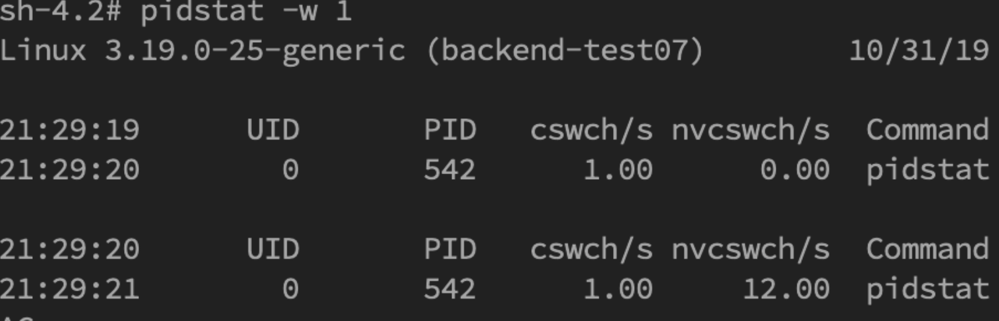
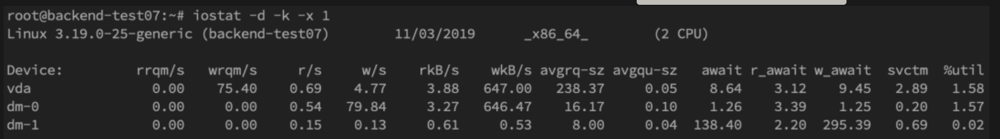
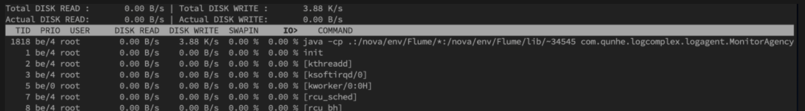
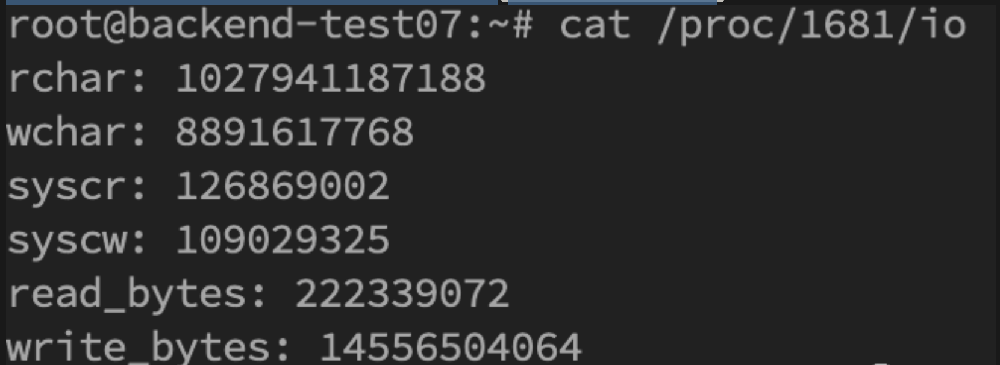
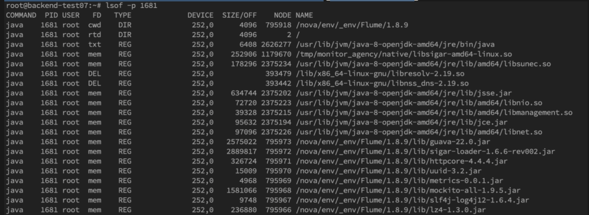

> 学什么？如果查Java的服务端程序问题

线上故障有哪些？主要会包括cpu、磁盘、内存以及网络问题，所以进行排查时候尽量四个方面依次排查一遍。

基本上出问题就是df、free、top 三连，然后依次jstack、jmap伺候，具体问题具体分析即可。

## 1 CPU

比较好定位，原因有哪些？

- 业务死循环
- 频繁GC
- 上下文切换过多

三连招：

- 看哪个进程占用比较高：`top`
- 这个进程的所有线程占用率排个序：`top -H -pid $PID`
- 转换10进制的线程id为16进制，jstack找出来看看
  - `printf '%x\n' 10进制id`
  - jstack grep一把`jstack -l pid| grep 'nid'--color -C5`：加上颜色，打印前后5行。

> 找到了线程，就要分析这个线程的状态是什么？重点关注什么?
>
> - **wait on monitor entry：** 被阻塞的,肯定有问题。（这个没有例子）
>
> - **runnable** ： 注意有没有IO线程，常见于数据库死锁、外部依赖服务失效
>
> - **in Object.wait()**： 注意非线程池等待。

### 1.2 如果怀疑GC有问题，就看GC

- jstat -gc $PID 1000 : 1秒看一次

### 1.3 如果怀疑是上下文切换

- 看所有的上下文切换：vmstat
- 看某一个进程的context switch：pidstat -w $PID
  - cswch和nvcswch表示自愿及非自愿切换

## 2 磁盘

看2方面：1看看还剩下多少； 2 看看当前磁盘的IO写入情况

- df -lh :看看还剩下多少
- iostat -d -k -x 1: 每隔一秒看看磁盘IO

最后一列`%util`可以看到每块磁盘写入的程度，而`rrqpm/s`以及`wrqm/s`分别表示读写速度，一般就能帮助定位到具体哪块磁盘出现问题了。

另外我们还需要知道是哪个进程在进行读写，一般来说开发自己心里有数，或者用iotop命令来进行定位文件读写的来源。

> 这个只能够拿到thread id（TID), 要知道是哪一个进程，需转换成pid，可以通过readlink来找到pid`readlink -f /proc/*/task/tid/../..`。
>
> 找到pid之后就可以看这个进程具体的读写情况`cat /proc/$PID/io`

我们还可以通过lsof命令来确定具体的文件读写情况`lsof -p pid`

## 3 内存

内存问题比CPU复杂，场景比较多。一般来讲，我们会先用`free`命令先来检查一发内存的各种情况。

主要包括**OOM、GC问题和堆外内存**

### 3.1 堆内OOM

内存问题大多还都是堆内内存问题。表象上主要分为OOM和StackOverflow。

#### 1 **Exception in thread "main" java.lang.OutOfMemoryError: unable to create new native thread**

这没有足够的内存空间给线程分配java栈，基本上还是线程池代码写的有问题，比如说忘记shutdown，所以说应该首先从代码层面来寻找问题，使用jstack或者jmap。如果一切都正常，JVM方面可以通过指定`Xss`来减少单个thread stack的大小。另外也可以在系统层面，可以通过修改`/etc/security/limits.conf`nofile和nproc来增大os对线程的限制

#### 2 **（最常见）Exception in thread "main" java.lang.OutOfMemoryError: Java heap space**

堆的内存占用已经达到-Xmx设置的最大值。解决思路仍然是先应该在代码中找，怀疑存在内存泄漏，通过jstack和jmap去定位问题。如果说一切都正常，才需要通过调整`Xmx`的值来扩大内存。

#### 3 **Caused by: java.lang.OutOfMemoryError: Meta space**

元数据区的内存占用已经达到`XX:MaxMetaspaceSize`设置的最大值，排查思路和上面的一致，参数方面可以通过`XX:MaxPermSize`来进行调整

#### 4 Stack Overflow

栈内存溢出，这个大家见到也比较多。**Exception in thread "main" java.lang.StackOverflowError**表示线程栈需要的内存大于Xss值，同样也是先进行排查，参数方面通过`Xss`来调整，但调整的太大可能又会引起OOM。

### 3.2 如何使用JMAP定位代码OOM

先用jmap dump出文件，在用MAT来分析。

- 一般使用JMAP`jmap -dump:format=b,file=filename pid`来导出dump文件
- 通过**mat(Eclipse Memory Analysis Tools)**导入dump文件进行分析，内存泄漏问题一般我们直接选Leak Suspects即可，mat给出了内存泄漏的建议。另外也可以选择Top Consumers来查看最大对象报告。和线程相关的问题可以选择thread overview进行分析。除此之外就是选择Histogram类概览来自己慢慢分析，大家可以搜搜mat的相关教程。

日常开发中，代码产生内存泄漏是比较常见的事，并且比较隐蔽，需要开发者更加关注细节。比如说每次请求都new对象，导致大量重复创建对象；进行文件流操作但未正确关闭；手动不当触发gc；ByteBuffer缓存分配不合理等都会造成代码OOM。

另一方面，我们可以在启动参数中指定`-XX:+HeapDumpOnOutOfMemoryError`来保存OOM时的dump文件。

### 3.3 gc问题和线程

gc问题除了影响cpu也会影响内存，排查思路也是一致的。一般先使用jstat来查看分代变化情况，比如youngGC或者fullGC次数是不是太多呀；EU、OU等指标增长是不是异常呀等。线程的话太多而且不被及时gc也会引发oom，大部分就是之前说的`unable to create new native thread`。除了jstack细细分析dump文件外，我们一般先会看下总体线程，通过`pstreee -p pid |wc -l`。或者直接通过查看`ls -l /proc/pid/task | wc -l`的数量即为线程数量。