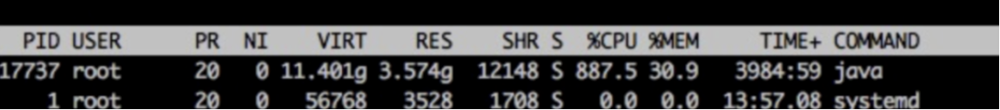
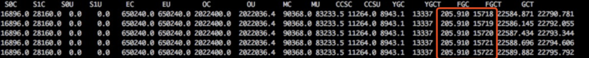
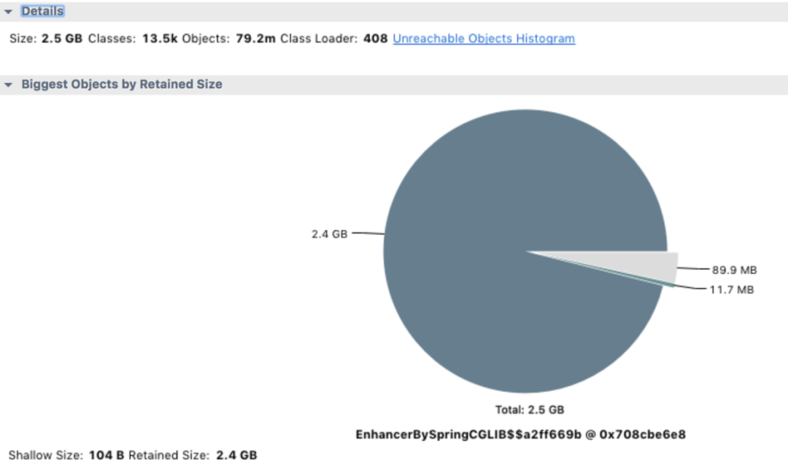
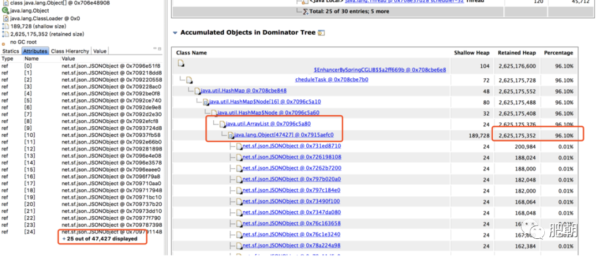

学会了什么？如何排查Java应用程序异常？

## 1 背景

某个服务接口无法reponse或者response时间太长，堆大小设置是4G. 

- 原因是探测服务导致的

邮件显示探测的几个接口有超时情况。多数执行栈都在：

```
java.io.BufferedReader.readLine(BufferedReader.java:371)
java.io.BufferedReader.readLine(BufferReader.java:389)
java_io_BufferedReader$readLine.call(Unknown Source)
com.domain.detect.http.HttpClient.getResponse(HttpClient.groovy:122)
com.domain.detect.http.HttpClient.this$2$getResponse(HttpClient.groovy)
```

这个线程栈的报错我见得多了，我们设置的 HTTP DNS 超时是 1s， connect 超时是 2s， read 超时是 3s，这种报错都是探测服务正常发送了 HTTP 请求，服务器也在收到请求正常处理后正常响应了，但数据包在网络层层转发中丢失了，所以请求线程的执行栈会停留在获取接口响应的地方。这种情况的典型特征就是能在服务器上查找到对应的日志记录。而且日志会显示服务器响应完全正常。与它相对的还有线程栈停留在 Socket connect 处的，这是在建立连接的时候就失败了，服务端完全无感知。

其中一个接口报错更频繁一些，这个接口需要上传一个 4M 的文件到服务器，然后经过一连串的业务逻辑处理，再返回 2M 的文本数据，而其他的接口则是简单的业务逻辑，我猜测可能是需要上传下载的数据太多，所以超时导致丢包的概率也更大吧。

我再次通过服务器和监控看到各个接口的指标都很正常，自己测试了下接口也完全 OK，既然不影响线上服务，我准备先通过探测服务的接口把探测任务停掉再慢慢排查。结果发现停止探测任务的接口 发请求很久没有响应。


## 2 分析

### 2.1 top free df 三连看



发现CPU 900%，正常情况下是100~200%。说明了什么？

> 要么死循环，要么就是做大量Full GC.

使用 `jstat -gc pid [interval]` 命令查看了 java 进程的 GC 状态，果然，FULL GC 达到了每秒一次。



这么多的 FULL GC，应该是内存泄漏没跑了，于是 使用 `jstack pid > jstack.log` 保存了线程栈的现场，使用 `jmap -dump:format=b,file=heap.log pid` 保存了堆现场，然后重启了探测服务，报警邮件终于停止了。

### 2.2 分析栈

1. 分析有多少个线程：`grep 'java.lang.Thread.State' jstack.log | wc -l`
2. 分析每个线程在处于哪个状态，每个线程看2行，只取第二行，排序去重：`grep -A 1 'java.lang.Thread.State jstack.log | grep -v 'java.lang.Thread.State'  | sort | uniq -c | sort -n`

```
> grep -A 1 'java.lang.Thread.State' jstack.log  | grep -v 'java.lang.Thread.State' | sort | uniq -c |sort -n
     10  at java.lang.Class.forName0(Native Method)
     10  at java.lang.Object.wait(Native Method)
     16  at java.lang.ClassLoader.loadClass(ClassLoader.java:404)
     44  at sun.nio.ch.EPollArrayWrapper.epollWait(Native Method)
    344  at sun.misc.Unsafe.park(Native Method)
```

### 2.3 分析堆 dump的文件

MAT 是分析 Java 堆内存的利器，使用它打开我们的堆文件（将文件后缀改为 `.hprof`）, 它会提示我们要分析的种类，对于这次分析，果断选择 `memory leak suspect`。

> 小技巧：堆文件过大，先用gzip压缩，-1~-9是压缩率大小，推荐-6.




从上面的饼图中可以看出，绝大多数堆内存都被同一个内存占用了，再查看堆内存详情，向上层追溯，很快就发现了罪魁祸首。



### 2.4 分析结果

找到内存泄漏的对象了，在项目里全局搜索对象名，它是一个 Bean 对象，然后定位到它的一个类型为 Map 的属性。

这个 Map 根据类型用 ArrayList 存储了每次探测接口响应的结果，每次探测完都塞到 ArrayList 里去分析，由于 Bean 对象不会被回收，这个属性又没有清除逻辑，所以在服务十来天没有上线重启的情况下，这个 Map 越来越大，直至将内存占满。

内存满了之后，无法再给 HTTP 响应结果分配内存了，所以一直卡在 readLine 。而我们那个大量 I/O 的接口报警次数特别多，估计跟响应太大需要更多内存有关。


值得提出的一点是：一开始报警邮件里还有这样的线程栈：

```java
groovy.json.internal.JsonParserCharArray.decodeValueInternal(JsonParserCharArray.java:166)
groovy.json.internal.JsonParserCharArray.decodeJsonObject(JsonParserCharArray.java:132)
groovy.json.internal.JsonParserCharArray.decodeValueInternal(JsonParserCharArray.java:186)
groovy.json.internal.JsonParserCharArray.decodeJsonObject(JsonParserCharArray.java:132)
groovy.json.internal.JsonParserCharArray.decodeValueInternal(JsonParserCharArray.java:186)
```

> 说明了什么问题？Json无法被正确的decode，说明了Json这个对象是不完整的，但是TCP是能够保证消息完整的。说明是内存不够了。

看到这种报错线程栈却没有细想，要知道 TCP 是能保证消息完整性的，况且消息没有接收完也不会把值赋给变量，这种很明显的是内部错误，如果留意后细查是能提前查出问题所在的。