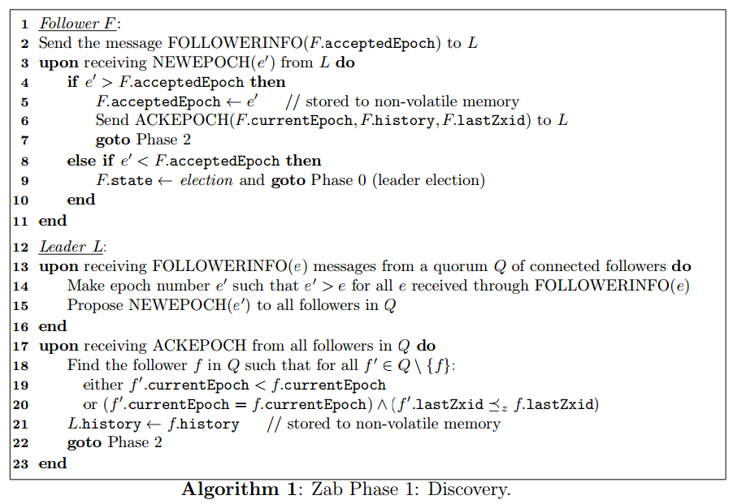
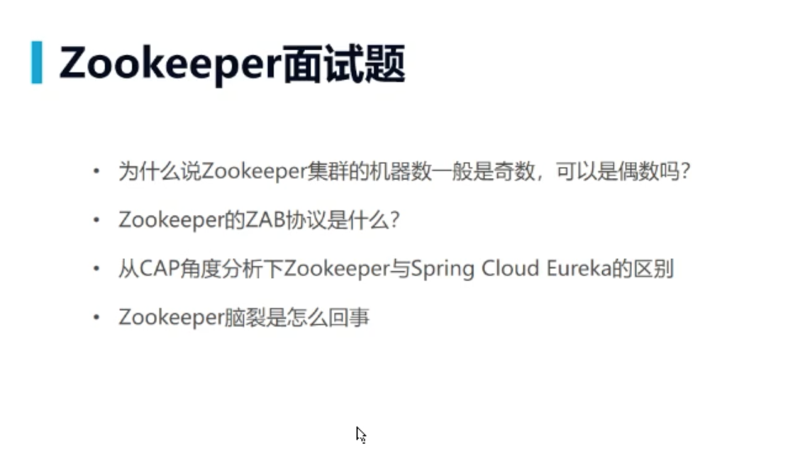
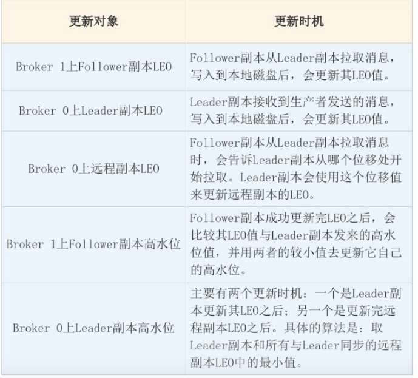

## 0 jdk版本重要特性

- jdk7
  - 增加fork/join并发架构
  - 基本整型可表达为二进制方式
  - switch语句支持字符串
  - 新增try-with-resources语句
  - 多重try-catch语句、精确的rethrow类型匹配
  - 数值字面量可用下划线分割以增加可读性
  - 泛型初始化自动类型推断(new HashMap不需要在尖括号中写类型了)
  - JVM引入G1收集器
  - 分层编译优化提升客户端VM启动速度
- jdk8
  - lambda表达式、新增java.util.stream
  - 提升HashMap碰撞时的查询效率
  - 增强自动类型推断
  - 并行Array排序
  - Java Flight Recorder
- jdk9
  - 将G1提升为默认垃圾收集器，修复问题、提升性能，实现默认基本配置运行而不需要手动配置
  - 删除一些收集器配置，如-XX:+CMSIncrementalMode、-XX:+UseCMSCompactAtFullCollection、-XX:+CMSFullGCsBeforeCompaction、-XX:+UseCMSCollectionPassing，-XX:+UseParNewGC不再使用，只能默认与CMS配对使用
- jdk10
  - G1GC的FullGC并行化
  - 本地变量类型推断
- jdk11
  - String新增方法：isBlank、lines、strip、stripLeading、stripTailing、repeat
  - var类型推断增强
  - FlightRecorder开源免费
  - 引入ZGC（expiremental，只在linux/x64上可用）
- jdk12
  - ZGC并发卸载类

## 1常见的Java问题

- ArrayList, LinkedList, HashSet, HashMap, CopyOnWriteList, ConcurrentHashMap, ConcurrentLinkedQueue, volatile, Atomic, CAS, double check locking, happen-before, Object Header, false-sharing, ThreadExecutor(Cached, Fixed, Scheduled), syncronize, Lock, CountdownLatch, Barrier, Exchanger, JVM survivor, GC Algorithem, JVM tuning, syncronize tuning in JDK1.6, strong/weak/phantom reference, String pool

### HashMap

- 两个参数影响其性能：initial capacity、load factor
  - 当哈希表的 Entry 个数达到二者的乘积，就会触发 rehash
  - load factor 默认为0.75是一个在时间和空间消耗上较好的折中
  - 过高的 load factor 值降低空间开销，但是会增加查找的时间消耗
- 非线程安全，可通过外部线程同步，或者初始化时调用

```
    Map m = Collections.synchronizedMap(new HashMap(...))
```

- capacity都是2的次幂
  - hash 值算法是 hashCode ^ (hashcode>>>16) 后取模运算，通过 h & (length-1) 取模
    - 这样使得一个 hash 值的有效位只有 length-1 ，因此需要高 16 位与低 16 位 XOR 扩散(TODO)
  - key 碰撞时先存成链表，链表长度 > 8 则重构为红黑树
  - 1.8 扩容的时候 rehash 更优雅
    - 每次扩容都 *2，因此 resize 时，不需要重新计算 hash，只需要看 hash 值新增的 bit 是 1 还是 0，是 0 则索引不变，是 1 则 索引 = 原索引 + oldCap。
- 老版本并发扩容时可能导致形成环形链表导致读取死循环

- getNode代码
  - 用key的hash值去查询内部数组tab能否命中；如果没命中，就返回null。
  - 命中之后，再次比较key是不是相等。根据key是红黑树还是链表来查找

```java
    final Node<K,V> getNode(int hash, Object key) {
        Node<K,V>[] tab; Node<K,V> first, e; int n; K k;
        if ((tab = table) != null && (n = tab.length) > 0 &&
            (first = tab[(n - 1) & hash]) != null) {
            if (first.hash == hash && // always check first node
                ((k = first.key) == key || (key != null && key.equals(k))))
                return first;
            if ((e = first.next) != null) {
                if (first instanceof TreeNode)
                    return ((TreeNode<K,V>)first).getTreeNode(hash, key);
                do {
                    if (e.hash == hash &&
                        ((k = e.key) == key || (key != null && key.equals(k))))
                        return e;
                } while ((e = e.next) != null);
            }
        }
        return null;
    }
```

- putVal代码

  - 如果内部数组Table为空，先初始化表（resize）
  - 计算 key的hash 值，在数组的对应 index 上插入新值，如果当前数组对应位置为空，直接插入
  - 如果数组上对应位置已有值
    - 判断该 Node 是否为 TreeNode，如果是 TreeNode 则直接插入
    - 如果是 List，在链表尾部插入的同时，记录 binCount，若 binCount > 8 将链表转换为树

  
  
  ```java
      final V putVal(int hash, K key, V value, boolean onlyIfAbsent,
                     boolean evict) {
          Node<K,V>[] tab; Node<K,V> p; int n, i;
          if ((tab = table) == null || (n = tab.length) == 0)
              n = (tab = resize()).length;
          if ((p = tab[i = (n - 1) & hash]) == null)
              tab[i] = newNode(hash, key, value, null);
          else {
              Node<K,V> e; K k;
              if (p.hash == hash &&
                  ((k = p.key) == key || (key != null && key.equals(k))))
                  e = p;
              else if (p instanceof TreeNode)
                  e = ((TreeNode<K,V>)p).putTreeVal(this, tab, hash, key, value);
              else {
                  for (int binCount = 0; ; ++binCount) {
                      if ((e = p.next) == null) {
                          p.next = newNode(hash, key, value, null);
                          if (binCount >= TREEIFY_THRESHOLD - 1) // -1 for 1st
                              treeifyBin(tab, hash);
                          break;
                      }
                      if (e.hash == hash &&
                          ((k = e.key) == key || (key != null && key.equals(k))))
                          break;
                      p = e;
                  }
              }
              if (e != null) { // existing mapping for key
                  V oldValue = e.value;
                  if (!onlyIfAbsent || oldValue == null)
                      e.value = value;
                  afterNodeAccess(e);
                  return oldValue;
              }
          }
          ++modCount;
          if (++size > threshold)
              resize();
          afterNodeInsertion(evict);
          return null;
      }
  
  ```

### ConcurrentHashMap

HashTable 各个操作都是加锁的，ConcurrentHashMap的get 不加锁，put加锁。这会造成get的时候不一定拿到最新的数据，属于弱一致性的实现。因此，强一致性的场景，用HashTable。

@jdk7 使用分段锁设计；iterator 不会抛 concurrentModification 异常（造成读会读到老的数据），但是只能被一个线程操作；size 方法开销很大 。@jdk1.8之后，使用Synchronized同步锁。


```java
   public V put(K key, V value) {
            Segment<K,V> s;

            if (value == null)
                throw new NullPointerException();

            int hash = hash(key);

            // segmentMask：段掩码，假如segments数组长度为16，则段掩码为16-1=15；segments长度为32，段掩码为32-1=31
            // segmentShift：2的sshift次方等于ssize，segmentShift=32-sshift
            // 若segments长度为16，segmentShift=32-4=28
            // 若segments长度为32，segmentShift=32-5=27, 而计算得出的hash值最大为32位，无符号右移segmentShift，
            // 则意味着只保留高几位（其余位是没用的），然后与段掩码segmentMask位运算来定位Segment
            int j = (hash >>> segmentShift) & segmentMask;
            if ((s = (Segment<K,V>) UNSAFE.getObject          // nonvolatile; recheck
                 (segments, (j << SSHIFT) + SBASE)) == null) //  in ensureSegment
                s = ensureSegment(j);
            return s.put(key, hash, value, false);
	}
```


@jdk8 改为 CAS 设计

- 对于一个空的Node，CAS无锁添加；
- 对于非空的Node，对Node加锁（synchronized，锁可以被优化）；
- 增加 addCount 方法专门记录 size ；并发修改一个下标的 Node 时才加 synchronized ，并且只锁定当前的 Node


- isEmpty、size、containsValue 只在 map 不并发更新的时候准确，适合用于监控或估算，而不适于程序控制；不支持 Null Key/Value

- putVal

  - 在没有哈希冲突的情况下，使用CAS添加；有冲突，就用Synchronized把链表Node锁住，还是锁住的一个链表，不是整个map。
  - 计算 hash 值，自旋访问 table，table 为空则采用 CAS 初始化 table
  - 获取 hash 值对应节点位置 i，若该位置为空则 CAS 插入
  - 若有HashMap在扩容，则先执行 helpTransfer 帮助迁移到新 table。会再次自旋进入循环体。
  - 否则，以当前节点的链表、树的头结点为 lock 加锁，进行 add 操作
  
  > 可以发现，和HashMap的putVal流程很类似，区别在于由于并发性，ConcurrentHashMap有CAS操作和synchronized。

```java
final V putVal(K key, V value, boolean onlyIfAbsent) {
        if (key == null || value == null) throw new NullPointerException();
        int hash = spread(key.hashCode()); // 1 计算hash值
        int binCount = 0;
        for (Node<K,V>[] tab = table;;) { // 1 自旋访问table
            Node<K,V> f; int n, i, fh;
            if (tab == null || (n = tab.length) == 0)
                tab = initTable(); // 1 为空CAS初始化table
            else if ((f = tabAt(tab, i = (n - 1) & hash)) == null) { // 2 获取table中对应Node i位置，如果位置为空，直接CAS插入
                if (casTabAt(tab, i, null,
                             new Node<K,V>(hash, key, value, null)))
                    break;                   // no lock when adding to empty bin
            }
            else if ((fh = f.hash) == MOVED) // 3 如果HashMap在扩容，执行helpTransfer迁移到新table
                tab = helpTransfer(tab, f);
            else { // 4 否则，说明一切正常，是链表Node就添加，是TreeNode也添加。因为是并发的map，所以这个地方加锁
                V oldVal = null;
                synchronized (f) {
                    if (tabAt(tab, i) == f) {
                        if (fh >= 0) {
                            binCount = 1;
                            for (Node<K,V> e = f;; ++binCount) {
                                K ek;
                                if (e.hash == hash &&
                                    ((ek = e.key) == key ||
                                     (ek != null && key.equals(ek)))) {
                                    oldVal = e.val;
                                    if (!onlyIfAbsent)
                                        e.val = value;
                                    break;
                                }
                                Node<K,V> pred = e;
                                if ((e = e.next) == null) {
                                    pred.next = new Node<K,V>(hash, key,
                                                              value, null);
                                    break;
                                }
                            }
                        }
                        else if (f instanceof TreeBin) {
                            Node<K,V> p;
                            binCount = 2;
                            if ((p = ((TreeBin<K,V>)f).putTreeVal(hash, key,
                                                           value)) != null) {
                                oldVal = p.val;
                                if (!onlyIfAbsent)
                                    p.val = value;
                            }
                        }
                    }
                }
                if (binCount != 0) {
                    if (binCount >= TREEIFY_THRESHOLD)
                        treeifyBin(tab, i);
                    if (oldVal != null)
                        return oldVal;
                    break;
                }
            }
        }
        addCount(1L, binCount);
        return null;
    }
```

- get操作：比较简单，就是用key的hash值去命中Node。没有加锁，使用volatile来保证可见性。这就是所谓的弱一致性。

```java
    public V get(Object key) {
        Node<K,V>[] tab; Node<K,V> e, p; int n, eh; K ek;
        int h = spread(key.hashCode());
        if ((tab = table) != null && (n = tab.length) > 0 &&
            (e = tabAt(tab, (n - 1) & h)) != null) { // 1 用key的hash值去命中Node
            if ((eh = e.hash) == h) {
                if ((ek = e.key) == key || (ek != null && key.equals(ek)))
                    return e.val;
            }
            else if (eh < 0) // 2 遇到resize，去寻找新的地方寻找key
                return (p = e.find(h, key)) != null ? p.val : null;
            while ((e = e.next) != null) { // 3 链表式查找
                if (e.hash == h &&
                    ((ek = e.key) == key || (ek != null && key.equals(ek))))
                    return e.val;
            }
        }
        return null;
    }
```

#### size优化

- 1.8中的 size 增加 baseCount、counterCells 来辅助记录 size，优化性能

```java
	/**
     * Base counter value, used mainly when there is no contention,
     * but also as a fallback during table initialization
     * races. Updated via CAS.
     */
    private transient volatile long baseCount;

    private transient volatile CounterCell[] counterCells;

    /**
     * A padded cell for distributing counts.  Adapted from LongAdder
     * and Striped64.  See their internal docs for explanation.
     */
    @sun.misc.Contended static final class CounterCell {
        volatile long value;
        CounterCell(long x) { value = x; }
    }
```

- put方法结束后，调用 addCount 方法以 CAS 的方式自增 baseCount，如果 CAS 失败则使用 CAS 记录到 counterCell 中

```java
	private final void addCount(long x, int check) {
        CounterCell[] as; long b, s;
        if ((as = counterCells) != null ||
            !U.compareAndSwapLong(this, BASECOUNT, b = baseCount, s = b + x)) {
            CounterCell a; long v; int m;
            boolean uncontended = true;
            if (as == null || (m = as.length - 1) < 0 ||
                (a = as[ThreadLocalRandom.getProbe() & m]) == null ||
                !(uncontended =
                  U.compareAndSwapLong(a, CELLVALUE, v = a.value, v + x))) {
                fullAddCount(x, uncontended);
                return;
	......
```

* 如果记录 counterCell 的 CAS 失败则调用 fullAddCount 继续自旋 CAS 直到成功

#### 适用场景

ConcurrentHashMap: 数组+链表+红黑树+锁。红黑树在并发的情况下，删除和插入过程中，需要平衡，会操作大量的节点，因此竞争所资源激烈，代价相对于跳表高。

> 因此，在单线程Map容器中，TreeMap容易来存取大数据量；线程安全的case下，SkipListMap来存大数据。


1. HashMap 底层设计与实现，LoadFactor，为什么多线程环境下，put方法会造成死循环？为什么size>=8 之后，要转换成红黑树？红黑树能手写一个么？
2. HashTable \ ConcurrectHashMap分别对应什么样的适用场景？
3. ConcurrentHashMap 1.8之前是segment lock, 之后使用synchronized和CAS来更新，为什么？涉及1.6之后，对synchronized的优化，重量级锁、偏向锁、自旋锁
4. ConcurrentSkipListMap 基于跳表实现的Map，优点是什么，对比ConcurrentHashMap的适用场景是什么？
5. 互联网电商系统，往往都有黑名单，你觉得用什么样的数据结构来存储？如果要设计一个统计商品销量Top10的功能，用什么样的数据结构？
6. 如果使用队列来实现抢购的排队，如何选择队列？特点是写多读少。

### 跳表

优化搜索的有序链表

### CopyOnWriteArrayList

特点：读，无所并发；写：复制在更新，copy回去。（读写分离的并发思想）

适用于什么场景？

### 四种引用

- 强引用:无论什么时候都不会自动回收（场景：正常使用）
- 软引用:空间不足才会回收对象（场景：适合缓存）
- 弱引用:不是立刻回收而是GC发现后会在下次GC时才会回收对象。（场景：如果对象偶尔使用可WeakReference.）
- 虚引用:必须和引用队列(ReferenceQueue)联合使用,本次GC发现立即回收对象（场景：GC里面使用？）

StrongReference、WeakReference、SoftReference、PhantomReference

- WeakReference 引用的对象，当没有强引用指向它后，将在 GC 时被回收；如果其作为 Map.Entry 中的key，则整个 Entry 会被移除。

```java
    Obejct reference = new Object();    
		WeakReference<Obejct> weakRef = new WeakReference<>(reference);    
		reference = null;    
		System.gc(); // 被回收    
		AssertNull(weakRef.get())
```

- SoftReference 与 WeakReference 特性类似，区别在于 SoftReference 被回收的时机是在 JVM 内存不足之时；因此适合用于做缓存

```java
		String str = new String("abc");		
		SoftReference<String> softReference = new SoftReference<String>(str);		// 浏览器的回退可以用缓存设计：    
		if(softReference.get() != null) {        
      	page = softReference.get(); // 内存充足，还没有被回收器回收，直接获取缓存    
    } else {        
      page = browser.getPage();// 内存不足，软引用的对象已经回收        
      softReference = new SoftReference(page);// 重新构建软引用    
    }
```

- PhantomReference，调用 get 永远返回 null，用于跟踪引用何时被 enqueue 至 ReferenceQueue 中.**虚引用必须和引用队列(ReferenceQueue)联合使用**。

  > 对于GC来看，当垃圾回收器准备回收一个对象时，如果发现它还有虚引用，会在回收之前，把虚引用加入到与之关联的引用队列中。
  >
  > 对于用户来看，如果程序发现某个虚引用已经被加入到ReferenceQueue，那么回收之前采取一些行动。

```java
String str = new String("abc");  
ReferenceQueue queue = new ReferenceQueue();    // 创建虚引用，要求必须与一个引用队列关联    
PhantomReference pr = new PhantomReference(str, queue);
```

### 多线程

- ThreadLocalRandom 、ThreadLocal，解决多线程访问同一个变量的时候需要同步，让每个线程都拷贝一份变量，自己操作自己。
- 线程池的工作原理、任务调度


- 线程池ThreadPoolExecutor，关键的属性

  - corePoolSize，一旦有新任务提交，而线程池当前线程数小于此值，则 create 新的线程（即 core thread 只在新任务提交时创建，但是可以通过调用 prestartCoreThread 、prestartAllCoreThreads 方法改变策略）

  - maximumPoolSize，一旦有新任务提交，而线程池当前线程数小于此值且大于 corePoolSize，则进入队列排队，只有队列被填满才会创建新线程

  - Keep-alive times，超过 corePoolSize 的线程如果空闲时间超过此值，就会被终止

  - Queueing，若小于 corePoolSize 的线程在运行，则 executor 更倾向于增加新线程而不是排队；反之则倾向于排队；若队列满，则创建新线程；若队列满且线程数超过 maximumPoolSize 则 reject；三种排队策略：

    - Direct handoffs，SynchronousQueue，不持有任务，接收到任务直接转交给Executor（newCachedThreadPool采取的是此策略）
    - Unbounded queues，LinkedBlockingQueue，若任务提交数超过 corePoolSize 支持的线程，新任务会持续添加进队列，而 maximumPoolSize 不会生效（newSingledThreadPool、newFixedThreadPool采取的是此策略）
    - Bounded queues，ArrayBlockingQueue，Queue sizes 和 maximum pool 需要相互权衡

  - Reject任务后的策略：

    - AbortPolicy，抛异常 RejectedExecutionException（默认策略）
    - CallerRunsPolicy，交由提交线程自己去执行 execute
    - DiscardPolicy，丢弃任务
    - DiscardOldestPolicy，丢弃队列头部任务
    - 自定义 RejectedExecutionHandler

  - Hook Methods，beforeExecute，afterExecute，若钩子函数或 callback 调用异常，线程会被终止

  - Executors常见的 ThreadPool 参数

    - cachedThreadPool

    ```java
        new ThreadPoolExecutor(0, Integer.MAX_VALUE,
                                      60L, TimeUnit.SECONDS,
                                      new SynchronousQueue<Runnable>());
    ```

    - fixedThreadPool

    ```java
    	new ThreadPoolExecutor(nThreads, nThreads,
                                  0L, TimeUnit.MILLISECONDS,
                                  new LinkedBlockingQueue<Runnable>());
    ```

    

## 3 JVM


### 结构、回收算法

- 基本结构：程序计数器、JVM 栈、native 栈、堆、运行时常量池
- 分区：垃圾收集器把堆分为新生代、老年代、永久代，1.8 版本后引入了 MetaSpace 替换永久代，本地内存。
- 直接内存: NIO，`DirectByteBuffer分配
- 基本回收算法：标记清除，标记整理，复制

- 对象分配策略
  - 优先分配在新生代
  - 大对象直接老年代(-XX:PretenureSizeThreshold)
  - 长时间存活对象进入老年代(- XX:MaxTenuringThreshold)
  - 若 Survivor 中相同年龄的对象大小和 > Survivor 空间的一半，则年龄大于等于该值的对象直接进入老年代
  - 空间分配担保策略
    - YGC 前 JVM 检查老年代的连续空间是否大于新生代所有对象总和
    - 若上述为否且 HandlePromotionFailure 为 true ，则检查老年代连续空间是否大于每次晋升对象的平均大小
    - 若上述为否，或 HandlePromotionFailure 为 false ，则触发 FullGC

- GC Roots和对象路由
  - GC Roots 包括：本地变量、静态变量、JNI 引用等
  - 垃圾收集器内有一组成为 OopMap 的数据结构存储了所有对象的地址
- SafePoint
  - 以“是否具有让程序进入长时间运行的特征”作为标准，如方法跳转、异常跳转
  - GC 过程中用户线程的中断方式是主动式中断，具体行为是用户线程不断轮训收集器的中断标志，如果为真则就近的安全点中断自身
  - 对于已挂起的用户线程，其在挂起之前，先将自身标记为“已进入安全域”（Safe Region），解决用户线程在 Sleep、Blocked 时无法响应 JVM 中断请求而导致 JVM 等待的问题

### 类加载

- 类的生命周期

  

- 类的加载顺序

  - 静态变量 > 静态初始化块 > 成员变量 > 初始化块 > 构造器

- 双亲委派模型：

  - 委托给父类加载器加载，防治内存中同一个对象出现多次。
  - 
  - BootStrap ClassLoader，加载/JAVA_HOME/lib下的类库，或-Xbootclasspath指定的路径且能被JVM识别的类库
  - Extension ClassLoader，加载/JAVA_HOME/lib/ext下的类库，或java.ext.dirs系统变量指定路径下的类库
  - Application ClassLoader，加载用户类路径上（classpath）的指定类库
  - 类加载器的作用：判断是类是否相等

### Card Table

- 解决问题：分代收集中跨代引用，引入卡表后只需扫描对应的 Dirty Card
- CMS  Remember Set ，实现就是 Card Table
- 

- Card Page
  - 将堆空间划分为2次幂大小的卡页，512字节
  - 卡表：标记每个 Card Page 的状态
- Write Barrier
  - 对象引用发生写操作，写屏障将标记 Card Page 标记位 dirty。（CMS和G1）

- Remember Set概念
  - Card Table 是 remember set 的一种具体实现（字长精度、对象精度、卡精度）

### 三色标记法

- 解决问题：标记清除算法，存在长时间暂停。（实时性要求高的系统不能用）

- 异步执行，以极少的中断时间代价来进行整个 GC。

- 三色标记

  - 黑色：根对象，或者该对象与它的子对象都被扫描
  - 灰色：对象本身被扫描，但还没扫描完该对象中的子对象
  - 白色：未被扫描对象，扫描完成所有对象之后，最终为白色的为不可达对象，即垃圾对象

- 标记过程

  * 根对象为黑，其子对象为灰
  * 遍历灰对象，将白的变灰，灰的变黑
  * 遍历完，只剩下黑和白

- 存在的问题

  - 标记过程不是原子性的，因此对象引用关系变化会导致多标漏标问题（细节TODO）

    

  - 漏标问题：当A被置为黑色（完成标记），B被置为灰色等待扫描子对象时，子对象C的引用关系由B->C变成A->C，就会导致C漏标

* 解决：
  * Incremental update（CMS）
    - 简要：只要在 write barrier 里发现要有一个白对象的引用被赋值到一个黑对象的字段里，那就把这个白对象变成灰色的（例如说标记并压到 marking stack 上，或者是记录在类似 mod-union table 里）
    - post-write barrier
  * SATB（G1）
    - 简要原理：把 marking 开始时的逻辑快照里所有的活对象都看作活的，具体做法是在 write barrier 里把所有旧的引用所指向的对象都变成非白的（已经黑灰就不用管，还是白的就变成灰的）
    - 解决的问题：CMS 重新标记阶段暂停时间过长的风险
    - 通过 TAMS 指针识别并发 GC 过程中新分配的对象，新分配的都认为的活的对象（隐式标记）
    - 
      - 第 n 轮并发标记开始，Region 当前的 top 指针赋值给 next TAMS，在并发标记标记期间，新对象都在[next TAMS, top]之间分配，SATB 确保这部分的对象都会被标记，默认都是存活的
      - 当并发标记结束时，next TAMS 所在的地址赋值给 previous TAMS，SATB 给 [bottom, previous TAMS] 之间的对象创建一个快照 Bitmap，垃圾对象通过快照被识别出来
  * pre-write barrier
    - 拦截对象引用修改写入操作，通 过G1SATBCardTableModRefBS::enqueue(oop pre_val) 把原引用保存到 satb mark queue 中，最终这部分会被合并的 Snapshot 中

### 收集器原理机制

#### Concurrent Mark Sweep

- 概念、数据结构

  - DirtyCard
  - Mod-Union Table（具体实现是Bitmap，标识新生代晋升、直接在老年代分配、老年代引用关系变更的对象）
  - RememberSet，记录老年代哪个Card中的对象引用了新生代（O -> Y），解决新生代标记的问题
  - PromotionFailed、Concurrent Mode Failure

- 回收步骤

  

  - CMS-initial-mark, STW，初始标记 GC-Roots 可达对象：遍历新生代对象，标记可达的老年代对象；默认单线程，可通过配置调整为多线程（-XX:+CMSParallelInitialMarkEnabled）

  - CMS-concurrent-mark，遍历 initial-mark 标记的对象，递归标记这些对象可达的对象，针对老年代引用关系变更记录 Dirty Card，新生代对象晋升记录 Mod-Union Card（若某个CardTable中的Card中记录为1，YoungGC 时扫描该 Card 发现没有持有新生代的引用，那么该 Card 清除，并将 Mod-Union Card 中对应元素置为 1）

    - CMS-concurrent-clean，optional，默认开启；处理因为上阶段过程中，引用关系改变，未标记的对象变成存活的，会扫描Dirty的Card。如下图的的3和6，在上阶段是未标记对象，即不可达对象。

    

    - CMS-concurrent-abortable-preclean， Optional ，承担下一个阶段Final Remark阶段足够多的工作，期待能够发送一次YoungGC。若 Eden 区 CMSScheduleRemarkEdenSizeThreshold=2M，则略过此步骤；否则循环执行 concurrent-mark ，直到 1）达到设置的循环次数（默认0），2）达到执行时间限制（默认5s），Eden 区内存使用率达到阈值 CMSScheduleRemarkEdenPenetration（默认50%）；可通过 CMSScavengeBeforeRemark 配置每次 abortable-preclean 都触发一次 Young GC。

  - CMS-final-remark，STW，**标记整个老年代的所有的存活对象**。具体：遍历新生代对象重新标记，根据老年代GC Roots重新标记，遍历老年代 Dirty Card 重新标记（大部分 Dirty Card 已经在 clean 阶段处理过）。（耗时长，则提前触发一次YoungGC）

  - CMS-concurrent-sweep，回收不可达对象，三种情况下会触发压缩：

    - UseCMSCompactAtFullCollection (默认true)和CMSFullGCsBeforeCompaction(默认0)时每次GC都进行压缩（其实是整理）
    - 执行了System.gc()
    - 新生代分配担保失败

  - CMS-concurrent-reset，重置CMS内部的数据结构，进入下一个CMS生命周期

- 存在的问题

  - 长时间运行内存碎片化
  - final remark存在风险，停顿时间可能过长
  - 大内存性能差，GC时间不可控

#### G1

标记-整理，局部（两个 Region 之间）“复制”，无内存空间碎片。

- 几个重要的数据结构：
  - Region、CSet（CollectionSet）多个 Region 构成回收集
  - G1 Remembered Set：记录本Region中所有对象引用的对象所在的区域（我指向谁，谁指向我），防止全堆扫描


* 初始标记（Initial Marking)：STW，一条初始标记线程对所有与 GC Roots 直接关联的对象进行标记。触发一次Mintor GC。
* 并发标记(Concurrent Marking)：使用**一条**标记线程与用户线程并发执行。速度很慢。此外，当 对象 图 扫描 完成 以后， 还要 重新 处理 SATB 记 录下 的 在 并发 时有 引用 变动 的 对象。
* 最终标记（Final Marking）：STW。再标记阶段是用来收集 并发标记阶段 产生新的垃圾(并发阶段和应用程序一同运行)；G1中采用了比CMS更快的初始快照算法:snapshot-at-the-beginning (SATB)。
* 筛选回收（Live Data Counting and Evacuation）：STW，统计Region数据，回收价值和成本排序，根据期望停顿时间来回收。回收单元是Collection Set，复制到空Region，多线程。


- 对象划分的规则
  - 小于一半Region, Eden
  - 大于一半, Humongous
  - 超过一个Region, Humongous连续Region

**另外一种源码阐述**

- 每次回收都只回收 CSet（Collection Set）中的 Region ，YoungGC 即 CSet 中只包含 young region 、 MixedGC 则是 Cset 中包含 young region 和 old region
- 混合 GC 的触发条件：触发阈值 -XX:InitiatingHeapOccupancyPercent(默认45%)
- 混合 GC 的步骤
  - Initial Mark，STW，借助一次 YoungGC 完成，标记可能持有老年代对象引用的Survivor Region，同时初始化TAMS指针用于记录新分配对象
  - Root Region Scanning，并发执行，扫描 Survivor 区根引用，必须在下一次 YoungGC 到来之前完成
  - Concurrent Marking，并发执行，寻找整个堆空间中存活的对象，可被一次YoungGC中断
  - Remark，STW，完成最终的整堆存活对象标记，使用 SATB 算法
  - Cleanup，统计存活对象和完全空闲的 Region（STW)，擦除 RSet 内容（STW），重置空的 Region 并将其返还给 free list（并发）
  - Copying，STW，拷贝存活对象到新的未使用的 Region 空间，可以是 YoungGC，也可以是 MixedGC 时发生

#### SATB

混合GC使用的标记算法：Snapshot at the Begining

- ConcurrentG1RefineThread，只专注扫描日志缓冲区记录的卡片来维护更新RSet

- pre-write barrier，post-write barrier

- logging write barrier

  - SATBMarkQueue，SATBMarkQueueSet（pre-write barrier）
  - DirtyCardQueue，DirtyCardQueueSet（post-write barrier，解决的是RSet指向关系变更的问题）
  - 为减少 write barrier 对 mutator 的性能影响，G1 收集器将部分 barrier 的逻辑记录到队列（SATBMarkQueue、DirtyCardQueue）中，再由其他线程消费队列批量处理

- 简要原理：把 marking 开始时的逻辑快照里所有的活对象都看作活的，具体做法是在 write barrier 里把所有旧的引用所指向的对象都变成非白的（已经黑灰就不用管，还是白的就变成灰的）

- 解决的问题：CMS 重新标记阶段暂停时间过长的风险

- 通过 TAMS 指针识别并发 GC 过程中新分配的对象，新分配的都认为的活的对象（隐式标记）

- TAMS（top at mark start），previous TAMS，next TAMS

  

  - 第 A 步：初始标记阶段，需要 STW，将扫描 Region 的 Top 值赋值给nextTAMS
  - 第 A ~ B 步之间：会发生并发标记阶段
  - 第 B 步：重新标记阶段，此时并发标记阶段生成的新对象都会被分配在 [nextTAMS, Top] 之间，这些对象会被定义为“隐式对象”，同时 _next_mark_bitmap 也开始存储nextTAMS标记的对象的地址
  - 第 C 步：清除阶段，_next_mark_bitmap 和 _prev_mark_bitmap 会进行交换，同时清理 [Bottom, previousTAMS] 之间被标记的所有对象，对于“隐式对象”会在下次垃圾收集过程进行回收（如第 F 步），这也是 SATB 存在弊端，会一定程度产生未能在本次标记中识别的浮动垃圾

- 存在的问题
  - 要维护数量众多的跨 Region 引用，需要复杂的卡表，消耗大量内存；CMS 只需一张老年代到新生代的卡表
  - 需要写前屏障来维护大量卡表，还需要写后屏障来维护原始快照

### 调优

- 如何判断一个程序是否正常？如何评价垃圾收集器的性能好坏呢？
  - 吞吐量：应用程序耗时，GC耗时，不低于95%
  - 停顿时间
  - 垃圾回收频率
-  降低 Minor GC 频率
  - 短对象多，扩容 Eden
  - 多对象多，谨慎扩容

- 单次停顿过长
  - Xmx、Xms
  - AlwayPretouch、Swap、Cpu load
  - Concurrent GC Thread
- Full GC频率较高，整体吞吐率低
  - 减少创建大对象，业务优化
  - 增大堆
- 回收率较低（新生代、老年代）
- 导致 FullGC 的失败
  - CMS Failure：PromotionFailed、ConcurrentModeFailure
  - G1 Failure：EvacuationFailure、Humongous Object Fragmentation
- G1：MixedGC 慢、UPdateRS、ScanRS 慢、Object Copy 慢
- MixedGC 调优：
  - -XX:G1MixedGCCountTarget，增加次数降低单次延迟
  - -XX:G1MixedGCLiveThresholdPercent，避免将较满的 Region 加入候选
  - -XX:G1HeapWastePercent，增加堆的冗余度
- 更造触发 GC 避免单次GC停顿过长
  - -XX:-G1UseAdaptiveIHOP and -XX:InitiatingHeapOccupancyPercent
- sys、user、real


**详细版**

- -XX:+AlwaysPreTouch，启动的时候真实的分配物理内存给JVM
  - 新生代对象晋升，要为老年代先分配物理内存，影响了新生代GC的效率。
  - 优点：加快代码运行效率，缺点：启动时间变慢。

## 4 分布式协议

- CAP

  - 一致性（各节点间的数据一致）、可用性（**有限时间**内**返回结果**）、分区容错性（部分子网络故障不会导致整个系统不可用）
    - 一致性分为
      - 强一致性
      - 单调一致性 
      - 会话一致性
      - **最终一致性**：用户只能读到某次更新后的值，但系统保证数据将最终达到完全一致的状态，只是所需时间不能保障。
      - 弱一致性
      - 顺序一致性：ZAB

- BASE

  - 核心：基本可用（Basically Available）和最终一致性（Eventually consistent）
  - **基本可用的方法：流量削峰、延迟响应、体验降级、过载保护**
  - Basically Available（响应时间增加、功能部分损失如降级）、Soft state（允许不同节点数据副本之间进行数据带来的延迟）、Eventually consistent（数据经过一段时间同步后最终能到达一个一致的状态）

  实现最终一致性的具体方式？

  - 读时修复：在读取数据时，检测数据的不一致，进行修复。

  - 写时修复：在写入数据，检测数据的不一致时，进行修复。

  - **异步修复：这个是最常用的方式，通过定时对账检测副本数据的一致性，并修复。**

### 2PC

- 阶段1 提交事务请求（投票阶段）：
  - 事务询问（proposer）
  - 执行事务，记录undo、redo（acceptor）
  - 各参与者向协调者反馈事务询问响应（acceptor）
- 阶段2 执行事务提交
  - 假如所有参与者反馈都是yes，则执行事务提交
    1. 发送commit请求（proposer）
    2. 事务commit（acceptor）
    3. 反馈事务commit结果（acceptor）
    4. 完成事务（proposer）
  - 假如任何一个参与者反馈no，则执行中断事务
    1. 发送rollback请求（proposer）
    2. 事务rollback（acceptor）
    3. 反馈事务rollback结果（acceptor）
    4. 中断事务（proposer）
- 存在的问题：同步阻塞、单点问题、脑裂（致使数据不一致）、过于保守（少量节点失败导致整体提交失败）

### 3PC

- 改进2PC的提交事务请求阶段，变成三个阶段：

  - CanCommit
    1. 事务问询（proposer）
    2. 各个参与者向协调者反馈事务询问的响应（acceptor）
  - PreCommit
    1. 发送预提交请求（proposer）
    2. 事务预提交（acceptor）
    3. 各参与者向协调者反馈事务预执行的相应ack/abort（acceptor）
    4. 若任何一个参与者反馈no，则中断事务（proposer）
       - 发送中断请求abort（proposer）
       - 中断事务（acceptor）
  - do Commit，一旦进入此阶段，即使协调者出现问题或网络故障，参与者都会在等待超时之后继续提交事务
    1. 发送提交请求（proposer）
    2. 事务提交（acceptor）
    3. 反馈事务提交结果（acceptor）
    4. 完成事务（proposer）
    5. 若协调者正常工作且任意一个参与者反馈no，则中断事务（proposer）
       - 发送中断请求（proposer）
       - 事务回滚（acceptor）
       - 反馈事务回滚结果（acceptor）
       - 中断事务（proposer）

- 优缺点

  1. 将commit确认和实际commit拆分，降低了参与者阻塞范围，单点故障后，仍然可继续达成一致
  2. 但是preCommit阶段网络故障依然会导致不一致问题（TODO)

  

### Paxos

-  Basic Paxos 算法，描述的是多节点之间如何就某个值（提案 Value）达成共识；
-  Multi-Paxos 思想，描述的是执行多个 Basic Paxos 实例，就一系列值达成共识。


- 三个角色：Proposer、Acceptor、Learner
- 通过不断加强这个约束：“在一次Paxos算法执行实例中，只批准一个value”，获得了 Paxos 算法
- 论文里，Acceptor保证**三个重要的承诺**：
  - 如果准备请求的提案编号，**小于等于**接受者已经响应的准备请求的提案编号，那么接受者将承诺不响应这个准备请求；
  - P1a: 如果接受请求中的提案的提案编号，**小于**接受者已经响应的准备请求的提案编号，那么接受者将承诺不通过这个提案；
  - P2c: 如果接受者之前有通过提案，那么接受者将承诺，会在准备请求的响应中，包含**已经通过的最大编号的提案信息**。

**Basic Paxos算法流程**


- 算法伪代码


- proposer 生成提案

  - prepare 阶段

    - proposer 选择一个新的提案编号 n ，然后发送请求给 acceptor 集合，并要求其作如下承诺：

      - acceptor 收到 prepare 请求后，如果提案的编号大于它已经回复过的所有 prepare 消息(**回复消息表示接受  accept**)，则 acceptor 将自己上次接受的提案回复给 proposer，并承诺不再回复小于 n 的提案

      - 举例说明：

        假设一个 acceptor 已经响应过（accept）所有的 prepare 请求，对应提案编号为 1、2、3、...、7，那么 acceptor 接收到编号为 8 的 prepare 请求会，就会将编号为 7 的提案（7，value=x）作为响应反馈给 proposer 

  - accept 阶段

    - 当一个 proposer 收到了多数 acceptors 对 prepare 的回复后，就进入批准（accept）阶段 
    - proposer 要向回复 prepare 请求的 acceptors 发送 accept 请求，包括编号 n 和根据 P2c 决定的 value（如果根据P2c没有已经接受的value，那么它可以自由决定value） 
    - 只要 acceptor 尚未对编号大于 n 的 prepare 请求响应，就可以通过这个提案 

  - learner 提案获取（解决单个proposer向大量节点同步数据引起的性能问题）

    - 选取一批 learner 集合作为主 learner 集，acceptor 将批准的提案发送给这个集合，这个集合的每个 learner 可以在一个提案被选定后通知所有其他的 learner 

#### 优缺点

- 优点，具有容错能力：当少于一半的节点出现故障的时候，共识协商仍然在正常工作。
- 局限性：只能就单个值（Value）达成共识。
- 活锁问题：多个Proposer的问题
  - proposer-1 提出 n1，完成了阶段1(准备阶段) 
  - 此时 proposer-2 提出 n2，也完成了阶段1
  - 由于提案号n2>n1,于是 acceptor 忽略 proposer-1 发送的 accept 请求，这导致 proposer-1 再次进入阶段1（伪代码第6步）并提出 n3(n3>n2)，而如果它也完成了阶段1，就会导致  proposer-2 在阶段2的 Accept 请求被忽略 。
  - 以此类推，提案选定过程将陷入活锁
- 2轮RPC问题

### Multi-Paxos

直接通过多次执行 Basic Paxos 实例，来实现一系列值的共识。

- Basic Paxos只能对一个值形成决议，决议的形成至少需要2 轮 RPC 通讯，在高并发情况下需要更多的网络来回可能形成活锁 
- Basic Paxos 无法支持连续确定多个值，因此 Basic Paxos 不适合应用在实际工程中 

- Multi-Paxos 正是为解决此问题而提出，Multi-Paxos 基于 Basic Paxos 做了两点改进: 
  1. 针对每一个要确定的值，运行一次 Paxos 算法实例（Instance），形成决议，每一个 Paxos 实例使用唯一的 Instance ID 标识 
  2. 在所有 Proposers 中选举一个 Leader，由 Leader 唯一地提交 Proposal 给Acceptors 进行表决。
     - Multi-Paxos 首先需要选举 Leader，可执行一次 Basic Paxos 实例来选举出一个  Leader 
     - 选出 Leader 之后只能由 Leader 提交 Proposal，没有  Proposer 竞争，解决了活锁问题
     - 在系统中仅有一个 Leader 进行 Proposal 提交的情况下，Prepare 阶段可以跳过 ，两阶段变为一阶段，提高效率 

**改进点：**

- 领导者节点作为唯一提议者。

- 优化 Basic Paxos 执行
  - “当领导者处于稳定状态时，省掉准备阶段，直接进入接受阶段”

整个流程：


## Raft

**Raft 算法是通过一切以领导者为准的方式，实现一系列值的共识和各节点日志的一致。**

> Raft 算法属于 Multi-Paxos 算法，做了一些简化和限制，比如增加了日志必须是连续的，只支持领导者、跟随者和候选人三种状态。**现在分布式系统开发首选的共识算法**，比如 Etcd、Consul

如何保证在同一个时间，集群中只有一个领导者呢？

服务器节点状态有3种：

- 领导者（Leader）
- 跟随者（Follower）: 接收和处理来自领导者的消息，当等待领导者心跳信息超时的时候，就主动站出来，推荐自己当候选人。
- 候选人（Candidate）: 向其他节点发送请求投票（RequestVote）RPC 消息，通知其他节点来投票，如果赢得了大多数选票，就晋升当领导者。
- 

### 0 请求完整流程

  当系统（leader）收到一个来自客户端的写请求，到返回给客户端，整个过程从leader的视角来看会经历以下步骤：

- leader **append log entry**
- leader issue AppendEntries RPC in parallel (日志复制)
- leader wait for majority response, **committed**
- leader **apply entry to state machine**
- leader reply to client
- leader notify follower apply log

> Raft中，副本数据是以日志的形式存在的，领导者接收到来自客户端写请求后，处理写请求的过程就是一个复制和提交日志项的过程。

### 1 选举领导者

是属于Basic Paxos。

- election timeout（wait until become candidate）
  - 初始化在 150-300ms 之间，follower 等待超时后会成为 candidate 状态
  - follower 成为 candidate 后就会发起一次新的选举任期，它会给自己投票，并向其他 node 发送 “Request Vote” 消息
  - 接收到请求的node如果尚未投票且在此轮选举中，则直接投票给 candidate，并重置 election timeout
- heartbeat timeout（heatbeat send interval）
  - Leader定期向follower发送“Append Entries”消息，发送间隔为heartbeat timeout
  - Follower响应Append Entries消息，并重置election timeout
  - 整个状态不断维持，直到一个follower不再收到heartbeat

- （全部是跟随者）初始状态下，集群中所有的节点都是跟随者的状态。


> Raft 算法实现了随机超时时间的特性。

#### 细节

**节点间是如何通讯的呢？**RPC，2类RPC

- （候选人）请求投票（RequestVote）RPC，是在选举期间发起，通知各节点进行投票；

- （领导者）日志复制（AppendEntries）RPC，是由领导者发起，用来复制日志和提供心跳消息。

**选举有哪些规则？**

- **领导者发送心跳消息**（即不包含日志项的日志复制 RPC 消息），阻止跟随者发起新的选举。

- 如果心跳超时，跟随者推举自己为候选人，发起领导者选举。
- 每一个服务器节点最多会对一个任期编号投出一张选票，“先来先服务”。

- 在选举中，赢得大多数选票的候选人，将晋升为领导者。

对先来先服务的补充：

- 当任期编号相同时，日志完整性高的跟随者（也就是最后一条日志项对应的任期编号值更大，索引号更大），拒绝投票给日志完整性低的候选人。


**随机超时时间又是什么？**

解决选举过程中，选票被平均瓜分，导致选举无效的情况发生。（随机超时，可以让大多数情况下，只有1个节点先发起选举)

- 心跳信息超时的时间间隔，是随机的；

- 当没有候选人赢得过半票数，选举无效了，这时需要等待一个随机时间间隔，也就是说，等待选举超时的时间间隔，是随机的。

#### 与Multi-Paxos不同

- Raft不是所有的节点都可以是Leader，只有日志最完整的节点才可以。
- 日志必须是连续的。Multi-Paxos 不要求日志是连续的

#### 小结

Raft算法选举领导者的几个原则：（如何保证任何时候只有1个领导者，如何减少选举失败?）

- 任期
- 领导者心跳消息
- 随机选举超时
- 先来先服务
- 大多数选票原则


### 2 复制日志

共识算法的实现一般是基于复制状态机（Replicated state machines）(**相同的初识状态 + 相同的输入 = 相同的结束状态**。)

- 在raft中，leader将客户端请求（command）封装到一个个log entry，将这些log entries复制（replicate）到所有follower节点，然后大家按相同顺序应用（apply）log entry中的command，则状态肯定是一致的。

  


**如何复制日志？优化 Basic Paxos 执行**

- 领导者进入第一阶段，通过日志复制（AppendEntries）RPC 消息，将日志项复制到集群其他节点上。
- 如果领导者接收到大多数的“复制成功”响应后，它将日志项提交到它的状态机，并返回成功给客户端。如果领导者没有接收到大多数的“复制成功”响应，那么就返回错误给客户端。

> 领导者提交了自己的日志项，为什么没有通知跟随者提交日志项呢?
>
> 这是Raft的一个优化，额外通过其他时候的日志复制 RPC 消息或心跳消息告知。因为这些消息里面包含了当前最大的，将会被提交的日志项索引值。
>
> - 好处：降低了一半的消息延迟


#### **如何复制日志的具体流程？**


- 接收到客户端请求后，领导者基于客户端请求中的指令，创建一个新日志项，并附加到本地日志中。

- 领导者通过日志复制 RPC，将新的日志项复制到其他的服务器。

- 当领导者将日志项，成功复制到大多数的服务器上的时候，领导者会将这条日志项提交到它的状态机中。

- 领导者将执行的结果返回给客户端。

- 当跟随者接收到心跳信息，或者新的日志复制 RPC 消息后，如果跟随者发现领导者已经提交了某条日志项，而它还没提交，那么跟随者就将这条日志项提交到本地的状态机中。

#### 如何实现日志的一致？

源于：进程崩溃、服务器宕机等问题

思路：领导者通过强制跟随者直接复制自己的日志项，处理不一致日志。具体有 2 个步骤。

- 领导者通过日志复制 RPC 的一致性检查，找到跟随者节点上，与自己相同日志项的最大索引值。也就是说，这个索引值之前的日志，领导者和跟随者是一致的，之后的日志是不一致的了。
- 领导者强制跟随者更新覆盖的不一致日志项，实现日志的一致。


- 领导者发送当前最新日志项到跟随者（7,4)

- 跟随者在它的日志中，找不到(7,4) 的日志项，跟随者返回失败信息。

- 领导者会递减日志项，并发送新的日志项（6,3）

- 跟随者在它的日志中，找到了 （6,3），返回成功。

- 领导者通过日志复制 RPC，复制并更新覆盖跟随者。（实现了日志一致性）

> 如何解决leader频繁切换导致的日志可能被回滚的问题？
>
> 某个leader选举成功之后，不会直接提交前任leader时期的日志，而是通过提交当前任期的日志的时候“顺手”把之前的日志也提交了，具体怎么实现了，在log matching部分有详细介绍。那么问题来了，如果leader被选举后没有收到客户端的请求呢，论文中有提到，在任期开始的时候发立即尝试复制、提交一条空的log

#### 小结

- 在 Raft 中，副本数据是以日志的形式存在的，指令表示用户指定的数据。
- Multi-Paxos 不要求日志是连续的，但在 Raft 中日志必须是连续的。日志完整性最高的节点才能当选领导者。
- Raft 是通过以领导者的日志为准，来实现日志的一致的。

### 3 成员变更

背景：节点上下线，原有3台节点，现在新入2台，如何保证集群不会分裂，出现2个领导者。

**最常用的方法：单节点变更**。

- 有什么办法能突破 Raft 集群的写性能瓶颈呢？参考Kafka的分区和ES的主分片副本分片这种机制


#### **网络分区**

怎么保证读写数据的正确性？


在系统中貌似出现了两个leader：term 1的Node B， term 2的Node E, Node B的term更旧，但由于无法与Majority节点通信，NodeB仍然会认为自己是leader。

在这样的情况下，我们来考虑读写。

- 写请求发送到了NodeB，NodeB无法将log entry 复制到majority节点，因此不会告诉客户端写入成功，这就不会有问题。
- 读请求，stale leader可能返回stale data，比如在read-after-write的一致性要求下，客户端写入到了term2任期的leader Node E，但读请求发送到了Node B。如果要保证不返回stale data，leader需要check自己是否过时了，办法就是与大多数节点通信一次，这个可能会出现效率问题。另一种方式是使用lease，但这就会依赖物理时钟。（TODO）
- 从raft的论文中可以看到，leader转换成follower的条件是收到来自更高term的消息，如果网络分割一直持续，那么stale leader就会一直存在。而在raft的一些实现或者raft-like协议中，leader如果收不到majority节点的消息，那么可以自己step down，自行转换到follower状态。

#### leader crash

leader在请求过程中，任一时候crash，raft是如何容错的，保障数据一致性的？

当leader crash的时候，事情就会变得复杂。在[这篇文章](http://www.cnblogs.com/mindwind/p/5231986.html)中，作者就给出了一个更新请求的流程图。


记录一下重要的：

- 3.1阶段：数据到达 Leader 节点，成功复制到 Follower 所有节点，但还未向 Leader 响应接收
  - 这个阶段 Leader 挂掉，虽然数据在 Follower 节点处于未提交状态（Uncommitted）但保持一致，重新选出 Leader 后可完成数据提交，此时 Client 由于不知到底提交成功没有，可重试提交。针对这种情况 Raft 要求 RPC 请求实现幂等性，也就是要实现内部去重机制。
- 3.1 阶段：数据到达 Leader 节点，成功复制到 Follower 部分节点，但还未向 Leader 响应接收
  - 这个阶段 Leader 挂掉，数据在 Follower 节点处于未提交状态（Uncommitted）且不一致，Raft 协议要求投票只能投给拥有最新数据的节点。所以拥有最新数据的节点会被选为 Leader 再强制同步数据到 Follower，数据不会丢失并最终一致。
- 网络分区导致的脑裂情况，出现双 Leader
  网络分区将原先的 Leader 节点和 Follower 节点分隔开，Follower 收不到 Leader 的心跳将发起选举产生新的 Leader。这时就产生了双 Leader，原先的 Leader 独自在一个区，向它提交数据不可能复制到多数节点所以永远提交不成功。向新的 Leader 提交数据可以提交成功，网络恢复后旧的 Leader 发现集群中有更新任期（Term）的新 Leader 则自动降级为 Follower 并从新 Leader 处同步数据达成集群数据一致。

- 领导者节点作为唯一提议者。

## ZAB

### 0定义

- 原子一致性协议，属于顺序一致性

- 2种角色，3种状态
  - leader：接受所有客户端请求
  - follower：处理客户端非事务请求，参与Proposal的投票和leader选举。
  - Leading：主服务节点状态
  - Following：从服务节点状态
  - Looking：选举状态
- ZXID:Epoch e和序列号c
  - ZXID 低 32 位为自增计数，高 32 位代表了 Leader 周期 epoch 编号
  - 新的 Leader ，用最大事务提议的 ZXID，解析epoch，然后+1，作为新的ZXID

- transactions：leader 将客户端变更传播给 follower（TODO）
- 'e'：Leader 的 epoch（任期、term等类似概念）
- 'c'： Leader 生成的序列号，单调递增. 这个值和 epoch （二者通过位运算共同构成 ZXID ）
- 'F.history'：Follower 的历史队列，提交按顺序接收到的事务
- 未提交的事务：F.history 中的事务，序列号小于当前提交的序列号

- ZAB 所需前提
  1. 复制担保
     - 可靠投递：如果事务 M 被一台服务器提交（commit），其终将被所有服务器提交
     - 全局有序：如果事务 A 于事务 B 之前被一台服务器提交，在所有其他服务器上 A 也将先于B被提交. 如果 A 和 B 都被提交，要么 A 先于 B 被提交，要么 B 先于 A 被提交（不存在同时提交）
     - 因果有序：如果事务 B 在事务 A 提交之后被 sender B 发送，那么 A 的顺序必须在 B 之前. 如果一个sender先发送 B 后发送 C，那么 C 的顺序必须排在 B 之后.（逻辑顺序不受物理条件影响，比如发送端的顺序和接收端最终提交的顺序必须一致）
  2. 只要大多数（quorum）nodes 已启动，事务就会被复制
  3. 若 node 故障但随后又重启，它应能追上故障期间已经复制完成的事务

### 1消息广播复制

- Client可读任意节点
- Client写请求会被转发给Leader
- **2PC变种来实现日志复制**
  1. leader 接收写请求，生成序列号 c 和 leader epoch的事务，发送所有Follower
  2. Follower 将事务添加 history queue ,回复ACK
  3. leader 接收到大多数ACK ，发送 commit 请求
  4. Follower 提交事务
     - 保证顺序性的前提：Follower等待序列化号小的事物处理完成后，提交当前的事务 


### 2集群崩溃恢复

 leader 崩溃，发送leader选举

- **选举过程**

  - **Phase 0：选举（election）**
    - 节点Looking，发起投票，服务器ID和ZXID
    - 其它节点收到请求，对比ZXID，发起请求，投票给大的ZXID
    - 节点统计投票，大多数同意，变成准Leading，其它节点变成Following
  - **Phase 1：发现（discovery）**
    - **准leader**收集节点的epoch值，发送epoch+1
    - follower回复ACK，带上ZXID和历史事务日志（F.History）
    - **准leader** 更新自身的ZXID和事务日志
  - **Phase 2：同步（synchronization）**
    - 准leader发送同步信息
    - 半数Follower同步成功，准Leader成为Leader。
  - **Phase 3：广播（broadcast）**
    - leader接受client写请求
    - 2PC提交：
      - Leader保留提交日志，发送Propose广播给Follower
      - Follower确认，回ACK
      - Leader发送Commit消息，提交事务

  >  Phase 1 和 2 对于集群内的相互一致性很重要，尤其是从故障中恢复时

- Phase 1 发现（目的：从 quorum 中找到最完备的 F.history）

  - **准leader**收集节点的epoch值，发送epoch+1
  - follower回复ACK，带上ZXID和历史事务日志（F.History）
  - **准leader** 更新自身的ZXID和事务日志
  - quorum 做出保证：quorum中至少有一个节点（其 epoch 最大, ZXID最大）的 history queue 是最新的，完整的

  

  > 注：理论上被选举出来的 prospective leader 应具有最大的 zxid，即接收了最新的事务，为什么还要向 quorum 中的 follower 获取历史事务？

- Phase 2 同步（目的：将'发现'步骤中获得的 F.history 作为提案提出）

  - 准leader发送同步信息，将历史事务作为提案
  - 半数Follower同步成功，准Leader成为Leader。
    -  follower 自身的事务历史序列落后，认可 leader 
  - 同步完成，恢复（recovery）阶段结束 


  - Phase 3 广播
    - leader接受client写请求
    - 2PC提交：
      - Leader保留提交日志，发送Propose广播给Follower
      - Follower确认，回ACK
      - Leader发送Commit消息，提交事务
    - 对于 observer，leader 会发送 inform 消息，其中包含提议的内容（follower）


> 为了检测故障，ZAB 在 leader 和 follower 之间使用定期的心跳消息通信. 如果leader 在一段时间内没有收到 quorum（majority）的心跳，它就放弃自己自己的 leader 身份，将状态切换成选举和 Phase 0. 如果 follower 在一段时间内也没收到 leader 的心跳，就跳转到 Leader Election Phase.

## 4 Zookeeper

* 分布式协调服务框架，主要依靠文件系统和监听通知机制。

- 特性：顺序一致性（主要是写操作的严格顺序性，每个更新请求都会分配一个全局唯一的递增编号）、原子性、单一视图（Single System Image）、可靠性（只要集群中有超过一半的机器能工作整个集群就能对外提供服务）、实时性（ZK将全量数据存储在内存中，因此适合读操作为主的应用场景）

- CP系统，分析A:极端情况下，不能保证每次服务请求的可用性；leader选举时集群都是不可用。

- 三种角色：Leader、Follower、Observer，Leader 提供读写，Follower 和 Observer 只提供读服务，Observer 不参与 Leader 选举过程，也不参与写操作的“过半写成功”策略，因此 Observer 可以不影响写性能的情况下提升集群读性能

  - leader职责是接受所有客户端请求，协调内部各个服务器。 
  - follower职责是处理客户端非事务请求，参与Proposal的投票和leader选举。
  - observer职责是处理客户端非事务请求，不参与投票。（为什么这么设计？）

- session管理(TODO)

  - 三个状态：CONNECTING、CONNECTED、CLOSE
  - SessionID生成

  ```
      long nextSid = 0;
      nextSid = (System.currentTimeMillis() << 24) >> 8;
      nextSid = nextSid | (id << 56);
      return nextSid;
  ```

  - 会话管理采用分同策略，将类似的会话方在同一区块中进行管理，以便ZK对会话进行不同区块的隔离处理以及同一区块的统一处理，分配原则是每个会员的“下次超时时间点”：`ExpirationTime = ((CurrentTime + SessionTimeout) / ExpirationInterval + 1) * ExpirationInterval`

  

  - 客户端在会话超时时间过期范围内向服务器发PING保持会话有效性（心跳检测）
    - 服务端则需要接受客户端的PING并按需激活会话（TouchSession），将会话迁移到新的区块内
    - 客户端发现在SessionTimeout / 3的时间内未和服务端通信，则发起一次PING触发服务端激活session
    - 服务端SessionTracker有一个单独的线程专门进行会话超时检查，以ExpirationInterval作为时间点来触发检查，每次检查就检查过期的桶中所有剩下的未被迁移的会话即可
  - 当客户端与服务端网络断开，客户端会自动反复重连直到连上集群中的一台机器，如果在会话超时时间内重新连上，则状态改为 *CONNECTED*（CONNECTION_LOSS），如果超过超时时间才连上，则为 *EXPIRED*（SESSION_EXPIRED）

- **ZAB Leader选举(面试重点：ZAB的领导者选举过程 TODO)**

- 

  - 服务器状态
    - LOOKING：Leader 选举阶段
    - FOLLOWING：跟随者状态
    - LEADING：领导者状态
    - OBSERVING：观察者状态
  - 选票数据结构
    - logicClock：每个服务器维护一个自增整数，表示该服务器发起的第几轮投票
    - state：服务器当前状态
    - self_id：服务器的 myid
    - self_zxid：服务器上接收到的事务的最大 zxid
    - vote_id：被推举的服务器 myid
    - vote_zxid：被推举的服务器上保存的事务的最大 zxid
  - 投票流程
    - 自增选举轮次
      - 一次有效的投票必须在同一轮次中，开始新一轮投票时，服务器先对自己的logicClock自增
    - 初始化选票
      1. 服务器广播自己的选票前，先将自己的投票箱清空
      2. 投票箱用于记录收到的选票，如：服务器2投票给服务器3，服务器3投票给服务器1，则服务器1的投票箱内将存储(2, 3)，(3, 1)，(1, 1)
      3. 票箱中只记录投票者的最后一票，如投票者A更新自己的选票，其他服务器收到该选票后会在更新票箱中A的选票
    - 发起初始化选票
      - 每个服务器最开始通过广播把票投给自己
    - 接收外部投票
      - 服务器尝试从其他服务器获得投票，计入自己的投票箱内
      - 如果无法获得任何外部选票，则确认自己是否与集群中其他的服务器保持着有效的连接；如果是则再次发送自己的投票；否则马上建立连接
    - 判断选举轮次
      - 收到外部投票后，首先根据投票信息中所包含的 logicClock 来进行不同处理：
        1. 外部投票的 logicClock 大于自身的 logicClock，说明该服务器的选举轮次落后于其他服务器，立即清空自己的投票箱，并把自己的 logicClock 更新为接收到的 logicClock，然后再对比自己之前的投票与收到的投票以确定是否需要变更自己的投票，最终再次将自己的投票广播出去
        2. 外部投票的 logicClock 小于自身的 logicClock，当前服务器直接忽略该选票，继续处理下一个投票
        3. 外部投票的 logickClock 自身的相等，则进行选票 PK
    - 选票PK
      - 选票 PK 基于（self_id, self_zxid）与（vote_id, vote_zxid）的对比
        1. 外部投票的 logicClock 大于自身的，则将自己的 logicClock 及自己的选票的 logicClock 变更为收到的 logicClock
        2. 若 logicClock 一致，则对比二者的 vote_zxid，若外部投票的 vote_zxid 比较大，则将自己的票中的 vote_zxid 与 vote_myid 更新为收到的票中的 vote_zxid 和 vote_myid 并广播出去，另外将收到的票以及自己更新后的票放入自己的票箱. 如果票箱内已存在（self_myid, self_zxid）相同的选票，则直接覆盖
        3. 若二者的 vote_zxid 一致，则比较二者的 vote_myid，若外部的投票的 vote_myid 比较大，则将自己的票种的 vote_myid 更新为收到的票种的 vote_myid 并广播出去，另外将受到的票以及自己更新后的票放入自己的票箱
    - 统计选票
      - 如果已经确定过半服务器认可了自己的投票（可能是更新后的投票），则投票终止；否则继续接受其他服务器的投票
    - 更新服务器状态
      - 投票终止后，服务器开始更新自身状态. 若过半票投给了自己，则将自己的服务器状态更新为LEADING，否则将自己的状态更新为 FOLLOWING

- 数据同步

  - 几个定义
    - peerLastZXID：learner 服务器最后处理的 ZXID
    - miniCommittedLog：leader outstanding proposals queue committedLog 中最小的 ZXID
    - maxCommittedLog：leader outstanding proposals queue committedLog 中最大的 ZXID
  - 直接差异化同步（DIFF同步）：peerLastZXID ∈ (minCommittedLog, maxCommittedLog)
  - 先回滚在差异化同步（TRUNC+DIFF同步），用于Leader宕机时没有成功发起 roposal 但已经将事务记录到本地事务日志中，这时重启服务后，需要先回滚，再做DIFF同步：peerLastZXID ∉ F.history
  - 全量同步（SNAP同步）：peerLastZxid < minCommittedLog || (leader.outstandingProposalsQueue == null && peerLastZXID != lastProcessedZXID)


## 5 Netty

1. Netty 是什么？Netty 的特点是什么？

2. Netty 的优势有哪些？为什么要用  Netty？

3. Netty 的应用场景有哪些？

   

4. BIO、NIO和AIO的区别？NIO的组成？

5. Netty的线程模型？Netty 核心组件有哪些？分别有什么作用？

6. EventloopGroup 了解么?和 EventLoop 啥关系? Bootstrap 和 ServerBootstrap 了解么？


1. NIOEventLoopGroup源码？NioEventLoopGroup 默认的构造函数会起多少线程？
2. Netty 服务端和客户端的启动过程了解么？默认情况  Netty 起多少线程？何时启动？
3. Netty 发送消息有几种方式？


1. Netty 高性能表现在哪些方面？什么是  Netty 的零拷贝？
2. TCP 粘包/拆包的原因及解决方法？
3. 了解哪几种序列化协议？如何选择序列化协议？
4. Netty 支持哪些心跳类型设置？Netty 长连接、心跳机制了解么？
5. Netty 和 Tomcat 的区别？

## 6 kafka

分布式流处理框架，企业级的消息引擎

- 缓冲和削峰
- 解耦和扩展性
- 冗余
- 异步通信

### 概念

- LEO、LSO、AR、ISR、HW
  - LEO:Log End Offset。日志末端位移
  - LSO:Log Stable Offset，事务
  - AR：Assigned Replicas。所有副本集合
  - **ISR**:In-Sync Replicas，与 Leader 同步的副本
    - 副本是否 ISR？replica.lag(10s)
  - **HW**：高水位值（High watermark）,消费者可见，ISR中最小的LEO。
  
- controller、leader、follower
  - controller负责全局meta信息维护，管理Broker上下线、topic管理、管理分区副本分配、leader选举、管理所有副本状态机和分区状态机；通过zookeeper实现选举
  - leader和follower是partition级别，leader提供读写，follower同步

### HW Leader Epoch

- **HW**：高水位值（High watermark）,消费者可见，ISR中最小的LEO。
- LEO:Log End Offset。日志末端位移
- HW作用：HW和LEO共同完成副本同步


- HW缺陷
  - Leader 副本高水位更新和 Follower 副本高水位更新在时间上是存在错配的。这种错配是很多“数据丢失”或“数据不一致”问题的根源。

- Follower和Leader副本的HW和LEO是如何被更新的？ 

  - Leader和Follower副本的HW和LEO存储在哪里

    

  - 更新时机是什么？Broker0是Leader，1是Follower

    

  

- 简述其流程

  - **Leader 副本**写消息

    1. 写入消息到本地磁盘，更新自己的LEO。
    2. 更新分区高水位值。
       i. 获取 本地远程副本 LEO 值{LEO-1，LEO-2，……，LEO-n}。
       ii. 获取 Leader 副本高水位值：currentHW。
       iii. 取他们的最小值

  - Follower 拉取消息

    - 读取磁盘（或页缓存）中的消息数据。
    - 使用 Follower 副本发送请求中的位移值更新远程副本 LEO 值。
    - 更新分区高水位值（具体步骤与处理生产者请求的步骤相同）。

  - **Follower 副本**

    从 Leader 拉取消息的处理逻辑如下：

    1. 写入消息到本地磁盘。
    2. 更新 LEO 值。
    3. 更新高水位值。
       i. 获取 Leader 发送的高水位值：currentHW。
       ii. 获取步骤 2 中更新过的 LEO 值：currentLEO。
       iii. 更新高水位为 min(currentHW, currentLEO)。

1. Leader Epoch引入解决的问题是什么？Leader 副本和Follower副本高水位的更新时间上会出现什么问题？

   1. 为什么？

   2. 是什么？Leader Epoch是一种机制，一种概念。分为2个部分

      - Epoch。一个单调增加的版本号。每当副本领导权发生变更时，都会增加该版本号。小版本号的 Leader 被认为是过期 Leader，不能再行使 Leader 权力。

      - 起始位移（Start Offset）。Leader 副本在该 Epoch 值上写入的首条消息的位移。
      - **每个分区都缓存 Leader Epoch 数据**，同时它还会定期地将这些信息持久化到一个 checkpoint 文件中

   3. 做什么？

   4. 场景1：前提是**Broker 端参数 min.insync.replicas 设置为 1**， 2台Broker同时宕机，原来低水位的Broker B先启动起来，kafka将它设置为leader，当以前的Leader的broker A 启动起来的时候，发现现在的HW是1，那么就截断自己的日志。那么这些被截断的日志就属于丢失的日志

   5. 场景2：前提是一样的，2台Broker同时宕机，Broker A的HW = 2， Broker B的HW =1 ,还是Broker B先启动起来，它自然成为leader，然后它接受了一条生产消息，HW==> 2， 那么这个时候Broker A活过来了，它发现自己的HW和现在的leader的HW是一样的，那么就不会拉取消息。其实他们的第2条消息是不一致的，所以出现了消息不一致的情况。

   6. Leader Epoch 如何解决case 1 和 case 2。每次活过来的follower去Leader拉取Leader的LEO值，以这个值来作为判断是否做同步的标准。


### 无消息丢失

从Producer应该做什么，Broker做什么，Consumer做什么来分析？

1. 使用 producer.send(msg, callback)，回调
2. 设置 acks = all
3. 设置 retries ， Producer 自动重试
4. 设置 unclean.leader.election.enable = false
5. 设置 replication.factor >= 3。目前防止消息丢失的主要机制就是冗余。
6. 设置 min.insync.replicas > 1
7. replication.factor = min.insync.replicas + 1，可用性和一致性的权衡。
8. 手动提交位移，Consumer  enable.auto.commit= false
9. 极端情况，Kafka生产者写消息不丢失，page cache 改成同步落磁盘


1. Producer丢失消息，从哪里分析？什么原因会导致消息丢失？解决？

   - 没有发送到Broker，由于网络抖动 
   - 消息太大了，Broker不接收

2. Consumer端丢失数据的现象，想读的消息没有读上？场景，解决？

   - Consumer获取消息，开启了多个线程处理，而**自动地向前更新了Offset**。如果某个线程运行失败，Consumer就丢失了消息。
   - (有一个方案是Consumer不要开启自动提交offset，让所有线程消费完才手动提交。**会不会出现消息被消费了多次的情况呢?有没有好的方案**)

   >  min.insync.replicas=1理解？
   >
   >  思考题：Kafka有一个隐私的消息丢失场景：增加主题分区。当增加主题分区后，如果Producer先于Consumer感知到这个分区，而Consumer设置的是从latest的地方读取数据，那么就会存在数据丢失。有什么解决办法么？


### Producer

* TCP连接是如何建立的

  * Producer会与`bootstrap.servers`创建TCP连接，不用的，超时9分钟自动关闭。（大集群有优化空间：3-4台配置足矣）
  * 创建KafkaProducer之后，后台会启动Sender线程，该线程运行时首先会创建与Broker的连接。
  * KafkaProducer 向某一台Broker再次请求集群的metadata，包括自己订阅Topic的所有meatadata
  * KafkaProducer向Topic 分区的leader的broker发起TCP连接，准备写数据。

  > KafkaProducer是线程安全的么？KafkaProducer和Sender线程共享只有RecordAccumulator类，使用ConcurrentMap<TopicPartiion,Deque>,TopicPartition是不可变类，Deque用到的地方，都加了锁。所以是线程安全的。

* TCP的连接除了初始化创建，可能还有什么？

  * Producer更新元数据
  * Producer消息发送时

- 幂等性如何实现？0.11，at least once + 幂等 = exactly once

  - 单分区不重复，单会话不重复。(重启，丢失缓存)

  - **实现**：解决单会话ACK 超时导致重复
    - Broker缓存消息，根据PID和SequenceNumber判重
    - ProducerID：唯一的ProducerID，标识client
    - SequenceNumber：TopicPartition级别，每条消息带着，Broker判重。

  

  * 申请PID
    * Client：InitProducerIdRequest 发送给连接数最少的Broker
    * Broker: TransactionCoordinator的ProducerIdManager生产id，TransactionCoordinator负责与Producer通信，更新message的事务状态。
    * PID 申请是向 ZooKeeper 申请，类似于CompareAndSwap的方式，来写入PID，写入成功，就申请成功；失败就重试。

- Producer请求过程


1. KafkaProducer 的 `send()` 将数据添加到 RecordAccumulator
2. Producer 发送线程 Sender申请PID,`sendProducerData()` 方法发送数据
3. 进入Broker端逻辑，判重在Broker端，batchMetadata 缓存batch ，5（社区测试）

- 什么情况不能保证补充不丢不重
  - 有 topic-partition 的 batch 重试多次失败，超时被移除，这sequence number 无法连续，需要重置ProducerID，Broker端缓存被清空。

* 如何实现写消息一定有序
  * Producer设置，影响Broker，
  * MAX_IN_FLIGHT_REQUESTS_PER_CONNECTION =1，有序、性能
  * 当出现重试时，max-in-flight-request 可以动态减少到 1，在正常情况下还是按 5 （CA取舍)


- 事务性Producer：

  * 多分区不重复。

  * TransactionManager 实例，它的作用有以下几个部分：
    1. 记录本地的事务状态（事务性时必须）；
    2. 记录一些状态信息以保证幂等性，比如：每个 topic-partition 对应的下一个 sequence numbers 和 last acked batch（最近一个已经确认的 batch）的最大的 sequence number 等；
    3. 记录 ProducerIdAndEpoch 信息（PID 信息）。

### Consumer

- Consumer的TCP连接
  - 什么时候创建？调用KafkaConsumer.poll方法
  - 讲一下创建的过程？3次请求
    - 寻找FindCoordinator和获取集群的metadata（Consumer发起）-- 最后被关闭
    - 连接Coordinator（Consumer发起）-- 一直被复用
    - 连接分区副本的leader（Consumer发起）---一直被复用
    - TCP生命周期，默认9分钟
- ConsumerGroup是什么
  - 官网，可扩展、容错性的消费者机制
  - 多个Consumer实例。订阅主题，共同消费。某个挂掉，rebalance。
- offset
  - 每个消息在partition的唯一ID
- __consumer_offsets
  - 注册消费者以及保存位移值，GroupCoordinator管理、读写
- 源码如何设计：采用单线程来获取消息
  - 双线程
    - 负责获取消息
    - 心跳线程。规避因消息处理速度慢而下线，引发rebalance。
  - 异步非阻塞，适合流式
- 保证消费的时序性？
  - 难以保证的原因：
    - Producer是多台机器，没有统一的分布式时钟
    - Consumer是多台机器，无法保证不同Consumer的消费顺序
    - 消息重传
    - Topic Partition是多分区
  - 全局有序和局部有序：单一分区有序
    - Kafka的Producer "max.in.flight.requests.per.connection=1"
    - hash分发到同一个分区
  - 业务保证顺序的方法
    - 以Producer、Consumer端发送时间戳为准
    - 发送消息时，采用唯一自增ID
    - 缓存时间戳，发送时，给缓存放入时间戳；消费时，去缓存查询是否是最新的
- 不重复消费的方法
  - Kafka端，保证生产是幂等的，消费也开启幂等
  - 业务端，幂等性设计
    - 全局分布式ID，消费完，就放入到缓存，代表数据已经被消费
    - 数据库去重，比如订单ID和时间戳作为索引
- 监控Consumer消费进度
  - Consumer Lag: 消费者落后生产者的条数，理想情况要等于0
    - 如果太大，要消费的数据就不在页缓存，丢失Zero-Copy
  - Lead：records-lag-max 和 records-lead-min
    - 最新消费消息的Offset与分区最老的Offset差值
    - 如果接近0，意味着一直在消息最老的消息，丢失消息

### Rebalance&Coordinator

- Broker有Coordinator组件，负责协调ConsumerGroup的消费情况

- 坏处
  
  - STW，Consumer 端 TPS
  - 慢
  - 无局部性原理
  
- 原因
  - Consumer数量
  - 订阅Topic数量
  - 订阅Topic Partition数
  
- 策略，由Coordinator定
  - 轮询
  - StickyAssignor，粘性策略

#### 如何避免计划外Rebalance？

主要是解决原因第1条

> Coordinator认为Consumer实例挂了？
>
> 1. 心跳，`session.timeout.ms=10s`
> 2. 心跳时间间隔，`heartbeat.interval.ms`
> 3. 拉取间隔，`max.poll.interval.ms=5分钟`（一次消费一批消息的时间如果超过5分钟，Consumer就会主动要求离开）
> 4. Consumer端 GC 参数设置不合理

针对这些1、2、3分别有哪些实战经验呢？

1. 规避第1类，Consumer未能及时发送心跳，导致Consumer被踢出Group而引发。 

   - `sesstion.timeout.ms = 6s`（尽快让不合格的Consumer，早日离开）
   - `heartbeat.interval.ms=2s`（保证Consumer在dead之前，至少发送了3次心跳请求。）
2. 规避第3类，消费时间过长，增大max.pool.interval.ms`。原则是给业务留时间。
3. Consumer端是否频繁出现Full GC导致长时间的STW。

* 如何确定Coordinator的broker
  * `partitionId=Math.abs(groupId.hashCode() % offsetsTopicPartitionCount)`这个副本的leader

### Offset

- 自动提交：默认5s，Consumer后台启动1个线程提交位移。逻辑上来讲，poll先提交上一批次的offset，在拉取数据。
  - Rebalance会出现消费重复，5s提交，但是3s出现Rebalance
- 手动提交有3种
  - 同步commitSync() 直接阻塞，直到成功。
  - 异步commitAsync() 不阻塞，有callback。缺点是什么？遇到问题后，不能重试提交offset操作。因为重试其实也没有用，因为它自身的offset是过期的。
  - 更加精细化的同步和异步的

- 最佳实践：使用2者，利用commitSync的自动重试来避免由于网络瞬间抖动和Broker GC导致失败，兼顾用commitAsync来提升TPS。

- 如何解决CommitFailedException？

  - 原因：`KafkaConsumer.commitSync() `, Rebalance重新分配分区，Consumer提交offset到一个不再属于它消费的partition。

  - 解决：如果这个Consumer的心跳发的不及时，说明它本身不合格，让它退出就退出了，不管；另外，如果是一批消息消费加上业务处理时间大于了`max.poll.interval.ms=5分钟`，**这就是很经典的场景。而且真实存在。解决方法有4个方向**

        1. 减少下游处理单条消息的时间，优化业务系统，是最值得的事情
        2. 加大`max.poll.interval.ms`，原则就是要计算一下总时间= 平均时间 * 一批总条数（默认500）
        3. 降低一次poll的总条数：`max.poll.records`
        4. 最高级的，下游多线程处理加速。比如Flink的KafkaConsumerThread就是这样。

    > 思考：推荐第1个，其次2、3个，最后一个难，不容易处理offset的提交。
    >
    > 1. 发生这个异常，会终止这个Consumer继续消费吗？
    >
    > 2. 如何写一个多线程处理的高效Consumer？

### 多线程Consumer方案

consumer 是单线程。1个是消费主线程，1个是心跳线程。

两种线程方案：

1. 开启多个线程，每个线程里都有一个自己的kafka Consumer 实例，共享一个ConsumerGroup。一个线程的逻辑是：poll数据---> process数据--->再次poll数据
2. 分成①拉取数据线程和②处理业务线程 2个部分。拉取的数据直接交给另外一个线程池去处理。

| 方案  | 优点                            | 缺点                                                         |
| ----- | ------------------------------- | ------------------------------------------------------------ |
| 方案1 | 1. 实现简单                     | 1. 不容易扩展，最大的线程数不能超过partition的总数           |
|       | 2. 消息可以保证是有序地进行消费 | 2. 如果process耗时太多，容易发生Rebalance                    |
|       | 3. 速度快，没有线程间交互的开销 | 3. 占用资源，每个Consumer线程都需要维持TCP连接，还有暂用内存资源 |
| 方案2 | 1. 解耦了，方便扩展             | 1. 实现复杂                                                  |
|       |                                 | 2. 不能保证消费消息的有序性。让一个分区的数据让同一个线程消费，能够保证有序性。 |
|       |                                 | 3. 消费的链路拉长了，offset提交不好控制。（可以解决）        |


- 方案2如何提交offset？实现一套多线程+管理offset的方案
  - 约定成1个线程消费者，后面是线程池来进行业务处理

 #### 简单思路

- 消费线程：poll消息，扔给业务线程池。
- 当业务线程完成，提交offset
  - 业务线程异常，丢数据
  - Rebalance，重复消费

#### Partition粒度消费

让某个Partition只能被一个业务线程处理，处理完之后，在Consumer poll线程提交offset（不再是业务线程），再去拉取数据。

- 消费线程，也就是主入口线程：poll消息之后，进行3步骤

  - 按照Partition的粒度，分发到业务线程池，pause这些Partition的消费
  - 检查outstandingWorker，更新offset，resume已处理过的分区的下一次消费
  - 提交offset，有间隔的提交，最后最好清空一下offsetMap

- 线程池业务线程：一个线程只处理相同分区的数据

  - process 业务
  - 更新offset
  - 返回最新的offset、
  - 添加stop方法，方便rebance的时候，等待业务完成。

- Rebalance监听器：处理Rebalance的offset。

  - 一旦发生Rebalance，Consumer是停止了的，但是数据已经给了业务线程池了。

- 因此，Rebalance发生前，要给所有的业务线程，发送stop命令，停止处理；

  - 这个时候需要业务线程配合，要把最新的位移信息返回出来。
  - 然后Rebalance的监听器，提交这次位移。保证了数据的不丢不重复。
  - 最后，Rebalance开始，consumer 重新获得新的分区，开始从上一次提交的offset开始消费。完美的不丢不重复。

  > 整个方案的好处是：约定一个work任务只能处理同一个分区的数据，这个分区的数据不处理完，就不poll这个分区的数据。保证了两边的解耦，可以加大业务线程池来提高效率。（比如topic有20个partition，最多可以启动20个业务线程对它进行处理。相比于第1种方案，它也要启动20个consumer线程，但是存在Rebalance的风险。）
  >
  > - pause什么场景下用？pause是暂停一个分区拉取数据，而且不会触发Rebalance，常常`resume`搭配使用。
  > - wakeup什么时候用，解决什么问题的？wakeup是唤醒一个Consumer线程的，特别地用于abort 长时间阻塞的`poll`操作，可以用来停止一个Consumer。
  > - **Consumer在持续消费的时候，为什么poll总是能够准备地探测到下一次要拉取的信息？因为Consumer内部会维护一个指针，知道每次拉取了到了哪个位置，所以即使没commit offset，它也能够准备知道消费哪一条。但是重启Consumer或者Rebalance，这个指针就需要重置了。**


### Controller

- 做什么
  - Topic、Partition管理，Prefer 领导者选举：LeaderAndIsrRequest
  - Broker管理，元数据管理：UpdateMetadataRequest
  - StopReplicaRequest：使用场景：分区副本迁移和删除主题
- 是什么
  - 给 Broker 发送 3 类请求，即 LeaderAndIsrRequest、StopReplicaRequest 和 UpdateMetadataRequest，
- 脑裂，ActiveControllerCount>1，僵住
  - 背景：Controller FullGC太长，网络故障
  - 影响Topic的创建、修改、删除操作的**信息同步**。不影响现有topic的读写。
  - 解决：新的controller在zk生成新的controller epoch，并同步给broker，旧controller的指令，broker自动忽略。
- 元数据更新流程
  - Controller 启动，同步ZooKeeper
  - 异步发送给其他 Broker
  - 前面2步有时间差，导致Clients 访问的元数据不一定最新。（raft能解决吗）

### Broker处理请求流程


- Client发送请求给SocketServer
- Acceptor收到请求，轮询的方式分配给Processor，创建TCP连接，放入到newConncetions队列
- Processor处理请求，把请求放入到RequestQueue
- KafkaRequestHandlerPool从请求队列中获取 Request 实例，然后交由 KafkaApis 的 handle 方法，执行真正的请求处理逻辑。
- KafkaRequestHandler 线程调用RequestChannel的SendResponse方法，将 Response 放入 Processor 线程的 Response Queue中
- 最后，Processor 线程发送 Response 给 Request 发送方

这张图更加易懂化。


- 1：Clients 或其他 Broker 发送请求给 Acceptor 线程

  - Acceptor 线程通过调用 accept 方法，创建对应的 SocketChannel，然后将该 Channel 实例传给 assignNewConnection 方法，等待 Processor 线程将该 Socket 连接 请求，放入到它维护的待处理连接队列中。后续 Processor 线程的 run 方法会不断地从该 队列中取出这些 Socket 连接请求，然后创建对应的 Socket 连接。
  - assignNewConnection 方法的主要作用是，将这个新建的 SocketChannel 对象存入 Processors 线程的 newConnections 队列中。之后，Processor 线程会不断轮询这个队列 中的待处理 Channel，并向这些 Channel 注册基于 Java NIO 的 Selector，用于真正的请求获取和响应发送 I/O 操作。

- 第 2 & 3 步：Processor 线程处理请求，并放入请求队列

  - 一旦 Processor 线程成功地向 SocketChannel 注册了 Selector，Clients 端或其他 Broker 端发送的请求就能通过该 SocketChannel 被获取到，具体的方法是 Processor 的 processCompleteReceives
  - Processor 线程处理请求，就是指它从底层 I/O 获取到发送数据，将其转换成 Request 对象实例，并最终添加到请求队列RequestQueue的过程。

- 4 步：I/O 线程处理请求

  - KafkaRequestHandler 线程循环地从请求队列中获取 Request 实例，然后交由 KafkaApis 的 handle 方法，执行真正的请求处理逻辑。

- 5 步：KafkaRequestHandler 线程将 Response 放入 Processor 线 程的 Response 队列

  - 这一步的工作由 KafkaApis 类完成。当然，这依然是由 KafkaRequestHandler 线程来完 成的。KafkaApis.scala 中有个 sendResponse 方法，将 Request 的处理结果 Response 发送出去。本质上，它就是调用了 RequestChannel 的 sendResponse 方法

- 6 步：Processor 线程发送 Response 给 Request 发送方

  - 最后一步是，Processor 线程取出 Response 队列中的 Response，返还给 Request 发送 方。具体代码位于 Processor 线程的 processNewResponses 方法
  - 最底层的部分是 sendResponse 方法来执行 Response 发送。该方法底 层使用 Selector 实现真正的发送逻辑。

### 移除Zookeeper

- 作用
  - 元数据管理、成员管理、Controller 选举。
  
- 为什么（2.8，KIP-500 移除zk）

  - 让 Kafka 独立
  - 性能问题，2百万的partitions，Controller切换，zk恢复2分钟，raft 32s
  - KIP-500 ：自研 Raft， Controller 自选举
  - raft暂时不支持ACLs

- 性能问题是如何解决的？Controller加载元数据为什么就快了？raft

  - Metadata as an Event Log 

    - 元数据作为 Log 储存
      - 有副本，高可用
      - 日志是顺序的
      - **增量同步**：Broker 间同步元数据，可增量同步。（速度快）
      - 可监控

    - Log 机制， Broker是 Consumer，从 Controller 拉取元数据，维护自己的消费offset。
    - 元数据 Topic 不能复用现有的副本机制，因为副本是由Controller管理的。（蛋生鸡）

  -  Controller quorum: 一组Controller组成Raft，只有一个Leader

    

    - 与ZAB不同，Leader负责读写请求
    - 好处：切换Controller低延时，元数据可以缓存磁盘。

### 副本

- 作用：冗余（无横向扩展、无数据局部性访问特性）

- Leader 和 Follower 区别
  - Leader读写
  - Follower PULL同步数据（2.4 ，可读）
  
- ISR(In Sync Replica)

  - 保持与Leader同步的副本。（lag=10s）

  1. ACK=all，ISR数据同步，回复ack
  2. ACK=all，只有当ISR的大小大于最小的ISR集合，才能写成功。（**一致性和可用性的折衷，交给用户来决定**）

-  Leader 和 Follower 的消息序列在实际场景中不一致，如何确保一致性
  - 高水位机制（无法保证 Leader 连续变更场景下的数据一致性）
  - Leader Epoch 机制
  
- Leader 选举

  - 思想：从 AR 中挑选首个在 ISR 中的副本，作为新 Leader
  - 是否开启unclean选举
  - 一种场景，一种选举策略。
    - OfflinePartition: 分区上下线
    - ReassignPartition：手动kafka-reassign-partitions 
    - PreferredReplicaPartition ：手动kafka-preferred-replica-election
    - ControlledShutdownPartition ：Broker 正常关闭

- 同步的完整流程

  - Follower 发送 FETCH 请求给 Leader
  - Leader 读取消息，更新内存 Follower 副本的 LEO 值，更新为 FETCH 请求中的 fetchOffset 值。尝试更新HW值。
  - Follower 接收响应，写日志，更新 LEO 和 HW 值。

  > Leader 和 Follower 的 HW 值更新时机是不同的，Follower 的 HW 更新永远落后于 Leader 的 HW。这种时间上的错配是造成各种不一致的原因。


### 原理

- 高性能、高吞吐、低延时、速度快的原因

  - 磁盘顺序读写

  - Page Cache，避免Object消耗，避免GC

  - 零拷贝

    - 生产者是`mmap+write `,写入到页缓存，页缓存映射文件
    - 消费者或者Follower: sendfile，数据从Page Cache 直接发送到网络

  - Partition+LogSegment+二分查找索引，二进制格式文件: partition文件夹、LogSegment文件、多种索引

  - 批量读写、批量压缩减少网络IO

    

- Zero Copy
  
  - Kafka: 生产者是`mmap+write`, 消费者或者Follow同步消息是`sendfile`
  - 基于 mmap 的索引
  - 日志文件读写TransportLayer， FileChannel 的 transferTo方法，操作系统的sendfile 
  - 压缩和解压缩会丧失zero-copy的特性么？会
    - 写消息，解压缩校验
    - 读消息。可以sendfile

* 一致性怎么保证的？不支持读写分离

  * 避免不一致性
  * 场景不适用，分离适用读负载很大
  * 同步机制，Follower存在落后Leader的时间窗口，若Follower可读，须容忍消息滞后
  
* **网络分区如何解决，分情况**

  * 单个 Broker 隔离

    * Controller自动移除它，一致性C保证

  * Broker间不通

    * 副本备份出问题，ISR被收缩，一致性C保证

  * 所有Broker 与 ZooKeeper 不通

    * Broker进入Zoobie，一致性bug，解决方法： **fencing**，比如 Leader Epoch

  * **某个Broker 与 Controller 不通**

    * **元数据不一致**，无法感知到。因为Broker 是否活着完全是交由 ZooKeeper 。一旦某个 Broker 与 ZooKeeper 可通信，集群认为是正常的。（raft可以解决）
    * 解决方法：强制Controller重选举
    * 需考虑的问题：加载ZK的元数据很慢，200W的partition需要2分钟。
    * 怎么解决性能问题？参考：移除Zookeeper

    

### 调优

 * 目标不同，结果不同。吞吐量、延时、持久性和可用性
 * 优化 Kafka 的 TPS
     * Producer 端：增加 batch.size、linger.ms，启用压缩，关闭重试等。
     * Broker 端：增加 num.replica.fetchers，提升 Follower 同步 TPS，避免 Broker Full GC 等。
     * Consumer：增加 fetch.min.bytes 等
* 处理请求区分优先级
  * 开启数据和控制类请求区分

### 实际操作

- 监控 Kafka
  - Kafka Manager、Kafka Monitor、JMX 监控、JMXTool
  
- Broker 的 Heap Size 如何设置
  - 稳定后，手动触发(jmap)Full GC，存活对象的 1.5~2 倍。 6GB。
  
- 估算 Kafka 集群的机器数量？
  - 带宽
  - 磁盘
  
- Kafka某个Topic的分区数量如何确定？需要考虑你的目标是什么？

  - 比如Producer的TPS是10万条/秒，记为T1, 然后在真实环境中，创建仅有1个分区的topic，往里面写，看看TPS=T2，这个就是每个分区能够写入的最大条数。然后分区数=T1/T2。（简单有效。）

- JVM参数：

  ```bash
  export KAFKA_HEAP_OPTS=--Xms6g  --Xmx6g
  export  KAFKA_JVM_PERFORMANCE_OPTS= -server -XX:+UseG1GC -XX:MaxGCPauseMillis=20 -XX:InitiatingHeapOccupancyPercent=35 -XX:+ExplicitGCInvokesConcurrent -Djava.awt.headless=true
  bin/kafka-server-start.sh config/server.properties
  ```


### Pulsar

- 与Kafka的不同：存储计算分离

  - Broker Stateless，无状态
    - Broker与分区对应是动态调整的
  - ZK存储元数据，和Kafka一样
  - Bookeeper，分布式存储集群，存储消息
    - Ledger，是Write Ahead Log，类似于Segment，但是是一次性写入（解决并发写入控制，不需要分布式锁，不需要损失性能）

- 

- 客户端如何读写消息

  - 连接Service Discovery，获取分区与Broker的元数据信息
  - 连接对应的Broker

- 存储分离优点

  - 复杂度降低
  - 计算节点无状态，扩展、故障转移快
  - 计算节点：只关注业务逻辑，调度灵活
  - 存储节点：只关注存储

- 存储分离缺点

  - BookKeeper 依然要解决数据一致性、节点故障转移、选举、数据复制等等这些问题
  - 单集群变多集群，运维复杂
  - 性能损失，比如消费一条消息，Broker需要从Bookeeper读取，多了网络IO和内存拷贝

  

## Linux 


- 内核：特殊程序，控制所有硬件资源，如CPU、内存
- 用户态：应用程序运行的空间
- 系统调用：内核态为用户态提供访问资源的接口。
  - 查看1个文件过程：
    -  open() 打开文件，用户态
    -  read() 读取内容，内核态（上下文切换1次）
    - write() 写到标准输出，用户态（上下文切换1次）
    -  close() 关闭文件，用户态

- 用户态到内核态切换方式：
  - 系统调用，系统调用是软中断
  - 异常：当前进程运行在用户态发生异常，如：缺页异常。
  - 外设中断：当外设完成用户请求时，向CPU发送中断信号。

- CPU 上下文切换: 把上一个任务的 CPU 上下文（ CPU 寄存器和程序计数器）保存到系统内核，然后加载新任务的上下文，最后根据程序计数器运行新任务。
- Mutex互斥锁的实现：CPU指令，swap和exchange

参考：[一文让你明白CPU上下文切换](https://zhuanlan.zhihu.com/p/52845869)

### Top

- **us：用户态使用的cpu时间比**
- **sy：系统态使用的cpu时间比**
- ni：用做nice加权的进程分配的用户态cpu时间比
- id：空闲的cpu时间比
- **wa：cpu等待磁盘写入完成时间（高，磁盘忙，IO问题，iostat排查）**
- hi：硬中断消耗时间
- **si：软中断消耗时间**（高，网卡中断到某个CPU，巨大网络流量，造成网卡的数据包收发出现延迟。解决：网卡binding到多CPU）
- st：虚拟机偷取时间

### 进程线程

1. 是什么，区别？
   - 进程是资源分配的最小单位
   - 线程是CPU调度的最小单位。
   - 从系统开销来看，哪个大？进程
2. 进程的状态和操作系统是如何调度的，有哪些调度算法？
   - 有5种状态，能否解释一下僵尸进程是如何产生的，孤儿进程是如何产生的。
   - 先来先服务，短作业有限，时间片，优先级
3. 进程间如何通信？线程呢？
   - 进程有很多：共享内存、消息队列、pipe、Socket、共享存储、信号量
   - 线程：共享内存，尤其是在Java里面

### 内存管理

管什么？物理内存和虚拟内存。

虚拟内存是什么，用来做什么？磁盘的一块区域，有最大的大小限制。目的是扩大整个逻辑内存。

操作系统是怎么管理程序的？给程序分配地址空间，每一个就是一页，把页映射到物理内存和虚拟内存。程序运行的时候，会引用数据，这个数据如果在物理内存页，则直接运行；如果在虚拟内存页，就把虚拟内存的内容置换到物理内存，然后运行（缺页）。

> 在程序运行过程中，如果要访问的页面不在内存中，就发生缺页中断从而将该页调入内存中。此时如果内存已无空闲空间，系统必须从内存中调出一个页面到磁盘对换区中来腾出空间。

- 页面置换算法干什么用？尽可能减少虚拟内存和物理内存的置换。LRU出名。

### TCP 建立

为什么需要三次握手？通过三次握手才能阻止重复历史连接的初始化，导致混乱。

将重点放到为什么需要 TCP 建立连接需要**『三次握手』**，而*不仅仅*是为什么需要**『三次』**握手。

- 我们对于『什么是连接』真的清楚？只有知道**连接的定义**，我们才能去尝试回答为什么 TCP 建立连接需要三次握手。(RFC793翻译过来：用于保证可靠性和流控制机制的信息，包括 Socket、序列号以及窗口大小叫做连接。)
- 到这里，我们将原有的问题转换成了『为什么需要通过三次握手才可以初始化 Sockets、窗口大小和初始序列号？』
  * Socket是建立连接用的
  * 初始序列号 可以用来传输数据的去重、重传等
  * 窗口大小：

使用三次握手和 `RST` 控制消息将是否建立连接的最终控制权交给了发送方，因为只有发送方有足够的上下文来判断当前连接是否是错误的或者过期的，这也是 TCP 使用三次握手建立连接的最主要原因。


如下图所示，通信双方的两个 `TCP A/B` 分别向对方发送 `SYN` 和 `ACK` 控制消息，等待通信双方都获取到了自己期望的初始化序列号之后就可以开始通信了，由于 TCP 消息头的设计，我们可以将中间的两次通信合成一个，`TCP B` 可以向 `TCP A` 同时发送 `ACK` 和 `SYN` 控制消息，这也就帮助我们将四次通信减少至三次。


> 为什么DNS查询使用UDP协议？盲猜：历史原因，数据包小，tcp连接消耗太大。不同的实现场景可以用TCP来实现DNS查询。

### 为什么TCP协议有Time_Wait状态

> TCP断开连接，一定是从某一端发起的，暂且认为是客户端发起的，因为服务端都是被动的。

使用 TCP 协议通信的双方会在关闭连接时触发 `TIME_WAIT` 状态，关闭连接的操作其实是告诉通信的另一方**自己没有需要发送的数据**，但是它仍然**保持了接收对方数据的能力**，一个常见的关闭连接过程如下[1](https://draveness.me/whys-the-design-tcp-time-wait/#fn:1)：

1. 当客户端没有待发送的数据时，它会向服务端发送 `FIN` 消息，发送消息后会进入 `FIN_WAIT_1` 状态；
2. 服务端接收到客户端的 `FIN` 消息后，会进入 `CLOSE_WAIT` 状态并向客户端发送 `ACK` 消息，客户端接收到 `ACK` 消息时会进入 `FIN_WAIT_2` 状态；
3. 当服务端没有待发送的数据时，服务端会向客户端发送 `FIN` 消息；
4. 客户端接收到 `FIN` 消息后，会进入 `TIME_WAIT` 状态并向服务端发送 `ACK` 消息，服务端收到后会进入 `CLOSED` 状态；
5. 客户端等待**两个最大数据段生命周期**（Maximum segment lifetime，MSL）的时间后也会进入 `CLOSED` 状态；


**图 2 - TCP 关闭连接的过程** 

> 为什么要四次挥手的原因是 TIME WAIT状态为什么要存在。

从上述过程中，我们会发现 `TIME_WAIT` 仅在主动断开连接的一方出现，被动断开连接的一方会直接进入 `CLOSED` 状态，进入 `TIME_WAIT` 的客户端需要等待 2 MSL 才可以真正关闭连接。TCP 协议需要 `TIME_WAIT` 状态的原因和客户端需要等待两个 MSL 不能直接进入 `CLOSED` 状态的原因是一样的[3](https://draveness.me/whys-the-design-tcp-time-wait/#fn:3)：

- 因为数据段的网络传输时间不确定，所以可能会收到上一次 TCP 连接中未被收到的数据段；
- 因为客户端发出的 `ACK` 可能还没有被服务端接收，服务端可能还处于 `LAST_ACK` 状态，所以它会回复 `RST` 消息终止新连接的建立；


参考：[为什么 TCP 协议有 TIME_WAIT 状态](https://draveness.me/whys-the-design-tcp-time-wait/)

### TCP 拥塞控制

问几个问题：

1. TCP是如何保证可靠传输的？ 它可以超时重传，可以利用seq来判断。
2. 什么是滑动窗口？Client发送方和Server接收方都有一个窗口，来记录缓存。
3. 什么是TCP的流量控制
4. TCP的拥塞控制是为了解决什么问题？用的是什么算法，慢开始--拥塞避免--快重传-快恢复。


> TCP流量控制是控制谁，为了谁好，如何实现的？

它是控制发送方的发送速度，为了接收方来得及接受。

它是通过接收方的窗口字段来告诉发送方的，比如设置为0，表示接收方不接受数据，那么发送方就不会发送数据。

#### 解决什么？

解决网络出现拥塞的时候，发送方和接收方应该怎么办？

如果网络出现拥塞，分组将会丢失，此时发送方会继续重传，从而导致网络拥塞程度更高。因此当出现拥塞时，应当控制发送方的速率。这一点和流量控制很像，但是出发点不同。

> 注意与流量控制进行区别：流量控制是为了让接收方能来得及接收，而拥塞控制是为了降低整个网络的拥塞程度。


> TCP 主要通过四个算法来进行拥塞控制：慢开始、拥塞避免、快重传、快恢复。

发送方需要维护一个叫做**拥塞窗口（cwnd）的状态变量**，注意拥塞窗口与发送方窗口的区别：拥塞窗口只是一个状态变量，实际决定发送方能发送多少数据的是发送方窗口。

为了便于讨论，做如下假设：

- 接收方有足够大的接收缓存，因此不会发生流量控制；
- 虽然 TCP 的窗口基于字节，但是这里设窗口的大小单位为报文段。


####  1慢开始与拥塞避免（发送方角度）

- 发送的最初执行慢开始，令 cwnd = 1，发送方只能发送 1 个报文段；当收到确认后，将 cwnd 加倍，因此之后发送方能够发送的报文段数量为：2、4、8 ...

- 慢开始每个轮次都将 cwnd 加倍，这样会让 cwnd 增长速度非常快，从而使得发送方发送的速度增长速度过快，网络拥塞的可能性也就更高。设置一个**慢开始门限 ssthresh**，当 cwnd >= ssthresh 时，进入拥塞避免，每个轮次只将 cwnd 加 1。

- 如果出现了超时，则怎么更新**慢开始的门限ssthresh** ？减半。ssthresh = cwnd / 2，然后重新执行慢开始cwnd=1。

#### 2. 快重传与快恢复

- 在接收方，要求每次接收到报文段都应该对最后一个已收到的有序报文段进行确认。例如已经接收到 M1 和 M2，此时收到 M4，应当发送对 M2 的确认。

- 在发送方，如果收到3个重复确认，那么可以知道下一个报文段丢失，此时执行**快重传**，立即重传下一个报文段。例如收到三个 M2，则 M3 丢失，立即重传 M3。（为什么是3个，因为认为报名最多存活2个Maxium Segment Lifetime）

- 在这种情况下，只是丢失个别报文段，而不是网络拥塞。因此执行**快恢复**，(减半慢开始的门限值，并且直接进入拥塞避免)令 ssthresh = cwnd / 2 ，cwnd = ssthresh，注意到此时直接进入拥塞避免。

慢开始和快恢复的快慢指的是 cwnd 的设定值，而不是 cwnd 的增长速率。慢开始 cwnd 设定为 1，而快恢复 cwnd 设定为 ssthresh。


## 杂货

### 监控平台Prometheus

| Zabbix                                                       | Prometheus                                                   |
| :----------------------------------------------------------- | :----------------------------------------------------------- |
| 后端用 C 开发，界面用 PHP 开发，定制化难度很高。             | 后端用 golang 开发，前端是 Grafana，JSON 编辑即可解决。定制化难度较低。 |
| 集群规模上限为 10000 个节点。                                | 支持更大的集群规模，速度也更快。                             |
| 更适合监控物理机环境。                                       | 更适合云环境的监控，对 OpenStack，Kubernetes 有更好的集成。  |
| 监控数据存储在关系型数据库内，如 MySQL，很难从现有数据中扩展维度。 | 监控数据存储在基于时间序列的数据库内，便于对已有数据进行新的聚合。 |
| 安装简单，zabbix-server 一个软件包中包括了所有的服务端功能。 | 安装相对复杂，监控、告警和界面都分属于不同的组件。           |
| 图形化界面比较成熟，界面上基本上能完成全部的配置操作。       | 界面相对较弱，很多配置需要修改配置文件。                     |
| 发展时间更长，对于很多监控场景，都有现成的解决方案。         | 2015 年后开始快速发展，但发展时间较短，成熟度不及 Zabbix。   |
| Push 模型（客户端发送数据给服务端）                          | Pull 模型在云原生环境中有比较大的优势，                      |

- 客户端使用push的方式上报监控数据到pushgateway，prometheus会定期从pushgateway拉取数据。使用它的原因主要是:Prometheus 采用 pull 模式，可能由于不在一个子网或者防火墙原因，导致Prometheus 无法直接拉取各个 target数据
- Counter 
  - Counter 用于累计值，例如 记录 请求次数、任务完成数、错误发生次数。
  - 一直增加，不会减少。
  - 重启进程后，会被重置。
- Gauge
  - Gauge 常规数值，例如 温度变化、内存使用变化。
  - 可变大，可变小。
  - 重启进程后，会被重置
- Histogram 柱状图
  - 常用于跟踪事件发生的规模，例如：请求耗时、响应大小。它特别之处是可以对记录的内容进行分组，提供 count 和 sum 全部值的功能。例如：{小于10=5次，小于20=1次，小于30=2次}，count=8次，sum=8次的求和值
- Summary
  - Summary和Histogram十分相似，常用于跟踪事件发生的规模，例如：请求耗时、响应大小。同样提供 count 和 sum 全部值的功能。
    例如：count=7次，sum=7次的值求值
    它提供一个quantiles的功能，可以按%比划分跟踪的结果。例如：quantile取值0.95，表示取采样值里面的95%数据。

- **summary和histogram的选择** 
  - Summary 结构有频繁的全局锁操作，对高并发程序性能存在一定影响。histogram仅仅是给每个桶做一个原子变量的计数就可以了，而summary要每次执行算法计算出最新的X分位value是多少，算法需要并发保护。会占用客户端的cpu和内存。
  - 不能对Summary产生的quantile值进行aggregation运算（例如sum, avg等）。例如有两个实例同时运行，都对外提供服务，分别统计各自的响应时间。最后分别计算出的0.5-quantile的值为60和80，这时如果简单的求平均(60+80)/2，认为是总体的0.5-quantile值，那么就错了。
  - summary的百分位是提前在客户端里指定的，在服务端观测指标数据时不能获取未指定的分为数。而histogram则可以通过promql随便指定，虽然计算的不如summary准确，但带来了灵活性。
  - histogram不能得到精确的分为数，设置的bucket不合理的话，误差会非常大。会消耗服务端的计算资源。

所以对比得到的总结是：

1. 如果需要聚合（aggregate），选择histograms。
2. 如果比较清楚要观测的指标的范围和分布情况，选择histograms。如果需要精确的分为数选择summary。

### K8S


- Master：集群的控制和管理
  - ApiServer：提供集群管理的授权、访问控制、发现、认证等功能
  - Scheduler：调度器，收集每个Worker资源的详细信息及运行情况，方便调度决策。
  - Controller Manager：监视集群状态，Pod副本管理。
- Worker：工作节点
  - Kuberlet：管理Pod的生命周期
  - Container Runtime：运行时环境，比如Docker
  - kube-proxy：代理，转发Service的请求到Pod
- Etcd：存储集群的元数据信息
- 概念
  - Pod：最小的调度单位
  - ReplicaSet：管Pod
  - Deployment：管理Pod、ReplicaSet
  - Service：
