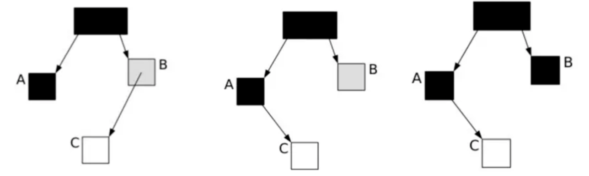
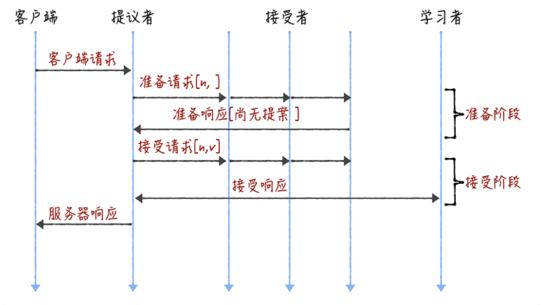
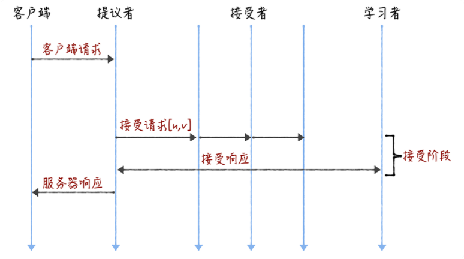
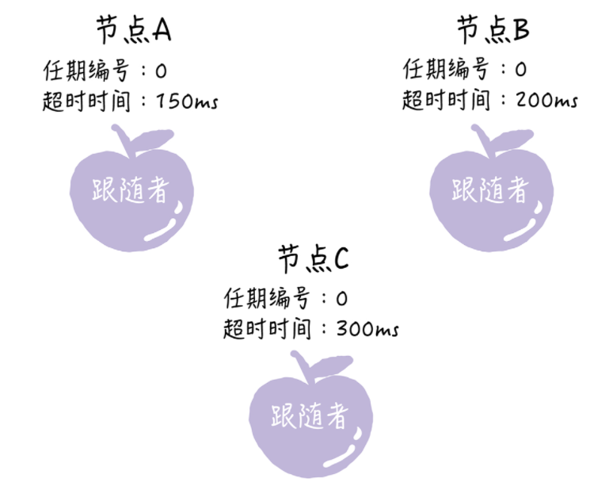
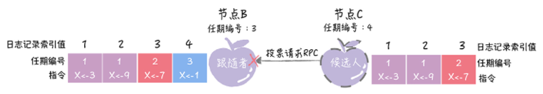
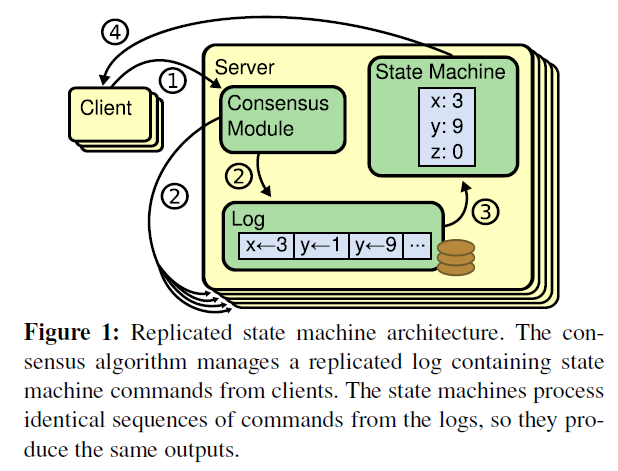
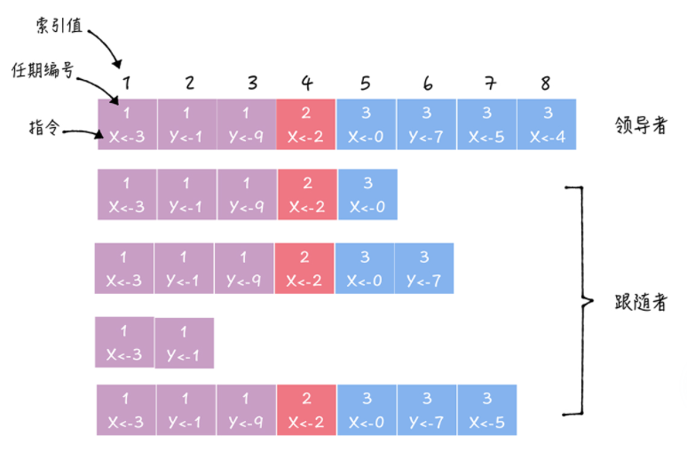
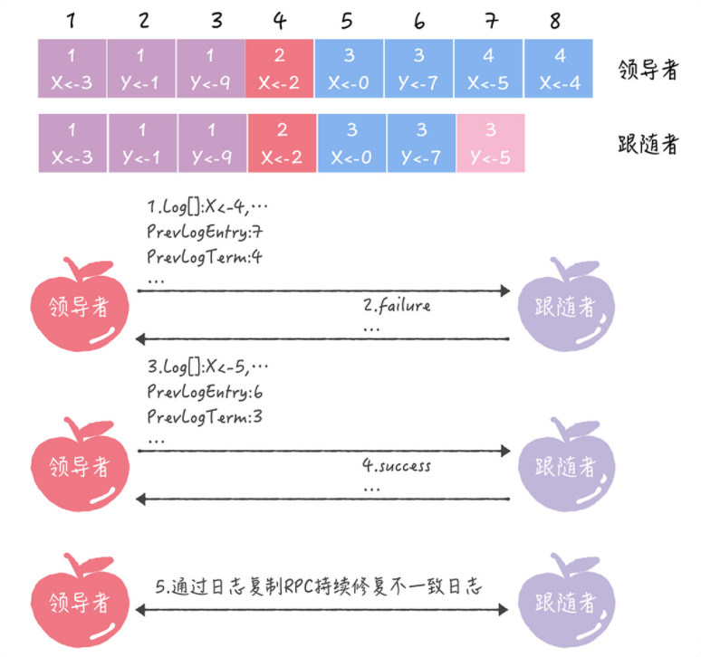

## 0 jdk版本重要特性

- jdk7
  - 增加fork/join并发架构
  - 基本整型可表达为二进制方式
  - switch语句支持字符串
  - 新增try-with-resources语句
  - 多重try-catch语句、精确的rethrow类型匹配
  - 数值字面量可用下划线分割以增加可读性
  - 泛型初始化自动类型推断(new HashMap不需要在尖括号中写类型了)
  - JVM引入G1收集器
  - 分层编译优化提升客户端VM启动速度
- jdk8
  - lambda表达式、新增java.util.stream
  - 提升HashMap碰撞时的查询效率
  - 增强自动类型推断
  - 并行Array排序
  - Java Flight Recorder
- jdk9
  - 将G1提升为默认垃圾收集器，修复问题、提升性能，实现默认基本配置运行而不需要手动配置
  - 删除一些收集器配置，如-XX:+CMSIncrementalMode、-XX:+UseCMSCompactAtFullCollection、-XX:+CMSFullGCsBeforeCompaction、-XX:+UseCMSCollectionPassing，-XX:+UseParNewGC不再使用，只能默认与CMS配对使用
- jdk10
  - G1GC的FullGC并行化
  - 本地变量类型推断
- jdk11
  - String新增方法：isBlank、lines、strip、stripLeading、stripTailing、repeat
  - var类型推断增强
  - FlightRecorder开源免费
  - 引入ZGC（expiremental，只在linux/x64上可用）
- jdk12
  - ZGC并发卸载类

### 1常见的Java问题

- ArrayList, LinkedList, HashSet, HashMap, CopyOnWriteList, ConcurrentHashMap, ConcurrentLinkedQueue, volatile, Atomic, CAS, double check locking, happen-before, Object Header, false-sharing, ThreadExecutor(Cached, Fixed, Scheduled), syncronize, Lock, CountdownLatch, Barrier, Exchanger, JVM survivor, GC Algorithem, JVM tuning, syncronize tuning in JDK1.6, strong/weak/phantom reference, String pool

#### 1.1 HashMap

- 两个参数影响其性能：initial capacity、load factor
  - 当哈希表的 Entry 个数达到二者的乘积，就会触发 rehash
  - load factor 默认为0.75是一个在时间和空间消耗上较好的折中
  - 过高的 load factor 值降低空间开销，但是会增加查找的时间消耗
- 非线程安全，可通过外部线程同步，或者初始化时调用

```
    Map m = Collections.synchronizedMap(new HashMap(...))
```

- capacity都是2的次幂
  - hash 值算法是 hashCode ^ (hashcode>>>16) 后取模运算，通过 h & (length-1) 取模
    - 这样使得一个 hash 值的有效位只有 length-1 ，因此需要高 16 位与低 16 位 XOR 扩散(TODO)
  - key 碰撞时先存成链表，链表长度 > 8 则重构为红黑树
  - 1.8 扩容的时候 rehash 更优雅
    - 每次扩容都 *2，因此 resize 时，不需要重新计算 hash，只需要看 hash 值新增的 bit 是 1 还是 0，是 0 则索引不变，是 1 则 索引 = 原索引 + oldCap。
- 老版本并发扩容时可能导致形成环形链表导致读取死循环

- getNode代码
  - 用key的hash值去查询内部数组tab能否命中；如果没命中，就返回null。
  - 命中之后，再次比较key是不是相等。根据key是红黑树还是链表来查找

```java
    final Node<K,V> getNode(int hash, Object key) {
        Node<K,V>[] tab; Node<K,V> first, e; int n; K k;
        if ((tab = table) != null && (n = tab.length) > 0 &&
            (first = tab[(n - 1) & hash]) != null) {
            if (first.hash == hash && // always check first node
                ((k = first.key) == key || (key != null && key.equals(k))))
                return first;
            if ((e = first.next) != null) {
                if (first instanceof TreeNode)
                    return ((TreeNode<K,V>)first).getTreeNode(hash, key);
                do {
                    if (e.hash == hash &&
                        ((k = e.key) == key || (key != null && key.equals(k))))
                        return e;
                } while ((e = e.next) != null);
            }
        }
        return null;
    }
```

- putVal代码

  - 如果内部数组Table为空，先初始化表（resize）
  - 计算 key的hash 值，在数组的对应 index 上插入新值，如果当前数组对应位置为空，直接插入
  - 如果数组上对应位置已有值
    - 判断该 Node 是否为 TreeNode，如果是 TreeNode 则直接插入
    - 如果是 List，在链表尾部插入的同时，记录 binCount，若 binCount > 8 将链表转换为树

  ```java
      final V putVal(int hash, K key, V value, boolean onlyIfAbsent,
                     boolean evict) {
          Node<K,V>[] tab; Node<K,V> p; int n, i;
          if ((tab = table) == null || (n = tab.length) == 0)
              n = (tab = resize()).length;
          if ((p = tab[i = (n - 1) & hash]) == null)
              tab[i] = newNode(hash, key, value, null);
          else {
              Node<K,V> e; K k;
              if (p.hash == hash &&
                  ((k = p.key) == key || (key != null && key.equals(k))))
                  e = p;
              else if (p instanceof TreeNode)
                  e = ((TreeNode<K,V>)p).putTreeVal(this, tab, hash, key, value);
              else {
                  for (int binCount = 0; ; ++binCount) {
                      if ((e = p.next) == null) {
                          p.next = newNode(hash, key, value, null);
                          if (binCount >= TREEIFY_THRESHOLD - 1) // -1 for 1st
                              treeifyBin(tab, hash);
                          break;
                      }
                      if (e.hash == hash &&
                          ((k = e.key) == key || (key != null && key.equals(k))))
                          break;
                      p = e;
                  }
              }
              if (e != null) { // existing mapping for key
                  V oldValue = e.value;
                  if (!onlyIfAbsent || oldValue == null)
                      e.value = value;
                  afterNodeAccess(e);
                  return oldValue;
              }
          }
          ++modCount;
          if (++size > threshold)
              resize();
          afterNodeInsertion(evict);
          return null;
      }
  
  ```

#### 2.2 ConcurrentHashMap

> 漏掉了CopyOnWriteArrayList，后期有时间，补上。TODO

@jdk7 使用分段锁设计；iterator 不会抛 concurrentModification 异常，但是只能被一个线程操作；size 方法开销很大 


```java
   public V put(K key, V value) {
            Segment<K,V> s;

            if (value == null)
                throw new NullPointerException();

            int hash = hash(key);

            // segmentMask：段掩码，假如segments数组长度为16，则段掩码为16-1=15；segments长度为32，段掩码为32-1=31
            // segmentShift：2的sshift次方等于ssize，segmentShift=32-sshift
            // 若segments长度为16，segmentShift=32-4=28
            // 若segments长度为32，segmentShift=32-5=27, 而计算得出的hash值最大为32位，无符号右移segmentShift，
            // 则意味着只保留高几位（其余位是没用的），然后与段掩码segmentMask位运算来定位Segment
            int j = (hash >>> segmentShift) & segmentMask;
            if ((s = (Segment<K,V>) UNSAFE.getObject          // nonvolatile; recheck
                 (segments, (j << SSHIFT) + SBASE)) == null) //  in ensureSegment
                s = ensureSegment(j);
            return s.put(key, hash, value, false);
	}
```


@jdk8 改为 CAS 设计，更细力度地控制锁，①对于一个空的Node，CAS无锁添加；对于非空的Node，对Node加锁（synchronized，锁可以被优化）；增加 addCount 方法专门记录 size ；并发修改一个下标的 Node 时才加 synchronized ，并且只锁定当前的 Node

- 取值操作不阻塞，因此与更新操作会有所重叠；取值操作反映最近正好已完成的更新，即这种反映遵循一种 happen-before 的关系；批量操作时，并发取值操作操作反映部分的插入、移除的结果，而非批量操作的整体完成后的结果；同理，迭代器操作反映的是迭代器创建那一刻的结果集

- isEmpty、size、containsValue 只在 map 不并发更新的时候准确，适合用于监控或估算，而不适于程序控制；不支持 Null Key/Value

- putVal

  - 计算 hash 值，自旋访问 table，table 为空则采用 CAS 初始化 table
  - 获取 hash 值对应节点位置 i，若该位置为空则 CAS 插入
  - 若有HashMap在扩容，则先执行 helpTransfer 帮助迁移到新 table。会再次自旋进入循环体。
  - 否则，以当前节点的链表、树的头结点为 lock 加锁，进行 add 操作

  > 可以发现，和HashMap的putVal流程很类似，区别在于由于并发性，ConcurrentHashMap有CAS操作和synchronized。

```java
final V putVal(K key, V value, boolean onlyIfAbsent) {
        if (key == null || value == null) throw new NullPointerException();
        int hash = spread(key.hashCode()); // 1 计算hash值
        int binCount = 0;
        for (Node<K,V>[] tab = table;;) { // 1 自旋访问table
            Node<K,V> f; int n, i, fh;
            if (tab == null || (n = tab.length) == 0)
                tab = initTable(); // 1 为空CAS初始化table
            else if ((f = tabAt(tab, i = (n - 1) & hash)) == null) { // 2 获取table中对应Node i位置，如果位置为空，直接CAS插入
                if (casTabAt(tab, i, null,
                             new Node<K,V>(hash, key, value, null)))
                    break;                   // no lock when adding to empty bin
            }
            else if ((fh = f.hash) == MOVED) // 3 如果HashMap在扩容，执行helpTransfer迁移到新table
                tab = helpTransfer(tab, f);
            else { // 4 否则，说明一切正常，是链表Node就添加，是TreeNode也添加。因为是并发的map，所以这个地方加锁
                V oldVal = null;
                synchronized (f) {
                    if (tabAt(tab, i) == f) {
                        if (fh >= 0) {
                            binCount = 1;
                            for (Node<K,V> e = f;; ++binCount) {
                                K ek;
                                if (e.hash == hash &&
                                    ((ek = e.key) == key ||
                                     (ek != null && key.equals(ek)))) {
                                    oldVal = e.val;
                                    if (!onlyIfAbsent)
                                        e.val = value;
                                    break;
                                }
                                Node<K,V> pred = e;
                                if ((e = e.next) == null) {
                                    pred.next = new Node<K,V>(hash, key,
                                                              value, null);
                                    break;
                                }
                            }
                        }
                        else if (f instanceof TreeBin) {
                            Node<K,V> p;
                            binCount = 2;
                            if ((p = ((TreeBin<K,V>)f).putTreeVal(hash, key,
                                                           value)) != null) {
                                oldVal = p.val;
                                if (!onlyIfAbsent)
                                    p.val = value;
                            }
                        }
                    }
                }
                if (binCount != 0) {
                    if (binCount >= TREEIFY_THRESHOLD)
                        treeifyBin(tab, i);
                    if (oldVal != null)
                        return oldVal;
                    break;
                }
            }
        }
        addCount(1L, binCount);
        return null;
    }
```

- get操作：比较简单，就是用key的hash值去命中Node。没有加锁，使用volatile来保证可见性。这就是所谓的弱一致性。

```java
    public V get(Object key) {
        Node<K,V>[] tab; Node<K,V> e, p; int n, eh; K ek;
        int h = spread(key.hashCode());
        if ((tab = table) != null && (n = tab.length) > 0 &&
            (e = tabAt(tab, (n - 1) & h)) != null) { // 1 用key的hash值去命中Node
            if ((eh = e.hash) == h) {
                if ((ek = e.key) == key || (ek != null && key.equals(ek)))
                    return e.val;
            }
            else if (eh < 0) // 2 遇到resize，去寻找新的地方寻找key
                return (p = e.find(h, key)) != null ? p.val : null;
            while ((e = e.next) != null) { // 3 链表式查找
                if (e.hash == h &&
                    ((ek = e.key) == key || (ek != null && key.equals(ek))))
                    return e.val;
            }
        }
        return null;
    }
```

##### size

- 1.8中的 size 增加 baseCount、counterCells 来辅助记录 size，优化性能

```java
	/**
     * Base counter value, used mainly when there is no contention,
     * but also as a fallback during table initialization
     * races. Updated via CAS.
     */
    private transient volatile long baseCount;

    private transient volatile CounterCell[] counterCells;

    /**
     * A padded cell for distributing counts.  Adapted from LongAdder
     * and Striped64.  See their internal docs for explanation.
     */
    @sun.misc.Contended static final class CounterCell {
        volatile long value;
        CounterCell(long x) { value = x; }
    }
```

- put方法结束后，调用 addCount 方法以 CAS 的方式自增 baseCount，如果 CAS 失败则使用 CAS 记录到 counterCell 中

```java
	private final void addCount(long x, int check) {
        CounterCell[] as; long b, s;
        if ((as = counterCells) != null ||
            !U.compareAndSwapLong(this, BASECOUNT, b = baseCount, s = b + x)) {
            CounterCell a; long v; int m;
            boolean uncontended = true;
            if (as == null || (m = as.length - 1) < 0 ||
                (a = as[ThreadLocalRandom.getProbe() & m]) == null ||
                !(uncontended =
                  U.compareAndSwapLong(a, CELLVALUE, v = a.value, v + x))) {
                fullAddCount(x, uncontended);
                return;
	......
```

* 如果记录 counterCell 的 CAS 失败则调用 fullAddCount 继续自旋 CAS 直到成功

#### 四种引用

- 强引用:无论什么时候都不会自动回收（场景：正常使用）
- 软引用:空间不足才会回收对象（场景：适合缓存）
- 弱引用:不是立刻回收而是GC发现后会在下次GC时才会回收对象。（场景：如果对象偶尔使用可WeakReference.）
- 虚引用:必须和引用队列(ReferenceQueue)联合使用,本次GC发现立即回收对象（场景：GC里面使用？）

StrongReference、WeakReference、SoftReference、PhantomReference

- WeakReference 引用的对象，当没有强引用指向它后，将在 GC 时被回收；如果其作为 Map.Entry 中的key，则整个 Entry 会被移除。

```java
    Obejct reference = new Object();    WeakReference<Obejct> weakRef = new WeakReference<>(reference);    reference = null;    System.gc(); // 被回收    AssertNull(weakRef.get())
```

- SoftReference 与 WeakReference 特性类似，区别在于 SoftReference 被回收的时机是在 JVM 内存不足之时；因此适合用于做缓存

```java
		String str = new String("abc");		SoftReference<String> softReference = new SoftReference<String>(str);		// 浏览器的回退可以用缓存设计：    if(softReference.get() != null) {        page = softReference.get(); // 内存充足，还没有被回收器回收，直接获取缓存    } else {        page = browser.getPage();// 内存不足，软引用的对象已经回收        softReference = new SoftReference(page);// 重新构建软引用    }
```

- PhantomReference，调用 get 永远返回 null，用于跟踪引用何时被 enqueue 至 ReferenceQueue 中.**虚引用必须和引用队列(ReferenceQueue)联合使用**。

  > 对于GC来看，当垃圾回收器准备回收一个对象时，如果发现它还有虚引用，会在回收之前，把虚引用加入到与之关联的引用队列中。
  >
  > 对于用户来看，如果程序发现某个虚引用已经被加入到ReferenceQueue，那么回收之前采取一些行动。

```java
    String str = new String("abc");    ReferenceQueue queue = new ReferenceQueue();    // 创建虚引用，要求必须与一个引用队列关联    PhantomReference pr = new PhantomReference(str, queue);
```

## 3 JVM


### 结构、回收算法

- 基本结构：程序计数器、JVM 栈、native 栈、堆、运行时常量池
- 分区：垃圾收集器把堆分为新生代、老年代、永久代，1.8 版本后引入了 MetaSpace 替换永久代，本地内存。
- 直接内存: NIO，`DirectByteBuffer分配
- 基本回收算法：标记清除，标记整理，复制

- 对象分配策略
  - 优先分配在新生代
  - 大对象直接老年代(-XX:PretenureSizeThreshold)
  - 长时间存活对象进入老年代(- XX:MaxTenuringThreshold)
  - 若 Survivor 中相同年龄的对象大小和 > Survivor 空间的一半，则年龄大于等于该值的对象直接进入老年代
  - 空间分配担保策略
    - YGC 前 JVM 检查老年代的连续空间是否大于新生代所有对象总和
    - 若上述为否且 HandlePromotionFailure 为 true ，则检查老年代连续空间是否大于每次晋升对象的平均大小
    - 若上述为否，或 HandlePromotionFailure 为 false ，则触发 FullGC

- GC Roots和对象路由
  - GC Roots 包括：本地变量、静态变量、JNI 引用等
  - 垃圾收集器内有一组成为 OopMap 的数据结构存储了所有对象的地址
- SafePoint
  - 以“是否具有让程序进入长时间运行的特征”作为标准，如方法跳转、异常跳转
  - GC 过程中用户线程的中断方式是主动式中断，具体行为是用户线程不断轮训收集器的中断标志，如果为真则就近的安全点中断自身
  - 对于已挂起的用户线程，其在挂起之前，先将自身标记为“已进入安全域”（Safe Region），解决用户线程在 Sleep、Blocked 时无法响应 JVM 中断请求而导致 JVM 等待的问题

### 类加载

- 类的生命周期

  

- 类的加载顺序

  - 静态变量 > 静态初始化块 > 成员变量 > 初始化块 > 构造器

- 双亲委派模型：

  - 委托给父类加载器加载，防治内存中同一个对象出现多次。
  - 
  - BootStrap ClassLoader，加载/JAVA_HOME/lib下的类库，或-Xbootclasspath指定的路径且能被JVM识别的类库
  - Extension ClassLoader，加载/JAVA_HOME/lib/ext下的类库，或java.ext.dirs系统变量指定路径下的类库
  - Application ClassLoader，加载用户类路径上（classpath）的指定类库
  - 类加载器的作用：判断是类是否相等

### Card Table

- 解决问题：分代收集中跨代引用，引入卡表后只需扫描对应的 Dirty Card
- CMS  Remember Set ，实现就是 Card Table
- 

- Card Page
  - 将堆空间划分为2次幂大小的卡页，512字节
  - 卡表：标记每个 Card Page 的状态
- Write Barrier
  - 对象引用发生写操作，写屏障将标记 Card Page 标记位 dirty。（CMS和G1）

- Remember Set概念
  - Card Table 是 remember set 的一种具体实现（字长精度、对象精度、卡精度）

### 三色标记法

- 解决问题：标记清除算法，存在长时间暂停。（实时性要求高的系统不能用）

- 异步执行，以极少的中断时间代价来进行整个 GC。

- 三色标记

  - 黑色：根对象，或者该对象与它的子对象都被扫描
  - 灰色：对象本身被扫描，但还没扫描完该对象中的子对象
  - 白色：未被扫描对象，扫描完成所有对象之后，最终为白色的为不可达对象，即垃圾对象

- 标记过程

  * 根对象为黑，其子对象为灰
  * 遍历灰对象，将白的变灰，灰的变黑
  * 遍历完，只剩下黑和白

- 存在的问题

  - 标记过程不是原子性的，因此对象引用关系变化会导致多标漏标问题（细节TODO）

    

  - 漏标问题：当A被置为黑色（完成标记），B被置为灰色等待扫描子对象时，子对象C的引用关系由B->C变成A->C，就会导致C漏标

* 解决：
  * Incremental update（CMS）
    - 简要：只要在 write barrier 里发现要有一个白对象的引用被赋值到一个黑对象的字段里，那就把这个白对象变成灰色的（例如说标记并压到 marking stack 上，或者是记录在类似 mod-union table 里）
    - post-write barrier
  * SATB（G1）
    - 简要原理：把 marking 开始时的逻辑快照里所有的活对象都看作活的，具体做法是在 write barrier 里把所有旧的引用所指向的对象都变成非白的（已经黑灰就不用管，还是白的就变成灰的）
    - 解决的问题：CMS 重新标记阶段暂停时间过长的风险
    - 通过 TAMS 指针识别并发 GC 过程中新分配的对象，新分配的都认为的活的对象（隐式标记）
    - 
      - 第 n 轮并发标记开始，Region 当前的 top 指针赋值给 next TAMS，在并发标记标记期间，新对象都在[next TAMS, top]之间分配，SATB 确保这部分的对象都会被标记，默认都是存活的
      - 当并发标记结束时，next TAMS 所在的地址赋值给 previous TAMS，SATB 给 [bottom, previous TAMS] 之间的对象创建一个快照 Bitmap，垃圾对象通过快照被识别出来
  * pre-write barrier
    - 拦截对象引用修改写入操作，通 过G1SATBCardTableModRefBS::enqueue(oop pre_val) 把原引用保存到 satb mark queue 中，最终这部分会被合并的 Snapshot 中

### 收集器原理机制

#### Concurrent Mark Sweep

- 概念、数据结构

  - DirtyCard
  - Mod-Union Table（具体实现是Bitmap，标识新生代晋升、直接在老年代分配、老年代引用关系变更的对象）
  - RememberSet，记录老年代哪个Card中的对象引用了新生代（O -> Y），解决新生代标记的问题
  - PromotionFailed、Concurrent Mode Failure

- 回收步骤

  

  - CMS-initial-mark, STW，初始标记 GC-Roots 可达对象：遍历新生代对象，标记可达的老年代对象；默认单线程，可通过配置调整为多线程（-XX:+CMSParallelInitialMarkEnabled）

  - CMS-concurrent-mark，遍历 initial-mark 标记的对象，递归标记这些对象可达的对象，针对老年代引用关系变更记录 Dirty Card，新生代对象晋升记录 Mod-Union Card（若某个CardTable中的Card中记录为1，YoungGC 时扫描该 Card 发现没有持有新生代的引用，那么该 Card 清除，并将 Mod-Union Card 中对应元素置为 1）

    - CMS-concurrent-clean，optional，默认开启；处理因为上阶段过程中，引用关系改变，未标记的对象变成存活的，会扫描Dirty的Card。如下图的的3和6，在上阶段是未标记对象，即不可达对象。

    

    - CMS-concurrent-abortable-preclean， Optional ，承担下一个阶段Final Remark阶段足够多的工作，期待能够发送一次YoungGC。若 Eden 区 CMSScheduleRemarkEdenSizeThreshold=2M，则略过此步骤；否则循环执行 concurrent-mark ，直到 1）达到设置的循环次数（默认0），2）达到执行时间限制（默认5s），Eden 区内存使用率达到阈值 CMSScheduleRemarkEdenPenetration（默认50%）；可通过 CMSScavengeBeforeRemark 配置每次 abortable-preclean 都触发一次 Young GC。

  - CMS-final-remark，STW，**标记整个老年代的所有的存活对象**。具体：遍历新生代对象重新标记，根据老年代GC Roots重新标记，遍历老年代 Dirty Card 重新标记（大部分 Dirty Card 已经在 clean 阶段处理过）。（耗时长，则提前触发一次YoungGC）

  - CMS-concurrent-sweep，回收不可达对象，三种情况下会触发压缩：

    - UseCMSCompactAtFullCollection (默认true)和CMSFullGCsBeforeCompaction(默认0)时每次GC都进行压缩（其实是整理）
    - 执行了System.gc()
    - 新生代分配担保失败

  - CMS-concurrent-reset，重置CMS内部的数据结构，进入下一个CMS生命周期

- 存在的问题

  - 长时间运行内存碎片化
  - final remark存在风险，停顿时间可能过长
  - 大内存性能差，GC时间不可控

#### G1

标记-整理，局部（两个 Region 之间）“复制”，无内存空间碎片。

- 几个重要的数据结构：
  - Region、CSet（CollectionSet）多个 Region 构成回收集
  - G1 Remembered Set：记录本Region中所有对象引用的对象所在的区域（我指向谁，谁指向我），防止全堆扫描


* 初始标记（Initial Marking)：STW，一条初始标记线程对所有与 GC Roots 直接关联的对象进行标记。触发一次Mintor GC。
* 并发标记(Concurrent Marking)：使用**一条**标记线程与用户线程并发执行。速度很慢。此外，当 对象 图 扫描 完成 以后， 还要 重新 处理 SATB 记 录下 的 在 并发 时有 引用 变动 的 对象。
* 最终标记（Final Marking）：STW。再标记阶段是用来收集 并发标记阶段 产生新的垃圾(并发阶段和应用程序一同运行)；G1中采用了比CMS更快的初始快照算法:snapshot-at-the-beginning (SATB)。
* 筛选回收（Live Data Counting and Evacuation）：STW，统计Region数据，回收价值和成本排序，根据期望停顿时间来回收。回收单元是Collection Set，复制到空Region，多线程。


**另外一种源码阐述**

- 每次回收都只回收 CSet（Collection Set）中的 Region ，YoungGC 即 CSet 中只包含 young region 、 MixedGC 则是 Cset 中包含 young region 和 old region
- 混合 GC 的触发条件：触发阈值 -XX:InitiatingHeapOccupancyPercent(默认45%)
- 混合 GC 的步骤
  - Initial Mark，STW，借助一次 YoungGC 完成，标记可能持有老年代对象引用的Survivor Region，同时初始化TAMS指针用于记录新分配对象
  - Root Region Scanning，并发执行，扫描 Survivor 区根引用，必须在下一次 YoungGC 到来之前完成
  - Concurrent Marking，并发执行，寻找整个堆空间中存活的对象，可被一次YoungGC中断
  - Remark，STW，完成最终的整堆存活对象标记，使用 SATB 算法
  - Cleanup，统计存活对象和完全空闲的 Region（STW)，擦除 RSet 内容（STW），重置空的 Region 并将其返还给 free list（并发）
  - Copying，STW，拷贝存活对象到新的未使用的 Region 空间，可以是 YoungGC，也可以是 MixedGC 时发生

#### SATB

混合GC使用的标记算法：Snapshot at the Begining

- ConcurrentG1RefineThread，只专注扫描日志缓冲区记录的卡片来维护更新RSet

- pre-write barrier，post-write barrier

- logging write barrier

  - SATBMarkQueue，SATBMarkQueueSet（pre-write barrier）
  - DirtyCardQueue，DirtyCardQueueSet（post-write barrier，解决的是RSet指向关系变更的问题）
  - 为减少 write barrier 对 mutator 的性能影响，G1 收集器将部分 barrier 的逻辑记录到队列（SATBMarkQueue、DirtyCardQueue）中，再由其他线程消费队列批量处理

- 简要原理：把 marking 开始时的逻辑快照里所有的活对象都看作活的，具体做法是在 write barrier 里把所有旧的引用所指向的对象都变成非白的（已经黑灰就不用管，还是白的就变成灰的）

- 解决的问题：CMS 重新标记阶段暂停时间过长的风险

- 通过 TAMS 指针识别并发 GC 过程中新分配的对象，新分配的都认为的活的对象（隐式标记）

- TAMS（top at mark start），previous TAMS，next TAMS

  

  - 第 A 步：初始标记阶段，需要 STW，将扫描 Region 的 Top 值赋值给nextTAMS
  - 第 A ~ B 步之间：会发生并发标记阶段
  - 第 B 步：重新标记阶段，此时并发标记阶段生成的新对象都会被分配在 [nextTAMS, Top] 之间，这些对象会被定义为“隐式对象”，同时 _next_mark_bitmap 也开始存储nextTAMS标记的对象的地址
  - 第 C 步：清除阶段，_next_mark_bitmap 和 _prev_mark_bitmap 会进行交换，同时清理 [Bottom, previousTAMS] 之间被标记的所有对象，对于“隐式对象”会在下次垃圾收集过程进行回收（如第 F 步），这也是 SATB 存在弊端，会一定程度产生未能在本次标记中识别的浮动垃圾

- 存在的问题
  - 要维护数量众多的跨 Region 引用，需要复杂的卡表，消耗大量内存；CMS 只需一张老年代到新生代的卡表
  - 需要写前屏障来维护大量卡表，还需要写后屏障来维护原始快照

### 调优

- 单次停顿过长
  - Xmx、Xms
  - AlwayPretouch、Swap、Cpu load
  - Concurrent GC Thread
- 频率较高，整体吞吐率低
- 回收率较低（新生代、老年代）
- 导致 FullGC 的失败
  - CMS Failure：PromotionFailed、ConcurrentModeFailure
  - G1 Failure：EvacuationFailure、Humongous Object Fragmentation
- G1：MixedGC 慢、UPdateRS、ScanRS 慢、Object Copy 慢
- MixedGC 调优：
  - -XX:G1MixedGCCountTarget，增加次数降低单次延迟
  - -XX:G1MixedGCLiveThresholdPercent，避免将较满的 Region 加入候选
  - -XX:G1HeapWastePercent，增加堆的冗余度
- 更造触发 GC 避免单次GC停顿过长
  - -XX:-G1UseAdaptiveIHOP and -XX:InitiatingHeapOccupancyPercent
- sys、user、real


**详细版**

- -XX:+AlwaysPreTouch，启动的时候真实的分配物理内存给JVM
  - 新生代对象晋升，要为老年代先分配物理内存，影响了新生代GC的效率。
  - 优点：加快代码运行效率，缺点：启动时间变慢。

## 4 分布式协议

- CAP

  - 一致性（各节点间的数据一致）、可用性（**有限时间**内**返回结果**）、分区容错性（部分子网络故障不会导致整个系统不可用）
    - 一致性分为
      - 强一致性
      - 单调一致性 
      - 会话一致性
      - **最终一致性**：用户只能读到某次更新后的值，但系统保证数据将最终达到完全一致的状态，只是所需时间不能保障。
      - 弱一致性

- BASE

  - 核心：基本可用（Basically Available）和最终一致性（Eventually consistent）
  - **基本可用的方法：流量削峰、延迟响应、体验降级、过载保护**
  - Basically Available（响应时间增加、功能部分损失如降级）、Soft state（允许不同节点数据副本之间进行数据带来的延迟）、Eventually consistent（数据经过一段时间同步后最终能到达一个一致的状态）

  实现最终一致性的具体方式？

  - 读时修复：在读取数据时，检测数据的不一致，进行修复。

  - 写时修复：在写入数据，检测数据的不一致时，进行修复。

  - **异步修复：这个是最常用的方式，通过定时对账检测副本数据的一致性，并修复。**

### 2PC

- 阶段1 提交事务请求（投票阶段）：
  - 事务询问（proposer）
  - 执行事务，记录undo、redo（acceptor）
  - 各参与者向协调者反馈事务询问响应（acceptor）
- 阶段2 执行事务提交
  - 假如所有参与者反馈都是yes，则执行事务提交
    1. 发送commit请求（proposer）
    2. 事务commit（acceptor）
    3. 反馈事务commit结果（acceptor）
    4. 完成事务（proposer）
  - 假如任何一个参与者反馈no，则执行中断事务
    1. 发送rollback请求（proposer）
    2. 事务rollback（acceptor）
    3. 反馈事务rollback结果（acceptor）
    4. 中断事务（proposer）
- 存在的问题：同步阻塞、单点问题、脑裂（致使数据不一致）、过于保守（少量节点失败导致整体提交失败）

### 3PC

- 改进2PC的提交事务请求阶段，变成三个阶段：

  - CanCommit
    1. 事务问询（proposer）
    2. 各个参与者向协调者反馈事务询问的响应（acceptor）
  - PreCommit
    1. 发送预提交请求（proposer）
    2. 事务预提交（acceptor）
    3. 各参与者向协调者反馈事务预执行的相应ack/abort（acceptor）
    4. 若任何一个参与者反馈no，则中断事务（proposer）
       - 发送中断请求abort（proposer）
       - 中断事务（acceptor）
  - do Commit，一旦进入此阶段，即使协调者出现问题或网络故障，参与者都会在等待超时之后继续提交事务
    1. 发送提交请求（proposer）
    2. 事务提交（acceptor）
    3. 反馈事务提交结果（acceptor）
    4. 完成事务（proposer）
    5. 若协调者正常工作且任意一个参与者反馈no，则中断事务（proposer）
       - 发送中断请求（proposer）
       - 事务回滚（acceptor）
       - 反馈事务回滚结果（acceptor）
       - 中断事务（proposer）

- 优缺点

  1. 将commit确认和实际commit拆分，降低了参与者阻塞范围，单点故障后，仍然可继续达成一致
  2. 但是preCommit阶段网络故障依然会导致不一致问题（TODO)

  

### Paxos

-  Basic Paxos 算法，描述的是多节点之间如何就某个值（提案 Value）达成共识；
-  Multi-Paxos 思想，描述的是执行多个 Basic Paxos 实例，就一系列值达成共识。


- 三个角色：Proposer、Acceptor、Learner
- 通过不断加强这个约束：“在一次Paxos算法执行实例中，只批准一个value”，获得了 Paxos 算法
- 论文里，Acceptor保证**三个重要的承诺**：
  - 如果准备请求的提案编号，**小于等于**接受者已经响应的准备请求的提案编号，那么接受者将承诺不响应这个准备请求；
  - P1a: 如果接受请求中的提案的提案编号，**小于**接受者已经响应的准备请求的提案编号，那么接受者将承诺不通过这个提案；
  - P2c: 如果接受者之前有通过提案，那么接受者将承诺，会在准备请求的响应中，包含**已经通过的最大编号的提案信息**。

**Basic Paxos算法流程**



- 算法伪代码


- proposer 生成提案

  - prepare 阶段

    - proposer 选择一个新的提案编号 n ，然后发送请求给 acceptor 集合，并要求其作如下承诺：

      - acceptor 收到 prepare 请求后，如果提案的编号大于它已经回复过的所有 prepare 消息(**回复消息表示接受  accept**)，则 acceptor 将自己上次接受的提案回复给 proposer，并承诺不再回复小于 n 的提案

      - 举例说明：

        假设一个 acceptor 已经响应过（accept）所有的 prepare 请求，对应提案编号为 1、2、3、...、7，那么 acceptor 接收到编号为 8 的 prepare 请求会，就会将编号为 7 的提案（7，value=x）作为响应反馈给 proposer 

  - accept 阶段

    - 当一个 proposer 收到了多数 acceptors 对 prepare 的回复后，就进入批准（accept）阶段 
    - proposer 要向回复 prepare 请求的 acceptors 发送 accept 请求，包括编号 n 和根据 P2c 决定的 value（如果根据P2c没有已经接受的value，那么它可以自由决定value） 
    - 只要 acceptor 尚未对编号大于 n 的 prepare 请求响应，就可以通过这个提案 

  - learner 提案获取（解决单个proposer向大量节点同步数据引起的性能问题）

    - 选取一批 learner 集合作为主 learner 集，acceptor 将批准的提案发送给这个集合，这个集合的每个 learner 可以在一个提案被选定后通知所有其他的 learner 

#### 优缺点

- 优点，具有容错能力：当少于一半的节点出现故障的时候，共识协商仍然在正常工作。
- 局限性：只能就单个值（Value）达成共识。
- 活锁问题：多个Proposer的问题
  - proposer-1 提出 n1，完成了阶段1(准备阶段) 
  - 此时 proposer-2 提出 n2，也完成了阶段1
  - 由于提案号n2>n1,于是 acceptor 忽略 proposer-1 发送的 accept 请求，这导致 proposer-1 再次进入阶段1（伪代码第6步）并提出 n3(n3>n2)，而如果它也完成了阶段1，就会导致  proposer-2 在阶段2的 Accept 请求被忽略 。
  - 以此类推，提案选定过程将陷入活锁
- 2轮RPC问题

### Multi-Paxos

直接通过多次执行 Basic Paxos 实例，来实现一系列值的共识。

- Basic Paxos只能对一个值形成决议，决议的形成至少需要2 轮 RPC 通讯，在高并发情况下需要更多的网络来回可能形成活锁 
- Basic Paxos 无法支持连续确定多个值，因此 Basic Paxos 不适合应用在实际工程中 

- Multi-Paxos 正是为解决此问题而提出，Multi-Paxos 基于 Basic Paxos 做了两点改进: 
  1. 针对每一个要确定的值，运行一次 Paxos 算法实例（Instance），形成决议，每一个 Paxos 实例使用唯一的 Instance ID 标识 
  2. 在所有 Proposers 中选举一个 Leader，由 Leader 唯一地提交 Proposal 给Acceptors 进行表决。
     - Multi-Paxos 首先需要选举 Leader，可执行一次 Basic Paxos 实例来选举出一个  Leader 
     - 选出 Leader 之后只能由 Leader 提交 Proposal，没有  Proposer 竞争，解决了活锁问题
     - 在系统中仅有一个 Leader 进行 Proposal 提交的情况下，Prepare 阶段可以跳过 ，两阶段变为一阶段，提高效率 

**改进点：**

- 领导者节点作为唯一提议者。

- 优化 Basic Paxos 执行
  - “当领导者处于稳定状态时，省掉准备阶段，直接进入接受阶段”

整个流程：



## Raft

**Raft 算法是通过一切以领导者为准的方式，实现一系列值的共识和各节点日志的一致。**

> Raft 算法属于 Multi-Paxos 算法，做了一些简化和限制，比如增加了日志必须是连续的，只支持领导者、跟随者和候选人三种状态。**现在分布式系统开发首选的共识算法**，比如 Etcd、Consul

如何保证在同一个时间，集群中只有一个领导者呢？

服务器节点状态有3种：

- 领导者（Leader）
- 跟随者（Follower）: 接收和处理来自领导者的消息，当等待领导者心跳信息超时的时候，就主动站出来，推荐自己当候选人。
- 候选人（Candidate）: 向其他节点发送请求投票（RequestVote）RPC 消息，通知其他节点来投票，如果赢得了大多数选票，就晋升当领导者。
- 

### 0 请求完整流程

  当系统（leader）收到一个来自客户端的写请求，到返回给客户端，整个过程从leader的视角来看会经历以下步骤：

- leader **append log entry**
- leader issue AppendEntries RPC in parallel
- leader wait for majority response, **committed**
- leader **apply entry to state machine**
- leader reply to client
- leader notify follower apply log

> Raft中，副本数据是以日志的形式存在的，领导者接收到来自客户端写请求后，处理写请求的过程就是一个复制和提交日志项的过程。

### 1 选举领导者

是属于Basic Paxos。

- election timeout（wait until become candidate）
  - 初始化在 150-300ms 之间，follower 等待超时后会成为 candidate 状态
  - follower 成为 candidate 后就会发起一次新的选举任期，它会给自己投票，并向其他 node 发送 “Request Vote” 消息
  - 接收到请求的node如果尚未投票且在此轮选举中，则直接投票给 candidate，并重置 election timeout
- heartbeat timeout（heatbeat send interval）
  - Leader定期向follower发送“Append Entries”消息，发送间隔为heartbeat timeout
  - Follower响应Append Entries消息，并重置election timeout
  - 整个状态不断维持，直到一个follower不再收到heartbeat

- （全部是跟随者）初始状态下，集群中所有的节点都是跟随者的状态。



> Raft 算法实现了随机超时时间的特性。

### 细节

**节点间是如何通讯的呢？**RPC，2类RPC

- （候选人）请求投票（RequestVote）RPC，是在选举期间发起，通知各节点进行投票；

- （领导者）日志复制（AppendEntries）RPC，是由领导者发起，用来复制日志和提供心跳消息。

**选举有哪些规则？**

- **领导者发送心跳消息**（即不包含日志项的日志复制 RPC 消息），阻止跟随者发起新的选举。

- 如果心跳超时，跟随者推举自己为候选人，发起领导者选举。
- 每一个服务器节点最多会对一个任期编号投出一张选票，“先来先服务”。

- 在选举中，赢得大多数选票的候选人，将晋升为领导者。

对先来先服务的补充：

- 当任期编号相同时，日志完整性高的跟随者（也就是最后一条日志项对应的任期编号值更大，索引号更大），拒绝投票给日志完整性低的候选人。




**随机超时时间又是什么？**

解决选举过程中，选票被平均瓜分，导致选举无效的情况发生。（随机超时，可以让大多数情况下，只有1个节点先发起选举)

- 心跳信息超时的时间间隔，是随机的；

- 当没有候选人赢得过半票数，选举无效了，这时需要等待一个随机时间间隔，也就是说，等待选举超时的时间间隔，是随机的。

### 与Multi-Paxos不同

- Raft不是所有的节点都可以是Leader，只有日志最完整的节点才可以。
- 日志必须是连续的。Multi-Paxos 不要求日志是连续的

### 小结

Raft算法选举领导者的几个原则：（如何保证任何时候只有1个领导者，如何减少选举失败?）

- 任期
- 领导者心跳消息
- 随机选举超时
- 先来先服务
- 大多数选票原则


### 2 复制日志

共识算法的实现一般是基于复制状态机（Replicated state machines）(**相同的初识状态 + 相同的输入 = 相同的结束状态**。)

- 在raft中，leader将客户端请求（command）封装到一个个log entry，将这些log entries复制（replicate）到所有follower节点，然后大家按相同顺序应用（apply）log entry中的command，则状态肯定是一致的。

  




**如何复制日志？优化 Basic Paxos 执行**

- 领导者进入第一阶段，通过日志复制（AppendEntries）RPC 消息，将日志项复制到集群其他节点上。
- 如果领导者接收到大多数的“复制成功”响应后，它将日志项提交到它的状态机，并返回成功给客户端。如果领导者没有接收到大多数的“复制成功”响应，那么就返回错误给客户端。

> 领导者提交了自己的日志项，为什么没有通知跟随者提交日志项呢?
>
> 这是Raft的一个优化，额外通过其他时候的日志复制 RPC 消息或心跳消息告知。因为这些消息里面包含了当前最大的，将会被提交的日志项索引值。
>
> - 好处：降低了一半的消息延迟


#### **如何复制日志的具体流程？**


- 接收到客户端请求后，领导者基于客户端请求中的指令，创建一个新日志项，并附加到本地日志中。

- 领导者通过日志复制 RPC，将新的日志项复制到其他的服务器。

- 当领导者将日志项，成功复制到大多数的服务器上的时候，领导者会将这条日志项提交到它的状态机中。

- 领导者将执行的结果返回给客户端。

- 当跟随者接收到心跳信息，或者新的日志复制 RPC 消息后，如果跟随者发现领导者已经提交了某条日志项，而它还没提交，那么跟随者就将这条日志项提交到本地的状态机中。

#### 如何实现日志的一致？

源于：进程崩溃、服务器宕机等问题

思路：领导者通过强制跟随者直接复制自己的日志项，处理不一致日志。具体有 2 个步骤。

- 领导者通过日志复制 RPC 的一致性检查，找到跟随者节点上，与自己相同日志项的最大索引值。也就是说，这个索引值之前的日志，领导者和跟随者是一致的，之后的日志是不一致的了。
- 领导者强制跟随者更新覆盖的不一致日志项，实现日志的一致。




- 领导者发送当前最新日志项到跟随者（7,4)

- 跟随者在它的日志中，找不到(7,4) 的日志项，跟随者返回失败信息。

- 领导者会递减日志项，并发送新的日志项（6,3）

- 跟随者在它的日志中，找到了 （6,3），返回成功。

- 领导者通过日志复制 RPC，复制并更新覆盖跟随者。（实现了日志一致性）

> 如何解决leader频繁切换导致的日志可能被回滚的问题？
>
> 某个leader选举成功之后，不会直接提交前任leader时期的日志，而是通过提交当前任期的日志的时候“顺手”把之前的日志也提交了，具体怎么实现了，在log matching部分有详细介绍。那么问题来了，如果leader被选举后没有收到客户端的请求呢，论文中有提到，在任期开始的时候发立即尝试复制、提交一条空的log

### 小结

- 在 Raft 中，副本数据是以日志的形式存在的，指令表示用户指定的数据。
- Multi-Paxos 不要求日志是连续的，但在 Raft 中日志必须是连续的。日志完整性最高的节点才能当选领导者。
- Raft 是通过以领导者的日志为准，来实现日志的一致的。

### 3 成员变更

背景：节点上下线，原有3台节点，现在新入2台，如何保证集群不会分裂，出现2个领导者。

**最常用的方法：单节点变更**。

- 有什么办法能突破 Raft 集群的写性能瓶颈呢？参考Kafka的分区和ES的主分片副本分片这种机制


**网络分区，怎么保证读写数据的正确性？**


在系统中貌似出现了两个leader：term 1的Node B， term 2的Node E, Node B的term更旧，但由于无法与Majority节点通信，NodeB仍然会认为自己是leader。

在这样的情况下，我们来考虑读写。

- 写请求发送到了NodeB，NodeB无法将log entry 复制到majority节点，因此不会告诉客户端写入成功，这就不会有问题。
- 读请求，stale leader可能返回stale data，比如在read-after-write的一致性要求下，客户端写入到了term2任期的leader Node E，但读请求发送到了Node B。如果要保证不返回stale data，leader需要check自己是否过时了，办法就是与大多数节点通信一次，这个可能会出现效率问题。另一种方式是使用lease，但这就会依赖物理时钟。（TODO）
- 从raft的论文中可以看到，leader转换成follower的条件是收到来自更高term的消息，如果网络分割一直持续，那么stale leader就会一直存在。而在raft的一些实现或者raft-like协议中，leader如果收不到majority节点的消息，那么可以自己step down，自行转换到follower状态。

### leader crash

leader在请求过程中，任一时候crash，raft是如何容错的，保障数据一致性的？

当leader crash的时候，事情就会变得复杂。在[这篇文章](http://www.cnblogs.com/mindwind/p/5231986.html)中，作者就给出了一个更新请求的流程图。


记录一下重要的：

- 3.1阶段：数据到达 Leader 节点，成功复制到 Follower 所有节点，但还未向 Leader 响应接收
  - 这个阶段 Leader 挂掉，虽然数据在 Follower 节点处于未提交状态（Uncommitted）但保持一致，重新选出 Leader 后可完成数据提交，此时 Client 由于不知到底提交成功没有，可重试提交。针对这种情况 Raft 要求 RPC 请求实现幂等性，也就是要实现内部去重机制。
- 3.1 阶段：数据到达 Leader 节点，成功复制到 Follower 部分节点，但还未向 Leader 响应接收
  - 这个阶段 Leader 挂掉，数据在 Follower 节点处于未提交状态（Uncommitted）且不一致，Raft 协议要求投票只能投给拥有最新数据的节点。所以拥有最新数据的节点会被选为 Leader 再强制同步数据到 Follower，数据不会丢失并最终一致。
- 网络分区导致的脑裂情况，出现双 Leader
  网络分区将原先的 Leader 节点和 Follower 节点分隔开，Follower 收不到 Leader 的心跳将发起选举产生新的 Leader。这时就产生了双 Leader，原先的 Leader 独自在一个区，向它提交数据不可能复制到多数节点所以永远提交不成功。向新的 Leader 提交数据可以提交成功，网络恢复后旧的 Leader 发现集群中有更新任期（Term）的新 Leader 则自动降级为 Follower 并从新 Leader 处同步数据达成集群数据一致。

- 领导者节点作为唯一提议者。


### ZAB（ZooKeeper Atomic Broadcast）

- 定义
  - leader、followers：Zookeeper 集群中，一个节点充当 leader 角色，其余皆为 follower. 
    - leader职责是接受所有客户端请求，协调内部各个服务器。 
    - follower职责是处理客户端非事务请求，参与Proposal的投票和leader选举。
  - transactions：leader 将客户端变更传播给 follower（TODO）
  - 'e'：leader 的纪元 / epoch（任期、term等类似概念）. 纪元是一个整型，leader 当选时的纪元必须比之前的leader纪元要大（TODO）
  - 'c'：一个由 leader 生成的有序数值，从 0 开始并单调递增. 这个值和 epoch 一并用于给接收到的客户端状态变更请求排序（二者通过位运算共同构成 ZXID ）（TODO）
  - 'F.history'：follower 的历史队列，用于提交按顺序接收到的事务（TODO）
  - 待决事务：一组位于 F.history 中的事务，其序列号小于当前提交的序列号（TODO）

- ZAB 所需前提
  1. 复制担保
     - 可靠投递：如果事务 M 被一台服务器提交（commit），其终将被所有服务器提交
     - 全局有序：如果事务 A 于事务 B 之前被一台服务器提交，在所有其他服务器上 A 也将先于B被提交. 如果 A 和 B 都被提交，要么 A 先于 B 被提交，要么 B 先于 A 被提交（不存在同时提交）
     - 因果有序：如果事务 B 在事务 A 提交之后被 sender B 发送，那么 A 的顺序必须在 B 之前. 如果一个sender先发送 B 后发送 C，那么 C 的顺序必须排在 B 之后.（逻辑顺序不受物理条件影响，比如发送端的顺序和接收端最终提交的顺序必须一致）
  2. 只要大多数（quorum）nodes 已启动，事务就会被复制
  3. 若 node 故障但随后又重启，它应能追上故障期间已经复制完成的事务

#### 具体实现

- 消息广播复制(2PC的变种)
  - 客户端读取任何一个 Zookeeper 节点
  - 客户端将状态变更写入任何一个 Zookeeper 节点，这个状态变更就会被转发到主（leader）节点
  - Zookeeper 使用一个两阶段提交协议的变种来实现事务复制到 follower
    1. 当 leader 接收到客户端的修改更新请求，它就生成带有序列号 c 和 leader epoch的事务，并发送给所有follower ( leader)
    2. follower 将事务添加到自己的 history queue 中并回复 leader 一个 ACK (follower)
    3. 当 leader 接收到一组 quorum 的 ACK 后，它就向 quorum 发送这个事务的 commit 请求(leader)
    4. follower 会在收到 commit 请求后就提交事务，除非 follower 本地的 history queue 中事务的序列号都低于 c（即历史事务早于当前事务），这时，它将一直等待直到所有早先的事务（待解决事务）的 commit 请求都接收到并处理完成后，才去提交当前的事务 (follower)


- 集群崩溃恢复

  - 当 leader 崩溃时，所有节点一起执行一个通用的一致恢复协议，之后集群恢复日常运作，确立一个新的 leader 来广播状态变更

  - 要充当 leader 角色，节点必须由一组 quorum nodes 的支持. 由于节点随时可能崩溃和恢复，随着时间推移会产生多个 leader，事实上一个节点可能充当一个角色数次

  - 节点的生命周期：每个节点一次执行协议的一个迭代，任何时候，一个进程可以中断当前迭代，跳转到 Phase 0 重新开始

    - Phase 0：选举（election）
    - Phase 1：发现（discovery）
    - Phase 2：同步（synchronization）
    - Phase 3：广播（broadcast）

  - Phase 1 和 2 对于集群内的相互一致性很重要，尤其是从故障中恢复时

  - Phase 1 发现（摘要：从 quorum 中找到最完备的 F.history）

    - follower 和即将当选的 leader 通信，以便让 leader 收集信息知悉follower最近接收到的事务
    - 这个步骤的目的是发现 quorum 中接收最多的变更序列，并开启新的纪元 epoch = e' 以免先前的leader提交它们的提议（proposal）
    - quorum 拥有先前 leader 发送的所有变更，因此可以做出保证：quorum中至少有一个节点（其 epoch 最大或 epoch 不小于其他跟随者而 lastZxid 最大）的 history queue 中包含先前 leader 发送的所有变更，这同时也意味着新的 leader 也会拥有这些变更

    

    > 注：理论上被选举出来的 prospective leader 应具有最大的 zxid，即接收了最新的事务，为什么还要向 quorum 中的 follower 获取历史事务？

  - Phase 2 同步（摘要：将'发现'步骤中获得的 F.history 作为提案提出）

    - '同步步骤'使用 leader 的历史更新事务副本来同步，这些事务在'发现步骤'中从集群中获得，同步完成后，整个协议的恢复（recovery）阶段结束 
    - leader 和 follower 通信，将历史事务拿出来作为提案提出（leader）
    - 如果 follower 自身的事务历史序列落后于 leader 的，follower 就认可 leader 的提议（follower）
    - 当 leader 收到 quorum 的确认，它就分发提交（commit）消息至 quorum，此时 leader 就宣称确立，不再是潜在状态（leader）

  


  - Phase 3 广播
    - 如没有崩溃发生，节点永久地停留在这个阶段，一旦客户端发起一个写请求，节点就执行事务广播（leader）
    - 对于 observer，leader 会发送 inform 消息，其中包含提议的内容（follower）


> 为了检测故障，ZAB 在 leader 和 follower 之间使用定期的心跳消息通信. 如果leader 在一段时间内没有收到 quorum（majority）的心跳，它就放弃自己自己的 leader 身份，将状态切换成选举和 Phase 0. 如果 follower 在一段时间内也没收到 leader 的心跳，就跳转到 Leader Election Phase.

- ZXID
  - ZXID 低 32 位为自增计数，高 32 位代表了 Leader 周期 epoch 编号
  - 当选举出一个新的 Leader 时，就会从这个 leader 本地日志中去的最大事务提议的 ZXID，解析出对应的 epoch 值再自加 1，以此作为新的 ZXID 的高 32 位，低 32 位则从 0 开始

## 4 Zookeeper

* 分布式协调服务框架，主要依靠文件系统和监听通知机制。

- 特性：顺序一致性（主要是写操作的严格顺序性，每个更新请求都会分配一个全局唯一的递增编号）、原子性、单一视图（Single System Image）、可靠性（只要集群中有超过一半的机器能工作整个集群就能对外提供服务）、实时性（ZK将全量数据存储在内存中，因此适合读操作为主的应用场景）

- CP系统，分析A:极端情况下，不能保证每次服务请求的可用性；leader选举时集群都是不可用。

- 三种角色：Leader、Follower、Observer，Leader 提供读写，Follower 和 Observer 只提供读服务，Observer 不参与 Leader 选举过程，也不参与写操作的“过半写成功”策略，因此 Observer 可以不影响写性能的情况下提升集群读性能

  - leader职责是接受所有客户端请求，协调内部各个服务器。 
  - follower职责是处理客户端非事务请求，参与Proposal的投票和leader选举。
  - observer职责是处理客户端非事务请求，不参与投票。（为什么这么设计？）

- session管理(TODO)

  - 三个状态：CONNECTING、CONNECTED、CLOSE
  - SessionID生成

  ```
      long nextSid = 0;
      nextSid = (System.currentTimeMillis() << 24) >> 8;
      nextSid = nextSid | (id << 56);
      return nextSid;
  ```

  - 会话管理采用分同策略，将类似的会话方在同一区块中进行管理，以便ZK对会话进行不同区块的隔离处理以及同一区块的统一处理，分配原则是每个会员的“下次超时时间点”：`ExpirationTime = ((CurrentTime + SessionTimeout) / ExpirationInterval + 1) * ExpirationInterval`

  

  - 客户端在会话超时时间过期范围内向服务器发PING保持会话有效性（心跳检测）
    - 服务端则需要接受客户端的PING并按需激活会话（TouchSession），将会话迁移到新的区块内
    - 客户端发现在SessionTimeout / 3的时间内未和服务端通信，则发起一次PING触发服务端激活session
    - 服务端SessionTracker有一个单独的线程专门进行会话超时检查，以ExpirationInterval作为时间点来触发检查，每次检查就检查过期的桶中所有剩下的未被迁移的会话即可
  - 当客户端与服务端网络断开，客户端会自动反复重连直到连上集群中的一台机器，如果在会话超时时间内重新连上，则状态改为 *CONNECTED*（CONNECTION_LOSS），如果超过超时时间才连上，则为 *EXPIRED*（SESSION_EXPIRED）

- **ZAB Leader选举(面试重点：ZAB的领导者选举过程 TODO)**

- 

  - 服务器状态
    - LOOKING：Leader 选举阶段
    - FOLLOWING：跟随者状态
    - LEADING：领导者状态
    - OBSERVING：观察者状态
  - 选票数据结构
    - logicClock：每个服务器维护一个自增整数，表示该服务器发起的第几轮投票
    - state：服务器当前状态
    - self_id：服务器的 myid
    - self_zxid：服务器上接收到的事务的最大 zxid
    - vote_id：被推举的服务器 myid
    - vote_zxid：被推举的服务器上保存的事务的最大 zxid
  - 投票流程
    - 自增选举轮次
      - 一次有效的投票必须在同一轮次中，开始新一轮投票时，服务器先对自己的logicClock自增
    - 初始化选票
      1. 服务器广播自己的选票前，先将自己的投票箱清空
      2. 投票箱用于记录收到的选票，如：服务器2投票给服务器3，服务器3投票给服务器1，则服务器1的投票箱内将存储(2, 3)，(3, 1)，(1, 1)
      3. 票箱中只记录投票者的最后一票，如投票者A更新自己的选票，其他服务器收到该选票后会在更新票箱中A的选票
    - 发起初始化选票
      - 每个服务器最开始通过广播把票投给自己
    - 接收外部投票
      - 服务器尝试从其他服务器获得投票，计入自己的投票箱内
      - 如果无法获得任何外部选票，则确认自己是否与集群中其他的服务器保持着有效的连接；如果是则再次发送自己的投票；否则马上建立连接
    - 判断选举轮次
      - 收到外部投票后，首先根据投票信息中所包含的 logicClock 来进行不同处理：
        1. 外部投票的 logicClock 大于自身的 logicClock，说明该服务器的选举轮次落后于其他服务器，立即清空自己的投票箱，并把自己的 logicClock 更新为接收到的 logicClock，然后再对比自己之前的投票与收到的投票以确定是否需要变更自己的投票，最终再次将自己的投票广播出去
        2. 外部投票的 logicClock 小于自身的 logicClock，当前服务器直接忽略该选票，继续处理下一个投票
        3. 外部投票的 logickClock 自身的相等，则进行选票 PK
    - 选票PK
      - 选票 PK 基于（self_id, self_zxid）与（vote_id, vote_zxid）的对比
        1. 外部投票的 logicClock 大于自身的，则将自己的 logicClock 及自己的选票的 logicClock 变更为收到的 logicClock
        2. 若 logicClock 一致，则对比二者的 vote_zxid，若外部投票的 vote_zxid 比较大，则将自己的票中的 vote_zxid 与 vote_myid 更新为收到的票中的 vote_zxid 和 vote_myid 并广播出去，另外将收到的票以及自己更新后的票放入自己的票箱. 如果票箱内已存在（self_myid, self_zxid）相同的选票，则直接覆盖
        3. 若二者的 vote_zxid 一致，则比较二者的 vote_myid，若外部的投票的 vote_myid 比较大，则将自己的票种的 vote_myid 更新为收到的票种的 vote_myid 并广播出去，另外将受到的票以及自己更新后的票放入自己的票箱
    - 统计选票
      - 如果已经确定过半服务器认可了自己的投票（可能是更新后的投票），则投票终止；否则继续接受其他服务器的投票
    - 更新服务器状态
      - 投票终止后，服务器开始更新自身状态. 若过半票投给了自己，则将自己的服务器状态更新为LEADING，否则将自己的状态更新为 FOLLOWING

- 数据同步

  - 几个定义
    - peerLastZXID：learner 服务器最后处理的 ZXID
    - miniCommittedLog：leader outstanding proposals queue committedLog 中最小的 ZXID
    - maxCommittedLog：leader outstanding proposals queue committedLog 中最大的 ZXID
  - 直接差异化同步（DIFF同步）：peerLastZXID ∈ (minCommittedLog, maxCommittedLog)
  - 先回滚在差异化同步（TRUNC+DIFF同步），用于Leader宕机时没有成功发起 roposal 但已经将事务记录到本地事务日志中，这时重启服务后，需要先回滚，再做DIFF同步：peerLastZXID ∉ F.history
  - 全量同步（SNAP同步）：peerLastZxid < minCommittedLog || (leader.outstandingProposalsQueue == null && peerLastZXID != lastProcessedZXID)


## 5 Netty

1. Netty 是什么？Netty 的特点是什么？

2. Netty 的优势有哪些？为什么要用  Netty？

3. Netty 的应用场景有哪些？

   

4. BIO、NIO和AIO的区别？NIO的组成？

5. Netty的线程模型？Netty 核心组件有哪些？分别有什么作用？

6. EventloopGroup 了解么?和 EventLoop 啥关系? Bootstrap 和 ServerBootstrap 了解么？


1. NIOEventLoopGroup源码？NioEventLoopGroup 默认的构造函数会起多少线程？
2. Netty 服务端和客户端的启动过程了解么？默认情况  Netty 起多少线程？何时启动？
3. Netty 发送消息有几种方式？


1. Netty 高性能表现在哪些方面？什么是  Netty 的零拷贝？
2. TCP 粘包/拆包的原因及解决方法？
3. 了解哪几种序列化协议？如何选择序列化协议？
4. Netty 支持哪些心跳类型设置？Netty 长连接、心跳机制了解么？
5. Netty 和 Tomcat 的区别？

## 6 kafka

分布式流处理框架，构建流处理应用，企业级的消息引擎

### 概念

- LEO、LSO、AR、ISR、HW
  - LEO:Log End Offset。日志末端位移
  - LSO:Log Stable Offset，事务
  - AR：Assigned Replicas。所有副本集合
  - **ISR**:In-Sync Replicas，与 Leader 同步的副本
    - 副本是否 ISR？replica.lag(10s)
  - **HW**：高水位值（High watermark）,消费者可见，ISR中最小的LEO。
  - 
- controller、leader、follower
  - controller负责全局meta信息维护，管理Broker上下线、topic管理、管理分区副本分配、leader选举、管理所有副本状态机和分区状态机；通过zookeeper实现选举
  - leader和follower是针对partition而言，当leader宕机，controller将从ISR中使用分区选择算法选出新的leader

### Producer

* TCP连接是如何建立的

- 幂等性Producer是如何实现的？0.11，at least once + 幂等 = exactly once

  - 单分区不重复，单会话不重复。(重启，丢失缓存)

  - 解决：单会话ACK 超时导致重复
    - Broker缓存消息，根据PID和SequenceNumber判重
    - ProducerID：唯一的ProducerID，标识client
    - SequenceNumber：TopicPartition级别，每条消息带着，Broker判重。

  

  * 申请PID
    * Client：InitProducerIdRequest 发送给连接数最少的Broker
    * Broker: TransactionCoordinator的ProducerIdManager生产唯一id，TransactionCoordinator负责与Producer通信，更新message的事物状态。
    * PID 申请是向 ZooKeeper 申请，类似于CompareAndSwap的方式，来写入PID，写入成功，就申请成功；失败就重试。

- Producer请求过程


1. KafkaProducer 的 `send()` 将数据添加到 RecordAccumulator
2. Producer 发送线程 Sender申请PID,`sendProducerData()` 方法发送数据
3. 进入Broker端逻辑，判重在Broker端，batchMetadata 缓存batch ，5（社区测试）

- 什么情况不能保证补充不丢不重
  - 有 topic-partition 的 batch 重试多次失败，超时被移除，这sequence number 无法连续，需要重置ProducerID，Broker端缓存被清空。

* 如何实现写消息一定有序
  * Producer设置，影响Broker，
  * MAX_IN_FLIGHT_REQUESTS_PER_CONNECTION =1，有序、性能
  * 当出现重试时，max-in-flight-request 可以动态减少到 1，在正常情况下还是按 5 （CA取舍)


- 事务性Producer：

  * 多分区不重复。

  * TransactionManager 实例，它的作用有以下几个部分：
    1. 记录本地的事务状态（事务性时必须）；
    2. 记录一些状态信息以保证幂等性，比如：每个 topic-partition 对应的下一个 sequence numbers 和 last acked batch（最近一个已经确认的 batch）的最大的 sequence number 等；
    3. 记录 ProducerIdAndEpoch 信息（PID 信息）。

### Consumer

- 是什么
  - 官网，可扩展、容错性的消费者机制
  - 多个Consumer实例。订阅主题，共同消费。某个挂掉，rebalance。
- offset
  - 每个消息在partition的唯一ID
- __consumer_offsets
  - 注册消费者以及保存位移值，GroupCoordinator管理、读写

### Controller

- 做什么
  - Topic、Partition管理，Prefer 领导者选举：LeaderAndIsrRequest
    - Broker管理，元数据管理：UpdateMetadataRequest
- 是什么
  - 给 Broker 发送 3 类请求，即 LeaderAndIsrRequest、StopReplicaRequest 和 UpdateMetadataRequest，
- 脑裂，ActiveControllerCount>1，僵住
  - 背景：Controller FullGC太长，网络故障
  - 影响Topic的创建、修改、删除操作的**信息同步**。不影响现有topic的读写。
  - 解决：新的controller在zk生成新的controller epoch，并同步给broker，旧controller的指令，broker自动忽略。

### Zookeeper

- 作用
  - 元数据管理、成员管理、Controller 选举。（现在2.8已经移除zk）
  - 

### 副本

- Leader 和 Follower 区别
  - Leader读写
  - Follower PULL同步数据（2.4 ，可读）
-  Leader 和 Follower 的消息序列在实际场景中不一致，如何确保一致性
  - 高水位机制（无法保证 Leader 连续变更场景下的数据一致性）
  - Leader Epoch 机制


### 实际操作

- 监控 Kafka
  - Kafka Manager、Kafka Monitor、JMX 监控、JMXTool
- Broker 的 Heap Size 如何设置
  - 稳定后，手动触发(jmap)Full GC，存活对象的 1.5~2 倍。 6GB。
- 估算 Kafka 集群的机器数量？
  - 带宽
  - 磁盘
- 

## 杂货

### 企业监控平台Prometheus

| Zabbix                                                       | Prometheus                                                   |
| :----------------------------------------------------------- | :----------------------------------------------------------- |
| 后端用 C 开发，界面用 PHP 开发，定制化难度很高。             | 后端用 golang 开发，前端是 Grafana，JSON 编辑即可解决。定制化难度较低。 |
| 集群规模上限为 10000 个节点。                                | 支持更大的集群规模，速度也更快。                             |
| 更适合监控物理机环境。                                       | 更适合云环境的监控，对 OpenStack，Kubernetes 有更好的集成。  |
| 监控数据存储在关系型数据库内，如 MySQL，很难从现有数据中扩展维度。 | 监控数据存储在基于时间序列的数据库内，便于对已有数据进行新的聚合。 |
| 安装简单，zabbix-server 一个软件包中包括了所有的服务端功能。 | 安装相对复杂，监控、告警和界面都分属于不同的组件。           |
| 图形化界面比较成熟，界面上基本上能完成全部的配置操作。       | 界面相对较弱，很多配置需要修改配置文件。                     |
| 发展时间更长，对于很多监控场景，都有现成的解决方案。         | 2015 年后开始快速发展，但发展时间较短，成熟度不及 Zabbix。   |
| Push 模型（客户端发送数据给服务端）                          | Pull 模型在云原生环境中有比较大的优势，                      |

- 客户端使用push的方式上报监控数据到pushgateway，prometheus会定期从pushgateway拉取数据。使用它的原因主要是:Prometheus 采用 pull 模式，可能由于不在一个子网或者防火墙原因，导致Prometheus 无法直接拉取各个 target数据
- Counter 
  - Counter 用于累计值，例如 记录 请求次数、任务完成数、错误发生次数。
  - 一直增加，不会减少。
  - 重启进程后，会被重置。
- Gauge
  - Gauge 常规数值，例如 温度变化、内存使用变化。
  - 可变大，可变小。
  - 重启进程后，会被重置
- Histogram 柱状图
  - 常用于跟踪事件发生的规模，例如：请求耗时、响应大小。它特别之处是可以对记录的内容进行分组，提供 count 和 sum 全部值的功能。例如：{小于10=5次，小于20=1次，小于30=2次}，count=8次，sum=8次的求和值
- Summary
  - Summary和Histogram十分相似，常用于跟踪事件发生的规模，例如：请求耗时、响应大小。同样提供 count 和 sum 全部值的功能。
    例如：count=7次，sum=7次的值求值
    它提供一个quantiles的功能，可以按%比划分跟踪的结果。例如：quantile取值0.95，表示取采样值里面的95%数据。

- **summary和histogram的选择** 
  - Summary 结构有频繁的全局锁操作，对高并发程序性能存在一定影响。histogram仅仅是给每个桶做一个原子变量的计数就可以了，而summary要每次执行算法计算出最新的X分位value是多少，算法需要并发保护。会占用客户端的cpu和内存。
  - 不能对Summary产生的quantile值进行aggregation运算（例如sum, avg等）。例如有两个实例同时运行，都对外提供服务，分别统计各自的响应时间。最后分别计算出的0.5-quantile的值为60和80，这时如果简单的求平均(60+80)/2，认为是总体的0.5-quantile值，那么就错了。
  - summary的百分位是提前在客户端里指定的，在服务端观测指标数据时不能获取未指定的分为数。而histogram则可以通过promql随便指定，虽然计算的不如summary准确，但带来了灵活性。
  - histogram不能得到精确的分为数，设置的bucket不合理的话，误差会非常大。会消耗服务端的计算资源。

所以对比得到的总结是：

1. 如果需要聚合（aggregate），选择histograms。
2. 如果比较清楚要观测的指标的范围和分布情况，选择histograms。如果需要精确的分为数选择summary。
