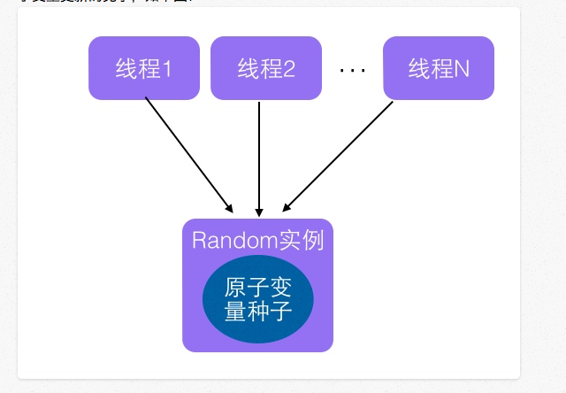
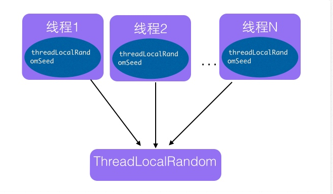

## 0Java并发类

记录一些常用类的背景和使用场景

#### 1 ThreadLocalRandom 生成随机数

- 背景：有了Random类，为什么还需要ThreadLocalRandom? 在多线程并发的情况下，通常情况下是怎么使用随机数的？在1.7之前是下面这张图这样的，生成1个Random实例，然后给多个线程使用。会发生什么问题呢？核心是`next(int bits)`方法，最终会使用CAS操作，用oldseed去更新new seed，这个步骤多个线程执行到这一步的时候，只有1个线程会成功，其它的线程就会自旋重试，然后都会更新一次。这里降低了并发 性能。所以用`ThreadLocalRandom`，每个线程自己有一个Random实例。

- 原理：和ThreadLocal的出现一样，解决多线程访问同一个变量的时候需要同步，让每个线程都拷贝一份变量，自己操作自己。见下图

- 使用场景呢？多线程下，如果使用随机数就可以用。

  

