## CAP

- 一致性（Consistency）

- 可用性（Availability）

- 分区容错性（Partition Tolerance）

一致性: 客户端的每次读操作，不管访问哪个节点，要么读到的都是同一份最新的数据，要么读取失败。**强调，各节点间的数据一致**

可用性：发生故障时，保证服务可用，即对于请求，**能够在有限的时间内返回结果**。

分区容错性：当节点间出现任意数量的消息丢失或高延迟的时候，系统仍然可以继续提供服务。

- CA 模型，在分布式系统中不存在。因为舍弃 P，意味着舍弃分布式系统，就比如单机版关系型数据库 MySQL，如果 MySQL 要考虑主备或集群部署时，它必须考虑 P。
- CP 模型，采用 CP 模型的分布式系统，一旦因为消息丢失、延迟过高发生了网络分区，就影响用户的体验和业务的可用性。因为为了防止数据不一致，集群将拒绝新数据的写入，典型的应用是 ZooKeeper，Etcd 和 HBase。
- AP 模型，采用 AP 模型的分布式系统，实现了服务的高可用。用户访问系统的时候，都能得到响应数据，不会出现响应错误，但当出现分区故障时，相同的读操作，访问不同的节点，得到响应数据可能不一样。典型应用就比如 Cassandra 和 DynamoDB。

**根据一致性的强弱程度不同，可以将一致性的分类为如下几种：**

**强一致性**：（strong consistency）。任何时刻，任何用户都能读取到最近一次成功更新的数据。

**单调一致性**：（monotonic consistency）。任何时刻，任何用户一旦读到某个数据在某次更新后的值，那么就不会再读到比这个值更旧的值。也就是说，可获取的数据顺序必是单调递增的。

**会话一致性**：（session consistency）。任何用户在某次会话中，一旦读到某个数据在某次更新后的值，那么在本次会话中就不会再读到比这值更旧的值，会话一致性是在单调一致性的基础上进一步放松约束，只保证单个用户单个会话内的单调性，在不同用户或同一用户不同会话间则没有保障。

**最终一致性**：（eventual consistency）。用户只能读到某次更新后的值，但系统保证数据将最终达到完全一致的状态，只是所需时间不能保障。

**弱一致性**：（weak consistency）。用户无法在确定时间内读到最新更新的值。

## 2PC

常常用于，实现分布式事务。

三阶段提交协议，虽然针对二阶段提交协议的“协调者故障，参与者长期锁定资源”的痛点，通过引入了询问阶段和超时机制，来减少资源被长时间锁定的情况，不过这会导致集群各节点在正常运行的情况下，使用更多的消息进行协商，增加系统负载和响应延迟。也正是因为这些问题，三阶段提交协议很少被使用。

## BASE理论

> 这个理论很重要，地位也很高。一旦掌握它，你就能掌握绝大部分场景的分布式系统的架构技巧，设计出适合业务场景特点的、高可用性的分布式系统。

- 核心：基本可用（Basically Available）和最终一致性（Eventually consistent）

- **基本可用的方法：流量削峰、延迟响应、体验降级、过载保护**
- 最终一致性：数据副本在经过一段时间的同步后，最终能够达到一个一致的状态。(强一致性是最终一致性的一个特例。)

如何实现最终一致性呢？你首先要知道它以什么为准，因为这是实现最终一致性的关键。一般来说，在实际工程实践中有这样几种方式：

- 以最新写入的数据为准，比如 AP 模型的 KV 存储采用的就是这种方式；

- 以第一次写入的数据为准，如果你不希望存储的数据被更改，可以以它为准。

那实现最终一致性的具体方式是什么呢？常用的有这样几种。

- 读时修复：在读取数据时，检测数据的不一致，进行修复。

- 写时修复：在写入数据，检测数据的不一致时，进行修复。

- **异步修复：这个是最常用的方式，通过定时对账检测副本数据的一致性，并修复。**

> 在实现最终一致性的时候，**推荐支持 All、Quorum、One、Any 4 种写一致性级别，用户在写数据的时候，可以根据业务数据的特点，设置不同的写一致性级别。**比如可以通过设置一致性级别为 All，来实现强一致性。（Kafka是BASE理论的，最终一致性，如果ack=all，就是强一致性。

> BASE 理论在 NoSQL 中应用广泛，是 NoSQL 系统设计的事实上的理论支撑。

## Basic Paxos

- 思考题：要实现一个分布式集群：A\B\C节点组成，提供只读KV存储服务。意味着，创建只读变量，并且赋值后，不能更改。所以，所有节点必须先对只读变量的值达成共识，然后所有节点在一起创建这个变量。比如Kafka的Controller选举，通过去ZK里面新建节点，并且赋值。多个ZK node是如何达成共识的。
- 适用场景：如何在多个节点间确定某变量的值

> 最常用的共识算法都是基于它改进的。比如，Fast Paxos 算法、Cheap Paxos 算法、Raft 算法、ZAB 协议等等。

Paxos 算法包含 2 个部分：

-  Basic Paxos 算法，描述的是多节点之间如何就某个值（提案 Value）达成共识；

-  Multi-Paxos 思想，描述的是执行多个 Basic Paxos 实例，就一系列值达成共识。

重要的概念：角色是对 Basic Paxos 中最核心的三个功能的抽象

- 提案、准备（Prepare）请求、接受（Accept）请求、角色等等，
- **提议者（Proposer）**：提议一个值，用于投票表决。
- **接受者（Acceptor）**：对每个提议的值进行投票，并存储接受的值。
- **学习者（Learner）**：被告知投票的结果，接受达成共识的值，存储保存，不参与投票的过程。

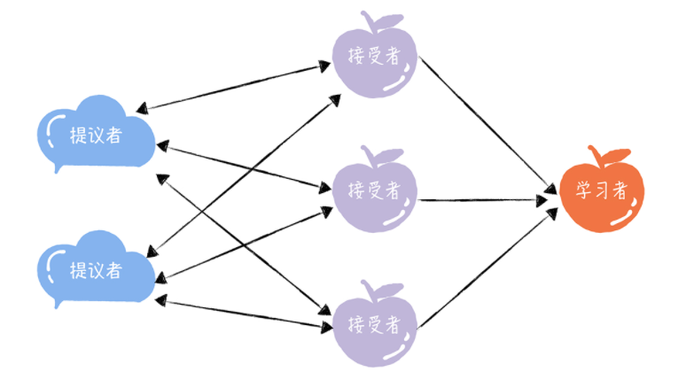

### 共识协商是二阶段提交

举例说明，使用[n, v]表示一个提案，其中 n 为提案编号，v 为提议值。

假设节点 A、B 先收到来自客户端 1 的准备请求，节点 C 先收到来自客户端 2 的准备请求。

- 准备（Prepare）阶段

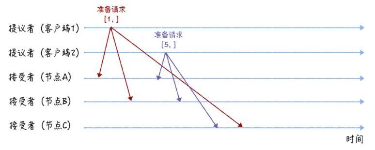

当节点 A、B 收到提案编号为 1 的准备请求，节点 C 收到提案编号为 5 的准备请求后，将进行这样的处理：

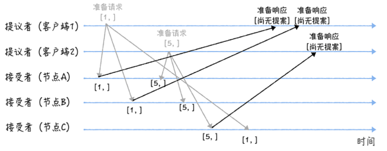

当节点 A、B 收到提案编号为 5 的准备请求，和节点 C 收到提案编号为 1 的准备请求的时候，将进行这样的处理过程：

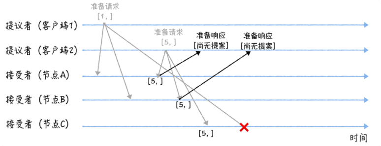

- 接受（Accept）阶段

客户端 1、2 在收到大多数节点的准备响应之后，会分别发送接受请求：

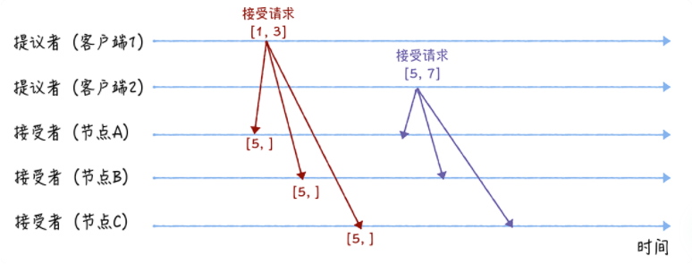

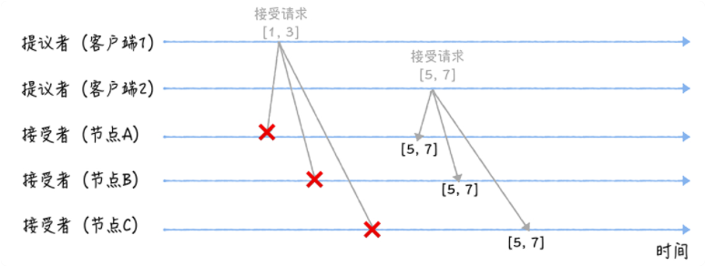

> 当接受者通过了一个提案时，就通知给所有的学习者。当学习者发现大多数的接受者都通过了某个提案，那么它也通过该提案，接受该提案的值。

一张图说明Basic Paxos：

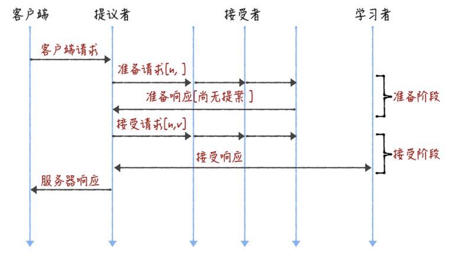

### 优缺点

- 优点，具有容错能力：当少于一半的节点出现故障的时候，共识协商仍然在正常工作。
- 局限性：只能就单个值（Value）达成共识

### 小结

- 提案编号的大小代表着优先级
- 接受者保证**三个承诺**：
  - 如果准备请求的提案编号，**小于等于**接受者已经响应的准备请求的提案编号，那么接受者将承诺不响应这个准备请求；
  - 如果接受请求中的提案的提案编号，**小于**接受者已经响应的准备请求的提案编号，那么接受者将承诺不通过这个提案；
  - 如果接受者之前有通过提案，那么接受者将承诺，会在准备请求的响应中，包含**已经通过的最大编号的提案信息**。

> 思考这个问题，有助于理解3个承诺。如果节点 A、B 已经通过了提案[5, 7]，节点 C 未通过任何提案，那么当客户端 3 提案编号为 9 ，通过 Basic Paxos 执行“SET X = 6”, 最终节点值应该是[9,7],

## Multi-Paxos

> **Multi-Paxos** 是一种思想。而 **Multi-Paxos 算法**是一个统称，它是指基于 Multi-Paxos 思想，通过多个 Basic Paxos 实例实现一系列值的共识的算法（比如 Chubby 的 Multi-Paxos 实现、Raft 算法等）

直接通过多次执行 Basic Paxos 实例，来实现一系列值的共识，问题：

- 如果多个提议者同时提交提案，可能出现因为提案冲突，在准备阶段没有提议者接收到大多数准备响应，协商失败，需要重新协商。比如5个节点，3个提议者同时，没有一个能够拿到3张选票。

- 2 轮 RPC 通讯（准备阶段和接受阶段）往返消息多、耗性能、延迟大。

### 领导者（Leader）

引入领导者节点解决第1个问题，领导者节点作为唯一提议者。

> 在 Chubby 中，主节点（也就是领导者节点）是通过执行 Basic Paxos 算法，进行投票选举产生的。

### 优化 Basic Paxos 执行

“当领导者处于稳定状态时，省掉准备阶段，直接进入接受阶段”，优化 Basic Paxos 执行。因为领导者节点上，序列中的命令是最新的。

整个流程就变成了这样，提议者是唯一的领导者。

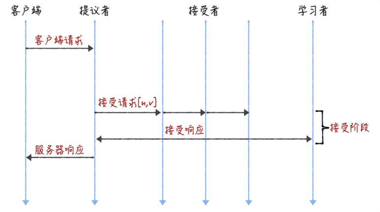

### 落地：Chubby

> Chubby是谷歌最早闭源实现了Multi-Paxos算法，工业界被Zookeeper慢慢替代

- 主节点是通过Basic Paxos算法来进行leader选举的
- 实现了"当领导者处于稳定状态时，省掉准备阶段，直接进入接受阶段"

其它补充：

- 实现了成员变更（Group membership），以此保证节点变更的时候集群的平稳运行。
- 实现强一致性，读写请求都是有主节点执行

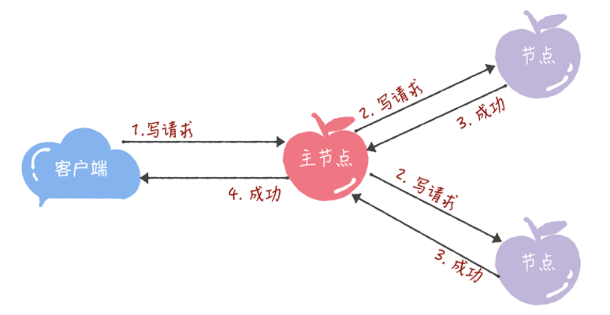

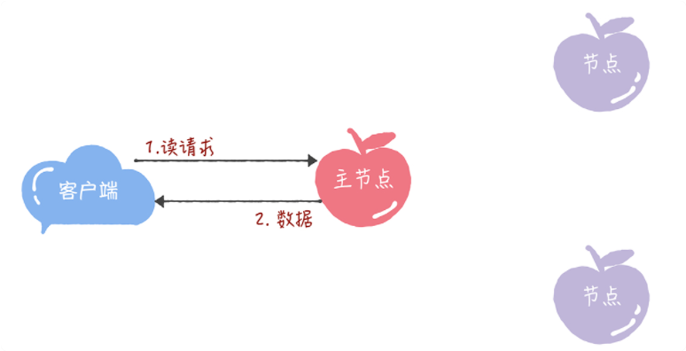

## Raft

**Raft 算法是通过一切以领导者为准的方式，实现一系列值的共识和各节点日志的一致。**

> Raft 算法属于 Multi-Paxos 算法，做了一些简化和限制，比如增加了日志必须是连续的，只支持领导者、跟随者和候选人三种状态。**现在分布式系统开发首选的共识算法**，比如 Etcd、Consul

如何保证在同一个时间，集群中只有一个领导者呢？

服务器节点状态有3种：

- 领导者（Leader）
- 跟随者（Follower）: 接收和处理来自领导者的消息，当等待领导者心跳信息超时的时候，就主动站出来，推荐自己当候选人。
- 候选人（Candidate）: 向其他节点发送请求投票（RequestVote）RPC 消息，通知其他节点来投票，如果赢得了大多数选票，就晋升当领导者。

### 1 选举领导者

是属于Basic Paxos。

- （全部是跟随者）初始状态下，集群中所有的节点都是跟随者的状态。

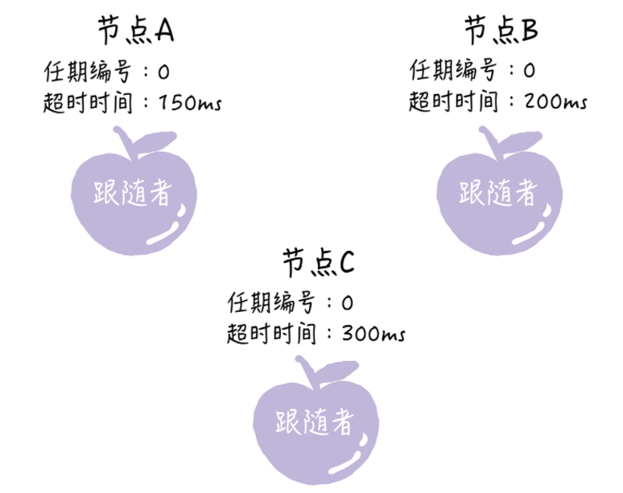

> Raft 算法实现了随机超时时间的特性。

- （候选人）节点 A 的等待超时时间最小，它会最先因为没有等到领导者的心跳信息，发生超时。A 就增加自己的任期编号，并推举自己为候选人，先给自己投上一张选票，然后向其他节点发送请求投票 RPC 消息，请它们选举自己为领导者。

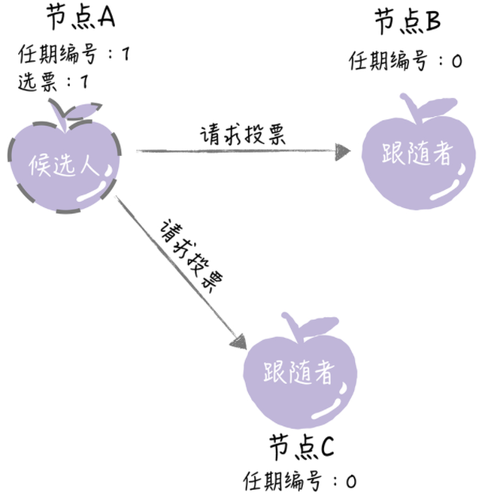

- （跟随者）其他节点接收到候选人 A 的请求投票 RPC 消息，在编号为 1 的这届任期内，也还没有进行过投票，那么它将把选票投给节点 A，并增加自己的任期编号

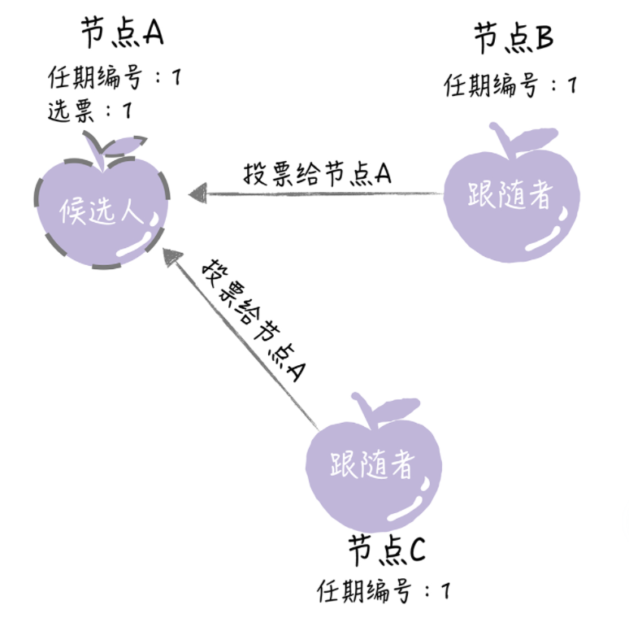

- （候选人）候选人在选举超时时间内赢得了大多数的选票，那么它就会成为本届任期内新的领导者。

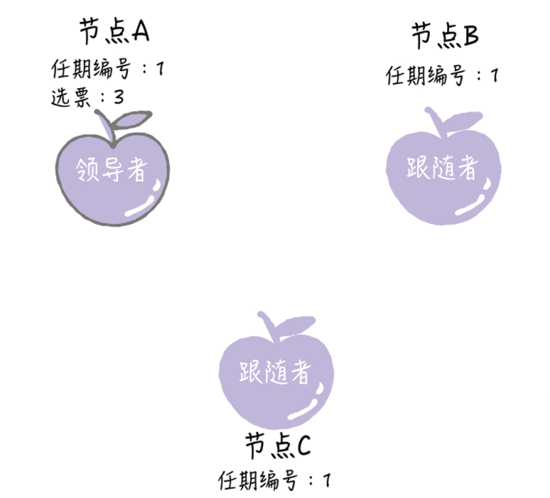

- （候选人）节点 A 当选领导者后，他将周期性地发送心跳消息，通知其他服务器我是领导者，阻止跟随者发起新的选举，篡权。

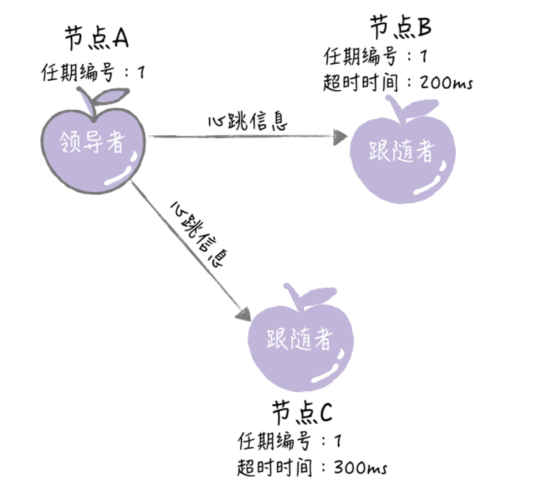

### 细节

**节点间是如何通讯的呢？**RPC，2类RPC

- （候选人）请求投票（RequestVote）RPC，是在选举期间发起，通知各节点进行投票；

- （领导者）日志复制（AppendEntries）RPC，是由领导者发起，用来复制日志和提供心跳消息。

**什么是任期呢？**

每个任期由单调递增的数字（任期编号）标识，任期编号是随着选举的举行而变化的。

- 跟随者在等待领导者心跳信息超时后，推举自己为候选人时，会增加自己的任期号。

- 如果一个节点，发现自己的任期编号比其他节点小，那么它会更新自己的编号到较大的编号值。

下面是任期约定：

- 如果一个候选人或者领导者，发现自己的任期编号比其他节点小，那么它会立即恢复成跟随者状态。
- 如果一个节点接收到一个包含较小的任期编号值的请求，那么它会直接拒绝这个请求。

**选举有哪些规则？**

- **领导者发送心跳消息**（即不包含日志项的日志复制 RPC 消息），阻止跟随者发起新的选举。

- 如果心跳超时，跟随者推举自己为候选人，发起领导者选举。
- 每一个服务器节点最多会对一个任期编号投出一张选票，“先来先服务”。

- 在选举中，赢得大多数选票的候选人，将晋升为领导者。

对先来先服务的补充：

- 当任期编号相同时，日志完整性高的跟随者（也就是最后一条日志项对应的任期编号值更大，索引号更大），拒绝投票给日志完整性低的候选人。

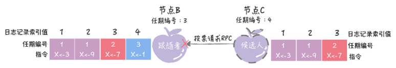

**随机超时时间又是什么？**

解决选举过程中，选票被平均瓜分，导致选举无效的情况发生。（随机超时，可以让大多数情况下，只有1个节点先发起选举)

- 心跳信息超时的时间间隔，是随机的；

- 当没有候选人赢得过半票数，选举无效了，这时需要等待一个随机时间间隔，也就是说，等待选举超时的时间间隔，是随机的。

### 与Multi-Paxos不同

- Raft不是所有的节点都可以是Leader，只有日志最完整的节点才可以。
- 日志必须是连续的。Multi-Paxos 不要求日志是连续的

### 小结

Raft算法选举领导者的几个原则：（如何保证任何时候只有1个领导者，如何减少选举失败?）

- 任期
- 领导者心跳消息
- 随机选举超时
- 先来先服务
- 大多数选票原则

### 2 复制日志

Raft 算法中，副本数据是以日志的形式存在的，领导者接收到来自客户端写请求后，处理写请求的过程就是一个复制和提交日志项的过程。

副本数据是以日志的形式存在的，日志是由日志项组成，日志项包含指令（Command）、任期编号（Term）、索引值（Log Index）

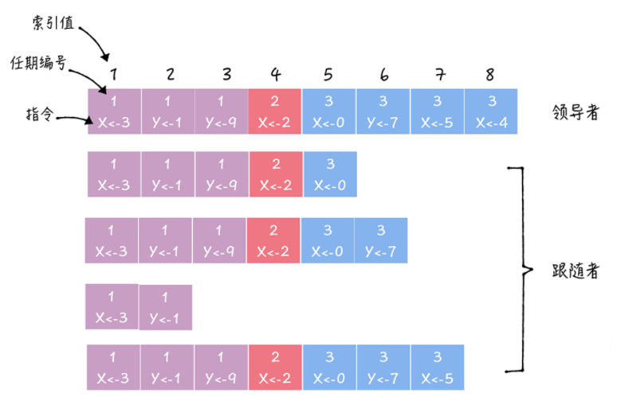

**如何复制日志？优化 Basic Paxos 执行**

- 领导者进入第一阶段，通过日志复制（AppendEntries）RPC 消息，将日志项复制到集群其他节点上。
- 如果领导者接收到大多数的“复制成功”响应后，它将日志项提交到它的状态机，并返回成功给客户端。如果领导者没有接收到大多数的“复制成功”响应，那么就返回错误给客户端。

> 领导者提交了自己的日志项，为什么没有通知跟随者提交日志项呢?
>
> 这是Raft的一个优化，额外通过其他时候的日志复制 RPC 消息或心跳消息告知。因为这些消息里面包含了当前最大的，将会被提交的日志项索引值。
>
> - 好处：降低了一半的消息延迟

#### **如何复制日志的具体流程？**

- 接收到客户端请求后，领导者基于客户端请求中的指令，创建一个新日志项，并附加到本地日志中。

- 领导者通过日志复制 RPC，将新的日志项复制到其他的服务器。

- 当领导者将日志项，成功复制到大多数的服务器上的时候，领导者会将这条日志项提交到它的状态机中。

- 领导者将执行的结果返回给客户端。

- 当跟随者接收到心跳信息，或者新的日志复制 RPC 消息后，如果跟随者发现领导者已经提交了某条日志项，而它还没提交，那么跟随者就将这条日志项提交到本地的状态机中。

#### 如何实现日志的一致？

源于：进程崩溃、服务器宕机等问题

思路：领导者通过强制跟随者直接复制自己的日志项，处理不一致日志。具体有 2 个步骤。

- 领导者通过日志复制 RPC 的一致性检查，找到跟随者节点上，与自己相同日志项的最大索引值。也就是说，这个索引值之前的日志，领导者和跟随者是一致的，之后的日志是不一致的了。
- 领导者强制跟随者更新覆盖的不一致日志项，实现日志的一致。

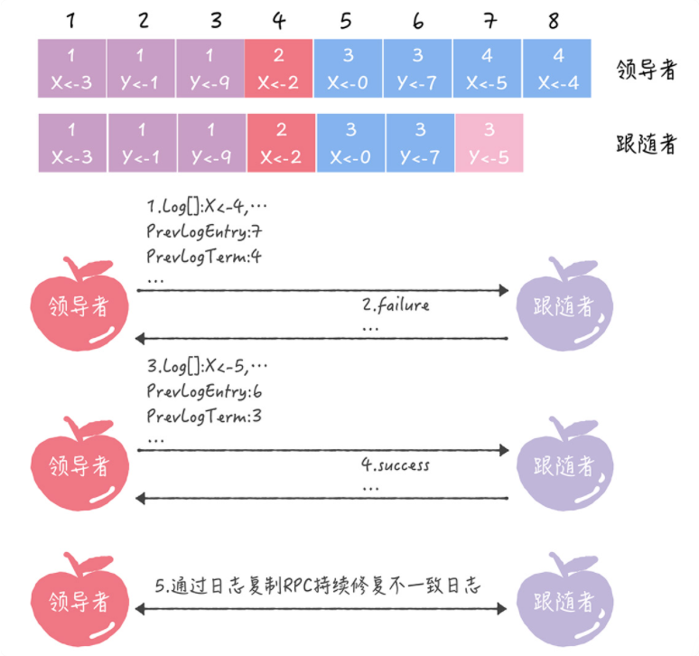

- 领导者发送当前最新日志项到跟随者（7,4)

- 跟随者在它的日志中，找不到(7,4) 的日志项，跟随者返回失败信息。

- 领导者会递减日志项，并发送新的日志项（6,3）

- 跟随者在它的日志中，找到了 （6,3），返回成功。

- 领导者通过日志复制 RPC，复制并更新覆盖跟随者。（实现了日志一致性）

### 小结

- 在 Raft 中，副本数据是以日志的形式存在的，指令表示用户指定的数据。
- Multi-Paxos 不要求日志是连续的，但在 Raft 中日志必须是连续的。日志完整性最高的节点才能当选领导者。
- Raft 是通过以领导者的日志为准，来实现日志的一致的。

### 3 成员变更

背景：节点上下线，原有3台节点，现在新入2台，如何保证集群不会分裂，出现2个领导者。

**最常用的方法：单节点变更**。利用“一次变更一个节点，不会同时存在旧配置和新配置 2 个‘大多数’”的特性，实现成员变更。比如 Etcd、Hashicorp Raft

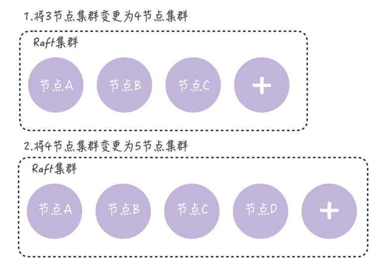

- **配置Configuration** 表示集群是哪些节点组成的。比如节点 A、B、C 组成的集群，那么集群的配置就是[A, B, C]集合。

> 需要你注意的是，在分区错误、节点故障等情况下，如果我们并发执行单节点变更，那么就可能出现一次单节点变更尚未完成，新的单节点变更又在执行，导致集群出现 2 个领导者的情况。TODO 没讲清楚怎么解决？（如果你遇到这种情况，可以在领导者启动时，创建一个 NO_OP 日志项（也就是空日志项），只有当领导者将 NO_OP 日志项提交后，再执行成员变更请求。）

- 有什么办法能突破 Raft 集群的写性能瓶颈呢？参考Kafka的分区和ES的主分片副本分片这种机制

### 如何设计一致性模型，有哪些策略

在实际场景中，我们一般需要根据场景特点，在一致性强度和实现复杂度之间进行权衡。比如 Consul 实现了三种一致性模型。

- default：客户端访问领导者节点执行读操作，领导者确认自己处于稳定状态时（在 leader leasing 时间内），返回本地数据给客户端，否则返回错误给客户端。在这种情况下，客户端是可能读到旧数据的，比如此时发生了网络分区错误，新领导者已经更新过数据，但因为网络故障，旧领导者未更新数据也未退位，仍处于稳定状态。

- consistent：客户端访问领导者节点执行读操作，领导者在和大多数节点确认自己仍是领导者之后返回本地数据给客户端，否则返回错误给客户端。在这种情况下，客户端读到的都是最新数据。

- stale：从任意节点读数据，不局限于领导者节点，客户端可能会读到旧数据。

