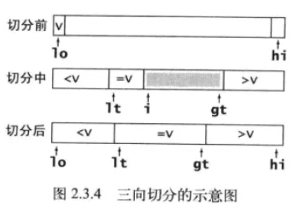
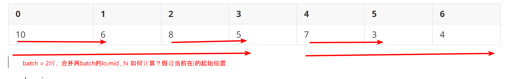
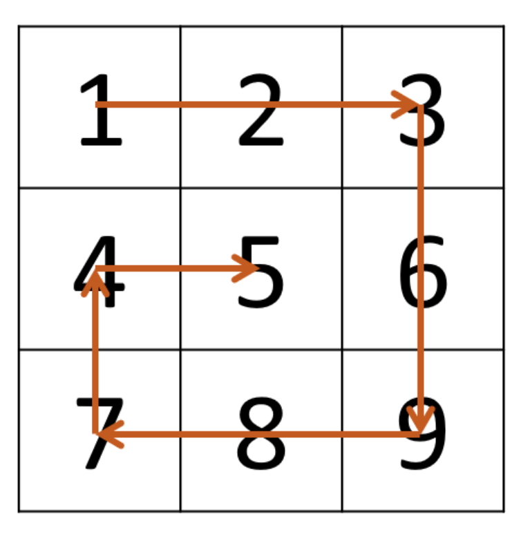
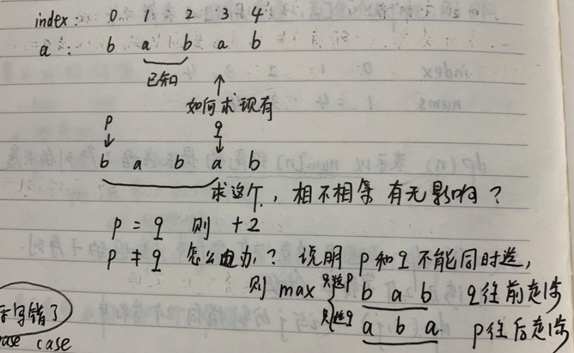

## 1 二叉树

- 前序遍历：栈

```java
递归三行，非递归用栈
List<Integer> preOrderTraversal(TreeNode root);
void travel(TreeNode root, List<Integer> res) 
    while(!stack.isEmpty()) 
        node = stack.poll()
        // 注意判null，栈的后进先出，此处要先入右节点，再左节点
        stack.push(node.right)
        stack.push(node.left)
        
```

* 中序遍历：栈+visited

```java
非递归用栈，visited记录节点是否被访问过，表示什么？如果该node节点的左节点已经放入到stack中，就加入进去。
    出栈：第二次遇到就出栈
    入栈：遇到就入栈
    入visited：
    出visited：
List<Integer> preOrderTraversal(TreeNode root);
	while(!stack.isEmpty())
        peek来看看是不是
        if 第一次遇到:
			把它的左节点入栈，把它加入visited
        else if 第二次遇到
            res.add(出栈)，并把右节点入栈
            同时可以移除visited中的对应节点
```

* 后续遍历：栈+visited

```java
非递归：栈+visited。
什么时候node放入在visited？当node的左右节点信息都存放到stack之后，就可以。
public List<Integer> postorderTraversal(TreeNode root) {
        List<Integer> res = new ArrayList<>();
        LinkedList<TreeNode> stack = new LinkedList<>();
        Set<TreeNode> visited = new HashSet<>();
        if (root == null){
            return res;
        }

        stack.addLast(root);
        while(!stack.isEmpty()) {
            // 左右节点的信息都存放到了stack中，就把它放入到visited中
            TreeNode node = stack.peekLast();
            if(!visited.contains(node) ) {
            	// 栈的特性，需要先入右节点，在入左节点。
                if(node.right!=null){
                    stack.addLast(node.right);
                } 
                if (node.left!=null) {
                    stack.addLast(node.left);
                }
                visited.add(node);
            } else {
                stack.removeLast();
                visited.remove(node);
                res.add(node.val);
            }
        }
        return res;

    }
```

* 层序遍历：宽度优先搜索（遍历所有的queue，进行扩散）
  * 遍历所有的queue，将当前层的队列的所有节点的子节点向四周扩散

### 子结构

- 判断Tree B是Tree A的子结构
- 递归的定义是什么？就是题目定义
- root做什么？
  - 如果rootA和rootB相等，就完全对比这两棵树
  - 如果不相等，就看看A的左子树能不能包含B；也看看A的右子树能不能包含B。

```java
		boolean isSubStructure(TreeNode A, TreeNode B) {
        if(B == null) { return false;}
        return helper(A,B);
    }
		boolean helper(TreeNode a, TreeNode b) {
        // root 做什么
        boolean match = false;
        if (b == null) { return true;}
        if (a == null) { return false;}
        if (a.val == b.val) {
            match = isCompleteEqual(a, b);
        }
        if (!match) {
            match = helper(a.left, b) || helper(a.right, b);
        }
        return match;
    }
```

### 重建

- 前序遍历结果为[3, 9, 20, 15, 7]，可知root节点为3
- 中序为[9, 3, 15, 20, 7]，以3为中点将数组分拆为[9]和[15, 20, 7]两个子数组，则前者为左子树，后者为右子树
- 再找出前序的子树[9]和[20, 15, 7]，返回root节点。
- 套路如下：
  - 递归的定义是什么，相信它？输入是前序数组和中序数组，输出是构成这棵树的根节点
  - root做什么？构建左右子树。
  - 细节是什么？推算出左右子树的长度，然后计算前序和中序数组的左右范围。

```java
public TreeNode buildTree(int[] preorder, int[] inorder) {
        int len = preorder.length;
        return help(preorder,inorder, 0, len - 1, 0, len -1);
    }

    int findRoot(int[] inorder, int i1, int i2, int root) {
        for(int i = i1; i <= i2; i++) {
            if (root == inorder[i]) {
                return i;
            }
        }
        return -1;
    }
		
    TreeNode help(int[] preorder, int[] inorder, int p1, int p2, int i1, int i2) {
        if(p1 > p2|| i1 > i2) {
            return null;
        }
        TreeNode root = new TreeNode(preorder[p1]);
        int ik = findRoot(inorder, i1, i2, preorder[p1]);
        int len = ik - i1;
      	// preorder的第一个数是root，子树是不包含root的。
        root.left = help(preorder, inorder, p1 + 1, p1 + len, i1, ik - 1);
        root.right = help(preorder, inorder, p1 + len + 1, p2, ik + 1, i2);
        return root;
    }
```

### 镜像

- 套路：1.定义是什么；2.root做什么 3.相信这个定义，应用到左右节点
- 思路：root做什么？每一个root节点上执行左右孩子交换。（递归更简洁）

```java
		TreeNode invertTree(TreeNode root) { // 后续遍历模板
        if (root == null) {
            return null;
        }
        TreeNode rLeft = invertTree(root.right);
        TreeNode rRight = invertTree(root.left);
        root.left = rLeft;
        root.right = rRight;
        return root;
    }
```

### 对称性

- 套路：1.原函数定义不好用，改成判断两个节点是否是镜像的 
- 思路：两个节点判断对称型，A.left == B.right 并且 A.right == B.left

```java
		boolean isSymmetric(TreeNode root) {
        if (root == null) {
            return true;
        }
        return isSymmetricTwo(root.left, root.right);
    }
		// 函数的定义是什么，两个节点是否是镜像的
    boolean isSymmetricTwo(TreeNode node1, TreeNode node2) { // 前序遍历模板
        if (node1 == null || node2 == null) {
            return node1 == node2;
        }
        if (node1.val != node2.val) {
            return false;
        }

        boolean isLeft = isSymmetricTwo(node1.left, node2.right);
        boolean isRight = isSymmetricTwo(node1.right, node2.left);
        return isLeft && isRight;
    }
```


## 2 排序

#### 快速

partition思想：

- i 代表 <i的数小于x
- j表示 >j的数大于x

```java
void qsort(int[] a, int lo, int hi) {
  if (lo >= hi) return;
  int q = partition(a, lo, hi);
  qsort(a, lo, q - 1);
  qsort(a, q + 1, hi);
}

int partition(int[] a, int lo, int hi) {
  int x = a[lo];
  int i = lo, j = hi + 1;
  while(i < j) {
    while(a[--j] > x){}
    while(a[++i] < x) {判断越界}
    if (i >= j) {
      break;
    }
    swap(a, i , j);
  }
  swap(a, lo, j);
  return j;
}
```

三向切分: 

- 对数组划成三等分[... lt,...,gt,....]，index小于lt的，都小于x；index大于gt的，都大于x。
- 适用于有大量重复元素的排序
- 算法：根据a[i] 与 v的值进行比较，判断如何移动指针。



> 关键是记牢：lt和gt的位置，从切分后的图像中记忆。
>
> 初始值怎么设置：x, lt, gt, i

```java
	void sort3p(int[]a, int lo, int hi){
        if(lo >= hi) {
            return;
        }
        int x = a[lo], lt = lo, gt = hi, i = lo + 1; // i的初始值随意：i=lo，也可以
        while(i <= gt) {
            if (x == a[i]) {
                i++;
            } else if (x > a[i]) {
                swap(a, lt, i);
                i++;
                lt++;
            } else if(x < a[i]) {
                swap(a, i, gt);
                gt--;
            }
        }

        sort3p(a, lo, lt - 1); // 左边排序
        sort3p(a, gt + 1, hi); // 右边排序
    }
```


#### 堆

- 二叉堆：堆顶大就是大顶堆。

- node: ~~0~~ 1 2 3 4 

  - index = 0的位置空着 ，方便计算parent和child
  - index = i，`parent = i/2; 左子=i*2; 右子=i*2 + 1`

- 操作：

  - 上浮swim 和 下沉 sink
  - 二叉堆添加元数在堆底，swim；删除元素在堆顶 ，然后移动堆底元素到堆顶，sink。

- 堆排的步骤：构建大顶堆，index=0,1,2,3,4。 

  - index因为从0开始，所有`parent =(i-1)/2; 左子=i*2 + 1;右子=i*2 +2`
  - 利用swim构建堆，从0-length `swim(int[] a, int k)` （parent比k大，就交换）
  - 交换0和最后一个元素，sink来调整堆，直到堆中元素为0.`sink(int[] a, int k ,int size)` （左右节点的最大值 比k大，就交换）

  ```java
  void heapSort(int[] a){
      int len = a.length;
      // swim创建最大堆
      for(int i = 0; i < len; i++) {
          swim(a, i);
      }
  
      int size = len;
      // swap 和 sink出队，排序 
      while(size>0) {
          swap(a, 0, --size);
          sink(a, 0, size);
      }
  }
  
  // swim创建最大堆：parent比k小，就交换
  void swim(int[] a, int k) {
      int p = parent(k);
      while(less(a, p, k)) {
          swap(a, p, k);
          k = p;
          p = parent(k);
      }
  }
  // 左右节点的最大值 比k大，就交换
  void sink(int[] a, int k, int size) {
      int left = leftChild(k) >= size ? k : leftChild(k);
      int right = rightChild(k) >= size ? k : rightChild(k);
      int max = less(a, left, right) ? right : left;
      if(!less(a, k, max)) {
          return;
      }
      swap(a, k, max);
      sink(a, max, size);
  }
  ```

#### 归并

- 分治思想，自顶向下的思路步骤：

  - 将数组二分，再递归将分出来的子数组二分
  - 直到子数组长度为1时，递归退出，将二分的子数组合并
    - 合并过程中需要申请一段辅助空间aux用于临时存储排序后的值
    - 将合并、排序好的辅助空间数据拷贝到原数组上
  - 当递归不断返回后，排序即完成

  

  
  
  
  
- 自底向上的思路
  - 从batch size = 1,2,4... 开始，每2个batch进行合并一次。batch的最大值选取可以是len，也可以是len - 1
  
  - 每2个batch在内部进行有序合并，确定好merge(lo, mid, hi)
  
    
  
    - lo 是起始位置 i
    - mid = lo + batch - 1 (最大值< len - 1)
    - hi = lo + batch + batch - 1
  
  ```java
  // 4-1 归并排序-自顶向下
  // 先分解到最小单元
  // 在合并
  void mergeSort1(int[] a, int lo, int hi) {
      if (lo >= hi) {
          return;
      }
      int mid = lo + (hi - lo) / 2;
      mergeSort1(a, lo, mid);
      mergeSort1(a, mid + 1, hi);
      merge(a, lo, mid, hi);
  }
  
  // 4-2 归并排序-自底向上
  // 从batch size = 1,2,4... 开始，每2个batch进行合并一次
  // 每2个batch在内部进行有序合并
  void mergeSort2(int[] a, int lo, int hi) {
      if (lo >= hi) {
          return;
      }
      int len = hi - lo + 1;
      for (int sz = 1; sz < len; sz = sz + sz) { // batch sz的最大值可以是len，也可以是len - 1
          for (int i = lo; i < len - sz; i = i + sz + sz) { // mid < len - 1 推出i的范围
              int mid = i + sz - 1;
              int j = Math.min(i + sz + sz - 1, hi); // 小心越界
              merge(a, i, mid, j);
          }
      }
  }
  
  
  // 开发一个merge 合并有序数组a, lo -- mid; mid + 1, hi;
  void merge(int[] a, int lo, int mid, int hi) {
      // 1 辅助数组aux
      // 2 合并有序数组
      // 3 拷贝aux到原数组
      int size = hi - lo + 1;
      int[] aux = new int[size];
  
      int i = lo, j = mid + 1, k = 0;
      while( i <= mid && j <= hi) {
          if(less(a[i],a[j])) {
              aux[k++] = a[i++];
          } else {
              aux[k++] = a[j++];
          }
      }
      while(i<= mid) {
          aux[k++] = a[i++];
      }
      while(j <= mid) {
          aux[k++] = a[j++];
      }
      // copy
      System.arraycopy(aux,0,a, lo, size);
  }
  ```
  
  

## 3 链表

### 反转

- 遍历解法: 从中间状态思考，cur当前遍历到的node, pre新链表的头

```java
     ListNode reverseList(ListNode head) {
        if (head == null) {
            return null;
        }
        ListNode pre = null;
        ListNode cur = head, nex = null;
        while (cur != null) {
            nex = cur.next;
            cur.next = pre;
            pre = cur;
            cur = nex;
        }
        return pre;
    }
```

### 部分反转

- 反转 m到 n的节点。`1->2>3->4>5->null`  m=2,n=4-----> `1->4>3->2>5->null`
- 迭代版思路分成2部分：
  - 先走m步，再开始反转需要反转的个数
  - 把前后两部分连接起来
- 先实现一个反转前N个节点的函数
- 递归版：
  - 相信这个函数定义
  - 终止条件：m=1,变成反转前N个节点的问题。

```JAVA
	// 实现反转前N个节点
    ListNode reverseN(ListNode head, int n) {
        ListNode pre = null, cur = head;
        while (cur != null && n > 0) {
            n--;
            ListNode nex = cur.next;
            cur.next = pre;
            pre = cur;
            cur = nex;
        }
        head.next = cur;
        return pre;
    }
    // 迭代版
    ListNode reverseBetween(ListNode head, int m, int n) {
        int left = m;
        ListNode pre = null, cur = head;
        while (left > 1) {
            pre = cur;
            cur = cur.next;
            left--;
        }
        ListNode backend = reverseN(cur, n - m + 1);
        if (pre == null) {
            return backend;
        } else {
            pre.next = backend;
            return head;
        }
    }
    // 迭代实现反转M-N个节点
    ListNode reverseBetweenRecuise(ListNode head, int m, int n) {
        if (m == 1) {
            return reverseN(head, n);
        }
        ListNode last = reverseBetweenRecuise(head.next, m - 1, n - 1);
        head.next = last;
        return head;
    }
```

### K个反转

- K个一组反转链表：链表长度不足就保持原有顺序。
- 递归思路：返回链表的头结点
  - 先反转K个，作为前半部分
  - 在递归反转剩下的，作为后半部分
  - 前后两部分连接起来。

```JAVA
    ListNode reverseKGroup(ListNode head, int k) {
        if (len(head) < k) { // 链表长度不足就保持原有顺序
            return head;
        }
        // 反转k个
        ListNode cur = head, pre = null;
        for (int i = 0; i < k; i++) {
            ListNode nex = cur.next;
            cur.next = pre;
            pre = cur;
            cur = nex;
        }
        // 前后连接上
        head.next = reverseKGroup(cur, k); // head 刚好是前半部分的尾巴
        return pre;
    }
    int len(ListNode head) { //求链表长度 }
```

### 回文

- 判断一个链表是否是回文。1->2->1->2->1，true
- 暴力解法：新建一个反转链表，两个链表进行比对。空间O(N)
- 后序遍历的递归思路。 有隐形的递归调用栈，所以空间还是O(N)
- 优化的思路：寻找中间节点，反转后半部分链表思路. 这个思路是O(1)

```JAVA
    boolean isPalindrome(ListNode head) {
        ListNode fast = head, slow = head; // 快慢指针切分链表
        while (fast != null && fast.next != null) {
            fast = fast.next.next;
            slow = slow.next;
        }
        // 反转一半链表
        ListNode slowHead = reverse(slow);
        while (slowHead != null && head != null) {
            if (slowHead.val != head.val) {
                return false;
            }
            slowHead = slowHead.next;
            head = head.next;
        }
        reverse(slow); // 恢复链表
        return true;
    }
```


### 从尾到头

- 从尾到头打印链表
- 思路：使用栈的后进先出，或者直接用递归

### 删除节点

- O(1)删除节点
- 一般方法：根据val查找这个节点，用前后指针（双指针）跟着走。`prev.next = cur.next`来删除cur。
- O(1): 要删除Node(n)，直接用Node(n+1)的val复制给Node(n)，然后直接删除Node(n+1)

 ```java
   void deleteNode(ListNode node) {
       ListNode nex = node.next;
       if (nex != null) {
           node.val = nex.val;
           node.next = nex.next;
       } else {
           node = null;
       }
   }
 ```

### 拷贝随机指针TODO


## 4 字符串

### 能否被3整除

- 能被3整除的余数有0、1、2，代表三种状态。可以构建状态机
- X%3=Y ，如果X翻倍，(X*2)%3 = (2Y)%3

### 回文

- 暴力：所有子串，判断是否是回文的，记录最长的
- 寻找回文串的方法：从中间往两边扩散；判断回文串：从两边往中间对比
- 思路：以(i,i) 或者(i,i+1) 为中心，向外扩散回文的字符串。

```java
		String longestPalindrome2(String s) {
        int len = s.length();
        String maxStr = "";
        for (int i = 0; i < len; i++) {
            String s1 = isPal(i, i, s);
            String s2 = isPal(i, i + 1, s);
            String local = s1.length() > s2.length() ? s1 : s2;
            maxStr = local.length() > maxStr.length() ? local : maxStr;
        }
        return maxStr;
    }

    String isPal(int p, int q, String s) {
        int len = s.length();
        if (p < 0 || q >= len) {
            return "";
        }
        if (s.charAt(p) != s.charAt(q)) {
            return "";
        }
        while (p <= q && p >= 0 && q < len) {
            if (s.charAt(p) == s.charAt(q)) {
                p--;
                q++;
            } else {
                break;
            }
        }
        return s.substring(p + 1, q);
    }
```


### KMP

- 有限状态自动机：对模式串构建
- 字符串的查找就是状态机的转换

```java
class KMP {
        int[][] dp;
        KMP(String pat) {
            int M = pat.length();
            dp = new int[M][256];
            int X = 0; 
            dp[0][pat.charAt(0)] = 1; // 影子状态的初始值不好定义，因此必须先走出一步。
            for (int s = 1; s < M; s++) {
                for (int c = 0; c < 256; c++) {
                    if (c == pat.charAt(s)) {
                        dp[s][c] = s + 1;
                    } else {
                        dp[s][c] = dp[X][c];
                    }
                }
                // 更新X的值
                X = dp[X][pat.charAt(s)]; // 如何解释？
            }
        }
        int search(String txt) {
            int N = txt.length();
            int s = 0; // 初始状态
            for (int i = 0; i < N; i++) {
                // 状态转移
                s = dp[s][txt.charAt(i)];
                if (s == dp.length) {
                    return i - dp.length + 1;
                }
            }
            return -1;
        }
    }
```


###  删除相邻重复

- 递归删除字符串中出现的k次相邻的重复项。输入s = "deeedbbcccbdaa", k = 3，输出 "aa"

- 暴力解法：不断从头遍历s，知道s没有需要删除的字符

- stack: 括号匹配的思路变形，用Pair记录字符，以及出现的次数，然后次数达到k之后，删除。

  ```java
      public String removeDuplicates(String s, int k) {
          int len = s.length();
          LinkedList<Pair> stack = new LinkedList<>();
          for (int i = 0; i < len; i++) {
              char ch = s.charAt(i);
              if (stack.isEmpty()) { // 栈空，直接入栈i
                  stack.addLast(new Pair(ch, 1));
                  continue;
              }
              Pair pair = null;
              if ((pair = stack.peekLast()).ch != ch) { //ch 与栈顶不一致，直接入栈i
                  stack.addLast(new Pair(ch, 1)); 
              } else if ((++pair.count) == k) // 栈顶达到k个元素，直接出栈删除
                  stack.removeLast();
              }
          }
          // 从stack构造输出
      }
  ```


## 3 数组

###  K大

- ```
  [3,2,1,5,6,4] 和 k = 2，输出5，转换成(k=len-k)小的数，从0开始
  ```

- 排序后，第（k=len-k)个数
- partition思想：partition(a, left, right, k) => 下标index

```java
	int findKthLargest(int[] nums, int k) {
        int len = nums.length;
        k = len - k;
        return findKthLargest(nums, 0, len - 1, k);
    }
    int findKthLargest(int[] a, int lo, int hi, int k) {
        int q = partition(a, lo, hi);
        if (q == k) {
            return a[k];
        } else if (q < k) {
            return findKthLargest(a, q + 1, hi, k);
        } else {
            return findKthLargest(a, lo, q - 1, k);
        }
    }
    int partition(int[] a, int lo, int hi) {
        if(lo == hi) { return lo; }
        int randomIndex = lo + random.nextInt(hi - lo);// 随机化
        swap(a, randomIndex, lo);
        int i = lo, j = hi + 1, x = a[lo];
        while (i <= j) {
            while (a[--j] > x) { }
            while (a[++i] < x) {
                if (i == hi) { break; }
            }
            if (i >= j) { break; }
            swap(a, i, j);
        }
        swap(a, j, lo);
        return j;
    }
```


### 二维查找

- 有序数组用二分，时间复杂度M*log(N), M是行数，N是列数

```java
public boolean findNumberIn2DArray(int[][] matrix, int target) {
		for(int i = 0; i < matrix.length; i++) {
			if(find(matrix[i], 0, matrix[i].length - 1, target)) {
				return true;
			}
		}
		return false;
	}

	boolean find(int[]a, int lo, int hi, int num) {
		while(lo <= hi) { // 标准的二分查找，判断条件 lo<=hi
			int mid = lo + (hi - lo) / 2;
			if (a[mid] == num) {
				return true;
			} else if (a[mid] > num) {
				hi = mid - 1;
			} else if (a[mid] < num) {
				lo = mid + 1;
			}
		}
		return false;
	}
```

### 旋转数组

> 二分查找细节是魔鬼

### 二进制中1的个数

- n&(n-1) 可以消除二进制n中的最后一位1

```java
    int hammingWeight(int n) {
        int count = 0;
        while (n != 0) {
            n = n & (n - 1);
            count++;
        }
        return count;
    }
```

### 奇偶顺序

- 调整数组顺序使奇数位于偶数前面: 一般的思路是遍历查找、插入、挪位，时间复杂度O(n^2)
- 快排 partition 思路：可用两个指针分别指向数组头尾，头指针负责搜索偶数，尾指针负责搜索奇数，然后将头尾的值交换，再继续执行以上操作，直到头尾指针相遇

```java
   int[] exchange(int[] nums) {
        int p = 0, q = nums.length - 1; // p 搜索偶数，q搜索奇数
        int len = nums.length;
        while (p < q) {
            while (p < len && !isOu(nums[p])) { p++;}
            while (q >= 0 && isOu(nums[q])) { q--;}
            if (p >= q) { break;}
            swap(nums, p, q);
        }
        return nums;
    }
```

### 螺旋

- 螺旋数组：顺时针打印二维数组

- 思路1：模拟打印，从向左、下、右、上四个方向打印，需要提前计算好每个方向的起始位置和终止位置。特别注意：4个方向的打印是有依赖关系的，前面打印了，后面才可以打印；前面没有打印，就说明不能在继续打印了。(细节多)

- **思路2：设定矩阵的“左、上、右、下”四个边界，模拟打印，同时收缩边界。一旦有边界相互错开，就表示已经打印完成。**

  

  - 行的边界是上下：top bottom
  - 列的边界是左右：left right

  | 打印方向(i,j) | 1. 根据边界打印 | 2. 边界向内收缩 | 3. 是否打印完毕                  |
  | ------------- | --------------- | --------------- | -------------------------------- |
  | 向右          | j <= right      | ++top           | 更新了哪个边界的值，就比较哪个。 |
  | 向下          | i <= bottom     | --right         |                                  |
  | 向左          | i>=left         | --bottom        |                                  |
  | 向上          | i>=top          | ++left          |                                  |

  ```java
  int[] spiralOrder(int[][] matrix) {
          if (matrix.length == 0) {
              return new int[0];
          }
          int top = 0, left = 0, bottom = matrix.length - 1, right = matrix[0].length - 1;
          int[] res = new int[matrix.length * (matrix[0].length)];
          int k = -1;
          while (true) {
              // -->
              for (int i = top, j = left; j <= right; j++) {
                  res[++k] = matrix[i][j];
              }
              if (++top > bottom) { break;}
              // down
              for (int i = top, j = right; i <= bottom; i++) {
                  res[++k] = matrix[i][j];
              }
              if (--right < left) { break; }
              // <----
              for (int i = bottom, j = right; j >= left; j--) {
                  res[++k] = matrix[i][j];
              }
              if (--bottom < top) { break; }
              // up
              for (int i = bottom, j = left; i >= top; i--) {
                  res[++k] = matrix[i][j];
              }
              if (++left > right) { break; }
          }
          return res;
      }
  ```

  ​	

  

## 3 DP

动态规划三要素：重叠子问题、最优子结构、状态转移方程。

思维框架：

- base case
- 状态：变化的量 ==>> 返回的值就是问题的解
  - 可以从base case来想
- 选择：不变的量，选择会导致状态。比如input的选项
  - 引起状态产生变化的行为
- dp函数：参数是什么？状态，返回值是什么
  - 子问题是什么？如果知道子问题的答案，如何求解现有问题。
  - 最后验证base case对不对
  - 从dp函数，来抽象dp数组

```python
# 1base case
dp[0][0][...] = base 
# 2所有状态
for 状态1 in 状态1的所有取值
	for 状态2 in 状态2的所有取值
  	for ...
      # 3 做选择
    	dp[状态1][状态2][...] = 求最值(选择1，选择2，...)
# 最后看要返回哪一个dp值
```

**时间复杂度分析**：

- 子问题总数*每个子问题时间

优化的点：

- dp函数写出递归的优化：备忘录mem，解决重复子问题
- dp table写出迭代的优化：状态压缩
  - 从二维压缩到2个行的数组，在优化到1个行
  - 从一维压缩到常数项的数组

> 最优子结构失效怎么办？
>
> dp问题的必要条件：具有最优子结构。找出最优子结构的过程，就是证明状态转移方程的过程。


### 递增子序列

- 最长递增子序列
- 在长度i，需要比较看看i之前的位置，是否有比它小的元素j，来更新最长的个数。
- base case
- 状态：数组长度===>> **包含自己位置的最大的长度**
- 选择：应该选取i之前的哪个位置来更新local的值
- dp[i] = max(1, dp[j + 1] + 1);
- 最后，需要遍历一次dp，来找到全局最大值。

```java
int lengthOfLIS(int[] nums) {
        int len = nums.length;
        int[] dp = new int[len + 1];
        int max = 0;
        //1 base case
        dp[0] = 0;
        // 2 所有状态
        for(int i = 1; i <= len; i++){
            // 3 做选择
            dp[i] = 1;
            for(int j = i - 2; j >= 0; j--) {
                if (nums[i - 1] > nums[j]) {
                    // 需要比较所有j的情况，因为case:[0,1,0,2,3]
                    dp[i] = Math.max(dp[i], dp[j + 1] + 1);
                }
            }
            max = Math.max(dp[i], max);
        }
        return max;
    }
```

### 回文子序列

- 最长回文子序列
- 二维dp适用于涉及2个字符串、数组的子序列问题
- (i, j) 对于一个字符串，表示 i--j的子串。(i, j) 对于2个字符串，分别指向2个。
- 状态：dp(i,j), i-j的子串的最长回文子序列的大小。
- dp：从中间状态看，如何求p--q的最长回文子序列，见下图



```java
int longestPalindromeSubseq(String s) {
        int len = s.length();
        int[][] dp = new int[len][len];
        // base case
        for (int i = 0; i < len; i++) {
            dp[i][i] = 1;
        }
        // 状态
        for (int i = len - 2; i >= 0; i--) {
            for (int j = i + 1; j < len; j++) {
                // 选择
                if (s.charAt(i) == s.charAt(j)) {
                    dp[i][j] = dp[i + 1][j - 1] + 2;
                } else {
                    dp[i][j] = Math.max(dp[i][j - 1], dp[i + 1][j]);
                }
            }
        }
        // 终止状态
        return dp[0][len - 1];
    }
```


### 子数组和

- 连续子数组和最大
- dp+压缩空间
  - base case
  - 状态：数组长度 => 一定包含位置i的数组的最大和
  - 选择：要不要加入dp[i-1]
  - dp 方程：`dp[i] = max(dp[i - 1] + a[i - 1], a[i - 1])`

```java
	int maxSubArray(int[] nums) {
        int max = nums[0];
        int local = max;
        for (int i = 1; i < nums.length; i++) {
            local = Math.max(nums[i], local + nums[i]);
            max = Math.max(local, max);
        }
        return max;
    }
```

### 子数组和绝对值

- 连续子数组和绝对值最大

动态规划思路：题目是求绝对值最大值，显然需要知道连续数组的最大最小值。可以遍历2次数组，来求出连续子数组和最大值和最小值。然后再次遍历2个dp数组，求出绝对值最大的值。

比如对于求连续子数组的最大和，参考上面的dp思路。

```java	
		int maxAbsoluteSum(int[] nums) {
        int local = 0, max = 0, localMin = 0, min = 0;
        for (int num : nums) {
            local = Math.max(local + num, num);
            localMin = Math.min(localMin + num, num);
            max = Math.max(local, max);
            min = Math.min(localMin, min);
        }
        return Math.max(Math.abs(min), Math.abs(max));
    }
```

### 子数组乘积

- 连续子数组乘积最大
- 动态规划，因为乘积会变成负值，所以要记录最小\最大值。最后，空间压缩。
- maxV[i]: 包含i的最大乘积值
- minV[i]: 包含i的最小乘积值

| index | 0    | 1    | 2    | 3    |
| :---: | ---- | ---- | ---- | ---- |
|       | 2    | 3    | -2   | 4    |
| maxV  | 2    | 6    | -2   | 4    |
| minV  | 2    | 3    | -12  | -48  |

```java	
	int maxProduct(int[] nums) {
        int res = Integer.MIN_VALUE, minV = 1, maxV = 1;
        for(int num : nums) {
            int tmpMin = minV;
            int a = num;
            int b = num * minV;
            int c = num * maxV;
            minV = min(a,b,c);
            b = num * tmpMin;
            maxV = max(a, b, c);
            res = Math.max(res, maxV);
        }
        return res;
    }
```

### 四键键盘

- 操作n次后，屏幕上最大的A的个数

- 技巧：

  - 当N比较小的时候，只按A
  - N大的时候，A,A,...C-A, C-C, C-V,C-V,...,C-V （只要操作过复制，后面的C-V一次操作的收益是大于单独按A的。这个要理解，**因为后面的思路就是要找到C-V的开始位置 j **）

- 套路：

  - base case

  - 状态：剩余次数===>> 出现A的次数

  - 选择：取最大

    - A
    - C-A,C-C：这里变成找到C-A,C-C的位置，后面就可以一直C-V
    - C-V

  - dp：

    ```python
    dp(i) = max
    	select1 = dp(i - 1) + 1
      for j range (2,i) # 因为不知道j的位置，所以直接全部列举
    	  	select2 = dp(j - 2) * (i - j + 1)	
      dp(i) = max(select1, select2)
    ```

    

```java
int maxAA(int n) {
        int[] dp = new int[n + 1];
        // 1 base case
        dp[0] = 0; dp[1] = 1; dp[2] = 2;
        // 2 所有状态
        for (int i = 1; i <= n; i++) {
            // 3选择
            dp[i] = dp[i - 1] + 1;
            for (int j = 2; j < i; j++) { // j range (2,i)也是正确的，不同理解会导致写法有点不同
                dp[i] = Math.max(dp[i], dp[j - 2] * (i - j + 1));
            }
        }
        return dp[n];
    }
```


## 其他

### 栈实现队列

- 两个栈实现队列

队列是先进先出，栈是后进先出。可以用2个stack来模拟

- 第一个pushStack 用来入队
- 第二个popStack用来出队，当popStack中没有元素时，就把pushStack移动过来。

### min栈

- 包含min的栈

- 思路：一般的栈只能提供两项 O(1) 的操作：压入和弹出，如需要 min 也能达到 O(1) 的时间复杂度，需要额外的存储

- 可使用一个辅助栈存储用于存储 min 值

   ```java
   class MinStack30 {
       LinkedList<Integer> stack = new LinkedList<>();
       LinkedList<Integer> minStack = new LinkedList<>();
   
       // push, 查看最小的min，入栈minStack
       public void push(int x) {
           stack.addLast(x);
           int currentMin = minStack.isEmpty() ? x : minStack.peekLast() < x ? minStack.peekLast() : x;
           minStack.addLast(currentMin);
       }
       public void pop() {
           stack.removeLast();
           minStack.removeLast();
       }
       public int top() {
           return stack.peekLast();
   
       }
       public int min() {
           return minStack.peekLast();
       }
   }
   ```

  

### 斐波那契

- 斐波那契数列
- F(n) = F(n - 1) + F(n - 2),    F(0) = 0, F(1) = 1
- 动态规划的感觉，注意题目要求对结果取mod

```java
 int fib(int n) {
        int e9 = 1000000007;
        int fn2 = 0, fn1 = 1, fn = 0;
        if (n <=1) {
            return n;
        }
        for(int i = 2; i <= n; i++) {
            fn = (fn2 + fn1) % e9;
            fn2 = fn1;
            fn1 = fn;
        }
        return (int)fn % e9;
    }
```

### 会议数目

- 最多可以参加的会议数目

关键：对于某一天day，能够在这天参加的所有会议中，到底应该选哪一个来参加。（这就是贪心，每一天总是选取结束时间最早的会议参加，局部贪心，最后达到全局最优。）

核心就是要解决优先级队列的优先级的定义。明白入队和出队的时机

- 对于某一天day, 需要把能够参加这天的所有会议入队，
- 然后选取结束时间最早的出队，进行判断，能否在这天参加会议
  - 如果能，就把能够参加次数+1
  - 如果不能，就需要连续出队，尽量找到1个可以参加的会议

```java
	int maxEvents(int[][] events) {
        int len = events.length;
        Arrays.sort(events,(a,b)->{return a[0] - b[0];}); // sort by startDay
        PriorityQueue<int[]> queue = new PriorityQueue<>((a,b)->{
            return a[1] - b[1];
        }); // 结束时间最早的排在前面。

        int day = 1, i = 0, times = 0;
        while(i < len || !queue.isEmpty()) {
            // 入队
            while(i< len && events[i][0] == day) {
                queue.offer(events[i]);
                i++;
            }
            // 出队
            while(!queue.isEmpty()) {
                int[] item = queue.poll();
                if(valid(day, item)) {
                    times++;
                    break;
                }
            }
            // 更新day到下一天
            day++;
        }
        return times;
    }
```

### 栈的压入、弹出序列

- 栈的压入、弹出序列: 模拟入栈和出栈顺序，能够匹配就成功。
- 思路：通过例子分析 pushed = [1,2,3,4,5], popped = [4,5,3,2,1], res = true，可以得到出入栈逻辑顺序如下
  1. 出栈：如果下一个要出栈的数字刚好是栈顶数字，直接弹出
  2. 入栈：若果下一个出栈的数字不在栈顶，则将压栈序列中没有入栈的数字压入辅助栈
  3. 所有都入栈后，逐个判断出栈序列是否是正确的

```java
boolean validateStackSequences(int[] pushed, int[] popped) {
    int len1 = pushed.length, len2 = popped.length;
    LinkedList<Integer> stack = new LinkedList<>();
    int i = 0, j = 0;
    while (i < len1 && j < len2) {
        // 先判断栈顶
        if (!stack.isEmpty() && stack.peekLast() == popped[j]) {
            stack.removeLast();
            j++;
            continue;
        }
        // 再判断入栈和出栈数组是否匹配，匹配直接向前走，不匹配，入栈。
        if (pushed[i] == popped[j]) {
            i++;j++;
        } else {
            stack.addLast(pushed[i]);
            i++;
        }
    }
    // 所有都入栈后，逐个判断出栈序列是否是正确的
    while (!stack.isEmpty() && j < len2) {
        if (popped[j++] != stack.removeLast()) {
            return false;
        }
    }
    return stack.isEmpty();
}
```

