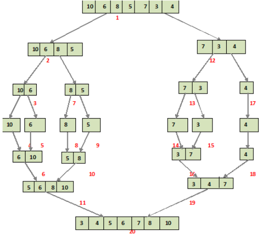

基本算法

### 1 二叉树

- 前序遍历：栈

```java
递归三行，非递归用栈
List<Integer> preOrderTraversal(TreeNode root);
void travel(TreeNode root, List<Integer> res) 
    while(!stack.isEmpty()) 
        node = stack.poll()
        // 注意判null，栈的后进先出，此处要先入右节点，再左节点
        stack.push(node.right)
        stack.push(node.left)
        
```

* 中序遍历：栈+visited

```java
非递归用栈，visited记录节点是否被访问过，表示什么？如果该node节点的左节点已经放入到stack中，就加入进去。
    出栈：第二次遇到就出栈
    入栈：遇到就入栈
    入visited：
    出visited：
List<Integer> preOrderTraversal(TreeNode root);
	while(!stack.isEmpty())
        peek来看看是不是
        if 第一次遇到:
			把它的左节点入栈，把它加入visited
        else if 第二次遇到
            res.add(出栈)，并把右节点入栈
            同时可以移除visited中的对应节点
```

* 后续遍历：栈+visited

```java
非递归：栈+visited。
什么时候node放入在visited？当node的左右节点信息都存放到stack之后，就可以。
public List<Integer> postorderTraversal(TreeNode root) {
        List<Integer> res = new ArrayList<>();
        LinkedList<TreeNode> stack = new LinkedList<>();
        Set<TreeNode> visited = new HashSet<>();
        if (root == null){
            return res;
        }

        stack.addLast(root);
        while(!stack.isEmpty()) {
            // 左右节点的信息都存放到了stack中，就把它放入到visited中
            TreeNode node = stack.peekLast();
            if(!visited.contains(node) ) {
            	// 栈的特性，需要先入右节点，在入左节点。
                if(node.right!=null){
                    stack.addLast(node.right);
                } 
                if (node.left!=null) {
                    stack.addLast(node.left);
                }
                visited.add(node);
            } else {
                stack.removeLast();
                visited.remove(node);
                res.add(node.val);
            }
        }
        return res;

    }
```

* 层序遍历：宽度优先搜索（遍历所有的queue，进行扩散）
  * 遍历所有的queue，将当前层的队列的所有节点的子节点向四周扩散

### 2 排序

#### 2.1 快速排序

partition思想

```java
void qsort(int[] a, int lo, int hi) {
  if (lo >= hi) return;
  int q = partition(a, lo, hi);
  qsort(a, lo, q - 1);
  qsort(a, q + 1, hi);
}

int partition(int[] a, int lo, int hi) {
  int x = a[lo];
  int i = lo, j = hi + 1;
  while(i < j) {
    while(a[--j] > x){}
    while(a[++i] < x) {判断越界}
    if (i >= j) {
      break;
    }
    
    swap(a, i , j);
  }
  swap(a, lo, j);
  return j;
}
```

#### 2.2 堆排序

- 二叉堆：堆顶大就是大顶堆。

- node: ~~0~~ 1 2 3 4 

  - index = 0的位置空着 ，方便计算parent和child
  - index = i，`parent = i/2; 左子=i*2; 右子=i*2 + 1`

- 操作：

  - 上浮swim 和 下沉 sink
  - 二叉堆添加元数在堆底，swim；删除元素在堆顶 ，然后移动堆底元素到堆顶，sink。

- 堆排的步骤：构建大顶堆，index=0,1,2,3,4。 

  - index因为从0开始，所有`parent =(i-1)/2; 左子=i*2 + 1;右子=i*2 +2`
  - 利用swim构建堆，从0-length `swim(int[] a, int k)` （parent比k大，就交换）
  - 交换0和最后一个元素，sink来调整堆，直到堆中元素为0.`sink(int[] a, int k ,int size)` （左右节点的最大值 比k大，就交换）

  ```java
  void heapSort(int[] a){
      int len = a.length;
      // swim创建堆
      for(int i = 0; i < len; i++) {
          swim(a, i);
      }
  
      int size = len;
      // swap 和 sink出队，排序 
      while(size>0) {
          swap(a, 0, --size);
          sink(a, 0, size);
      }
  }
  
  // parent比k大，就交换
  void swim(int[] a, int k) {
      int p = parent(k);
      while(less(a, p, k)) {
          swap(a, p, k);
          k = p;
          p = parent(k);
      }
  }
  // 左右节点的最大值 比k大，就交换
  void sink(int[] a, int k, int size) {
      int left = leftChild(k) >= size ? k : leftChild(k);
      int right = rightChild(k) >= size ? k : rightChild(k);
      int max = less(a, left, right) ? right : left;
      if(!less(a, k, max)) {
          return;
      }
      swap(a, k, max);
      sink(a, max, size);
  }
  ```

#### 2.3 归并排序

- 分治思想，自顶向下的思路步骤：

  - 将数组二分，再递归将分出来的子数组二分
  - 直到子数组长度为1时，递归退出，将二分的子数组合并
    - 合并过程中需要申请一段辅助空间aux用于临时存储排序后的值
    - 将合并、排序好的辅助空间数据拷贝到原数组上
  - 当递归不断返回后，排序即完成

  

  
  
  
  
- 自底向上的思路
  - 从batch size = 1,2,4... 开始，每2个batch进行合并一次。batch的最大值选取可以是len，也可以是len - 1
  
  - 每2个batch在内部进行有序合并，确定好merge(lo, mid, hi)
  
    
  
    - lo 是起始位置 i
    - mid = lo + batch - 1 (最大值< len - 1)
    - hi = lo + batch + batch - 1
  
  ```java
  // 4-1 归并排序-自顶向下
  // 先分解到最小单元
  // 在合并
  void mergeSort1(int[] a, int lo, int hi) {
      if (lo >= hi) {
          return;
      }
      int mid = lo + (hi - lo) / 2;
      mergeSort1(a, lo, mid);
      mergeSort1(a, mid + 1, hi);
      merge(a, lo, mid, hi);
  }
  
  // 4-2 归并排序-自底向上
  // 从batch size = 1,2,4... 开始，每2个batch进行合并一次
  // 每2个batch在内部进行有序合并
  void mergeSort2(int[] a, int lo, int hi) {
      if (lo >= hi) {
          return;
      }
      int len = hi - lo + 1;
      for (int sz = 1; sz < len; sz = sz + sz) { // batch sz的最大值可以是len，也可以是len - 1
          for (int i = lo; i < len - sz; i = i + sz + sz) { // mid < len - 1 推出i的范围
              int mid = i + sz - 1;
              int j = Math.min(i + sz + sz - 1, hi); // 小心越界
              merge(a, i, mid, j);
          }
      }
  }
  
  
  // 开发一个merge 合并有序数组a, lo -- mid; mid + 1, hi;
  void merge(int[] a, int lo, int mid, int hi) {
      // 1 辅助数组aux
      // 2 合并有序数组
      // 3 拷贝aux到原数组
      int size = hi - lo + 1;
      int[] aux = new int[size];
  
      int i = lo, j = mid + 1, k = 0;
      while( i <= mid && j <= hi) {
          if(less(a[i],a[j])) {
              aux[k++] = a[i++];
          } else {
              aux[k++] = a[j++];
          }
      }
      while(i<= mid) {
          aux[k++] = a[i++];
      }
      while(j <= mid) {
          aux[k++] = a[j++];
      }
      // copy
      System.arraycopy(aux,0,a, lo, size);
  }
  ```
  
  

## 3 剑指offer

### 1 有序二维数组的查找

- 有序数组用二分，时间复杂度M*log(N), M是行数，N是列数

```java
public boolean findNumberIn2DArray(int[][] matrix, int target) {
		for(int i = 0; i < matrix.length; i++) {
			if(find(matrix[i], 0, matrix[i].length - 1, target)) {
				return true;
			}
		}
		return false;
	}

	boolean find(int[]a, int lo, int hi, int num) {
		while(lo <= hi) { // 标准的二分查找，判断条件 lo<=hi
			int mid = lo + (hi - lo) / 2;
			if (a[mid] == num) {
				return true;
			} else if (a[mid] > num) {
				hi = mid - 1;
			} else if (a[mid] < num) {
				lo = mid + 1;
			}
		}
		return false;
	}
```

### 2 从尾到头打印链表

- 思路：使用栈的后进先出，或者直接用递归

### 3 重建二叉树

- 前序遍历结果为[3, 9, 20, 15, 7]，可知root节点为3
- 中序为[9, 3, 15, 20, 7]，以3为中点将数组分拆为[9]和[15, 20, 7]两个子数组，则前者为左子树，后者为右子树
- 再找出前序的子树[9]和[20, 15, 7]，返回root节点。
- 套路如下：
  - 递归的定义是什么，相信它？输入是前序数组和中序数组，输出是构成这棵树的根节点
  - root做什么？构建左右子树。
  - 细节是什么？推算出左右子树的长度，然后计算前序和中序数组的左右范围。

```java
public TreeNode buildTree(int[] preorder, int[] inorder) {
        int len = preorder.length;
        return help(preorder,inorder, 0, len - 1, 0, len -1);
    }

    int findRoot(int[] inorder, int i1, int i2, int root) {
        for(int i = i1; i <= i2; i++) {
            if (root == inorder[i]) {
                return i;
            }
        }
        return -1;
    }
		
    TreeNode help(int[] preorder, int[] inorder, int p1, int p2, int i1, int i2) {
        if(p1 > p2|| i1 > i2) {
            return null;
        }
        TreeNode root = new TreeNode(preorder[p1]);
        int ik = findRoot(inorder, i1, i2, preorder[p1]);
        int len = ik - i1;
      	// preorder的第一个数是root，子树是不包含root的。
        root.left = help(preorder, inorder, p1 + 1, p1 + len, i1, ik - 1);
        root.right = help(preorder, inorder, p1 + len + 1, p2, ik + 1, i2);
        return root;
    }
```

### 4 用两个栈实现队列

队列是先进先出，栈是后进先出。可以用2个stack来模拟

- 第一个pushStack 用来入队
- 第二个popStack用来出队，当popStack中没有元素时，就把pushStack移动过来。

### 5 斐波那契数列

- F(n) = F(n - 1) + F(n - 2),    F(0) = 0, F(1) = 1
- 动态规划的感觉，注意题目要求对结果取mod

```java	
public int fib(int n) {
        int e9 = 1000000007;
        int fn2 = 0, fn1 = 1, fn = 0;
        if (n <=1) {
            return n;
        }
        for(int i = 2; i <= n; i++) {
            fn = (fn2 + fn1) % e9;
            fn2 = fn1;
            fn1 = fn;
        }
        return (int)fn % e9;
    }
```

### 7 旋转数组的最小数字

> 二分查找细节是魔鬼

### 8 二进制中1的个数

- n&(n-1) 可以消除二进制n中的最后一位1

```java
    int hammingWeight(int n) {
        int count = 0;
        while (n != 0) {
            n = n & (n - 1);
            count++;
        }
        return count;
    }
```

### 9 在O(1)时间删除链表节点

- 一般方法：根据val查找这个节点，用前后指针（双指针）跟着走。`prev.next = cur.next`来删除cur。
- O(1): 要删除Node(n)，直接用Node(n+1)的val复制给Node(n)，然后直接删除Node(n+1)

 ```java
    void deleteNode(ListNode node) {
        ListNode nex = node.next;
        if (nex != null) {
            node.val = nex.val;
            node.next = nex.next;
        } else {
            node = null;
        }
    }
 ```
