## 1 跳表

> 为什么Redis一定要用跳表来实现有序集合？

跳表(SkipList，全称跳跃表)是用于有序元素序列快速搜索查找的一个数据结构，跳表是一个随机化的数据结构，实质就是一种可以进行二分查找的有序链表。

- 有序链表上面增加了多级索引，通过索引来实现快速查找\删除\添加。
- 查找删除添加的时间复杂度O(logN)

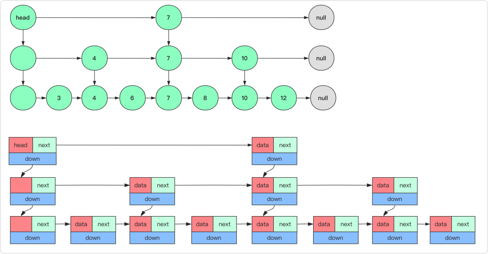


- 对于理想的跳表，每向上一层索引节点数量都是下一层的1/2.

- 在插入的时候是否添加上层索引是个概率问题(1/2的概率)

  ```java
  // 基本节点
  class SkipNode<T>
  {
      int key;
      T value;
      SkipNode next,down;//右下个方向的指针
      public SkipNode (int key,T value) {
          this.key=key;
          this.value=value;
      }
  }
  ```

初始化将跳表的头结点(head)的key设为int的最小值(一定满足左小右大方便比较)。

### 查询

从最上层，只要找到一个就可以了，不用找到最底层去。

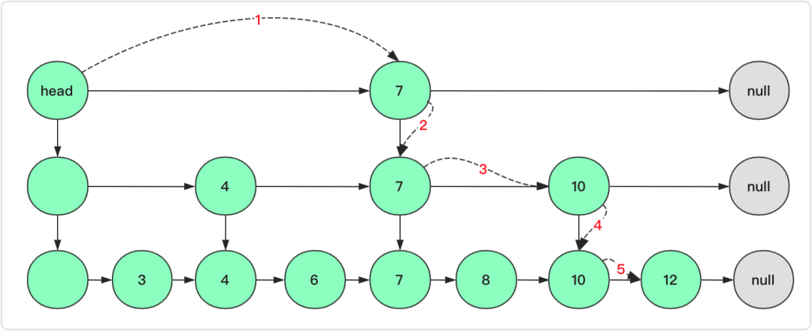


### 删除

(1)删除当前节点和这个节点的前后节点都有关系

(2)删除当前层节点之后，下一层该key的节点也要删除，一直删除到最底层

(3) 因此，查找左节点的方式来删除。因为跳表的结构决定了，如果上层有节点7，下面一层一定有节点7。

> 注意红色部分的数字，就是删除的逻辑。

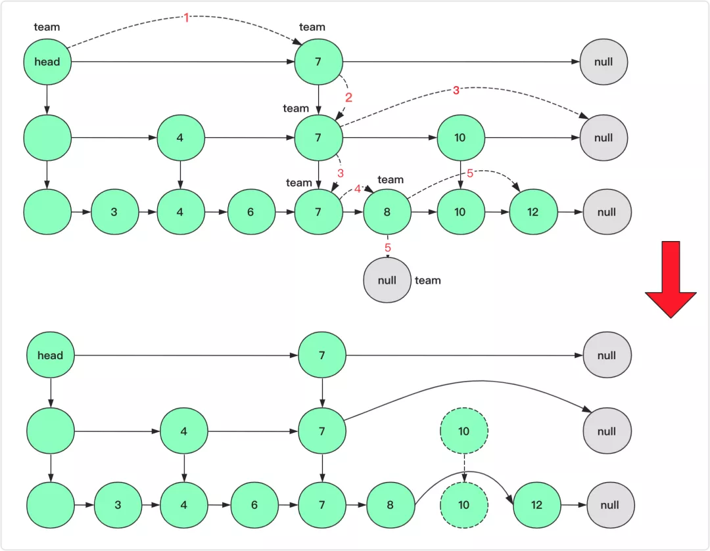

### 添加

**插入需要考虑是否插入索引，插入几层**等问题。**如何找到上层的待插入节点** ？（**巧妙的借助查询过程中记录下降的节点**）

- 从最底层添加，根据随机函数决定是否往上添加节点

* 利用stack来存储搜索的路径，每次只需要记录向下↓的节点，这样可以追溯往上添加node的路径。
  1. 搜索左节点阶段，stack存放每次向下↓的节点，方便以后在这些节点之后，添加新的节点。
  2. 添加节点阶段，根据stack和随机函数，从底层向上层，添加节点。
     - 注意：如果添加节点的level数大于了最大的32，则停止向上添加
     - 如果添加节点的level数已经大于了当前跳表的最大层数，需要更新头结点head

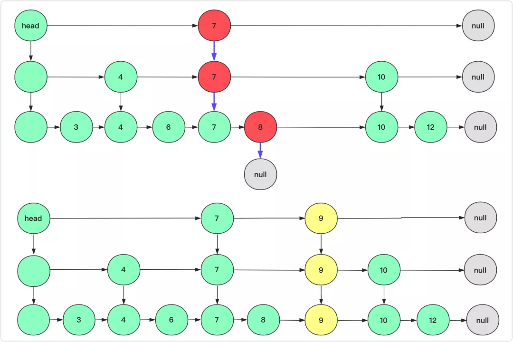


如果遇到到了第3层，仍然判断要往上添加索引节点，则需要更新head节点？


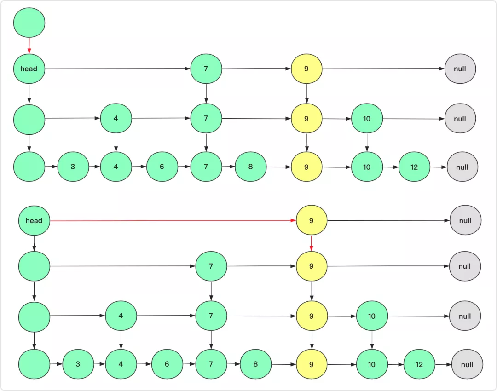

### 总结

对于跳表以及跳表的同类竞争产品：红黑树，为啥Redis的有序集合(zset) 使用跳表呢？因为跳表除了查找插入维护和红黑树有着差不多的效率，**它是个链表，能确定范围区间，而区间问题在树上可能就没那么方便查询啦。**而JDK中**跳跃表ConcurrentSkipListSet和ConcurrentSkipListMap。** 有兴趣的也可以查阅一下源码。

```java

/**
 * Leetcode 1206
 * 跳表的结构：给多级链表加上索引，每层索引都是最底层Node的copy。
 * 查找：从最上层，只要找到一个就可以了，不用找到最底层去。
 * 删除：需要删除每层出现的所有节点，所有找到待删除节点的左节点，然后执行删除。
 * 添加：从最底层添加，根据随机函数决定是否往上添加节点
 */
public class Skiplist {
    SkipNode head; // 头结点
    Random random; // 随机数，控制插入
    int highLevel; // 当前链表的层数
    final int MAX_HIGH_LEVEL = 32;

    public Skiplist() {
        head = new SkipNode(Integer.MIN_VALUE);
        random = new Random();
        highLevel = 0;
    }

    // 查询：为了统一思想，查找节点的部分也用查找左节点的思想。
    // key > cur: 需要根据cur.next 与 key比较，觉得是向↓还是向→走
    //            cur.next == null: 只能往下↓
    //            key < cur.next: 往下↓
    //            key == cur.next: 找到了，可以不走了。
    //            key > cur.next: 往右→
    public boolean search(int key) {
        SkipNode cur = head;
        SkipNode found = null;
        while (cur != null && key > cur.key) {
            if (cur.next == null || key < cur.next.key) {
                cur = cur.down;
            } else if (key == cur.next.key) {
                found = cur;
                break;
            } else if (key > cur.next.key) {
                cur = cur.next;
            }
        }
        return found == null ? false : true;
    }

    // 删除：查找左节点
    //    cur.next不存在：往下↓搜索
    //    key < cur.next: 往下↓搜索
    //    key == cur.next: 找到了，执行删除。同时往↓走，继续删除下一层的key
    //    key > cur.next: 往右→搜索
    public boolean erase(int key) {
        SkipNode cur = head;
        boolean res = false;
        while (cur != null && key > cur.key) {
            if (cur.next == null || key < cur.next.key) {
                cur = cur.down;
            } else if (key == cur.next.key) { // 查找到左节点，执行删除。同时往↓走，继续删除下一层的key
                cur.next = cur.next.next;
                cur = cur.down;
                res = true;
            } else if (key > cur.next.key) {
                cur = cur.next;
            }
        }
        return res;
    }

    /**
     * 添加节点：从最底层添加，根据随机函数决定是否往上添加节点。
     * 利用stack来存储搜索的路径，每次只需要记录向下↓的节点，这样可以追溯往上添加node的路径。
     * 如何处理？
     * 1. 搜索左节点阶段，stack存放每次向下↓的节点，方便以后在这些节点之后，添加新的节点。
     * 2. 添加节点阶段，根据stack和随机函数，从底层向上层，添加节点。
     * - 注意：如果添加节点的level数大于了最大的32，则停止向上添加
     * - 如果添加节点的level数已经大于了当前跳表的最大层数，需要更新头结点head
     */
    public void add(int key) {
        SkipNode cur = head;
        // 1 搜索左节点
        LinkedList<SkipNode> stack = new LinkedList<>();
        while (cur != null && key > cur.key) {
            if (cur.next == null || key < cur.next.key) {
                stack.addLast(cur);
                cur = cur.down;
            } else if (key == cur.next.key) {
                stack.addLast(cur);
                cur = cur.down;
            } else if (key > cur.next.key) {
                cur = cur.next;
            }
        }

        // 2 添加节点
        int level = 0;
        SkipNode lastNode = null;
        while (!stack.isEmpty()) {
            cur = stack.removeLast();
            SkipNode node = new SkipNode(key);
            node.next = cur.next;
            cur.next = node;
            level++;
            node.down = lastNode;
            lastNode = node;

            double upRate = random.nextDouble();
            if (upRate > 0.5) { // 有1/2的概率向上添加节点
                return;
            }
            // 向上添加节点
            if (level > MAX_HIGH_LEVEL) {
                return;
            }
            if (level >= this.highLevel) {
                SkipNode newHead = new SkipNode(Integer.MIN_VALUE);
                newHead.down = head;
                head = newHead;
                stack.addLast(head);
                this.highLevel++;
            }
        }
    }
}

```

## 2 红黑树

**我们学习数据结构和算法，要学习它的由来、特性、适用的场景以及它能解决的问题。**

由来：**红黑树是一种近似平衡二叉查找树**。它是为了解决普通二叉查找树在频繁的插入、删除等动态更新的情况下，出现时间复杂度退化的问题。

特性：红黑树的高度近似 log2n，所以它是近似平衡，插入、删除、查找操作的时间复杂度都是 O(logn)。

适用场景：因为红黑树是一种性能非常稳定的二叉查找树，所以，在工程中，但凡是用到动态插入、删除、查找数据的场景，都可以用到它。不过，它实现起来比较复杂，我们其实更倾向用跳表来替代它。

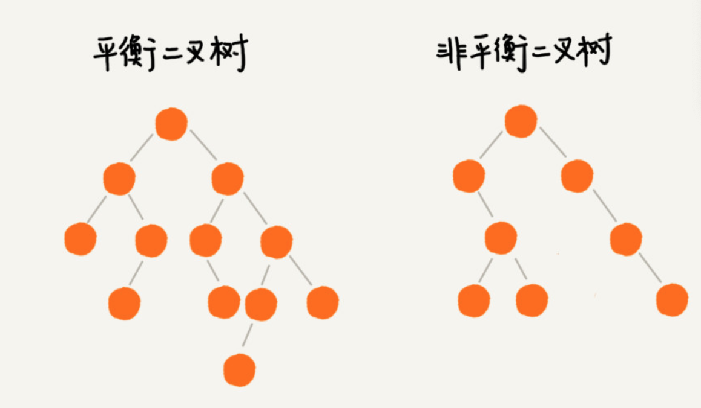

> 补充： AVL 树，严格符合平衡二叉查找树的定义，即任何节点的左右子树高度相差不超过 1，是一种高度平衡的二叉查找树。


### 由来：2-3树

Sedgewick是红黑树的发明者,1987年。因为平衡二叉树在插入和删除过程中需要判断插入的结点时2-结点还是3-结点等等一系列问题，实现起来代码量特别大，并且会增加额外开销，所以就提出了红黑树。

> 以二叉树的形式实现2-3树，通过红黑树与2-3树之间的一一对应，让我们对红黑树有了更直观的理解。

红黑树的基本思想是用标准的二叉查找树（完全由2-结点构成）和一些额外的信息（替换3-结点）来表示2-3树。

为了保证查找树的平衡性，我们需要一些灵活性，因此在这里我们允许树中的一个结点保存多个键。

**2-结点**：含有一个键(及值)和两条链接，左链接指向的2-3树中的键都小于该结点，右链接指向的2-3树中的键都大于该结点。

**3-结点**：含有两个键(及值)和三条链接，左链接指向的2-3树中的键都小于该结点，中链接指向的2-3树中的键都位于该结点的两个键之间，右链接指向的2-3树中的键都大于该结点。

（2-3指的是2叉-3叉的意思）一颗完美平衡的2-3查找树中的所有空链接到根结点的距离都是相同的。

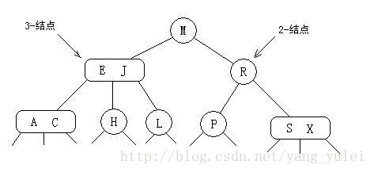

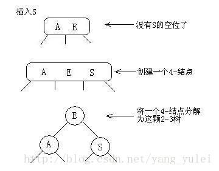

这里有一个完整的插入调整过程：

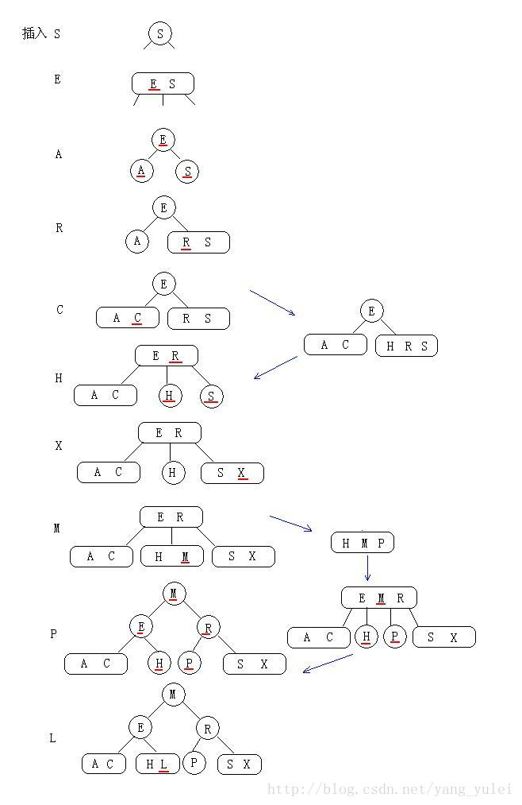

- 优点：最坏情况下仍有较好的性能。O(logN)

- 缺点: 需要维护两种不同类型的结点，查找和插入操作的实现需要大量的代码，而且它们所产生的额外开销可能会使算法比标准的二叉查找树更慢。

> （**理解红黑树一句话就够了**：**红黑树就是用红链接表示3-结点的2-3树。**那么红黑树的插入就可转化为2-3树的问题，即：在脑中用2-3树来操作，得到结果，再把结果中的3-结点转化为红链接即可。而2-3树的插入，前面已有详细图文，实际也很简单：有空则插，没空硬插，再分裂。**分裂的时候，根据当前树的左右高度差，来决定向下分裂还是向上挤位置。** ）

### **一棵红黑树满足4个条件**

背后的思想是用标准的二叉查找树（完全由2-结点构成）和一些额外的信息（替换3-结点）来表示2-3树。

树中的链接分为两种类型：**红链接将两个2-结点连接起来构成一个3-结点，黑链接则是2-3树中的普通链接。**确切地说，我们将3-结点表示为由一条**左斜**的红色链接相连的两个2-结点。

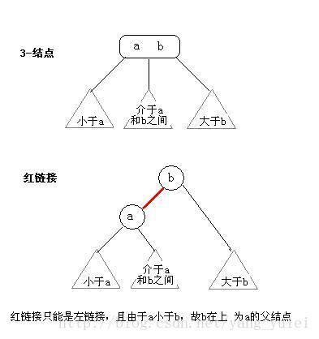

如果我们将一颗红黑树中的红链接画平，那么所有的空链接到根结点的距离都将是相同的。如果我们将由红链接相连的结点合并，得到的就是一颗2-3树。

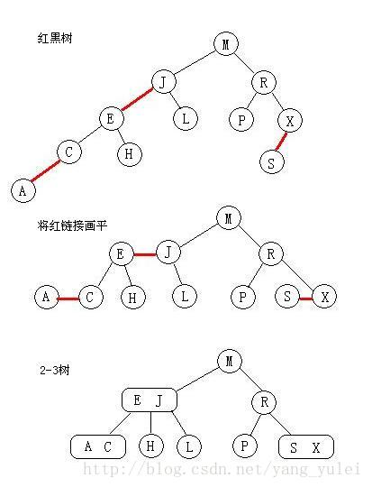

> **红黑树的另一种定义**是满足下列条件的二叉查找树：
>
> ⑴红链接均为左链接。(**对应的红节点就是左连接下面的那个节点**)
>
> ⑵没有任何一个结点同时和两条红链接相连。
>
> ⑶该树是完美黑色平衡的，即任意空链接到根结点的路径上的黑链接数量相同。

- 根节点是黑色的；
- 每个叶子节点都是黑色的空节点（NIL），也就是说，叶子节点不存储数据；
- 任何相邻的节点都不能同时为红色，也就是说，红色节点是被黑色节点隔开的；
- 每个节点，从该节点到达其可达叶子节点的所有路径，都包含相同数目的黑色节点；

为了画图方便，省略掉了最后一层的叶子节点。

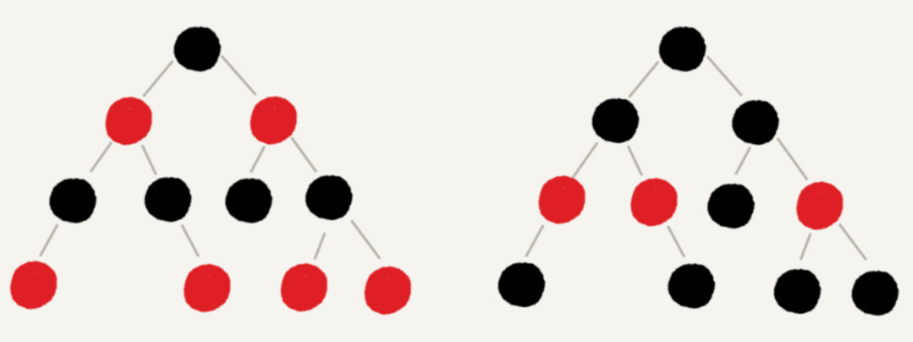

### 自平衡

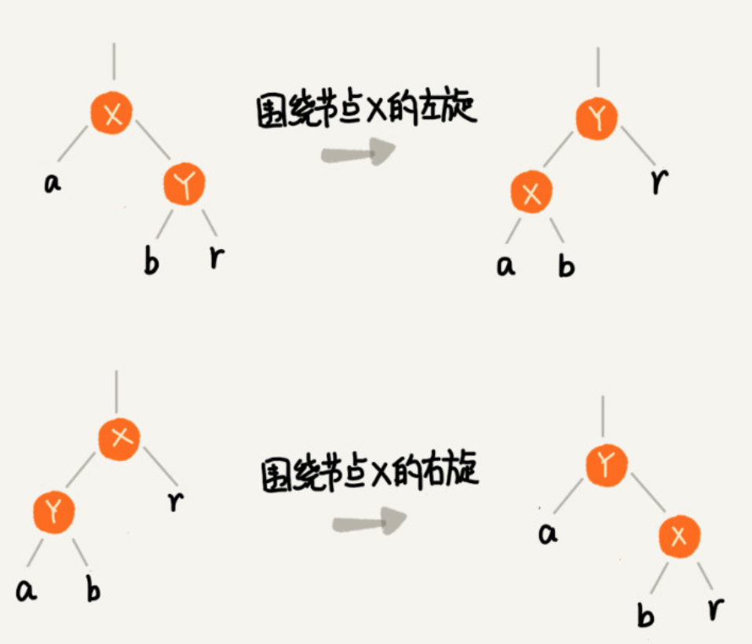

- 左旋：围绕某个节点向左旋转。以某个结点作为支点(旋转结点)，其右子结点变为旋转结点的父结点，右子结点的左子结点变为旋转结点的右子结点，左子结点保持不变

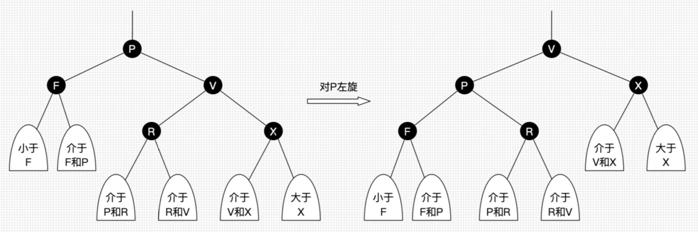

- 右旋：以某个结点作为支点(旋转结点)，其左子结点变为旋转结点的父结点，左子结点的右子结点变为旋转结点的左子结点，右子结点保持不变

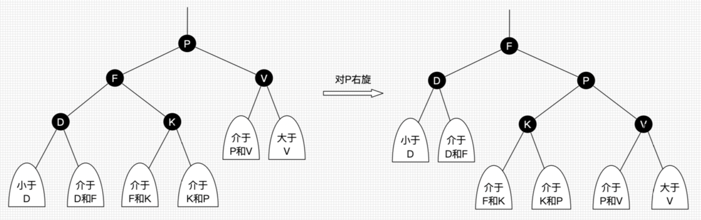

- 变色：结点的颜色由红变黑或由黑变红

### 插入操作的平衡调整

**红黑树规定，插入的节点必须是红色的。而且，二叉查找树中新插入的节点都是放在叶子节点上**。

> 对于红黑树的调整，推到正确性很难。就像魔方复原一样，什么样的case，做什么样的操作，就可以还原。所以不用记忆，翻看笔记就可以了。

关于插入操作的平衡调整，有这样两种特殊情况，但是也都非常好处理。

- 如果插入节点的父节点是黑色的，那我们什么都不用做，它仍然满足红黑树的定义。
- 如果插入的节点是根节点，那我们直接改变它的颜色，把它变成黑色就可以了。
- 除此之外，其他有3种情况都会违背红黑树的定义，需要调整（旋转和变色）

红黑树的平衡调整过程是一个迭代的过程。我们把正在处理的节点叫作**关注节点**。关注节点会随着不停地迭代处理，而不断发生变化。最开始的关注节点就是新插入的节点。

> 为了简化描述，我把父节点的兄弟节点叫作叔叔节点，父节点的父节点叫作祖父节点。

**CASE 1：如果关注节点是 a，它的叔叔节点 d 是红色**，我们就依次执行下面的操作：

- 将关注节点 a 的父节点 b、叔叔节点 d 的颜色都设置成黑色；
- 将关注节点 a 的祖父节点 c 的颜色设置成红色；
- 关注节点变成 a 的祖父节点 c；
- 跳到 CASE 2 或者 CASE 3。

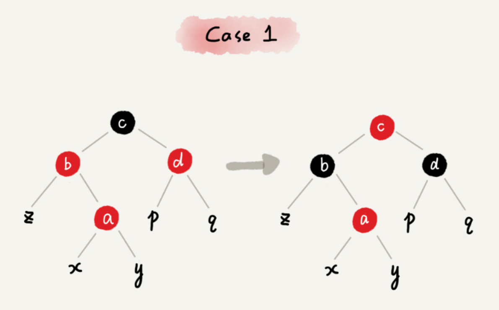

**CASE 2：如果关注节点是 a，它的叔叔节点 d 是黑色，关注节点 a 是其父节点 b 的右子节点**，我们就依次执行下面的操作：

- 关注节点变成节点 a 的父节点 b；
- 围绕新的关注节点b 左旋；
- 跳到 CASE 3。


**CASE 3：如果关注节点是 a，它的叔叔节点 d 是黑色，关注节点 a 是其父节点 b 的左子节点**，我们就依次执行下面的操作：

- 围绕关注节点 a 的祖父节点 c 右旋；
- 将关注节点 a 的父节点 b、兄弟节点 c 的颜色互换。
- 调整结束。

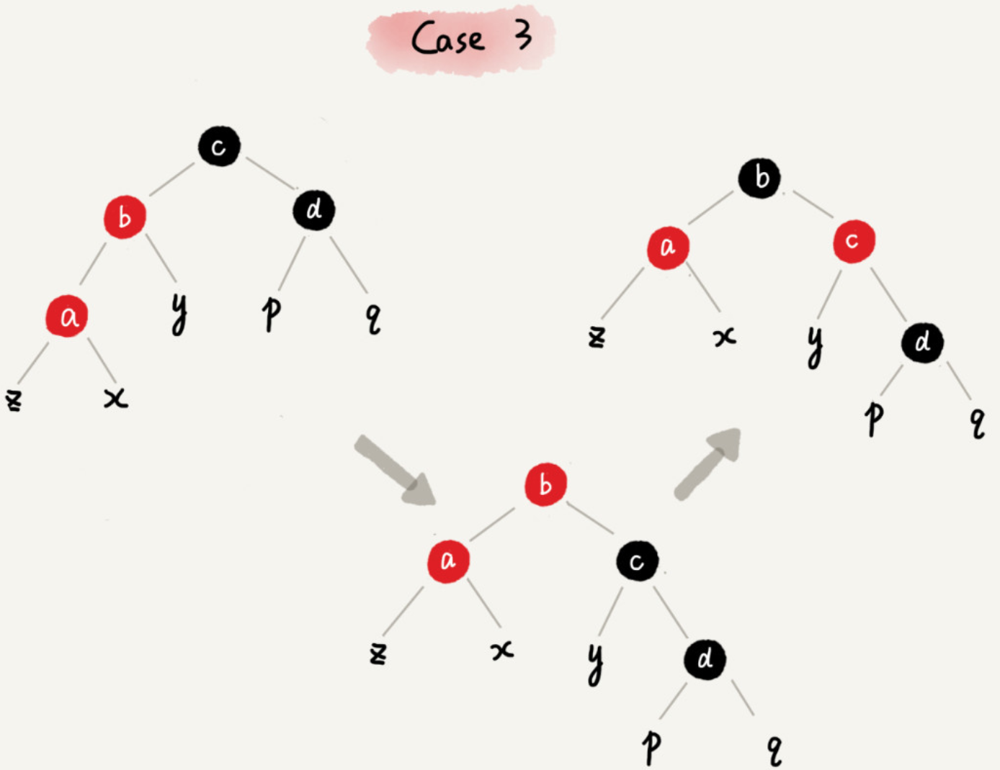

### 删除的平衡调整

依旧只需要根据关注节点与周围节点的排布特点，按照一定的规则去调整就行了。

- 第一步是**针对删除节点初步调整**。初步调整只是保证整棵红黑树在一个节点删除之后，仍然满足最后一条定义的要求
- 第二步是**针对关注节点进行二次调整**，让它满足红黑树的第三条定义，即不存在相邻的两个红色节点。

### 总结

第一点，**把红黑树的平衡调整的过程比作魔方复原，不要过于深究这个算法的正确性**。你只需要明白，只要按照固定的操作步骤，保持插入、删除的过程，不破坏平衡树的定义就行了。

第二点，**找准关注节点，不要搞丢、搞错关注节点**。因为每种操作规则，都是基于关注节点来做的，只有弄对了关注节点，才能对应到正确的操作规则中。在迭代的调整过程中，关注节点在不停地改变，所以，这个过程一定要注意，不要弄丢了关注节点。

第三点，**插入操作的平衡调整比较简单，但是删除操作就比较复杂**。针对删除操作，我们有两次调整，第一次是针对要删除的节点做初步调整，让调整后的红黑树继续满足第四条定义，“每个节点到可达叶子节点的路径都包含相同个数的黑色节点”。但是这个时候，第三条定义就不满足了，有可能会存在两个红色节点相邻的情况。第二次调整就是解决这个问题，让红黑树不存在相邻的红色节点。

Java里面红黑树的定义，来自TreeMap.

```java
static final class Entry<K,V> implements Map.Entry<K,V> {
        K key;
        V value;
        Entry<K,V> left;
        Entry<K,V> right;
        Entry<K,V> parent;
        boolean color = BLACK;
}
```

Refer: [从2-3树到 红黑树](https://blog.csdn.net/fei33423/article/details/79132930)

## 3 B和B+树

我们讨论了数组和链表，二叉查找树、平衡的二叉查找树（AVL树是它的实现），对它的改进是2-3树，红黑树对2-3树进行了改进。

> 由来：B树的出现是针对查找的数据特别大，2-3树在内存中已经无法存放。另外，还有类似mysql区间查找的需求。

B-树是对2-3树数据结构的扩展。它支持对保存在磁盘或者网络上的符号表进行外部查找。

- 定义：

改造二叉查找树成B+树，如下图。

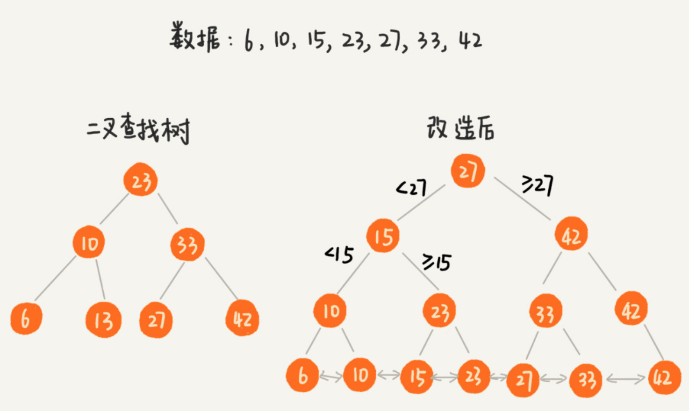

二叉查找树，经过改造之后，支持区间查找的功能就实现了。不过，为了节省内存，如果把树存储在硬盘中，那么每个节点的读取（或者访问），都对应一次磁盘 IO 操作。树的高度就等于每次查询数据时磁盘 IO 操作的次数。（为什么要降低树的高度？）


## 4 LFU Cache

给LRU添加上频率。需要3种Map来记录。

- 记录频率的链表（fre2list）：频率到链表的映射，可以利用LinkedHashSet，根据插入顺序来存放的带有Hash的链表。
- 方便快速查询，需要Map：(key2value)
- 查询每个节点的使用频率，需要Map：(key2fre)

主要有3个方法要写好。

- 删除最老的节点
- **更新fre2list的节点和频率**
- 添加一个完全新的节点

每次操作，想一想**三种结构和两个大小**是否需要更新：

* key2value (√)

* key2fre   (√)

* fre2list  (√)

  

* size     (+1)

*      minFre   (=1)

```java
public class LFUCache {
    int size = 0, minFre = 0, capacity = 0;
    Map<Integer, LinkedHashSet<Integer>> fre2list = new HashMap<>();
    Map<Integer, Integer> key2value = new HashMap<>();
    Map<Integer, Integer> key2fre = new HashMap<>();

    public LFUCache(int capacity) {
        this.capacity = capacity;
        this.size = 0;
        this.minFre = 0;
    }

    // 删除最老的节点
    void removeOldest() {
        LinkedHashSet<Integer> keyList = fre2list.get(minFre);
        Integer key = keyList.iterator().next(); // 删除的重点
        keyList.remove(key);
        if (keyList.isEmpty()) {
            fre2list.remove(minFre);
        }
        key2fre.remove(key);
        key2value.remove(key);
        this.size--;
    }

    // 给某个已经存在的节点，增加频率，把(fre,key) 更新到(fre + 1, key)
    void increaseFre2list(int fre, int key) {
        LinkedHashSet<Integer> keyList = fre2list.get(fre);
        keyList.remove(key);
        if (keyList.isEmpty()) {
            fre2list.remove(fre);
            // update minFre
            if (minFre == fre) {
                minFre++;
            }
        }
        LinkedHashSet<Integer> newKeyList = fre2list.getOrDefault(fre + 1, new LinkedHashSet<>());
        newKeyList.add(key);
        fre2list.put(fre + 1, newKeyList);
    }

    // 完全是添加一个全新节点
    void addNodeInFre2list(int key) {
        LinkedHashSet<Integer> newKeyList = fre2list.getOrDefault( 1, new LinkedHashSet<>());
        newKeyList.add(key);
        fre2list.put(1, newKeyList);
        // update size + minFre
        this.size++;
        this.minFre = 1;
    }

    /**
     * 如果不存在，直接返回-1；
     * 如果存在，update三种结构和2种大小。
     * 三种结构：
     *      key2value
     *      key2fre   (√)
     *      fre2list  (√)
     * 两个大小：
     *      size
     *      minFre   (有可能√)
     */
    public int get(int key) {
        if (!key2value.containsKey(key)) {
            return -1;
        }
        int fre = key2fre.get(key);
        key2fre.put(key, fre + 1);
        increaseFre2list(fre, key);
        return key2value.get(key);
    }
    /**
     * 如果不存在，判断是否要溢出了，然后直接插入。
     * 三种结构：
     *      key2value (√)
     *      key2fre   (√)
     *      fre2list  (√)
     * 两个大小：
     *      size     (+1)
     *      minFre   (=1)
     * 如果存在，直接更新
     * update三种结构和2种大小。
     * 三种结构：
     *      key2value (√)
     *      key2fre   (√)
     *      fre2list  (√)
     * 两个大小：
     *      size
     *      minFre   (有可能√)
     */
    public void put(int key, int value) {
        // 边界情况
        if (capacity == 0) {
            return;
        }
        if (key2value.containsKey(key)) {
            int fre = key2fre.get(key);

            key2value.put(key, value);
            key2fre.put(key, fre + 1);
            increaseFre2list(fre, key);
        } else {
            if (this.size == this.capacity) {
                removeOldest();
            }
            key2value.put(key, value);
            key2fre.put(key, 1);
            addNodeInFre2list(key);
        }
    }
}

```

