# 要点

* 每个项目，想清楚项目挑战和难点
* 现网问题处理**case**总结整理润色 (done)
* 质量体系思路过程和实践 (done)，无非是区分事前事中事后三个维度，每个维度具体包含哪些

自己的问题
* 行业视野如何锻炼
  * 拥抱全局责任意识：转变观念，为整个产品的结果负责。
* 把握整个技术体系和技术发展
  * 技术驱动：如何扩展自己的技术视野和行业的发展趋势。

# 介绍
我叫黄强，在DD负责消息队列DDMQ的整体稳定性建设，在过去的两年中，没有发生过P2级别以上的主责故障；并且成功实现了新的云原生架构落地，实现了新架构上线覆盖率70%的目标，并有效控制了成本，目前实现了32%降本目标。
* 稳定性建设方面，全面梳理了DDMQ系统的稳定性风险，提升了系统的抗风险能力和运维效率
* 云原生架构升级方面，主导了DDMQ向Pulsar架构的成功迁移，实现了系统的云原生化，支持更高的并发量，还显著减少了延迟，提升了用户体验。通过引入计算与存储分离构建了一个灵活、可扩展的消息队列。
* 性能优化与成本方面，建立专项优化，包括DopBroker和Bookie专项，成功解决了集群抖动、ZK强依赖和存储性能瓶颈等问题，大幅提升了系统的稳定性、资源利用率和性能，有效降低了运营成本。
```
总结：
通过详细的稳定性规划和执行，DDMQ系统实现了高可用性和稳定性。在过去两年内，没有发生过重大故障，确保了系统的持续稳定运行
新架构支持快速扩展和灵活配置，能够应对不断变化的业务需求，提升了系统的灵活性和适应性
通过优化资源配置和性能调优，我们实现了系统运行成本的显著降低，提升了资源利用效率和系统整体性能。新的架构不仅支持更高的并发量，还显著减少了延迟，提升了用户体验
```

# 1项目：云原生架构落地
1. 背景和目标
* DDMQ为了解决现阶段存在的问题如集群利用率不均、运维负担重、扩缩容影响大的问题，也为了优化运行成本、提高运维效率、提升系统稳定性。
2. 架构和技术选型
* 架构概述：DDMQ 3.0引入pulsar，通过计算与存储分离的架构，使其更适应云原生环境，能够支持快速伸缩和高效的资源管理
* 技术选型，选择Pulsar的原因包括：
  * 强大的消息处理能力和多语言支持。
  * 计算和存储的分离，有利于水平扩展。
  * 社区支持良好，便于未来的功能扩展和优化。
  * 核心功能：
  
    * 负载均衡：内置的负载均衡机制，能够动态调配资源。（负载均衡算法不高效，太频繁，耗时长，造成生产耗时毛刺多）
    * 单点故障自动恢复：
      * broker无状态，故障可以自动检测和恢复，由于bookie的强一致性存储，保障了可靠性（问题：broker上线不是优雅关闭，上线发送失败多）
      * Bookkeeper是分布式一致性系统，单点故障可容错（问题：bookie由于磁盘选型造成容量有拐点，broker有雪崩风险）
    * 连接复用：减少了系统资源的消耗
* 实现细节：
  * 协议适配：DDMQ的协议与Pulsar交互，通过Pulsar Protocol Handler实现，成本低且适应性强。
  * 客户端封装：第一版客户端无需改造，直接适配；第二版客户端封装Pulsar client，更容易集成

3.性能优化和挑战

* 挑战
	* 集群管理复杂：DDMQ现阶段的集群规模较大，管理难度高，Pulsar的引入帮助简化了这一过程。
	* 负载不均和存储扩缩容问题：通过Pulsar的分片和多盘支持，解决了负载不均和存储扩展问题。
* 优化
	* 云原生架构升级后，存算分离更适合云原生环境，优化资源管理
	* 性能调优：针对高并发和大数据量场景进行性能调优，确保系统稳定运行。（见Dop优化专项：broker cpu、bookie 磁盘、zk高负载）

4.项目结果和影响

* 运行成本降低：预估能降低50%，目前到32%。
* 系统性能提升：Pulsar的引入显著提升了系统的吞吐量和响应速度，CPU和磁盘IO开销减少（效果就是机器更少，吞吐更高，成本变低了）
* 业务效能提高：可以支持更高的并发量和更多功能，提升了业务处理效率和响应速度，生产消费耗时更低，2个9从100ms，2个9 20ms
* 容灾能力提升：可以很方便做同城双活、异地多活
6. 未来发展和改进
* 进一步优化Pulsar配置、升级LTS版本，提升性能和稳定性。
* 扩展功能：原生集群接入能力
* 容灾能力建设

>  设计文档：[DDMQ云原生演进方案 ](https://cooper.didichuxing.com/docs/document/2199156480577)https://cooper.didichuxing.com/didoc/file/2199152278930


成本和收益是什么？一年的时间来看，利润率从-32%到转正

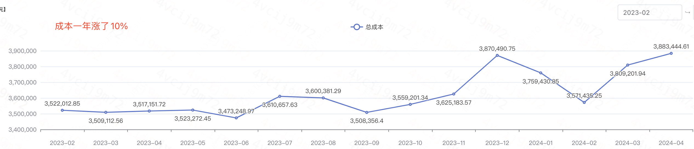

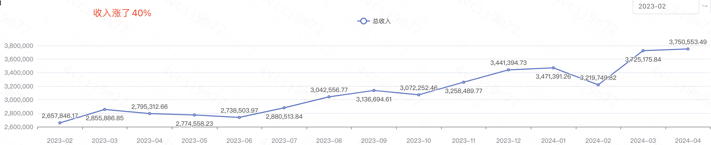

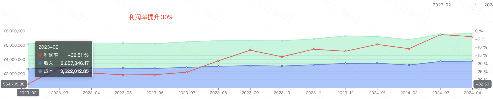

# 2稳定性
## 2.1现状
2022根因故障top3：运维变更、代码bug、强依赖故障

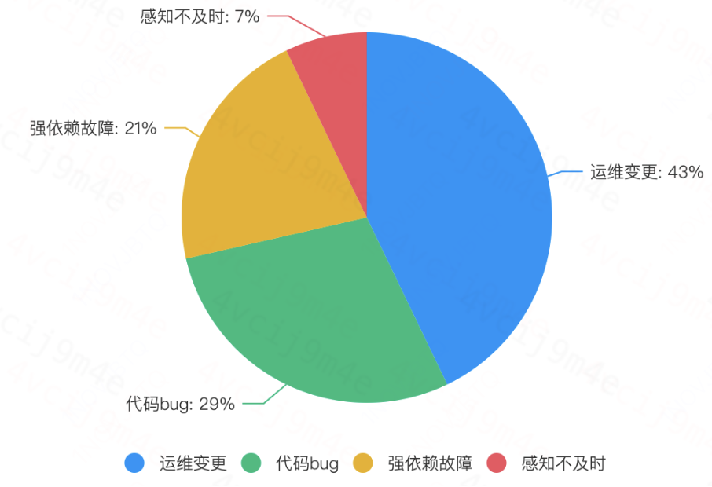

2024故障根因Top3：容量、强依赖、运维变更

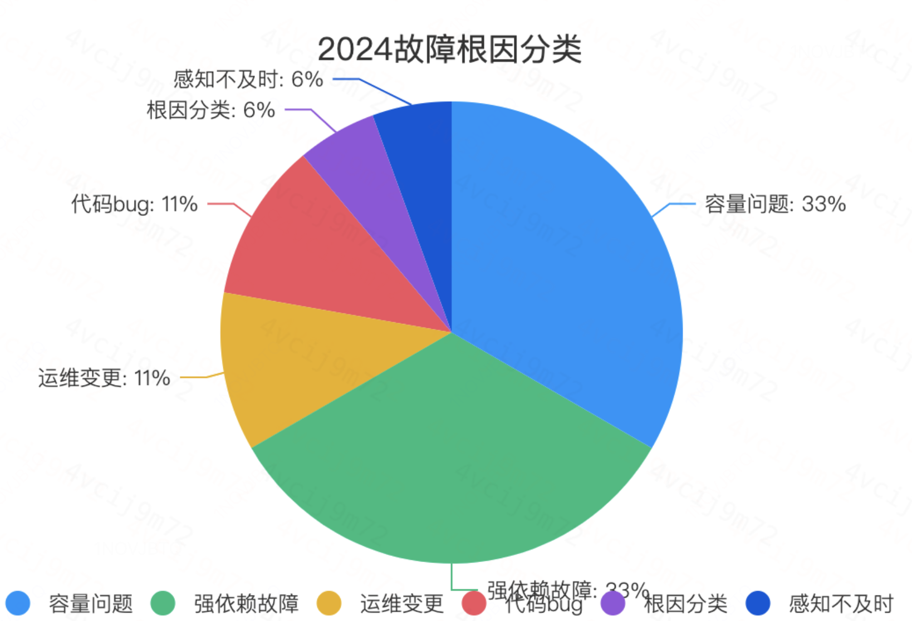

* 变化原因：流量上涨导致容量变化
* 常用止损手段：重启、扩容

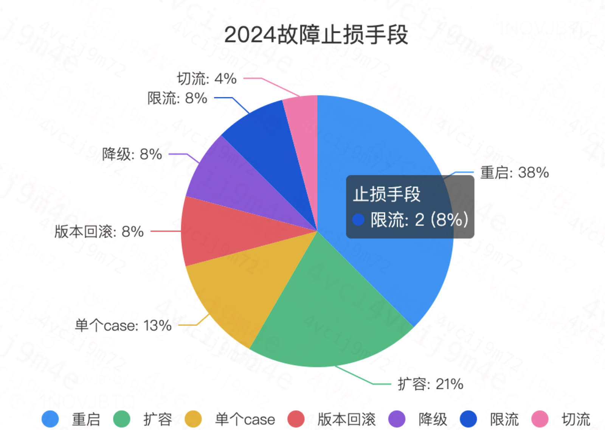

## 2.2思考
原则：事前降发生、事中控影响、事后防复发

### 2.2.1事前降发生

建设系统容量体现、容灾能力、运维SOP、故障预案等能力

#### 1容量体现

**1.1梳理所有模块容量指标，报警覆盖，建设容量大盘，定期review**

* 容量指标如何评估
	* 新系统：压测作为初始容量，比如Bookie、Broker
	* 老系统：借鉴历史经验和峰值，比如RMQ、Chronos、SD、PProxy
	* 线上可观测，建设容量大盘，纠正容量
		* 比如CProxy的容量随着业务的使用，流量与CPU资源消耗不成线性比例。那就先用cpu作为预警

* 建设Dop容量模型
	* 模型：用什么指标描述QPS、BPS；如何保证准确性，压测场景要丰富
	  * Broker 压测的qps辅助，cpu拿来补齐。最后靠快速扩容
		* Bookkeeper：水位更稳定，靠压测。10K 8W写、1W读(800M写，100M读盘，P999 50ms)
	* 容量的水位，直观，需要对应报警和巡检。  
  * 深入：全链路压测的仿真度评估
  

**1.2 节假日预估流量提前扩容**
*  手动（3分钟）、自动扩容计划中

**1.3集群分级保障（计划中）**

**1.4  成果体现：[2024 MQ稳定性大盘指标](https://cooper.didichuxing.com/docs2/sheet/2201931966414?sheetId=MODOC)、报警配置、可观测grafna大盘**

####  2容灾能力
* 多区域部署，ZK和SD多区域部署，MQ多集群部署
* 同城双活
  * 双活阶段1：单机房部署的MQ，提供切流能力
  * 双活阶段2：同城跨区域部署
* 异地灾备：跨地域复制
* 成果体现：双活阶段1

#### 3运维SOP建设
* 2023年底运维SOP全覆盖，落地验证。
* 复盘：2023年故障根因第一是运维变更导致
* 成果：2024无变更引发的故障
	* 运维平台化能力计划中
* **case**：运维变更Sop有缺陷导致的。延迟服务置换机器。延迟模块主从架构，可以自动主从切换。先替换从，在替换主。替换的从服务少观察1个指标，服务本身是异常未发现。主从切换导致故障。（2023-06 司机流水不显示订单问题 ）

#### 4故障预案建设
* 梳理各个模块故障的影响、恢复手段，包括单点、集群故障；以及依赖模块故障
* 放火验证
* 成果：
	* zk依赖（done）
  * sd、console
  * monitor单节点挂了，影响是什么？能否被其他节点服务
  * proxy、rmq、dop broker、bookie
* 节假日前故障预案review

#### 5风险提前治理
* 报警记录
	* 一级报警记录，提高有效性，降低数量
	* 二级报警治理，评估P2报警有效性和风险，逐步治理，定期review，跟进效果
* 问题跟进，分级治理
	* 问题收集：全员，值班同学和模块owner
	* 线上风险问题跟进，按年度构建数据透视表，参考 [线上风险治理统计](https://cooper.didichuxing.com/docs/sheet/2200171132179#MODOC)
### 2.2.2事中控影响
保障故障及时响应感知，预案准确执行、快速止损等流程
* 目标：1分钟发现，5分钟定位，10分钟止损
	* 第一时间是止损
* 宏观影响面判断：2023-11 消费延迟业务判断失误，导致P1
* 现状：1分钟发现，5分钟定位，执行止损预案时间长，比如RMQ扩容类、删除异常ledger类、集群重启类，约15~30分钟
* 止损的常用手段：预案准确执行，包括重启、扩容、业务降级

### 2.2.3事后防复发
落实深度复盘、落地改进项
* 复盘原则：实事求是、反思自我，避免类似事故发生。
	* 深度复盘：7天内
	* 谁来复盘：有无干系人，联合Owner
	* 谁来推进：稳定性负责人
* 如何改进落地：短期1个月，中期1Q，长期半年
	* 改进落地：稳定性负责人
	* 如何改进落地：靠稳定性运营的抓手，定期review
	* P2+大故障有PMO推动，小故障需要优先级排期跟进，跨团队也定期review
* 验收
	* 前后监控指标
		* 性能优化类、bug修复类
  * 演练：针对强依赖类
		* dop zk弱依赖
		* iot zk强依赖，找出集群的恢复时间（可忽略）
    	* **case**：[20240313 IOT Bike集群演练](https://cooper.didichuxing.com/docs2/document/2201973291102)
    	***case**: 核心报警DDMQ延迟、异常拦截演练,链接：https://cooper.didichuxing.com/docs/document/2199778134241

### 2.3心得

稳定性治理，是一个系统性工作。
* 设计阶段，方案评审、容量规划要评估。方案上T2大组内、T1部门内评审
* 实现阶段，把握质量，多人review
* 发布阶段，测试、预发、灰度线上，符合军规
* 日常运营，做好事前、事中、事后

> 文件名称：故障运营 链接：https://cooper.didichuxing.com/docs2/sheet/2202304079898?sheetId=MODOC 密码：263343`

# 3Pulsar核心流程
## 3.1生产消息
* Producer 连上broker，发送消息
	* 消息先进入本地的 Pending Queue，然后批量发送
	* **case**：批量发送在分区数多的时候，cpu消耗严重
* Broker 接收请求后，并处理消息
	* 消息被打包成 Entry，并行写入多个 Bookie 节点
	* Bookie 确认 Entry 写入成功后，返回写入结果给 Broker。
		* 如果bookie写得慢，broker会堆积写请求，容易OOM
			* 因为它的限制是一个连接一个限流，粒度大，内存不好控制

* Broker 收到bk确认后，将消息 ID 返回给 Producer，完成请求。
	* 同时，Broker将写成功的消息缓存到Cache，更新 ledger 的元数据。
		* **case**: 实际缓存的数据少，①缓存bug ②LowLevel的实现导致无活跃的cursor
* 元数据强依赖ZK
	* 包括Ledger、topic的分区信息。
	* **case**: zk 不可用时，影响写。
		* broker 写数据的时候如果写满了，就会要切换ledger。（优化：不切换）
		* broker 不shutdown（弱依赖ZK的解释）

### 3.1.1生产请求对元数据的操作
* 创建topic，创建zk的managered-ledger节点
* producer连接上，创建zk的ledger元数据，更新到zk的managered-ledger节点
* 写入完成后，broker更新ledger的元数据到managered-ledger节点

### 3.1.2Bookie 写请求处理

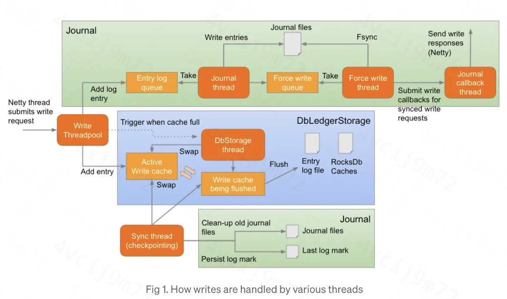

简述就是WriteThreadPool的工作：
* 1、收到写请求后，消息放入WriteCache
	* 放入到WriteCache（瓶颈点）
	* 如果是写缓存满了，需要立即触发flush，腾出空间（TriggerFlushAndAddEntry）
		* 性能瓶颈：缓存未刷入磁盘，会将等待一段时间，最终拒绝写入请求。等待可用写入缓存的时间由配置 dbStorage_maxThrottleTimeMs 设置， 默认为 10000（10 秒）。
		* 本质也是一个DbLedgerStorage 的反压机制
	* 另外，有定时任务触发flush
* 2、消息放入Journal 队列
	* 后续由JournalThread线程刷入到Journal
* 3、什么时候应答给客户端
	* Entry数据写入到Journal后，对客户端发送Response（包括3个线程）

**case**问题：从写入流程可以看到，虽然 Bookie 的数据只要落盘，完成 Jurnal 日志写入就可以了，但是由于数据落盘 Journal 前  要先写入 WriteCache， 受限于 HDD 吞吐，WriteCache flush太慢，导致写性能下降。

#### 1 写缓存满，谁flush 
DbStorage thread负责在写入缓存满时执行flush
* 交换写缓存，数据落盘（**case**:落盘成功后，缓存会失效。优化：多加1个缓存）
* 数据落盘
	* Entry Log文件落盘（hdd盘慢。原因：被随机读影响）
	* 索引文件写入Rocksdb 
> 一个ledger盘一个DbStorage线程

**Bookie实例里还有1个 SyncThread线程**

* 10秒定时任务，触发Entry Flush
* 交换写缓存：writeCache和writeCacheBeingFlushed两个缓存置换
* 数据落盘
	* EntryLocationIndex.flush：Entry索引刷入RocksDB
	* EntryLogger.flush：Entry数据落盘（hdd盘，慢）
	* LedgerIndex.flush：ledgerData索引刷入RocksDB
* 清理旧的Journal文件


#### 2 写瓶颈点有哪些
* 磁盘IO
	* Journal写入或fsync操作速度过慢，导致Journal线程和Force Write线程无法及时处理。
	* 表现：这2个写队列打满
	* 解决：Journal盘一般是ssd盘，不太会出现。若出现，扩容
* **DbLedgerStorage 缓存flush效率低，落盘慢（**case**：遇到过）**
	* 表现：写线程池队列被打满，刷盘耗时长
	* 原因：写请求遇到WriteCache满，触发强制刷盘，刷盘时间长。原因是HDD盘出现随机读，io被打满，性能恶化。
	* 解法是短期扩容，长期换nvme盘
* CPU
	* 火焰图分析，没遇到
* 读写相互影响：dop早期的hdd盘放entryLog，nvme盘放journalLog

#### 3 Journal
组成有
* Journal单线程
* ForceWriteThread单线程
* bookie-journal-callback线程池

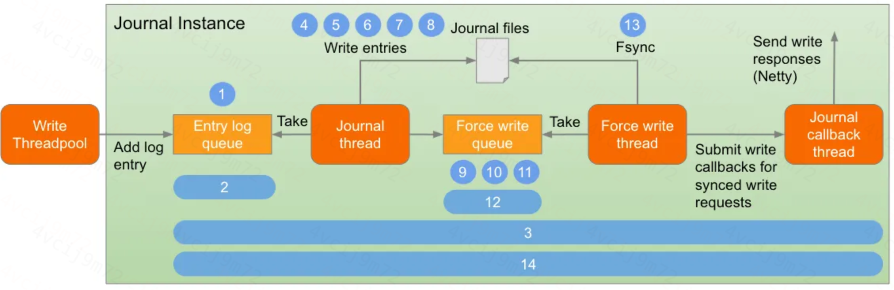

Journal 线程
* 从内存队列中取出写请求，批量写入磁盘，并定期触发 fsync 操作。
	* 批量写入磁盘是写pageCache。（异步刷盘就是到这里）
	* fsync是真正写入磁盘。（同步刷盘就是到这里）

ForceWriteThread线程
* 从Force Write写队列中获取请求，并对文件执行fsync操作。
* 频率：批量的方式，时间（1s）和大小（5%堆外）满足其一

bookie-journal-callback线程池
* 执行写请求的回调，将响应发送给客户端。
* 同步刷盘就是fsync发response，异步刷盘就是刷入pageCache就发。

## 3.2消费消息
* Client 连上 Broker 发送 Flow 请求：
	* Broker 收到请求后，先从Entry Cache中获取
		* 故障**case**：缓存命中率达不到100%
		* 优化**case**：架构切换时，订阅过多30+，流量大，所有订阅会积压，原因是单线程处理能力不足。优化前，通过跨地域复制新增一个集群，确保满足业务需求；优化后，减少1个集群，资源节省约50%
	* 如果缓存没有，向 BookKeeper 发起 readEntry 请求
* Broker 向 BookKeeper 读取消息：
	* BookKeeper 会依次从写缓存 -> 读缓存 -> 磁盘，读消息
		* 故障**case**：bookie读性能恶化
* Broker 将消息推送Push给 Client：
	* 消费者接收到消息后，缓存在Queue里，提供给消费者处理。
* Client 处理后，会发送 Ack 请求
	* Dop的Cumulative的提交方式，定时提交。
	* 考虑点是请求过多ack请求消耗Broker性能
* Broker 收到 Ack 请求后，会更新内部的游标（Cursor），一般会持久化MarkDeletePosition到Bookie
* Client继续发送Flow请求，形成推拉结合

订阅的类型
* Exclusive：独占订阅；重发的时候，会从第一条未被确认的开始重发
* Shared：共享订阅，传统的MQ的消费模式；场景：不在乎消息顺序；重发的时候，只发未确认的
* Failover：故障转移订阅，类似于Kafka Consumer 的消费逻辑，一个Consumer独占一个Partition. 
* Key_Shared：Key 保序共享订阅

下面是Dop的消费流程图

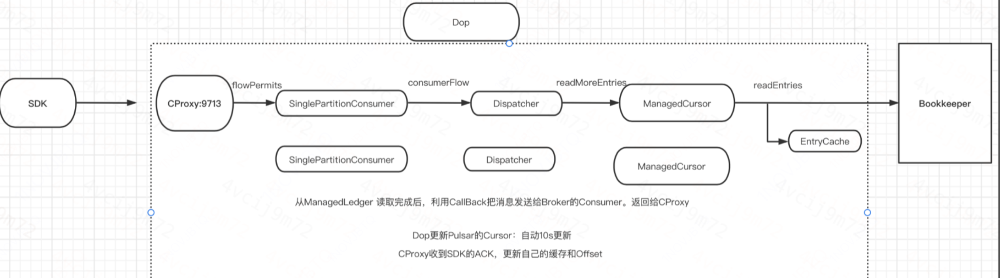

### 3.2.1Bookie处理读请求

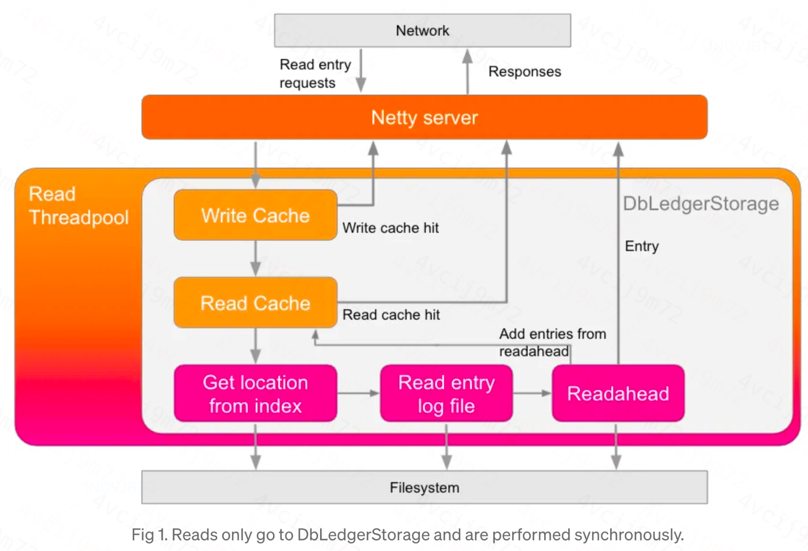

对V2协议的读请求，主要处理流程：
* 读请求放入队列
* 读数据的顺序：写缓存 -> 读缓存 -> 磁盘
	* 队列打满时（默认2000），直接拒绝返回
	* 读盘后，然后预读到读缓存
	* 返回结果
#### 1读的瓶颈点
* 读缓存抖动：预读的数据不相交
	* 解法：调大缓存、预读限制大小和条数
	* case：binlog集群由于分区数量多，大于1W，调整后，读盘qps下降50%

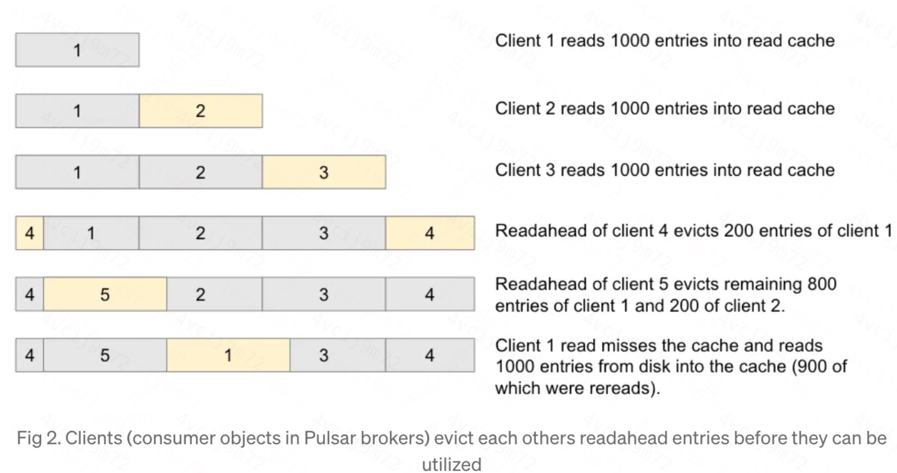
* 读瓶颈的2个原因
	* 磁盘IO：hdd盘，出现随机读。
		* case1：读线程个数和磁盘个数不匹配，造成随机读；②hdd盘本身
			* ledger 11和21，mode 8 = 3和5，磁盘是10个，都是1号盘
	* cpu：读线程个数少
* Broker读Entry报错有2个原因
	* 超时：Broker 在超时时间内，无法收到Bookie的读请求Response
	* Reject：Bookie 直接拒绝了Broker的读请求，因为读请求队列已经满了

#### 2Bookie的自我反压保护
* 正在进行的写操作限制 maxAddsInProgressLimit
	* 信号量实现，处理新写请求的任何 Netty 线程将阻塞，当 Netty 停止从网络缓冲区读取时， TCP 背压。
* 正在进行的读取总数 maxReadsInProgressLimit
* 写线程池线程队列长度 maxPendingAddRequestsPerThread
* 读线程池线程队列长度 maxPendingReadRequestsPerThread
* Journal 队列 journalQueueSize:默认1W
* DbLedgerStorage 拒绝写入，dbStorage_maxThrottleTimeMs： 默认10s，出现在Entry缓存刷盘慢
* Netty 不可写通道
	* 防止通过 Netty 通道向客户端发送响应时出现内存不足异常，可以通过配置 waitTimeoutOnResponseBackpressureMs 配置一个退避机制。

## 3.3消息的生命周期
一条消息的生命周期是从生产到消费，最后到删除。
### 3.3.1Broker侧
Broker主要是靠TTL和Retention机制。
* broker 定期通过retention和TTL做标记，然后在broker端删除ledger的zk元数据
* bookie 定期清理这些没有元数据的ledger
	* 清理标准：没有任何一个active ledger引用日志文件，则删除

补充知识点
* Retention：消息在被消费后应保留的时间，超过这个时间删除。
	* 实现上是Broker 调用 BookKeeper 的 Delete Ledger 接口，删除消息。
* TTL： Broker 主动把超过保存时间的消息Ack 掉

**case**：调小了Retention时间，磁盘空间并未及时释放。原因是只设置Retention，未设置TTL，导致最大保存时间不符合预期。

### 3.3.2Bookie的GC回收
Entry 如何从 BookKeeper 中删除？
* Broker定期检查并执行Retention策略，调用BK的Delete Ledger接口，从ZK中移除Ledger的元数据。
* Bookkeeper使用GC Compaction线程，定期执行Minor GC和Major GC，删除旧的文件。
	* 找出哪些Ledger和EntryLog文件可以删除
	* 对使用率低的EntryLog做Compaction
* 故障**case**：读BK延迟大于秒级，单hdd盘io高，见6.9磁盘：IO使用率毛刺
	* 定位到是compaction 造成的，虽然有限速和限制GC时间，但是磁盘IO高。
	* 原因是限制写，未限制预读，Compaction的时候，会scan所有entry log里的Entry header，如果缓冲区没有，会触发磁盘的读取，并且有预读。预读导致了IO util 过高。（case链接：[2023-05-08 Bookie读请求处理耗时超过2s](https://cooper.didichuxing.com/docs/document/2200071920494)）
	* 仔细来讲， compaction限速仅适用于未被删除的Entry。 但实际中，一个EntryLog文件中超过90%的Entry已被删除，所以读取量就会很大，header不大，并且有预读，会导致磁盘IO高。
> 过程：对一个EntryLog进行Compaction时，会从头到尾扫描每个Ledger Entry的元数据。如果一个Ledger Entry没有被删除，将读取该Entry的数据并写入一个新的EntryLog文件。
   这个entry本质指的是ledger

下面这张图代表了一条消息的整个生命周期。

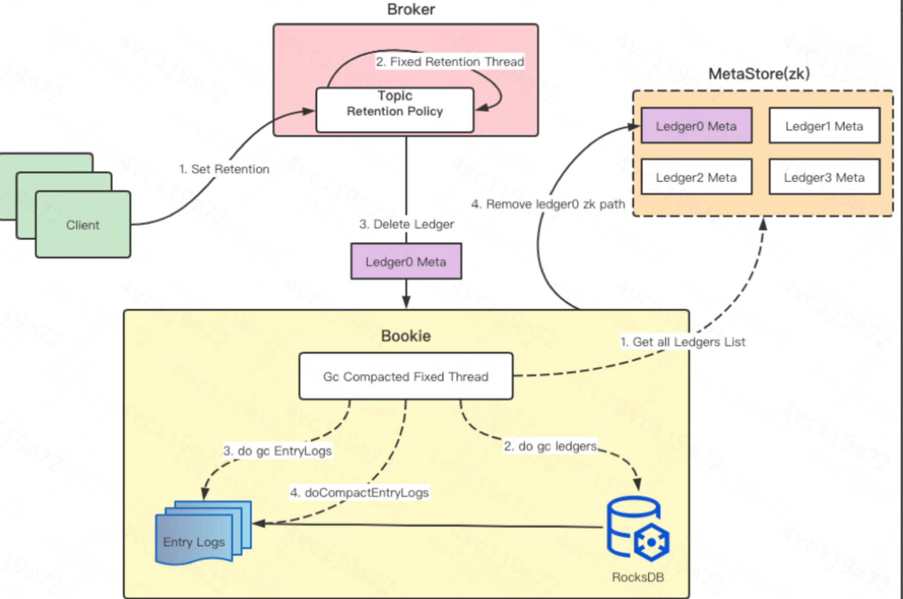


# 4Bookie专项优化

## 4.0 启动和关闭
**启动流程**
* 读取配置文件
* 初始化ZooKeeper客户端：建立与ZooKeeper的连接
* 启动服务：
	* 启动网络服务：启动Netty服务，监听配置的端口，等待客户端连接。
	* 启动Bookie：Bookie是BookKeeper的核心组件，负责处理数据的读写请求。
* 开始服务：完成所有初始化操作后，BookKeeper开始接收和处理来自客户端的读写请求。

**关闭流程**
* 停止接受新请求：关闭监听端口：停止Netty服务，拒绝新的客户端连接请求。
* 释放资源：停止后台任务，释放内存、网络等资源。
* 从ZooKeeper注销：将自己从ZooKeeper中注销，告知其他Bookie和客户端自己正在关闭，不再处理请求。
* 持久化数据：保存当前的服务状态，确保在下次启动时能够恢复。
* 关闭ZooKeeper连接：安全断开与ZooKeeper的连接
* 终止进程：完成所有资源释放和状态保存后，退出进程。


## 4.1 AutoRecovery
AutoRecovery机制：当一个bookie故障时
* 目标：确保每个ledger的副本数达到WriteQurom
* Auditor：监听Bookie节点存活和ledger副本数，发布复制任务
* Replication Worker：执行复制任务，完成数据拷贝

可能的问题：
* 资源占用，尤其是IO占用，可限速
* 脏数据：避免不必要的数据冗余或错误

## 4.2Fence机制
* 做什么？Bookie约定一个Ledger只能有1个客户端写入，Fence来保证，防止多个Client同时写入相同的ledger，确保数据一致性。
* 是什么？只有创建ledger的client才能正常写入，若该client异常关闭，导致该ledger处于OPEN状态，另一个client从zk读到该状态，会进行把它变成recovery状态，然后走fence流程。

Ledger Recovery 流程：
* 每次打开ledger时，对ledger 的state检查。
	* open：变成recovery，然后走fence流程，最后把结果返回。
	* closed：正常打开
	* recovery：走fence流程
* 发起恢复ledger
	* 把Ledger状态从OPEN改成IN_RECOVERY状态
	* 发起fence，去读取这个Ledger的LAC位置
		* case：LAC超时返回，导致不成功
	* 从LAC位置开始往前读取并恢复
	* 最后把Ledger状态变为 CLOSED
* 新建一个ledger写日志

详情见 [⭐️7 ledger fence](https://cooper.didichuxing.com/docs/document/2200015190839)

## 4.3Bookie线程模型
每个线程是做什么的todo
* bookie-io（Netty 线程）
* BookieReadThreadPool-OrderedExecutor
* BookieWriteThreadPool-OrderedExecutor
* BookieJournal-3181（如果使用默认端口）
	* ForceWriteThread
	* bookie-journal-callback线程池
* SyncThread
* db-storage：1个ledger目录一个

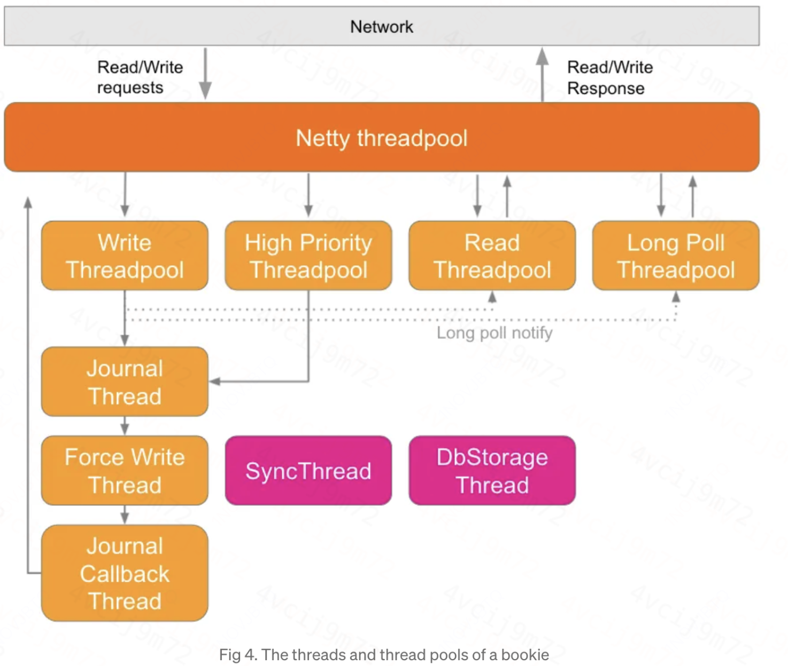

## 4.4 EntryLog格式
* LedgerIndex：RocksDB 中存储的 Ledger 集合。使用 DBLedgerStorage 即相当于用 RocksDB 做 Entrylog 的索引存储，读取数据时先读取 RocksDB 来找到索引数据，然后去 Entrylog 读 Value。
* LedgersMap：当前的单个 EntryLog 中存储的 Ledger 集合。
* EntryLogMetaMap：当前 Bookie 下所有 EntryLog，Key 是 Entrylog ID，Value 是 Entrylog Metadata。
	* 有了上面的抽象后，我们就可以进行判断。EntryLogMetaMap 的 Key 是 Entrylog ID，映射到 LedgersMap 集合。 

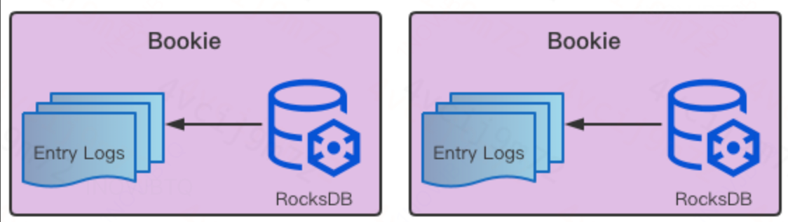

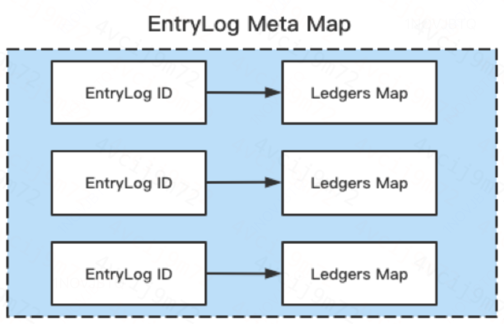

在整个压缩过程中，有三个核心的处理逻辑与函数：
* doGcLedgers()：处理 LedgerIndex 的集合（RocksDB），通过集合判断数据是否可以删除。
* doGcEntryLogs()：处理 LedgersMap 和 EntryLogMetaMap 的集合，以 doGcLedgers() 得出的集合为基准来判断当前 LedgersMap 中哪些 Ledger 可以删除，以及当前 EntryLogMetaMap 中哪些 Entrylog 可以删除。
* doCompactionEntryLogs()：处理 EntryLog 文件本身是否可以被删除。从旧的 EntryLog 文件读取不可删除的数据写入到新的 EntryLog 文件中，

Entrylog 的构成从上至下核心数据分为三部分。
* Header：包含指纹信息（BKLO，标识 Entrylog 文件，用于校验）、BookKeeper 版本、Ledgers Map Offset（Offset 偏移量、如何读取等）与 Ledgers Count（一个 Entrylog 内 Ledger 的数量）。
* LedgerEntry List：LedgerEntry 对象，包含 Entry Size、Ledger ID、Entry ID 和 Count。
* Ledgers Map：包含 Ledgers Map Size、Ledgers Count 和 Ledgers Map Entries。每一个 Ledgers Map Entries 是 Key Value 结构，由 Ledger 映射到 Size。

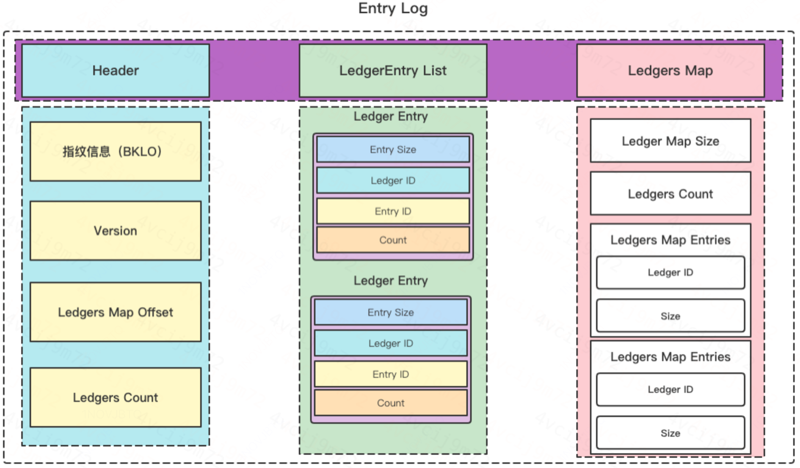

## 4.5、cache miss的全链路优化
cache miss的优化可以讲一个故事
缓存失效，修复bug：LowLevel失效，因为没cache住
缓存有一个bug：每次更新太快，导致缓存失效
难点：缓存broker、bookie缓存策略调整
仍然有cache miss，链路多发现慢，因为场景多，那是如何发现的


原因：monitor 定时监控消费延迟，需要查询消费到最后一条消息的时间，需要二分查找bookie
优化monitor后，读bookie的压力显著减少
读请求qps下降50%
读盘qps下降80%

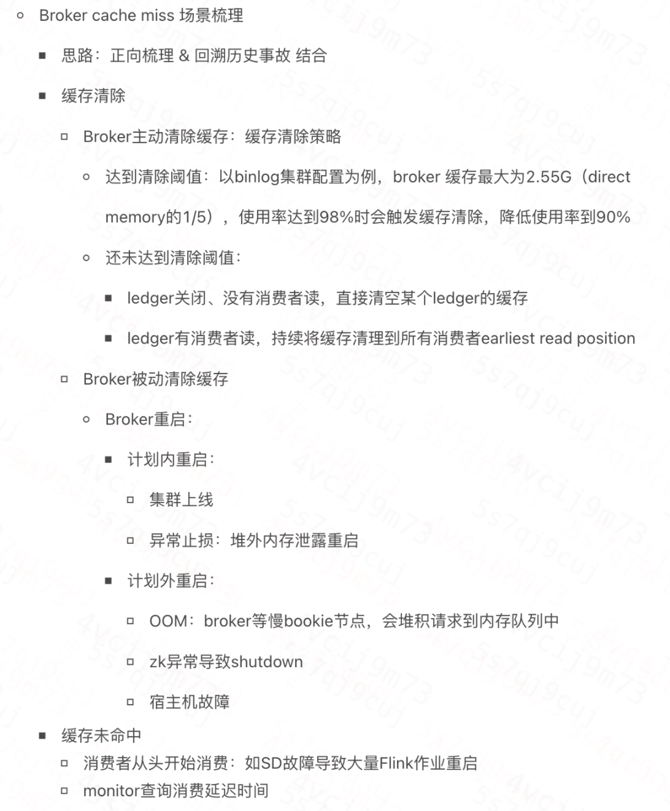


## 4.6、读性能问题~重新压测
降发生：读性能退化的问题，换nvme盘
降发生：

文件名称：Bookie读性能压测方案和报告
链接：https://cooper.didichuxing.com/docs/document/2200124049496
密码：483129

经过不同场景下的测试结果对比分析，得出3个结论
* Bookie读并发个数与磁盘个数一致最佳
* 256个并发读单盘，随机读性能是100M/s
* Bookie读队列大小设置在2000~2500合适
* 预读是顺序读盘，预读大小读耗时与读取IO字节数正相关，10M/s预读 P99 在10ms

产出3个优化点
* 添加预读大小限制feature。条数限制1000，大小限制5M/s
	* CR: [feature] [server] add dbStorage_readAheadCacheBatchBytesSize properties when read ahead entries
	* PR: https://github.com/apache/bookkeeper/pull/3895
* 添加GC Compaction 限速feature。读限速10M/s，写限速也有：30M/s
	* Bookie compaction 限速，解决Bookie Compaction的读IO过大的问题，https://kunpeng.xiaojukeji.com/view/revision/2576360
	* 说明：Compaction的时候，会scan所有entry的header，如果缓冲区没有，会触发磁盘的读取，并且产生了预读。预读导致了IO利用率过高。
* hdd盘：Bookie读并发个数和ledger目录数保持一致
	* bookie 更新读线程个数和磁盘个数，一一对应，避免随机读IO： https://kunpeng.xiaojukeji.com/view/revision/2605230


预读多少字节合适？
* 太小，相当于没有预读，没有利用读缓存；太大，读缓存被反复污染；
* 假设有1W个消费组都落后了，来设计大小。
* 单机读缓存的大小*bookie个数/3副本=预读大小*分区个数
	* binlog: 预读大小8M合适，8340M*51/3=y*16615
	* 如何验证效果：上线后，读盘请求的总体耗时，应该保持持平。

TODO
1、bookie容量：添加盘的io util告警；容量水位：5W，添加报警
2、broker cache miss监控，如果掉下来，需要额外关注，写一个Sop
3、治理cahce miss的订阅
4、冷热数据分离需要调研
5、Bookkeeper是否使用page cache，还是direct IO，需要确认

## 4.7、写性能重新压测
前提：2个nvme盘，磁盘容量不够，因此，ledger和journal必须共享一个盘

经过不同场景下的测试结果对比，我们发现
* Bookie读写请求QPS影响 cpu idle；写请求BPS影响写耗时
* 50% cpu idle能承载6W写QPS，250M/s BPS，写P99 < 50ms, 写P999<100ms
* 读miss请求的耗时，P99 150ms, P999 250ms

Bookie的可用容量标准
* CPU idle 不低于50%
* QPS <=6W
* BPS <= 250M
* 写请求耗时P99<50ms, P999<100ms
* 磁盘容量小于70%

文件名称：2024-01 Bookie SSD集群压测
链接：https://cooper.didichuxing.com/docs/document/2201257657746
密码：199348

## 4.8、长期的磁盘优化方案
成本不变
DOP集群磁盘优化方案:https://cooper.didichuxing.com/docs2/document/2201775671375

DOP集群机型重选方案: https://cooper.didichuxing.com/docs2/document/2201869599803
* 2024-01 Bookie SSD集群压测 
* 混部方案
* DOP集群F2101对比S2103选型
* 2023-09-06 level1 hnb MQ集群雪崩复盘

## 4.8、读性能的rocksdb的性能差


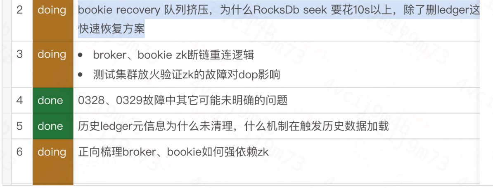

## 4.9 删除数据导致bookie读写影响
原因：删除ledger时，主动触发ledger compaction导致。
解法：社区解法，去掉主动触发compaction
RocksDB查询慢优化：https://kunpeng.xiaojukeji.com/view/revision/3588893

手动compact为什么会影响写
https://cooper.didichuxing.com/docs/document/2200037890958
https://cooper.didichuxing.com/docs2/document/2201895807318
## 4.10Bookie的线上问题


# 5Dop Broker专项优化

## 5.1 启动和关闭

**启动流程**

* 加载配置：Pulsar Broker启动时首先加载配置文件（如broker.conf），配置文件包含了各种关键配置参数，例如ZooKeeper地址、Bookkeeper地址、服务端口、缓存大小等​​。
* 启动服务：
  * 启动网络服务：启动Netty服务，监听配置的端口，等待客户端连接。
  * 加载Protocol Handler
  * 启动后台任务：启动各种后台任务，如负载均衡、统计收集、清理任务等。
* 初始化ZooKeeper客户端，将自己注册到ZooKeeper，告知其他Broker和客户端
* 进入运行状态，Broker开始接收和处理来自客户端的连接和请求

**关闭流程**

* 停止接受新请求：
  * 关闭监听端口：停止Netty服务，拒绝新的客户端连接请求。
* 清理资源：停止后台任务，释放内存、网络等资源。
* 关闭Protocol Handler：关闭所有协议处理器，确保没有未处理的请求。
* 从ZooKeeper注销：将自己从ZooKeeper中注销
* 持久化状态：保存当前的服务状态，确保在下次启动时能够恢复。
* 断开连接：
  * 关闭ZooKeeper连接
  * 关闭与BookKeeper的连接
* 完成所有资源释放和状态保存后，退出进程。
## 5.2 cache miss的全链路优化
从缓存miss低开始讲，优化了bug、cproxy bug，最后缓存命中率达到98%；然后是遇到为cache miss导致 1个集群雪崩的故障

Broker缓存的作用：实时写缓存，加速实时读。
缓存清除的方式主要有3种：
* 时间策略：过期，最长1小时
* 容量策略：达到阈值，单机最大2G
* 异常策略：如果订阅的某个分区落后太多（默认1W条），会清空该分区缓存
* 被动：上线重启

1 问题：缓存命中率低

* 当前Dop Broker缓存虽然设置了合理的时间和容量，但缓存命中率仍然偏低，部分集群的命中率甚至只有60%左右。主要表现包括：
* 缓存容量很低：部分集群几乎没有缓存容量，导致数据频繁被驱逐。
* 多消费场景下命中率更低：特别是低级别消费模式（LowLevel），缓存命中率显著下降，如Map集群中的情况。

2 如何发现问题
* 监控观察：低缓存命中率观察 

3 优化了什么
* 根本原因：
	* Lowlevel消费的光标不被视为活跃：导致不缓存LowLevel的消费数据。
	* Pulsar 2.8.2版本的bug：所有消费的进度没有实时更新到缓存进度，导致默认100ms就驱逐了缓存。
	  * 原意是为了优化broker缓存行为，减少缓存驱逐任务的高开销，但造成了失效。
* 优化点：
	* 修复了LowLevel消费导致的光标不活跃问题，确保所有消费模式的数据都能被正确缓存。
	* Pulsar bug修复，更新了Pulsar中缓存驱逐策略相关的代码，具体包括：
		* 添加缓存驱逐策略：基于最慢的markDeletedPosition来驱逐缓存数据。
		* 支持动态更新缓存配置：增强了缓存配置的灵活性。
		* 修复缓存驱逐问题：解决了活跃光标读取的缓存数据驱逐问题。
	* 提高缓存容量和调整驱逐策略：
		* 增加缓存容量：将缓存容量调整为JVM直接内存的20%。
		* 优化缓存驱逐频率：降低了缓存驱逐的频率和阈值，减少了缓存数据的无效驱逐。

4 优化的效果

* 缓存命中率提高：实时读取99%
* 系统性能提升：优化后的缓存策略减少了不必要的磁盘IO，提升了读效率
* 降低资源消耗：通过更合理的缓存管理和容量配置，减少了不必要的资源消耗，提升了稳定性


**第二版从复盘深度优化：**
1 问题

背景： MQ集群在早高峰流量上涨，发生大量写入超时，Bookie容量过载，导致整个Broker集群OOM雪崩。
现象：Bookie写请求耗时变大，读写队列开始积压

* OOM的原因：
  * Bookie写请求耗时变大，Broker就会堆积写请求在内存。
  * 业务写请求超时，触发业务重试，流量上涨约6倍，击垮MQ集群。
* 写耗时大的原因：
  * Broker写请求增加，Bookie层的写缓存写满，强制刷盘，刷盘时间长导致写请求超时
  * 刷盘时间长的原因是HDD盘出现随机读写，性能恶化。
* 产生读盘的原因是什么
  * 读请求：Broker层因容量满，发生缓存清理，读数据发生cache miss，读请求达到Bookie，读磁盘 （读miss的量增长到60M/s,速率达到1200）
  * 正向梳理cache miss的场景（忽视了monitor组件）


**在梳理所有缓存miss的场景中发现的优化**

1 如何发现

* 监控数据：Bookkeeper的读请求频率高
* 日志分析，实时消费，仍然存在大量的缓存未命中日志
* 实时消费场景：缓存命中率无法达到100%，周期性有下降到98%。
  * 无论是实时消费（如kedis-hna）还是延迟消费（如level3-hna），都出现了缓存命中率低下的问题
* 梳理可能调用读请求的组件：消费、监控、console、查问题
  * 分析后，发现是在启用了monitor功能后，读请求数量大幅增加
* 为什么一开始没发现？
	* 新架构的量不多，读盘效应不明显。等到分区数多的时候，才暴露出来。 

2 优化了什么
最大的原因：

* 监控系统高频调用：monitor系统每分钟进行高频次的订阅延迟检查，导致大量缓存数据被无效地驱逐和重新加载（10s改成1分钟）
	* index -> Position -> Message，获取到时间来计算延迟

优化点：
* 调整监控机制：减少监控系统的读取频率，避免不必要的高频读取操作，减轻缓存压力。例如，使用MD位置作为延迟检查的位置，统一消费进度，从而减少对bookie的读取请求
* 优化缓存策略：改进缓存驱逐策略，基于最慢的markDeletedPosition来驱逐缓存数据，确保缓存数据能够更有效地保留和利用。

3 解决方案

* 重新评估在有read cache miss的情况下读HDD盘，bookie最大写瓶颈
* ledger盘换SSD，降低cache miss所带来的影响
* 降低read cache miss的场景
  * history read的场景不多，而且批量读，会命中缓存，理论上造成的cache miss数量并不多
  * 现有read cache miss的场景基本都是monitor在调用查询数据接口用来配置积压报警
    * 理论上如果cache up read，cache miss也不会非常频繁。消费慢、flink消费或不消费的订阅可能会造成read miss。可以清理一波不消费的订阅和提高消费慢的订阅的消费速度

4 效果

* 缓存命中率提升：接近100%
* 性能提升：Bookie读请求QPS（每秒查询数）下降了50%，读盘QPS下降了80%，提升稳定性
* 监控Monitor系统对缓存的影响显著减少：优化后的监控系统减少了对缓存的干扰

参考：

* [dop缓存原理](https://cooper.didichuxing.com/docs/document/2199597020871)
* [cache miss优化方案](https://cooper.didichuxing.com/docs/document/2201002217933)

## 5.3自动负载均衡优化

负载均衡是为了确保每个Broker负载均衡，避免过载。通过卸载Bundle来实现。

1 问题
* 卸载用ThresholdShedder，根据集群利用率是否超过平均负载的10%均衡
* 放置用LeastLongTermMessageRate，通过Broker的长期消息处理速率来决定如何分配
	* 问题：负载均衡耗时长（10小时，400+次卸载），频繁卸载导致生产延迟毛刺。
	* 定位：选择候选Broker数量少，效果差。

2 优化了什么
*  放置用LeastResourceUsageWithWeight，选择负载最小的Broker，统一卸载和分配标准，实现最优的资源分配。

3 优化后的效果是什么
* 减少了卸载频率 1个数量级，降低了延迟毛刺。
* 提高了均衡效率，负载分布更均匀，更可控，最高最低负载不超过15%，而且可控。

4 现在最新算法是什么
* 卸载：
	* UniformLoadShedder通过BPS和QPS来识别流量负载最大的Broker，更合理地计算需要卸载的流量，
	* TransferShedder：在高负载和低负载broker之间转移bundle，预分配broker，更平滑
* 放置：有3个LeastLongTermMessageRate、LeastResourceUsageWithWeight、RoundRobin算法
* 新方向：以前bundle的卸载和分配主要由leader broker负责，而在新的去中心化中，leader负责卸载，各个broker负责分配

文件名称：[Broker 负载均衡算法改进](https://cooper.didichuxing.com/docs/document/2199635540617)


## 5.4 CPU：Broker 资源消耗
### 1、producer批量发送的问题
问题背景
在优化方案2中，Java客户端的生产者（Producer）即使在没有处理消息时也会消耗大量的CPU资源，特别是在使用多个生产者的情况下。这种不必要的CPU消耗问题在#11100中被观察到，主要是因为批量定时器（batch timer）无论是否有消息待处理，都会定时执行。

**优化点**
1改进批量消息发送时机
调整批量定时器的触发条件：
* 只有在有消息待发送或刚发送过消息时，才会调度批量定时器：这样可以避免在没有消息时频繁触发定时器，减少不必要的CPU消耗。
实现细节：

当消息加入到batchMessageContainer时，如果没有当前的批量刷新任务且生产者处于READY状态，则会调度一次批量刷新任务。
只有在批量刷新任务负责发送消息时，才会调度另一个批量刷新任务。

2 改进状态检查和定时器管理
* 优化消息批量发送的状态检查：
* 跳过非READY状态生产者的消息批量发送：如果生产者未处于READY状态，批量消息发送将被跳过，但需要确保待发送的消息仍然能因sendTimeout超时而失败。

* 保持一致的时间管理：
	* 记录lastBatchSendNanoTime：只有在自上次发送时间已超过BatchingMaxPublishDelayMicros设定的最大发布延迟时间时，才会刷新批量消息容器。
	* 避免竞争条件：定时器任务的调度和取消只在同步块内进行，确保操作的一致性，避免竞争条件。唯一可能的竞争条件是定时器在启动时被取消，但这只会导致不必要的发送任务被跳过，影响很小。

火焰图

方案2：Dop改进后方案改进点：换用本地线程池、改用`scheduleFixedDelay`性能比原生方案好，但是无法缓解存在大量分片的集群CPU消耗。不足：Binlog集群，Producer 批量发送的定时任务导致CPU占用25%+


### 2、admin 调用占用cpu多
排查思路：火焰图
### 3、PProxy优化，优化规模
架构优化
### 4、cproxy优化，动态下发 vs 拆分
架构优化
### 5、client 3.0，优化性能、丰富功能
架构优化
client3.0 设计方案: https://cooper.didichuxing.com/docs/document/2199926453938


# 6技术：线上问题排查
难点和挑战：线上环境出问题，影响稳定性；业务用法复杂，系统复杂，定位问题需要综合能力。

## 6.1 内存：Broker OOM，堆内泄漏
* 简述：堆内内存上涨，报警
* 排查思路：top查看gc线程cpu占用高，jstat看Broker频繁FullGC，快照和内存都dump一份，用MAT分析，发现BKException占用多，查看调用链路，分析代码
* 原因：Monitor服务会定时查询topic的元数据，查询ledger的元数据遇到一个不存在的ledger meta信息，就会发生异常。异常时候LedgerManager并未把Set里的future移除，导致了泄漏。
* 解法：future异常时，需要处理好异常逻辑。thenRun改成了whenComplete
* 具体case：[Dop Broker频繁FullGC分析内存泄漏](https://cooper.didichuxing.com/docs/document/2199831271685)
	* 为什么topic的元数据存在某个ledgerid，但ledger meta不存在？
		* 简单来讲，ledger元数据先创建后，如果在bookie add entry超时会删除对应的ledger id。这个操作不是原子的，会造成topic的元数据里有这个ledger，但是实际上ledger id并不存在。

## 6.2内存：Bookie OOM, 堆内泄漏
* 简述：bookie FullGC报警，cpu idle下降， 造成写消息失败，
* 排查思路：dump出一份分析
* 原因：发现masterKeyCache只增不减，masterKey 在 Ledger 的创建、写入、恢复使用，用于验证。
* 解法：分析代码，删除ledger的时候，未删除这个ledger的key；IoT场景设备数太多，ledger的个数特别多，导致内存占用高
* 具体case: [2022-10-01 iot pulsar 存储层OOM故障复盘](https://cooper.didichuxing.com/docs/document/2199792048744)
	* 2个PR: https://github.com/apache/bookkeeper/pull/1949
	* https://github.com/apache/bookkeeper/pull/3522

## 6.3 内存：cproxy堆外泄漏
* 描述：broker的堆外内存偶发持续上涨
* 排查思路：
	* dump一份内存，消息的引用多，初步判断是消息泄漏了
	* netty堆外内存泄漏工具，未检查出来
	* 监控观察上涨和两个有关系，2个重要指标：①消费有异常；②broker bundle漂移。分析代码。
* 原因：消费有1s超时，超时后，如果broker再把数据读取推送过来，Proxy侧的completable future没有捕获这个异常，未释放这个消息的引用。
* 解法：降发生（修复bug）、早发现（报警）、快止损（重启）
* 具体case：[2023/03 dop broker fetch失败导致内存泄露问题排查](https://cooper.didichuxing.com/docs/document/2199994221114) 

## 6.4 内存：broker物理上涨
* 描述：容器内存持续上涨，内存满后，cgroup kill进程，影响生产和消费
* 排查思路：实际使用的堆内+堆外远小于进程实际内存，暂时排除堆内和堆外的内存溢出问题。Java线程栈2000+，栈占用内存约2G，怀疑有可能是进程申请后并未真正归还给操作系统，怀疑是内存分配的问题
	* 排查1：设置 MALLOC_ARENA_MAX=1 通过限制每个线程只能使用一个 arena 来减少内存使用量，测试发现申请和释放一致。
	* 排查2：更换jemalloc 和 glibc，发现cpu一致，内存平稳
		* 默认情况下，GLIBC 会为每个线程分配多个 arena（通常是8个），以减少锁竞争
* 原因：Cproxy使用线程过多，导致glibc在分配AREAN区的时候分配太多，并且glibc并没有做良好的内存管理，导致进程使用内存占用过大。
	* jemalloc内存分配器，解决传统内存分配器在并发和碎片化上的问题
* 解法：降发生（修复bug）、早发现（报警）、快止损（重启）
* 具体case：
	* 排查文档：https://cooper.didichuxing.com/docs/document/2201374796896
	* 2022/4/12		 Map集群单台brokerOOM	代码bug	重启	broker OOM 导致发送异常	无	https://cooper.didichuxing.com/docs/document/2199563764520	OOM原因未查明


## 6.5网络：连接数过多
* 简述：socket连接数超过15W报警，查看pproxy cpu idle低，集群有风险
* 排查思路：找出连接数多的ip，查看流量内容，找到业务方
* 原因：sdk producer用法不正确，启动过多的producer实例
* 解法：快止损（回滚业务代码）、降发生（增加socket限流）
* 具体case：[pproxy连接数过多报警](https://cooper.didichuxing.com/docs/document/2199734711395)

查看网络连接，哪些ip来连接：
```
port=9713
netstat -aon | grep ":${port} " | awk '{print $5}' | cut -d: -f1 | sort | uniq -c | sort -nr | less

tcpdump查看网络的流量详情： root执行
ip=10.197.14.12
tcpdump -A -l -s0 host ${ip}|tee cap.txt
```
还遇到过一个例子：
* 简述：tcp timewait超过10W报警
* 排查思路：找那个ip影响，统计个数
	* 都有：server问题
	* 少量IP：猜测是业务频繁创建连接
* 原因：thrift server
* 解法：①调大thrift server 内存缓存 

下面这个不典型，忽略: [DNS Cache故障] (https://cooper.didichuxing.com/docs2/document/2201421524380)

## 6.6 并发导致单分区不消费
* 简述：2个分区不消费，日志报错Exclusive consumer已经被创建了。
* 排查思路：查看consumer被创建和清理的地方，猜想是并发问题。实际有2个地方
	* 配置变更会重新创建consumer，先关闭后创建。逻辑：先逐个consumuer关闭，再批量清理group订阅的所有topic。
	* 定时任务会检查，把group关联的topic consumer创建。
	* 找到事故点，分析代码
* 原因：配置变更关闭consumer不是原子的，分了2步骤，会导致线程2刚刚创建了consumer，放入了map；会被线程1给清理掉，但是这个时候consumer未正常关闭。
* 解法：优化清理逻辑
	* 验证：dump堆，找到这个异常的consumer
* 经验：资源清理注意并发问题。
* case：[2023-11-14 Dop 部分分区不消费](https://cooper.didichuxing.com/docs/document/2201195421600)

Pulsar推消息的原理：
* 1个Topic 有多个Subscription
* 1个Subcription 有1个dispatcher
* 1个dispatcher可以有多个consumer。
* dispatcher关闭的本质是断连所有的consumer。

## 6.7线程：并发导致pproxy启动不了
* 简述：网络DGW负载均衡服务变更，导致broker重启，pproxy重启卡住
* 排查思路：日志排查，分析代码
* 原因：PProxy启动时会创建Producer，等待创建的结果返回在启动。但是这个卡主了
	* 当时的批量的broker重启，这些发送的请求等待返回时，会遇到client和broker断连的情况，
		* 因为broker在重启，断连会触发请求清理，这里的清理不是原子的。
		* 它是先把future异常返回，最后清理整个map。
		* 这2个步骤间是可能有新的请求加入到map。新的请求就不会完成，导致卡住。
* 总结：并发导致请求的future未能完成就在Map中被清理，导致线程卡住。
* 解法：优化断连清理逻辑，优化启动PProxy
* case:[dgw变更导致binlog集群异常](https://cooper.didichuxing.com/docs2/document/2202272124688)

## 6.8线程隔离：服务发现性能退化
* 描述：SDK连接SD超时，服务发现模块主要处理3类请求，2类是读zk元数据、1类获取broker上topic的 分区信息。现象是获取zk元数据的信息慢
* 排查思路：耗时长，从请求量和每个请求耗时入手，发现依赖zk的耗时短、依赖查询broker分区的超时。
	* 怀疑有相互影响，从代码入手，发现Netty线程模型的work group存在性能拐点，
	* 原因是查询broker分区的请求虽然是用额外线程池并发查询的，但是work group会等这个结果，始终占用这个线程。一旦线程被占用，其它请求就无法处理。
* 原因：多种接口线程池不隔离导致性能恶化
* 解法：
	* 降发生（故障隔离、超时失败、SDK非阻塞）
	* 早发现（报警）
	* 快止损（主动降级、扩容）
* 经验：依赖外部服务的接口考虑弱依赖和隔离
* case：[1127 sd性能恶化](https://cooper.didichuxing.com/docs2/document/2201330807301)，造成部分业务受损，优化方案见[这里](https://cooper.didichuxing.com/docs2/document/2201336059395)，需要对每个case总结一个简要的分析文档

## 6.9磁盘：IO使用率毛刺
* 简述：读BK延迟大于秒级3s，为什么读这么慢？①缓存被击穿；②单hdd盘io高
* 排查思路：如何寻找读IO消耗大的任务？使用iotop直接查找
* 原因：定位到是compaction 造成的，虽然有限速和限制GC时间，但是磁盘IO高。
	* 原因是限制写，未限制预读，Compaction的时候，会scan所有entry log里的Entry header，如果缓冲区没有，会触发磁盘的读取，并且有预读。预读导致了IO util 过高。（case链接：[2023-05-08 Bookie读请求处理耗时超过2s](https://cooper.didichuxing.com/docs/document/2200071920494）)
	* 仔细来讲， compaction限速仅适用于未被删除的Entry。 但实际中，一个EntryLog文件中超过90%的Entry已被删除，所以读取量就会很大，header不大，但是有预读，会导致磁盘IO高。
* 解法：限制写同时也限制读
* 过程：对一个EntryLog进行Compaction时，会从头到尾扫描每个Ledger Entry的元数据。如果一个Ledger Entry没有被删除，将读取该Entry的数据并写入一个新的EntryLog文件。（这个entry本质指的是ledger）

下面是iotop的效果图

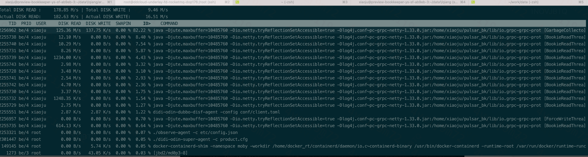
## 6.10死锁问题？
排查思路：打出栈，分析代码

metadata稳定性PR：https://cooper.didichuxing.com/docs2/document/2202065784265
[fix][broker] Fix the broker shutdown issue after Zookeeper node crashed #17909：https://github.com/apache/pulsar/pull/17909

Session 超时产生的过程：Server在会话超时时间内未能接收到Client的任何消息后，将会认为会话已经超时。Server会清理该Session有关的资源。待Client下次与Server通信时，会收到SessionExpiredException，开始重连


# 线程case的案例润色
## 6.1 case 1 zk漂移影响集群生产
文件名称：2024-03-28 &29 zk漂移dop集群生产消费异常
链接：https://cooper.didichuxing.com/docs2/document/2202013969630
密码：603439

zk漂移导致集群生产消费异常case梳理
整个过程：
* zk follower漂移，导致broker shutdown，被强制关闭
	* zk session 过期策略：shutdown -> reconnect
* bundle漂移被新的broker接管，新broker尝试新建producer，发现ledger未关闭，发起fence请求
* broker的fence请求在bookie侧处理失败，返回recovery异常
* broker发起重试，导致fence读请求不断积压在bookie的高优先级线程池，产生读饥饿。
* 因此，某些topic的某些分区一直无法自动恢复。

根因：
* fence请求处理慢，查询rocksdb慢，topic无法恢复，影响生产和消费。

Broker处理生产请求
* PProxy: 1个生产消息，一次产生一次producer请求
* PProxy: 和Broker建立连接后，建连Producer，重试直到成功
* Broker: 处理新建Producer请求
* Broker: 加载topic，发现ledger状态异常，发起fence请求
	* 读ledger的LAC （这个fence请求未成功，导致无法恢复），处理速度慢，16s处理1个
	* 更新ledger的元数据，关闭ledger
* Broker: 新开一个ledger，加载topic成功
Bookie: 处理ledger的LAC请求

## 6.2level1集群雪崩
背景： MQ集群在早高峰流量上涨，发生大量写入超时，Bookie容量过载，导致整个Broker集群OOM雪崩。
现象：Bookie写请求耗时变大，读写队列开始积压

* OOM的原因：
	* Bookie写请求耗时变大，Broker就会堆积写请求在内存。
	* 业务写请求超时，触发业务重试，流量上涨约6倍，击垮MQ集群。
* 写耗时大的原因：
	* Broker写请求增加，Bookie层的写缓存写满，强制刷盘，刷盘时间长导致写请求超时
	* 刷盘时间长的原因是HDD盘出现随机读写，性能恶化。
* 产生读盘的原因是什么
	* 读请求：Broker层因容量满，发生缓存清理，读数据发生cache miss，读请求达到Bookie，读磁盘 （读miss的量增长到60M/s,速率达到1200）
	* 正向梳理cache miss的场景

解决方案
* 重新评估在有read cache miss的情况下读HDD盘，bookie最大写瓶颈
* ledger盘换SSD，降低cache miss所带来的影响
* 降低read cache miss的场景
	* history read的场景不多，而且批量读，会命中缓存，理论上造成的cache miss数量并不多
	* 现有read cache miss的场景基本都是monitor在调用查询数据接口用来配置积压报警
		* 替换现有积压报警的实现方案，使用prometheus的数据采集配置报警
		* 理论上如果cache up read，cache miss也不会非常频繁。消费慢、flink消费或不消费的订阅可能会造成read miss。可以清理一波不消费的订阅和提高消费慢的订阅的消费速度
## 6.3 循环延迟导致雪崩？
定位困难


# 延迟队列？

# 行业视野 


## Pulsar的优势和Kafka（RMQ）的劣势

* 功能和性能都差不多，90%的业务场景3个都能同时满足
* 架构和性能层面上，Pulsar的架构设计比Kafka更符合当前云原生架构，主要解决Kafka当前的一些痛点问题，比如集群扩缩容慢、分区迁移需要Rebalance、无法支持超多分区等。

Pulsar的劣势和Kafka（RMQ）的优势

* Pulsar的稳定性不如kafka\RMQ，生态不够丰富


消息队列的发展趋势：上层的需求变化和下层的架构演进。

- 从需求发展看，发展是： **消息 -> 流 -\> 消息和流融合**。
- 从架构发展看，发展是： **单机 -> 分布式 -\> 云原生/Serverless**。
- 本质：如何降低成本和吸引客户。

在弹性、成本的驱动下，消息队列的架构往云原生/Serverless方向演变

* 用云上的弹性计算、存储等基础设施去实现架构的Serverless
* 按需使用、按量付费，最终达到少运维、低成本。
* 出现了 **计算存储分离、分层存储、多租户、弹性计算等概念**。


| 特性             | Kafka                                        | Pulsar                                   | RocketMQ                                                  |
| ---------------- | -------------------------------------------- | ---------------------------------------- | --------------------------------------------------------- |
| **设计和定位**   | 大数据领域的日志流处理，强调高吞吐量和低延迟 | 流计算领域，又扩展到消息队列，强调云原生 | 在线业务的消息场景，强调高可用                            |
| **架构特点**     | 一体的分布式系统，存储是zk和磁盘             | 计算存储分离架构，存储是BookKeeper和zk   | 一体的分布式系统，支持高并发，存储是磁盘、不依赖zk        |
| **使用场景**     | 大数据流处理场景，如日志收集和分析           | 消息和流混合场景                         | 大规模在线业务场景                                        |
| **未来发展趋势** | 架构优化（去ZK），消息和流融合，云原生支持   | 提升稳定性，优化云原生架构，丰富功能     | 功能扩展（大数据流处理场景），架构优化，5.x往存算分离发展 |


## RMQ 5.x
## Kafka
## AutoMQ

# 参考
```
博客，bookie读写指标和概述:https://medium.com/splunk-maas/apache-bookkeeper-observability-part-5-read-metrics-in-detail-2f53acac3f7e
龙哥的生命周期分析：https://www.cnblogs.com/tengxunzhongjianjian/articles/17237167.html
```