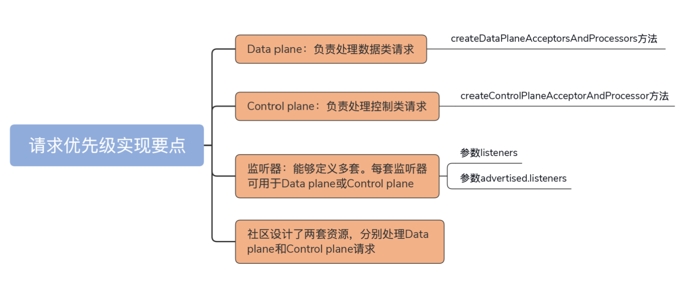

# Kafka调优

## 1案例1

在 Kafka 中，处理请求是不区分优先级的，Kafka 对待所有请求都一视同仁。这种绝对公平的策略有时候是有问题的。

> Kafka topic是如何设计的，同一类UUT是属于同一个topic的

案例1：有一个查异常的场景，搞清楚为什么会Producer超时发送？如何快速地处理异常，如何快速地失败重试？让我搞明白整个请求流程。


我们集群中曾创建过一个单分区2个副本的UUT主题，集群中的 Broker A 机器保存了分区的 Leader 副本，Broker B 保存了 Follower 副本。运行正常。有一天，后来新来了10台同类型的UUT，这10台UUT被同时调度在同一个时刻，进行测试，导致写日志流量激增。导致 Broker A 瞬间积压了大量的未处理 PRODUCE 请求。我们写Producer的配置ack = all。

> 怎么发现的？TotalTimeMs：Request 被处理的总时间超过了3s。同事在这个期间，执行了一次 Preferred Leader 选举，将 Broker B 显式地调整成了 Leader。日志中出现了Broker A抛出的超时异常，导致Producer程序异常，导致这次测试失败。

### 分析

分析这个问题发生的原因：

- Leader/Follower 的角色转换，导致无法完成副本间同步，所以这些请求无法被成功处
  理，最终 Broker A 抛出超时异常，返回给 Producer 程序。
- 这些未完成的 PRODUCE 请求会一直保存在 Broker A 上的 Purgatory 缓存，不断重试，直到最后超时返回。

优化的点：

- Broker端：
  - 增加io线程数，临时加大处理能力
  - 增加主题分区


## 案例2

案例1：发现删除topic比较慢。怎么分析？（这不就掉坑里去了吗？讲不清楚）

### 分析

删除topic的时候，Kafka Controller会向topic所在的broker发送 StopRelica请求。因为这个请求没有被及时处理，所以delete操作会一直hang。观察监控发现，卡住的地方都是broker消息大量积压的broker上，因为默认情况下，对数据类和控制类请求不做区分。

> 需要搞清楚Kafka对于请求是如何处理的，Reactor模式是如何实现的？读源码

优化的点：

- 开启数据和控制类请求区分

```java
listener.security.protocol.map=CONTROLLER:PLAINTEXT,INTERNAL:PLAINTEXT,EXTERNA
listeners=CONTROLLER://192.1.1.8:9091,INTERNAL://192.1.1.8:9092,EXTERNAL://10.1
control.plane.listener.name=CONTROLLER
```



几个重要的监控指标：

- RequestsPerSec：每秒处理的 Request 数，用来评估 Broker 的繁忙状态。
- **RequestQueueTimeMs：计算 Request 在 Request 队列中的平均等候时间，单位是毫秒。倘若 Request 在队列的等待时间过长，你通常需要增加后端 I/O 线程的数量，来加快队列中 Request 的拿取速度。**（项目经验：sina发现3台broker的这个值过高，原因是它有一个热点topic，在CPU和负载还可以的情况下，提升了一倍IO线程数=8，加大处理能力；这个方案还可以应对突发流量，在流量开始激增的时候，通过监控拿到这个指标，临时加大IO线程数。最终的方法就是reassign 的分区的leader，重新平衡一下。这个问题，同样在EMC也遇到过，原因是topic申请分区太少，2个分区，但是数据量相对而言，特别大，导致晚上的时候发给这2个brokerr的请求，在队列的等待时间变长。）
- LocalTimeMs：计算 Request 实际被处理的时间，单位是毫秒。一旦定位到这个监控项的值很大，你就需要进一步研究 Request 被处理的逻辑了，具体分析到底是哪一步消耗了过多的时间。
- RemoteTimeMs：Kafka 的读写请求（PRODUCE 请求和 FETCH 请求）逻辑涉及等待其他 Broker 操作的步骤。RemoteTimeMs 计算的，就是等待其他 Broker 完成指定逻辑的时间。因为等待的是其他 Broker，因此被称为 Remote Time。这个监控项非常重要！Kafka 生产环境中设置 acks=all 的 Producer 程序发送消息延时高的主要原因，往往就是 Remote Time 高。因此，如果你也碰到了这样的问题，不妨先定位一下Remote Time 是不是瓶颈。（**项目经验：某些topic的Producer的延迟在ack=all的情况下特别高，RemoteTimeMs达到了1s以上，副本broker ping延迟查过了500ms，网络交换机出现了问题，更换交换机**）
- TotalTimeMs：计算 Request 被处理的完整流程时间。这是最实用的监控指标，没有之一！毕竟，我们通常都是根据 TotalTimeMs 来判断系统是否出现问题的。一旦发现了问题，我们才会利用前面的几个监控项进一步定位问题的原因。