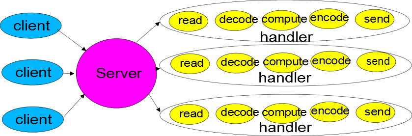

## 0.Linux 5种IO模型
1. 阻塞I/O（blocking I/O）
2. 非阻塞I/O （nonblocking I/O）
3. I/O复用(select 和poll) （I/O multiplexing）
4. 信号驱动I/O （signal driven I/O (SIGIO)）
5. 异步I/O （asynchronous I/O (the POSIX aio_functions)）

前面4种属于同步IO，异步IO需要操作系统支持。
- 阻塞IO，非阻塞IO是系统调用接口层级的
- 同步IO，异步IO是系统内核级别的。
- 用户点餐的例子：要不要排队点餐？饭菜好了，要不要自己去取？


一个 I/O 操作分为两步： 
1. 发起 I/O 请求：阻塞非阻塞-- 应用程序发起的
2. 实际 I/O 操作：同步 异步--OS

### 0.1 阻塞IO
1. 阶段1：等待数据就绪。网络 I/O 的情况就是等待远端数据陆续抵达；磁盘I/O的情况就是等待磁盘数据从磁盘上读取到内核态内存中。
2. 阶段2：数据拷贝。出于系统安全,用户态的程序没有权限直接读取内核态内存,因此内核负责把内核态内存中的数据拷贝一份到用户态内存中。


recvfrom 可以从java程序中理解调用了read()

- 用户态：用户启动的 cs CPU
- 系统态：OS启动的程序
- 拷贝数据，由系统态拷贝到用户态的内存。

### 0.2 非阻塞IO


1. socket 设置为 NONBLOCK（非阻塞）就是告诉内核，当I/O 请求操作无法完成时，返回一个错误码(EWOULDBLOCK) ，这样请求线程就不会阻塞
2. 请求线程将不断的请求数据是否已经准备好，如果没有准备好，继续请求，直到数据准备好为止。整个 I/O 请求的过程中，虽然用户线程每次发起 I/O 请求后可以立即返回，但是为了等到数据，仍需要不断地轮询、重复请求，消耗了大量的 CPU 的资源
3. 数据准备好了，从内核拷贝到用户空间，注意，这里copy数据的过程仍然要阻塞请求线程

- 处理并发，调用系统调用的时候，不受阻塞，但是有返回结果 数据是否准备好。

### 0.3 IO多路复用


1. 多路复用是指单个线程就可以同时处理多个网络连接的IO。原理就是select/epoll会不断的轮询所负责的socket，以注册和监听为基础，当某个socket有数据到达了，就通知用户线程
2. 用户线程会阻塞在select方法上

- poll和epoll的区别，是epoll 只查找注册的感兴趣连接的读写事件，poll每次都查找所有的连接事件
- 从图中看，这种模型会有两次系统调用(select,recvfrom)，它适合连接数多的情况，可以同时处理多个连接请求
- 实际中，每一个socket连接，一般都设置成为non-blocking，但是，整个用户的process是一直被select这个函数block，而不是被socket IO给block。

> 用户调用select是阻塞的，java是以epoll的底层的。

### 0.4  信号驱动I/O

- 信号驱动I/O：开启套接口信号驱动 I/O 功能，通过系统的调用 sigaction 执行信号处理函数；当数据准备就绪时，就位该进程生成一个 SIGIO 新型号，通过信号回调通知应用程调用 recvfrom 读取数据


### 0.5异步I/O


- 异步I/O：告知内核启动某个操作，并让内核在整个操作完成后（包括将数据从内核复制到用户缓冲区）通知应用程序；与信号驱动模型的区别在于信号驱动 I/O 由内核通知何时可以开始一个 I/O 操作；异步 I/O 由内核通知 I/O 操作何时完成

1. 调用 aio_read 函数，告诉内核描述字，缓冲区指针，缓冲区大小，文件偏移以及通知的方式（需要内核的支持，2.6+）
2. 整个数据准备和拷贝过程，用户线程都没有阻塞
3. 数据拷贝完成后，内核会通知用户程序。用户程序则可以直接使用了

第1、2步都不会等。Pool acter模型是异步IO


### 总结
同步和异步IO： 描述的是用户线程与内核的交互方式：
- 同步是指用户线程发起 I/O 请求后需要等待内核 I/O 操作完成后才能继续执行；
- 异步是指用户线程发起 I/O 请求后仍继续执行，当内核 I/O 操作完成后会通知用户线程，或者调用用户线程注册的回调函数。

阻塞和非阻塞：描述的是用户线程请求内核 I/O 操作的方式：
- 阻塞是指 I/O 操作需要彻底完成后才返回到用户空间；
- 非阻塞是指 I/O 操作被调用后立即返回给用户一个状态值，无需等到 I/O 操作彻底完成。

### 补充
> Java NIO（多路复用IO（IO Multiplexing）：即经典的Reactor设计模式，有时也称为**异步阻塞IO**）

| Java IO | NIO        |
| ------- | ---------- |
| 面向流  | 面向缓冲区 |
| 阻塞IO  | 非阻塞IO   |
| 无      | Selector   |


---
## 1.NIO核心
最核心的概念：Channel、Buffer、Selector。

- Buffer 缓冲区，本质上就是一块内存区。（这块内存被NIO Buffer包裹起来，对外提供一系列的读写方便开发的接口。）

- Channel 通道，是读写Buffer的入口。
  - 从通道进行数据读取 ：创建一个缓冲区，然后请求通道读取数据。
  - 从通道进行数据写入 ：创建一个缓冲区，填充数据，并要求通道写入数据。

- Selector 选择器, 多路复用器。检查多个 Channel（通道）的状态是否处于可读、可写事件。
- 工作原理：Selector负责监听外部事件，Channel把自己注册到Selector，并告诉自己感兴趣的事件。但外部有事件来的时候，就会去轮询Channel，找到合适的Channel来处理。

数据读取和写入操作图示：


### 1.1Channel & Buffer
1. channel理解成建立连接的那根管道
2. Buffer 理解成接入管道的那段水管
3. 通道涵盖了UDP 和 TCP 网络IO，以及文件IO
4. Buffer的实现基本涵盖了所有的类型
5. Netty自己又实现了更轻量级的ByteBuf
6. FileChannel的transferTo和transferFrom使用的zero_copy，其他的目前不支持


### 1.2Selector
- Channel 需要向`Selector`注册监听的事件
- 调用` select `方法，这是个阻塞方法

1. java6之前是基于`poll`实现的,java6之后是基于`epoll`实现的。
2. Netty是基于边界的并发机制，调用lib native库，堆外内存的需要自己管理，(Spark 1.6 NIO、Netty4的可选)，Java是基于垂直的并发的并发机制。
1. Selector允许单线程处理多个 Channel
1. Oracle jdk会自动选择合适的Selector。 如果想设置特定的Selector，可以属性：`-Djava.nio.channels.spi.SelectorProvider=sun.nio.ch.EPollSelectorProvider`
1. 参考： [讲 selector 的用法](http://ifeve.com/selectors/)

> FileChannel 不支持 非阻塞; 网络IO支持非阻塞。


## 3.Reactor网络模型
### 3.0 基本模型
每一个handler都是在自己的线程中启动和运行，如常用的线程池的方式来处理请求。


Reactor也可以称作反应器模式，它有以下几个特点：

①　Reactor模式中会通过分配适当的handler(处理程序)来响应IO事件

②　每个handler执行非阻塞的操作

③　通过将handler绑定到事件进行管理，类似与AWT addActionListener 添加事件监听；

### 3.1 单线程


- Acceptor ：只建立连接
- Reactor线程：只有一个，负责对worker进行处理。

### 3.2  多线程


- Acceptor1个，只接受连接
- Reactor线程1个：只处理IO请求
- Worker线程池：专门用于处理**非IO操作**。

### 3.3 主从


- Acceptor：变成了mainReactor线程，专门负责建立连接。--bossGroup NioEventLoopGroup
- subReactor 线程：一个或者多个，专门处理IO请求。--workerGroup NioEventLoopGroup
- worker 线程池：专门处理**非IO请求** -- 具体实现上，和subReactor在同一个线程池中。
> Netty的线程模型基于主从Reactor多线程，借用了MainReactor和SubReactor的结构，但是实际实现上，SubReactor和Worker线程在同一个线程池中：
>
> 利用主从Reactor 线程模型，可以根据IO和CPU计算的需要，合理地调节subReactor和worker线程数量。因此，在Netty的官方demo中，推荐使用该线程模型。


- bossGroup用于处理TCP连接。获得其中一个线程作为MainReactor，专门处理端口的accept事件
  - 接收客户端TCP连接初始化Channel参数
  - 将链路状态变更时间通知给ChannelPipeline
- workerGroup用于处理I/O操作。被各个SubReactor和worker线程充分利用
  - 异步读取数据报发送事件到ChannelPipeline
  - 异步发送消息到通信对端，调用ChannelPipeline的消息发送接口
  - 执行系统调用Task、定时执行任务Task
- 通过调整线程池的线程个数、是否共享线程池等方式，Netty的Reactor模型可以在单线程、多线程和主从多线程之间切换
  - 单线程：一个线程需要执行处理所有的 accept、read、decode、process、encode、send 事件。对于高负载、高并发，并且对性能要求比较高的场景不适用。
  - **多线程**：一个 Acceptor 线程只负责监听客户端的连接，一个 NIO 线程池负责具体处理：accept、read、decode、process、encode、send 事件。满足绝大部分应用场景，**并发连接量不大**的时候没啥问题，但是遇到并发连接大的时候就可能会出现问题，成为性能瓶颈。
  - 主从多线程：**多线程模型无法满足你的需求的时候**
    - 从一个 主线程Main Reactor线程池中选择一个线程作为 Acceptor 线程，绑定监听端口，接收客户端连接的连接；
    - 其他线程负责后续的接入认证等工作。
    - 连接建立完成后，Sub Reactor线程池负责具体处理 I/O 读写

```java
		// 单线程
        EventLoopGroup eventLoopGroup = new NioEventLoopGroup(1);
        ServerBootstrap bootstrap = new ServerBootstrap();
        bootstrap.group(eventLoopGroup, eventLoopGroup);

        // 多线程
        EventLoopGroup bossGroup = new NioEventLoopGroup(1);
        EventLoopGroup workerGroup = new NioEventLoopGroup();
        bootstrap = new ServerBootstrap();
        bootstrap.group(bossGroup, workerGroup);

        // 主从多线程
        bossGroup = new NioEventLoopGroup();
        workerGroup = new NioEventLoopGroup();
        bootstrap = new ServerBootstrap();
        bootstrap.group(bossGroup, workerGroup);
        bootstrap.channel(NioServerSocketChannel.class);
        bootstrap.option(ChannelOption.SO_BACKLOG, 1024)
                .localAddress(Integer.parseInt("8080"))
                .childOption(ChannelOption.TCP_NODELAY, true)
                .childOption(ChannelOption.ALLOCATOR, new PooledByteBufAllocator(true));
        bootstrap.childHandler(new ChannelInitializer<SocketChannel>() {
            @Override
            protected void initChannel(SocketChannel ch) {
                // todo
            }
        });

        // 启动服务
        ChannelFuture f = bootstrap.bind().sync();
        f.channel().closeFuture().sync();
```

##### Netty线程模型最佳实践

1. 创建两个 NioEventLoopGroup 隔离 NIO Acceptor 和 NIO I/O
2. 尽量不在 ChannelHandler 中启动用户线程（用户线程是指的是在Reactor模式之外的业务线程）
3. 解码要放在 NIO 线程调用的解码 Handler 中进行，不要切换到用户线程中
4. 如果业务逻辑简单，没有阻塞、数据库操作、网络操作等，直接在 NIO 线程上完成业务逻辑而不要切换到用户线程
5. 如果业务逻辑复杂，则尽快释放 NIO 线程，交由用户业务线程处理

## 4.Netty
Netty是一个高性能、**异步事件驱动的NIO**框架，它提供了对TCP、UDP和文件传输的支持。
- 作为一个异步NIO框架，Netty的所有IO操作都是**异步非阻塞**的，通过`Future-Listener`机制，用户可以方便的主动获取或者通过通知机制获得IO操作结果


### 4.1主从多Reactor模型


- Netty 的线程模型基于主从多Reactor模型。通常由一个线程负责处理OP_ACCEPT事件，拥有 CPU 核数的两倍的IO线程处理读写事件。
- 一个通道的IO操作会绑定在一个IO线程中，而一个IO线程可以注册多个通道。
- 在一个网络通信中通常会包含网络数据读写，编码、解码、业务处理。默认情况下编码、解码等操作会在IO线程中运行，但也可以指定其他线程池。
- 通常业务处理会单独开启业务线程池，但也可以进一步细化，例如心跳包可以直接在IO线程中处理，而需要再转发给业务线程池，避免线程切换。
- 在一个IO线程中所有通道的事件是**串行处理**的。

> 事实上，Netty的线程模型并非固定不变，通过在启动辅助类中创建不同的EventLoopGroup实例并通过适当的参数配置，就可以支持上述三种Reactor线程模型。正是因为Netty 对Reactor线程模型的支持提供了灵活的定制能力，所以可以满足不同业务场景的性能诉求。

Netty架构按照Reactor模式设计和实现，它的服务端通信序列图如下：

- 图2-3 NIO服务端通信序列图


- 客户端通信序列图如下：


Netty的IO线程`NioEventLoop`由于聚合了多路复用器Selector，可以同时并发处理成百上千个客户端Channel，由于读写操作都是非阻塞的，这就可以充分提升IO线程的运行效率，避免由于频繁IO阻塞导致的线程挂起。

另外，由于Netty采用了异步通信模式，一个IO线程可以并发处理N个客户端连接和读写操作，这从根本上解决了传统同步阻塞IO一连接一线程模型，架构的性能、弹性伸缩能力和可靠性都得到了极大的提升。

#### 5 Netty 核心组件有哪些？分别有什么作用？

**最基本的三大组件**


- Selector：**Netty基于Selector对象实现I/O多路复用，通过 Selector, 一个线程可以监听多个连接的Channel事件**, 当向一个Selector中注册Channel 后，Selector 内部的机制就可以自动不断地查询(select) 这些注册的Channel是否有已就绪的I/O事件(例如可读, 可写, 网络连接完成等)，这样程序就可以很简单地使用一个线程高效地管理多个 Channel 。
- Channel 是Netty网络通信的组件，能够用于执行网络I/O操作。**EventLoop** 负责处理注册到其上的**Channel** 处理 I/O 操作，两者配合参与 I/O 操作。常用的 Channel 类型
  - NioSocketChannel，异步的客户端 TCP Socket 连接
  - NioServerSocketChannel，异步的服务器端 TCP Socket 连接

- **EventLoop 的主要作用实际就是负责监听网络事件并调用事件处理器进行相关 I/O 操作的处理。**比如NioEventLoop 是它的一个实现。**每个 NioEventLoop 中包含了一个 NIO Selector、一个队列、一个线程**，支持异步提交执行任务，线程启动时会调用NioEventLoop的run方法，执行I/O任务和非I/O任务：
  - I/O任务 即selectionKey中ready的事件，如accept、connect、read、write等，由processSelectedKeys方法触发。
  - 非IO任务 添加到taskQueue中的任务，如register0、bind0等任务，由runAllTasks方法触发。

**用Netty写一个Reactor服务端，需要用到的组件**


- NioEventLoopGroup：主要管理EventLoop的生命周期，可以理解为一个线程池，内部维护了一组线程，每个线程(NioEventLoop)负责处理多个Channel上的事件，而一个Channel只对应于一个线程。（NioEventLoopGroup是 Netty 对线程池的一种实现，可更高效地进行多线程处理、并发、控制流）

- Bootstrap、ServerBootstrap
  Bootstrap意思是引导，一个Netty应用通常由一个Bootstrap开始，主要作用是配置整个Netty程序，串联各个组件，Netty中Bootstrap类是客户端程序的启动引导类，ServerBootstrap是服务端启动引导类。

- ChannelHandler一个接口，处理I / O事件或拦截I / O操作，并将其转发到其ChannelPipeline(业务处理链)中的下一个处理程序。
  - ChannelHandlerContext
    保存Channel相关的所有上下文信息，同时关联一个ChannelHandler对象
  - ChannelPipline
    保存ChannelHandler的List，用于处理或拦截Channel的入站事件和出站操作。 ChannelPipeline实现了一种高级形式的拦截过滤器模式，使用户可以完全控制事件的处理方式，以及Channel中各个的ChannelHandler如何相互交互。

```java
       I/O Request
                                            via Channel or
                                        ChannelHandlerContext
                                                      |
  +---------------------------------------------------+---------------+
  |                           ChannelPipeline         |               |
  |                                                  \|/              |
  |    +---------------------+            +-----------+----------+    |
  |    | Inbound Handler  N  |            | Outbound Handler  1  |    |
  |    +----------+----------+            +-----------+----------+    |
  |              /|\                                  |               |
  |               |                                  \|/              |
  |    +----------+----------+            +-----------+----------+    |
  |    | Inbound Handler N-1 |            | Outbound Handler  2  |    |
  |    +----------+----------+            +-----------+----------+    |
  |              /|\                                  .               |
  |               .                                   .               |
  | ChannelHandlerContext.fireIN_EVT() ChannelHandlerContext.OUT_EVT()|
  |        [ method call]                       [method call]         |
  |               .                                   .               |
  |               .                                  \|/              |
  |    +----------+----------+            +-----------+----------+    |
  |    | Inbound Handler  2  |            | Outbound Handler M-1 |    |
  |    +----------+----------+            +-----------+----------+    |
  |              /|\                                  |               |
  |               |                                  \|/              |
  |    +----------+----------+            +-----------+----------+    |
  |    | Inbound Handler  1  |            | Outbound Handler  M  |    |
  |    +----------+----------+            +-----------+----------+    |
  |              /|\                                  |               |
  +---------------+-----------------------------------+---------------+
                  |                                  \|/
  +---------------+-----------------------------------+---------------+
  |               |                                   |               |
  |       [ Socket.read() ]                    [ Socket.write() ]     |
  |                                                                   |
  |  Netty Internal I/O Threads (Transport Implementation)            |
  +-------------------------------------------------------------------+
```

入站事件由自下而上方向的入站处理程序处理，如图左侧所示。 入站Handler处理程序通常处理由图底部的I / O线程生成的入站数据。 通常通过实际输入操作（例如SocketChannel.read（ByteBuffer））从远程读取入站数据。

出站事件由上下方向处理，如图右侧所示。 出站Handler处理程序通常会生成或转换出站传输，例如write请求。 I/O线程通常执行实际的输出操作，例如SocketChannel.write（ByteBuffer）。

### 4.2 重要的数据结构（TODO)

- ByteBuf

  - 可被自定义的缓冲区类型扩展，内置符合缓冲区类型实现透明零拷贝，容量按需增长，读写之间切换不需调用 ByteBuffer 的 flip 方法，读写使用不同索引，支持方法链式调用，支持引用计数，支持池化
  - ByteBuf 和 ByteBufHolder 均实现了 ReferenceCounted，引用计数
  - ByteBufAllocator 用于分配 ByteBuf，使用了池化技术

- Channel

  - Channel：Socket 类，实现操作如 bind()、connect()、read()、write()等，具体实现类有EmbeddedChannel、LocalServerChannel、NioDatagramChannel、NioSctpChannel、NioSocketChannel 等
  - 在 Netty4 中，Channel 和 EventLoop 的关系如图

  

  

 - ChannelHandler、ChannelPipeline
     - ChannelFuture：异步通知

     - ChannelHandler、ChannelPipeline
       - ChannelHandler 是应用程序逻辑容器，如 ChannelInboundHandler、ChannelOutboundHandler
       - ChannelPipeline 提供 ChannelHandler 链，当 Channel 被创建时会自动分配到专属的 ChannelPipeline
       - ChannelHandler 的编排顺序由添加的顺序所决定，ChannelInboundHandler 按照注册的先后顺序执行；ChannelOutboundHandler 按照注册的先后顺序逆序执行；Netty 能区分 Inbound 和 Outbound，并确保数据只会在具有相同定向类型的两个 ChannelHandler 之间传递
       
       ```JAVA
       	ChannelPipeline p = ...;
           p.addLast(new RedisDecoder()); // InboundHandler
           p.addLast(new RedisEncoder()); // OutboundHandler
           p.addLast(new RedisBulkStringAggregator()); // InboundHandler
           p.addLast(new RedisArrayAggregator()); // InboundHandler
           p.addLast(new RedisServerHandler()); // InboundHandler
       ```
       
       - ChannelHandlerAdapter，用户只需实现其关心的方法
       - ChannelHandler 的默认实现：ChannelHandlerAdapter、ChannelInboundHandlerAdapter、ChannelOutboundHandlerAdapter、ChannelDuplexHandler；编解码默认实现：ByteToMessageDecoder、ByteToByteEncoder

- ChannelHandlerContext

  - 作为参数传递到每个方法，Netty 中发送消息可以直接写到 Channel 中，也可以写到ChannelHandlerContext 中，前者导致消息从 ChannelPipeline 尾端流动，后者导致消息从 ChannelPipeline 中下一个 ChannelHandler 流动
  - Channel、ChannelPipeline、ChannelHandlerContext 之间的关系

  

- EventLoopGroup、EventLoop

  - EventLoop 是 Netty 对线程池的一种实现，可更高效地进行多线程处理、并发、控制流

    

    - 每个 NioEventLoop 中包含了一个 NIO Selector、一个队列、一个线程
    - 其中线程用来做轮询注册到 Selector 上的 Channel 的读写事件和对投递到队列里面的事件进行处理
    - 当 NettyServer 启动时候会注册监听套接字通道 NioServerSocketChannel 到 boss 线程池组中的某一个 NioEventLoop 管理的 Selector 上，然后其对应的线程则会负责轮询该监听套接字上的连接请求
    - 当客户端发来一个连接请求时候，boss 线程池组中注册了监听套接字的 NioEventLoop 中的 Selector 会读取读取完成了 TCP 三次握手的请求，然后创建对应的连接套接字通道 NioSocketChannel，然后把其注册到 worker 线程池组中的某一个 NioEventLoop 中管理的一个 NIO Selector 上，然后该连接套接字通道 NioSocketChannel 上的所有读写事件都由该 NioEventLoop 管理
    - 每个 NioEventLoop 中会管理多个客户端（M:N）发来的连接，然后通过循环轮询处理每个连接的读写事件

- 在netty4中

  - 所有的IO操作和事件都由已经分配了的EventLoop的Thread执行，一个Channel的整个生命周期都由同一个线程负责，因此没有上下文切换
  - 每个EventLoop都有自己的任务队列，当任务提交时，提交线程若不是EventLoop对应的线程就进入队列等待，否则直接执行，inEventLoop(Thread)

  

  - 异步传输的模式下，Channel和EventLoop的关系是多对一，EventLoopGroup为使用顺序循环（round-robin）的方式为Channel分配EventLoop以获取一个均衡的分布，一旦一个Channel被分配给一个EventLoop，它将在整个生命周期中都是用这个EventLoop（以及相关联的Thread）

  

  - 阻塞传输的模式下，Channel和EventLoop的关系一对一，每来一个新的Channel，EventLoopGroup就创建一个新的EventLoop

  

  - ServerBootstrap需要两组EventLoopGroup（可以是同一个实例），一组用于监听socket套接字，一组用于处理ChannelHandler

### 4.2 Netty的“零拷贝”主要体现在如下三个方面

1. Netty的接收和发送`ByteBuffer`采用`DIRECT BUFFERS`，使用堆外直接内存进行`Socket`读写，不需要进行字节缓冲区的二次拷贝。如果使用传统的堆内存（HEAP BUFFERS）进行Socket读写，JVM会将内核内存Buffer拷贝一份到用户内存中，然后才写入Socket中，在发送数据的时候的时候，多了2次内存拷贝。**(减少用户态和内核态的对象拷贝)**

2. Netty提供了组合Buffer对象，可以聚合多个ByteBuffer对象，用户可以像操作一个Buffer那样方便的对组合Buffer进行操作，避免了传统通过内存拷贝的方式将几个小Buffer合并成一个大的Buffer。**（减少在用户态中，对象与对象的拷贝）**

3. Netty的文件传输采用了FileChannel的transferTo方法，它可以直接将文件缓冲区的数据发送到目标Channel，避免了传统通过循环write方式导致的内存拷贝问题。**(减少用户态和内核态的对象拷贝)**

> 从这个角度来看，与Kafka的零拷贝，原理类似，都节约了2次 用户内存-内核内存的拷贝。
- Kafka是使用文件Channel的transferTo方法，zeroCopy，不经过内核内存的缓冲区。
- Netty是使用堆外内存，不经过内核内存的缓冲区。(堆外内存如何做垃圾回收？它的本质是软应用)

当进行Socket IO读写的时候，为了避免从内核内存Buffer拷贝一份副本到用户内存，Netty的ByteBuf分配器直接创建非堆内存避免缓冲区的二次拷贝，通过“零拷贝”来提升读写性能。

### 4.3 内存池
随着JVM虚拟机和JIT即时编译技术的发展，对象的分配和回收是个非常轻量级的工作。但是对于缓冲区Buffer，情况却稍有不同，特别是对于堆外直接内存的分配和回收，是一件耗时的操作。

为了尽量重用缓冲区，Netty提供了基于内存池的缓冲区重用机制。具体实现是Netty ByteBuf。

> 性能测试表明，采用内存池的ByteBuf相比于朝生夕灭的ByteBuf，性能高23倍左右（性能数据与使用场景强相关）。

### 4.4 无锁化的串行设计理念
在大多数场景下，并行多线程处理可以提升系统的并发性能。但是，如果对于共享资源的并发访问处理不当，会带来严重的锁竞争，这最终会导致性能的下降。为了尽可能的避免锁竞争带来的性能损耗，可以通过串行化设计，即消息的处理尽可能在同一个线程内完成，期间不进行线程切换，这样就避免了多线程竞争和同步锁。

为了尽可能提升性能，Netty采用了串行无锁化设计，在IO线程内部进行串行操作，避免多线程竞争导致的性能下降。表面上看，串行化设计似乎CPU利用率不高，并发程度不够。但是，**通过调整NIO线程池的线程参数，可以同时启动多个串行化的线程并行运行，这种局部无锁化的串行线程设计相比一个队列-多个工作线程模型性能更优。**

Netty的串行化设计工作原理图如下：


Netty的`NioEventLoop`读取到消息之后，直接调用`ChannelPipeline`的`fireChannelRead(Object msg)`，只要用户不主动切换线程，一直会由NioEventLoop调用到用户的Handler，期间不进行线程切换，这种串行化处理方式避免了多线程操作导致的锁的竞争，从性能角度看是最优的。

### 4.5 高效的并发编程
Netty的高效并发编程主要体现在如下几点：

1) volatile的大量、正确使用;
2) CAS和原子类的广泛使用；
3) 线程安全容器的使用；
4) 通过读写锁提升并发性能。

如果大家想了解Netty高效并发编程的细节，可以阅读之前我在微博分享的《多线程并发编程在 Netty 中的应用分析》，在这篇文章中对Netty的多线程技巧和应用进行了详细的介绍和分析。


### 4.6 高性能的序列化框架
影响序列化性能的关键因素总结如下：
1) 序列化后的码流大小（网络带宽的占用）
2) 序列化&反序列化的性能（CPU资源占用）
3) 是否支持跨语言（异构系统的对接和开发语言切换）

Netty默认提供了对Google Protobuf的支持，通过扩展Netty的编解码接口，用户可以实现其它的高性能序列化框架，例如Thrift的压缩二进制编解码框架。

### 4.7  灵活的TCP参数配置能力
合理设置TCP参数在某些场景下对于性能的提升可以起到显著的效果，例如`SO_RCVBUF`和`SO_SNDBUF`。如果设置不当，对性能的影响是非常大的。下面我们总结下对性能影响比较大的几个配置项：

1) SO_RCVBUF和SO_SNDBUF：通常建议值为128K或者256K；
2) SO_TCPNODELAY：NAGLE算法通过将缓冲区内的小封包自动相连，组成较大的封包，阻止大量小封包的发送阻塞网络，从而提高网络应用效率。但是对于时延敏感的应用场景需要关闭该优化算法；
3) 软中断：如果Linux内核版本支持RPS（2.6.35以上版本），开启RPS后可以实现软中断，提升网络吞吐量。RPS根据数据包的源地址，目的地址以及目的和源端口，计算出一个hash值，然后根据这个hash值来选择软中断运行的cpu，从上层来看，也就是说将每个连接和cpu绑定，并通过这个hash值，来均衡软中断在多个cpu上，提升网络并行处理性能。

Netty在启动辅助类中可以灵活的配置TCP参数，满足不同的用户场景。有相关配置接口定义.

## 5 常见的问题

1. Netty 是什么？Netty 的特点是什么？

   - 高性能、**异步事件驱动的NIO**框架，它提供了对TCP、UDP和文件传输的支持。

2. Netty 的优势有哪些？为什么要用  Netty？Netty 的应用场景有哪些？

   - 线程模型Reactor可灵活配置
   - 自带编解码器解决 TCP 粘包/拆包问题。
   - 比直接使用 Java 核心 API 有更高的吞吐量、更低的延迟、更低的资源消耗和更少的内存复制。
   - 成熟稳定，大型项目考验，比如 Dubbo、RocketMQ 等等。

   Netty 主要用来做**网络通信** :

   - **RPC 框架**
   -  **HTTP 服务器**
   - **即时通讯系统**，**消息推送系统** 

3. BIO、NIO和AIO的区别？NIO的组成？

   - BIO 同步阻塞
   - NIO 异步阻塞，IO多路复用模型
   - AIO 异步非阻塞
   - NIO：Buffer、Channel、Selector组成

4. Netty的线程模型？Netty 核心组件有哪些？分别有什么作用？

   - Reactor模型
     - Selector：**基于Selector对象实现I/O多路复用，监听多个连接的Channel事件**
     - Channel: 执行网络I/O操作。**EventLoop** 负责处理注册到其上的**Channel** 处理 I/O 操作，两者配合参与 I/O 操作。
     - EventLoop :负责监听网络事件并调用事件处理器进行相关 I/O 操作的处理。
   - ChannelFuture：封装请求的返回结果
   - ChannelHandler 和 ChannelPipeline
     - **ChannelHandler** 是消息的具体处理器，处理读写操作、客户端连接。
     - ChannelPipeline 为 ChannelHandler 的链，定义了用于沿着链传播inBound和OutBound事件流的 API 。

5. EventloopGroup 了解么?和 EventLoop 啥关系? Bootstrap 和 ServerBootstrap 了解么？

- NioEventLoopGroup：管理EventLoop的生命周期，线程池。
- (NioEventLoop)：处理多个Channel上的事件，线程。
- Bootstrap、ServerBootstrap
  Netty应用通常由Bootstrap开始，配置整个Netty程序，串联各个组件，
  - Bootstrap类是客户端程序的启动引导类
  - ServerBootstrap是服务端启动引导类


1. NIOEventLoopGroup源码？NioEventLoopGroup 默认的构造函数会起多少线程？

   - MultithreadEventLoopGroup -> MultithreadEventExecutorGroup-> AbstractEventExecutorGroup

   ```java
       // 从1, 系统属性，CPU核心数*2 这三个值中取出一个最大的
       //可以得出 DEFAULT_EVENT_LOOP_THREADS 的值为CPU核心数*2
       private static final int DEFAULT_EVENT_LOOP_THREADS = Math.max(1, SystemPropertyUtil.getInt("io.netty.eventLoopThreads", NettyRuntime.availableProcessors() * 2));
   
       // 被调用的父类构造函数，NioEventLoopGroup 默认的构造函数会起多少线程的秘密所在
       // 当指定的线程数nThreads为0时，使用默认的线程数DEFAULT_EVENT_LOOP_THREADS
       protected MultithreadEventLoopGroup(int nThreads, ThreadFactory threadFactory, Object... args) {
           super(nThreads == 0 ? DEFAULT_EVENT_LOOP_THREADS : nThreads, threadFactory, args);
       }
   ```

   

2. Netty 服务端和客户端的启动过程了解么？默认情况  Netty 起多少线程？何时启动？

```java
 // server 端启动过程
    void startServer(int port) {
        // 1.bossGroup 用于接收连接，workerGroup 用于具体的处理
        EventLoopGroup bossGroup = new NioEventLoopGroup(1);
        EventLoopGroup workerGroup = new NioEventLoopGroup();
        try {
            //2.创建服务端启动引导类：ServerBootstrap
            ServerBootstrap b = new ServerBootstrap();
            //3.给引导类配置两大线程组,确定线程模型
            b.group(bossGroup, workerGroup)
                    // (非必备)打印日志
                    .handler(new LoggingHandler(LogLevel.INFO))
                    // 4.指定 IO 模型： 通过channel()方法给引导类 ServerBootstrap指定了 IO 模型为NIO
                    .channel(NioServerSocketChannel.class)
                    .childHandler(new ChannelInitializer<SocketChannel>() {
                        @Override
                        public void initChannel(SocketChannel ch) {
                            ChannelPipeline p = ch.pipeline();
                            //5.可以自定义客户端消息的业务处理逻辑
                            p.addLast(new MyRegistryHandler());
                        }
                    });
            // 6.bind端口,调用 sync 方法保证bind完成。
            ChannelFuture f = b.bind(port).sync();
            // 7.阻塞等待，直到服务器Channel关闭 (closeFuture()方法获取Channel 的CloseFuture对象,然后调用sync()方法)
            f.channel().closeFuture().sync();
        } catch (InterruptedException e) {
            e.printStackTrace();
        } finally {
            //8.优雅关闭相关线程组资源
            bossGroup.shutdownGracefully();
            workerGroup.shutdownGracefully();
        }
    }

    // client 端启动过程
    void startClient(String host, int port) {
        //1.创建一个 NioEventLoopGroup 对象实例
        EventLoopGroup group = new NioEventLoopGroup();
        try {
            //2.创建客户端启动引导类：Bootstrap
            Bootstrap b = new Bootstrap();
            //3.指定线程组
            b.group(group)
                    //4.指定 IO 模型
                    .channel(NioSocketChannel.class)
                    .handler(new ChannelInitializer<SocketChannel>() {
                        @Override
                        public void initChannel(SocketChannel ch) throws Exception {
                            ChannelPipeline p = ch.pipeline();
                            // 5.通过 .handler()给引导类创建一个ChannelInitializer ，然后制定了客户端消息的业务处理逻辑 RpcProxyHandler 对象
                            p.addLast(new RpcProxyHandler());
                        }
                    });
            // 6.尝试建立连接。 通过 addListener 方法可以监听到连接是否成功，打印出连接信息。
            ChannelFuture f = b.connect(host, port).addListener(future -> {
                if (future.isSuccess()) {
                    System.out.println("连接成功!");
                } else {
                    System.err.println("连接失败!");
                }
            }).sync();
            // 7.等待连接关闭（阻塞，直到Channel关闭）
            f.channel().closeFuture().sync();
        } catch (InterruptedException e) {
            e.printStackTrace();
        } finally {
            group.shutdownGracefully();
        }
    }
```


1. Netty 发送消息有几种方式？


1. Netty 高性能表现在哪些方面？什么是  Netty 的零拷贝？

2. TCP 粘包/拆包的原因及解决方法？(OLS sina是怎么处理的，杰哥的RedisEncoder是怎么写的)

   TCP 粘包/拆包 就是你基于 TCP 发送数据的时候，出现了多个字符串“粘”在了一起或者一个字符串被“拆”开的问题。

   **1.使用 Netty 自带的解码器**

   - **LineBasedFrameDecoder** : 发送端发送数据包的时候，每个数据包之间以换行符作为分隔，LineBasedFrameDecoder 的工作原理是它依次遍历 ByteBuf 中的可读字节，判断是否有换行符，然后进行相应的截取。
   - **DelimiterBasedFrameDecoder** : 可以自定义分隔符解码器，**LineBasedFrameDecoder** 实际上是一种特殊的 DelimiterBasedFrameDecoder 解码器。
   - **FixedLengthFrameDecoder**: 固定长度解码器，它能够按照指定的长度对消息进行相应的拆包。
   - **LengthFieldBasedFrameDecoder**：

   **2.自定义序列化编解码器**

   - RedisDecoder\RedisEncoder
   - OLS

3. 了解哪几种序列化协议？如何选择序列化协议？从什么角度选择序列化协议？（TODO)

   - 专门针对 Java 语言的：Kryo，FST 等等

   - 跨语言的：Protostuff（基于 protobuf 发展而来），ProtoBuf，Thrift，Avro，MsgPack 等等

4. Netty 支持哪些心跳类型设置？Netty 长连接、心跳机制了解么？

   - 在 TCP 保持长连接的过程中，可能会出现断网等网络异常出现，异常发生的时候， client 与 server 之间如果没有交互的话，他们是无法发现对方已经掉线的。为了解决这个问题, 我们就需要引入 **心跳机制** 。
   - **心跳机制的工作原理**是: 在 client 与 server 之间在一定时间内没有数据交互时, 即处于 idle 状态时, 客户端或服务器就会发送一个特殊的数据包给对方, 当接收方收到这个数据报文后, 也立即发送一个特殊的数据报文, 回应发送方, 此即一个 PING-PONG 交互。所以, 当某一端收到心跳消息后, 就知道了对方仍然在线, 这就确保 TCP 连接的有效性.
   -  Netty 层面通过编码实现。通过 Netty 实现心跳机制的话，核心类是 IdleStateHandler 。（为什么不直接用TCP：SO_KEEPALIVE？不灵活，不容易控制，因此常常在应用层自己实现）

5. 讲讲 Netty 的零拷贝？

   > 在 OS 层面上的 Zero-copy 通常指避免在 用户态(User-space) 与 内核态(Kernel-space) 之间来回拷贝数据。而在 Netty 层面 ，零拷贝主要体现在对于数据操作的优化。

   1. Netty的接收和发送`ByteBuffer`采用`DIRECT BUFFERS`，使用堆外直接内存进行`Socket`读写，不需要进行字节缓冲区的二次拷贝。如果使用传统的堆内存（HEAP BUFFERS）进行Socket读写，JVM会将内核内存Buffer拷贝一份到用户内存中，然后才写入Socket中，在发送数据的时候的时候，多了2次内存拷贝。**(减少用户态和内核态的对象拷贝)**

   2. Netty提供了CompositeByteBuf对象，可以将多个ByteBuf 合并为一个逻辑上的 ByteBuf, 避免了各个 ByteBuf 之间的拷贝。避免了传统通过内存拷贝的方式将几个小Buffer合并成一个大的Buffer。**（减少在用户态中，对象与对象的拷贝）**

   3. Netty的文件传输采用了FileChannel的transferTo方法，直接将文件缓冲区的数据发送到目标Channel，避免了传统通过循环write方式导致的内存拷贝问题。**(减少用户态和内核态的对象拷贝)**

   > 从这个角度来看，与Kafka的零拷贝，原理类似，都节约了2次 用户内存-内核内存的拷贝。

   - Kafka是使用文件Channel的transferTo方法，zeroCopy，不经过内核内存的缓冲区。
   - Netty是使用堆外内存，不经过内核内存的缓冲区。(堆外内存如何做垃圾回收？它的本质是软引用)

   当进行Socket IO读写的时候，为了避免从内核内存Buffer拷贝一份副本到用户内存，Netty的ByteBuf分配器直接创建非堆内存避免缓冲区的二次拷贝，通过“零拷贝”来提升读写性能。

## 6 零拷贝

实现的两种方式分别是：

- **mmap+write**
- **Sendfile**

https://blog.csdn.net/zhengchao1991/article/details/104524468

## 6 总结

Netty\Kafka\Yarn的RPC框架都是基于Reactor模式实现的。gRPC是基于Netty实现的。

- todo 自己实现Reactor模式的RPC
- 

