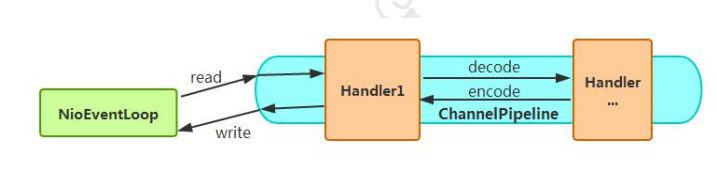

## 0.Linux 5种IO模型
1. 阻塞I/O（blocking I/O）
2. 非阻塞I/O （nonblocking I/O）
3. I/O复用(select 和poll) （I/O multiplexing）
4. 信号驱动I/O （signal driven I/O (SIGIO)）
5. 异步I/O （asynchronous I/O (the POSIX aio_functions)）

前面4种属于同步IO，异步IO需要操作系统支持。
- 阻塞IO，非阻塞IO是系统调用接口层级的
- 同步IO，异步IO是系统内核级别的。
- 用户点餐的例子：要不要排队点餐？饭菜好了，要不要自己去取？


一个 I/O 操作分为两步： 
1. 发起 I/O 请求：阻塞非阻塞-- 应用程序发起的
2. 实际 I/O 操作：同步 异步--OS

### 0.1 阻塞IO
1. 阶段1：等待数据就绪。网络 I/O 的情况就是等待远端数据陆续抵达；磁盘I/O的情况就是等待磁盘数据从磁盘上读取到内核态内存中。
2. 阶段2：数据拷贝。出于系统安全,用户态的程序没有权限直接读取内核态内存,因此内核负责把内核态内存中的数据拷贝一份到用户态内存中。


recvfrom 可以从java程序中理解调用了read()

- 用户态：用户启动的 cs CPU
- 系统态：OS启动的程序
- 拷贝数据，由系统态拷贝到用户态的内存。

### 0.2 非阻塞IO


1. socket 设置为 NONBLOCK（非阻塞）就是告诉内核，当I/O 请求操作无法完成时，返回一个错误码(EWOULDBLOCK) ，这样请求线程就不会阻塞
2. 请求线程将不断的请求数据是否已经准备好，如果没有准备好，继续请求，直到数据准备好为止。整个 I/O 请求的过程中，虽然用户线程每次发起 I/O 请求后可以立即返回，但是为了等到数据，仍需要不断地轮询、重复请求，消耗了大量的 CPU 的资源
3. 数据准备好了，从内核拷贝到用户空间，注意，这里copy数据的过程仍然要阻塞请求线程

- 处理并发，调用系统调用的时候，不受阻塞，但是有返回结果 数据是否准备好。

### 0.3 IO多路复用


1. 多路复用是指单个线程就可以同时处理多个网络连接的IO。原理就是select/epoll会不断的轮询所负责的socket，以注册和监听为基础，当某个socket有数据到达了，就通知用户线程
2. 用户线程会阻塞在select方法上

- poll和epoll的区别，是epoll 只查找注册的感兴趣连接的读写事件，poll每次都查找所有的连接事件
- 从图中看，这种模型会有两次系统调用(select,recvfrom)，它适合连接数多的情况，可以同时处理多个连接请求
- 实际中，每一个socket连接，一般都设置成为non-blocking，但是，整个用户的process是一直被select这个函数block，而不是被socket IO给block。

> 用户调用select是阻塞的，java是以epoll的底层的。

### 0.4  信号驱动I/O

- 信号驱动I/O：开启套接口信号驱动 I/O 功能，通过系统的调用 sigaction 执行信号处理函数；当数据准备就绪时，就位该进程生成一个 SIGIO 新型号，通过信号回调通知应用程调用 recvfrom 读取数据


### 0.5异步I/O


- 异步I/O：告知内核启动某个操作，并让内核在整个操作完成后（包括将数据从内核复制到用户缓冲区）通知应用程序；与信号驱动模型的区别在于信号驱动 I/O 由内核通知何时可以开始一个 I/O 操作；异步 I/O 由内核通知 I/O 操作何时完成

1. 调用 aio_read 函数，告诉内核描述字，缓冲区指针，缓冲区大小，文件偏移以及通知的方式（需要内核的支持，2.6+）
2. 整个数据准备和拷贝过程，用户线程都没有阻塞
3. 数据拷贝完成后，内核会通知用户程序。用户程序则可以直接使用了

第1、2步都不会等。Pool acter模型是异步IO


### 总结
同步和异步IO： 描述的是用户线程与内核的交互方式：
- 同步是指用户线程发起 I/O 请求后需要等待内核 I/O 操作完成后才能继续执行；
- 异步是指用户线程发起 I/O 请求后仍继续执行，当内核 I/O 操作完成后会通知用户线程，或者调用用户线程注册的回调函数。

阻塞和非阻塞：描述的是用户线程请求内核 I/O 操作的方式：
- 阻塞是指 I/O 操作需要彻底完成后才返回到用户空间；
- 非阻塞是指 I/O 操作被调用后立即返回给用户一个状态值，无需等到 I/O 操作彻底完成。

### 补充
> Java NIO 叫异步IO，不叫非阻塞IO

| Java IO | NIO        |
| ------- | ---------- |
| 面向流  | 面向缓冲区 |
| 阻塞IO  | 非阻塞IO   |
| 无      | Selector   |


---
## 1.NIO核心
最核心的概念：Channel、Buffer、Selector。

- Buffer 缓冲区，本质上就是一块内存区。（这块内存被NIO Buffer包裹起来，对外提供一系列的读写方便开发的接口。）

- Channel 通道，是读写Buffer的入口。
  - 从通道进行数据读取 ：创建一个缓冲区，然后请求通道读取数据。
  - 从通道进行数据写入 ：创建一个缓冲区，填充数据，并要求通道写入数据。

- Selector 选择器, 多路复用器。检查多个 Channel（通道）的状态是否处于可读、可写事件。
- 工作原理：Selector负责监听外部事件，Channel把自己注册到Selector，并告诉自己感兴趣的事件。但外部有事件来的时候，就会去轮询Channel，找到合适的Channel来处理。

数据读取和写入操作图示：


### 1.1Channel & Buffer
1. channel理解成建立连接的那根管道
2. Buffer 理解成接入管道的那段水管
3. 通道涵盖了UDP 和 TCP 网络IO，以及文件IO
4. Buffer的实现基本涵盖了所有的类型
5. Netty自己又实现了更轻量级的ByteBuf
6. FileChannel的transferTo和transferFrom使用的zero_copy，其他的目前不支持


### 1.2Selector
- Channel 需要向`Selector`注册监听的事件
- 调用` select `方法，这是个阻塞方法

1. java6之前是基于`poll`实现的,java6之后是基于`epoll`实现的。
2. Netty是基于边界的并发机制，调用lib native库，堆外内存的需要自己管理，(Spark 1.6 NIO、Netty4的可选)，Java是基于垂直的并发的并发机制。
1. Selector允许单线程处理多个 Channel
1. Oracle jdk会自动选择合适的Selector。 如果想设置特定的Selector，可以属性：`-Djava.nio.channels.spi.SelectorProvider=sun.nio.ch.EPollSelectorProvider`
1. 参考： [讲 selector 的用法](http://ifeve.com/selectors/)

> FileChannel 不支持 非阻塞; 网络IO支持非阻塞。


## 3.经典网络服务结构设计
### 3.0 古老的模型
每一个handler都是在自己的线程中启动和运行，如常用的线程池的方式来处理请求。


Reactor也可以称作反应器模式，它有以下几个特点：

①　Reactor模式中会通过分配适当的handler(处理程序)来响应IO事件

②　每个handler执行非阻塞的操作

③　通过将handler绑定到事件进行管理，类似与AWT addActionListener 添加事件监听；

### 3.1 Basic Reactor Design: Reactor单线程模型


- Acceptor ：只建立连接
- Reactor线程：只有一个，负责对worker进行处理。

### 3.2 ThreadPool Reactor Design: Reactor多线程模型


- Acceptor1个，只接受连接
- Reactor线程1个：只处理IO请求
- Worker线程池：专门用于处理**非IO操作**。

### 3.3 Multiple Reactors: Reactor主从模型


- Acceptor：变成了mainReactor线程，专门负责建立连接。--bossGroup NioEventLoopGroup
- subReactor 线程：一个或者多个，专门处理IO请求。--workerGroup NioEventLoopGroup
- worker 线程池：专门处理**非IO请求** -- 具体实现上，和subReactor在同一个线程池中。
> Netty的线程模型基于主从Reactor多线程，借用了MainReactor和SubReactor的结构，但是实际实现上，SubReactor和Worker线程在同一个线程池中：
>
> 利用主从Reactor 线程模型，可以根据IO和CPU计算的需要，合理地调节subReactor和worker线程数量。因此，在Netty的官方demo中，推荐使用该线程模型。

下面是一段Netty 构造Reactor线程模型的方法。

```java
EventLoopGroup bossGroup = new NioEventLoopGroup();
EventLoopGroup workerGroup = new NioEventLoopGroup();
ServerBootstrap server = new ServerBootstrap();
server.group(bossGroup, workerGroup)
 .channel(NioServerSocketChannel.class)
```

- bossGroup线程池则只是在bind某个端口后，获得其中一个线程作为MainReactor，专门处理端口的accept事件，每个端口对应一个boss线程
- workerGroup线程池会被各个SubReactor和worker线程充分利用
  

## 4.Netty是什么
Netty是一个高性能、**异步事件驱动的NIO**框架，它提供了对TCP、UDP和文件传输的支持。
- 作为一个异步NIO框架，Netty的所有IO操作都是**异步非阻塞**的，通过`Future-Listener`机制，用户可以方便的主动获取或者通过通知机制获得IO操作结果


### 4.1Netty的线程模型是实现了主从多Reactor模型


- Netty 的线程模型基于主从多Reactor模型。通常由一个线程负责处理OP_ACCEPT事件，拥有 CPU 核数的两倍的IO线程处理读写事件。
- 一个通道的IO操作会绑定在一个IO线程中，而一个IO线程可以注册多个通道。
- 在一个网络通信中通常会包含网络数据读写，编码、解码、业务处理。默认情况下编码、解码等操作会在IO线程中运行，但也可以指定其他线程池。
- 通常业务处理会单独开启业务线程池，但也可以进一步细化，例如心跳包可以直接在IO线程中处理，而需要再转发给业务线程池，避免线程切换。
- 在一个IO线程中所有通道的事件是**串行处理**的。

> 事实上，Netty的线程模型并非固定不变，通过在启动辅助类中创建不同的EventLoopGroup实例并通过适当的参数配置，就可以支持上述三种Reactor线程模型。正是因为Netty 对Reactor线程模型的支持提供了灵活的定制能力，所以可以满足不同业务场景的性能诉求。

Netty架构按照Reactor模式设计和实现，它的服务端通信序列图如下：

- 图2-3 NIO服务端通信序列图


- 客户端通信序列图如下：


Netty的IO线程`NioEventLoop`由于聚合了多路复用器Selector，可以同时并发处理成百上千个客户端Channel，由于读写操作都是非阻塞的，这就可以充分提升IO线程的运行效率，避免由于频繁IO阻塞导致的线程挂起。

另外，由于Netty采用了异步通信模式，一个IO线程可以并发处理N个客户端连接和读写操作，这从根本上解决了传统同步阻塞IO一连接一线程模型，架构的性能、弹性伸缩能力和可靠性都得到了极大的提升。

### 4.2 Netty的“零拷贝”主要体现在如下三个方面

1. Netty的接收和发送`ByteBuffer`采用`DIRECT BUFFERS`，使用堆外直接内存进行`Socket`读写，不需要进行字节缓冲区的二次拷贝。如果使用传统的堆内存（HEAP BUFFERS）进行Socket读写，JVM会将内核内存Buffer拷贝一份到用户内存中，然后才写入Socket中，在发送数据的时候的时候，多了2次内存拷贝。**(减少用户态和内核态的对象拷贝)**

2. Netty提供了组合Buffer对象，可以聚合多个ByteBuffer对象，用户可以像操作一个Buffer那样方便的对组合Buffer进行操作，避免了传统通过内存拷贝的方式将几个小Buffer合并成一个大的Buffer。**（减少在用户态中，对象与对象的拷贝）**

3. Netty的文件传输采用了FileChannel的transferTo方法，它可以直接将文件缓冲区的数据发送到目标Channel，避免了传统通过循环write方式导致的内存拷贝问题。**(减少用户态和内核态的对象拷贝)**

> 从这个角度来看，与Kafka的零拷贝，原理类似，都节约了2次 用户内存-内核内存的拷贝。
- Kafka是使用文件Channel的transferTo方法，zeroCopy，不经过内核内存的缓冲区。
- Netty是使用堆外内存，不经过内核内存的缓冲区。

当进行Socket IO读写的时候，为了避免从内核内存Buffer拷贝一份副本到用户内存，Netty的ByteBuf分配器直接创建非堆内存避免缓冲区的二次拷贝，通过“零拷贝”来提升读写性能。

### 4.3 内存池
随着JVM虚拟机和JIT即时编译技术的发展，对象的分配和回收是个非常轻量级的工作。但是对于缓冲区Buffer，情况却稍有不同，特别是对于堆外直接内存的分配和回收，是一件耗时的操作。

为了尽量重用缓冲区，Netty提供了基于内存池的缓冲区重用机制。具体实现是Netty ByteBuf。

> 性能测试表明，采用内存池的ByteBuf相比于朝生夕灭的ByteBuf，性能高23倍左右（性能数据与使用场景强相关）。

### 4.4 无锁化的串行设计理念
在大多数场景下，并行多线程处理可以提升系统的并发性能。但是，如果对于共享资源的并发访问处理不当，会带来严重的锁竞争，这最终会导致性能的下降。为了尽可能的避免锁竞争带来的性能损耗，可以通过串行化设计，即消息的处理尽可能在同一个线程内完成，期间不进行线程切换，这样就避免了多线程竞争和同步锁。

为了尽可能提升性能，Netty采用了串行无锁化设计，在IO线程内部进行串行操作，避免多线程竞争导致的性能下降。表面上看，串行化设计似乎CPU利用率不高，并发程度不够。但是，**通过调整NIO线程池的线程参数，可以同时启动多个串行化的线程并行运行，这种局部无锁化的串行线程设计相比一个队列-多个工作线程模型性能更优。**

Netty的串行化设计工作原理图如下：


Netty的`NioEventLoop`读取到消息之后，直接调用`ChannelPipeline`的`fireChannelRead(Object msg)`，只要用户不主动切换线程，一直会由NioEventLoop调用到用户的Handler，期间不进行线程切换，这种串行化处理方式避免了多线程操作导致的锁的竞争，从性能角度看是最优的。

### 4.5 高效的并发编程
Netty的高效并发编程主要体现在如下几点：

1) volatile的大量、正确使用;
2) CAS和原子类的广泛使用；
3) 线程安全容器的使用；
4) 通过读写锁提升并发性能。

如果大家想了解Netty高效并发编程的细节，可以阅读之前我在微博分享的《多线程并发编程在 Netty 中的应用分析》，在这篇文章中对Netty的多线程技巧和应用进行了详细的介绍和分析。


### 4.6 高性能的序列化框架
影响序列化性能的关键因素总结如下：
1) 序列化后的码流大小（网络带宽的占用）
2) 序列化&反序列化的性能（CPU资源占用）
3) 是否支持跨语言（异构系统的对接和开发语言切换）

Netty默认提供了对Google Protobuf的支持，通过扩展Netty的编解码接口，用户可以实现其它的高性能序列化框架，例如Thrift的压缩二进制编解码框架。

### 4.7  灵活的TCP参数配置能力
合理设置TCP参数在某些场景下对于性能的提升可以起到显著的效果，例如`SO_RCVBUF`和`SO_SNDBUF`。如果设置不当，对性能的影响是非常大的。下面我们总结下对性能影响比较大的几个配置项：

1) SO_RCVBUF和SO_SNDBUF：通常建议值为128K或者256K；
2) SO_TCPNODELAY：NAGLE算法通过将缓冲区内的小封包自动相连，组成较大的封包，阻止大量小封包的发送阻塞网络，从而提高网络应用效率。但是对于时延敏感的应用场景需要关闭该优化算法；
3) 软中断：如果Linux内核版本支持RPS（2.6.35以上版本），开启RPS后可以实现软中断，提升网络吞吐量。RPS根据数据包的源地址，目的地址以及目的和源端口，计算出一个hash值，然后根据这个hash值来选择软中断运行的cpu，从上层来看，也就是说将每个连接和cpu绑定，并通过这个hash值，来均衡软中断在多个cpu上，提升网络并行处理性能。

Netty在启动辅助类中可以灵活的配置TCP参数，满足不同的用户场景。有相关配置接口定义.

## 5 总结

Netty\Kafka\Yarn的RPC框架都是基于Reactor模式实现的。gRPC是基于Netty实现的。

- todo 自己实现Reactor模式的RPC
- 

