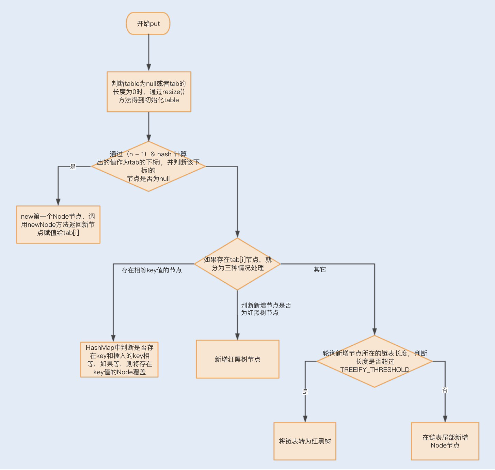

1Java 集合面试

尝试回答下面这些问题

1. HashMap 底层设计与实现，LoadFactor，为什么多线程环境下，put方法会造成死循环？为什么size>=8 之后，要转换成红黑树？红黑树能手写一个么？
2. HashTable \ ConcurrectHashMap分别对应什么样的适用场景？
3. ConcurrentHashMap 1.8之前是segment lock, 之后使用synchronized和CAS来更新，为什么？涉及1.6之后，对synchronized的优化，重量级锁、偏向锁、自旋锁
4. ConcurrentSkipListMap 基于跳表实现的Map，优点是什么，对比ConcurrentHashMap的适用场景是什么？
5. 互联网电商系统，往往都有黑名单，你觉得用什么样的数据结构来存储？如果要设计一个统计商品销量Top10的功能，用什么样的数据结构？
6. 如果使用队列来实现抢购的排队，如何选择队列？特点是写多读少。

### 1 HashMap

数组+链表的实现。下面是put方法的流程图。

### 2 HashTable 与 ConcurrentHashMap

区别一句话概括：HashTable 各个操作都是加锁的，ConcurrentHashMap的get 不加锁，put加锁。这会造成get的时候不一定拿到最新的数据，属于弱一致性的实现。因此，强一致性的场景，用HashTable。

历史：JDK1.7之前 ConcurrentHashMap 使用Segment分段锁，1.8之后，使用Synchronized同步锁。

- put 方法：在没有哈希冲突的情况下，使用CAS添加；有冲突，就用Synchronized把链表Node锁住，还是锁住的一个链表，不是整个map。

#### 底层实现

数组+链表+红黑树+锁的实现。同样，链表也会转换成红黑树。红黑树在并发的情况下，删除和插入过程中，需要平衡，会操作大量的节点，因此竞争所资源激烈，代价相对于跳表高。

> 因此，在单线程Map容器中，TreeMap容易来存取大数据量；线程安全的case下，SkipListMap来存大数据。

### 3 什么是跳跃表

类似于树，空间换时间。

### 4 CopyOnWriteArrayList

特点：读，无所并发；写：复制在更新，copy回去。（读写分离的并发思想）

适用于什么场景？