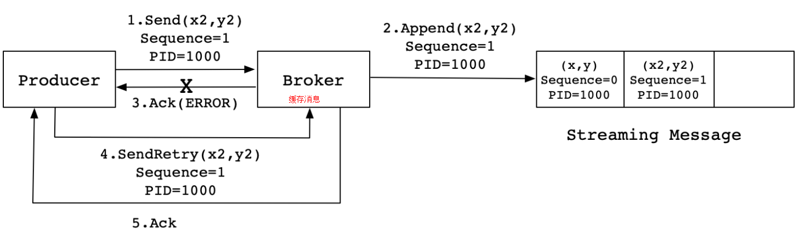
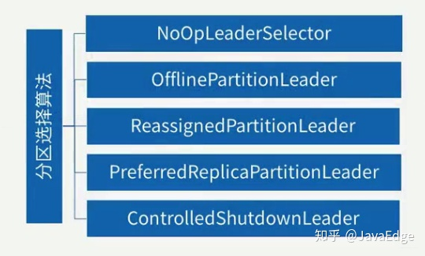
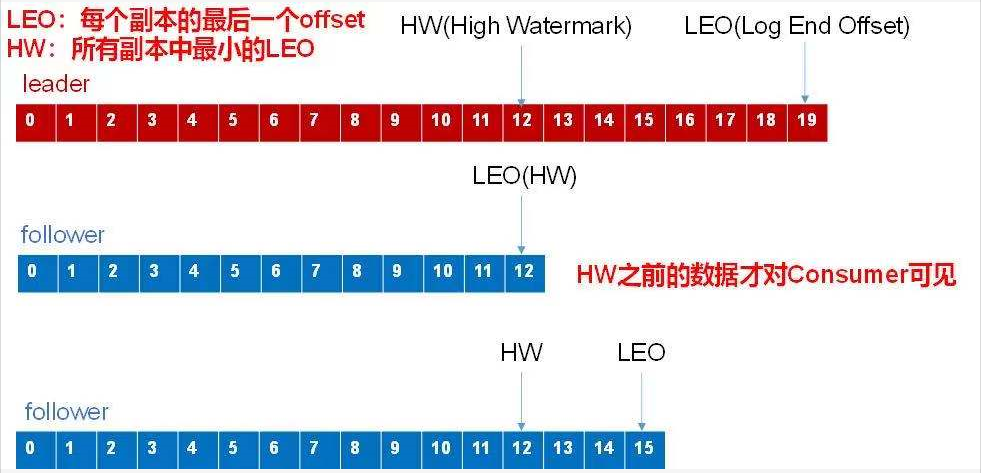
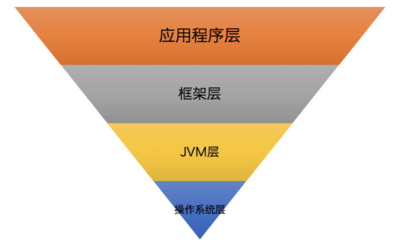

# 1Kafka基本

### 1  kafka

消息引擎，从0.11开始，又是分布式流处理平台。
- 缓冲和削峰
- 解耦和扩展性
- 冗余
- 异步通信

### 2 规划集群

- 需要存储，所以需要规划磁盘空间；如果一天有10亿条数据，每条1KB，需要保持14天？
- 现在有个业务，1小时需要处理10TB的数据量，那么需要规划多少台Kakfa集群呢？

磁盘规划，需要考虑

1. 新增消息数
2. 平均消息的大小
3. 消息的保存时间
4. 副本数
5. 压缩率

> 14天消息求和=1亿 \* 1KB \* 14天，副本数是2， 压缩率是0.75，总共2.1T。考虑到集群除了消息还有索引数据，占用10%，2.1T\*(1 + 10%) = 2.3T。所以磁盘至少要2.3T的空间。

 

现在有个业务，1小时需要处理1TB的数据量，那么需要规划多少台Kakfa集群来完成这个任务呢？主要是带宽资源的规划？1Gbps千兆网络是一般公司的标准配置（1秒处理1Gb的数据），需要考虑什么呢？**60%的kafka性能问题，都是由于带宽打满导致的**

- 主要考虑Kafka本身可以使用的网卡带宽是多少？即一张网卡可以用多少带宽？
  - 最大可利用资源只有70%，再多就要网络丢包，这是经验。剩下700M
  - 这700M要预留一部分给别的程序用，至少要留2/3 以上。 剩下700/3 = 234M
  - 所以一张网卡，kafka可以使用的流量是234M。如果一个小时的1TB数据，换算成每秒是277MB/s，Byte换成bit, = 277M*8 = 2300Mb。所以需要10台机器。如果这1小时1TB全部是写入Kafka，如果replica=3，那么Kafka之间同步流量要考虑，就是30台机器。

总结一下，需要规划的点？

| 指标     | 考量点                                             | 建议                                 |
| -------- | -------------------------------------------------- | ------------------------------------ |
| 操作系统 | 不同的OS有不同的IO模型                             | Linux                                |
| 磁盘     | 主要是磁盘IO性能                                   | 机械磁盘还是SSD，要不要RAID          |
| 磁盘容量 | 根据什么来计算                                     | 是否需要预留空间，比如20% 30%        |
| 带宽     | 根据什么来计算？网卡自身的性质，最大可以使用的容量 | 千兆网卡的最大可用率是多少，为什么？ |

> 补充问题：Kafka某个Topic的分区数量如何确定？需要考虑你的目标是什么？比如Producer的TPS是10万条/秒，记为T1, 然后在真实环境中，创建仅有1个分区的topic，往里面写，看看TPS=T2，这个就是每个分区能够写入的最大条数。然后分区数=T1/T2。（简单有效。）

### 3 参数

| Broker参数                        | 含义 | 经验                          |
| --------------------------------- | ---- | ----------------------------- |
| log.dirs                          |      | 设置多个的好处是什么？        |
| log.dir                           |      |                               |
| zookeeper.connect                 |      |                               |
| listeners                         |      |                               |
| advertised.listeners              |      | 建议统一用Hostname            |
| host.name/port                    |      |                               |
| auto.create.topics.enable         |      |                               |
| unclean.leader.election.enable    |      |                               |
| auto.leader.rebalance.enable      |      |                               |
| log.retention.{hour\|minutes\|ms} |      |                               |
| log.retention.bytes               |      |                               |
| message.max.bytes                 |      | 默认的 1000012不够，加大成10M |
|                                   |      |                               |

思考几个问题：

- kafka是否需要使用Raid？Kafka1.1版本新引入了一个什么加强Broker的功能？

| Topic级别参数   | 含义 | 经验 |
| --------------- | ---- | ---- |
| retention.ms    |      |      |
| retention.bytes |      |      |

思考：

- 创建和修改topic建议用：

  ```
   bin/kafka-configs.sh --zookeeper localhost:2181 --entity-type topics --entity-name transaction --alter --add-config max.message.bytes=10485760
  ```

| JVM参数                    | 含义           | 经验 |
| -------------------------- | -------------- | ---- |
| KAFKA_HEAP_OPTS            | 堆大小         |      |
| KAFKA_JVM_PERFORMANCE_OPTS | GC收集器的选择 |      |

思考：

- Kafka适合运行在JDK哪个版本，每个版本默认的GC收集器是什么？
- Kafka 2.0以后放弃支持Java 7
- 在没有任何调优的情况下，G1 表现得要比 CMS 出色，主要体现在更少的 Full GC，需要调整的参数更少等，所以使用 G1 就好了。

启动Kafka的命令：

```
export KAFKA_HEAP_OPTS=--Xms6g  --Xmx6g
export  KAFKA_JVM_PERFORMANCE_OPTS= -server -XX:+UseG1GC -XX:MaxGCPauseMillis=20 -XX:InitiatingHeapOccupancyPercent=35 -XX:+ExplicitGCInvokesConcurrent -Djava.awt.headless=true
bin/kafka-server-start.sh config/server.properties
```

| 操作系统参数   | 含义                                 | 经验 |
| -------------- | ------------------------------------ | ---- |
| 文件描述符限制 |                                      |      |
| 文件类型       | ext3、ext4 或 XFS                    |      |
| Swappiness     | 使用虚拟内存的积极性，推荐设置成1.   |      |
| 提交时间       | Flush 落盘时间，页缓存（Page Cache） |      |

思考：

- Kafka 不需要为 Broker 设置太大的堆内存，而应该尽可能地把内存留给页缓存使用？
- retention.ms 和 retention.bytes 这两个参数是不是只要满足一个，Kafka就会开始清消息了？

### 3 分区策略

为了实现负载均衡，实现高伸缩性（Scalability），实现高吞吐量。

**如何自定义分区策略有哪些？**

编写一个具体的类实现`org.apache.kafka.clients.producer.Partitioner`接口

```java
int partition(String topic, Object key, byte[] keyBytes, Object value, byte[] valueBytes, Cluster cluster);
```

- 轮询策略：Producer API默认分区策略。很优秀，很常见。

- 随机策略：

- 消息键保序：Key-ordering，Kafka运行为每条消息定义key。在kafka不支持时间戳的时候，这个key放时间戳；后来，这个key可以保证某些消息进入到同一个分区，这个相当重要，有很多用途。

  ```java
  List<PartitionInfo> partitions = cluster.partitionsForTopic(topic);
  return Math.abs(key.hashCode()) % partitions.size();
  ```

  > Kafka 默认情况下，Producer没有指定key，就用轮询策略；如果指定了，就用key-ordering.

- 在大规模集群中，还有一种基于地理位置的分区策略。

### 4 解压缩

V2版本的消息压缩是对消息集合message set进行压缩。压缩发生在Producer端和Broker端。什么时候Broker端会启动压缩？1 Producer端和Broker端指定了不同的压缩算法。2 是Broker端发送了消息格式转换，如果新版本的消息写入到老版本格式的kafka，就会发生。3 Broker在写数据的时候，会解压缩数据来进行校验，这个地方是耗性能的。（2.4版本已经解决了因为校验而引起的解压缩。存疑？PR-6699认为没有避免解压缩，只是少了create ByteBuffer）

- **Producer 端压缩、Broker 端保持、Consumer 端解压缩。**
- Consumer 怎么知道消息是用何种压缩算法压缩的呢？

有什么压缩算法？

- 2.1.0之前，GZIP，Snappy， LZ4
- Zstandard算法那（zstd)

> 性能测试结果却出奇得一致，即在吞吐量方面：LZ4 > Snappy > zstd 和 GZIP；而在压缩比方面，zstd > LZ4 > GZIP > Snappy。

思考几个问题：

1. 什么启动Producer压缩？考虑CPU和带宽
2. 压缩和解压缩会丧失zero-copy的特性么？我觉得是会的，这里要分2个方向来看，1. Broker接受Producer的消息，进行写。这个过程，是需要对消息集合RecordBatch进行解压缩校验的，必然从内核态到用户态。 2. Consumer来消费的时候，磁盘数据被加载到内核态，这个时候，就可以判断，就是可以让数据直接从内核态给到Consumer。**没想到，zero-copy是只发生在Broker和Consumer端，而且还有前提条件：Consumer能够识别磁盘上的消息格式。**
3. **Broker要对压缩的消息集合执行解压缩，然后逐条对消息进行校验。有更好的方案么？**
4. Consumer端一次只消费5条消息，但是消息集合是10条为一个的，这个情况下，Consumer端怎么解压缩？
5. Broker对不同消息格式进行转换，是在什么时候发生？

> TODO：学习一下Java飞行器的使用

### 5 保证消息不丢失

**Kafka对以提交的消息（committed message 做有限度的持久化保证。保证什么？保证消息不丢失。**

1. 生产者丢失消息的案例？从哪里分析原因？什么原因会导致消息丢失？怎么解决？

   - 消息没有发送到Broker，由于网络抖动 
   - 消息太大了，Broker不接收

2. Consumer端丢失数据的现象，想读的消息没有读上？场景是什么，怎么解决？

   - Consumer从Kafka获取消息后，开启了多个线程异步进行处理，而Consumer程序**自动地向前更新了Offset**。如果某个线程运行失败了，那么它负责的消息就没有被成功处理。因此，对于这些消息来说，Consumer就丢失了她们。
   - (有一个方案是Consumer不要开启自动提交offset，让所有线程消费完才手动提交。**会不会出现消息被消费了多次的情况呢?有没有好的方案**)

3. **分析了这么多，最后总结出的最佳实践来保证kafka消息不丢失**，从Producer应该做什么，Broker做什么，Consumer做什么来分析？

   >  min.insync.replicas=1理解？
   >
   >  思考题：Kafka有一个隐私的消息丢失场景：增加主题分区。当增加主题分区后，如果Producer先于Consumer感知到这个分区，而Consumer设置的是从latest的地方读取数据，那么就会存在数据丢失。有什么解决办法么？

### 12 拦截器

如何监控一条消息从生产到最后消费的端到端延时也是很多 Kafka 用户迫切需要解决的问题。

- 生产者拦截器：消息发送前和消息成功发送后
- 消费者拦截器：消息被消费前，和消息commit之后。

如果使用拦截器，可以统计出 `消息生成--->消息被成功发送，即收到ACK-----> 消息被消费前-----> 消息被commit offset` 可以统计出这3段时间的延迟是多少。

> TODO 实践：如果Producer拦截器的onSend方法，return null, 那么这条消息会怎么样？

### 13 Producer TCP连接

Producer从创建到真正写数据，会发起下面几次TCP连接请求？

1. 创建KafkaProducer之后，后台会启动Sender线程，该线程运行时首先会创建与Broker的连接。
2. KafkaProducer 向某一台Broker再次请求集群的metadata，包括自己订阅Topic的所有meatadata
3. KafkaProducer向Topic 分区的leader的broker发起TCP连接，准备写数据。

> KafkaProducer是线程安全的么？答案是KafkaProducer和Sender线程共享的可变数据结构只有RecordAccumulator类，因此如果RecordAccumulater类是线程安全的，那么它就是线程安全的。RecordAccumulator里面是使用ConcurrentMap<TopicPartiion,Deque>,TopicPartition是不可变类，Deque用到的地方，都加了锁。所以是线程安全的。
>
> 注意：这里初始化KafkaProducer的时候，创建了一个Sender线程，并且启动了该线程。这本身是有风险的。因此，最好不要在构造方法里面启动线程，在外面的方法里启动它。
>
> 问题：TCP的连接只有在初始化的时候，创建么？有没有其他2种情况可以创建？

目前来看，一个Producer会与所有的Broker创建TCP连接，然后kafka会关闭长时间不使用的TCP连接资源。因此，如果1000台机器，一个Producer可能只会与5台机器通信，但是它会先创建1000个连接，然后kafka在关闭995个。问题来了？如何优化？Kafka又是何时关闭连接的，默认空闲时间是多长？connections.max.idle.ms=9分钟。

### 21 Consumer的TCP连接

1. 什么时候创建？调用KafkaConsumer.poll方法
2. 讲一下创建的过程？3次请求
   1. 寻找FindCoordinator和获取集群的metadata（Consumer发起）-- 最后被关闭
   2. 连接Coordinator（Consumer发起）-- 一直被复用
   3. 连接分区副本的leader（Consumer发起）---一直被复用
3. 他们的生命周期是怎么样的？默认时间9分钟`connection.max.idle.ms`。

### 14 幂等Producer

- 幂等性Producer是如何实现的？0.11，at least once + 幂等 = exactly once

  - 单分区不重复，单会话不重复。(重启，丢失缓存)

  - 解决：单会话ACK 超时导致重复
    - Broker缓存消息，根据PID和SequenceNumber判重
    - ProducerID：唯一的ProducerID，标识client
    - SequenceNumber：TopicPartition级别，每条消息带着，Broker判重。

  

  * 申请PID
    * InitProducerIdRequest 发送给连接数最少的Broker
    * TransactionCoordinator的ProducerIdManager生产唯一id，TransactionCoordinator负责与Producer通信，更新message的事物状态。
    * PID 申请是向 ZooKeeper 申请，类似于CompareAndSwap的方式，来写入PID，写入成功，就申请成功；失败就重试。

关于幂等性的思考，要解决下面的问题：

1. 系统需要有能力鉴别一条数据到底是不是重复的数据？常用的手段是通过 **唯一键/唯一 id** 来判断
2. 唯一键应该选择什么粒度？分布式存储系统，全局唯一键？分区唯一主键？Kafka 在分区的维度去做，重复数据的判断让 partition 的 leader 去判断处理
3. 分区粒度实现唯一键有问题？当一个 Partition 有来自多个 producer写入的情况。Kafka使用 **producer+ partition** 粒度，producer是独立的。

* 当 MAX_IN_FLIGHT_REQUESTS_PER_CONNECTION 配置大于1时，是否保证有序
  * Server 端验证 batch 的 sequence number 值，不连续时，直接返回异常；
  * Client 端请求重试时，batch 在 reenqueue 时会根据 sequence number 值放到合适的位置（有序保证之一）；
  * Sender 线程发送时，在遍历 queue 中的 batch 时，会检查这个 batch 是否是重试的 batch，如果是的话，只有这个 batch 是最旧的那个需要重试的 batch，才允许发送，否则本次发送跳过这个 Topic-Partition 数据的发送等待下次发送。


### 15 ConsumerGroup

- 保持和订阅的所有topic的总分区数相同。
- 老版本的Consumer把位移保存在Zookeeper，好处是减少Broker的压力，实现更好地扩容和伸缩性
- 新版本的Consumer把位移保存在Broker的内部topic `__consumer_offset`中。


1. **Rebalance的触发条件有几个？3**
2. **Rebalance的策略是什么？从目的来想**

3. Rebalance为什么臭名昭著？从1 从STW来看；2策略又不优秀，是否需要一些断开和新开TCP连接 ;3效率高不高

> 最好的方式是减少Rebalance的方式，有实际的项目经验。

### 16 __consumer_offset由来

你知道它为什么存在，它的作用是什么，怎么被默认创建，它有几种消息格式，什么时候写入进去，它的消息格式是怎样的， 它是怎么删除过期的数据的，Compaction（由log cleaner线程定期删除）

- 自动提交位移和手动提交哪个更好？
- 同一个ConsumerGroup的offset是放在同一个分区，还是可以不同的分区？

> 项目经验来了：log cleaner 线程挂掉，导致消费端出现`Marking Coordinator Dead!` 
>
> 原因是：log cleaner线程挂掉---> offset文件越来越多--> broker 内存维护了offsetMap，这Map越来越大，导致offsetMap无法在添加数据---> 导致broker不承认自己是coordinator。 ---> 而消费者找Coordinator的时候，又找到这个broker。---> 导致这个consumer就无法消费任何数据，出现上面的错误。

- Consumer是如何从这个主题拿到自己上一次消费的offset的？Coordinater？

> 补充：单个controller支持20W个topic 分区。我觉得可能是取决于内存吧。

> 与Zookeeper管理offset的方式相比较，有什么劣势？

### 17 Rebalance (**重点**)

- Rebalance的作用是什么？有什么坏处？3
- Rebalance的触发条件有几个？3
- Rebalance的时候，怎么做？有哪些策略？Coordinator
- 从触发条件来看，如何避免Rebalance？

基本知识：所有Broker都有一个Coordinator组件，负责协调ConsumerGroup的消费情况。

- kafka 为某个ConsumerGroup如何确定Coordinator所在的broker？分2步。这个可以帮助我们定位问题：ConsumerGroup消费异常

> 遇到过哪些计划外的Rebalance？也就是说，什么情况下，Coordinator认为ConsumerGroup下的Consumer实例已经挂了？
>
> 1. Consumer会定期地向Coordinator发送心跳，`session.timeout.ms=10s`（超过这个时间，Coordinator会移除这个实例）
> 2. Consumer发送心跳有一个时间间隔，`heartbeat.interval.ms`(发送得快，Coordinator就越早知道它还活着)
> 3. Consumer2次拉取数据的时间间隔，`max.poll.interval.ms=5分钟`（一次消费一批消息的时间如果超过5分钟，Consumer就会主动要求离开）
> 4. Consumer端 GC 参数设置不合理

针对这些1、2、3分别有哪些实战经验呢？

1. 规避第1类，Consumer未能及时发送心跳，导致Consumer被踢出Group而引发。 

   - `sesstion.timeout.ms = 6s`（尽快让不合格的Consumer，早日离开）
   - `heartbeat.interval.ms=2s`（保证Consumer在dead之前，至少发送了3次心跳请求。）

2. 规避第3类，消费时间过长，比如消费数据之后，写入mongodb。这情况如何设置`max.pool.interval.ms`。原则是给业务逻辑处理留足充足的时间。

3. 如果上述设置之后，还是出现了Rebalance，就要去查Consumer端的GC情况，是否频繁出现Full GC导致长时间的STW。

   > 这种情况很常见，GC设置不合理导致程序频繁Full GC而引发非预期的Rebalance，项目经验是什么？TODO: 
   >
   > 问题：ConsumerGroup下的几个Consumer实例正在消费，这个时候，其中一个Consumer挂掉了，另外2个正在消费中，还未提交位移。Rebalance发生了? Consumer是不是立刻停止，等待Rebalance完成？数据会不会被重新消费？（正确的理解是：正在消费，Rebalance发生了，还未提交offset的Consumer继续进行业务逻辑处理，与此同时，Rebalance也在发生，如果还未提交offset的partition被别的Consumer实例分配到了，就会重复消费消息。有道理，可以得出结论，Rebalance会造成数据的重复消费。）

由于Rebalance的性能问题，无法应对大数据量的场景。因此Flink、Spark的Kafka Connector都是使用的Standalone Consumer，就没有Rebalance的问题。

### 18 提交offset

- 自动提交：如何配置？Consumer会在后台启动一个线程来定期提交位移。逻辑上来讲，poll下一次数据的时候，会先提交上一批次的offset，所以不出异常的情况下，是能够正常运行，且没有重复和漏掉的消息。
- 手动提交有3种，实际开发中，应该如何选择？能不能结合起来？能否避免消息消费重复？
  - 同步的：commitSync() 直接阻塞，直到成功。什么时候会重复？
  - 异步的：commitAsync() 不阻塞，有callback。缺点是什么？遇到问题后，不能重试提交offset操作。因为重试其实也没有用，因为它自身的offset是过期的。
  - 更加精细化的同步和异步的

1. 开启自动提交位移，会出现消费重复。默认是5s自动提交一次位移。case: 提交完位移之后3s，这个时候发生了Rebalance。
2. 手动提交位移，会不会消费重复？

> 最佳实践：同时使用2者，利用commitSync的自动重试来避免由于网络瞬间抖动和Broker GC导致失败，兼顾用commitAsync来提升TPS。(TODO: 需要代码实现)

### 19 CommitFailedException（项目经验，写到简历）

**要明白什么时候发生，才知道怎么处理？（手动用这个方法 `KafkaConsumer.commitSync() `）**

1. Rebalance就会发生，因为Rebalance会造成重新分配分区，**Consumer提交offset到一个不再属于它消费的partition的时候。就要去分析，为什么发生了Rebalance? (典型的就是有Consumer实例退出了。那么从退出的原因中寻找解决办法)**
2. 存在有2个相同的group.id的名字。（遇到过）

> 按照这样的分析，自动提交offset也会有这个异常，只不过不会被暴露出来，Kafka内部就处理。

#### 针对场景1

如果这个Consumer的心跳发的不及时，说明它本身不合格，让它退出就退出了，不管；另外，如果是一批消息消费加上业务处理时间大于了`max.poll.interval.ms=5分钟`，**这就是很经典的场景。而且真实存在。解决方法有4个方向**

  1. 减少下游处理单条消息的时间，优化业务系统，是最值得的事情
  2. 加大`max.poll.interval.ms`，原则就是要计算一下总时间= 平均时间 * 一批总条数（默认500）
  3. 降低一次poll的总条数：`max.poll.records`
  4. 最高级的，下游多线程处理加速。比如Flink的KafkaConsumerThread就是这样。*TODO: 得看看源码*

> 思考：推荐先用第1个，其次用2、3个，最后一个比较难，不容易处理offset的提交。
>
> 1. 发生这个异常，会终止这个Consumer继续消费吗？
>
> 2. TODO：如何写一个多线程处理的高效Consumer？

#### 针对场景2

通过监控，可以查询到是否有2个一模一样的ConsumerGroup，项目经验加成，实际中遇到过。

### 20 多线程kafka consumer （重点）

首先要知道Java kafka consumer 是单线程的，是线程不安全的。它实际上是2个线程：1个是消费主线程，一个是心跳线程。所以，一个consumer实例是不可以被多个线程共用的。

有两种线程方案：

1. 开启多个线程，每个线程里都有一个自己的kafka Consumer 实例，共享一个ConsumerGroup。一个线程的逻辑是：poll数据---> process数据--->再次poll数据
2. 分成①拉取数据线程和②处理业务线程 2个部分。拉取的数据直接交给另外一个线程池去处理。

| 方案  | 优点                            | 缺点                                                         |
| ----- | ------------------------------- | ------------------------------------------------------------ |
| 方案1 | 1. 实现简单                     | 1. 不容易扩展，最大的线程数不能超过partition的总数           |
|       | 2. 消息可以保证是有序地进行消费 | 2. 如果process耗时太多，容易发生Rebalance                    |
|       | 3. 速度快，没有线程间交互的开销 | 3. 占用资源，每个Consumer线程都需要维持TCP连接，还有暂用内存资源 |
| 方案2 | 1. 解耦了，方便扩展             | 1. 实现复杂                                                  |
|       |                                 | 2. 不能保证消费消息的有序性。让一个分区的数据让同一个线程消费，能够保证有序性。 |
|       |                                 | 3. 消费的链路拉长了，offset提交不好控制。（可以解决）        |

> 思考：方案2如何提交offset？
>
> 方案2最核心的如何commit老师没有说，难道只能启用自动提交吗？我觉得可以用Cyclicbarrier来实现线程池执行完毕后，由consumer来commit，不用countdownlatch因为它只能记录一次，而cb可以反复用，或者用forkjoin方式，总之要等待多线程都处理完才能commit，风险就是某个消息处理太慢回导致整体都不能commit，而触发rebalance以及重复消费，而重复消费我用布隆过滤器来解决
>
> 作者：最好的办法就是自己完全实现一套多线程+管理offset的方案，就像Spark Streaming和Flink做的那样。有兴趣的话可以阅读以下Flink中Kafka Connector的源代码：）

> TODO: 项目经验加成， 最近用spring cloud做了一个kafka可靠消息微服务组件，有兴趣的朋友可以看看 ，消费端是多线程模型，消费线程和业务执行分离，使用了mongodb(分片+副本集) 存储消息发送的链路，对发送失败的消息做了补偿机制。https://gitee.com/huacke/mq-kafka，有问题可以联系我。：https://gitee.com/huacke/mq-kafka
>
> **看看作者的实现**: https://www.cnblogs.com/huxi2b/p/13668061.html


#### 补充知识

- pause什么场景下用？pause是暂停一个分区拉取数据，而且不会触发Rebalance，常常`resume`搭配使用。
- wakeup什么时候用，解决什么问题的？wakeup是唤醒一个Consumer线程的，特别地用于abort 长时间阻塞的`poll`操作，可以用来停止一个Consumer。
- **Consumer在持续消费的时候，为什么poll总是能够准备地探测到下一次要拉取的信息？因为Consumer内部会维护一个指针，知道每次拉取了到了哪个位置，所以即使没commit offset，它也能够准备知道消费哪一条。但是重启Consumer或者Rebalance，这个指针就需要重置了。**
- ~~offset的提交，kafka设计得比较简单，谁都可以提交，它都接受。~~ 这个是错误的，必须是分配到的Consumer才能提交该分区的offset，不然就会CommitFailedException.

#### 针对方案2：手动提交offset+多线程消费者+多线程业务处理。

下面是如何一步一步实现的思路，先约定成1个线程消费者来写代码，后面是线程池来进行业务处理。

##### 1 简单思路

- 消费线程：poll到消息之后，批量扔给业务线程池处理。
- 什么时候提交offset，当业务线程完成了，就提交这批records的offset。所以提交offset的逻辑是在业务线程里面。（在实现上，就会把Consumer实例传递给业务线程，去做offset提交。）
- 某个业务线程异常，会发生什么？该线程负责的这批数据，没到提交offset这一步，这个offset就丢失了。这一批数据还能被再次消费到吗？如果别的线程也同样消费了这个分区的数据，并且提交了更新的offset，那么这个数据就丢失了。反之，如果没有别的线程提交offset，Consumer 还活着的时候，它poll的时候，是从内部指针的位置去poll的，这批数据也不会被重新消费。（总之，丢数据。）
- 业务线程池在处理数据的时候，Rebalance发生了，是什么情况？1 Consumer会STW，不会poll新的消息，等待最新的分配； 2 业务线程正常处理，正常提交offset。 3 Consumer 重新被分配到新的分区之后，它初始拉取的offset位置就不再是这个分区上一次的位置了（就是内部指针的位置），而是已经commited的offset的位置，就出现了数据重复消费。

> 这种设计会不会丢失数据和重复消费？业务线程异常会丢失数据。Rebalance会重复消费数据。

##### 2 如何改进方案1 能否针对Partition粒度

让某个Partition只能被一个业务线程处理，处理完之后，在Consumer poll线程提交offset（不再是业务线程），再去拉取数据。

- 消费线程，也就是主入口线程：poll消息之后，进行3步骤

  - 按照Partition的粒度，分发到业务线程池，pause这些Partition的消费
  - 检查outstandingWorker，更新offset，resume已处理过的分区的下一次消费
  - 提交offset，有间隔的提交，最后最好清空一下offsetMap

- 线程池业务线程：一个线程只处理相同分区的数据

  - process 业务
  - 更新offset
  - 返回最新的offset、
  - 添加stop方法，方便rebance的时候，等待业务完成。

- Rebalance监听器：处理Rebalance的offset。

  - 一旦发生Rebalance，Consumer是停止了的，但是数据已经给了业务线程池了。

- 因此，Rebalance发生前，要给所有的业务线程，发送stop命令，停止处理；

  - 这个时候需要业务线程配合，要把最新的位移信息返回出来。
  - 然后Rebalance的监听器，提交这次位移。保证了数据的不丢不重复。
  - 最后，Rebalance开始，consumer 重新获得新的分区，开始从上一次提交的offset开始消费。完美的不丢不重复。

  > 整个方案的好处是：约定一个work任务只能处理同一个分区的数据，这个分区的数据不处理完，就不poll这个分区的数据。保证了两边的解耦，可以加大业务线程池来提高效率。（比如topic有20个partition，最多可以启动20个业务线程对它进行处理。相比于第1种方案，它也要启动20个consumer线程，但是存在Rebalance的风险。）

### 22 Consumer Group 监控？Consumer Lag

1. Lag是什么意思？过大有什么坏处，和OS的页缓存有什么关系？
2. 什么方法监控？3个
   - `bin/kafka-consumer-groups.sh --bootstrap-server <Kafka broker 连接信息 > --describe --group <group 名称 >`

3. 可否集成到监控框架？Zabbix 或 Grafana。KafkaManager

### 23 副本机制

1. 什么是副本，它的作用是什么？3个

2. ISR(In Sync Replica): 保持与Leader同步的副本。判断条件是什么？只有1个，看lag落后的时间，10s。更细致地讲，Broker启动的时候，会有2个线程做什么？

   1. ACK=all，leader收到数据后，只要ISR的follower完成数据的同步之后，就回复ack给客户端。
   2. ACK=all情況下，指定最小的ISR集合大小，只有当ISR的大小大于最小值，分区才能接受写入操作。（**一致性和可用性的折衷，交给用户来决定**）

3. 如果Leader挂了，就会引发Leader Select，领导者选举。调用配置的**分区选择算法**选择分区的leader

   - 选择 Leader 的规则，就是选择副本集合中首个存活且处于 ISR 中的副本作为 Leader。

   

   > 关键在于是否开启，是否开启unclean选举。

如何处理所有Replica都不工作？

在ISR中至少有一个follower时，Kafka可以确保已经commit的数据不丢失，但如果某个Partition的所有Replica都宕机了，就无法保证数据不丢失了。这种情况下有两种可行的方案：

1. 等待ISR中的任一个Replica“活”过来，并且选它作为Leader
2. 选择第一个“活”过来的Replica（不一定是ISR中的）作为Leader

### 24 请求是如何被处理的

主要是Reactor模型的实现。请求分为数据类请求和控制类请求，分别有一套：网络线程池和IO线程池。**TODO：要更详细一些，源码在kafka.network包**

- Acceptor线程
- Reactor模型：网络线程池，放入共享队列
- IO线程池，从共享队列拿数据，处理完，放入到各个**网络线程**的reponse队列
- Purgatory组件：用来缓存延迟请求，比如Producer Ack=all的请求，（盲猜，这个是通过看时间来进行的。）

### 25 消费者组重平衡流程说清楚

- 知道Consumer Group的5种状态：Dead、Empty、Preparing Rebalance、CompletingReblance、Stable
- 说说重平衡的过程，以3个场景为例子。JoinGroup请求和SyncGroup请求
  - 1 新Consumer加入
  - 2 某个Consumer主动关闭
  - 3 某个Consumer超时
- 重平衡的时候，协调者Coordinator对组内成员提交位移的处理。

### 26 控制器Controller

只有1个，管理所有的Broker。5大功能

  1. 主题管理
  2. 分区管理
  3. Prefer 领导者选举
  4. Broker管理
  5. 元数据管理
  6. Failure Over自动恢复

内部实现是怎么样的？单线程+队列的方式实现。（TODO: 看一下源码的解释）


### 27 高水位HW和Leader Epoch（面试重点）



1. HW和 log endof offset 是什么？有什么作用？HW是以提交的位移最大值+1， Log End Offset是当前最新的消息位置。
   1. HW以下的消息是消费者可见的，也是ISR中最小的LEO。
   2. HW和LEO帮助Kafka完成副本同步

2. Follower副本是如何同步的，或者Follower和Leader副本的HW和LEO是如何被更新的？
   1. 先要搞清楚，Leader和Follower副本的HW和LEO存储在哪里？他们被更新的时机是什么时候？LEO值最好理解。
   2. 然后简述其流程。

3. Leader Epoch引入解决的问题是什么？Leader 副本和Follower副本高水位的更新时间上会出现什么问题？

   1. 为什么？

   2. 是什么？Leader Epoch是一种机制，一种概念。分为2个部分

      - Epoch。一个单调增加的版本号。每当副本领导权发生变更时，都会增加该版本号。小版本号的 Leader 被认为是过期 Leader，不能再行使 Leader 权力。

      - 起始位移（Start Offset）。Leader 副本在该 Epoch 值上写入的首条消息的位移。
      - **每个分区都缓存 Leader Epoch 数据**，同时它还会定期地将这些信息持久化到一个 checkpoint 文件中

   3. 做什么？

   4. 场景1：前提是**Broker 端参数 min.insync.replicas 设置为 1**， 2台Broker同时宕机，原来低水位的Broker B先启动起来，kafka将它设置为leader，当以前的Leader的broker A 启动起来的时候，发现现在的HW是1，那么就截断自己的日志。那么这些被截断的日志就属于丢失的日志

   5. 场景2：前提是一样的，2台Broker同时宕机，Broker A的HW = 2， Broker B的HW =1 ,还是Broker B先启动起来，它自然成为leader，然后它接受了一条生产消息，HW==> 2， 那么这个时候Broker A活过来了，它发现自己的HW和现在的leader的HW是一样的，那么就不会拉取消息。其实他们的第2条消息是不一致的，所以出现了消息不一致的情况。

   6. Leader Epoch 如何解决case 1 和 case 2。每次活过来的follower去Leader拉取Leader的LEO值，以这个值来作为判断是否做同步的标准。


### 28 主题管理

1. 主题删除后，发现硬盘上还有？
2. 内部主题__consumer_offsets 占用太多的磁盘？

### 29 动态配置

不用重启Broker的情况下，可以改变一些配置。常见的应用场景是动态调整Broker段网络线程池和IO线程池的大小，应对突发流量。

这个几个参数，你知道什么意思吗？

- log.retentions.ms
- num.io.threads, num.network.threads
- 与SSL相关的参数
- num.replica.fetchers

### 30 重设置Kafka的位移

1. 有哪些策略
2. 怎么用？

### 31 运维工具汇总

- 各种监控：Kafka Manager，Didi Kafka Manager
- 跨集群备份：Mirror Maker, Confuent Uber等公司的工具。

### 32 AdminClent 是运维的好帮手

1. 大概说说它提供了什么功能？

2. 它的设计有改进的地方？

### 33 Kafka 认知机制

项目中，使用简单的PLAIN: 公共的账号和密码管理的。

### 34 授权机制

ACL：Access-Control List授权

### 36 Kafka监控什么

监控什么？机器和进程

> `**Load Average**的值<=**CPU**个数*核数X0.7`，**Load Average**会有3个状态平均值，分别是1分钟、5分钟和15分钟平均**Load**。 如果1分钟平均出现大于**CPU**个数X核数的情况，还不需要担心；如果5分钟的平均也是这样，那就要警惕了；15分钟的平均也是这样，就要分析哪里出现问题。

#### 1 常见的主机监控指标包括哪些？怎么看，如何调？

#### 2 JVM监控

- 搞清楚 Broker 端 JVM 进程的 Minor GC 和 Full GC 的发生频率和时长、活跃对象的总大小和 JVM 上应用线程的大致总数，因为这些数据都是你日后调优 Kafka Broker 的重要依据。
- Full GC的发生频率和时间：看GC log，自己计算频率。
- 存活对象的大小：设置成1.5-2倍成最大堆内存
- 应用线程总数，了解CPU使用情况

#### 3 进程看什么

- 端口能否监听
- 日志有没有异常
- 关键的一些线程是否还存活：比如日志线程Log Compaction, 副本拉取消息线程：ReplicaFetcherThread（怎么看线程）

#### 4 哪些JMX指标比较重要

- 网络入口出口：BytesIn\Bytesout， 注意打满
- NetworkProcessorAvgIdlePercent：即网络线程池线程平均的空闲比例。通常来说，你应该确保这个 JMX 值长期大于 30%。如果小于这个值，就表明你的网络线程池非常繁忙，你需要通过增加网络线程数或将负载转移给其他服务器的方式，来给该 Broker 减负。
- RequestHandlerAvgIdlePercent：即 I/O 线程池线程平均的空闲比例。同样地，如果该值长期小于 30%，你需要调整 I/O 线程池的数量，或者减少 Broker 端的负载。
- UnderReplicatedPartitions：即未充分备份的分区数。所谓未充分备份，是指并非所有的 Follower 副本都和 Leader 副本保持同步。一旦出现了这种情况，通常都表明该分区有可能会出现数据丢失。因此，这是一个非常重要的 JMX 指标。
- ISRShrink/ISRExpand：即 ISR 收缩和扩容的频次指标。如果你的环境中出现 ISR 中副本频繁进出的情形，那么这组值一定是很高的。这时，你要诊断下副本频繁进出 ISR 的原因，并采取适当的措施。
- ActiveControllerCount：即当前处于激活状态的控制器的数量。正常情况下，Controller 所在 Broker 上的这个 JMX 指标值应该是 1，其他 Broker 上的这个值是 0。如果你发现存在多台 Broker 上该值都是 1 的情况，一定要赶快处理，处理方式主要是查看网络连通性。这种情况通常表明集群出现了脑裂。脑裂问题是非常严重的分布式故障，Kafka 目前依托 ZooKeeper 来防止脑裂。但一旦出现脑裂，Kafka 是无法保证正常工作的。

#### 5 监控Kafka客户端

- 生产者需要监控什么？有没有在正常工作，kafka-producer-network-thread ; 
- 从 Producer 角度，你需要关注的 JMX 指标是 request-latency，即消息生产请求的延时。
- 从 Consumer 角度来说，records-lag 和 records-lead 是两个重要的 JMX 指标。
- 如果你使用了 Consumer Group，那么有两个额外的 JMX 指标需要你关注下，一个是 join rate，另一个是 sync rate。它们说明了 Rebalance 的频繁程度。如果在你的环境中，它们的值很高，那么你就需要思考下 Rebalance 频繁发生的原因了。

> 监控框架：Kafka Manager，以didi的最为流行了，监控管理、 Kafka Eagle 


### 37 调优Kafka

调优目标是什么，从哪些方面入手？



#### 1 操作系统

1. 挂载Mount文件的时候禁止掉atime(access time)，记录文件最后被访问的时间。`mount -o noatime `
2. 文件系统选择ext4 或其它。
3. swappiness 设置成一个很小的值，比如1-10。ubuntu默认60. 表示什么？

> Swappiness 是内核属性，用于设置页面从物理内存交换到swap空间 和 从页面缓存中删除页面的平衡。它定义了系统使用交换空间的频率。交换空间就是我们所说的虚拟内存。
>
> - swappiness = 0， 最大限度使用物理内存，不足之后，再使用swap空间
> - swappiness = 100， 积极地使用swap分区，并把内存上的数据及时的搬到swap空间。
> - 当OS发现物理内存被使用完之后，swappiness=0的话，那么OOM killer组件就会随机kill程序，不利于发现Broker的问题。

4. ulimit -n 和 vm.max_map_count: 解决too many file open 错误 和 Outof Memeroy Error: Map failed 错误。 都设置成65W大小。

   > max_map_count文件包含限制一个进程可以拥有的VMA(虚拟内存区域)的数量。

5. 操作系统页缓存：给kafka预留的页缓存越大越好，最小值至少要容纳一个日志段的大小。`log.segment.bytes = default 1GB`。至少能保证 Kafka 可以将整个日志段全部放入页缓存，这样，消费者程序在消费时能直接命中页缓存，从而避免昂贵的物理磁盘 I/O 操作。

#### 2 JVM 调优

1. 堆大小的经验

2. GC收集器：无脑G1，优化难度小。

   > 尽量避免Full GC出现。

   

### 常见的Kafka 100 问题

##### 1 一个集群中，如果Kafka Brok er 宕机一台，那么肯定某些topic的副本就丢失了一个，这个时候，kafka 会在其他的broker重新选举出某些分区的leader，对外提供服务。问：丢失的副本，kafka会在其他地方新建并且同步数据吗？

不会的，原因很简单，如果这样做的话，那么集群会存在大量的数据搬迁工作。更明智的做法是：新启动的一个broker具有和上一次一样的broker id，那么这些副本就会再次被同步到新的broker上。因为partition的元数据信息是记录了哪个broker上有数据，这个信息不会轻易改变。

#### 2 如何修改Linux上的交换空间的容量，以及你到底需要多大的交换空间？

Linux 使用交换空间来增加主机可用的虚拟内存。Linux 计算机中的内存总量是 RAM(常说的内存)+ 交换分区，交换分区被称为虚拟内存。

举例说明，RAM和Swap如何协调工作？有8G RAM,现在打开一个特别大的文件，慢慢地读取这个文件，就会超过RAM的8G。 这个时候，内存管理程序，就会将最近没有使用的内存页，换到磁盘上的Swap分区，释放出RAM，为当前的文件处理腾出空间。 处理完文件之后，如果我们打开别的程序，它就会把Swap里面相关的数据，重新放回到RAM，程序就开始运行了。

#### 3 操作系统页缓存

页缓存的大小会根据系统的内存空闲大小进行动态调整，它可以通过占用内存以扩张大小，也可以自我收缩以缓解内存使用压力。

#### 4 Kafka 和RabbitMQ的使用场景有什么不同？

|                  | Kafka                      | RabbitMQ                                                     | Pulsar                                    |
| ---------------- | -------------------------- | ------------------------------------------------------------ | ----------------------------------------- |
| 设计和架构方面   | pull方式消费消息，MQ协议   | push方式消费消息，AMQP协议，broker由Exchange,Binding,queue组成 | 计算和存储分离（Broker和Segment分开存储） |
| 导致适用场景不同 | 吞吐量高，适用数据实时收集 | 可靠性高，适用点对点数据传递，企业总线                       | 延时比Kafka更低                           |
| 负载均衡         | Zookeeper来协调            | 没有，需要自己实现                                           | Zookeeper 和Bookeeper                     |

- Kafka采用拉取（Pull）方式消费消息，吞吐量相对更高，适用于海量数据收集与传递场景，例如日志采集和集中分析。
- 消息中间件的性能主要衡量吞吐量，Kafka的吞吐量(单机百万)比RabbitMQ（万级别）要高出1~2个数量级。（RabbitMQ属于pivotal）
- RabbitMQ作为消息中间件的一种实现，常常被当作一种服务总线来使用。以队列为消费级别；而kafka以ConsumerGroup为消费级别。

> Pulsar 前景更好，在kafka 基础上，进一步的分离计算和存储（计算存储分离是下一代基础软件的大趋势）

> 更多对比，需要参考Confluent 发表了《 Kafka、Pulsar 和 RabbitMQ 对比》