## 0 指标

**dmesg cgroup kill的指标含义：**

- total-vm: the size of the virtual memory, 虚拟内存的大小：40G
  - Part of it is really mapped into the RAM itself (allocated and used). This is "RSS".

- anon-rss: 14G
  - Part of the RSS is allocated in real memory blocks (other than mapped into a file or device). This is anonymous memory ("anon-rss") and there is also RSS memory blocks that are mapped into devices and files ("file-rss").

- file-rss: 10M


打开一个巨大的文件，file-rss会很高

使用malloc() 分配了内存，而且真正使用了，anon-rss会很高

使用malloc() 分配了内存，但是没有使用，total-vm会很高，但是rss会很低。

 

> So, if you open a huge file in vim, the file-rss would be high, on the other side, if you malloc() a lot of memory and really use it, your anon-rss would be high also.

> On the other side, if you allocate a lot of space (with malloc()), but nevers use it, the total-vm would be higher, but no real memory would be used (due to the memory overcommit), so, the rss values would be low.
>
> [what does anon-rss and total-vm mean](https://stackoverflow.com/questions/18845857/what-does-anon-rss-and-total-vm-mean)

## 1平均负载

平均负载是指单位时间内，系统处于**可运行状态**和**不可中断状态**的平均进程数（**平均活跃进程数**）

- 可运行状态，指正在使用 CPU 的进程， R 状态进程。
- 不可中断状态，比如等待 CPU 和等待 I/O 的进程。 D 状态（Uninterruptible Sleep，也称为 Disk Sleep）的进程。
  - 比如，当一个进程向磁盘读写数据时，为了保证进程和磁盘数据的一致性，在得到磁盘回复前，它是不能被其他进程或者中断打断的。（保护机制）
- 平均负载：平均活跃进程数，单位时间内的活跃进程数。
- 平均负载为 2 ？
  - 在只有 2 个 CPU 的系统上，意味着所有的 CPU 都刚好被完全占用。
  - 在 4 个 CPU 的系统上，意味着 CPU 有 50% 的空闲。
  - 而在只有 1 个 CPU 的系统中，则意味着有一半的进程竞争不到 CPU
- 平均负载最理想的情况是等于 CPU 个数。
  - 单CPU, 平均负载为 1.73，0.60，7.98，
    - 1 分钟内，系统有 73% 的超载
    - 15 分钟内，有 698% 的超载
    - 趋势，系统的负载在降低。
- 当平均负载高于 CPU 数量 70% 的时候，进程变慢，需要排查
- CPU 使用率，跟平均负载并不一定完全对应。比如：
  - CPU 密集型进程，使用大量 CPU 会导致平均负载升高
  - I/O 密集型进程，等待 I/O 也会导致平均负载升高，但 CPU 使用率不高
  - 大量等待 CPU 的进程调度也会导致平均负载升高，CPU 使用率高

### 实操

- mpstat （MultiProcessor Statistics）实时查看每个 CPU 的性能指标，以及所有 CPU 的平均指标。
- pidstat  (Process Id Statistics) 实时查看进程的 CPU、内存、I/O 以及上下文切换等性能指标。

分场景

- 场景一：CPU 密集型进程

```shell
$ stress --cpu 1 --timeout 600

# -d 参数表示高亮显示变化的区域
$ watch -d uptime
...,  load average: 1.00, 0.75, 0.39


# 查看 CPU 使用率的变化情况
# -P ALL 表示监控所有 CPU，后面数字 5 表示间隔 5 秒后输出一组数据
$ mpstat -P ALL 5
Linux 4.15.0 (ubuntu) 09/22/18 _x86_64_ (2 CPU)
13:30:06     CPU    %usr   %nice    %sys %iowait    %irq   %soft  %steal  %guest  %gnice   %idle
13:30:11     all   50.05    0.00    0.00    0.00    0.00    0.00    0.00    0.00    0.00   49.95
13:30:11       0    0.00    0.00    0.00    0.00    0.00    0.00    0.00    0.00    0.00  100.00
13:30:11       1  100.00    0.00    0.00    0.00    0.00    0.00    0.00    0.00    0.00    0.00
# 分析： 1 分钟的平均负载会慢慢增加到 1.00，iowait=0

# 哪个进程导致CPU使用率高
# 间隔 5 秒后输出一组数据
$ pidstat -u 5 1
13:37:07      UID       PID    %usr %system  %guest   %wait    %CPU   CPU  Command
13:37:12        0      2962  100.00    0.00    0.00    0.00  100.00     1  stress
# 分析：stress 进程的 CPU 使用率为 100%
```

- 场景二：I/O 密集型进程

```shell
$ watch -d uptime
...,  load average: 1.06, 0.58, 0.37

# 显示所有 CPU 的指标，并在间隔 5 秒输出一组数据
$ mpstat -P ALL 5 1
Linux 4.15.0 (ubuntu)     09/22/18     _x86_64_    (2 CPU)
13:41:28     CPU    %usr   %nice    %sys %iowait    %irq   %soft  %steal  %guest  %gnice   %idle
13:41:33     all    0.21    0.00   12.07   32.67    0.00    0.21    0.00    0.00    0.00   54.84
13:41:33       0    0.43    0.00   23.87   67.53    0.00    0.43    0.00    0.00    0.00    7.74
13:41:33       1    0.00    0.00    0.81    0.20    0.00    0.00    0.00    0.00    0.00   98.99
# 1 分钟的平均负载会慢慢增加到 1.06，1个CPU sys 升高到了 23.87，而 iowait 高达 67.53%。这说明，平均负载的升高是由于 iowait 的升高。
```

- 场景三：大量进程的场景

  当系统中运行进程超出 CPU 运行能力时，就会出现等待 CPU 的进程。

  ```shell
  # 间隔 5 秒后输出一组数据
  $ pidstat -u 5 1
  14:23:25      UID       PID    %usr %system  %guest   %wait    %CPU   CPU  Command
  14:23:30        0      3190   25.00    0.00    0.00   74.80   25.00     0  stress
  14:23:30        0      3191   25.00    0.00    0.00   75.20   25.00     0  stress
  14:23:30        0      3192   25.00    0.00    0.00   74.80   25.00     1  stress
  14:23:30        0      3193   25.00    0.00    0.00   75.00   25.00     1  stress
  14:23:30        0      3194   24.80    0.00    0.00   74.60   24.80     0  stress
  14:23:30        0      3195   24.80    0.00    0.00   75.00   24.80     0  stress
  14:23:30        0      3196   24.80    0.00    0.00   74.60   24.80     1  stress
  14:23:30        0      3197   24.80    0.00    0.00   74.80   24.80     1  stress
  14:23:30        0      3200    0.00    0.20    0.00    0.20    0.20     0  pidstat
  
  # 8 个进程在争抢 2 个 CPU，每个进程等待 CPU 的时间（也就是代码块中的 %wait 列）高达 75%
  ```

  

## 2 上下文切换

- CPU 上下文切换: 把上一个任务的 CPU 上下文（ CPU 寄存器和程序计数器）保存到系统内核，然后加载新任务的上下文，最后根据程序计数器运行新任务。

  - CPU 寄存器，是 CPU 内置内存，暂存指令、数据和地址。
  - 程序计数器，存储 CPU 即将执行的下一条指令位置。
  - 1次上下文切换，几十纳秒到数微秒

  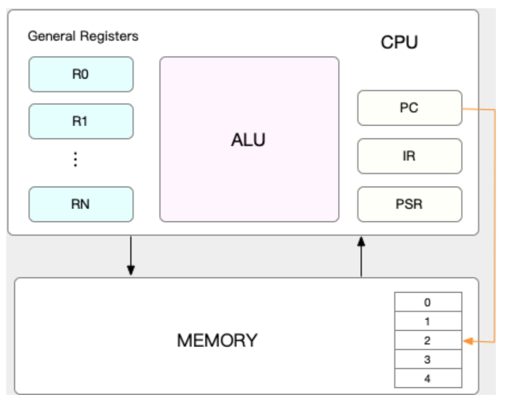

- 上下文切换，会把 CPU 时间消耗在寄存器、内核栈以及虚拟内存等数据的保存和恢复
- 上下文切换3场景
  - 进程上下文切换
    - 进程是由内核来管理和调度的，进程的切换只能发生在内核态。
    - 进程的上下文不仅包括了虚拟内存、栈、全局变量等用户空间的资源，还包括了内核堆栈、寄存器等内核空间的状态。
    - 什么时候发生
      - CPU时间片耗尽
      - 进程系统资源不足，如内存
      - 主动sleep
      - 高优先级进程
      - 硬件中断
  - 线程上下文切换
    - 前后两个线程属于同一个进程，虚拟内存是共享的，不用保存和恢复新的虚拟内存。
  - 中断上下文切换
    - 中断处理比进程拥有更高的优先级
    - 不涉及进程的用户态
- vmstat (Virtual Meomory Statistics) 分析系统的内存，也可以分析上下文切换和中断的次数

```shell
# 每隔 5 秒输出 1 组数据
$ vmstat 5
procs -----------memory---------- ---swap-- -----io---- -system--  ------cpu-----
 r  b   swpd   free   buff  cache   si   so    bi    bo   in   cs   us sy id wa st
 0  0      0 7005360  91564 818900   0    0     0     0   25   33   0  0 100  0  0


```

- 
  - cs（context switch）是每秒上下文切换的次数。
  - in（interrupt）则是每秒中断的次数。
  - r（Running or Runnable）是就绪队列的长度，也就是正在运行和等待 CPU 的进程数。
  - b（Blocked）则是处于不可中断睡眠状态的进程数。

- 查看每个进程的上下文切换

  ```shell
  # 每隔 5 秒输出 1 组数据
  $ pidstat -w 5
  Linux 4.15.0 (ubuntu)  09/23/18  _x86_64_  (2 CPU)
  08:18:26      UID       PID   cswch/s nvcswch/s  Command
  08:18:31        0         1      0.20      0.00  systemd
  08:18:31        0         8      5.40      0.00  rcu_sched
  ...
  ```

  - cswch 每秒自愿上下文切换（voluntary context switches）的次数。进程无法获取所需资源，比如I/O、内存不足
  -  nvcswch 每秒非自愿上下文切换（non voluntary context switches）的次数。被系统强制调度，比如时间片已到

- 案例分析：以 10 个线程运行 5 分钟的基准测试，模拟多线程切换的问题

  ```shell
  # 以 10 个线程运行 5 分钟的基准测试，模拟多线程切换的问题
  $ sysbench --threads=10 --max-time=300 threads run
  
  # 每隔 1 秒输出 1 组数据（需要 Ctrl+C 才结束）
  $ vmstat 1
  procs -----------memory---------- ---swap-- -----io---- -system--       ------cpu-----
   r  b   swpd   free   buff  cache   si   so    bi    bo   in    cs       us sy id wa st
   6  0      0 6487428 118240 1292772    0    0     0   0   9019  1398830  16 84  0  0  0
   8  0      0 6487428 118240 1292772    0    0     0   0   10191 1392312  16 84  0  0  0
  ```

  - cs 列的上下文切换次数从之前的 35 骤然上升到了 139 万。

  - r 列：就绪队列的长度已经到了 8，远远超过了系统 CPU 的个数 2，存在大量的 CPU 竞争
  - us（user）和 sy（system）列：这两列的 CPU 使用率加起来上升到了 100%，其中系统 CPU 使用率，也就是 sy 列高达 84%，说明 CPU 主要是被内核占用了。
  - in 列：中断次数也上升到了 1 万左右，说明中断处理也是个潜在的问题。

- 什么原因导致的，需要查看 CPU 和进程上下文切换的情况?

```shell
# 每隔 1 秒输出 1 组数据（需要 Ctrl+C 才结束）
# -w 参数表示输出进程切换指标，而 -u 参数则表示输出 CPU 使用指标
$ pidstat -w -u 1
08:06:33      UID       PID    %usr %system  %guest   %wait    %CPU   CPU  Command
08:06:34        0     10488   30.00  100.00    0.00    0.00  100.00     0  sysbench
08:06:34        0     26326    0.00    1.00    0.00    0.00    1.00     0  kworker/u4:2
 
08:06:33      UID       PID   cswch/s nvcswch/s  Command
08:06:34        0         8     11.00      0.00  rcu_sched
08:06:34        0        16      1.00      0.00  ksoftirqd/1
08:06:34        0       471      1.00      0.00  hv_balloon
08:06:34        0      1230      1.00      0.00  iscsid
08:06:34        0      4089      1.00      0.00  kworker/1:5
08:06:34        0      4333      1.00      0.00  kworker/0:3
08:06:34        0     10499      1.00    224.00  pidstat
08:06:34        0     26326    236.00      0.00  kworker/u4:2
08:06:34     1000     26784    223.00      0.00  sshd
```

- 

  - CPU 使用率高是 sysbench 
  - 非自愿上下文切换频率最高的 pidstat 
  - 自愿上下文切换频率最高的内核线程 kworker 和 sshd
  - 上下文切换数量和百万的数量对不上
    - pidstat 默认显示进程指标，加上 -t 参数后，输出线程指标。

  ```shell
  # 每隔 1 秒输出一组数据（需要 Ctrl+C 才结束）
  # -wt 参数表示输出线程的上下文切换指标
  $ pidstat -wt 1
  08:14:05      UID      TGID       TID   cswch/s nvcswch/s  Command
  ...
  08:14:05        0     10551         -      6.00      0.00  sysbench
  08:14:05        0         -     10551      6.00      0.00  |__sysbench
  08:14:05        0         -     10552  18911.00 103740.00  |__sysbench
  08:14:05        0         -     10553  18915.00 100955.00  |__sysbench
  08:14:05        0         -     10554  18827.00 103954.00  |__sysbench
  ...
  ```

  

- 什么类型的中断导致in上升1W

  - /proc/interrupts 看看这个文件的变化，看看哪种类型的中断变化最快
  - RES 重调度中断（Rescheduling interrupts)，唤醒空闲状态的 CPU 来调度新的任务运行。

  ```shell
  # -d 参数表示高亮显示变化的区域
  $ watch -d cat /proc/interrupts
             CPU0       CPU1
  ...
  RES:    2450431    5279697   Rescheduling interrupts
  ...
  ```

  

- 每秒上下文切换多少次才算正常呢？
  - 取决于CPU 性能
  - 经验：上下文切换次数稳定在数百到一万
  - 排查方向：
    - 自愿cs：等待资源，IO问题
    - 非自愿cs：强制调度，争CPU
    - 中断次数多不多


## 3 CPU使用率

**最容易想到的应该是 CPU 使用率**，这也是实际环境中最常见的一个性能指标。

CPU 使用率描述了非空闲时间占总 CPU 时间的百分比，根据 CPU 上运行任务的不同，又被分为用户 CPU、系统 CPU、等待 I/O CPU、软中断和硬中断等。

- 用户 CPU 使用率，包括用户态 CPU 使用率（user）和低优先级用户态 CPU 使用率（nice），表示 CPU 在用户态运行的时间百分比。用户 CPU 使用率高，通常说明有应用程序比较繁忙。
- 系统 CPU 使用率，表示 CPU 在内核态运行的时间百分比（不包括中断）。系统 CPU 使用率高，说明内核比较繁忙。
- 等待 I/O 的 CPU 使用率，通常也称为 iowait，表示等待 I/O 的时间百分比。iowait 高，通常说明系统与硬件设备的 I/O 交互时间比较长。
- 软中断和硬中断的 CPU 使用率，分别表示内核调用软中断处理程序、硬中断处理程序的时间百分比。它们的使用率高，通常说明系统发生了大量的中断。
- 除了上面这些，还有在虚拟化环境中会用到的窃取 CPU 使用率（steal）和客户 CPU 使用率（guest），分别表示被其他虚拟机占用的 CPU 时间百分比，和运行客户虚拟机的 CPU 时间百分比。

**平均负载（Load Average）**，也就是系统的平均活跃进程数。它反应了系统的整体负载情况，主要包括三个数值，分别指过去 1 分钟、过去 5 分钟和过去 15 分钟的平均负载。

理想情况下，平均负载等于逻辑 CPU 个数，这表示每个 CPU 都恰好被充分利用。如果平均负载大于逻辑 CPU 个数，就表示负载比较重了。

**进程上下文切换**，包括：

- 无法获取资源而导致的自愿上下文切换；
- 被系统强制调度导致的非自愿上下文切换。

**CPU 缓存的命中率**。由于 CPU 发展的速度远快于内存的发展，CPU 的处理速度就比内存的访问速度快得多。这样，CPU 在访问内存的时候，免不了要等待内存的响应。为了协调这两者巨大的性能差距，CPU 缓存（通常是多级缓存）就出现了。

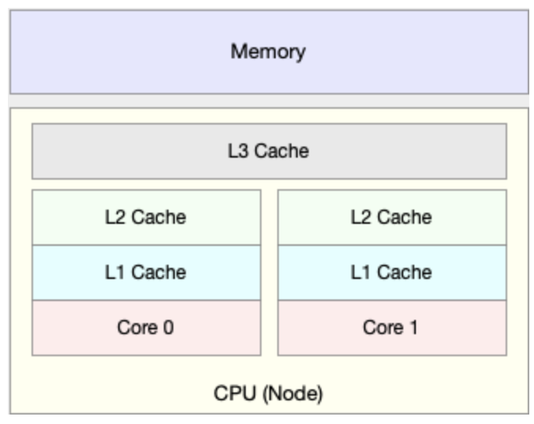

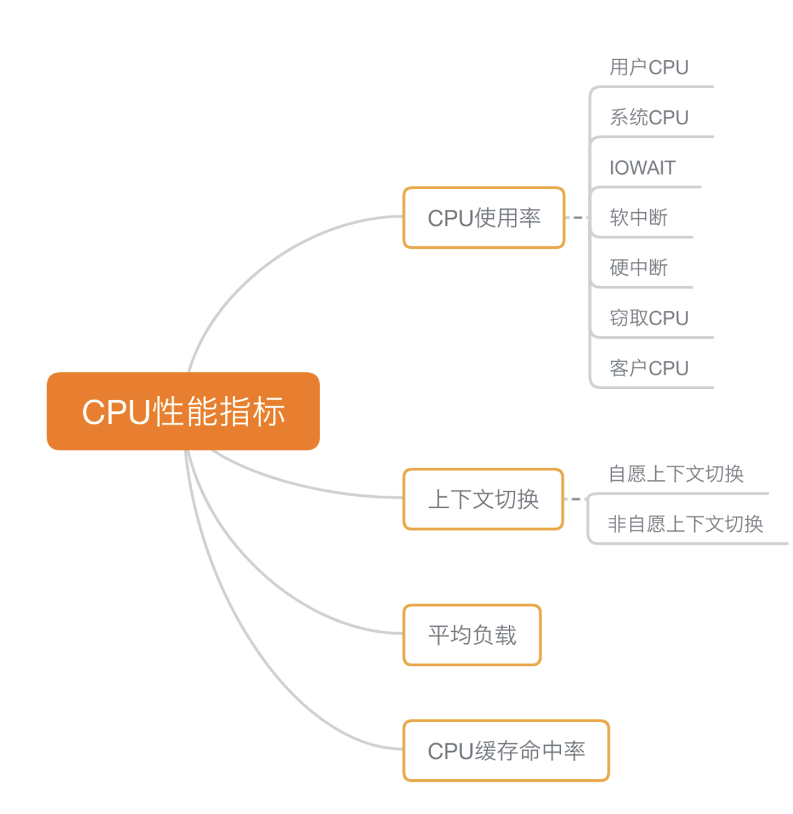

**回顾一下 CPU 性能工具。**

首先，平均负载的案例。我们先用 uptime， 查看了系统的平均负载；而在平均负载升高后，又用 mpstat 和 pidstat ，分别观察了每个 CPU 和每个进程 CPU 的使用情况，进而找出了导致平均负载升高的进程，也就是我们的压测工具 stress。

第二个，上下文切换的案例。我们先用 vmstat ，查看了系统的上下文切换次数和中断次数；然后通过 pidstat ，观察了进程的自愿上下文切换和非自愿上下文切换情况；最后通过 pidstat ，观察了线程的上下文切换情况，找出了上下文切换次数增多的根源，也就是我们的基准测试工具 sysbench。

第三个，进程 CPU 使用率升高的案例。我们先用 top ，查看了系统和进程的 CPU 使用情况，发现 CPU 使用率升高的进程是 php-fpm；再用 perf top ，观察 php-fpm 的调用链，最终找出 CPU 升高的根源，也就是库函数 sqrt() 。

第四个，系统的 CPU 使用率升高的案例。我们先用 top 观察到了系统 CPU 升高，但通过 top 和 pidstat ，却找不出高 CPU 使用率的进程。于是，我们重新审视 top 的输出，又从 CPU 使用率不高但处于 Running 状态的进程入手，找出了可疑之处，最终通过 perf record 和 perf report ，发现原来是短时进程在捣鬼。

对于短时进程，我还介绍了一个专门的工具 execsnoop，它可以实时监控进程调用的外部命令。

第五个，不可中断进程和僵尸进程的案例。我们先用 top 观察到了 iowait 升高的问题，并发现了大量的不可中断进程和僵尸进程；接着我们用 dstat 发现是这是由磁盘读导致的，于是又通过 pidstat 找出了相关的进程。但我们用 strace 查看进程系统调用却失败了，最终还是用 perf 分析进程调用链，才发现根源在于磁盘直接 I/O 。

最后一个，软中断的案例。我们通过 top 观察到，系统的软中断 CPU 使用率升高；接着查看 /proc/softirqs， 找到了几种变化速率较快的软中断；然后通过 sar 命令，发现是网络小包的问题，最后再用 tcpdump ，找出网络帧的类型和来源，确定是一个 SYN FLOOD 攻击导致的。

### 把性能指标和性能工具联系起来

**第一个维度，从 CPU 的性能指标出发。也就是说，当你要查看某个性能指标时，要清楚知道哪些工具可以做到**。

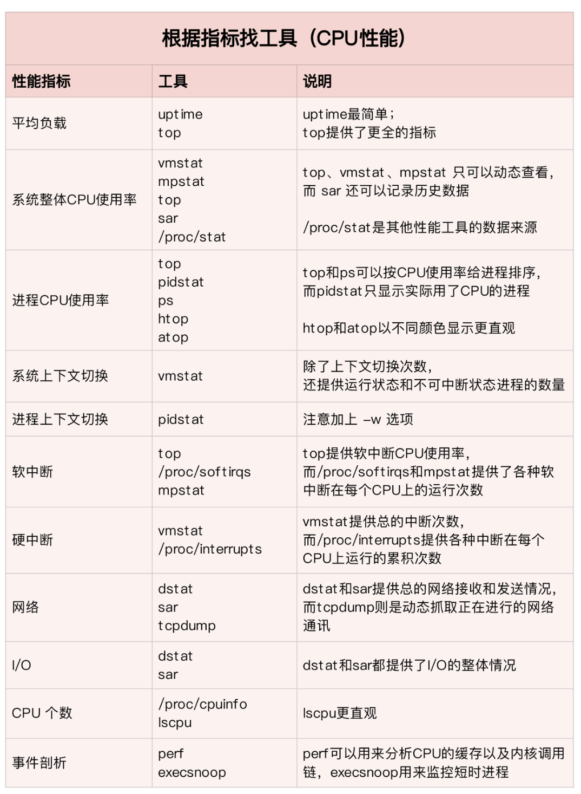

**第二个维度，从工具出发。也就是当你已经安装了某个工具后，要知道这个工具能提供哪些指标**。

真正要用到的时候， 通过 man 命令，查它们的使用手册就可以了。

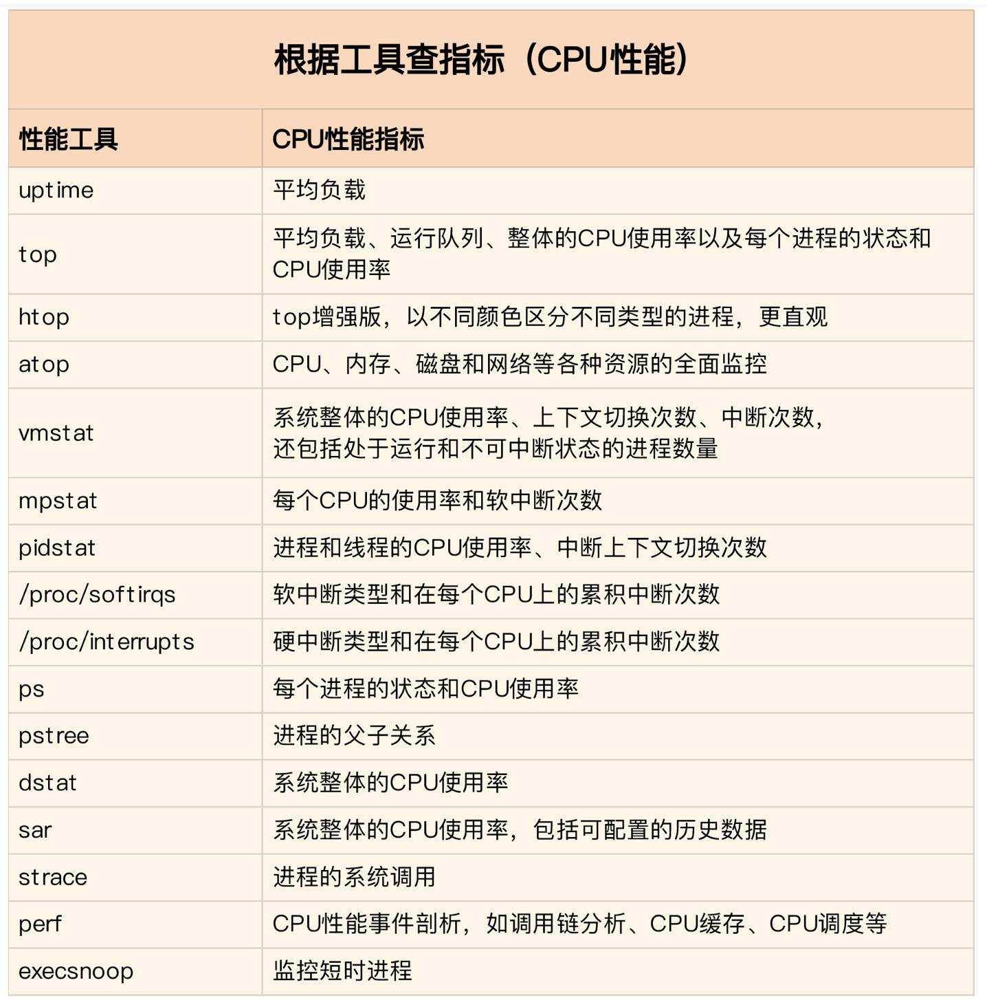

**想弄清楚性能指标的关联性，就要通晓每种性能指标的工作原理**。这也是为什么我在介绍每个性能指标时，都要穿插讲解相关的系统原理，希望你能记住这一点。

举个例子，用户 CPU 使用率高，我们应该去排查进程的用户态而不是内核态。因为用户 CPU 使用率反映的就是用户态的 CPU 使用情况，而内核态的 CPU 使用情况只会反映到系统 CPU 使用率上。

你看，有这样的基本认识，我们就可以缩小排查的范围，省时省力。

所以，为了**缩小排查范围，我通常会先运行几个支持指标较多的工具，如 top、vmstat 和 pidstat** 。为什么是这三个工具呢？仔细看看下面这张图，你就清楚了。

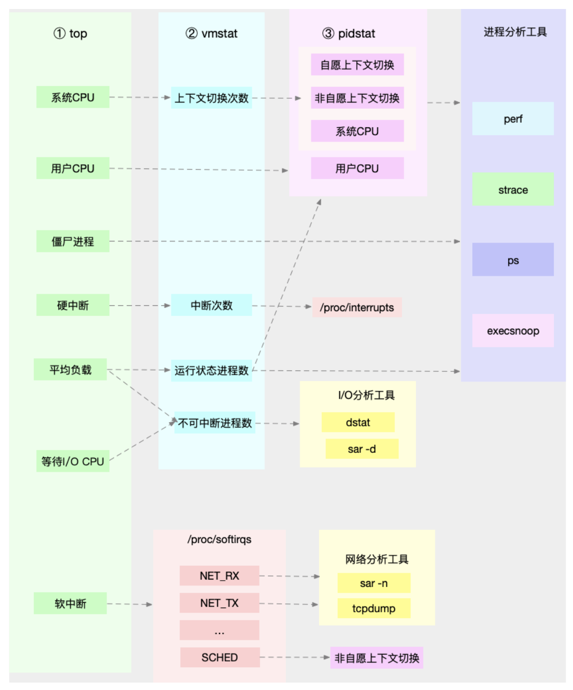


## 4 软中断

- 中断，异步的事件处理机制，提高并发。

- 中断处理程序在响应中断时，临时关闭中断。其他中断不能响应，中断有可能会丢失。

- 解决中断处理程序执行过长和中断丢失

  - 上半部，硬中断，处理硬件请求，快速执行
  - 下半部，软中断，异步处理上半部未完成的工作，由内核触发，延迟执行

  > 每个 CPU 对应一个软中断内核线程，0 号 CPU 的软中断内核线程的名字就是 ksoftirqd/0。

- 软中断包括：网络收发、定时、内核调度、RCU 锁（Read-Copy Update）

  - /proc/softirqs 软中断
  - /proc/interrupts 硬中断

- 例子：网卡接收数据包，**硬件中断**方式，通知内核有新的数据到了。内核就应该调用中断处理程序来响应它。

  - 上半部，快速处理，把网卡的数据读到内存中，更新硬件寄存器的状态（表示数据已经读好了），发送**软中断**信号，通知下半部。
  - 下半部，得到通知，从内存找到网络数据，按照网络协议栈，对数据解析，给应用程序。

- 软中断内容解析

  ```shell
  $ cat /proc/softirqs
                      CPU0       CPU1
            HI:          0          0
         TIMER:     811613    1972736
        NET_TX:         49          7
        NET_RX:    1136736    1506885
         BLOCK:          0          0
      IRQ_POLL:          0          0
       TASKLET:     304787       3691
         SCHED:     689718    1897539
       HRTIMER:          0          0
           RCU:    1330771    1354737
  ```

  - NET_RX 表示网络接收中断，而 NET_TX 表示网络发送中断。
  - 同一种中断在不同 CPU 的累积次数的数量级相同。

- 查看CPU软中断内核线程的运行状况

  ```shell
  $ ps aux | grep softirq
  root         7  0.0  0.0      0     0 ?        S    Oct10   0:01 [ksoftirqd/0]
  root        16  0.0  0.0      0     0 ?        S    Oct10   0:01 [ksoftirqd/1]
  ```

  


## 5 Linux 文件系统

- 一切皆文件

- 为了降低慢速磁盘对性能的影响，文件系统通过页缓存、目录项缓存以及索引节点缓存，缓和磁盘延迟对应用程序的影响。

- 每个文件，两个数据结构

  - 索引节点（index node），inode，文件的元信息，比如 inode 编号、文件大小、访问权限、修改日期、数据的位置（占用磁盘空间）
  - 目录项（directory entry），记录文件的名字、索引节点指针以及与其他目录项的关联关系。（内存数据结构，别名：目录项缓存）

- 文件数据到底是怎么存储的呢？

  - 磁盘读写的最小单位是扇区，512Bytes
  - 逻辑块是4KB，8个连续扇区
  - 为了协调慢速磁盘与快速 CPU 的性能差异，文件内容会缓存到页缓存 Cache 中
  - 索引节点也会缓存到内存中，加速文件的访问。
  - 磁盘格式化，三个存储区域
    - 超级块，存储整个文件系统的状态。
    - 索引节点区，用来存储索引节点。
    - 数据块区，则用来存储文件数据。

  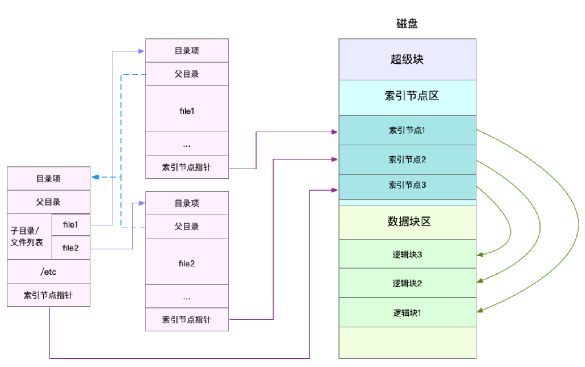

- Linux 文件系统的架构图

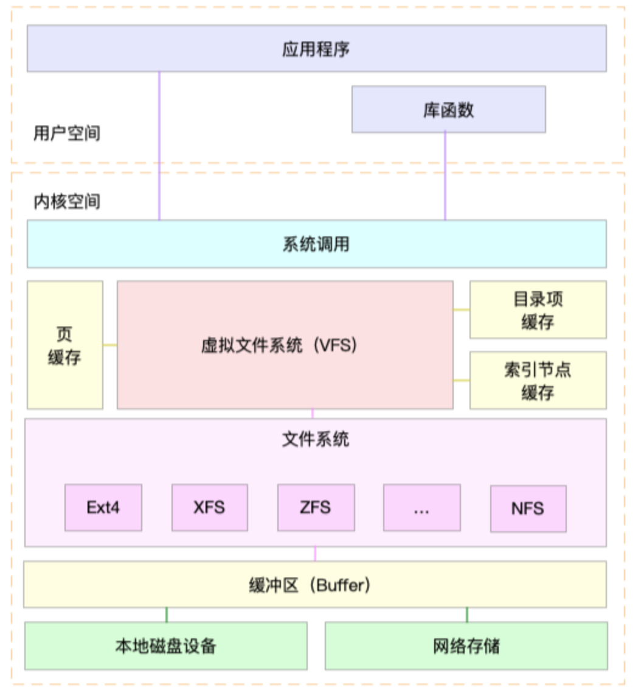

- Linux 采用多种缓存机制，来优化 I/O 的效率

  - 页缓存、索引节点缓存、目录项缓存：为了优化文件（VFS)访问的性能，采用多种缓存机制，减少对下层块设备的直接调用。
  - 缓冲区：为了优化块设备(比如本地磁盘设备和网络存储)的访问效率，使用**缓冲区**来缓存块设备的数据。

- 文件系统分类

  - 基于磁盘的文件系统：磁盘挂载
  - 基于内存的文件系统：/proc 、/sys 文件系统
  - 网络文件系统，比如 NFS、SMB、iSCSI 等。

- 文件系统IO

  - 是否利用标准库缓存

    - 缓冲 I/O，是指利用标准库缓存来加速文件的访问，而标准库内部再通过系统调度访问文件。
    - 非缓冲 I/O，是指直接通过系统调用来访问文件，不再经过标准库缓存。

  - 是否利用操作系统的页缓存

    - 直接 I/O，是指跳过操作系统的页缓存，直接跟文件系统交互来访问文件。（系统调用指定 O_DIRECT 标志）
    - 非直接 I/O 正好相反，文件读写时，先要经过系统的页缓存，然后再由内核或额外的系统调用，真正写入磁盘。（默认）

  - 是否阻塞程序运行

    - 阻塞 I/O，是指应用程序执行 I/O 操作后，如果没有获得响应，就会阻塞当前线程，自然就不能执行其他任务。

    - 非阻塞 I/O，是指应用程序执行 I/O 操作后，不会阻塞当前的线程，可以继续执行其他的任务，随后再通过轮询或者事件通知的形式，获取调用的结果。

    - > 访问管道或者网络套接字时，设置 O_NONBLOCK 标志，就表示用非阻塞方式访问；默认是阻塞访问。

  - 是否等待响应结果

    - 同步 I/O，是指应用程序执行 I/O 操作后，要一直等到整个 I/O 完成后，才能获得 I/O 响应。

    - 异步 I/O，是指应用程序执行 I/O 操作后，不用等待完成和完成后的响应，而是继续执行就可以。等到这次 I/O 完成后，响应会用事件通知的方式，告诉应用程序。

    - > 在操作文件时，如果你设置了 O_SYNC 或者 O_DSYNC 标志，就代表同步 I/O。
      >
      > 如果设置了 O_DSYNC，就要等文件数据写入磁盘后，才能返回；
      >
      > 而 O_SYNC，则是在 O_DSYNC 基础上，要求文件元数据也要写入磁盘后，才能返回。

    - > 在访问管道或者网络套接字时，设置了 O_ASYNC 选项后，相应的 I/O 就是异步 I/O。这样，内核会再通过 SIGIO 或者 SIGPOLL，来通知进程文件是否可读写。

- 监测命令

  - 看磁盘类型：`lsblk`
  -  看磁盘各个盘占用情况： `df -h -a`
  - ` df -h /dev/sda1 `
  - `df -i /dev/sda1 `:索引节点iNode的容量

  ```shell
  $ df -i /dev/sda1 
  Filesystem      Inodes  IUsed   IFree IUse% Mounted on 
  /dev/sda1      3870720 157460 3713260    5% /     # Inodes个数
  ```

- 缓存

  - free 输出的 Cache，是页缓存和可回收 Slab 缓存的和，你可以从 /proc/meminfo ，直接得到它们的大小：

    ```shel
    cat /proc/meminfo | grep -E "SReclaimable|Cached" 
    Cached:           748316 kB 
    SwapCached:            0 kB 
    SReclaimable:     179508 kB 
    ```

  - 内核使用 Slab 机制，管理目录项和索引节点的缓存。/proc/meminfo 只给出了 Slab 的整体大小，具体到每一种 Slab 缓存，还要查看 /proc/slabinfo 这个文件。

  -  slabtop ，找到占用内存最多的缓存类型。

    - dentry 行表示目录项缓存
    - inode_cache 行，表示 VFS 索引节点缓存

    ```shell
    # 按下 c 按照缓存大小排序，按下 a 按照活跃对象数排序 
    $ slabtop 
    Active / Total Objects (% used)    : 277970 / 358914 (77.4%) 
    Active / Total Slabs (% used)      : 12414 / 12414 (100.0%) 
    Active / Total Caches (% used)     : 83 / 135 (61.5%) 
    Active / Total Size (% used)       : 57816.88K / 73307.70K (78.9%) 
    Minimum / Average / Maximum Object : 0.01K / 0.20K / 22.88K 
     
      OBJS ACTIVE  USE OBJ SIZE  SLABS OBJ/SLAB CACHE SIZE NAME 
    69804  23094   0%    0.19K   3324       21     13296K dentry 
    16380  15854   0%    0.59K   1260       13     10080K inode_cache 
    58260  55397   0%    0.13K   1942       30      7768K kernfs_node_cache 
       485    413   0%    5.69K     97        5      3104K task_struct 
      1472   1397   0%    2.00K     92       16      2944K kmalloc-2048 
    # 目录项和索引节点占用了最多的 Slab 缓存,共23M
    ```

### 磁盘性能指标

- 基本指标
  - 使用率，磁盘处理 I/O 的时间百分比。过高的使用率（> 80%），I/O 存在瓶颈。
  - 饱和度，磁盘处理 I/O 的繁忙程度。当饱和度为 100% 时，磁盘无法接受新的 I/O 请求。
  - IOPS（Input/Output Per Second），每秒的 I/O 请求数。
  - 吞吐量，每秒的 I/O 请求大小。
  - 响应时间， I/O 请求从发出到收到响应的间隔时间。

  > 在数据库、大量小文件等随机读写比较多的场景，IOPS 更能反映系统的整体性能；
  >
  > 在多媒体等顺序读写较多的场景中，吞吐量更能反映系统的整体性能。

- 基准测试: 用`fio`

- I/O 观测: 用`iostat` （原始数据来自`/proc/diskstats`）

  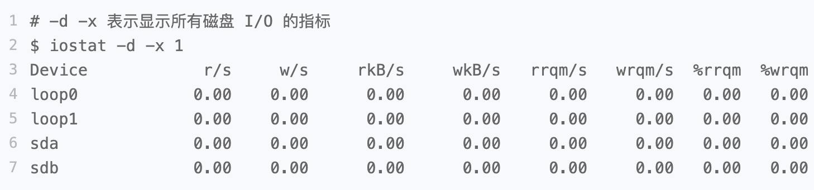

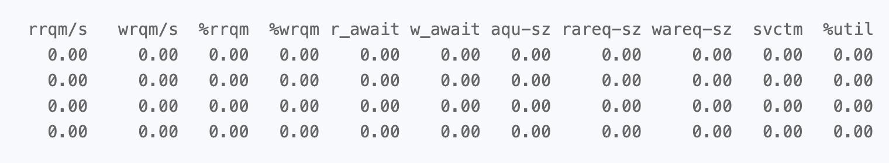

- 每个指标含义都很重要
  - %util ，磁盘 I/O 使用率
  - r/s+ w/s ， IOPS
  - rkB/s+wkB/s ，吞吐量
  - r_await+w_await ，响应时间
  - 不能直接得到磁盘饱和度

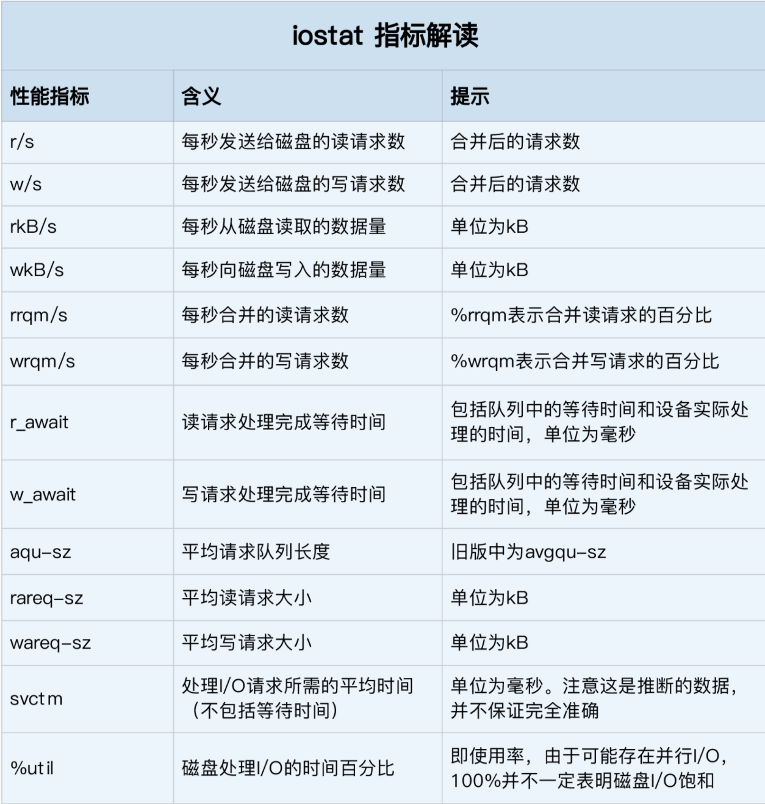

### 进程 I/O 观测

- 进程的 I/O 情况，使用 `pidstat 和 iotop `

```shell
$ pidstat -d 1 
13:39:51      UID       PID   kB_rd/s   kB_wr/s kB_ccwr/s iodelay  Command 
13:39:52      102       916      0.00      4.00      0.00       0  rsyslogd
```

- pidstat
  - 用户 ID（UID）和进程 ID（PID） 。
  - 每秒读取的数据大小（kB_rd/s）
  - 每秒发出的写请求数据大小（kB_wr/s）
  - 每秒取消的写请求数据大小（kB_ccwr/s） 
  - 块 I/O 延迟（iodelay），包括等待同步块 I/O 和换入块 I/O 结束的时间，单位是时钟周期。

```shell
$ iotop
Total DISK READ :       0.00 B/s | Total DISK WRITE :       7.85 K/s 
Actual DISK READ:       0.00 B/s | Actual DISK WRITE:       0.00 B/s 
  TID  PRIO  USER     DISK READ  DISK WRITE  SWAPIN     IO>       COMMAND 
15055  be/3  root     0.00 B/s    7.85 K/s    0.00 %    0.00 %    [systemd-journald]
```

- iotop:按照 I/O 大小对进程排序
  - 第1行：进程的磁盘读写大小总数
  - 第2行：磁盘真实的读写大小总数（因为缓存、缓冲区、I/O 合并等因素的影响，它们可能并不相等）
  - TID:线程 ID
  - PRIO:I/O 优先级
  - DISK READ:每秒读磁盘的大小
  - DISK WRITE: 每秒写磁盘的大小
  - SWAPIN: 换入 I/O 的时钟百分比
  - IO>: 等待IO的时钟百分比

### 案例分析

如何观察系统有没有性能问题， 哪些资源是瓶颈？CPU、内存和磁盘 I/O 等

- 套路：

  -  top ，观察 CPU 和内存的使用
  -  iostat ，观察磁盘的 I/O 

- top 观察 CPU 和内存的使用

  ```bash
  # 按 1 切换到每个 CPU 的使用情况 
  $ top 
  top - 14:43:43 up 1 day,  1:39,  2 users,  load average: 2.48, 1.09, 0.63 
  Tasks: 130 total,   2 running,  74 sleeping,   0 stopped,   0 zombie 
  %Cpu0  :  0.7 us,  6.0 sy,  0.0 ni,  0.7 id, 92.7 wa,  0.0 hi,  0.0 si,  0.0 st 
  %Cpu1  :  0.0 us,  0.3 sy,  0.0 ni, 92.3 id,  7.3 wa,  0.0 hi,  0.0 si,  0.0 st 
  KiB Mem :  8169308 total,   747684 free,   741336 used,  6680288 buff/cache 
  KiB Swap:        0 total,        0 free,        0 used.  7113124 avail Mem 
   
    PID USER      PR  NI    VIRT    RES    SHR S  %CPU %MEM     TIME+ COMMAND 
  18940 root      20   0  656108 355740   5236 R   6.3  4.4   0:12.56 python 
  1312 root      20   0  236532  24116   9648 S   0.3  0.3   9:29.80 python3 
  ```

  - CPU：CPU0 的使用率非常高，sys cpu为 6%，iowait 超过了 90%，说明CPU0 可能正在运行 I/O 密集型
    - python 进程的 CPU 使用率已经达到了 6%， python进程可疑，待排查
  - MEM: 总内存 8G，剩余内存只有 730 MB，而 Buffer/Cache 占用内存高达 6GB 之多，说明内存被缓存占用（如何了解缓存被谁用了）

- iostat观察磁盘的 I/O 

  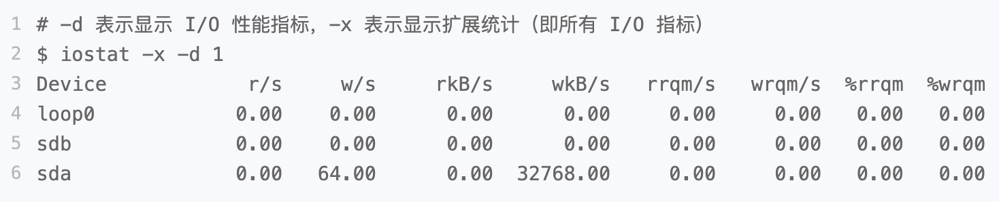

  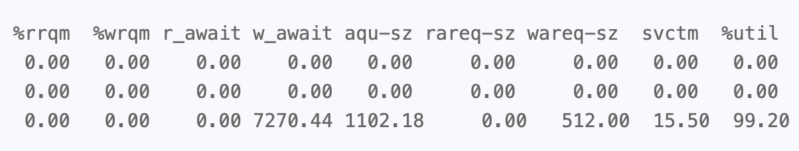
	- 磁盘 sda 的 I/O 使用率(%util)已经高达 99%
	- 每秒写磁盘请求数是 64 ，写大小是 32 MB，写请求的响应时间为 7 秒，而请求队列长度则达到了 1100。
	- 说明，sda磁盘严重性能瓶颈，CPU方面的 iowait 高达 90% 了，正是磁盘 sda 的 I/O 瓶颈导致的。

- pidstat 寻找 I/O 请求相关进程

  ```bash
  $ pidstat -d 1 # pidstat 加上 -d 参数，就可以显示每个进程的 I/O 情况。
   
  15:08:35      UID       PID   kB_rd/s   kB_wr/s kB_ccwr/s iodelay  Command 
  15:08:36        0     18940      0.00  45816.00      0.00      96  python 
   
  15:08:36      UID       PID   kB_rd/s   kB_wr/s kB_ccwr/s iodelay  Command 
  15:08:37        0       354      0.00      0.00      0.00     350  jbd2/sda1-8 
  15:08:37        0     18940      0.00  46000.00      0.00      96  python 
  15:08:37        0     20065      0.00      0.00      0.00    1503  kworker/u4:2 
  ```

  - python进程每秒写的数据超过 45 MB，比上面 iostat 发现的 32MB 的结果还要大

- python 进程到底在写什么？strace

  - 读写文件必须通过系统调用完成。

  ```bash
  $ strace -p 18940 # 通过 -p 18940 指定 python 进程的 PID 号
  strace: Process 18940 attached 
  ...
  mmap(NULL, 314576896, PROT_READ|PROT_WRITE, MAP_PRIVATE|MAP_ANONYMOUS, -1, 0) = 0x7f0f7aee9000 
  mmap(NULL, 314576896, PROT_READ|PROT_WRITE, MAP_PRIVATE|MAP_ANONYMOUS, -1, 0) = 0x7f0f682e8000 
  write(3, "2018-12-05 15:23:01,709 - __main"..., 314572844 
  ) = 314572844 
  munmap(0x7f0f682e8000, 314576896)       = 0 
  write(3, "\n", 1)                       = 1 
  munmap(0x7f0f7aee9000, 314576896)       = 0 
  close(3)                                = 0 
  stat("/tmp/logtest.txt.1", {st_mode=S_IFREG|0644, st_size=943718535, ...}) = 0 
  ```

  - 从 write() 系统调用上，进程向文件描述符编号为 3 的文件中，写入了 314572844 bytes (300MB) 的数据。
  - stat() 调用，正在获取 /tmp/logtest.txt.1 的状态

-  lsof 用来查看进程打开文件列表，包括了目录、块设备、动态库、网络套接字等。

  ```bash
  $ lsof -p 18940 
  COMMAND   PID USER   FD   TYPE DEVICE  SIZE/OFF    NODE NAME 
  python  18940 root  cwd    DIR   0,50      4096 1549389 / 
  python  18940 root  rtd    DIR   0,50      4096 1549389 / 
  … 
  python  18940 root    2u   CHR  136,0       0t0       3 /dev/pts/0 
  python  18940 root    3w   REG    8,1 117944320     303 /tmp/logtest.txt 
  
  ```

  - FD 表示文件描述符号
  - TYPE 表示文件类型
  - NAME 表示文件路径
  - 进程打开了文件 `/tmp/logtest.txt`，并且它的文件描述符是 3 号，而 3 后面的 w ，表示以写的方式打开。

  > 综合strace的结果来看，进程 18940 以每次 300MB 的速度写日志，而日志文件是 /tmp/logtest.txt。

- 解决方案：分析程序为什么会打大的日志？

  - 生产系统的应用程序，应该有动态调整日志级别的功能
  - 发送日志级别更改信号：`kill -SIGUSR2 18940 `

  ```python
  signal.signal(signal.SIGUSR1, set_logging_info) 
  signal.signal(signal.SIGUSR2, set_logging_warning) 
  ```

  - 最后，再次验证系统是否正常。

