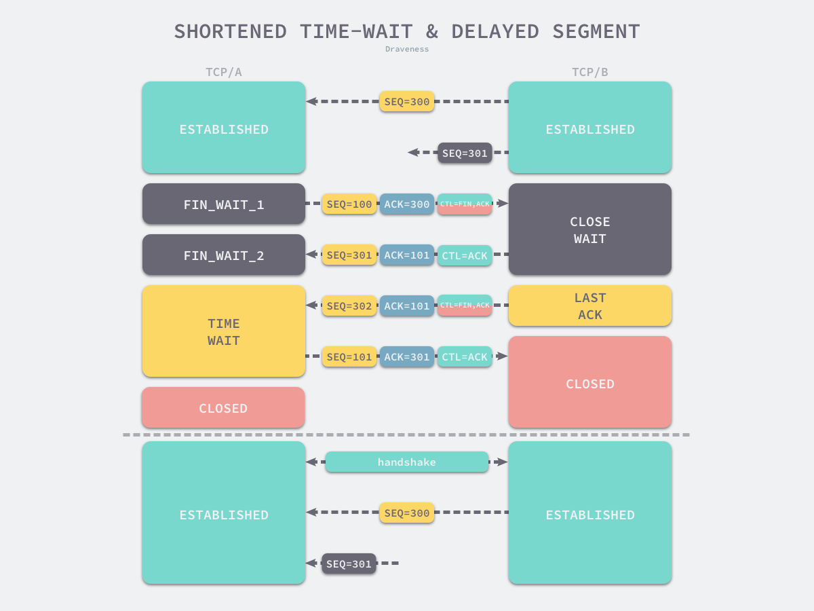
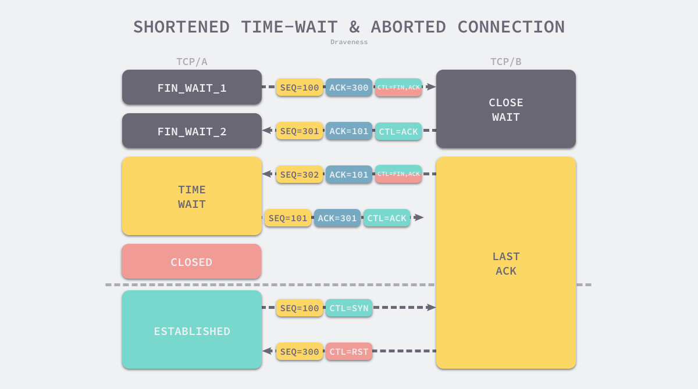
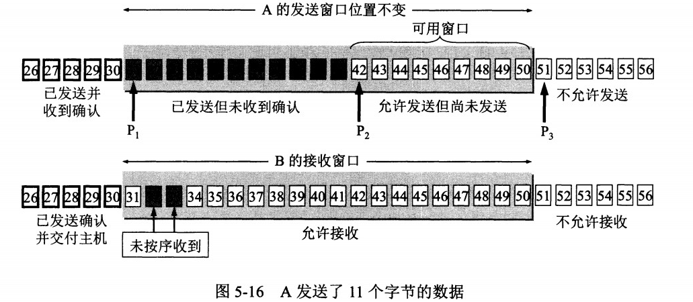
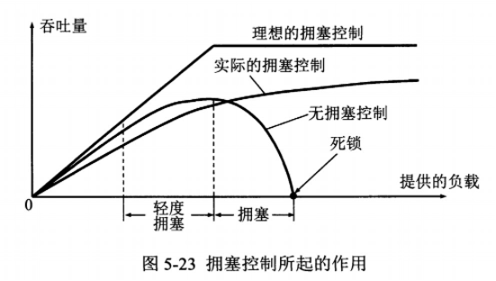
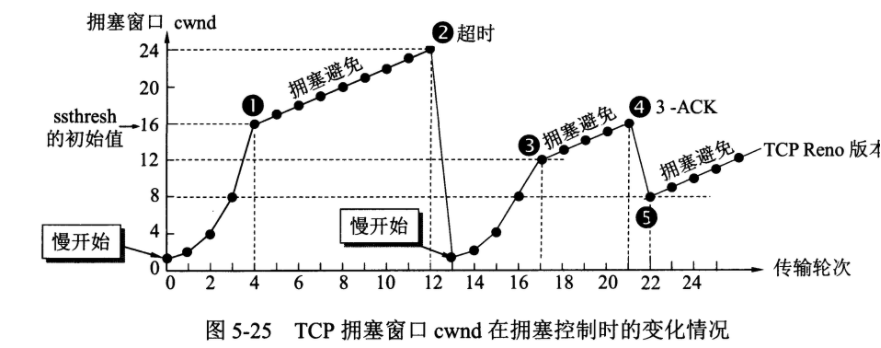

0基础知识

### 1 Linux 进程线程

1. 是什么，区别？
   - 进程是资源分配的最小单位
   - 线程是CPU调度的最小单位。
   - 从系统开销来看，哪个大
2. 进程的状态和操作系统是如何调度的，有哪些调度算法？
   - 有5种状态，能否解释一下僵尸进程是如何产生的，孤儿进程是如何产生的。
   - 先来先服务，短作业有限，时间片，优先级
3. 进程间如何通信？线程呢？
   - 进程有很多：共享内存、消息队列、pipe、Socket、共享存储、信号量
   - 线程：共享内存，尤其是在Java里面

### 2 Linux内存管理

管什么？物理内存和虚拟内存。

虚拟内存是什么，用来做什么？磁盘的一块区域，有最大的大小限制。目的是扩大整个逻辑内存。

操作系统是怎么管理程序的？给程序分配地址空间，每一个就是一页，把页映射到物理内存和虚拟内存。程序运行的时候，会引用数据，这个数据如果在物理内存页，则直接运行；如果在虚拟内存页，就把虚拟内存的内容置换到物理内存，然后运行（缺页）。

> 在程序运行过程中，如果要访问的页面不在内存中，就发生缺页中断从而将该页调入内存中。此时如果内存已无空闲空间，系统必须从内存中调出一个页面到磁盘对换区中来腾出空间。

- 页面置换算法干什么用？尽可能减少虚拟内存和物理内存的置换。其中有名的就是LRU。

### 3 为什么 TCP 建立连接需要三次握手

先说答案：通过三次握手才能阻止重复历史连接的初始化，导致混乱。

将重点放到为什么需要 TCP 建立连接需要**『三次握手』**，而*不仅仅*是为什么需要**『三次』**握手。

- 我们对于『什么是连接』真的清楚？只有知道**连接的定义**，我们才能去尝试回答为什么 TCP 建立连接需要三次握手。(RFC793翻译过来：用于保证可靠性和流控制机制的信息，包括 Socket、序列号以及窗口大小叫做连接。)
- 到这里，我们将原有的问题转换成了『为什么需要通过三次握手才可以初始化 Sockets、窗口大小和初始序列号？』
  * Socket是建立连接用的
  * 初始序列号 可以用来传输数据的去重、重传等
  * 窗口大小：

使用三次握手和 `RST` 控制消息将是否建立连接的最终控制权交给了发送方，因为只有发送方有足够的上下文来判断当前连接是否是错误的或者过期的，这也是 TCP 使用三次握手建立连接的最主要原因。

> 思考一个问题：为什么DNS查询使用UDP协议？盲猜：历史原因，数据包小，tcp连接消耗太大。不同的实现场景可以用TCP来实现DNS查询。

### 4 为什么TCP协议有Time_Wait状态

> TCP断开连接，一定是从某一端发起的，暂且认为是客户端发起的，因为服务端都是被动的。

使用 TCP 协议通信的双方会在关闭连接时触发 `TIME_WAIT` 状态，关闭连接的操作其实是告诉通信的另一方**自己没有需要发送的数据**，但是它仍然**保持了接收对方数据的能力**，一个常见的关闭连接过程如下[1](https://draveness.me/whys-the-design-tcp-time-wait/#fn:1)：

1. 当客户端没有待发送的数据时，它会向服务端发送 `FIN` 消息，发送消息后会进入 `FIN_WAIT_1` 状态；
2. 服务端接收到客户端的 `FIN` 消息后，会进入 `CLOSE_WAIT` 状态并向客户端发送 `ACK` 消息，客户端接收到 `ACK` 消息时会进入 `FIN_WAIT_2` 状态；
3. 当服务端没有待发送的数据时，服务端会向客户端发送 `FIN` 消息；
4. 客户端接收到 `FIN` 消息后，会进入 `TIME_WAIT` 状态并向服务端发送 `ACK` 消息，服务端收到后会进入 `CLOSED` 状态；
5. 客户端等待**两个最大数据段生命周期**（Maximum segment lifetime，MSL）的时间后也会进入 `CLOSED` 状态；

**图 2 - TCP 关闭连接的过程** 

> 为什么要四次挥手的原因是 TIME WAIT状态为什么要存在。

从上述过程中，我们会发现 `TIME_WAIT` 仅在主动断开连接的一方出现，被动断开连接的一方会直接进入 `CLOSED` 状态，进入 `TIME_WAIT` 的客户端需要等待 2 MSL 才可以真正关闭连接。TCP 协议需要 `TIME_WAIT` 状态的原因和客户端需要等待两个 MSL 不能直接进入 `CLOSED` 状态的原因是一样的[3](https://draveness.me/whys-the-design-tcp-time-wait/#fn:3)：

- 因为数据段的网络传输时间不确定，所以可能会收到上一次 TCP 连接中未被收到的数据段；
- 因为客户端发出的 `ACK` 可能还没有被服务端接收，服务端可能还处于 `LAST_ACK` 状态，所以它会回复 `RST` 消息终止新连接的建立；

参考：[为什么 TCP 协议有 TIME_WAIT 状态](https://draveness.me/whys-the-design-tcp-time-wait/)

### 5 计算机网络-传输层 TCP 拥塞控制

问几个问题：

1. TCP是如何保证可靠传输的？ 它可以超时重传，可以利用seq来判断。
2. 什么是滑动窗口？Client发送方和Server接收方都有一个窗口，来记录缓存。
3. 什么是TCP的流量控制
4. TCP的拥塞控制是为了解决什么问题？用的是什么算法，慢开始--拥塞避免--快重传-快恢复。
5. 
  

> TCP流量控制是控制谁，为了谁好，如何实现的？

它是控制发送方的发送速度，为了接收方来得及接受。

它是通过接收方的窗口字段来告诉发送方的，比如设置为0，表示接收方不接受数据，那么发送方就不会发送数据。

#### TCP拥塞控制解决什么问题？

解决网络出现拥塞的时候，发送方和接收方应该怎么办？

如果网络出现拥塞，分组将会丢失，此时发送方会继续重传，从而导致网络拥塞程度更高。因此当出现拥塞时，应当控制发送方的速率。这一点和流量控制很像，但是出发点不同。

> 注意与流量控制进行区别：流量控制是为了让接收方能来得及接收，而拥塞控制是为了降低整个网络的拥塞程度。

> TCP 主要通过四个算法来进行拥塞控制：慢开始、拥塞避免、快重传、快恢复。

发送方需要维护一个叫做**拥塞窗口（cwnd）的状态变量**，注意拥塞窗口与发送方窗口的区别：拥塞窗口只是一个状态变量，实际决定发送方能发送多少数据的是发送方窗口。

为了便于讨论，做如下假设：

- 接收方有足够大的接收缓存，因此不会发生流量控制；
- 虽然 TCP 的窗口基于字节，但是这里设窗口的大小单位为报文段。

#### 1. 慢开始与拥塞避免（发送方角度）

- 发送的最初执行慢开始，令 cwnd = 1，发送方只能发送 1 个报文段；当收到确认后，将 cwnd 加倍，因此之后发送方能够发送的报文段数量为：2、4、8 ...

- 慢开始每个轮次都将 cwnd 加倍，这样会让 cwnd 增长速度非常快，从而使得发送方发送的速度增长速度过快，网络拥塞的可能性也就更高。设置一个**慢开始门限 ssthresh**，当 cwnd >= ssthresh 时，进入拥塞避免，每个轮次只将 cwnd 加 1。

- 如果出现了超时，则怎么更新**慢开始的门限ssthresh** ？减半。ssthresh = cwnd / 2，然后重新执行慢开始cwnd=1。

#### 2. 快重传与快恢复

- 在接收方，要求每次接收到报文段都应该对最后一个已收到的有序报文段进行确认。例如已经接收到 M1 和 M2，此时收到 M4，应当发送对 M2 的确认。

- 在发送方，如果收到3个重复确认，那么可以知道下一个报文段丢失，此时执行**快重传**，立即重传下一个报文段。例如收到三个 M2，则 M3 丢失，立即重传 M3。（为什么是3个，因为认为报名最多存活2个Maxium Segment Lifetime）

- 在这种情况下，只是丢失个别报文段，而不是网络拥塞。因此执行**快恢复**，(减半慢开始的门限值，并且直接进入拥塞避免)令 ssthresh = cwnd / 2 ，cwnd = ssthresh，注意到此时直接进入拥塞避免。

慢开始和快恢复的快慢指的是 cwnd 的设定值，而不是 cwnd 的增长速率。慢开始 cwnd 设定为 1，而快恢复 cwnd 设定为 ssthresh。