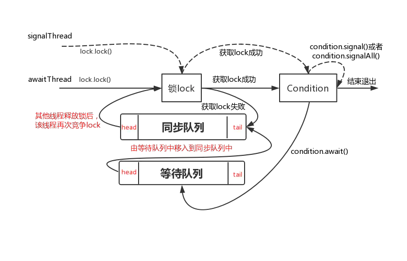

# 1补充题

## 蚂蚁

1. 多线程计算：多线程的交替打印奇偶数；三个线程循环打印ABC；多线程计算1-10000的和。

   > 使用场景：子线程完成了某项任务，需要通知主线程做什么事情；或者线程A完成了某项任务，通知线程B做某些事情。

   - 方式1：等待通知机制是Java中经典的线程通信方式。`notify和wait` （通过synchronized关键字配合wait和notify）
   - 方式2：使用ReentrantLock 和Condition来相互通知
   - 这两种方式都可以防止线程空转。暴力解法就是两个线程一直在running，不停的判断是否是奇偶数，然后决定是否打印。

   有一些需要注意：

   - wait notify调用的前提是获得了对象锁（也可以叫做monitor）
   - 调用wait后，会释放锁，同时把线程进入到`Waiting`状态，该线程被移动到`等待队列`中
   - 调用notify后，会将等待队列里的线程移动到`同步队列`中，线程的状态变成`Blocked`
   - 从wait方法返回的前提是调用了notify方法的线程释放锁，wait方法的线程获得锁。（也就是说wait方法调用后，线程就被阻塞在这里，没有返回。一直在`Waiting`状态）
   - 而ReentrantLock的Condition的await方法：使得当前获取lock的线程进入到等待队列，如果该线程能够从await()方法返回的话一定是该线程获取了与condition相关联的lock。 （我可以理解成，和object.wait一样会释放锁）

> 从整体上来看**Object的wait和notify/notify是与对象监视器配合完成线程间的等待/通知机制，而Condition与Lock配合完成等待通知机制，前者是java底层级别的，后者是语言级别的，具有更高的可控制性和扩展性**。

> 思考：阿里面试题，为什么wait()方法要放在同步块中？
>
> 轻描淡写地说：“这是Java设计者为了避免使用者出现lost wake up问题而搞出来的。”
>
> 举个例子，生产者消费者例子？