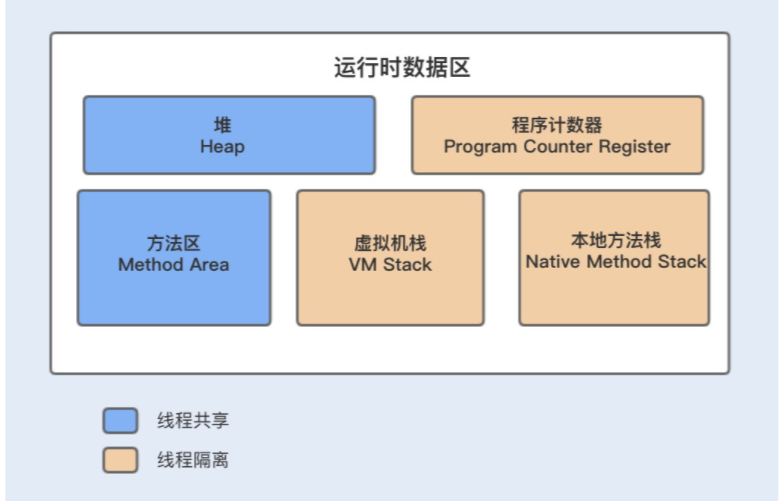
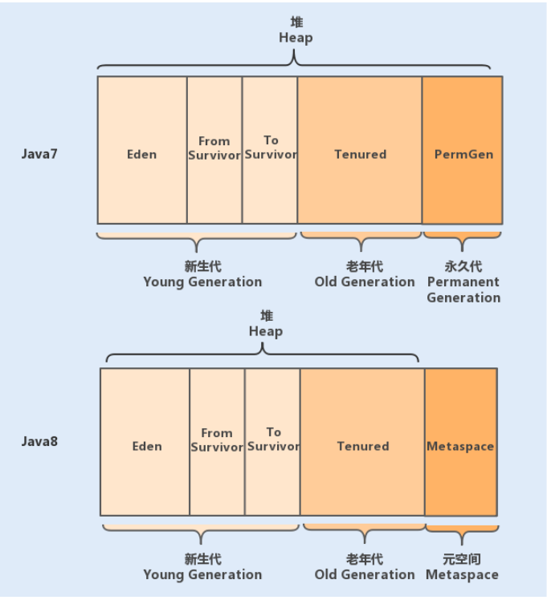
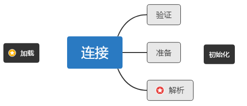
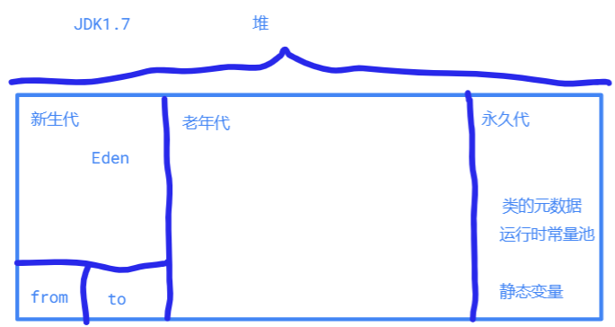
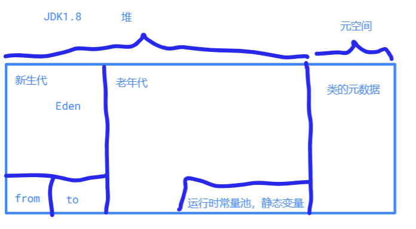
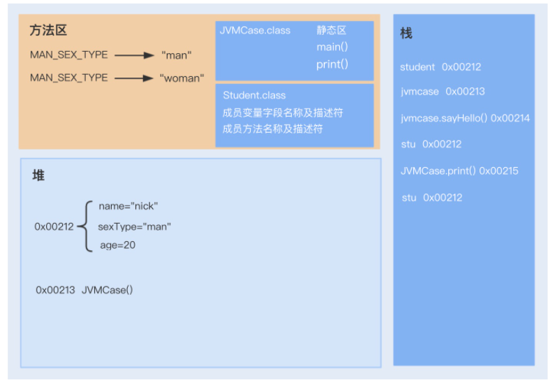

## 2JVM

尝试回答这几个问题？

- Java的内存模型是怎样的，各个区存放着什么
- 什么是happen-before
- Java类加载过程讲一下
- 什么是双亲委派机制，有没有实际的案列分析
- 常见的垃圾回收算法有什么
- CMS和G1都是实时响应的垃圾回收器，原理讲一讲，G1为什么比CMS更加优秀
- 有没有做过JVM性能调优？
  - 参数调优，有一套方法：怎么来分配大小（Kafka）
  - OOM有处理过没，元空间OOM（Dell）、
  - 程序响应慢，Full GC频繁的，探测服务导致的Full GC
  - 追求性能的TPS的，（新浪的CMS调优新生代大小）
  - 微博请求高峰时期，内部某个服务可用性下降，利用Remark强制一次Minor GC
  - G1调优的暂时没有，因为把握了G1的调优原则

### 1 JVM内存模型

JVM内存模型主要分为堆、方法区、程序计数器、虚拟机栈、本地方法栈。

> JDK 1.7 和 1.8 做了不同的实现。

#### 1.1 堆

最大的一块内存区，被所有线程共享，分为新生代和老年代。新生代分为Eden和Survivor，Survivor分为From Survivor和To Survivor。

#### 1.2 程序计数器

程序计数器是一块很小的内存空间，主要用来记录各个线程执行的字节码的地址，例如，分支、循环、跳转、异常、线程恢复等都依赖于计数器。

#### 1.3 方法区（Method Area）

> 方法区只是 JVM 中规范的一部分，可以说，在 HotSpot 虚拟机中，设计人员使用了永久代来实现了 JVM 规范的方法区。

方法区主要是用来存放已被虚拟机加载的类相关信息，包括类信息、运行时常量池、字符串常量池。

JVM 在执行某个类的时候，必须经过加载、连接、初始化，而连接又包括验证、准备、解析三个阶段。在加载类的时候，JVM 会先加载 class 文件，而在 class 文件中除了有类的版本、字段、方法和接口等描述信息外，还有一项信息是常量池 (Constant Pool Table)，用于存放编译期间生成的各种字面量和符号引用。

而当类加载到内存中后，JVM 就会将 class 文件常量池中的内容存放到运行时的常量池中；在解析阶段，JVM 会把符号引用替换为直接引用（对象的索引值）。

例如，类中的一个字符串常量在 class 文件中时，存放在 class 文件常量池中的；在 JVM 加载完类之后，JVM 会将这个字符串常量放到运行时常量池中，并在解析阶段，指定该字符串对象的索引值。运行时常量池是全局共享的，多个类共用一个运行时常量池，多个相同的字符串在运行时常量池只会存在一份。

> 方法区与堆空间类似，也是一个共享内存区，所以方法区是线程共享的。

> 为什么用元空间代替永久代？永久代内存经常不够用或发生内存溢出，爆出异常 java.lang.OutOfMemoryError: PermGen。这是因为在 JDK1.7 版本中，指定的 PermGen 区大小为 8M，由于 PermGen 中类的元数据信息在每次 FullGC 的时候都可能被收集，回收率都偏低，成绩很难令人满意；还有，为 PermGen 分配多大的空间很难确定，PermSize 的大小依赖于很多因素，比如，JVM 加载的 class 总数、常量池的大小和方法的大小等。

#### 1.4 虚拟机栈VM stack

他是什么？线程私有的内存空间，它和 Java 线程一起创建。保存局部变量和栈帧。

#### 1.5 本地方法栈

类似虚拟机栈，只是供本地方法调用使用。

### 2 JVM 运行原理

图示了。更加详细的解释要从 加载-连接-初始化，讲清楚方法区的常量池里面的初始化的先后顺序。

### 3 垃圾回收算法

如何判断垃圾，两大类：

- 引用计数法
- 可达性分析

这个算法的实质在于将 GC Roots 作为初始的存活对象合集（live set），然后从该合集出发，标记所有能够达到的对象，这些就是存活对象。（标记mark）

那么什么是 GC Roots 呢？我们可以暂时理解为由堆外指向堆内的引用，一般而言，GC Roots 包括（但不限于）如下几种：

1. Java 方法栈桢中的局部变量；
2. 已加载类的静态变量；
3. 已启动且未停止的 Java 线程。

这个算法有什么问题？不能让它在任何时候都可以进行标记，不安全。容易出现，在一个方法中，正执行了一部分，这个时候来mark了，垃圾回收，你回收了，我的栈中后一部分要执行的就找不到对象了。所以才有了安全点。

#### 3.1 安全点safe point

Java 虚拟机中的 Stop-the-world 是通过安全点（safepoint）机制来实现的。当 Java 虚拟机收到 Stop-the-world 请求，它便会等待所有的线程都到达安全点，才允许请求 Stop-the-world 的线程进行独占的工作。

#### 3.2三种常用的方式

- 清除sweep：即把死亡对象所占据的内存标记为空闲内存，并记录在一个空闲列表（free list）之中。优点：实现简单，缺点：有内存碎片。Java的堆分配内存必须要求连续的。
- 压缩 compact：即把存活的对象聚集到内存区域的起始位置，从而留下一段连续的内存空间。优点是：没有内存碎片；缺点是压缩有性能开销。
- 复制Copy：内存一分为2. from to。 优点：没有内存碎片，缺点:浪费空间。

#### 3.3Java是如何实现这三种方式的

基于一个前提：大部分的 Java 对象只存活一小段时间，而存活下来的小部分 Java 对象则会存活很长一段时间。 因此才有了**分代回收**的思想。

##### 1 新生代：Minor GC：标记-复制，可选择的有3个实现

- Serial
- Parallel Scavenge
- Parallel New

 什么时候触发？

> 因为 Minor GC 只针对新生代进行垃圾回收，所以在枚举 GC Roots 的时候，它需要考虑从老年代到新生代的引用。为了避免扫描整个老年代，Java 虚拟机引入了名为卡表的技术，大致地标出可能存在老年代到新生代引用的内存区域。

该技术将整个堆划分为一个个大小为 512 字节的卡，并且维护一个卡表（ byte 数组），用来存储每张卡的一个标识位。这个标识位代表对应的卡是否可能存有指向新生代对象的引用。如果可能存在，那么我们就认为这张卡是脏的。

##### 2 老年代：有3个

- Serial Old
- Parallel Old
- CMS（java 9 已经废弃）
- G1（横跨新生代和老年代）： 能够针对每个细分的区域来进行垃圾回收。在选择进行垃圾回收的区域时，它会优先回收死亡对象较多的区域。

> Java 11 引入了 ZGC，宣称暂停时间不超过 10ms

### 4 常见问题

#### 4.1 happen-before是什么

happen-before是Java内存模型对多线程可见性的规定规则。比如lock的操作顺序，volatile的读写顺序，线程各个步骤的执行顺序。

- 具体实现上，为了保证多线程的可见性，是依赖于内存屏障（memory-Barrier）来禁止指令重排序，提供内存的可见性保证。这就实现了happen-before的规则。
