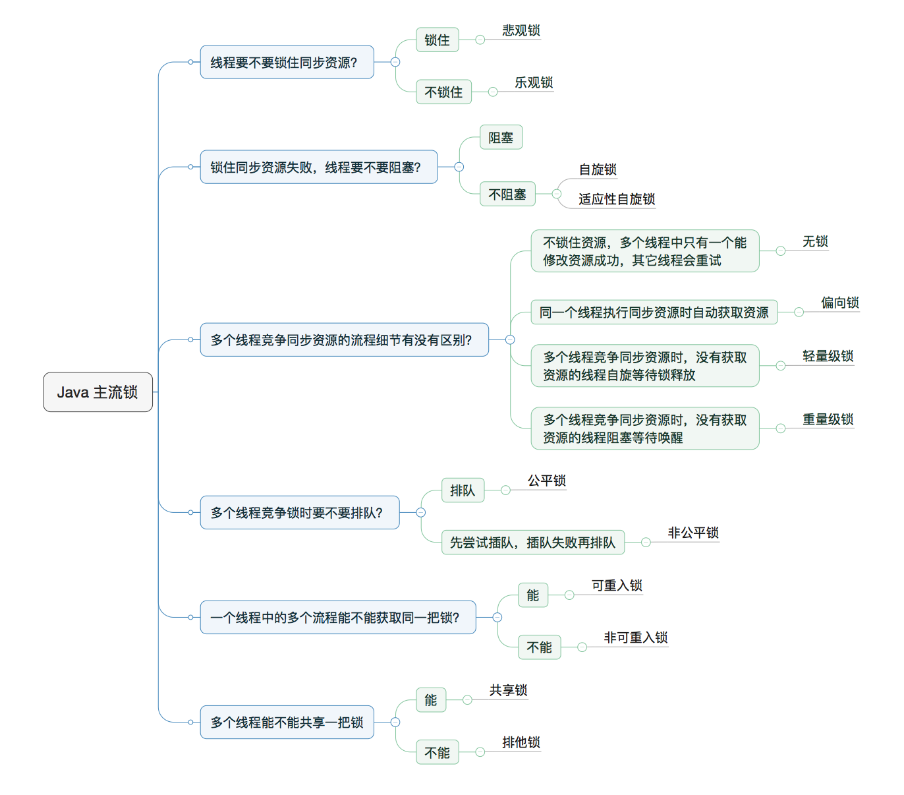
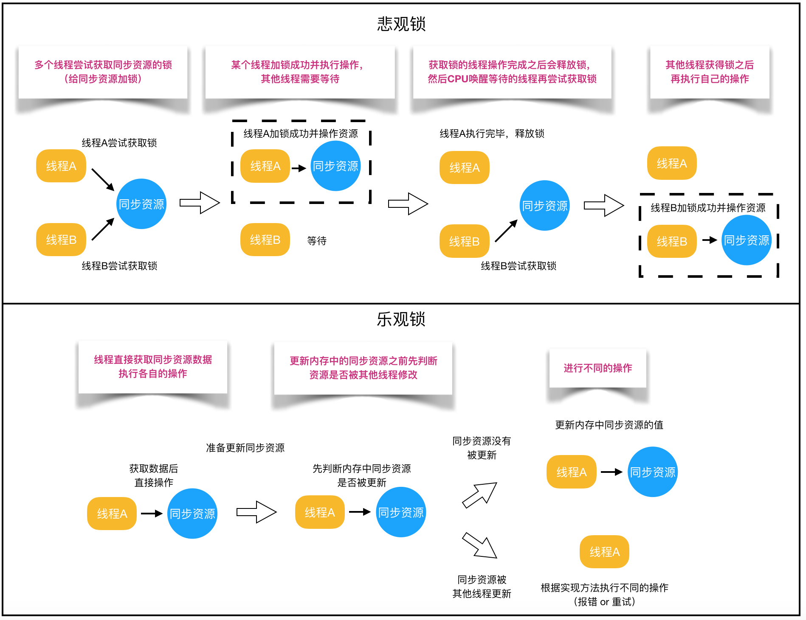

### 1. 乐观锁 VS 悲观锁

- 悲观锁：取数据的时候会先加锁。（synchronized和lock实现）

  - 适用场景：写操作多。

- 乐观锁：不会添加锁，只是在更新数据的时候去判断之前有没有别的线程更新了这个数据。

  - 若没有，就更新。
  - 若有，则取决于具体实现

  * 最常采用的实现是CAS算法，Java原子类中的递增操作就通过CAS自旋实现的。
  * 适用场景：读操作多。



#### 1.1 CAS全称 Compare And Swap（比较与交换）

- java.util.concurrent包中的原子类就是通过CAS来实现了乐观锁。

CAS算法涉及到三个操作数：

- 需要读写的内存值 V。
- 更新前，获取内存值 A。
- 要写入的新值 B。（只有当V==A的时候，才会进行更新）

```java
// ------------------------- JDK 8 -------------------------
// AtomicInteger 
// setup to use Unsafe.compareAndSwapInt for updates
private static final Unsafe unsafe = Unsafe.getUnsafe(); // 操作内存的类
private static final long valueOffset; // 存储value在AtomicInteger中的偏移量。
private volatile int value; // 存储实际的值，需要借助volatile关键字保证其在线程间是可见的。

public final int incrementAndGet() {
  return unsafe.getAndAddInt(this, valueOffset, 1) + 1;
}

// ------------------------- OpenJDK 8 -------------------------
// Unsafe.java
public final int getAndAddInt(Object o, long offset, int delta) {
   int v;
   do {
       v = getIntVolatile(o, offset);
   } while (!compareAndSwapInt(o, offset, v, v + delta)); // 底层实现是CPU指令CMPXGHG，原子操作。
   return v;
}
```

- ABA 问题的解决：添加版本号，变成1A－2B－3A（AtomicStampedReference）
- 循环时间长开销大
- 只能保证一个共享变量的原子操作。(AtomicReference)

### 2. 自旋锁 VS 适应性自旋锁

阻塞或唤醒一个Java线程需要操作系统切换CPU状态来完成，这种状态转换需要耗费处理器时间。如果同步代码块中的内容过于简单，状态转换消耗的时间有可能比用户代码执行的时间还要长。

- 自旋锁：某线程尝试获取同步资源失败后，不放弃CPU时间片，通过自旋等待锁释放。（CAS是原理）
  - 自旋等待的时间必须要有一定的限度，如果自旋超过了限定次数（默认是10次，可以使用-XX:PreBlockSpin来更改）没有成功获得锁，就应当挂起线程。


- 自适应自旋锁：自旋的次数不在固定，由虚拟机来决定。

  - 如果一个锁，自旋经常成功，那么虚拟机就回给它留多的次数来自旋
  - 如果一个锁，自旋经常失败，那么虚拟机可能就直接让获取锁变成阻塞，不再采用自旋的方式。

  - JDK 6中变为默认开启，并且引入了自适应的自旋锁（适应性自旋锁）。

### 3. 无锁 VS 偏向锁 VS 轻量级锁 VS 重量级锁（面试重点）

这四种锁是指锁的状态，专门针对synchronized的

- synchronized是悲观锁，在操作同步资源之前需要给同步资源先加锁，这把锁就是存在Java对象头里的

- Hotspot的对象头主要包括两部分数据：Mark Word（标记字段）、Klass Pointer（类型指针）。

  **Mark Word**：默认存储对象的HashCode，分代年龄和锁标志位信息。

#### Monitor

Monitor可以理解为一种同步机制。每一个Java对象就有一把看不见的锁，称为内部锁或者Monitor锁。

Monitor是线程私有的数据结构，每一个线程都有一个可用monitor record列表，同时还有一个全局的可用列表。每一个被锁住的对象都会和一个monitor关联，同时monitor中有一个Owner字段存放拥有该锁的线程的唯一标识，表示该锁被这个线程占用。

> 为什么Synchronized能实现线程同步？

synchronized通过Monitor来实现线程同步，Monitor是依赖于底层的操作系统的Mutex Lock（互斥锁）来实现的线程同步。

> 为什么 JDK 6之前synchronized效率低？

因为它依赖于操作系统的互斥锁来实现的。我们称之为“重量级锁“

下面我们给出四种锁状态对应的Object对象头的Mark Word内容，然后再分别讲解四种锁状态的思路以及特点：

| 锁状态   | 存储内容                                                | 存储内容 |
| :------- | :------------------------------------------------------ | :------- |
| 无锁     | 对象的hashCode、对象分代年龄、是否是偏向锁（0）         | 01       |
| 偏向锁   | 偏向线程ID、偏向时间戳、对象分代年龄、是否是偏向锁（1） | 01       |
| 轻量级锁 | 指向栈中锁记录的指针                                    | 00       |
| 重量级锁 | 指向互斥量（重量级锁）的指针                            | 10       |

#### 3.1 无锁

**无锁没有对资源进行锁定，所有的线程都能访问并修改同一个资源，但同时只有一个线程能修改成功。**

- CAS是无锁的实现，无锁是一种锁的状态，乐观锁是锁的概念。

#### 3.2**偏向锁**

**偏向锁是指一段同步代码一直被一个线程所访问，那么该线程会自动获取锁，降低获取锁的代价。**

- 背景：引入偏向锁是为了在无多线程竞争的情况下尽量减少不必要的轻量级锁执行路径，因为轻量级锁的获取及释放依赖多次CAS原子指令，而偏向锁只需要在置换ThreadID的时候依赖一次CAS原子指令即可。
- 适用场景：在只有一个线程执行同步代码块时能够提高性能。
- 怎么做到的：当一个线程访问同步代码块并获取锁时，会在Mark Word里存储锁偏向的线程ID。在线程进入和退出同步块时不再通过CAS操作来加锁和解锁，而是检测Mark Word里是否存储着指向当前线程的偏向锁。
- 什么时候释放：只有遇到其他线程尝试竞争偏向锁时，持有偏向锁的线程才会释放锁，线程不会主动释放偏向锁。（撤销，需要等待全局安全点）
- 默认开启，如果需要关闭偏向锁：-XX:-UseBiasedLocking=false，关闭之后程序默认会进入轻量级锁状态。

#### 3.3**轻量级锁**

**是指当锁是偏向锁的时候，被另外的线程所访问，偏向锁就会升级为轻量级锁，其他线程会通过自旋的形式尝试获取锁，不会阻塞，从而提高性能。**

#### 3.4 重量级锁

若当锁是轻量级锁的时候，当前只有一个等待线程，则该线程通过自旋进行等待。但是当自旋超过一定的次数，或者一个线程在持有锁，一个在自旋，又有第三个来访时，轻量级锁升级为重量级锁。

> 讲一下Synchronized的优化，就是要讲一下锁状态升级流程。

- 无锁：当一个对象被synchronized修饰的时候，它首先处于无锁状态，它对象头的Mark Word里面暂时没有存储锁信息
- 偏向锁：当这个对象被同一个线程访问的时候，它会把它的Thread ID储存在Mark Word里，进入偏向锁。（这个状态下，线程访问这个对象的时候，不在通过CAS来加锁，直接检测Mark Word的ThreadID值）
- 轻量级锁：在偏向锁的时候，如果有第二个线程来了，那么锁就升级成轻量级锁。它就会自旋等待第一个线程释放锁。（第一个线程会在全局安全点的时候，才会释放锁）
- 重量级锁：在轻量级锁的时候，自旋等待时间太长了，或者又有第3个线程来竞争，那么锁升级。将除了拥有锁的线程之外的线程都阻塞。


综上，偏向锁通过对比Mark Word解决加锁问题，避免执行CAS操作。而轻量级锁是通过用CAS操作和自旋来解决加锁问题，避免线程阻塞和唤醒而影响性能。重量级锁是将除了拥有锁的线程以外的线程都阻塞。

### 4. 公平锁 VS 非公平锁

- 公平锁：竞争资源是否需要排队
- 非公平锁：先尝试插队，失败再排队。