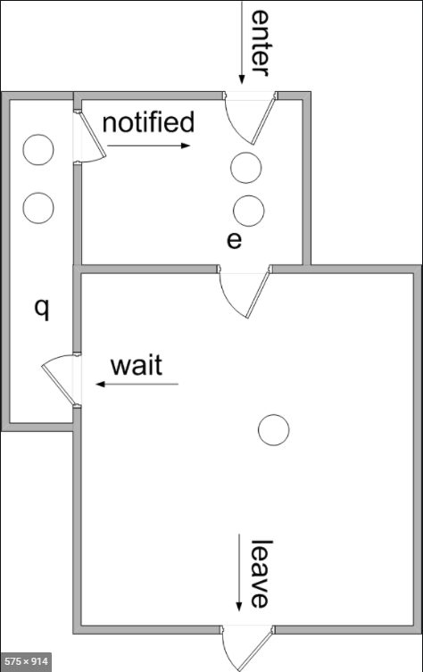
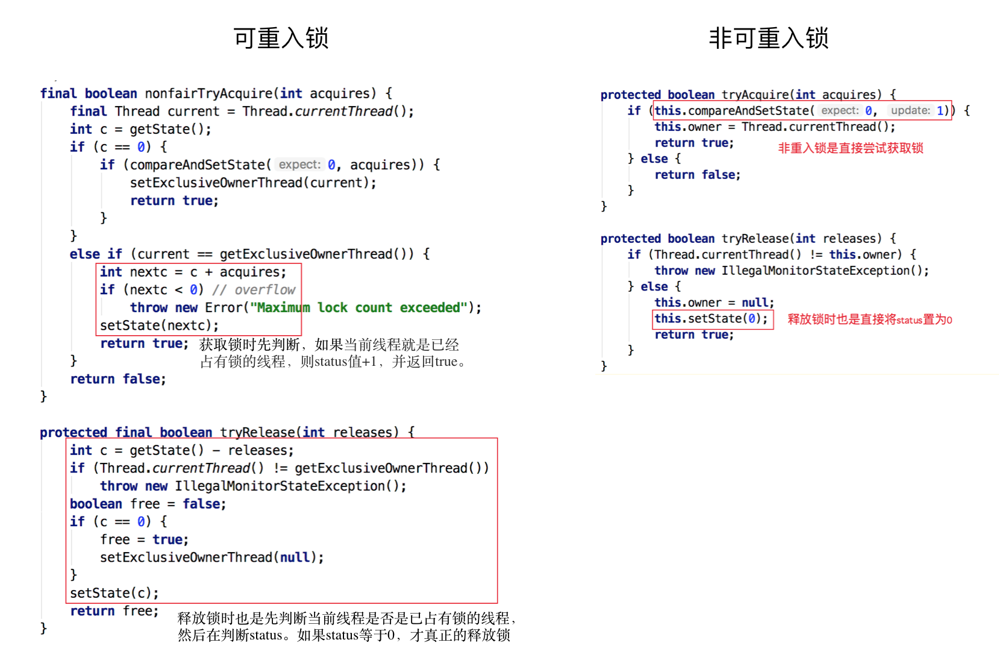
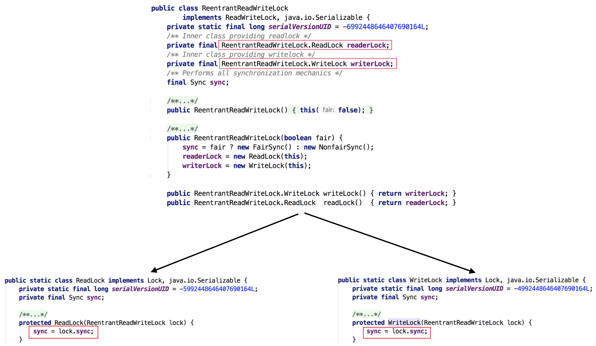

### 1. 乐观锁 VS 悲观锁

- 悲观锁：取数据的时候会先加锁。（synchronized和lock实现）

  - 适用场景：写操作多。

- 乐观锁：不会添加锁，只是在更新数据的时候去判断之前有没有别的线程更新了这个数据。

  - 若没有，就更新。
  - 若有，则取决于具体实现

  * 最常采用的实现是CAS算法，Java原子类中的递增操作就通过CAS自旋实现的。
  * 适用场景：读操作多。


#### 1.1 CAS全称 Compare And Swap（比较与交换）

- java.util.concurrent包中的原子类就是通过CAS来实现了乐观锁。

CAS算法涉及到三个操作数：

- 需要读写的内存值 V。
- 更新前，获取内存值 A。
- 要写入的新值 B。（只有当V==A的时候，才会进行更新）

```java
// ------------------------- JDK 8 -------------------------
// AtomicInteger 
// setup to use Unsafe.compareAndSwapInt for updates
private static final Unsafe unsafe = Unsafe.getUnsafe(); // 操作内存的类
private static final long valueOffset; // 存储value在AtomicInteger中的偏移量。
private volatile int value; // 存储实际的值，需要借助volatile关键字保证其在线程间是可见的。

public final int incrementAndGet() {
  return unsafe.getAndAddInt(this, valueOffset, 1) + 1;
}

// ------------------------- OpenJDK 8 -------------------------
// Unsafe.java
public final int getAndAddInt(Object o, long offset, int delta) {
   int v;
   do {
       v = getIntVolatile(o, offset);
   } while (!compareAndSwapInt(o, offset, v, v + delta)); // 底层实现是CPU指令CMPXGHG，原子操作。
   return v;
}
```

- ABA 问题的解决：添加版本号，变成1A－2B－3A（AtomicStampedReference）
- 循环时间长开销大
- 只能保证一个共享变量的原子操作。(AtomicReference)

### 2. 自旋锁 VS 适应性自旋锁

阻塞或唤醒一个Java线程需要操作系统切换CPU状态来完成，这种状态转换需要耗费处理器时间。如果同步代码块中的内容过于简单，状态转换消耗的时间有可能比用户代码执行的时间还要长。

- 自旋锁：某线程尝试获取同步资源失败后，不放弃CPU时间片，通过自旋等待锁释放。（CAS是原理）
  - 自旋等待的时间必须要有一定的限度，如果自旋超过了限定次数（默认是10次，可以使用-XX:PreBlockSpin来更改）没有成功获得锁，就应当挂起线程。


- 自适应自旋锁：自旋的次数不在固定，由虚拟机来决定。

  - 如果一个锁，自旋经常成功，那么虚拟机就回给它留多的次数来自旋
  - 如果一个锁，自旋经常失败，那么虚拟机可能就直接让获取锁变成阻塞，不再采用自旋的方式。

  - JDK 6中变为默认开启，并且引入了自适应的自旋锁（适应性自旋锁）。

### 3. 无锁 VS 偏向锁 VS 轻量级锁 VS 重量级锁（面试重点）

这四种锁是指锁的状态，专门针对synchronized的

- synchronized是悲观锁，在操作同步资源之前需要给同步资源先加锁，这把锁就是存在Java对象头里的

- Hotspot的对象头主要包括两部分数据：Mark Word（标记字段）、Klass Pointer（类型指针）。

  **Mark Word**：默认存储对象的HashCode，分代年龄和锁标志位信息。

#### Monitor

Monitor可以理解为一种同步机制。每一个Java对象就有一把看不见的锁，称为内部锁或者Monitor锁。



Monitor是线程私有的数据结构，每一个线程都有一个可用monitor record列表，同时还有一个全局的可用列表。每一个被锁住的对象都会和一个monitor关联，同时monitor中有一个Owner字段存放拥有该锁的线程的唯一标识，表示该锁被这个线程占用。

> 为什么Synchronized能实现线程同步？

**synchronized通过Monitor来实现线程同步，Monitor是依赖于底层的操作系统的Mutex Lock（互斥锁）来实现的线程同步。**

> 为什么 JDK 6之前synchronized效率低？

因为它依赖于操作系统的互斥锁来实现的。我们称之为“重量级锁“

下面我们给出四种锁状态对应的Object对象头的Mark Word内容，然后再分别讲解四种锁状态的思路以及特点：

| 锁状态   | 存储内容                                                | 存储内容 |
| :------- | :------------------------------------------------------ | :------- |
| 无锁     | 对象的hashCode、对象分代年龄、是否是偏向锁（0）         | 01       |
| 偏向锁   | 偏向线程ID、偏向时间戳、对象分代年龄、是否是偏向锁（1） | 01       |
| 轻量级锁 | 指向栈中锁记录的指针                                    | 00       |
| 重量级锁 | 指向互斥量（重量级锁）的指针                            | 10       |

#### 3.1 无锁

**无锁没有对资源进行锁定，所有的线程都能访问并修改同一个资源，但同时只有一个线程能修改成功。**

- CAS是无锁的实现，无锁是一种锁的状态，乐观锁是锁的概念。

#### 3.2**偏向锁**

**偏向锁是指一段同步代码一直被一个线程所访问，那么该线程会自动获取锁，降低获取锁的代价。**

- 背景：引入偏向锁是为了在无多线程竞争的情况下尽量减少不必要的轻量级锁执行路径，因为轻量级锁的获取及释放依赖多次CAS原子指令，而偏向锁只需要在置换ThreadID的时候依赖一次CAS原子指令即可。
- 适用场景：在只有一个线程执行同步代码块时能够提高性能。
- 怎么做到的：当一个线程访问同步代码块并获取锁时，会在Mark Word里存储锁偏向的线程ID。在线程进入和退出同步块时不再通过CAS操作来加锁和解锁，而是检测Mark Word里是否存储着指向当前线程的偏向锁。
- 什么时候释放：只有遇到其他线程尝试竞争偏向锁时，持有偏向锁的线程才会释放锁，线程不会主动释放偏向锁。（撤销，需要等待全局安全点）
- 默认开启，如果需要关闭偏向锁：-XX:-UseBiasedLocking=false，关闭之后程序默认会进入轻量级锁状态。

#### 3.3**轻量级锁**

**是指当锁是偏向锁的时候，被另外的线程所访问，偏向锁就会升级为轻量级锁，其他线程会通过自旋的形式尝试获取锁，不会阻塞，从而提高性能。**

#### 3.4 重量级锁

若当锁是轻量级锁的时候，当前只有一个等待线程，则该线程通过自旋进行等待。但是当自旋超过一定的次数，或者一个线程在持有锁，一个在自旋，又有第三个来访时，轻量级锁升级为重量级锁。

> 讲一下Synchronized的优化，就是要讲一下锁状态升级流程。

- 无锁：当一个对象被synchronized修饰的时候，它首先处于无锁状态，它对象头的Mark Word里面暂时没有存储锁信息
- 偏向锁：当这个对象被同一个线程访问的时候，它会把它的Thread ID储存在Mark Word里，进入偏向锁。（这个状态下，线程访问这个对象的时候，不在通过CAS来加锁，直接检测Mark Word的ThreadID值）
- 轻量级锁：在偏向锁的时候，如果有第二个线程来了，那么锁就升级成轻量级锁。它就会自旋等待第一个线程释放锁。（第一个线程会在全局安全点的时候，才会释放锁）
- 重量级锁：在轻量级锁的时候，自旋等待时间太长了，或者又有第3个线程来竞争，那么锁升级。将除了拥有锁的线程之外的线程都阻塞。


综上，偏向锁通过对比Mark Word解决加锁问题，避免执行CAS操作。而轻量级锁是通过用CAS操作和自旋来解决加锁问题，避免线程阻塞和唤醒而影响性能。重量级锁是将除了拥有锁的线程以外的线程都阻塞。

### 4. 公平锁 VS 非公平锁

- 公平锁：竞争资源是否需要排队
- 非公平锁：先尝试插队，失败再排队。

通过ReentrantLock的源码来理解公平锁和非公平锁。


**ReentrantLock里面有一个内部类Sync，Sync继承AQS（AbstractQueuedSynchronizer）**

公平锁与非公平锁的加锁方法的源码:


- hasQueuedPredecessors()：主要是判断当前线程是否位于同步队列中的第一个

#### 4.1 **AbstractQueuedSynchronizer**

- **基于原子变量 state 和 queue 实现的同步框架，state == 1 表示锁已被抢占，state ==0 表示空闲**

```java
    /**
     * The synchronization state.
     */
    private volatile int state;
```


- 核心方法
  - tryAquire()、tryRelease()
  - tryAcquireShared()、tryReleaseShared()
  - isHeldExclusively()
  - getState()、setState()、compareAndSetState()
- 核心成员变量
  - state
  - head
  - tail
- Node 成员变量

```
    int waitStatus;
    Node prev;
    Node next;
    Thread thread;
    Node nextWaiter;
```

- waitStatus 用于标识等待队列中 Node 的状态（这样的设计不仅在于用于标识需要挂起的线程，同时也避免了出现异常而退出或者被取消的线程占据队列空间导致其他等待线程饥饿）
  - SIGNAL = -1 // 表示后继节点当前被阻塞（或即将被阻塞），需前驱节点释放时解除这个后继几点的阻塞
  - CANCELLED = 1
  - CONDIGION = -2
  - PROPAGATE = -3 // 用于公平锁

```
    volatile int waitStatus;
```

- **AQS 父类(AbstractOwnableSynchronizer)用于记录当前获得锁的线程**
  - setExclusiveOwnerThread()
  - getExclusiveOwnerThread()
- 虽然 AQS 基于内部内部 FIFO 队列, 但是它获取锁的策略不一定是FIFO的，一个排他锁的核心形式如下: 先尝试获取锁，不成功再入队。

```java
    Acquire:
       while (!tryAcquire(arg)) {
          enqueue thread if it is not already queued;
          possibly block current thread;
       }

    Release:
       if (tryRelease(arg))
          unblock the first queued thread;
```

#### 4.2 ReentrantLock 原理简要说明：

- 基于 AQS ，初次竞争使用 CAS 将 status 置为 1，若成功则抢到锁，再将独占线程置为自身（因此在竞争不频繁时效率很高）

```java
 public void lock() {
    	sync.lock();
    }

    static final class NonfairSync extends Sync {
    	...

        final void lock() {
            if (compareAndSetState(0, 1))
                setExclusiveOwnerThread(Thread.currentThread());
            else
                acquire(1);
            }
        }
        ...
    }
```

- 以上 CAS 失败则调用 AQS.acquire()，在分支中又会调用 tryAcquire，
  - 如果调用的是 NonFairAcquire
    - tryAcquire 判断当前 status
    - 若为 0 则尝试用 CAS 置 status 为 1
    - CAS 失败则判断是否为当前线程重入该锁，是则获得锁，否则加入等待队列
  - 如果调用的是 FairAcquire
    - 逻辑与 NonFairAcquire 一致，只是在抢锁前线判断等待队列是否为空

```java
// in AbstractQueuedSynchronizer
    public final void acquire(int arg) {
        if (!tryAcquire(arg) &&
            acquireQueued(addWaiter(Node.EXCLUSIVE), arg))
            selfInterrupt();
    }

    // in NotfairSync
    protected final boolean tryAcquire(int acquires) {
        return nonfairTryAcquire(acquires);
    }

    // in Sync
    final boolean nonfairTryAcquire(int acquires) {
        final Thread current = Thread.currentThread();
        int c = getState();
        if (c == 0) {
            if (compareAndSetState(0, acquires)) {
                setExclusiveOwnerThread(current);
                return true;
            }
        }
        else if (current == getExclusiveOwnerThread()) { // 可重入判断
            int nextc = c + acquires;
            if (nextc < 0) // overflow
                throw new Error("Maximum lock count exceeded");
            setState(nextc);
            return true;
        }
        return false;
    }

    // FairSync
    protected final boolean tryAcquire(int acquires) {
        final Thread current = Thread.currentThread();
        int c = getState();
        if (c == 0) {
            if (!hasQueuedPredecessors() && // 检查队列是否有等待线程
                compareAndSetState(0, acquires)) {
                setExclusiveOwnerThread(current);
                return true;
            }
        }
        else if (current == getExclusiveOwnerThread()) {
            int nextc = c + acquires;
            if (nextc < 0)
                throw new Error("Maximum lock count exceeded");
            setState(nextc);
            return true;
        }
        return false;
    }
```

- 如果tryAcquire失败了，就会把线程入队。若队列未初始化，则初始化头结点（thread=null, waitstatus=0），然后添加到队列尾；然后开始进入 acquireQueued 中的 循环 ①

```java
	private Node addWaiter(Node mode) {
        Node node = new Node(Thread.currentThread(), mode);
        // Try the fast path of enq; backup to full enq on failure
        Node pred = tail;
        if (pred != null) {
            node.prev = pred;
            if (compareAndSetTail(pred, node)) {
                pred.next = node;
                return node;
            }
        }
        enq(node); // 入队
        return node;
    }

    private Node enq(final Node node) {
        for (;;) {
            Node t = tail;
            if (t == null) { // Must initialize
                if (compareAndSetHead(new Node()))
                    tail = head;
            } else {
                node.prev = t;
                if (compareAndSetTail(t, node)) {
                    t.next = node;
                    return t;
            }
        }
    }

```

- **进入等待队列之后，还会再次尝试获取锁。**若自身为首节点（head后的第一个节点），则尝试获得锁 tryAcquire，若能获得，则弹出头结点，返回；否则判断当前线程是否应当挂起，如果节点刚被初始化，则前置节点的 waitstatus 为 0，则将 waitstatus 改为 SIGNAL 后，再次进入 外循环 ① 尝试抢锁，失败则再次进入判断是否应当挂起的逻辑，正常情况下，第二次循环如果还没得到锁，就会被挂起

```java
   final boolean acquireQueued(final Node node, int arg) {
        boolean failed = true;
        try {
            boolean interrupted = false;
            for (;;) { // 循环①
                final Node p = node.predecessor();
                if (p == head && tryAcquire(arg)) {
                    setHead(node); // node的thread和prev都被置空, head = node
                    p.next = null; // help GC
                    failed = false;
                    return interrupted;
                }
                if (shouldParkAfterFailedAcquire(p, node) && // 没有抢到锁就标记自身应当被挂起，等待下次循环再挂起
                    parkAndCheckInterrupt())
                    interrupted = true;
            }
        } finally {
            if (failed)
                cancelAcquire(node);
        }
    }

    private void setHead(Node node) {
        head = node;
        node.thread = null;
        node.prev = null;
    }

    private static boolean shouldParkAfterFailedAcquire(Node pred, Node node) {
        int ws = pred.waitStatus;
        if (ws == Node.SIGNAL)
            /*
             * This node has already set status asking a release
             * to signal it, so it can safely park.
             */
            return true;
        if (ws > 0) {
            /*
             * Predecessor was cancelled. Skip over predecessors and
             * indicate retry.
             */
            do {
                node.prev = pred = pred.prev;
            } while (pred.waitStatus > 0);
            pred.next = node;
        } else {
            /*
             * waitStatus must be 0 or PROPAGATE.  Indicate that we
             * need a signal, but don't park yet.  Caller will need to
             * retry to make sure it cannot acquire before parking.
             */
            compareAndSetWaitStatus(pred, ws, Node.SIGNAL);
        }
        return false;
    }

    private final boolean parkAndCheckInterrupt() {
        LockSupport.park(this);
        return Thread.interrupted();
    }

```

- 下面是release的过程：当获得锁的线程 release 时，会将首节点唤醒，唤醒的首节点会再次进入 循环 ①，执行之前的自旋抢锁的逻辑，此时该节点的线程会和其他新来而未进队列的线程一起竞争锁，因此它并不一定能抢得到，从这个角度来看，它并不比新来的线程更优先，但是比队列中的其他线程都更优先

```java
	// in AbstractQueuedSynchonizer
    public final boolean release(int arg) {
        if (tryRelease(arg)) {
            Node h = head;
            if (h != null && h.waitStatus != 0)
                unparkSuccessor(h);
            return true;
        }
        return false;
    }

	// in ReentrantLock#Sync
    protected final boolean tryRelease(int releases) {
        int c = getState() - releases;
        if (Thread.currentThread() != getExclusiveOwnerThread())
            throw new IllegalMonitorStateException();
        boolean free = false;
        if (c == 0) {
            free = true;
            setExclusiveOwnerThread(null);
        }
        setState(c);
        return free;
    }
```

###  5 可重入锁 VS 非可重入锁

可重入锁又名递归锁，是指在同一个线程在外层方法获取锁的时候，再进入该线程的内层方法会自动获取锁（前提锁对象得是同一个对象或者class），不会因为之前已经获取过还没释放而阻塞。Java中ReentrantLock和synchronized都是可重入锁，可重入锁的一个优点是可一定程度避免死锁。下面用示例代码来进行分析：后面有一张图是ReentrantLock的代码Sync的一部分。

```java
public class Widget {
    public synchronized void doSomething() {
        System.out.println("方法1执行...");
        doOthers();
    }

    public synchronized void doOthers() {
        System.out.println("方法2执行...");
    }
}
```

> ReentrantLock的可重入是通过Sync来实现的，Sync是AQS实现的，获取锁tryAccquire的时候。
>
> Synchronized的可重入是怎么实现的？




### 6 独享锁 VS 共享锁

独享锁和共享锁同样是一种概念。

- 独享锁也叫排他锁、互斥锁，是指该锁一次只能被一个线程所持有。如果线程T对数据A加上排它锁后，则其他线程不能再对A加任何类型的锁。获得排它锁的线程即能读数据又能修改数据。**JDK中的synchronized和JUC中Lock的实现类就是互斥锁。**

- 共享锁是指该锁可被多个线程所持有。如果线程T对数据A加上共享锁后，则其他线程只能对A再加共享锁，不能加排它锁。获得共享锁的线程只能读数据，不能修改数据。

ReentrantLock和ReentrantReadWriteLock的源码，独享锁和共享锁都是通过AQS来实现的，通过实现不同的方法，来实现独享或者共享。

下图为ReentrantReadWriteLock的部分源码：



- ReadWriteLock，实现类 ReentrantReadWriteLock

  - 获取顺序：此类不会将读取者优先或写入者优先强加给锁访问的排序
    - 非公平模式（默认）：连续竞争的非公平锁可能无限期地推迟一个或多个 reader 或 writer 线程，但吞吐量通常要高于公平锁
    - 公平模式：线程利用一个近似到达顺序的策略来争夺进入。当释放锁时，可以为等待时间最长的那个 writer 线程分配写入锁，如果有一组 reader 的等待时间大于所有正在等待的 writer 线程，将为该组分配读者锁
    - 试图获得公平写入锁的非重入的线程将会阻塞，除非读取锁和写入锁都已释放（这意味着没有等待线程）
  - 排他性
    - 读读共享，读写互斥，写写互斥
  - 可重入性
    - 允许 reader 和 writer 按照 ReentrantLock 的样式重新获取读取锁或写入锁
    - 在写入线程持有的所有写入锁都已经释放后，才允许重入 reader 使用读取锁
    - **writer 可以获取读取锁，但 reader 不能获取写入锁（也就是说，在正在读的时候，同一个线程可以进入来进行写操作。这和下面这一点是相关的）**
  - **锁降级：重入允许从写入锁降级为读取锁**
    - 先获取写入锁，然后获取读取锁，最后释放写入锁
    - 但是，从读取锁升级到写入锁是不可能的

  ```java
  // 实现一个线程安全的可以查的字典数据    
  class RWDictionary {
         private final Map<String, Data> m = new TreeMap<String, Data>();
         private final ReentrantReadWriteLock rwl = new ReentrantReadWriteLock();
         private final Lock r = rwl.readLock();
         private final Lock w = rwl.writeLock();
  
         public Data get(String key) {
           r.lock();
           try { return m.get(key); }
           finally { r.unlock(); }
         }
         public String[] allKeys() {
           r.lock();
           try { return m.keySet().toArray(); }
           finally { r.unlock(); }
         }
         public Data put(String key, Data value) {
           w.lock();
           try { return m.put(key, value); }
           finally { w.unlock(); }
         }
         public void clear() {
           w.lock();
           try { m.clear(); }
           finally { w.unlock(); }
         }
      }
  ```

那读锁和写锁的具体加锁方式有什么区别呢？在了解源码之前我们需要回顾一下其他知识。 在最开始提及AQS的时候我们也提到了state字段（int类型，32位），该字段用来描述有多少线程获持有锁。

在独享锁中这个值通常是0或者1（如果是重入锁的话state值就是重入的次数），在共享锁中state就是持有锁的数量。但是在ReentrantReadWriteLock中有读、写两把锁，所以需要在一个整型变量state上分别描述读锁和写锁的数量（或者也可以叫状态）。于是将state变量“按位切割”切分成了两个部分，高16位表示读锁状态（读锁个数），低16位表示写锁状态（写锁个数）。如下图所示：


了解了概念之后我们再来看代码，先看写锁的加锁源码：

```Java
        final boolean tryWriteLock() {
            Thread current = Thread.currentThread();
            int c = getState();
            if (c != 0) {
                int w = exclusiveCount(c);// 当前写锁的个数w
                if (w == 0 || current != getExclusiveOwnerThread()) // 读写互斥
                    return false;
                if (w == MAX_COUNT)
                    throw new Error("Maximum lock count exceeded");
            }
            if (!compareAndSetState(c, c + 1))
                return false;
            setExclusiveOwnerThread(current);
            return true;
        }
```

读锁源码

```java
		final boolean tryReadLock() {
            Thread current = Thread.currentThread();
            for (;;) {
                int c = getState();
                if (exclusiveCount(c) != 0 &&
                    getExclusiveOwnerThread() != current) // 可重入判断
                    return false;
                int r = sharedCount(c);
                if (r == MAX_COUNT)
                    throw new Error("Maximum lock count exceeded");
                if (compareAndSetState(c, c + SHARED_UNIT)) {
                    if (r == 0) {
                        firstReader = current;
                        firstReaderHoldCount = 1;
                    } else if (firstReader == current) {
                        firstReaderHoldCount++;
                    } else {
                        HoldCounter rh = cachedHoldCounter;
                        if (rh == null || rh.tid != getThreadId(current))
                            cachedHoldCounter = rh = readHolds.get();
                        else if (rh.count == 0)
                            readHolds.set(rh);
                        rh.count++;
                    }
                    return true;
                }
            }
        }
```

> 反向思考：ReentrantLock里面的公平锁和非公平锁获取的时候，`tryAcquire` `nonfairTryAcquire` 他们是独占锁还是共享锁？

Refer:[Java锁事](https://tech.meituan.com/2018/11/15/java-lock.html)

### 7 信号量Semaphore

操作系统的信号量是一种概念，Java的信号量是一种实现。

- **信号量是一个被线程共享的非负变量。是一个发信号的机制。**一个等待一个信号量的线程可以被其他线程通知（signal）。这个机制通过 wait 和 signal 两个原子操作（atomic operations）来实现进程同步。

- 互斥锁其实是一个对象。Mutex的全称是Mutual Exclusion Object，也就是**互斥锁是一个互斥对象。它是一种特殊的二进位信号量（binary semaphore）**，用来控制访问共享区域资源。它包括一个优先级继承机制，以避免扩展的优先级反转问题。它允许当前优先级较高的任务在阻塞状态下维持的时间尽可能的少。然而，优先级继承并不能完全避免优先级反转，而只会最小化其影响。

- 

  作者：雨幻逐光
  链接：https://www.jianshu.com/p/5852efef0ea8
  来源：简书
  著作权归作者所有。商业转载请联系作者获得授权，非商业转载请注明出处。

#### 信号量和互斥锁的不同点

|参数|信号量|互斥锁|
|---|---|---|
|机制|**是一种发信号的机制（signaling mechanism）**| **是一种锁机制** |
| 数据类型 | **信号量是一个整型变量** | **斥锁是一个对象** |
| 修改| 等待（wait）和发信号（signal）操作可以修改信号量  | 互斥锁只有当进程请求访问一块资源或释放占用某块资源的时候被修改 |
| 资源管理 | 如果没有空闲资源，此时请求资源的进程将执行等待操作（wait operation）。它将一直等待直到信号量的计数大于0 | 如果互斥锁是锁住的状态，进程只能等待。进程将被置于队列中进行排队。只有当互斥锁被解锁后才能访问资源 |
| 线程| 可以拥有多个线程  | 可以拥有多个线程，但是多个线程不是同时进行的  |
| 所有权 | 任一进程释放或者获取资源时，计数将被改变 | 锁对象只能被当前获取到钥匙的进程释放（即工作线程）|
| 类型| 信号量有两种类型，二进位信号量和计数信号量| 互斥锁没有子类型  |
| 操作| 信号量的值可以通过等待和发信号两个操作来修改 | 互斥锁有锁上（locked）和解锁（unlocked）两个操作|
| 资源占用 | 如果所有资源都被占用，此时请求资源的进程将执行wait（）操作并阻塞自身，直到信号量计数>1，占有被释放的资源 | 如果对象已被锁定，则请求资源的进程将等待，并在释放锁定之前由系统进行排队 |
| 优缺点 | 信号量可以灵活管理资源；缺点是编程复杂，容易出现死锁。 |  |

Refer [雨幻逐光](https://www.jianshu.com/p/5852efef0ea8)

```java
/*A counting semaphore. Conceptually, a semaphore maintains a set of permits. Each acquire blocks if necessary until a permit is available, and then takes it. Each release adds a permit, potentially releasing a blocking acquirer. However, no actual permit objects are used; the Semaphore just keeps a count of the number available and acts accordingly.
Semaphores are often used to restrict the number of threads than can access some (physical or logical) resource. For example, here is a class that uses a semaphore to control access to a pool of items:*/
  
 class Pool {
   private static final int MAX_AVAILABLE = 100;
   private final Semaphore available = new Semaphore(MAX_AVAILABLE, true);

   public Object getItem() throws InterruptedException {
     available.acquire();
     return getNextAvailableItem();
   }

   public void putItem(Object x) {
     if (markAsUnused(x))
       available.release();
   }

   // Not a particularly efficient data structure; just for demo

   protected Object[] items = ... whatever kinds of items being managed
   protected boolean[] used = new boolean[MAX_AVAILABLE];

   protected synchronized Object getNextAvailableItem() {
     for (int i = 0; i < MAX_AVAILABLE; ++i) {
       if (!used[i]) {
          used[i] = true;
          return items[i];
       }
     }
     return null; // not reached
   }

   protected synchronized boolean markAsUnused(Object item) {
     for (int i = 0; i < MAX_AVAILABLE; ++i) {
       if (item == items[i]) {
          if (used[i]) {
            used[i] = false;
            return true;
          } else
            return false;
       }
     }
     return false;
   }
 }
```

- Java 信号量还是AQS实现

```java
public class Semaphore implements java.io.Serializable {
    /** All mechanics via AbstractQueuedSynchronizer subclass */
    private final Sync sync;

    /**
     * Synchronization implementation for semaphore.  Uses AQS state
     * to represent permits. Subclassed into fair and nonfair
     * versions.
     */
    abstract static class Sync extends AbstractQueuedSynchronizer {
        private static final long serialVersionUID = 1192457210091910933L;

        Sync(int permits) {
            setState(permits);
        }

        final int getPermits() {
            return getState();
        }

        final int nonfairTryAcquireShared(int acquires) {
            for (;;) {
                int available = getState();
                int remaining = available - acquires;
                if (remaining < 0 ||
                    compareAndSetState(available, remaining))
                    return remaining;
            }
        }

        protected final boolean tryReleaseShared(int releases) {
            for (;;) {
                int current = getState();
                int next = current + releases;
                if (next < current) // overflow
                    throw new Error("Maximum permit count exceeded");
                if (compareAndSetState(current, next))
                    return true;
            }
        }

        final void reducePermits(int reductions) {
            for (;;) {
                int current = getState();
                int next = current - reductions;
                if (next > current) // underflow
                    throw new Error("Permit count underflow");
                if (compareAndSetState(current, next))
                    return;
            }
        }

        final int drainPermits() {
            for (;;) {
                int current = getState();
                if (current == 0 || compareAndSetState(current, 0))
                    return current;
            }
        }
    }


    /**
     * Creates a Semaphore with the given number of
     * permits and nonfair fairness setting.
     */
    public Semaphore(int permits) {
        sync = new NonfairSync(permits);
    }
}
```


