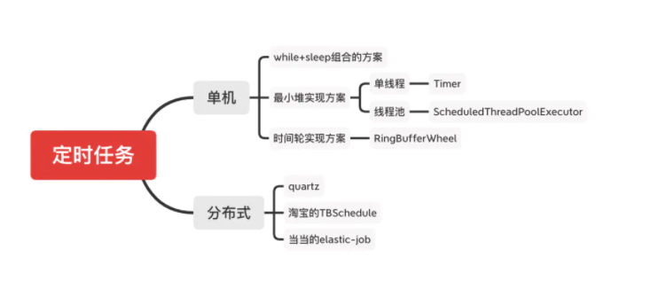

## 0背景是什么，要解决什么问题？

Loris从单体应用，要改造成分布式应用，提升它的吞吐量和稳定性。有一个功能点是Reservation Service，需要去第3方service预定资源，定一个时间段。最理想的情况就是用户在loris预定的时候，第三方资源也是可用的，直接预定成功。

现实的情况是：这个资源当前是被占用的，需要等到它释放之后，新用户才可以预定。抽象出问题就是如何定时执行一些任务。

在互联网应用场景中，也有很多应用，比如营销活动定时生效、定时更新数据、定时取消营销活动。

>  解决方案是什么？从两个角度来考虑：单机架构和分布式架构。

## 1 单机的情况-最小堆实现方案

- 单线程—Timer实现
  - 好处就是简单，是单线程+最小堆的实现方案。不足有2点：①线程只有1个，不灵活；②线程出错，就完了。
  - 最小堆的内部实现类是TaskQueue
- 多线程方案-ScheduledThreadPoolExecutor
  - 好处就是解决了Timer的不足
  - 自定义延迟队列DelayedWorkQueue，本质也是最小堆

最小堆的取出poll和插入put的时间效率都是O(logN)，因为需要堆调整。

* 时间轮（RingBufferWheel)
  * 解决最小堆的效率，时间换空间，怎么做到保证有序的情况下，插入和取出都是O(1)。只能借助Hash的思想来实现。（具体TODO: 有没有应用场景）

## 2 分布式方案

要求是什么？可扩展、高可用，性能放在最后考虑。

> 题外话，DRI 有2个问题，
>
> 1. 同时预定怎么办？分布式锁？秒杀的实现？
>
> 2. 当A占用资源的时候，B如何做到预定未来的一段时间，甚至是B\C\D多个人如何做到预定未来的一段时间？

参考：[谈谈定时任务解决方案原理](https://www.jianshu.com/p/84d9db1b1def)