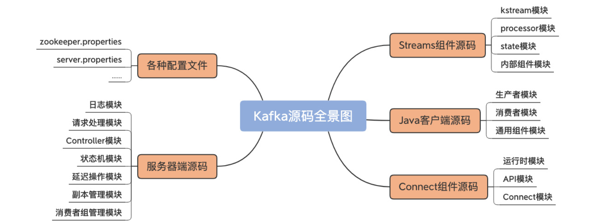

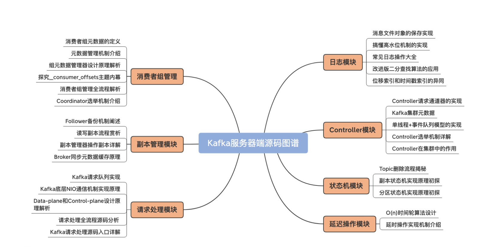

## 1 日志模块

日志在磁盘的组成图

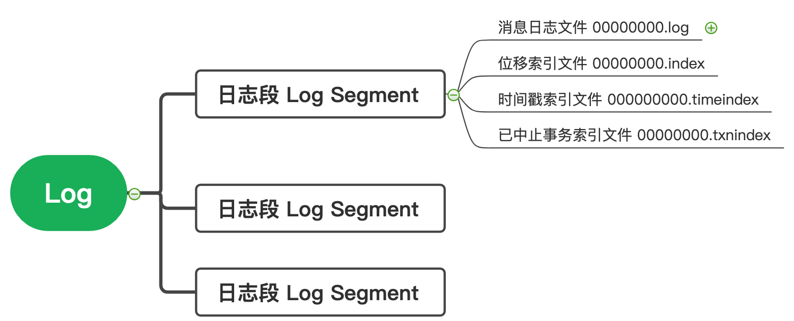

### 1.1 保存消息文件的对象是怎么实现的？LogSegment

- 为什么？为什么不单独用一个partition对应一个Log Segment？TODO: 为什么要切分日志。
- 是什么？每个partition目录下，都有多个log segment，用来存储日志和索引。
- 做什么？适合做日志存储和查询。
- 优缺点？offset在文件名中，有利于快速查找某一条消息。缺点是如果LogSegment太多，内存的对象就会很大，占用内存。
- 技术关键点？
  - 成员：log and index
  - 方法：append、read、recover


1. log 是保存实际的消息，FileRecords
2. index 是逻辑的offset到物理的position的映射，OffsetIndex

##### append: 日志写入

传入参数：写入日志的消息体、包括它的2类时间戳

- 先看log是否为空，空的话，更新rolling（日志切分）的时间戳（TODO: 日志切分需要搞清楚什么情况下会发生）
- 判断消息的位移值是否合法，合法就写入消息
- 更新最大的时间戳和它对应的offset
- 最后判断是否需要新增索引 ? 当前写入的字节数大于4K。

```scala
 @nonthreadsafe
  def append(largestOffset: Long,
             largestTimestamp: Long,
             shallowOffsetOfMaxTimestamp: Long,
             records: MemoryRecords): Unit = {
    if (records.sizeInBytes > 0) {
      val physicalPosition = log.sizeInBytes()
      if (physicalPosition == 0) //1 先看log是否为空，空的话，更新rolling（日志切分）的时间戳
        rollingBasedTimestamp = Some(largestTimestamp)

      ensureOffsetInRange(largestOffset) // 2 判断消息的位移值是否合法，合法就写入消息

      // append the messages
      val appendedBytes = log.append(records) // 写入消息
      // Update the in memory max timestamp and corresponding offset.
      if (largestTimestamp > maxTimestampSoFar) {
        maxTimestampSoFar = largestTimestamp
        offsetOfMaxTimestampSoFar = shallowOffsetOfMaxTimestamp
      }
      // append an entry to the index (if needed)
      if (bytesSinceLastIndexEntry > indexIntervalBytes) {
        offsetIndex.append(largestOffset, physicalPosition)
        timeIndex.maybeAppend(maxTimestampSoFar, offsetOfMaxTimestampSoFar)
        bytesSinceLastIndexEntry = 0
      }
      bytesSinceLastIndexEntry += records.sizeInBytes
    }
  }
```

#####  read：读取日志

传入参数：读取日志的开始的offset，最大能读的size条数和文件的最大position，是否允许至少读取一条日志

- 翻译起始的offset为实际的文件position

- 计算这次能够读取的最大条数，取min(输入参数最大读取条数 , 文件的最大能读取的条数)

- 直接读取，返回一个FetchDataInfo

  ```scala
  @threadsafe
    def read(startOffset: Long,
             maxSize: Int,
             maxPosition: Long = size,
             minOneMessage: Boolean = false): FetchDataInfo = {
  
      val startOffsetAndSize = translateOffset(startOffset) // 1 翻译起始的offset为实际的文件position
  
      // if the start position is already off the end of the log, return null
      if (startOffsetAndSize == null)
        return null
  
      val startPosition = startOffsetAndSize.position
      val offsetMetadata = LogOffsetMetadata(startOffset, this.baseOffset, startPosition)
  
      val adjustedMaxSize =
        if (minOneMessage) math.max(maxSize, startOffsetAndSize.size)
        else maxSize
  
      // return a log segment but with zero size in the case below
      if (adjustedMaxSize == 0)
        return FetchDataInfo(offsetMetadata, MemoryRecords.EMPTY)
  
      // calculate the length of the message set to read based on whether or not they gave us a maxOffset
      val fetchSize: Int = min((maxPosition - startPosition).toInt, adjustedMaxSize) // 2 计算这次能够读取的最大条数，取min(输入参数最大读取条数 , 文件的最大能读取的条数)
  
      FetchDataInfo(offsetMetadata, log.slice(startPosition, fetchSize), // 3 直接读取，返回一个FileRecords
        firstEntryIncomplete = adjustedMaxSize < startOffsetAndSize.size)
    }
  ```

  

##### recover: 恢复日志段

recovery 使用场景：Broker在启动的时候，会把所有的Log Segment文件加载到内存中，生成一系列的LogSegment实例。（应该不是把所有的文件都读进去了，只是读个文件名）

传入参数：ProducerStateManager Producer的状态管理员、LeaderEpochFileCache 这个Partition的LeaderEpoch信息。

- 1 清空所有index的数据，包括offsetindex，timeindex, txnindex
- 2 遍历Log Segment里面，所有的消息集合Batch
  - 2.1 校验
  - 2.2 更新这批Batch消息的最大时间戳和最大位移  
  - 2.3 更新index 
  - 2.4 更新LeaderEpoch缓存和ProducerStateManager
- 3 如果发现读取的日志消息少于LogSegement本身的字节数，就截断日志和index文件

```scala
 @nonthreadsafe
  def recover(producerStateManager: ProducerStateManager, leaderEpochCache: Option[LeaderEpochFileCache] = None): Int = {
    offsetIndex.reset() // 1 清空所有index的数据
    timeIndex.reset()
    txnIndex.reset()
    var validBytes = 0
    var lastIndexEntry = 0
    maxTimestampSoFar = RecordBatch.NO_TIMESTAMP
    try {
      for (batch <- log.batches.asScala) { // 2 遍历所有日志
        batch.ensureValid() // 2.1 校验
        ensureOffsetInRange(batch.lastOffset)

        // The max timestamp is exposed at the batch level, so no need to iterate the records
        // 2.2 更新最大时间戳和最大位移  
        if (batch.maxTimestamp > maxTimestampSoFar) {
          maxTimestampSoFar = batch.maxTimestamp
          offsetOfMaxTimestampSoFar = batch.lastOffset
        }

        // Build offset index // 2.3 更新index 
        if (validBytes - lastIndexEntry > indexIntervalBytes) {
          offsetIndex.append(batch.lastOffset, validBytes)
          timeIndex.maybeAppend(maxTimestampSoFar, offsetOfMaxTimestampSoFar)
          lastIndexEntry = validBytes
        }
        validBytes += batch.sizeInBytes()
		// 2.4 更新LeaderEpoch缓存和ProducerStateManager
        if (batch.magic >= RecordBatch.MAGIC_VALUE_V2) {
          leaderEpochCache.foreach { cache =>
            if (batch.partitionLeaderEpoch > 0 && cache.latestEpoch.forall(batch.partitionLeaderEpoch > _))
              cache.assign(batch.partitionLeaderEpoch, batch.baseOffset)
          }
          updateProducerState(producerStateManager, batch)
        }
      }
    } catch {
      
    }
    val truncated = log.sizeInBytes - validBytes
    if (truncated > 0)
      debug(s"Truncated $truncated invalid bytes at the end of segment ${log.file.getAbsoluteFile} during recovery")

    log.truncateTo(validBytes) // 3 截断日志和index文件
    offsetIndex.trimToValidSize()
    // A normally closed segment always appends the biggest timestamp ever seen into log segment, we do this as well.
    timeIndex.maybeAppend(maxTimestampSoFar, offsetOfMaxTimestampSoFar, skipFullCheck = true)
    timeIndex.trimToValidSize()
    truncated
  }
```

##### 总结

- append的时候，什么时候更新的索引？（读取的消息累计大于4KB）
- read的时候，minMessage参数的作用是什么？(至少可以读取一条message，防止消费饥饿)
- recovery的时候，要读取LogSegment本地文件，然后构建索引。这会造成Kafka Broker启动很慢，因为要读很多本地磁盘文件的嘛。

### 1.2 Log是如何加载log segment的？

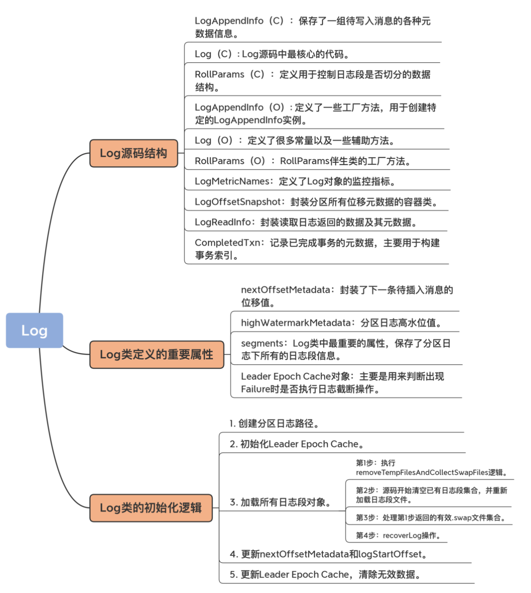

Kafka定义的文件类型有哪些？.index .log .timeindex .txnindex , 还有.swap .cleaned .snapshot .deteled

- .swap 和 .clean 是日志做campaction的中间产物
- .deteled 删除日志文件。（异步）
- .snapshot 事务相关的文件

maybeIncrementHighWatermark 有什么作用？当leader收到follower所有提交的(HW,LEO)后，会判断是否更新高水位。

### 1.3 Log对象的常见操作

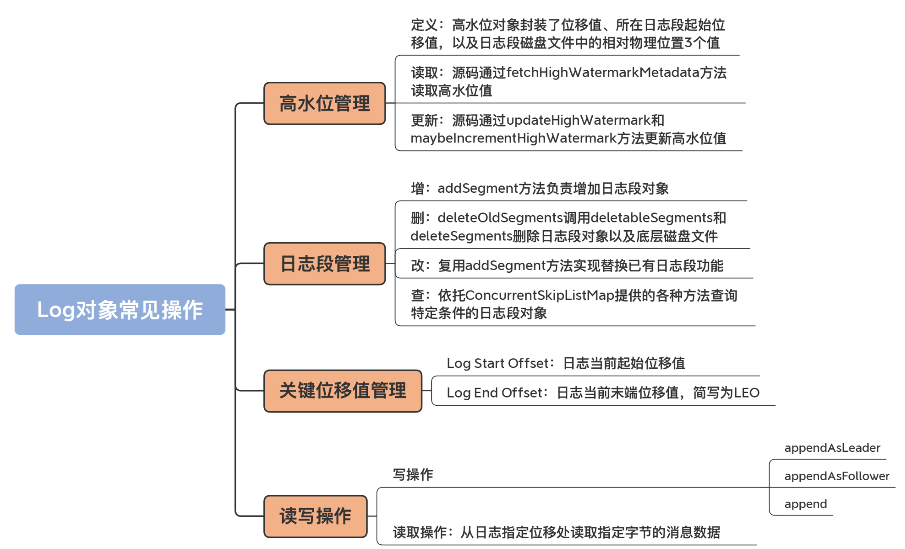

##### 高水位值

```scala
// 高水位值的定义
@volatile private var highWatermarkMetadata: LogOffsetMetadata = LogOffsetMetadata(logStartOffset) // volatile LogOffsetMetadata类型，初始值是logStartOffset

/*
 * A log offset structure, including: LogOffsetMetata包含三个类型：
 *  1. the message offset （消息位移值）
 *  2. the base message offset of the located segment （segment的起始位移值）
 *  3. the physical position on the located segment（该位移值所在的物理磁盘位置）
 */
case class LogOffsetMetadata(messageOffset: Long,
                             segmentBaseOffset: Long = Log.UnknownOffset,
                             relativePositionInSegment: Int = LogOffsetMetadata.UnknownFilePosition)
```

- 高水位值的获取
  - 读取时日志不能被关闭
  - 没有获得完整的高水位值，就通过读取日志，来构造一个高水位；同时更新它

```scala
private def fetchHighWatermarkMetadata: LogOffsetMetadata = {
    checkIfMemoryMappedBufferClosed()

    val offsetMetadata = highWatermarkMetadata 
    if (offsetMetadata.messageOffsetOnly) {
      lock.synchronized {
        val fullOffset = convertToOffsetMetadataOrThrow(highWatermark)
        updateHighWatermarkMetadata(fullOffset)
        fullOffset
      }
    } else {
      offsetMetadata
    }
  }
```

- 更新高水位值
  - 高水位一定在[Log Start Offset, Log End Offset]之间
  - 有2个方法，一个用来Follower更新高水位；一个用来Leader更新高水位。

```scala
def updateHighWatermark(hw: Long): Long = {
    val newHighWatermark = if (hw < logStartOffset)
      logStartOffset
    else if (hw > logEndOffset)
      logEndOffset
    else
      hw
    updateHighWatermarkMetadata(LogOffsetMetadata(newHighWatermark))
    newHighWatermark
  }

def maybeIncrementHighWatermark(newHighWatermark: LogOffsetMetadata): Option[LogOffsetMetadata] = {
    lock.synchronized {
      val oldHighWatermark = fetchHighWatermarkMetadata

      // Ensure that the high watermark increases monotonically. We also update the high watermark when the new
      // offset metadata is on a newer segment, which occurs whenever the log is rolled to a new segment.
      if (oldHighWatermark.messageOffset < newHighWatermark.messageOffset ||
        (oldHighWatermark.messageOffset == newHighWatermark.messageOffset && oldHighWatermark.onOlderSegment(newHighWatermark))) {
        updateHighWatermarkMetadata(newHighWatermark)
        Some(oldHighWatermark)
      } else {
        None
      }
    }
  }
```

##### 日志段管理：ConcurrentSkipListMap

```scala
private val segments: ConcurrentNavigableMap[java.lang.Long, LogSegment] = new ConcurrentSkipListMap[java.lang.Long, LogSegment] // 线程安全，可排序的Map
```

利用跳表的操作来实现增删改查。

1. 添加addSegment
2. 删除：根据留存策略来删除
   - 基于时间
   - 基于空间
   - 基于LogStartOffset
3. 修改：直接利用Map的put特性，进行替换。
4. 查询：利用ConcurrentSkipListMap来实现
   - segments.firstEntry
   - segments.lastEntry
   - segments.highEntry
   - segments.floorEntry

##### LEO的更新时机

1. 日志初始化时候
2. 写入新消息的时候
3. Log对象切分（Log Roll）的时候，一旦当前写入的日志段满了，就创建1个全新的日志段对象。
4. 日志截断的时候（Truncate）

##### 写操作

- appendAsLeader：写leader副本
- appendAsFollower：Follower同步副本的时候

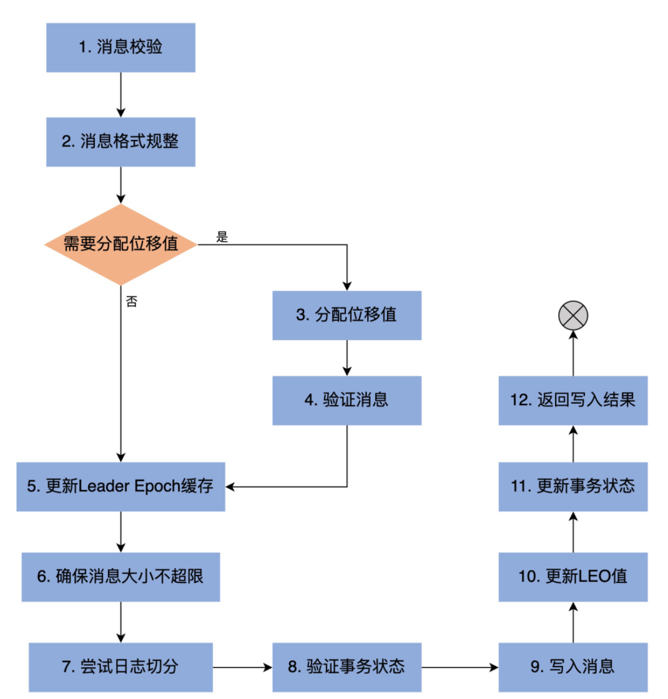


##### 读操作

```scala
def read(startOffset: Long,
           maxLength: Int,
           isolation: FetchIsolation,
           minOneMessage: Boolean): FetchDataInfo 
```

- isolation:读取设置的级别，主要控制能够读取的最大位移值。是幂等的，还是事务的，还是普通的，多用于kafka事务。

### 1.4 索引：改进版的二分查找

- 问题：一个索引文件有多大，能存储多少条索引信息，能索引多少文件，具体的实现是什么？mmaps
  - 10M，1M条信息，可以存储多少大小消息：4KB * 1M = 4K MB = 4GB消息。就是10M索引文件对应4GB index文件

- 改进二分体现在哪里？ _warmEntries=8192
  - for index: 只有8192/8 = 1024条索引，对应文件大小：1024*4KB = 4MB，热点数据4M
  - for time index : 只有8192/12=2.7MB, 热点数据2.7MB

继承关系：

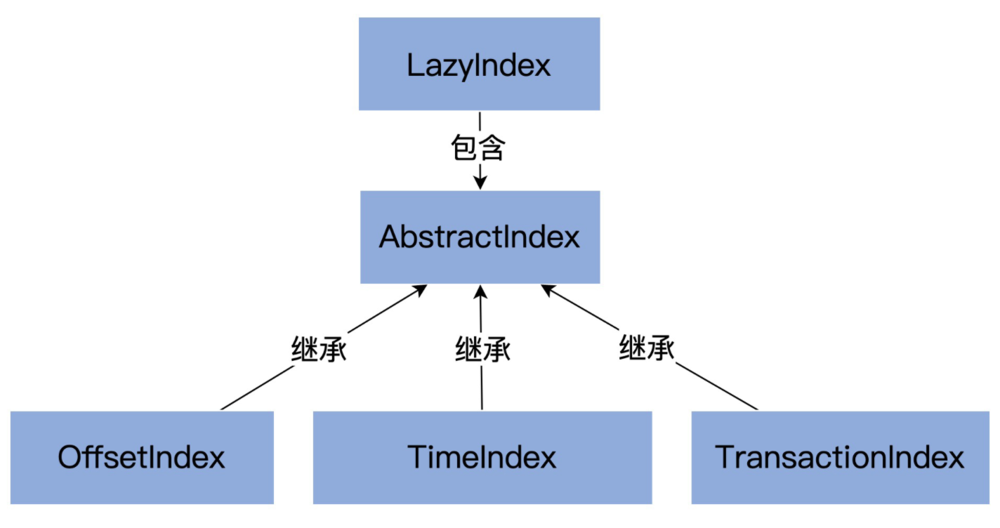

一个索引文件默认10MB，一个索引项8Byte，因此一个文件可能包含1M条索引项。

Kafka的索引是**稀疏索引**，这样可以避免索引文件占用过多的内存，从而可以**在内存中保存更多的索引**。对应的就是Broker 端参数`log.index.interval.bytes` 值，默认4KB，即4KB的消息建一条索引。

掌握以下几点：

- offset index：4Byte保存相对位移，4Byte保存物理位置
- timestamp index: 8 Byte 保存时间戳，4Byte保存物理位置
- 索引的底层原理是什么？mmap，内存映射文件，Java实现是MappedByteBuffer。


- 索引项是如何写入的？

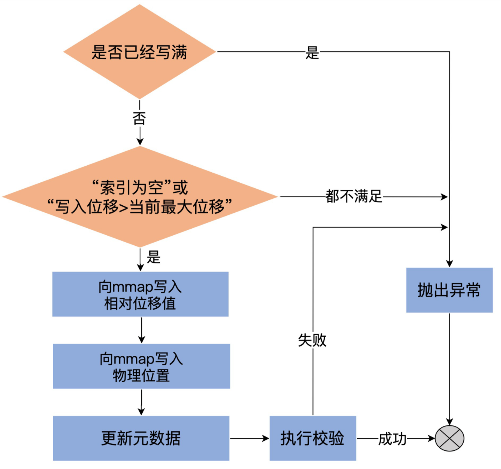

- 索引项是如何查找的？改进版的二分搜索：根据targetOffset，查找对应的slot，然后parseEntry，得到这个targetOffset所在的位置。

  - 标准的二分有性能问题：没有考虑到缓存失效的问题，会导致不必要的page fault。Kafka的查询会阻塞，等到磁盘数据读入到页缓存中。

  - 改进的二分，引入_warmEntries(8192)，让**查询热数据部分时，遍历的Page永远是固定的**，这样能避免缺页中断。

    > 联想：**一致性hash相对于普通的hash不就是在node新增的时候缓存的访问固定，或者只需要迁移少部分数据**。

- **为什么_warmEntries要设置成8192bytes？**

  - 足够小，能够保证热区的数据真正在页缓存。

    ```java
    二分搜索需要查询3个 Entry，indexEntry(end), indexEntry(end-N),and indexEntry((end*2 -N)/2)，这3个Entry最多存储在3个页中，能够保证3个页都在页缓存中
    ```

  - 足够大，能够保证in-sync的请求都在热区。8192bytes可以容纳4M的offset数据，2.7M的timeOffset数据。

- 不同索引的区别？

  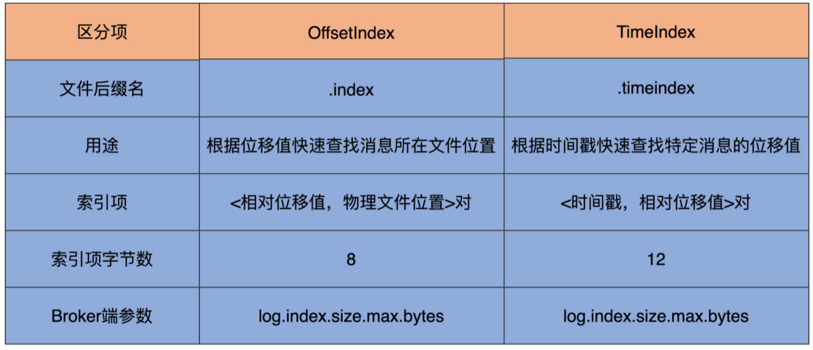

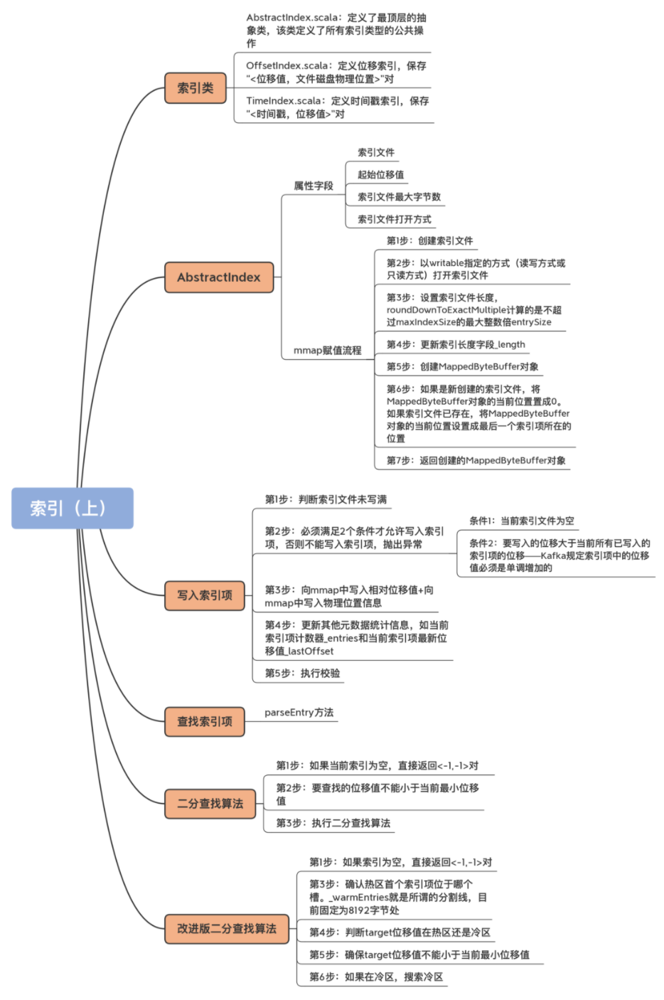

**总结**

- 索引是在文件末尾追加的写入的，并且一般写入的数据立马就会被读取。所以数据的热点集中在尾部。并且操作系统基本上都是**用页为单位缓存和管理内存的，内存又是有限的**，因此会通过类LRU机制淘汰内存。

- 扩展：MySQL的buffer pool管理 from[Kafka索引设计解析](https://blog.csdn.net/yessimida/article/details/107094634 )

  - MySQL的将缓冲池分为了新生代和老年代。默认是37分，即老年代占3，新生代占7。即看作一个链表的尾部30%为老年代，前面的70%为新生代。**替换了标准的LRU淘汰机制**。

  - 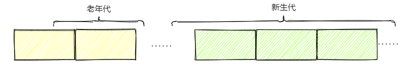

  - MySQL的缓冲池分区是为了解决预读失效和缓存污染问题。

    1. 预读失效：因为会预读页，假设预读的页不会用到，那么就白白预读了，因此让预读的页插入的是老年代头部，淘汰也是从老年代尾部淘汰。不会影响新生代数据。

    2. 缓存污染：在类似like全表扫描的时候，会读取很多冷数据。并且有些查询频率其实很少，因此让这些数据仅仅存在老年代，然后快速淘汰才是正确的选择，MySQL为了解决这种问题，仅仅分代是不够的，还设置了一个时间窗口，默认是1s，即在老年代被再次访问并且存在超过1s，才会晋升到新生代，这样就不会污染新生代的热数据。


## 2 请求处理

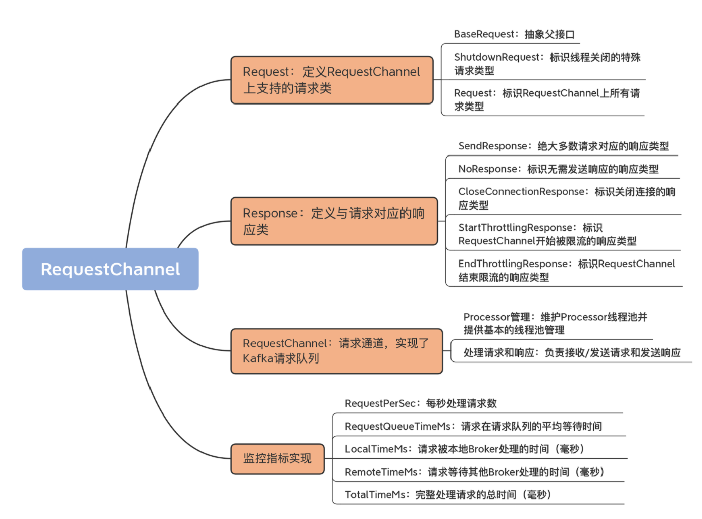
