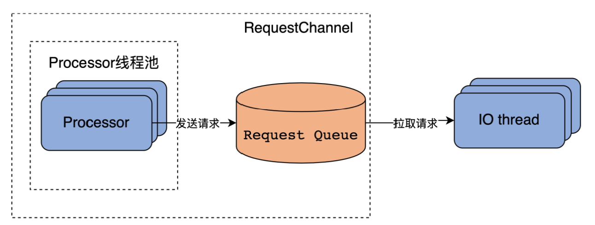
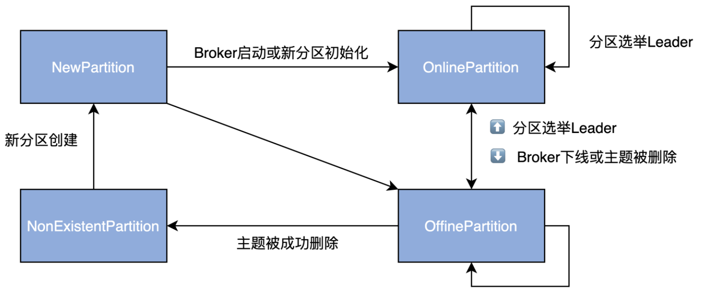
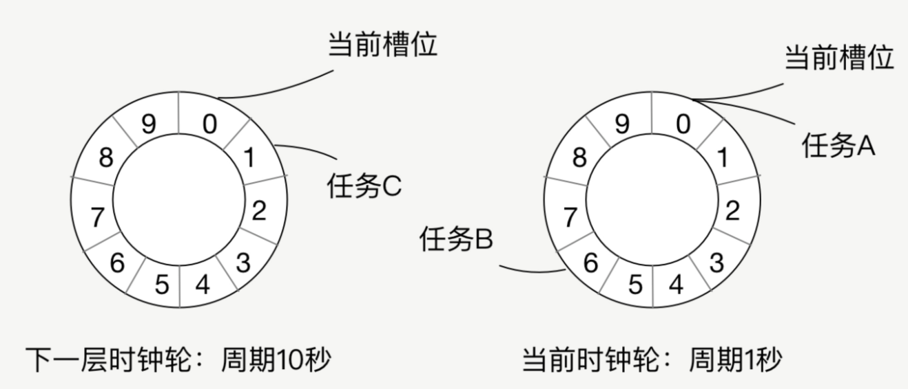
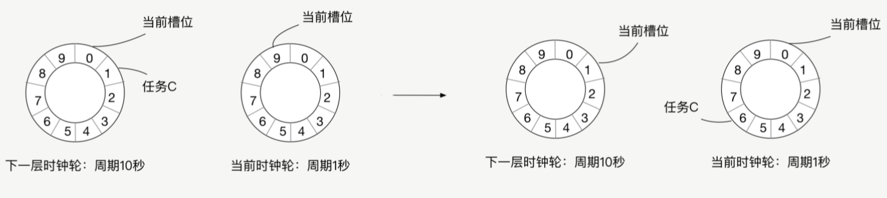
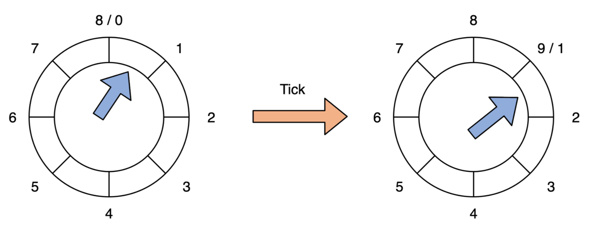
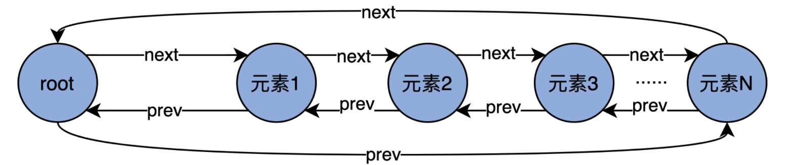
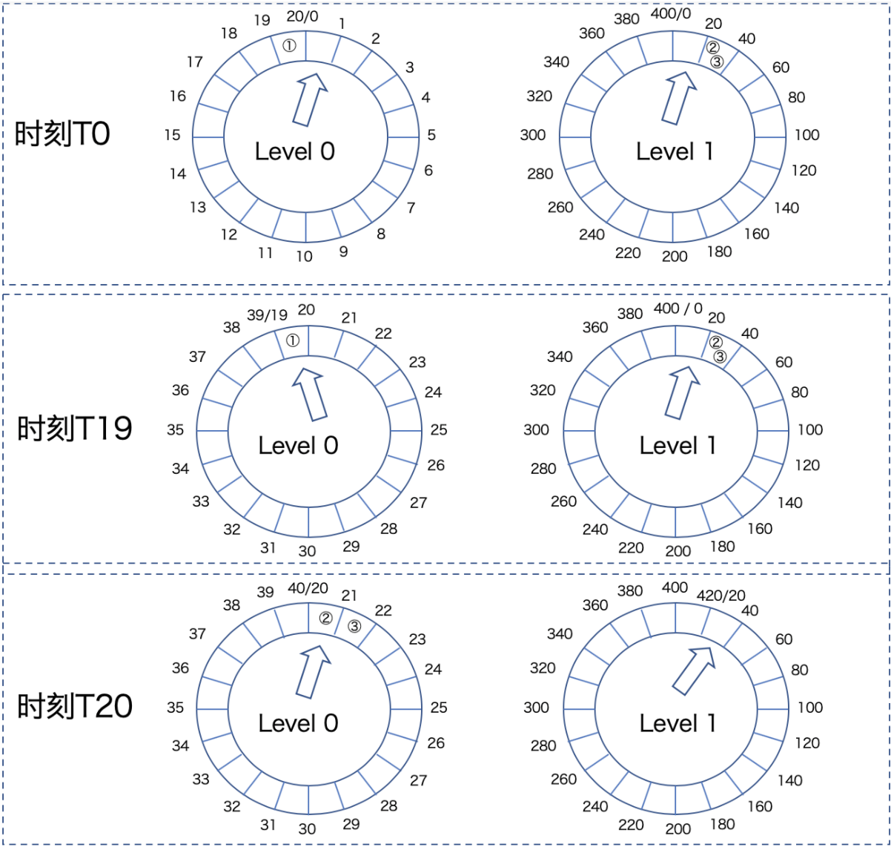

## 1 日志模块

日志在磁盘的组成图


### 1.1 保存消息文件的对象是怎么实现的？LogSegment

- 为什么？为什么不单独用一个partition对应一个Log Segment？TODO: 为什么要切分日志。
- 是什么？每个partition目录下，都有多个log segment，用来存储日志和索引。
- 做什么？适合做日志存储和查询。
- 优缺点？offset在文件名中，有利于快速查找某一条消息。缺点是如果LogSegment太多，内存的对象就会很大，占用内存。
- 技术关键点？
  - 成员：log and index
  - 方法：append、read、recover


1. log 是保存实际的消息，FileRecords
2. index 是逻辑的offset到物理的position的映射，OffsetIndex

##### append: 日志写入

传入参数：写入日志的消息体、包括它的2类时间戳

- 先看log是否为空，空的话，更新rolling（日志切分）的时间戳（TODO: 日志切分需要搞清楚什么情况下会发生）
- 判断消息的位移值是否合法，合法就写入消息
- 更新最大的时间戳和它对应的offset
- 最后判断是否需要新增索引 ? 当前写入的字节数大于4K。

```scala
 @nonthreadsafe
  def append(largestOffset: Long,
             largestTimestamp: Long,
             shallowOffsetOfMaxTimestamp: Long,
             records: MemoryRecords): Unit = {
    if (records.sizeInBytes > 0) {
      val physicalPosition = log.sizeInBytes()
      if (physicalPosition == 0) //1 先看log是否为空，空的话，更新rolling（日志切分）的时间戳
        rollingBasedTimestamp = Some(largestTimestamp)

      ensureOffsetInRange(largestOffset) // 2 判断消息的位移值是否合法，合法就写入消息

      // append the messages
      val appendedBytes = log.append(records) // 写入消息
      // Update the in memory max timestamp and corresponding offset.
      if (largestTimestamp > maxTimestampSoFar) {
        maxTimestampSoFar = largestTimestamp
        offsetOfMaxTimestampSoFar = shallowOffsetOfMaxTimestamp
      }
      // append an entry to the index (if needed)
      if (bytesSinceLastIndexEntry > indexIntervalBytes) {
        offsetIndex.append(largestOffset, physicalPosition)
        timeIndex.maybeAppend(maxTimestampSoFar, offsetOfMaxTimestampSoFar)
        bytesSinceLastIndexEntry = 0
      }
      bytesSinceLastIndexEntry += records.sizeInBytes
    }
  }
```

#####  read：读取日志

传入参数：读取日志的开始的offset，最大能读的size条数和文件的最大position，是否允许至少读取一条日志

- 翻译起始的offset为实际的文件position

- 计算这次能够读取的最大条数，取min(输入参数最大读取条数 , 文件的最大能读取的条数)

- 直接读取，返回一个FetchDataInfo

  ```scala
  @threadsafe
    def read(startOffset: Long,
             maxSize: Int,
             maxPosition: Long = size,
             minOneMessage: Boolean = false): FetchDataInfo = {
  
      val startOffsetAndSize = translateOffset(startOffset) // 1 翻译起始的offset为实际的文件position
  
      // if the start position is already off the end of the log, return null
      if (startOffsetAndSize == null)
        return null
  
      val startPosition = startOffsetAndSize.position
      val offsetMetadata = LogOffsetMetadata(startOffset, this.baseOffset, startPosition)
  
      val adjustedMaxSize =
        if (minOneMessage) math.max(maxSize, startOffsetAndSize.size)
        else maxSize
  
      // return a log segment but with zero size in the case below
      if (adjustedMaxSize == 0)
        return FetchDataInfo(offsetMetadata, MemoryRecords.EMPTY)
  
      // calculate the length of the message set to read based on whether or not they gave us a maxOffset
      val fetchSize: Int = min((maxPosition - startPosition).toInt, adjustedMaxSize) // 2 计算这次能够读取的最大条数，取min(输入参数最大读取条数 , 文件的最大能读取的条数)
  
      FetchDataInfo(offsetMetadata, log.slice(startPosition, fetchSize), // 3 直接读取，返回一个FileRecords
        firstEntryIncomplete = adjustedMaxSize < startOffsetAndSize.size)
    }
  ```

  

##### recover: 恢复日志段

recovery 使用场景：Broker在启动的时候，会把所有的Log Segment文件加载到内存中，生成一系列的LogSegment实例。（应该不是把所有的文件都读进去了，只是读个文件名）

传入参数：ProducerStateManager Producer的状态管理员、LeaderEpochFileCache 这个Partition的LeaderEpoch信息。

- 1 清空所有index的数据，包括offsetindex，timeindex, txnindex
- 2 遍历Log Segment里面，所有的消息集合Batch
  - 2.1 校验
  - 2.2 更新这批Batch消息的最大时间戳和最大位移  
  - 2.3 更新index 
  - 2.4 更新LeaderEpoch缓存和ProducerStateManager
- 3 如果发现读取的日志消息少于LogSegement本身的字节数，就截断日志和index文件

```scala
 @nonthreadsafe
  def recover(producerStateManager: ProducerStateManager, leaderEpochCache: Option[LeaderEpochFileCache] = None): Int = {
    offsetIndex.reset() // 1 清空所有index的数据
    timeIndex.reset()
    txnIndex.reset()
    var validBytes = 0
    var lastIndexEntry = 0
    maxTimestampSoFar = RecordBatch.NO_TIMESTAMP
    try {
      for (batch <- log.batches.asScala) { // 2 遍历所有日志
        batch.ensureValid() // 2.1 校验
        ensureOffsetInRange(batch.lastOffset)

        // The max timestamp is exposed at the batch level, so no need to iterate the records
        // 2.2 更新最大时间戳和最大位移  
        if (batch.maxTimestamp > maxTimestampSoFar) {
          maxTimestampSoFar = batch.maxTimestamp
          offsetOfMaxTimestampSoFar = batch.lastOffset
        }

        // Build offset index // 2.3 更新index 
        if (validBytes - lastIndexEntry > indexIntervalBytes) {
          offsetIndex.append(batch.lastOffset, validBytes)
          timeIndex.maybeAppend(maxTimestampSoFar, offsetOfMaxTimestampSoFar)
          lastIndexEntry = validBytes
        }
        validBytes += batch.sizeInBytes()
		// 2.4 更新LeaderEpoch缓存和ProducerStateManager
        if (batch.magic >= RecordBatch.MAGIC_VALUE_V2) {
          leaderEpochCache.foreach { cache =>
            if (batch.partitionLeaderEpoch > 0 && cache.latestEpoch.forall(batch.partitionLeaderEpoch > _))
              cache.assign(batch.partitionLeaderEpoch, batch.baseOffset)
          }
          updateProducerState(producerStateManager, batch)
        }
      }
    } catch {
      
    }
    val truncated = log.sizeInBytes - validBytes
    if (truncated > 0)
      debug(s"Truncated $truncated invalid bytes at the end of segment ${log.file.getAbsoluteFile} during recovery")

    log.truncateTo(validBytes) // 3 截断日志和index文件
    offsetIndex.trimToValidSize()
    // A normally closed segment always appends the biggest timestamp ever seen into log segment, we do this as well.
    timeIndex.maybeAppend(maxTimestampSoFar, offsetOfMaxTimestampSoFar, skipFullCheck = true)
    timeIndex.trimToValidSize()
    truncated
  }
```

##### 总结

- append的时候，什么时候更新的索引？（读取的消息累计大于4KB）
- read的时候，minMessage参数的作用是什么？(至少可以读取一条message，防止消费饥饿)
- recovery的时候，要读取LogSegment本地文件，然后构建索引。这会造成Kafka Broker启动很慢，因为要读很多本地磁盘文件的嘛。

### 1.2 Log是如何加载log segment的？


Kafka定义的文件类型有哪些？.index .log .timeindex .txnindex , 还有.swap .cleaned .snapshot .deteled

- .swap 和 .clean 是日志做campaction的中间产物
- .deteled 删除日志文件。（异步）
- .snapshot 事务相关的文件

maybeIncrementHighWatermark 有什么作用？当leader收到follower所有提交的(HW,LEO)后，会判断是否更新高水位。

### 1.3 Log对象的常见操作


##### 高水位值

```scala
// 高水位值的定义
@volatile private var highWatermarkMetadata: LogOffsetMetadata = LogOffsetMetadata(logStartOffset) // volatile LogOffsetMetadata类型，初始值是logStartOffset

/*
 * A log offset structure, including: LogOffsetMetata包含三个类型：
 *  1. the message offset （消息位移值）
 *  2. the base message offset of the located segment （segment的起始位移值）
 *  3. the physical position on the located segment（该位移值所在的物理磁盘位置）
 */
case class LogOffsetMetadata(messageOffset: Long,
                             segmentBaseOffset: Long = Log.UnknownOffset,
                             relativePositionInSegment: Int = LogOffsetMetadata.UnknownFilePosition)
```

- 高水位值的获取
  - 读取时日志不能被关闭
  - 没有获得完整的高水位值，就通过读取日志，来构造一个高水位；同时更新它

```scala
private def fetchHighWatermarkMetadata: LogOffsetMetadata = {
    checkIfMemoryMappedBufferClosed()

    val offsetMetadata = highWatermarkMetadata 
    if (offsetMetadata.messageOffsetOnly) {
      lock.synchronized {
        val fullOffset = convertToOffsetMetadataOrThrow(highWatermark)
        updateHighWatermarkMetadata(fullOffset)
        fullOffset
      }
    } else {
      offsetMetadata
    }
  }
```

- 更新高水位值
  - 高水位一定在[Log Start Offset, Log End Offset]之间
  - 有2个方法，一个用来Follower更新高水位；一个用来Leader更新高水位。

```scala
def updateHighWatermark(hw: Long): Long = {
    val newHighWatermark = if (hw < logStartOffset)
      logStartOffset
    else if (hw > logEndOffset)
      logEndOffset
    else
      hw
    updateHighWatermarkMetadata(LogOffsetMetadata(newHighWatermark))
    newHighWatermark
  }

def maybeIncrementHighWatermark(newHighWatermark: LogOffsetMetadata): Option[LogOffsetMetadata] = {
    lock.synchronized {
      val oldHighWatermark = fetchHighWatermarkMetadata

      // Ensure that the high watermark increases monotonically. We also update the high watermark when the new
      // offset metadata is on a newer segment, which occurs whenever the log is rolled to a new segment.
      if (oldHighWatermark.messageOffset < newHighWatermark.messageOffset ||
        (oldHighWatermark.messageOffset == newHighWatermark.messageOffset && oldHighWatermark.onOlderSegment(newHighWatermark))) {
        updateHighWatermarkMetadata(newHighWatermark)
        Some(oldHighWatermark)
      } else {
        None
      }
    }
  }
```

##### 日志段管理：ConcurrentSkipListMap

```scala
private val segments: ConcurrentNavigableMap[java.lang.Long, LogSegment] = new ConcurrentSkipListMap[java.lang.Long, LogSegment] // 线程安全，可排序的Map
```

利用跳表的操作来实现增删改查。

1. 添加addSegment
2. 删除：根据留存策略来删除
   - 基于时间
   - 基于空间
   - 基于LogStartOffset
3. 修改：直接利用Map的put特性，进行替换。
4. 查询：利用ConcurrentSkipListMap来实现
   - segments.firstEntry
   - segments.lastEntry
   - segments.highEntry
   - segments.floorEntry

##### LEO的更新时机

1. 日志初始化时候
2. 写入新消息的时候
3. Log对象切分（Log Roll）的时候，一旦当前写入的日志段满了，就创建1个全新的日志段对象。
4. 日志截断的时候（Truncate）

##### 写操作

- appendAsLeader：写leader副本
- appendAsFollower：Follower同步副本的时候


##### 读操作

```scala
def read(startOffset: Long,
           maxLength: Int,
           isolation: FetchIsolation,
           minOneMessage: Boolean): FetchDataInfo 
```

- isolation:读取设置的级别，主要控制能够读取的最大位移值。是幂等的，还是事务的，还是普通的，多用于kafka事务。

### 1.4 索引：改进版的二分查找

- 问题：一个索引文件有多大，能存储多少条索引信息，能索引多少文件，具体的实现是什么？mmaps
  - 10M，1M条信息，可以存储多少大小消息：4KB * 1M = 4K MB = 4GB消息。就是10M索引文件对应4GB index文件

- 改进二分体现在哪里？ _warmEntries=8192
  - for index: 只有8192/8 = 1024条索引，对应文件大小：1024*4KB = 4MB，热点数据4M
  - for time index : 只有8192/12=2.7MB, 热点数据2.7MB

继承关系：


一个索引文件默认10MB，一个索引项8Byte，因此一个文件可能包含1M条索引项。

Kafka的索引是**稀疏索引**，这样可以避免索引文件占用过多的内存，从而可以**在内存中保存更多的索引**。对应的就是Broker 端参数`log.index.interval.bytes` 值，默认4KB，即4KB的消息建一条索引。

掌握以下几点：

- offset index：4Byte保存相对位移，4Byte保存物理位置
- timestamp index: 8 Byte 保存时间戳，4Byte保存物理位置
- 索引的底层原理是什么？mmap，内存映射文件，Java实现是MappedByteBuffer。


- 索引项是如何写入的？


- 索引项是如何查找的？改进版的二分搜索：根据targetOffset，查找对应的slot，然后parseEntry，得到这个targetOffset所在的位置。

  - 标准的二分有性能问题：没有考虑到缓存失效的问题，会导致不必要的page fault。Kafka的查询会阻塞，等到磁盘数据读入到页缓存中。

  - 改进的二分，引入_warmEntries(8192)，让**查询热数据部分时，遍历的Page永远是固定的**，这样能避免缺页中断。

    > 联想：**一致性hash相对于普通的hash不就是在node新增的时候缓存的访问固定，或者只需要迁移少部分数据**。

- **为什么_warmEntries要设置成8192bytes？**

  - 足够小，能够保证热区的数据真正在页缓存。

    ```java
    二分搜索需要查询3个 Entry，indexEntry(end), indexEntry(end-N),and indexEntry((end*2 -N)/2)，这3个Entry最多存储在3个页中，能够保证3个页都在页缓存中
    ```

  - 足够大，能够保证in-sync的请求都在热区。8192bytes可以容纳4M的offset数据，2.7M的timeOffset数据。

- 不同索引的区别？

  


**总结**

- 索引是在文件末尾追加的写入的，并且一般写入的数据立马就会被读取。所以数据的热点集中在尾部。并且操作系统基本上都是**用页为单位缓存和管理内存的，内存又是有限的**，因此会通过类LRU机制淘汰内存。

- 扩展：MySQL的buffer pool管理 from[Kafka索引设计解析](https://blog.csdn.net/yessimida/article/details/107094634 )

  - MySQL的将缓冲池分为了新生代和老年代。默认是37分，即老年代占3，新生代占7。即看作一个链表的尾部30%为老年代，前面的70%为新生代。**替换了标准的LRU淘汰机制**。

  - 

  - MySQL的缓冲池分区是为了解决预读失效和缓存污染问题。

    1. 预读失效：因为会预读页，假设预读的页不会用到，那么就白白预读了，因此让预读的页插入的是老年代头部，淘汰也是从老年代尾部淘汰。不会影响新生代数据。

    2. 缓存污染：在类似like全表扫描的时候，会读取很多冷数据。并且有些查询频率其实很少，因此让这些数据仅仅存在老年代，然后快速淘汰才是正确的选择，MySQL为了解决这种问题，仅仅分代是不够的，还设置了一个时间窗口，默认是1s，即在老年代被再次访问并且存在超过1s，才会晋升到新生代，这样就不会污染新生代的热数据。


## 2 请求处理

### RequestChannel

- 是什么？传输Request和Response的Channel。

- 用在哪里？IO线程和Processor线程池的通道。

- 核心实现：

  ```
  requestQueue = new ArrayBlockingQueue[BaseRequest](queueSize) // 阻塞队列，500 default
  processors = new ConcurrentHashMap[Int, Processor]() // 维护processor线程池
  Processor往Queue里面发请求（入队）
  IO thread往Queue里面poll请求（出队）
  ```


几个重要的监控指标：

- RequestsPerSec：每秒处理的 Request 数，用来评估 Broker 的繁忙状态。
- **RequestQueueTimeMs：计算 Request 在 Request 队列中的平均等候时间，单位是毫秒。倘若 Request 在队列的等待时间过长，你通常需要增加后端 I/O 线程的数量，来加快队列中 Request 的拿取速度。**（项目经验：sina发现3台broker的这个值过高，原因是它有一个热点topic，在CPU和负载还可以的情况下，提升了一倍IO线程数=8，加大处理能力；这个方案还可以应对突发流量，在流量开始激增的时候，通过监控拿到这个指标，临时加大IO线程数。最终的方法就是reassign 的分区的leader，重新平衡一下。这个问题，同样在EMC也遇到过，原因是topic申请分区太少，2个分区，但是数据量相对而言，特别大，导致晚上的时候发给这2个brokerr的请求，在队列的等待时间变长。）
- LocalTimeMs：计算 Request 实际被处理的时间，单位是毫秒。一旦定位到这个监控项的值很大，你就需要进一步研究 Request 被处理的逻辑了，具体分析到底是哪一步消耗了过多的时间。
- RemoteTimeMs：Kafka 的读写请求（PRODUCE 请求和 FETCH 请求）逻辑涉及等待其他 Broker 操作的步骤。RemoteTimeMs 计算的，就是等待其他 Broker 完成指定逻辑的时间。因为等待的是其他 Broker，因此被称为 Remote Time。这个监控项非常重要！Kafka 生产环境中设置 acks=all 的 Producer 程序发送消息延时高的主要原因，往往就是 Remote Time 高。因此，如果你也碰到了这样的问题，不妨先定位一下Remote Time 是不是瓶颈。（**项目经验：某些topic的Producer的延迟在ack=all的情况下特别高，RemoteTimeMs达到了1s以上，副本broker ping延迟查过了500ms，网络交换机出现了问题，更换交换机**）
- TotalTimeMs：计算 Request 被处理的完整流程时间。这是最实用的监控指标，没有之一！毕竟，我们通常都是根据 TotalTimeMs 来判断系统是否出现问题的。一旦发现了问题，我们才会利用前面的几个监控项进一步定位问题的原因。

> 详细总结一下，Kafka的server的性能如何诊断？

#### Request 类
- 是Acceptor接受外部请求，会转换成Request类，保存在RequestQueue中。

```scala
class Request(val processor: Int, // 保存这个request是被哪个processor处理的
              val context: RequestContext, 
              val startTimeNanos: Long,
              memoryPool: MemoryPool, // 由内存池来给这reques分配堆内内存，避免Request无限制使用内存(和Netty不同)
              @volatile private var buffer: ByteBuffer,
```

### SocketServer

- 是Reactor中MainReactor 和 SubReactor的实现

- 主要包括2个大块：

  - Acceptor线程：接收外部请求，创建TCP连接，分发给Processor处理。
    - 它使用Java NIO的Selector+SocketChannel方式轮询IO事件，主要是网络连接创建事件`SelectionKey.OP_ACCEPT`
    - 来请求时，指定一个Processor线程，让它建立真正的TCP连接。
  - Processor线程池：处理外部的IO请求，主要是将请求解析成Request类，放入RequestChannel的Request队列中，供业务线程使用。
  - SocketServer类：协调管理所有的组件，比如Acceptor和Processor

  


#### **Processor**

- 重要的队列
  - **newConnections=20 ArrayBlockingQueue**，它保存的是要创建的新连接信息，
  - **inflightResponses Map**，临时 Response 队列。当 Processor 线程将 Response 返还给Request 发送方之后，还要将 Response 放入这个临时队列。为什么？方便Response被真正发送之后，执行回调逻辑。
  - **responseQueue LinkedBlockingDeque**：每个 Processor 线程都会维护自己的 Response 队列。为了好发送回哪一个request。
- Processor的核心处理逻辑
  - 当Acceptor线程接收到请求之后，会选择一个Processor来处理这个连接，把SocketChannel放入到Processor的newConnections队列中。
  - 所以run方法的第一步，就是从这个队列中，取出所有请求，建立真正的连接。也就是取出Channel，把它注册到自己的Selector上。

```scala	
private val newConnections = new ArrayBlockingQueue[SocketChannel](connectionQuta)
private val inflightResponses = mutable.Map[String, RequestChannel.Response]()
private val responseQueue = new LinkedBlockingDeque[RequestChannel.Response]()

override def run(): Unit = {
    startupComplete() // 等待Processor线程启动
    try {
      while (isRunning) {
        try {
          // setup any new connections that have been queued up
          configureNewConnections() // 注册到Selector，建立真正的连接
          // register any new responses for writing
          processNewResponses() // 发送Response,并把Response放入到inflightResponses队列
          poll() // 执行NIO poll，获取SocketChannel上准备就绪的IO事件
          processCompletedReceives() // 将接收到的Request放入Request队列
          processCompletedSends()// 为临时Response队列中的Response执行回调逻辑
          processDisconnected()// 处理因发送失败而导致的连接断开
          closeExcessConnections() // 关闭超过配额限制部分的连接
        } catch {
          case e: Throwable => processException("Processor got uncaught exception.", e)
        }
      }
    } finally { // 关闭资源
      debug(s"Closing selector - processor $id")
      CoreUtils.swallow(closeAll(), this, Level.ERROR)
      shutdownComplete()
    }
  }
```

> 因为Selector 不熟悉，再多写一点：`poll() `执行后，Selector上就会有准备就绪的IO事件了，所以，接下来，就可以调用`          processCompletedReceives()`，把这些事件封装成Request，入队到RequestChannel的RequestQueue中，供KafkaRequestHandler IO线程来处理这些请求。

### 请求流程

这个图更加源码话表述。


- Client发送请求给SocketServer
- Acceptor收到请求，轮询的方式分配给Processor，创建TCP连接，放入到newConncetions队列
- Processor处理请求，把请求放入到RequestQueue
- KafkaRequestHandlerPool从请求队列中获取 Request 实例，然后交由 KafkaApis 的 handle 方法，执行真正的请求处理逻辑。
- KafkaRequestHandler 线程调用RequestChannel的SendResponse方法，将 Response 放入 Processor 线程的 Response Queue中
- 最后，Processor 线程发送 Response 给 Request 发送方

这张图更加易懂化。


- 1：Clients 或其他 Broker 发送请求给 Acceptor 线程

  - Acceptor 线程通过调用 accept 方法，创建对应的 SocketChannel，然后将该 Channel 实例传给 assignNewConnection 方法，等待 Processor 线程将该 Socket 连接 请求，放入到它维护的待处理连接队列中。后续 Processor 线程的 run 方法会不断地从该 队列中取出这些 Socket 连接请求，然后创建对应的 Socket 连接。
  - assignNewConnection 方法的主要作用是，将这个新建的 SocketChannel 对象存入 Processors 线程的 newConnections 队列中。之后，Processor 线程会不断轮询这个队列 中的待处理 Channel，并向这些 Channel 注册基于 Java NIO 的 Selector，用于真正的请求获取和响应发送 I/O 操作。

- 第 2 & 3 步：Processor 线程处理请求，并放入请求队列

  - 一旦 Processor 线程成功地向 SocketChannel 注册了 Selector，Clients 端或其他 Broker 端发送的请求就能通过该 SocketChannel 被获取到，具体的方法是 Processor 的 processCompleteReceives
  - Processor 线程处理请求，就是指它从底层 I/O 获取到发送数据，将其转换成 Request 对象实例，并最终添加到请求队列RequestQueue的过程。

- 4 步：I/O 线程处理请求

  - KafkaRequestHandler 线程循环地从请求队列中获取 Request 实例，然后交由 KafkaApis 的 handle 方法，执行真正的请求处理逻辑。

- 5 步：KafkaRequestHandler 线程将 Response 放入 Processor 线 程的 Response 队列

  - 这一步的工作由 KafkaApis 类完成。当然，这依然是由 KafkaRequestHandler 线程来完 成的。KafkaApis.scala 中有个 sendResponse 方法，将 Request 的处理结果 Response 发送出去。本质上，它就是调用了 RequestChannel 的 sendResponse 方法

- 6 步：Processor 线程发送 Response 给 Request 发送方

  - 最后一步是，Processor 线程取出 Response 队列中的 Response，返还给 Request 发送 方。具体代码位于 Processor 线程的 processNewResponses 方法
  - 最底层的部分是 sendResponse 方法来执行 Response 发送。该方法底 层使用 Selector 实现真正的发送逻辑。

  


#### KafkaRequestHandlerPool

- 是Reactor中ThreadPool的实现，真正处理请求的地方。
- 核心结构2个
  - KafkaRequestHandler：请求处理线程类。每个请求处理线程实例，负责从 SocketServer 的 RequestChannel 的请求队列中获取请求对象，并进行处理。
    - 依赖apis：KafkaApis类，用于真正实现请求处理逻辑的类
  - KafkaRequestHandlerPool：请求处理线程池，负责创建、维护、管理和销毁下辖的 请求处理线程。
- 细节上：Data plane 所属的 KafkaRequestHandlerPool 线程池的初始数量，就是 Broker 端的参数 nums.io.threads=8， Control plane 的线程池的数量，则硬编码为 1，队列长度20.

#### KafkaApis


- ApiKeys，枚举类型，封装了所有的 RPC 协议

KafkaApis 实际上是把处理完成的 Response 放回到前端 Processor 线程的 Response 队列中，而真正将 Response 返还给 Clients 或其他 Broker 的，其实是 Processor 线程，而不是执行 KafkaApis 逻辑的 KafkaRequestHandler 线程


## 3 Controller

- 为Partition选举leader副本；
- 全部元数据信息，同步到Broker 


- IsrChangeNotification 事件是标志 ISR 列表变更的事件，如果这个事件经常出现，说明副本的 ISR 列表经常发生变化，而这通常被认为是非正常情况，因此，你最好关注下这个事件的速率监控指标。

- offlinePartitionCount**该字段统计集群中所有离线或处于不可用状态的主题分区数量**


- LeaderAndIsrRequest：告诉 Broker 相关主题各个分区的 Leader 副本位于哪台 Broker 上、ISR 中的副本都在哪些 Broker 上。

- StopReplicaRequest：告知指定 Broker 停止它上面的副本对象，使用场景，是**分区副本迁移**和**删除主题**。

- UpdateMetadataRequest：更新 Broker 上的元数据缓存。

> 自 0.11.0.0 版本开始，社区陆续对 Controller 代码结构进行了改造。其中非常重要的一环，就是将**多线程并发访问的方式改为了单线程的事件队列方式**。

- Controller外部的事件到来，存放在事件队列，然后ControllerEventThread线程，根据取出事件，根据需要分发给各个Broker对应的请求阻塞队列里面去
- 每个RequestSendThread都从各自的阻塞队列里面拿出请求，发给对应的Broker。


```scala
ControllerEventManager代码：
private val queue = new LinkedBlockingQueue[QueuedEvent] // 事件队列
private[controller] val thread = new ControllerEventThread(ControllerEventThreadName) // 单一线程：处理不同种类的 ControllorEvent
```

Controller采用生产者消费者模式，如下。

- 为每一个 Broker 都创建一个对应的 RequestSendThread 线程。从阻塞队列中获取待发送的请求。

```scala
// ControllerChannelManager代码：
messageQueue：请求消息阻塞队列。你可以发现，Controller 为每个目标 Broker 都创建了一个消息队列。
```


RequestSendThread线程逻辑


> 注意的是，RequestSendThread 线程对请求发送的处理方式与 Broker 处理请求不太一样。它调用的 sendAndReceive 方法在发送完请求之后，会原地进入阻塞状态，等待 Response 返回。只有接收到 Response，并执行完回调逻辑之后，该线程才能从阻塞队列中取出下一个待发送请求进行处理。

#### 小结

- Controller 端请求：Controller 发送三类请求给 Broker，分别是 LeaderAndIsrRequest、StopReplicaRequest 和 UpdateMetadataRequest。

- RequestSendThread：该线程负责将请求发送给集群中的相关或所有 Broker。

- 请求阻塞队列 + RequestSendThread：Controller 会为集群上所有 Broker 创建对应的请求阻塞队列和 RequestSendThread 线程。

## 4 PartitionStateMachine：分区状态机

每个 Broker 进程启动时，会在创建 KafkaController 对象的过程中，生成 ZkPartitionStateMachine 实例，而只有 Controller 组件所在的 Broker，才会启动分区状态机。

**每个 Broker 启动时，都会创建对应的分区状态机和副本状态机实例，但只有 Controller 所在的 Broker 才会启动它们**

- Controller负责分区Leader选举

分区 4 类状态。

- NewPartition：分区被创建。“未初始化”的分区，不能选举 Leader。

- OnlinePartition：提供服务

- OfflinePartition：下线状态。

- NonExistentPartition：分区删除状态



#### 分区 Leader 选举的场景及方法

- OfflinePartitionLeaderElectionStrategy：Leader 副本下线场景
  - **1.assignments**
    分区的副本列表。 Assigned Replicas， AR，Seq[Int]类型。**AR 是有顺序的，而且不一定和 ISR 的顺序相同！**
    **2.isr**
    所有与 Leader 副本保持同步的副本列表，包括leader，Seq[Int]。
    **3.liveReplicas**
    所有处于存活状态的副本。
  - step1: 顺序搜索 AR 列表，并把第一个满足leader副本条件的选举为leader。
  - step2: 如果没找到，看看是否开启了unclean选举
    - 没有开启，选举失败
    - 开启，找第一个存活的分区副本作为leader
  
- ReassignPartitionLeaderElectionStrategy：分区副本Reassign场景

- PreferredReplicaPartitionLeaderElectionStrategy： 执行Preferred 副本 Leader 选举

- ControlledShutdownPartitionLeaderElectionStrategy：关闭 Broker


## 5 TimingWheel时间轮

### 解决的问题

Client发请求，服务端没有及时响应消息给调用端呢？调用端该如何处理超时的请求？

- 每个请求一个定时任务（线程消耗大）
- 一个线程每隔100ms判断所有请求是否超时（扫描频繁，耗CPU）
- 时间轮（减少CPU扫描次数）

### 使用场景

- client请求超时处理。在高并发、高访问量的情况下，时钟轮每次只轮询一个时间槽位中的任务，这样会节省大量的 CPU。
- 调用端与服务端的启动超时。以调用端为例，假设让应用 1 分钟内启动，如果超过 1 分钟则启动失败。在调用端启动时创建一个处理启动超时的定时任务，放到时钟轮里。
- 延时请求。比如让一个任务几分钟之后发送一条消息出去。可以实现订单过期功能，用户下单10分钟没付款，就取消订单。
- 定时心跳。心跳任务，放到时钟轮，运行完后，重设执行时间，重新放入时钟轮。

 3 个任务，分别是任务 A（90 毫秒之后执行）、任务 B（610 毫秒之后执行）与任务 C（1 秒 610 毫秒之后执行），因此，任务 A 被放到第 0 槽位，任务 B 被放到第 6 槽位，任务 C 被放到下一层时间轮的第 1 槽位。



- 任务 A被即刻执行
- 600 毫秒之后，当前槽位是第 6 槽位，第 6 槽位所有的任务都被取出执行；
- 1 秒钟之后，当前时钟轮重新开始了第 0 跳，下一层时钟轮从第 0 跳跳到了第 1 跳，将第 1 槽位的任务取出，放入到**当前的时钟轮**中第 6 槽位，等600ms后，任务 C 被执行。



### 注意

- 时间槽位的单位时间越短，时间轮触发任务的时间就越精确。
- 时间轮的槽位越多，那么一个任务被重复扫描的概率就越小，因为只有在多层时钟轮中的任务才会被重复扫描。
- 业务场景而定，对时钟轮的周期和时间槽数进行设置。


> 几乎所有的时间任务调度系统都是基于时间轮算法的。Linux的 Crontab、 Netty 

- 简单时间轮（Simple Timing Wheel）和分层时间轮（Hierarchical Timing Wheel）两类。两者各有利弊，也都有各自的使用场景。

- Kafka的应用场景：对ack=all的生产者消息，是一种延时请求，采用时间轮解决，扛住几十万的延时请求并发。



- 槽位的实现是Bucket(TimerTaskList)，双向循环链表
  - taskCounter，总定时任务数
  - expiration，过期时间戳
- 一跳的实现是Tick
- Kafka 使用DelayQueue 统一管理所有的 Bucket， TimerTaskList 对象，重用过期的Bucket。


每个 Bucket 是一个双向循环链表（Doubly Linked Cyclic List），里面保存了一组延时请求。



### TimeWheel 重要字段

- tickMs：滴答一次的时长， 1 毫秒

- wheelSize：时间轮上的 Bucket 数量。数量是 20。

- startMs：时间轮对象被创建时的起始时间戳。

- taskCounter：总定时任务数。

- queue：所有 Bucket 按照过期时间排序的延迟队列。

- interval：这层时间轮总时长，=滴答时长* wheelSize
- buckets：时间轮下的所有 Bucket 对象

- **currentTime：当前时间戳** ，控制时钟轮的当前时间，将它设置成小于当前时间的最大滴答时长的整数倍。

- overflowWheel：Kafka 是按需创建上层时间轮的。这也就是说，当有新的定时任务到达时，会尝试将其放入第 1 层时间轮。如果第 1 层的 interval 无法容纳定时任务的超时时间，就现场创建并配置好第 2 层时间轮，并再次尝试放入。
  - 1层，一跳的间隔是1ms，20ms以内的延时请求就放在这里
  - 2层，20ms，400ms
  - 3层，400ms，8s
  - 4层，8s，160s （如果是生产者消息30s超时，刚开始的时候，就会放在第4层时间轮）

advanceClock 方法：向前推进时钟，执行已达过期时间的延迟任务。

```scala
def advanceClock(timeMs: Long): Unit = {
  // 向前驱动到的时点要超过Bucket的时间范围，才是有意义的推进，否则什么都不做
  // 更新当前时间currentTime到下一个Bucket的起始时点
  if (timeMs >= currentTime + tickMs) {
    currentTime = timeMs - (timeMs % tickMs)
    // 同时尝试为上一层时间轮做向前推进动作
    if (overflowWheel != null) overflowWheel.advanceClock(currentTime)
  }
}
```


### 底层实现SystemTimer

SystemTimer 是一个定时器类，封装了分层时间轮对象，轮询时间轮，为 Purgatory 提供延迟请求管理功能。

```scala

class SystemTimer(executorName: String,
                  tickMs: Long = 1,
                  wheelSize: Int = 20,
                  startMs: Long = Time.SYSTEM.hiResClockMs) extends Timer {
  // 单线程的线程池用于异步执行定时任务
  private[this] val taskExecutor = Executors.newFixedThreadPool(1,
    (runnable: Runnable) => KafkaThread.nonDaemon("executor-" + executorName, runnable))
  // 延迟队列保存所有Bucket，即所有TimerTaskList对象
  private[this] val delayQueue = new DelayQueue[TimerTaskList]()
  // 总定时任务数
  private[this] val taskCounter = new AtomicInteger(0)
  // 时间轮对象
  private[this] val timingWheel = new TimingWheel(
    tickMs = tickMs,
    wheelSize = wheelSize,
    startMs = startMs,
    taskCounter = taskCounter,
    delayQueue
  )
  // 维护线程安全的读写锁
  private[this] val readWriteLock = new ReentrantReadWriteLock()
  private[this] val readLock = readWriteLock.readLock()
  private[this] val writeLock = readWriteLock.writeLock()
  ......
}
```

### 

- 添加1个任务：根据定时任务的状态，不同的处理。

  - 如果该任务既未取消也未过期，那么，addTimerTaskEntry 方法将其添加到时间轮；

    如果该任务已取消，则该方法什么都不做，直接返回；

    如果该任务已经过期，则提交到相应的线程池，等待后续执行。

- - ```scala
    def add(timerTask: TimerTask): Unit = {
      // 获取读锁。在没有线程持有写锁的前提下，
      // 多个线程能够同时向时间轮添加定时任务
      readLock.lock()
      try {
        // 调用addTimerTaskEntry执行插入逻辑
        addTimerTaskEntry(new TimerTaskEntry(timerTask, timerTask.delayMs + Time.SYSTEM.hiResClockMs))
      } finally {
        // 释放读锁
        readLock.unlock()
      }
    }
    ```

  - 

- 删除1个任务

- 推进时间tick

  * 遍历 delayQueue 中的所有 Bucket，并将时间轮的时钟依次推进到它们的过期时间点，令它们过期。然后，再将这些 Bucket 下的所有定时任务全部重新插入回时间轮。

  - ```scala
    def advanceClock(timeoutMs: Long): Boolean = {
      // 获取delayQueue中下一个已过期的Bucket
      var bucket = delayQueue.poll(
        timeoutMs, TimeUnit.MILLISECONDS)
      if (bucket != null) {
        // 获取写锁
        // 一旦有线程持有写锁，其他任何线程执行add或advanceClock方法时会阻塞
        writeLock.lock()
        try {
          while (bucket != null) {
            // 推动时间轮向前"滚动"到Bucket的过期时间点
            timingWheel.advanceClock(bucket.getExpiration())
            // 将该Bucket下的所有定时任务重写回到时间轮
            bucket.flush(reinsert)
            // 读取下一个Bucket对象
            bucket = delayQueue.poll()
          }
        } finally {
          // 释放写锁
          writeLock.unlock()
        }
        true
      } else {
        false
      }
    }
    
    ```

    

### 请求是如何被加入到延时请求队列的

- Broker收到请求，**能立即完成的请求马上完成，否则就放入到名为 Purgatory 的缓冲区中**。
- 然后由DelayedOperationPurgatory 管理的时钟轮自动地处理这些延迟请求。

