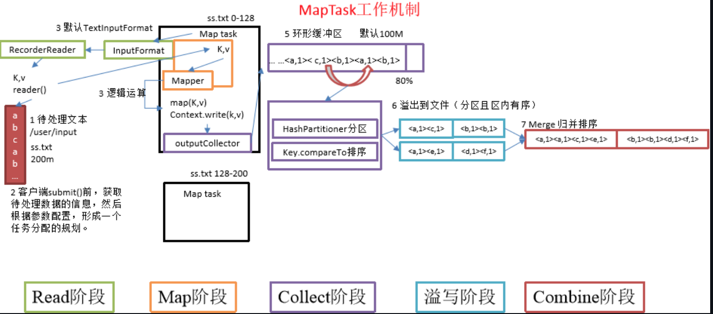
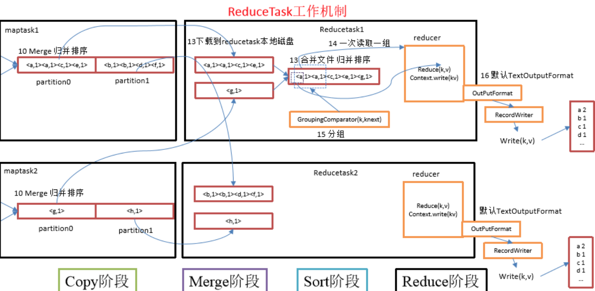
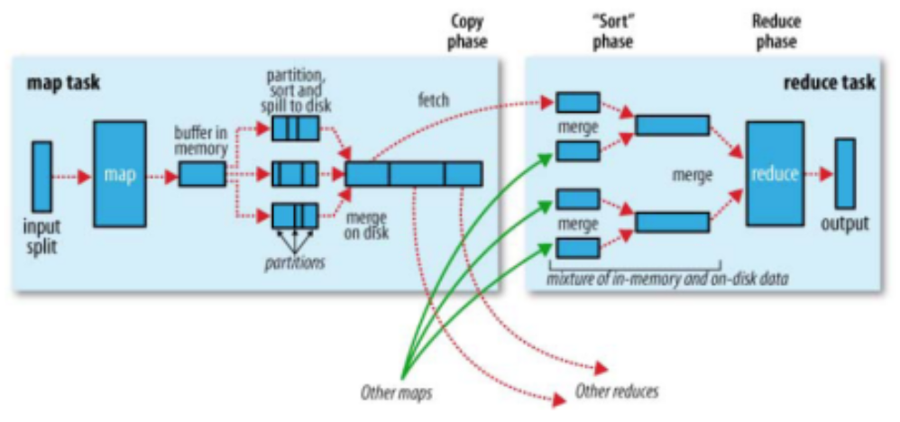
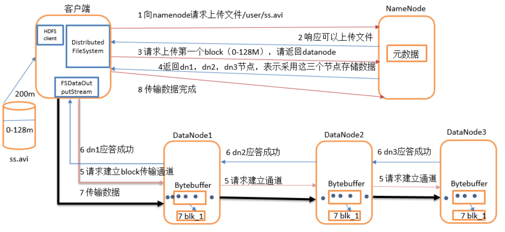
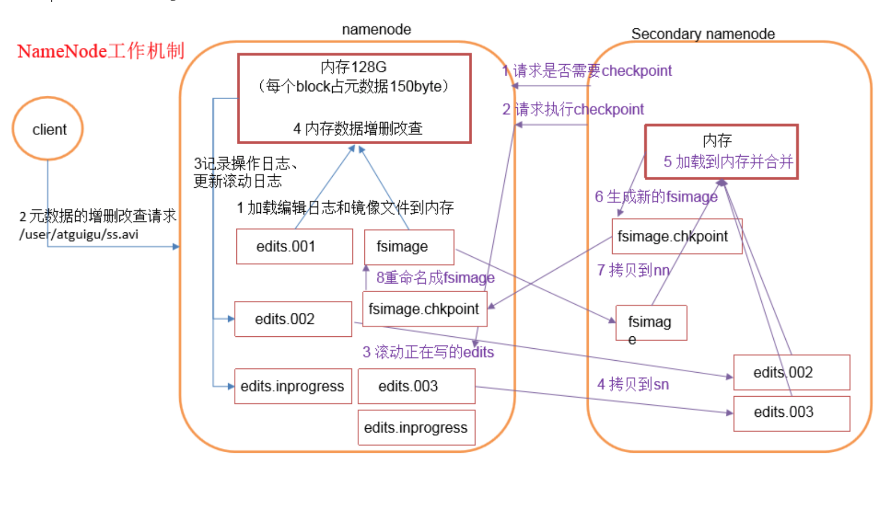
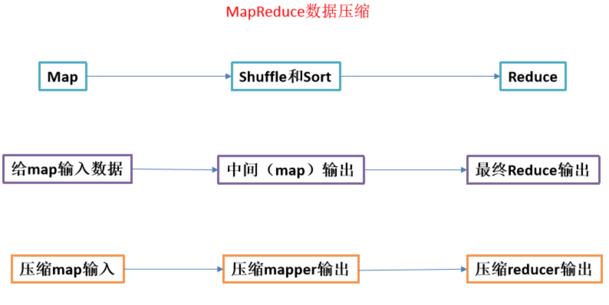

## 1MapReduce

### 1 MapTask和ReduceTask工作机制（☆☆☆☆☆）（也可回答MapReduce工作原理）



（1）Read阶段：Map Task通过用户编写的RecordReader，从输入InputSplit中解析出一个个key/value。
（2）Map阶段：该节点主要是将解析出的key/value交给用户编写map()函数处理，并产生一系列新的key/value。
（3）Collect收集阶段：在用户编写map()函数中，当数据处理完成后，一般会调用OutputCollector.collect()输出结果。在该函数内部，它会将生成的key/value分区（调用Partitioner），并写入一个环形内存缓冲区中。
（4）Spill阶段：即“溢写”，当环形缓冲区满后，MapReduce会将数据写到本地磁盘上，生成一个临时文件。需要注意的是，将数据写入本地磁盘之前，先要对数据进行一次本地排序，并在必要时对数据进行合并、压缩等操作。
（5）Combine阶段：当所有数据处理完成后，MapTask对所有临时文件进行一次合并，以确保最终只会生成一个数据文件。



（1）Copy阶段：ReduceTask从各个MapTask上远程拷贝一片数据，并针对某一片数据，如果其大小超过一定阈值，则写到磁盘上，否则直接放到内存中。
（2）Merge阶段：在远程拷贝数据的同时，ReduceTask启动了两个后台线程对内存和磁盘上的文件进行合并，以防止内存使用过多或磁盘上文件过多。
（3）Sort阶段：按照MapReduce语义，用户编写reduce()函数输入数据是按key进行聚集的一组数据。为了将key相同的数据聚在一起，Hadoop采用了基于排序的策略。 由于各个MapTask已经实现对自己的处理结果进行了局部排序，因此，ReduceTask只需对所有数据进行一次归并排序即可。
（4）Reduce阶段：reduce()函数将计算结果写到HDFS上。

### 2描述mapReduce有几种排序及排序发生的阶段（☆☆☆☆☆）

1）排序的分类：
  （1）部分排序：
    MapReduce根据输入记录的键对数据集排序。保证输出的每个文件内部排序。
  （2）全排序：
    如何用Hadoop产生一个全局排序的文件？最简单的方法是使用一个分区。但该方法在处理大型文件时效率极低，因为一台机器必须处理所有输出文件，从而完全丧失了MapReduce所提供的并行架构。
    替代方案：首先创建一系列排好序的文件；其次，串联这些文件；最后，生成一个全局排序的文件。主要思路是使用一个分区来描述输出的全局排序。例如：可以为待分析文件创建3个分区，在第一分区中，记录的单词首字母a-g，第二分区记录单词首字母h-n, 第三分区记录单词首字母o-z。
  （3）辅助排序：（GroupingComparator分组）
    Mapreduce框架在记录到达reducer之前按键对记录排序，但键所对应的值并没有被排序。甚至在不同的执行轮次中，这些值的排序也不固定，因为它们来自不同的map任务且这些map任务在不同轮次中完成时间各不相同。一般来说，大多数MapReduce程序会避免让reduce函数依赖于值的排序。但是，有时也需要通过特定的方法对键进行排序和分组等以实现对值的排序。
  （4）二次排序：
    在自定义排序过程中，如果compareTo中的判断条件为两个即为二次排序。
2）自定义排序WritableComparable
  bean对象实现WritableComparable接口重写compareTo方法，就可以实现排序
    @Override
    public int compareTo(FlowBean o) {
      // 倒序排列，从大到小
      return this.sumFlow > o.getSumFlow() ? -1 : 1;
    }
3）**排序发生的阶段：**
  （1）一个是在map side发生在spill后partition前。
  （2）一个是在reduce side发生在copy后 reduce前。

### 3描述mapReduce中shuffle阶段的工作流程，如何优化shuffle阶段（☆☆☆☆☆）



Map阶段：

- Read
- Map
- Split
- Combine

Reduce阶段：

- Copy
- Merge
- Sort
- Reduce

如何优化？增加combiner，压缩溢写的文件。

### 4 Hadoop的缓存机制（Distributedcache）（☆☆☆☆☆）

  分布式缓存一个最重要的应用就是在进行join操作的时候，如果一个表很大，另一个表很小，我们就可以将这个小表进行广播处理，即每个计算节点上都存一份，然后进行map端的连接操作，效率大于Reduce端join。
  **DistributedCache会拷贝缓存文件到Slave节点在。任何Job在节点上执行之前，文件在每个Job中只会被拷贝一次，缓存的归档文件会被在Slave节点中解压缩。**将本地文件复制到HDFS中去，接着Client会通过addCacheFile() 和addCacheArchive()方法告诉DistributedCache在HDFS中的位置。当文件存放到文地时，JobClient同样获得DistributedCache来创建符号链接。

### 5 如何使用mapReduce实现两个表的join?（☆☆☆☆☆）

  1）reduce side join : 在map阶段，map函数同时读取两个文件File1和File2，为了区分两种来源的key/value数据对，对每条数据打一个标签（tag）,比如：tag=0 表示来自文件File1，tag=2 表示来自文件File2。
  2）map side join : Map side join 是针对以下场景进行的优化：两个待连接表中，有一个表非常大，而另一个表非常小，以至于小表可以直接存放到内存中。这样，我们可以将小表复制多份，让每个map task 内存中存在一份（比如存放到hash table 中），然后只扫描大表：对于大表中的每一条记录key/value，在hash table 中查找是否有相同的key 的记录，如果有，则连接后输出即可。


## 2 HDFS

### 2.1 HDFS的存储机制（☆☆☆☆☆）

  HDFS存储机制，包括HDFS的**写入数据过程**和**读取数据过程**两部分
  **HDFS写数据过程**



  1）客户端通过Distributed FileSystem模块向NameNode请求上传文件，NameNode检查目标文件是否已存在，父目录是否存在。
  2）NameNode返回是否可以上传。
  3）客户端请求第一个 block上传到哪几个datanode服务器上。
  4）NameNode返回3个datanode节点，分别为dn1、dn2、dn3。
  5）客户端通过FSDataOutputStream模块请求dn1上传数据，dn1收到请求会继续调用dn2，然后dn2调用dn3，将这个通信管道建立完成。
  6）dn1、dn2、dn3逐级应答客户端。
  7）客户端开始往dn1上传第一个block（先从磁盘读取数据放到一个本地内存缓存），以packet为单位，dn1收到一个packet就会传给dn2，dn2传给dn3； dn1每传一个packet会放入一个应答队列等待应答。
  8）当一个block传输完成之后，客户端再次请求NameNode上传第二个block的服务器。（重复执行3-7步）。

  **HDFS读数据过程**

[](https://github.com/wangzhiwubigdata/God-Of-BigData/blob/master/面试系列/pics/Hadoop面试题Pics/HDFS读数据流程.png)


  1）客户端通过Distributed FileSystem向NameNode请求下载文件，NameNode通过查询元数据，找到文件块所在的DataNode地址。
  2）挑选一台DataNode（就近原则，然后随机）服务器，请求读取数据。
  3）DataNode开始传输数据给客户端（从磁盘里面读取数据输入流，以packet为单位来做校验）。
  4）客户端以packet为单位接收，先在本地缓存，然后写入目标文件。

### 2.2 secondary namenode工作机制（☆☆☆☆☆）




**1）第一阶段：NameNode启动**
  （1）第一次启动NameNode格式化后，创建fsimage和edits文件。如果不是第一次启动，直接加载edit log和fsimage到内存。
  （2）客户端对元数据进行增删改的请求。
  （3）NameNode记录操作日志，更新滚动日志。
  （4）NameNode在内存中对数据进行增删改查。
**2）第二阶段：Secondary NameNode工作**
  （1）Secondary NameNode询问NameNode是否需要checkpoint。直接带回NameNode是否检查结果。
  （2）Secondary NameNode请求执行checkpoint。
  （3）NameNode滚动正在写的edits日志。
  （4）将滚动前的编辑日志和镜像文件拷贝到Secondary NameNode。
  （5）Secondary NameNode加载编辑日志和镜像文件到内存，并合并。
  （6）生成新的镜像文件fsimage.chkpoint。
  （7）拷贝fsimage.chkpoint到NameNode。
  （8）NameNode将fsimage.chkpoint重新命名成fsimage。

### 2.3NameNode与SecondaryNameNode 的区别与联系？（☆☆☆☆☆）

**机制流程看第7题**
1）区别
  （1）NameNode负责管理整个文件系统的元数据，以及每一个路径（文件）所对应的数据块信息。
  （2）SecondaryNameNode主要用于定期合并命名空间镜像和命名空间镜像的编辑日志。
2）联系：
  （1）SecondaryNameNode中保存了一份和namenode一致的镜像文件（fsimage）和编辑日志（edits）。
  （2）在主namenode发生故障时（假设没有及时备份数据），可以从SecondaryNameNode恢复数据。

### 2.4HDFS组成架构（☆☆☆☆☆）

[](https://github.com/wangzhiwubigdata/God-Of-BigData/blob/master/面试系列/pics/Hadoop面试题Pics/HDFS组成架构.png)


架构主要由四个部分组成，分别为**HDFS Client、NameNode、DataNode和Secondary NameNode**。下面我们分别介绍这四个组成部分。
1）Client：就是客户端。
  （1）文件切分。文件上传HDFS的时候，Client将文件切分成一个一个的Block，然后进行存储；
  （2）与NameNode交互，获取文件的位置信息；
  （3）与DataNode交互，读取或者写入数据；
  （4）Client提供一些命令来管理HDFS，比如启动或者关闭HDFS；
  （5）Client可以通过一些命令来访问HDFS；
2）NameNode：就是Master，它是一个主管、管理者。
  （1）管理HDFS的名称空间；
  （2）管理数据块（Block）映射信息；
  （3）配置副本策略；
  （4）处理客户端读写请求。
3）DataNode：就是Slave。NameNode下达命令，DataNode执行实际的操作。
  （1）存储实际的数据块；
  （2）执行数据块的读/写操作。
4）Secondary NameNode：并非NameNode的热备。当NameNode挂掉的时候，它并不能马上替换NameNode并提供服务。
  （1）辅助NameNode，分担其工作量；
  （2）定期合并Fsimage和Edits，并推送给NameNode；
  （3）在紧急情况下，可辅助恢复NameNode。

### 2.5HA Namenode 是如何工作的? （☆☆☆☆☆）

[](https://github.com/wangzhiwubigdata/God-Of-BigData/blob/master/面试系列/pics/Hadoop面试题Pics/HAnamenode工作机制.png)


ZKFailoverController主要职责
  1）健康监测：周期性的向它监控的NN发送健康探测命令，从而来确定某个NameNode是否处于健康状态，如果机器宕机，心跳失败，那么zkfc就会标记它处于一个不健康的状态。
  2）会话管理：如果NN是健康的，zkfc就会在zookeeper中保持一个打开的会话，如果NameNode同时还是Active状态的，那么zkfc还会在Zookeeper中占有一个类型为短暂类型的znode，当这个NN挂掉时，这个znode将会被删除，然后备用的NN，将会得到这把锁，升级为主NN，同时标记状态为Active。
  3）当宕机的NN新启动时，它会再次注册zookeper，发现已经有znode锁了，便会自动变为Standby状态，如此往复循环，保证高可靠，需要注意，目前仅仅支持最多配置2个NN。
  4）master选举：如上所述，通过在zookeeper中维持一个短暂类型的znode，来实现抢占式的锁机制，从而判断那个NameNode为Active状态

## 3 YARN

### 3.1HDFS的数据压缩算法?（☆☆☆☆☆）

  Hadoop中常用的压缩算法有**bzip2、gzip、lzo、snappy**，其中lzo、snappy需要操作系统安装native库才可以支持。
  数据可以压缩的位置如下所示。




> 企业开发用的比较多的是snappy

### 3.2Hadoop的调度器总结（☆☆☆☆☆）

（1）默认的调度器FIFO
  Hadoop中默认的调度器，它先按照作业的优先级高低，再按照到达时间的先后选择被执行的作业。
（2）计算能力调度器Capacity Scheduler
  支持多个队列，每个队列可配置一定的资源量，每个队列采用FIFO调度策略，为了防止同一个用户的作业独占队列中的资源，该调度器会对同一用户提交的作业所占资源量进行限定。调度时，首先按以下策略选择一个合适队列：计算每个队列中正在运行的任务数与其应该分得的计算资源之间的比值，选择一个该比值最小的队列；然后按以下策略选择该队列中一个作业：按照作业优先级和提交时间顺序选择，同时考虑用户资源量限制和内存限制。
（3）公平调度器Fair Scheduler
  同计算能力调度器类似，支持多队列多用户，每个队列中的资源量可以配置，同一队列中的作业公平共享队列中所有资源。实际上，Hadoop的调度器远不止以上三种，最近，出现了很多针对新型应用的Hadoop调度器。

### 3.3 MapReduce 2.0 容错性（☆☆☆☆☆）

1）MRAppMaster容错性
  一旦运行失败，由YARN的ResourceManager负责重新启动，最多重启次数可由用户设置，默认是2次。一旦超过最高重启次数，则作业运行失败。
2）Map Task/Reduce
  Task Task周期性向MRAppMaster汇报心跳；一旦Task挂掉，则MRAppMaster将为之重新申请资源，并运行之。最多重新运行次数可由用户设置，默认4次。

### 3.3 Mapreduce推测执行算法及原理（☆☆☆☆☆）

1）作业完成时间取决于最慢的任务完成时间
  一个作业由若干个Map 任务和Reduce 任务构成。因硬件老化、软件Bug 等，某些任务可能运行非常慢。
  典型案例：系统中有99%的Map任务都完成了，只有少数几个Map老是进度很慢，完不成，怎么办？
2）推测执行机制
  发现拖后腿的任务，比如某个任务运行速度远慢于任务平均速度。为拖后腿任务启动一个备份任务，同时运行。谁先运行完，则采用谁的结果。
3）不能启用推测执行机制情况
  （1）任务间存在严重的负载倾斜；
  （2）特殊任务，比如任务向数据库中写数据。
4）算法原理
  假设某一时刻，任务T的执行进度为progress，则可通过一定的算法推测出该任务的最终完成时刻estimateEndTime。另一方面，如果此刻为该任务启动一个备份任务，则可推断出它可能的完成时刻estimateEndTime。于是可得出以下几个公式：     

```java
  estimateEndTime = estimatedRunTime + taskStartTime     
  estimatedRunTime = (currentTimestamp - taskStartTime)/progress     
  estimateEndTime = currentTimestamp + averageRunTime
```


  其中，currentTimestamp为当前时刻；taskStartTime为该任务的启动时刻；averageRunTime为已经成功运行完成的任务的平均运行时间。这样，MRv2总是选择（**estimateEndTime- estimateEndTime**·）差值最大的任务，并为之启动备份任务。为了防止大量任务同时启动备份任务造成的资源浪费，MRv2为每个作业设置了同时启动的备份任务数目上限。
  **推测执行机制实际上采用了经典的算法优化方法：以空间换时间**，它同时启动多个相同任务处理相同的数据，并让这些任务竞争以缩短数据处理时间。显然，这种方法需要占用更多的计算资源。在集群资源紧缺的情况下，应合理使用该机制，争取在多用少量资源的情况下，减少作业的计算时间。

## 4 优化

### 4.1 MapReduce跑得慢的原因？（**☆☆☆☆☆**）

Mapreduce 程序效率的瓶颈在于两点：
1）计算机性能
  CPU、内存、磁盘健康、网络
2）I/O 操作优化
  （1）数据倾斜
  （2）map和reduce数设置不合理
  （3）reduce等待过久
  （4）小文件过多
  （5）大量的不可分块的超大文件
  （6）spill次数过多
  （7）merge次数过多等

### 4.2 MapReduce优化方法（☆☆☆☆☆）

**1）数据输入**
  （1）合并小文件：在执行mr任务前将小文件进行合并，大量的小文件会产生大量的map任务，增大map任务装载次数，而任务的装载比较耗时，从而导致mr运行较慢。
  （2）采用ConbinFileInputFormat来作为输入，解决输入端大量小文件场景。
**2）map阶段**
  （1）减少spill次数：通过调整io.sort.mb及sort.spill.percent参数值，增大触发spill的内存上限，减少spill次数，从而减少磁盘 IO。
  （2）减少merge次数：通过调整io.sort.factor参数，增大merge的文件数目，减少merge的次数，从而缩短mr处理时间。
  （3）在 map 之后先进行combine处理，减少I/O。
**3）reduce阶段**
  （1）合理设置map和reduce数：两个都不能设置太少，也不能设置太多。太少，会导致task等待，延长处理时间；太多，会导致 map、reduce任务间竞争资源，造成处理超时等错误。
  （2）设置map、reduce共存：调整slowstart.completedmaps参数，使map运行到一定程度后，reduce也开始运行，减少reduce的等待时间。
  （3）规避使用reduce，因为Reduce在用于连接数据集的时候将会产生大量的网络消耗。
  （4）合理设置reduce端的buffer，默认情况下，数据达到一个阈值的时候，buffer中的数据就会写入磁盘，然后reduce会从磁盘中获得所有的数据。也就是说，buffer和reduce是没有直接关联的，中间多个一个写磁盘->读磁盘的过程，既然有这个弊端，那么就可以通过参数来配置，使得buffer中的一部分数据可以直接输送到reduce，从而减少IO开销：mapred.job.reduce.input.buffer.percent，默认为0.0。当值大于0的时候，会保留指定比例的内存读buffer中的数据直接拿给reduce使用。这样一来，设置buffer需要内存，读取数据需要内存，reduce计算也要内存，所以要根据作业的运行情况进行调整。
**4）IO传输**
  （1）采用数据压缩的方式，减少网络IO的的时间。安装Snappy和LZOP压缩编码器。
  （2）使用SequenceFile二进制文件
**5）数据倾斜问题**
  （1）数据倾斜现象     数据频率倾斜——某一个区域的数据量要远远大于其他区域。
    数据大小倾斜——部分记录的大小远远大于平均值。
  （2）如何收集倾斜数据
    在reduce方法中加入记录map输出键的详细情况的功能。

```java
public static final String MAX_VALUES = "skew.maxvalues";
private int maxValueThreshold;

@Override
public void configure(JobConf job) {
     maxValueThreshold = job.getInt(MAX_VALUES, 100);
}

@Override
public void reduce(Text key, Iterator<Text> values,
                     OutputCollector<Text, Text> output,
                     Reporter reporter) throws IOException {
     int i = 0;
     while (values.hasNext()) {
         values.next();
         i++;
     }
     if (++i > maxValueThreshold) {
         log.info("Received " + i + " values for key " + key);
     }
}
```

**（3）减少数据倾斜的方法**
    方法1：抽样和范围分区
      可以通过对原始数据进行抽样得到的结果集来预设分区边界值。
    方法2：自定义分区
      另一个抽样和范围分区的替代方案是基于输出键的背景知识进行自定义分区。例如，如果map输出键的单词来源于一本书。其中大部分必然是省略词（stopword）。那么就可以将自定义分区将这部分省略词发送给固定的一部分reduce实例。而将其他的都发送给剩余的reduce实例。
    方法3：Combine
      使用Combine可以大量地减小数据频率倾斜和数据大小倾斜。在可能的情况下，combine的目的就是聚合并精简数据。

### 4.3 HDFS小文件优化方法（☆☆☆☆☆）

**1）HDFS小文件弊端：**
  HDFS上每个文件都要在namenode上建立一个索引，这个索引的大小约为150byte，这样当小文件比较多的时候，就会产生很多的索引文件，一方面会大量占用namenode的内存空间，另一方面就是索引文件过大是的索引速度变慢。
**2）解决的方式：**

- Hadoop本身提供了一些文件压缩的方案。   

-  从系统层面改变现有HDFS存在的问题，其实主要还是小文件的合并，然后建立比较快速的索引。

**3）Hadoop自带小文件解决方案**
  （1）Hadoop Archive：
    是一个高效地将小文件放入HDFS块中的文件存档工具，它能够将多个小文件打包成一个HAR文件，这样在减少namenode内存使用的同时。
  （2）Sequence file：
    sequence file由一系列的二进制key/value组成，如果为key小文件名，value为文件内容，则可以将大批小文件合并成一个大文件。
  （3）CombineFileInputFormat：
    CombineFileInputFormat是一种新的inputformat，用于将多个文件合并成一个单独的split，另外，它会考虑数据的存储位置。