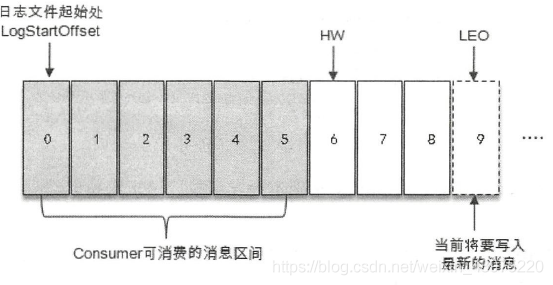
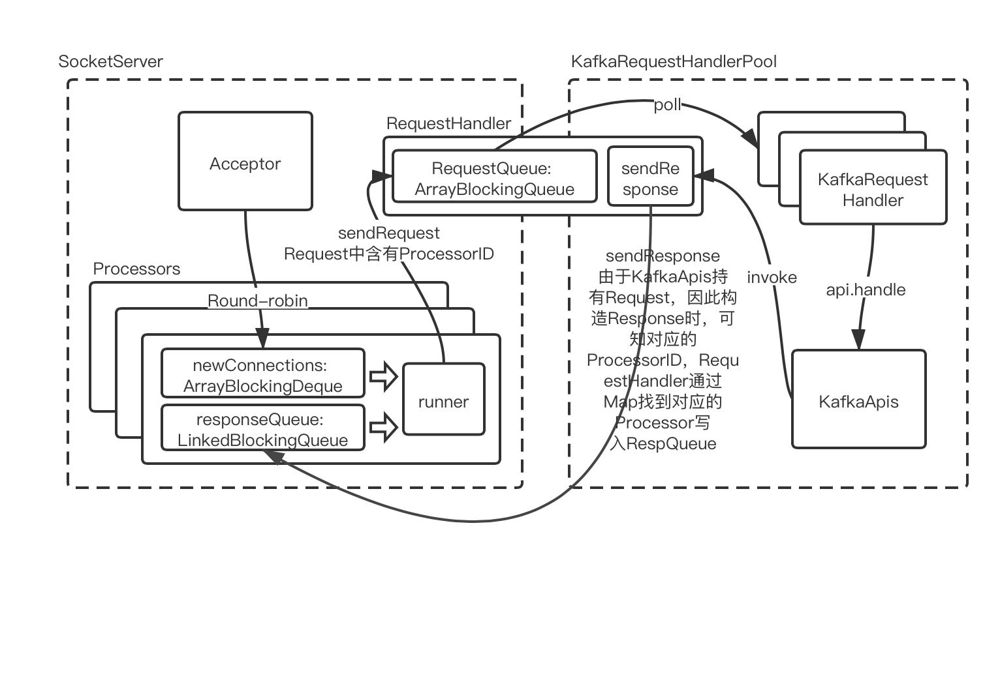
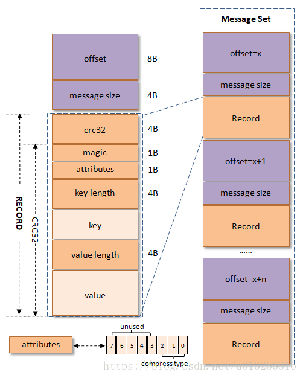
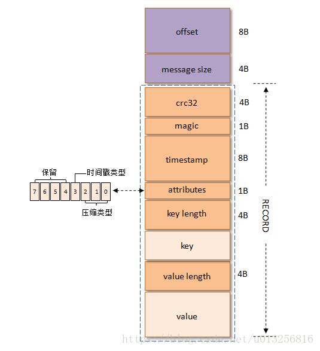
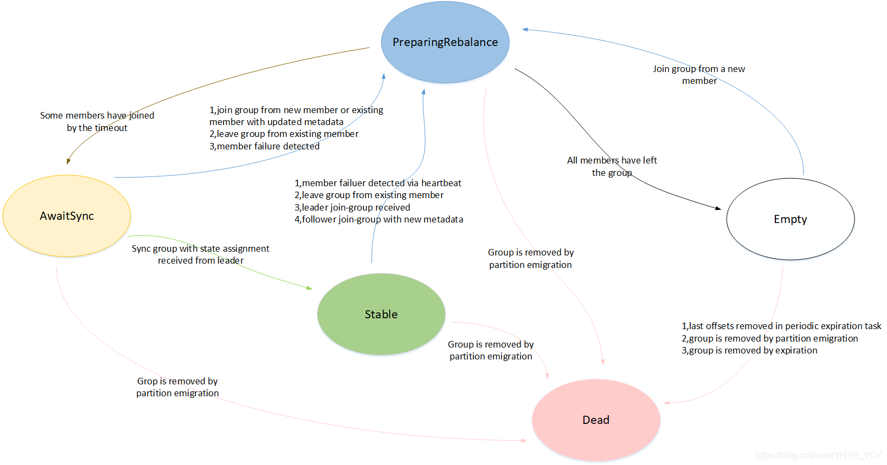
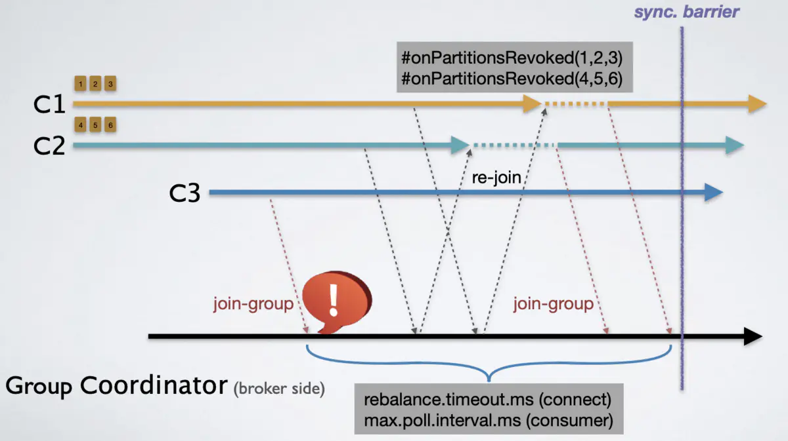

### 1 解释如何减少ISR中的扰动？broker什么时候离开ISR？（☆☆☆☆☆） Kafka 副本机制

1. 什么是副本，它的作用是什么？3个
2. ISR(In Sync Replica): 保持与Leader同步的副本。判断条件是什么？只有1个，看lag落后的时间，10s。更细致地讲，Broker启动的时候，会有2个线程做什么？
3. 如果Leader挂了，就会引发Leader Select，领导者选举。**TODO：需要详细的解释**

ISR是一组与leaders完全同步的消息副本，也就是说ISR中包含了所有提交的消息。ISR应该总是包含所有的副本，直到出现真正的故障。如果一个副本落后leader超过了Lag的时间，就从leader中脱离出来，将会从ISR中删除。

### 2 请说明Kafka 的消息投递保证（delivery guarantee）机制以及如何实现？（☆☆☆☆☆）

  Kafka支持三种消息投递语义：
  ① At most once 消息可能会丢，但绝不会重复传递
  ② At least one 消息绝不会丢，但可能会重复传递
  ③ Exactly once 每条消息肯定会被传输一次且仅传输一次，很多时候这是用户想要的
  **Kafka对以提交的消息（committed message 做有限度的持久化保证。保证什么？保证消息不丢失。**

1. 生产者通过ACK来设置可靠性保证。

   - 消息没有发送到Broker，由于网络抖动 
   - 消息太大了，Broker不接收

2. Consumer端丢失数据的现象，想读的消息没有读上？场景是什么，怎么解决？

   - Consumer从Kafka获取消息后，开启了多个线程异步进行处理，而Consumer程序**自动地向前更新了Offset**。如果某个线程运行失败了，那么它负责的消息就没有被成功处理。因此，对于这些消息来说，Consumer就丢失了她们。
   - (有一个方案是Consumer不要开启自动提交offset，让所有线程消费完才手动提交。**会不会出现消息被消费了多次的情况呢?有没有好的方案**)

3. **分析了这么多，最后总结出的最佳实践来保证kafka消息不丢失**，从Producer应该做什么，Broker做什么，Consumer做什么来分析？

>   如果一定要做到Exactly once，就需要协调offset和实际操作的输出。**经典的做法是引入两阶段提交，更为通用的方式是将offset和操作输入存在同一个地方。**比如，consumer拿到数据后可能把数据放到HDFS，如果把最新的offset和数据本身一起写到HDFS，那就可以保证数据的输出和offset的更新要么都完成，要么都不完成，间接实现Exactly once。
>   总之，Kafka默认保证At least once，并且允许通过设置producer异步提交来实现At most once，而Exactly once要求与目标存储系统协作，Kafka提供的offset可以较为容易地实现这种方式。

### 3 如何保证Kafka的消息有序（☆☆☆☆☆）

Producer发送的时候，设置key，就能够触发按照消息键保序的策略。
Kafka只能保证一个partition中的消息被某个consumer消费时是顺序的，事实上，从Topic角度来说，当有多个partition时，消息仍然不是全局有序的。


#### kafka

- kafka组件和基本概念

  - controller、leader、follower
    - controller负责全局meta信息维护，管理Broker上下线、topic管理、管理分区副本分配、leader选举、管理所有副本状态机和分区状态机；通过zookeeper实现选举
    - leader和follower是针对partition而言，当leader宕机，controller将从ISR中使用分区选择算法选出新的leader。
      - 如果ISR中有，就随机选取一个。如果ISR中的都挂了，就看是否开启了unclean选举。
      - 等待ISR中的任一个Replica“活”过来，并且选它作为Leader
      - 选择第一个“活”过来的Replica（不一定是ISR中的）作为Leader
  - ar、isr、osr
    - Assigned Replicas，全量副本
    - In-Sync Replicas，与leader副本保持一定程度同步的副本（含Leader）
    - Out-Sync Replicas，滞后过多的副本（replica.lag.max.messages）

  * hw、lw、leo、lso
    * hw，hight watermark，表示一个特定的偏移量，消费者只能拉取到这个offset之前的消息，hw以及其之后的消息对于消费者是不可见的



​    

- lw，low watermark，表示AR集合中最小的logStartOffset
- leo，log end offset，表示当前日志文件中下一条待写入的offset，即最后一条日志的offset+1；**isr中最小的leo即为分区的hw**
- lso，last stable offset，具体与kafka的事务有关

##### server端的设计

Kafka采用是经典的Reactor模式，也就是1个Acceptor响应客户端的连接请求，N个Processor来读取数据

- RPC threading model
  - Acceptor：(Main Reactor)监听客户端的连接请求，并建立和客户端的数据传输通道，然后为这个客户端指定一个Processor
  - Processors线程池（Sub Reactor的实现）：从客户端读取数据和将响应返回给客户端，不处理具体的业务逻辑。
  - KafkaRequestHandlerPool(Worker Thread pool) : 从requestChannel中的requestQueue取出Request，处理具体业务的，处理以后再将Response添加到requestChannel中的responseQueue中。



```SCALA
    override def run(): Unit = {
        startupComplete()
        try {
          while (isRunning) {
            try {
              // setup any new connections that have been queued up
              configureNewConnections()
              // register any new responses for writing
              processNewResponses()
              poll()
              processCompletedReceives()
              processCompletedSends()
              processDisconnected()
              closeExcessConnections()
            } catch {
              case e: Throwable => processException("Processor got uncaught exception.", e)
            }
          }
        } finally {
          debug(s"Closing selector - processor $id")
          CoreUtils.swallow(closeAll(), this, Level.ERROR)
          shutdownComplete()
        }
    }
```

- 物理存储

  - 文件格式和Request消息一致，因此可以使用ZeroCopy技术直接存储在磁盘上
  - v0

  

  - v1

  

  - v2

  

  - kafka附带了DumpLogSegment工具，可以查看片段内容，显示消息的偏移量、校验和、魔术、消息大小和压缩算法
  - 每个logSegment都有一个index（基于mmap实现），把偏移量映射到片段文件和偏移量在文件里的位置；kafka不维护index的校验和，一旦index损坏则重新读取消息生成index
  - 在Broker中有个map的结构segments维护着当前的LogSegment的引用，LogSegment包含日志和index，fetch请求先在map中找到对应的LogSegment，接着读取出FetchDataInfo（Partition.read() -> Log.read() -> LogSement.read() -> LogSegment.translateOffset()）

- 主从与高可用

##### client端设计

- kafka producer
  - RecordAccumulator
  - Sender
- kafka consumer
  - 0.9之前强依赖与zookeeper，通过注册watch监控partition、consumer变化实现rebalance触发；这样的设计容易引起zookeeper的羊群效应，且每次局部变化都会引起全局的rebalance，造成巨大的负载；另外由于zookeeper存在脑裂问题（只保证最终一致性），因此可能造成consumer rebalance的结果不一致；而彼此独立的consumer又让每个consumer都无从得知别的consumer是否都rebalance成功，这又会导致consumer group消费不正确
  - 0.9之后增加了group coordinator组件
    - Consumer的两种请求
      - JoinGroup
      - SyncGroup
    - GroupState
      1. Empty
         - 没有任何member的group，一直保留直至所有的offsets都过期失效（offsets都定期清除后，状态转移为Dead）
         - 这个状态也可适于仅提交offset而没有member的用法
         - 只对JoinGroup请求有正常的响应，其他均返回错误
         - 新member发起JoinGroup请求则转移至PreparingRebalance
         - 当group被移除，状态转移至Dead
      2. PreparingRebalance
         - 对心跳请求、Sync请求返回REBALANCE_IN_PROGRESS，移除member离开group的请求，暂停新的或已存在的member发送的JoinGroup请求，直到所有预期的member都已加入
         - 当等待时间结束前members完成Joined，状态转移至CompletingRebalance
         - 所有members都离开了group，状态转移至Empty
         - 当group被移除，状态转移至Dead
      3. CompletingRebalance/AwaitingSync
         - Group正在等待leader的分配方案，暂停follower的SyncGroup请求直到状态变成Stable
      4. Stable
         - 正常回复心跳请求，以当前的分配方案回复SyncGroup请求，若当前client端与coordinator的metadata匹配则以当前group metadata回复client端的JoinGroup请求
         - member心跳异常、member离组、leader发送JoinGroup请求、follower以新的metada发起JoinGroup请求则进入PreparingRebalance状态
         - 分区迁移导致group移除则进入Dead状态
      5. **Dead**：group的最终状态，没有状态转移



新创建的group如何进行rebalance

1. 寻找GroupCoordinator
   - ConsumerCoordinator调用ensureCoordinatorReady()获得group的地址（首先调用leastLoadedNode()寻找连接最少的broker，向其发送请求寻找groupCoordinator）
2. 发送JoinGroup
   - client端发送JoinGroup请求，若group不存在则创建新的group，状态置为Empty
3. Leader选举以及等待
   - 第一个加入的member被选为consumer leader
   - GroupCoordinator状态置为PreparingRebalance
   - 接着会等待一定时间，等待预期的consumer陆续提交JoingGroup后，group进入CompletingRebalance状态
   - GroupCoordinator给client返回封装有所有member的response



1. 分配方案
   - leader收到JoinGroup的response后，生成assignment
   - client端向coordinator发起SyncGroup请求，若client端是leader则在sync请求中提交分配方案，follower发送的则是一份空的列表
   - coordinator收到leader的请求后，将分配方案作为SyncGroup的response分发给follower，group状态转移为Stable

- 一些参数以及改进
  - [rebalance.timeout.ms](http://rebalance.timeout.ms)，worker在rebalance后加入group的最大时间
  - [group.initial.rebalance.delay.ms](http://group.initial.rebalance.delay.ms)，空Group接收到第一个JoinGroup后延迟多久后才开始Rebalance
  - [session.timeout.ms](http://session.timeout.ms)，心跳线程超时时间
  - [max.poll.interval.ms](http://max.poll.interval.ms)，执行线程超时时间
  - Static member、Incremental Rebalance
- consumer poll设计
  - 所有逻辑都在poll的大循环中实现，包括获取Metadata、连接GroupCoordinator、发送Fetch请求、提交Offset、发送心跳，这些操作都先加入队列，之后才在poll中发送出去，其中心跳请求会加入DelayedQueue中定期出队
  - 新版本的Kafka心跳采用了单独的线程

##### 可靠性用法

- Broker端
  - 允许不同步副本成为leader（允许unclean选举）：unclean.leader.election.enable
  - 最小同步副本数：min.insync.replicas，如果生产时isr不满足最小同步副本数，则收到异常NotEnoughReplicasException
  - 单个broker对分区个数有限制，分区越多，占用内存越多，完成leader选举所需时间也越长
  - 硬件需求
    1. 磁盘速度决定producer的延迟性能
    2. 磁盘容量决定数据冗余量以及存储周期
    3. 内存可用于做页面缓存，供kafka缓存正在使用中的日志片段
    4. 网络决定最大吞吐量
    5. kafka对cpu要求不高，但是cpu会影响加解压缩以及GC停顿
- Producer端
  - 配置说明
    - ack=1、ack=0、ack=ALL
    - buffer.memory、block.on.buffer.full/max.block.ms
    - retries、[retry.backoff.ms](http://retry.backoff.ms)
    - batch.size，多条消息合成一个批次发往同一分区时，批次占用内存的大小
    - [linger.ms](http://linger.ms)，批次等待时间
    - [client.id](http://client.id)
    - max.in.flight.requests.per.connetion，producer 收到服务器相应之前可以发送多少个消息，影响吞吐量、占用内存、消息顺序性
    - [timeout.ms](http://timeout.ms)、[request.timeout.ms](http://request.timeout.ms)、[metadata.fetch.timeout.ms](http://metadata.fetch.timeout.ms)
    - [max.block.ms](http://max.block.ms)
    - max.request.size，broker 端也有相应参数 message.max.bytes
  - produce的重试设置
    - broker返回的错误有两种，一种可重试解决，例如 LEADER_NOT_AVAILABLE
    - 另一种不可重试，比如网络中断，重试有可能导致重复消息
    - Kafka 无法避免消息重复，可在应用程序中加入唯一标识符检测重复
    - 另外可让应用程序做到消息的“幂等”
  - 可在异步 send 的时候用 Callback 来处理异常情况
- Consumer端
  - 配置说明
    - auto.offset.reset（seekToBegining()，seekToEnd()）
    - enable.auto.commit、[auto.commit.interval.ms](http://auto.commit.interval.ms)
    - partition.assignment.strategy，Range、RoundRobin
    - [client.id](http://client.id)
    - max.poll.records，控制单次调用 call() 能返回的记录数量
    - fetch.min.bytes，消费者从服务器获取记录的最小字节数，borker 会等到有足够的可用数据时才把数据返回给消费者
    - [fetch.max.wait.ms](http://fetch.max.wait.ms)，消费者等待 broker 返回的最长时间，默认 500ms
    - max.partition.fetch.bytes，每个分区返回给消费者最大的字节数，默认 1MB
    - [session.timeout.ms](http://session.timeout.ms)，消费者与服务器断开连接的判断时间，默认 3s；若 consumer 没有在此时间内发送心跳给 GroupCoordinator，则被认为死亡；这个配置与 [heartbeat.interval.ms](http://heartbeat.interval.ms) 相关，一般将 [heartbeat.interval.ms](http://heartbeat.interval.ms) 配置为 session.timeout.m s的 1/3
  - offset提交
    - 总是在处理完事件后在提交偏移量，在设计程序时要考虑到 rebalance 问题，要在分区撤销之前提交偏移量，可在调用 subscribe() 时传入一个 ConsumerRebalanceListener
    - 当部分消息处理失败时的重试，有两种模式
      1. 可提交最后一个成功处理的偏移量，把未处理的消息保存到缓冲区，调用消费者pause()方法暂停轮询返回的数据，保持轮询的同时尝试重新处理，成功或者达到重试次数上限（记录错误丢弃消息），然后调用rersume()方法恢复消费者轮询数据
      2. 可将错误写入单独的 topic，然后继续，再由其他 consumer 消费该 topic 单独处理（在 0.10.1 之后的版本的 Kafka 中的心跳已经交由一个单独的线程 HeartbeatThread 来提交）
  - 数据处理耗时过长时，可能导致 consumer.poll() 循环等待过久，导致心跳无法及时发送，这种较为耗时的任务应提交给另一个线程池来异步处理（在 0.10.1 之后的版本的 Kafka 中的心跳已经交由一个单独的线程 HeartbeatThread 来提交）
  - 在 0.10.1 之后的版本里，如果 consumer 需要处理耗时较长的任务，只需加大 [max.poll.interval.ms](http://max.poll.interval.ms) 的值来增加轮询间隔时长
  - 如果想把 offset 保存到别的数据库里，可使用 seek() 和 ConsumerRebalanceListener 配合
  - 让 consumer 退出循环应当调用 consumer.wakeup()