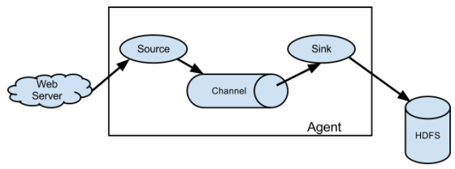

### 1 Flume使用场景（☆☆☆☆☆）

  线上数据一般主要是落地（存储到磁盘）或者通过socket传输给另外一个系统，这种情况下，你很难推动线上应用或服务去修改接口，实现直接向kafka里写数据，这时候你可能就需要flume这样的系统帮你去做传输。

### 2 Flume丢包问题（☆☆☆☆☆）

  单机upd的flume source的配置，100+M/s数据量，10w qps flume就开始大量丢包，因此很多公司在搭建系统时，抛弃了Flume，自己研发传输系统，但是往往会参考Flume的Source-Channel-Sink模式。
  一些公司在Flume工作过程中，会对业务日志进行监控，例如Flume agent中有多少条日志，Flume到Kafka后有多少条日志等等，如果数据丢失保持在1%左右是没有问题的，当数据丢失达到5%左右时就必须采取相应措施。

### 3 flume有哪些组件，flume的source、channel、sink具体是做什么的（☆☆☆☆☆）

1）source：用于采集数据，Source是产生数据流的地方，同时Source会将产生的数据流传输到Channel，这个有点类似于Java IO部分的Channel。
2）channel：用于桥接Sources和Sinks，类似于一个队列。
3）sink：从Channel收集数据，将数据写到目标源(可以是下一个Source，也可以是HDFS或者HBase)。
**注意：要熟悉source、channel、sink的类型**