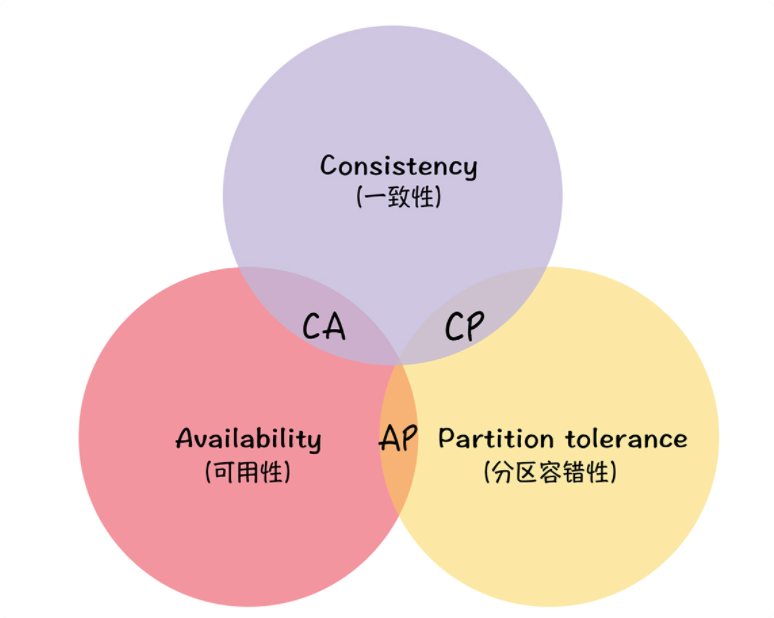
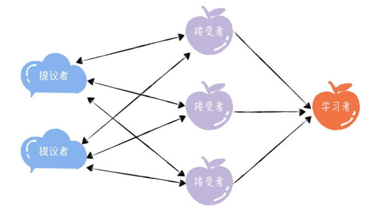
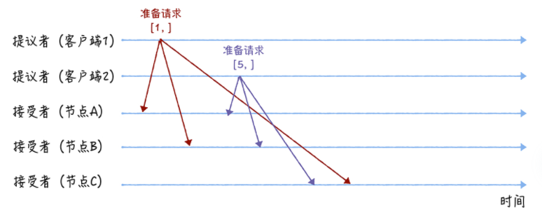
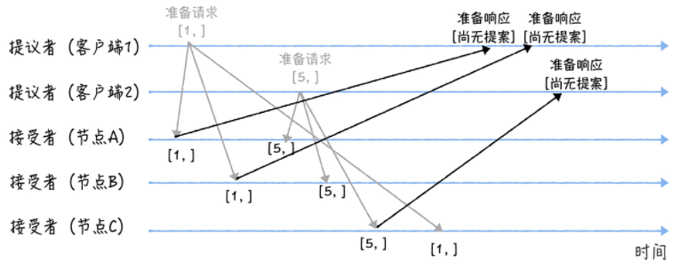
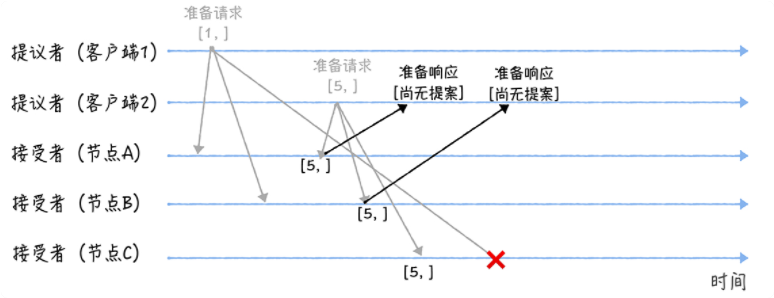
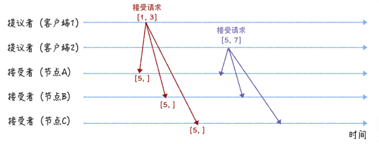
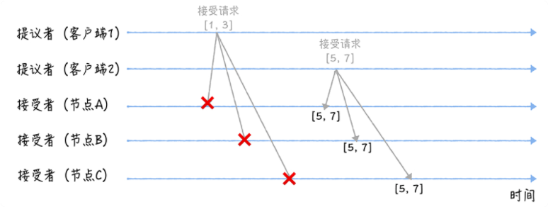
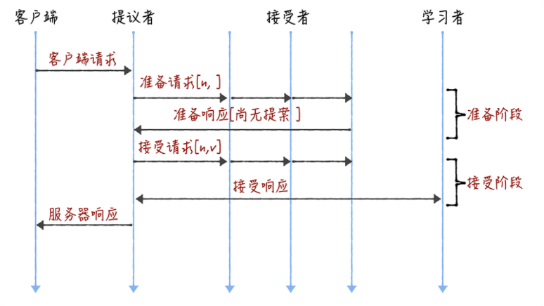

### K8S

- Master：集群的控制和管理
  - ApiServer：提供集群管理的授权、访问控制、发现、认证等功能
  - Scheduler：调度器，收集每个Worker资源的详细信息及运行情况，方便调度决策。
  - Controller Manager：监视集群状态，Pod副本管理。
- Worker：工作节点
  - Kuberlet：管理Pod的生命周期
  - Container Runtime：运行时环境，比如Docker
  - kube-proxy：代理，转发Service的请求到Pod
- Etcd：存储集群的元数据信息
- Etcd是高可用的、分布式的键值对数据存储系统，提供共享配置、服务的注册和发现。
  - A distributed, reliable key-value store for the most critical data of a distributed system
  - Go, raft协议
  - 简单：基于HTTP+JSON的API让你用curl命令就可以轻松使用。
  - 快速：每个实例每秒支持一千次写操作。
  - 可信：使用Raft算法充分实现了分布式系统数据的可用性和一致性
  - 2013 年 ，2015 年 引入Raft

### etcd

etcd 在 k8s中的作用：

- 存储所有需要持久化的数据
- 用于配置共享和服务发现

Etcd主要解决的是**分布式系统中数据一致性的问题**，而分布式系统中的数据分为控制数据和应用数据，etcd处理的数据类型为控制数据

(1) 数据流程

一个用户的请求发送过来，会经过HTTP Server转发给store进行具体事务处理，如果涉及到节点的修改，则需要交给raft模块进行状态的变更，日志的记录，然后再同步给别的etcd节点确认数据提交，最后进行数据提交，再次同步

(2)工作原理

Etcd使用**Raft协议**来维护集群内各个节点状态的**一致性**。简单说，ETCD集群是一个分布式系统，由多个节点相互通信构成整体对外服务，**每个节点都存储了完整的数据**，并且通过Raft协议保证每个节点维护的数据是一致的

(3) 主要组成部分

- **HTTP Server**： 用于处理用户发送的API请求以及其他etcd节点的同步与心跳信息请求
- **Store**: 用于处理 etcd 支持的各类功能的事务，包括数据索引、节点状态变更、监控与反馈、事件处理与执行等等，是 etcd 对用户提供的大多数 API 功能的具体实现。
- **Raft**： Raft 强一致性算法的具体实现，是 etcd 的核心
- **WAL**：Write Ahead Log（预写式日志/日志先行），是 etcd 的数据存储方式，也是一种实现事务日志的标准方法。etcd通过 WAL 进行持久化存储，所有的数据提交前都会事先记录日志

## CAP

- 一致性（Consistency）

- 可用性（Availability）

- 分区容错性（Partition Tolerance）

一致性: 各节点间的数据一致

可用性：对于请求，**能够在有限的时间内返回结果**。

分区容错性：部分子网络故障不会导致整个系统不可用。

- CA 模型，在分布式系统中不存在。因为舍弃 P，意味着舍弃分布式系统，就比如单机版关系型数据库 MySQL，如果 MySQL 要考虑主备或集群部署时，它必须考虑 P。
- CP 模型，采用 CP 模型的分布式系统，一旦因为消息丢失、延迟过高发生了网络分区，就影响用户的体验和业务的可用性。因为为了防止数据不一致，集群将拒绝新数据的写入，典型的应用是 ZooKeeper，Etcd 和 HBase。
- AP 模型，采用 AP 模型的分布式系统，实现了服务的高可用。用户访问系统的时候，都能得到响应数据，不会出现响应错误，但当出现分区故障时，相同的读操作，访问不同的节点，得到响应数据可能不一样。典型应用就比如 Cassandra 和 DynamoDB。

**根据一致性的强弱程度不同，可以将一致性的分类为如下几种：**

**强一致性**：（strong consistency）。任何时刻，任何用户都能读取到最近一次成功更新的数据。

**单调一致性**：（monotonic consistency）。任何时刻，任何用户一旦读到某个数据在某次更新后的值，那么就不会再读到比这个值更旧的值。也就是说，可获取的数据顺序必是单调递增的。

**会话一致性**：（session consistency）。任何用户在某次会话中，一旦读到某个数据在某次更新后的值，那么在本次会话中就不会再读到比这值更旧的值，会话一致性是在单调一致性的基础上进一步放松约束，只保证单个用户单个会话内的单调性，在不同用户或同一用户不同会话间则没有保障。

**最终一致性**：（eventual consistency）。用户只能读到某次更新后的值，但系统保证数据将最终达到完全一致的状态，只是所需时间不能保障。

**弱一致性**：（weak consistency）。用户无法在确定时间内读到最新更新的值。

## Basic Paxos (consensus, not consistency)

- 思考题：要实现一个分布式集群：A\B\C节点组成，提供只读KV存储服务。意味着，创建只读变量，并且赋值后，不能更改。所以，所有节点必须先对只读变量的值达成共识，然后所有节点在一起创建这个变量。比如Kafka的Controller选举，通过去ZK里面新建节点，并且赋值。多个ZK node是如何达成共识的。
- 适用场景：如何在多个节点间确定某变量的值

> 最常用的共识算法都是基于它改进的。比如，Fast Paxos 算法、Cheap Paxos 算法、Raft 算法、ZAB 协议等等。

Paxos 算法包含 2 个部分：

-  Basic Paxos 算法，描述的是多节点之间如何就某个值（提案 Value）达成共识；

-  Multi-Paxos 思想，描述的是执行多个 Basic Paxos 实例，就一系列值达成共识。

重要的概念：角色是对 Basic Paxos 中最核心的三个功能的抽象

- 提案、准备（Prepare）请求、接受（Accept）请求、角色等等，
- **提议者（Proposer）**：提议一个值，用于投票表决。
- **接受者（Acceptor）**：对每个提议的值进行投票，并存储接受的值。
- **学习者（Learner）**：被告知投票的结果，接受达成共识的值，存储保存，不参与投票的过程。

### 共识协商是二阶段提交

举例说明，使用[n, v]表示一个提案，其中 n 为提案编号，v 为提议值。

假设节点 A、B 先收到来自客户端 1 的准备请求，节点 C 先收到来自客户端 2 的准备请求。

- 准备（Prepare）阶段

当节点 A、B 收到提案编号为 1 的准备请求，节点 C 收到提案编号为 5 的准备请求后，将进行这样的处理：

当节点 A、B 收到提案编号为 5 的准备请求，和节点 C 收到提案编号为 1 的准备请求的时候，将进行这样的处理过程：

- 接受（Accept）阶段

客户端 1、2 在收到大多数节点的准备响应之后，会分别发送接受请求：

> 当接受者通过了一个提案时，就通知给所有的学习者。当学习者发现大多数的接受者都通过了某个提案，那么它也通过该提案，接受该提案的值。

一张图说明Basic Paxos：

### 小结

- 三个角色：Proposer、Acceptor、Learner，具体实现中，一个进程可能充当不止一种角色
- 通过不断加强这个约束：“在一次Paxos算法执行实例中，只批准一个value”，获得了 Paxos 算法

## Raft

http://thesecretlivesofdata.com/raft/#home

**Raft 算法是通过一切以领导者为准的方式，实现一系列值的共识和各节点日志的一致。**

> Raft 算法属于 Multi-Paxos 算法，做了一些简化和限制，比如增加了日志必须是连续的，只支持领导者、跟随者和候选人三种状态。**现在分布式系统开发首选的共识算法**，比如 Etcd、Consul

如何保证在同一个时间，集群中只有一个领导者呢？

服务器节点状态有3种：

- 领导者（Leader）
- 跟随者（Follower）: 接收和处理来自领导者的消息，当等待领导者心跳信息超时的时候，就主动站出来，推荐自己当候选人。
- 候选人（Candidate）: 向其他节点发送请求投票（RequestVote）RPC 消息，通知其他节点来投票，如果赢得了大多数选票，就晋升当领导者。
- 

### 0 请求完整流程

  当系统（leader）收到一个来自客户端的写请求，到返回给客户端，整个过程从leader的视角来看会经历以下步骤：

- leader **append log entry**
- leader issue AppendEntries RPC in parallel (日志复制)
- leader wait for majority response, **committed**
- leader **apply entry to state machine**
- leader reply to client
- leader notify follower apply log

> Raft中，副本数据是以日志的形式存在的，领导者接收到来自客户端写请求后，处理写请求的过程就是一个复制和提交日志项的过程。

### 1 选举领导者

是属于Basic Paxos。

- election timeout（wait until become candidate）
  - 初始化在 150-300ms 之间，follower 等待超时后会成为 candidate 状态
  - follower 成为 candidate 后就会发起一次新的选举任期，它会给自己投票，并向其他 node 发送 “Request Vote” 消息
  - 接收到请求的node如果尚未投票且在此轮选举中，则直接投票给 candidate，并重置 election timeout
- heartbeat timeout（heatbeat send interval）
  - Leader定期向follower发送“Append Entries”消息，发送间隔为heartbeat timeout
  - Follower响应Append Entries消息，并重置election timeout
  - 整个状态不断维持，直到一个follower不再收到heartbeat

- （全部是跟随者）初始状态下，集群中所有的节点都是跟随者的状态。

> Raft 算法实现了随机超时时间的特性。

#### 细节

**节点间是如何通讯的呢？**RPC，2类RPC

- （候选人）请求投票（RequestVote）RPC，是在选举期间发起，通知各节点进行投票；

- （领导者）日志复制（AppendEntries）RPC，是由领导者发起，用来复制日志和提供心跳消息。

**选举有哪些规则？**

- **领导者发送心跳消息**（即不包含日志项的日志复制 RPC 消息），阻止跟随者发起新的选举。
- 如果心跳超时，跟随者推举自己为候选人，发起领导者选举。
- 每一个服务器节点最多会对一个任期编号投出一张选票，“先来先服务”。
- 在选举中，赢得大多数选票的候选人，将晋升为领导者。

（如何保证任何时候只有1个领导者，如何减少选举失败?）

- 任期
- 领导者心跳消息
- 随机选举超时
- 先来先服务
- 大多数选票原则

对先来先服务的补充：

- 当任期编号相同时，日志完整性高的跟随者（也就是最后一条日志项对应的任期编号值更大，索引号更大），拒绝投票给日志完整性低的候选人。

**随机超时时间又是什么？**

解决选举过程中，选票被平均瓜分，导致选举无效的情况发生。（随机超时，可以让大多数情况下，只有1个节点先发起选举)

- 心跳信息超时的时间间隔，是随机的；

- 当没有候选人赢得过半票数，选举无效了，这时需要等待一个随机时间间隔，也就是说，等待选举超时的时间间隔，是随机的。

#### 与Multi-Paxos不同

- Raft不是所有的节点都可以是Leader，只有日志最完整的节点才可以。
- 日志必须是连续的。Multi-Paxos 不要求日志是连续的

### 2 复制日志

共识算法的实现一般是基于复制状态机（Replicated state machines）(**相同的初识状态 + 相同的输入 = 相同的结束状态**。)

- 在raft中，leader将客户端请求（command）封装到一个个log entry，将这些log entries复制（replicate）到所有follower节点，然后大家按相同顺序应用（apply）log entry中的command，则状态肯定是一致的。

  

**如何复制日志？优化 Basic Paxos 执行**

- 领导者进入第一阶段，通过日志复制（AppendEntries）RPC 消息，将日志项复制到集群其他节点上。
- 如果领导者接收到大多数的“复制成功”响应后，它将日志项提交到它的状态机，并返回成功给客户端。如果领导者没有接收到大多数的“复制成功”响应，那么就返回错误给客户端。

> 领导者提交了自己的日志项，为什么没有通知跟随者提交日志项呢?
>
> 这是Raft的一个优化，额外通过其他时候的日志复制 RPC 消息或心跳消息告知。因为这些消息里面包含了当前最大的，将会被提交的日志项索引值。
>
> - 好处：降低了一半的消息延迟

#### **如何复制日志的具体流程？**

- Leader接收到客户端请求后，创建一个新日志项（包含指令），写到本地日志。

- Leader日志复制 RPC，通知其他Follower。

- Leader收到大多数复制成功，日志项提交到状态机中。

- Leader返回客户端。

- Follower接收到心跳信息，或者日志复制 RPC 后，如果Follower发现Leader提交了某条日志项，Follower提交自己的状态机。

#### 如何实现日志的一致？

源于：进程崩溃、服务器宕机等问题

思路：Leader通过强制Follower直接复制日志项，处理不一致日志。具体有 2 个步骤。

- Leader通过日志复制 RPC 的一致性检查，找到跟Follower，与自己相同日志项的最大索引值。
- 强制Follower更新覆盖的不一致日志项，实现日志的一致。

- 领导者发送当前最新日志项到跟随者（7,4)

- 跟随者在它的日志中，找不到(7,4) 的日志项，跟随者返回失败信息。

- 领导者会递减日志项，并发送新的日志项（6,3）

- 跟随者在它的日志中，找到了 （6,3），返回成功。

- 领导者通过日志复制 RPC，复制并更新覆盖跟随者。（实现了日志一致性）

> 如何解决leader频繁切换导致的日志可能被回滚的问题？
>
> 某个leader选举成功之后，不会直接提交前任leader时期的日志，而是通过提交当前任期的日志的时候“顺手”把之前的日志也提交了，具体怎么实现了，在log matching部分有详细介绍。那么问题来了，如果leader被选举后没有收到客户端的请求呢，论文中有提到，在任期开始的时候发立即尝试复制、提交一条空的log

#### 小结

- 在 Raft 中，副本数据是以日志的形式存在的，指令表示用户指定的数据。
- Multi-Paxos 不要求日志是连续的，但在 Raft 中日志必须是连续的。日志完整性最高的节点才能当选领导者。
- Raft 是通过以领导者的日志为准，来实现日志的一致的。

### 3 成员变更

背景：节点上下线，原有3台节点，现在新入2台，如何保证集群不会分裂，出现2个领导者。

**最常用的方法：单节点变更**。

- 有什么办法能突破 Raft 集群的写性能瓶颈呢？参考Kafka的分区和ES的主分片副本分片这种机制

#### **网络分区**

怎么保证读写数据的正确性？

在系统中貌似出现了两个leader：term 1的Node B， term 2的Node E, Node B的term更旧，但由于无法与Majority节点通信，NodeB仍然会认为自己是leader。

在这样的情况下，我们来考虑读写。

- 写请求发送到了NodeB，NodeB无法将log entry 复制到majority节点，因此不会告诉客户端写入成功，这就不会有问题。
- 读请求，stale leader可能返回stale data，比如在read-after-write的一致性要求下，客户端写入到了term2任期的leader Node E，但读请求发送到了Node B。如果要保证不返回stale data，leader需要check自己是否过时了，办法就是与大多数节点通信一次，这个可能会出现效率问题。另一种方式是使用lease，但这就会依赖物理时钟。（TODO）
- 从raft的论文中可以看到，leader转换成follower的条件是收到来自更高term的消息，如果网络分割一直持续，那么stale leader就会一直存在。而在raft的一些实现或者raft-like协议中，leader如果收不到majority节点的消息，那么可以自己step down，自行转换到follower状态。

#### leader crash

leader在请求过程中，任一时候crash，raft是如何容错的，保障数据一致性的？

当leader crash的时候，事情就会变得复杂。在[这篇文章](http://www.cnblogs.com/mindwind/p/5231986.html)中，作者就给出了一个更新请求的流程图。

记录一下重要的：

- 3.1阶段：数据到达 Leader 节点，成功复制到 Follower 所有节点，但还未向 Leader 响应接收
  - 这个阶段 Leader 挂掉，虽然数据在 Follower 节点处于未提交状态（Uncommitted）但保持一致，重新选出 Leader 后可完成数据提交，此时 Client 由于不知到底提交成功没有，可重试提交。针对这种情况 Raft 要求 RPC 请求实现幂等性，也就是要实现内部去重机制。
- 3.1 阶段：数据到达 Leader 节点，成功复制到 Follower 部分节点，但还未向 Leader 响应接收
  - 这个阶段 Leader 挂掉，数据在 Follower 节点处于未提交状态（Uncommitted）且不一致，Raft 协议要求投票只能投给拥有最新数据的节点。所以拥有最新数据的节点会被选为 Leader 再强制同步数据到 Follower，数据不会丢失并最终一致。
- 网络分区导致的脑裂情况，出现双 Leader
  网络分区将原先的 Leader 节点和 Follower 节点分隔开，Follower 收不到 Leader 的心跳将发起选举产生新的 Leader。这时就产生了双 Leader，原先的 Leader 独自在一个区，向它提交数据不可能复制到多数节点所以永远提交不成功。向新的 Leader 提交数据可以提交成功，网络恢复后旧的 Leader 发现集群中有更新任期（Term）的新 Leader 则自动降级为 Follower 并从新 Leader 处同步数据达成集群数据一致。

- 领导者节点作为唯一提议者。