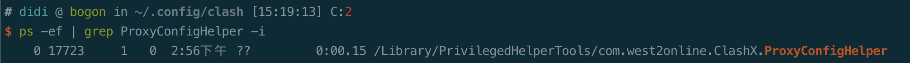

小工具

## 1 ClashX如何上网

原理是ClashX启动了7899端口（默认是7890），然后在网络-> 代理，设置了下面如图。这样就可以代理。


问题1：ClashX加载配置文件失败，报错RuleSet无法识别

- 在配置文件里删除RuleSet的配置即可

问题2：ClashXPro 无法进行代理？

- 换成ClashX，重新加载配置文件

问题3：配置更新后，无法使用代理？

- 在可以上网的时候，关闭了配置文件的自动更新

问题4：如何让Cisco和ClashX同时工作，公司内网和Google可同时上？

ClashX在选择规则判断，就是走rules的规则，可以自定义。如下配置可

```
rules:
- DOMAIN-SUFFIX,didichuxing.com,DIRECT
- DOMAIN-KEYWORD,didichuxing.com,DIRECT  
- DOMAIN-SUFFIX,xiaojukeji.com,DIRECT
- DOMAIN-KEYWORD,xiaojukeji.com,DIRECT
- GEOIP,CN,Domestic
- MATCH,Others
```

问题4：ProxyConfigHelper的程序需要运行，如果不运行，需要检查WiFi。

