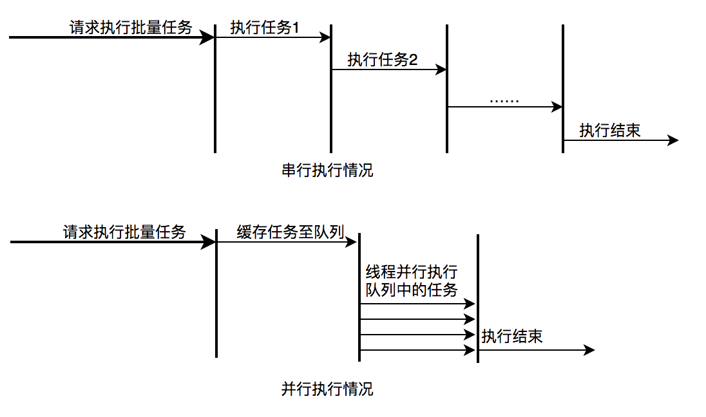

# 问题1Java如何规划线程池的大小

### 1. 如何创建线程池，参数的含义是什么，工作原理是什么？

### 2. 线程池的大小是如何判断的？

- 经验公式 = N * (1 + 线程总时间/线程执行时间)
- 然后根据这个值，上下 调整，进行压测。
- 

> 如何开启JMX，让VisualVM可以收集到数据？

#### 1 线程池设计和使用场景
假如我现在有一种线程池设计：只设置最大线程数，每来一个任务就创建一个线程，到达最大线程数时直接触发拒绝策略。请问这种设计和现在常用的固定线程池相比，优缺点是什么，应用场景有什么不同？哪些场景比较适合？
- 好处就是快速响应，快速失败；缺点就是资源利用率低，没有阻塞队列缓冲，没有超时，快速失败。适用场景是低延时场景。

#### 2 线程池的核心线程数如何设置
有一个爬虫，要爬1000个链接，四核机器，如何设置线程池？
- 一般，CPU密集型，N+1; IO密集型，初始值设置2N.
- 这是IO密集型，可以设置为CPU的两倍。（追问：为什么不设置成40） 
- 二分法设置线程数压测，可以测试出来。
- 一个CPU核想跑满100%，理论上 `线程数 = (IO 时间 + CPU计算时间) / CPU 计算时间`; 如果场景是CPU密集型，IO的时间约等于0，此时设置核心线程数维CPU核数。网上认为IO密集型的场景下，IO时间约等于CPU时间，此时应设置core线程数=CPU核数*2。
- Tomcat是请求连接数默认是200。


### ThreadPoolExecutor


ThreadPoolExecutor的运行状态有5种，分别为：


### 2.3 任务执行机制

**2.3.1 任务调度**


ThreadPoolExecutor，几个关键的属性

- corePoolSize，一旦有新任务提交，而线程池当前线程数小于此值，则 create 新的线程（即 core thread 只在新任务提交时创建，但是可以通过调用 prestartCoreThread 、prestartAllCoreThreads 方法改变策略）

- maximumPoolSize，一旦有新任务提交，而线程池当前线程数小于此值且大于 corePoolSize，则进入队列排队，只有队列被填满才会创建新线程

- Keep-alive times，超过 corePoolSize 的线程如果空闲时间超过此值，就会被终止

- Queueing，若小于 corePoolSize 的线程在运行，则 executor 更倾向于增加新线程而不是排队；反之则倾向于排队；若队列满，则创建新线程；若队列满且线程数超过 maximumPoolSize 则 reject；三种排队策略：

  - Direct handoffs，SynchronousQueue，不持有任务，接收到任务直接转交给Executor（newCachedThreadPool采取的是此策略）
  - Unbounded queues，LinkedBlockingQueue，若任务提交数超过 corePoolSize 支持的线程，新任务会持续添加进队列，而 maximumPoolSize 不会生效（newSingledThreadPool、newFixedThreadPool采取的是此策略）
  - Bounded queues，ArrayBlockingQueue，Queue sizes 和 maximum pool 需要相互权衡

- Reject任务后的策略：

  - AbortPolicy，抛异常 RejectedExecutionException（默认策略）
  - CallerRunsPolicy，交由提交线程自己去执行 execute
  - DiscardPolicy，丢弃任务
  - DiscardOldestPolicy，丢弃队列头部任务
  - 自定义 RejectedExecutionHandler

  

* Hook Methods，beforeExecute，afterExecute，若钩子函数或 callback 调用异常，线程会被终止

* Executors常见的 ThreadPool 参数

  - cachedThreadPool

  ```java
      new ThreadPoolExecutor(0, Integer.MAX_VALUE,
                                    60L, TimeUnit.SECONDS,
                                    new SynchronousQueue<Runnable>());
  ```

  - fixedThreadPool

  ```java
  	new ThreadPoolExecutor(nThreads, nThreads,
                                0L, TimeUnit.MILLISECONDS,
                                new LinkedBlockingQueue<Runnable>());
  ```

### 2.4 Worker线程

线程池为了掌握线程的状态并维护线程的生命周期，设计了线程池内的工作线程Worker。我们来看一下它的部分代码：

```Java
private final class Worker extends AbstractQueuedSynchronizer implements Runnable{
    final Thread thread;//Worker持有的线程
    Runnable firstTask;//初始化的任务，可以为null
}
```

### 3.1 业务背景

让我们来看两个典型的使用线程池获取并发性的场景。

**场景1：快速响应用户请求**

**描述**：用户发起的实时请求，服务追求响应时间。比如说用户要查看一个商品的信息，那么我们需要将商品维度的一系列信息如商品的价格、优惠、库存、图片等等聚合起来，展示给用户。

**分析**：从用户体验角度看，这个结果响应的越快越好，如果一个页面半天都刷不出，用户可能就放弃查看这个商品了。而面向用户的功能聚合通常非常复杂，伴随着调用与调用之间的级联、多级级联等情况，业务开发同学往往会选择使用线程池这种简单的方式，将调用封装成任务并行的执行，缩短总体响应时间。另外，使用线程池也是有考量的，这种场景最重要的就是获取最大的响应速度去满足用户，所以应该不设置队列去缓冲并发任务，调高corePoolSize和maxPoolSize去尽可能创造多的线程快速执行任务。


**场景2：快速处理批量任务**

**描述**：离线的大量计算任务，需要快速执行。比如说，统计某个报表，需要计算出全国各个门店中有哪些商品有某种属性，用于后续营销策略的分析，那么我们需要查询全国所有门店中的所有商品，并且记录具有某属性的商品，然后快速生成报表。

**分析**：这种场景需要执行大量的任务，我们也会希望任务执行的越快越好。这种情况下，也应该使用多线程策略，并行计算。但与响应速度优先的场景区别在于，这类场景任务量巨大，并不需要瞬时的完成，而是关注如何使用有限的资源，尽可能在单位时间内处理更多的任务，也就是吞吐量优先的问题。所以应该设置队列去缓冲并发任务，调整合适的corePoolSize去设置处理任务的线程数。在这里，设置的线程数过多可能还会引发线程上下文切换频繁的问题，也会降低处理任务的速度，降低吞吐量。



### 3.2 实际问题及方案思考

线程池使用面临的核心的问题在于：**线程池的参数并不好配置**。一方面线程池的运行机制不是很好理解，配置合理需要强依赖开发人员的个人经验和知识；另一方面，线程池执行的情况和任务类型相关性较大，IO密集型和CPU密集型的任务运行起来的情况差异非常大，这导致业界并没有一些成熟的经验策略帮助开发人员参考。

关于线程池配置不合理引发的故障，公司内部有较多记录，下面举一些例子：

**Case1**：2018年XX页面展示接口大量调用降级：

**事故描述**：XX页面展示接口产生大量调用降级，数量级在几十到上百。

**事故原因**：该服务展示接口内部逻辑使用线程池做并行计算，由于没有预估好调用的流量，导致最大核心数设置偏小，大量抛出RejectedExecutionException，触发接口降级条件，示意图如下：

**Case2**：2018年XX业务服务不可用S2级故障

**事故描述**：XX业务提供的服务执行时间过长，作为上游服务整体超时，大量下游服务调用失败。

**事故原因**：该服务处理请求内部逻辑使用线程池做资源隔离，由于队列设置过长，最大线程数设置失效，导致请求数量增加时，大量任务堆积在队列中，任务执行时间过长，最终导致下游服务的大量调用超时失败。示意图如下：


图15 线程池队列长度设置过长、corePoolSize设置过小导致任务执行速度低


业务中要使用线程池，而使用不当又会导致故障，那么我们怎样才能更好地使用线程池呢？针对这个问题，我们下面延展几个方向：

- 能不能不用多线程
- 怎么设置合理的参数
- 参数能否动态调节

### 3.3 动态化线程池

**3.3.1 整体设计**

动态化线程池的核心设计包括以下三个方面：

1. 简化线程池配置：线程池构造参数有8个，但是最核心的是3个：corePoolSize、maximumPoolSize，workQueue，它们最大程度地决定了线程池的任务分配和线程分配策略。考虑到在实际应用中我们获取并发性的场景主要是两种：（1）并行执行子任务，提高响应速度。这种情况下，应该使用同步队列，没有什么任务应该被缓存下来，而是应该立即执行。（2）并行执行大批次任务，提升吞吐量。这种情况下，应该使用有界队列，使用队列去缓冲大批量的任务，队列容量必须声明，防止任务无限制堆积。所以线程池只需要提供这三个关键参数的配置，并且提供两种队列的选择，就可以满足绝大多数的业务需求，Less is More。
2. 参数可动态修改：为了解决参数不好配，修改参数成本高等问题。在Java线程池留有高扩展性的基础上，封装线程池，允许线程池监听同步外部的消息，根据消息进行修改配置。将线程池的配置放置在平台侧，允许开发同学简单的查看、修改线程池配置。
3. 增加线程池监控：对某事物缺乏状态的观测，就对其改进无从下手。在线程池执行任务的生命周期添加监控能力，帮助开发同学了解线程池状态。


